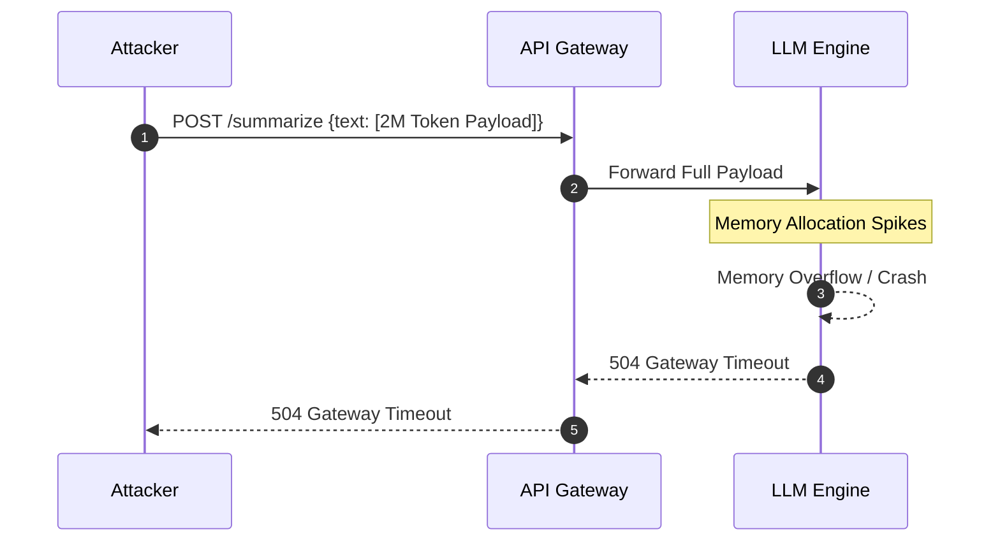
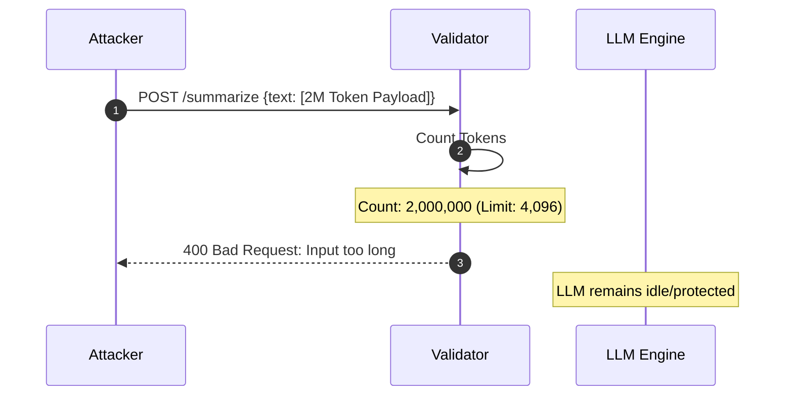
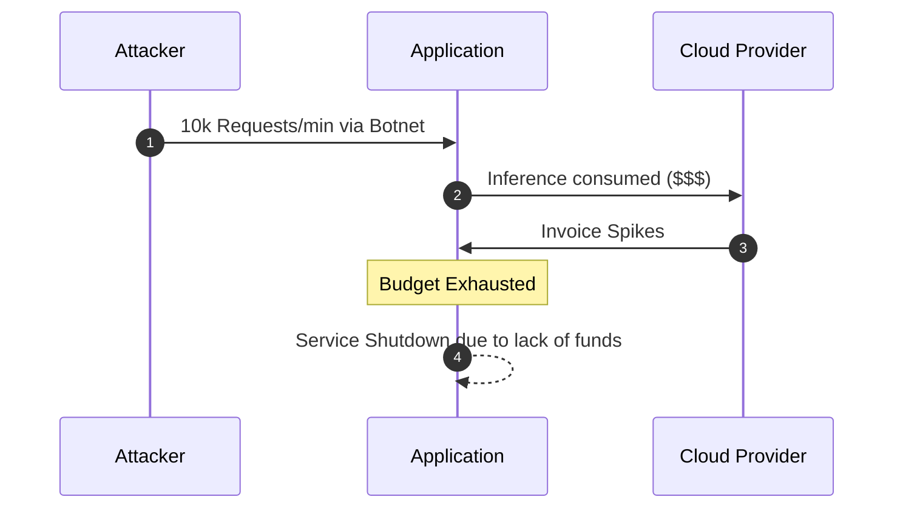
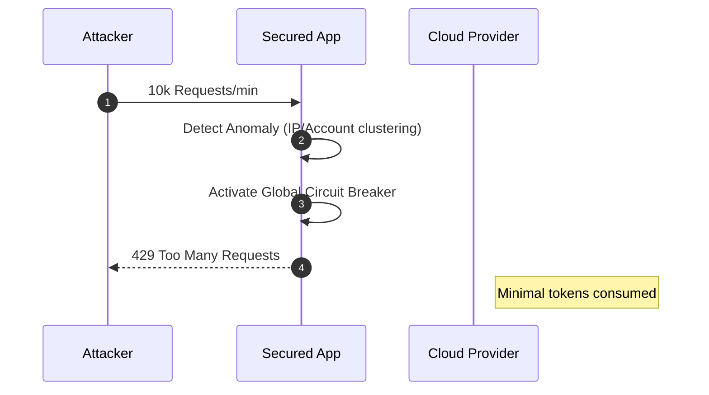
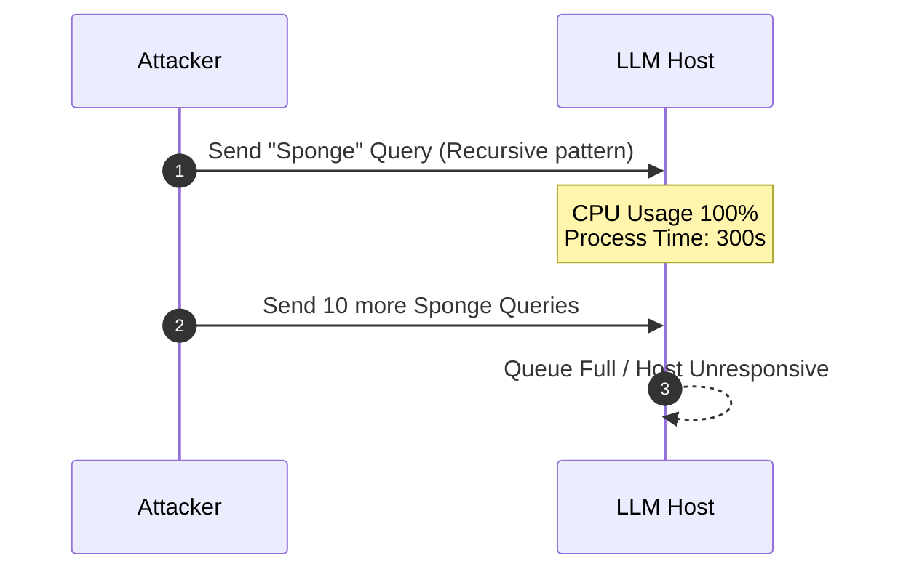
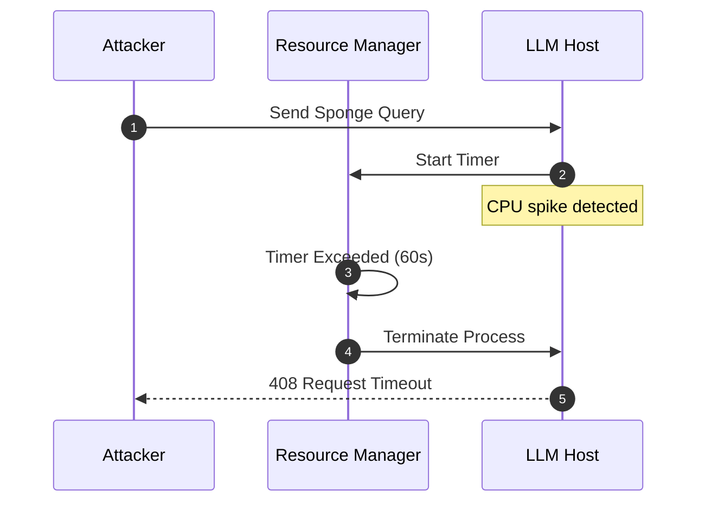
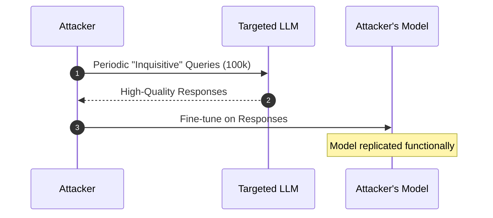
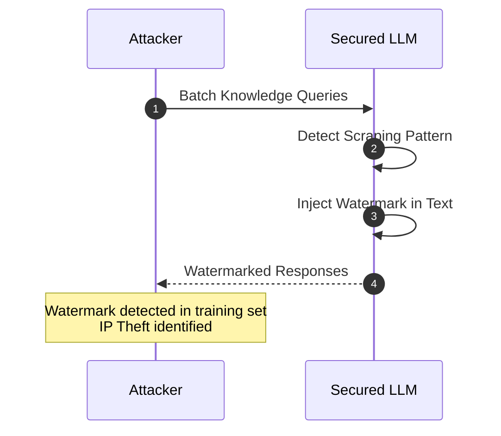

# LLM10:2025 Unbounded Consumption

> [!CAUTION]
> **Legal Disclaimer**: This document is for strictly educational and professional security research purposes. Unauthorized access to computer systems is illegal. The scripts provided are Proof-of-Concept (PoC) intended for use in controlled, lab environments. The author assumes no liability for misuse of this information.

Unbounded Consumption occurs when a Large Language Model (LLM) application allows users to conduct excessive and uncontrolled inferences, leading to risks such as denial of service (DoS), economic losses, model theft, and service degradation.

---

## Table of Contents

- [Overview Diagram](#overview-diagram)
- [Introduction and Core Concepts](#introduction-and-core-concepts)
- [Defense Principles](#defense-principles)
- [Mitigation Strategies](#mitigation-strategies)
- [Real-World Attack Scenarios](#real-world-attack-scenarios)
    - [Scenario 1: Uncontrolled Input Size](#scenario-1-uncontrolled-input-size)
    - [Scenario 2: Denial of Wallet (DoW)](#scenario-2-denial-of-wallet-dow)
    - [Scenario 3: Resource-Intensive Queries](#scenario-3-resource-intensive-queries)
    - [Scenario 4: Functional Model Replication](#scenario-4-functional-model-replication)

---

## Overview Diagram

```mermaid
flowchart TB
    subgraph AttackTypes["Attack Types"]
        VariableLength["Variable-Length Input Flood<br/>• Massive prompts<br/>• Processing overhead"]
        DoW["Denial of Wallet (DoW)<br/>• Cost exhaustion<br/>• API credit depletion"]
        ResIntensive["Resource-Intensive Queries<br/>• Complex patterns<br/>• High CPU/RAM usage"]
        ModelTheft["Model Extraction/Replication<br/>• IP theft<br/>• Shadow model creation"]
        SideChannel["Side-Channel Attacks<br/>• Harvesting weights<br/>• Architecture leak"]
    end

    subgraph AttackVectors["Attack Vectors"]
        PublicAPI["Public Model APIs<br/>• REST endpoints<br/>• External integration"]
        ChatInterfaces["Chat Interfaces<br/>• User input boxes<br/>• Prompt fields"]
        DevPortals["Developer Portals<br/>• API keys usage<br/>• Sandbox environments"]
        InternalServices["Internal Microservices<br/>• Tool-use calls<br/>• Service-to-service"]
    end

    subgraph DefenseMechanisms["Defense Mechanisms"]
        InputVal["Input Validation<br/>• Length constraints<br/>• Token counting"]
        RateLimiting["Rate Limiting<br/>• User quotas<br/>• Throttling"]
        ResourceMgmt["Resource Allocation<br/>• Dynamic scaling<br/>• Timeouts"]
        Monitoring["Anomaly Detection<br/>• Usage patterns<br/>• Cost alerts"]
        AccessControl["Access Controls<br/>• RBAC/Least privilege<br/>• MLOps governance"]
        OutputSecurity["Logit Obfuscation<br/>• Hide probabilities<br/>• Watermarking"]
    end

    subgraph AttackImpact["Attack Impact"]
        DoS["Denial of Service<br/>• System crash<br/>• Latency spikes"]
        EconomicLoss["Financial Ruin<br/>• Sustainability risk<br/>• High cloud bills"]
        IPTheft["Intellectual Property Loss<br/>• Model replication<br/>• Competitive disadvantage"]
        ServiceDegradation["Service Degradation<br/>• Partial failure<br/>• Poor user experience"]
    end

    %% Connections
    PublicAPI --> VariableLength
    PublicAPI --> DoW
    ChatInterfaces --> VariableLength
    DevPortals --> ModelTheft
    InternalServices --> SideChannel

    VariableLength --> DoS
    DoW --> EconomicLoss
    ResIntensive --> ServiceDegradation
    ModelTheft --> IPTheft
    SideChannel --> IPTheft

    InputVal -.->|Prevents| VariableLength
    RateLimiting -.->|Mitigates| DoW
    ResourceMgmt -.->|Protects| ResIntensive
    Monitoring -.->|Detects| DoW
    AccessControl -.->|Blocks| ModelTheft
    OutputSecurity -.->|Slows| SideChannel

    %% Styling
    classDef attackType fill:#ffcccc,stroke:#ff0000,stroke-width:3px,color:#000000
    classDef attackVector fill:#ffe6cc,stroke:#ff6600,stroke-width:2px,color:#000000
    classDef defense fill:#ccffcc,stroke:#00aa00,stroke-width:2px,color:#000000
    classDef impact fill:#ffccff,stroke:#aa00aa,stroke-width:2px,color:#000000

    class VariableLength,DoW,ResIntensive,ModelTheft,SideChannel attackType
    class PublicAPI,ChatInterfaces,DevPortals,InternalServices attackVector
    class InputVal,RateLimiting,ResourceMgmt,Monitoring,AccessControl,OutputSecurity defense
    class DoS,EconomicLoss,IPTheft,ServiceDegradation impact

    style AttackTypes fill:#ffffff10,stroke:#ff0000,stroke-width:2px
    style AttackVectors fill:#ffffff10,stroke:#ff6600,stroke-width:2px
    style DefenseMechanisms fill:#ffffff10,stroke:#00aa00,stroke-width:2px
    style AttackImpact fill:#ffffff10,stroke:#aa00aa,stroke-width:2px
```

### Key Relationships
- **Input Control vs. Volumetric Attacks**: Input validation and rate limiting are the primary defenses against volumetric floods and financial exhaustion (DoW).
- **Resource Management vs. CPU Spikes**: Advanced Resource Allocation and Timeouts prevent complex queries from taking down entire nodes.
- **Access Control vs. Theft**: RBAC and MLOps automation restrict the ability for users (even internal) to perform large-scale model extraction.

---

## Introduction and Core Concepts

### Definition
Unbounded Consumption is a vulnerability where an LLM application fails to set or enforce limits on the volume, complexity, or size of user-driven inference requests. Because LLMs are computationally "expensive" by design, an attacker can intentionally or unintentionally trigger processes that consume massive amounts of CPU, RAM, or GPU resources, along with financial credits in pay-per-token models.

### How the Attack Works
LLM inference is not a constant-time operation. The cost and duration of generating a response scale with:
1.  **Input Length**: The number of tokens in the prompt.
2.  **Output Length**: The requested depth of the response.
3.  **Model Complexity**: The number of layers and parameters activated.
4.  **Sampling Parameters**: Requests for multiple "n" completions or high logprobs increases computation.

Attackers exploit these scaling factors to create "asymmetric" requests—where a small input (or many small inputs) triggers a massive resource expenditure on the backend.

### Attack Vectors
- **Volumetric Flood**: Sending thousands of concurrent API requests.
- **Context Window Exhaustion**: Forcing the model to process inputs at the absolute limit of its "memory" (context window), maximizing quadratic self-attention costs.
- **Model Harvesting**: Systematically querying the model to extract its internal logic or "distill" its knowledge into a smaller, cheaper competitor model.
- **Side-Channel Exploitation**: Using timing or error analysis of input filtering to map model architecture.

---

## Defense Principles

1.  **Strict Boundary Enforcement**: Never allow the internal system to receive raw, unlimited user input. Everything must be filtered and capped before reaching the model.
2.  **Tiered Resource Allocation**: Assign different resource limits based on user identity, subscription level, or risk profile.
3.  **Observability-Driven Defense**: Security must be tied to telemetry. If consumption spikes above a baseline, automated throttling should engage.
4.  **Least Privilege Model Access**: Treat model weights and high-fidelity API outputs (logits/logprobs) as sensitive secrets.

---

## Mitigation Strategies

### Primary Mitigation Techniques
- **Input Validation & Token Limits**: Enforce hard caps on prompt length and the number of distinct requests in a "burst."
- **Rate Limiting & Quotas**: Implement token-bucket or leaky-bucket algorithms linked to user accounts or IP addresses.
- **Cost-Aware Monitoring**: Integrate cloud billing APIs with security dashboards to detect "Denial of Wallet" patterns in real-time.
- **Dynamic Resource Throttling**: Automatically reduce the priority of resource-heavy queries during peak loads.
- **Adversarial Robustness Training**: Fine-tune models to recognize and refuse "Sponge Examples"—prompts specifically crafted to maximize energy/latency.

### Alternative Approaches
- **Caching**: Store common query results to avoid redundant inference.
- **Model Distillation for Checkers**: Use smaller, faster models to pre-process and validate prompts before passing them to the expensive primary model.

---

## Real-World Attack Scenarios

### Scenario 1: Uncontrolled Input Size
An attacker identifies an LLM-based summarization tool that lacks input length checks. They submit a prompt containing the entire text of a 1000-page book duplicated ten times.

**Attack Flow:**
1.  Attacker crafts a massive text payload (e.g., 2 million tokens).
2.  The application sends the entire payload to the inference engine.
3.  The engine attempts to allocate memory for the attention mechanism, which scales poorly with length.
4.  The server exhausts its RAM/VRAM, causing a system crash or extreme latency for all other users.

**Mitigation Application:**
1.  **Token Counting**: The API Gateway pre-calculates the number of tokens.
2.  **Hard Max-Length**: If tokens > 4096, reject the request immediately.
3.  **Streaming Checks**: For long-running inputs, terminate the stream if limits are exceeded.

---

### Scenario 2: Denial of Wallet (DoW)
An attacker utilizes a botnet to send a continuous stream of legitimate-looking but redundant queries to a paid API service (e.g., GPT-4o).

**Attack Flow:**
1.  Attacker creates 1,000 trial accounts or uses stolen API keys.
2.  Distributed bots send 10,000 requests per minute.
3.  Each request costs $0.03.
4.  Within hours, the service provider incurs thousands of dollars in cloud costs, depleting their operational budget.

**Mitigation Application:**
1.  **User Quotas**: Daily/Monthly spending caps per user.
2.  **Anomaly Detection**: Flags accounts with sudden, non-human usage patterns.
3.  **Progressive Delay**: Increase wait times for users who exceed a frequency threshold.

---

### Scenario 3: Resource-Intensive Queries
An attacker crafts a prompt using "Sponge Examples"—complex linguistic patterns or recursive logic that are difficult for the model's architecture to process efficiently.

**Attack Flow:**
1.  Attacker identifies a specific prompt pattern that triggers high CPU usage in the model.
2.  Attacker sends multiple such "Sponge" queries.
3.  Processes hang or slow down significantly, causing a "Slow DoS" (SDoS).

**Mitigation Application:**
1.  **Timeouts**: Kill any inference process taking more than N seconds.
2.  **Resource Throttling**: Limit the CPU/GPU percentage a single user's thread can occupy.
3.  **Output Length Cap**: Force-terminate generation if token limit reached.

---

### Scenario 4: Functional Model Replication
A competitor programmatically queries the target model's API to generate a massive synthetic dataset, which they use to fine-tune their own proprietary model.

**Attack Flow:**
1.  Attacker creates a list of 100,000 domain-specific questions.
2.  Automated script queries the LLM API for answers.
3.  Attacker saves the (Question, Answer) pairs.
4.  Attacker fine-tunes a smaller model using this data, effectively "stealing" the high-end model's behavior.

**Mitigation Application:**
1.  **Output Obfuscation**: Do not return logprobs or logit_bias.
2.  **Watermarking**: Embed subtle, deterministic patterns in the output tokens to detect if data is used for training.
3.  **Usage Pattern Analysis**: Detect "Knowledge Graph Scraping" patterns.

