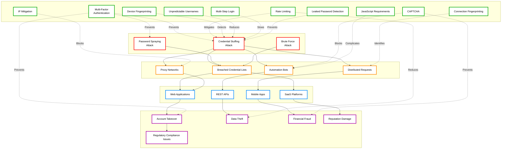
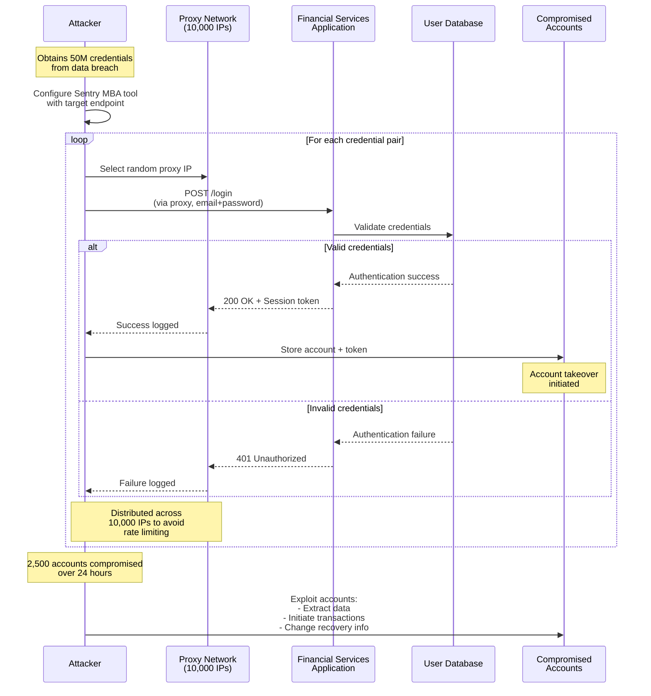
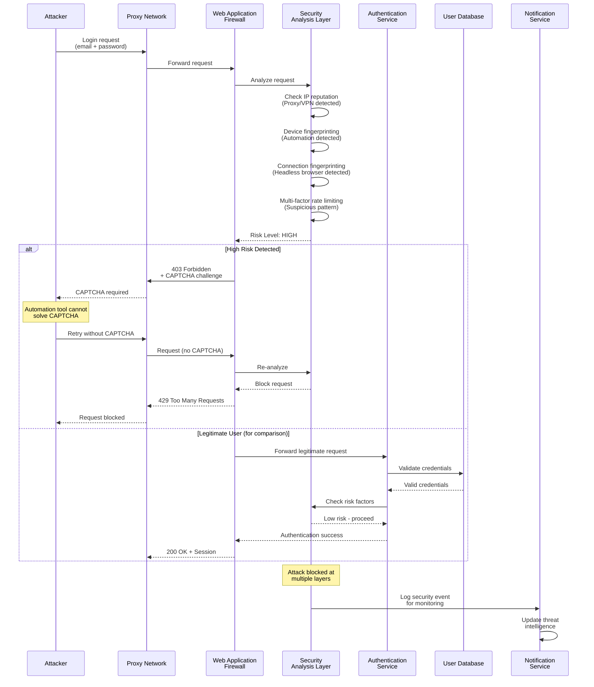
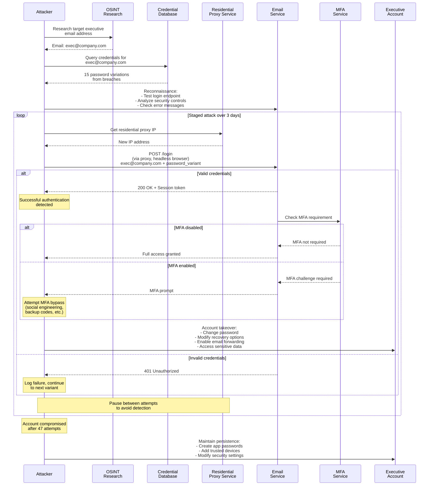
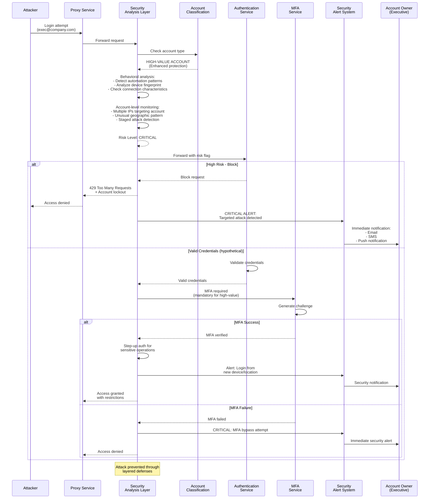
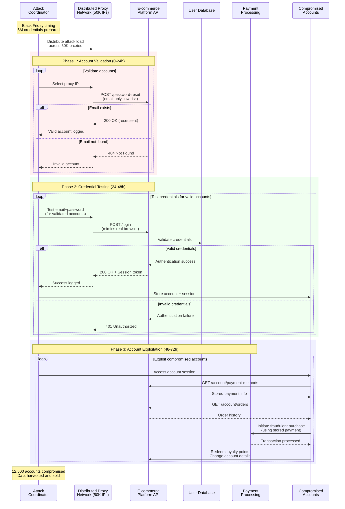
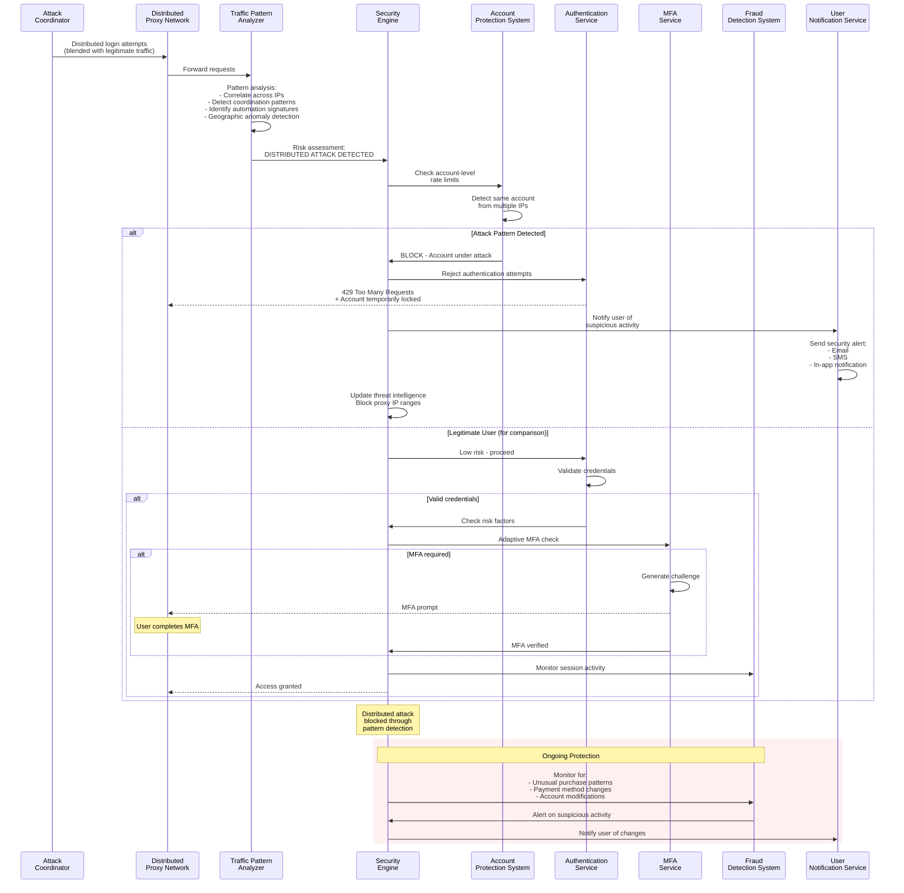

# Credential Stuffing: Technical Security Document

> [!CAUTION]
> **Legal Disclaimer**: This document is for strictly educational and professional security research purposes. Unauthorized access to computer systems is illegal. The scripts provided are Proof-of-Concept (PoC) intended for use in controlled, lab environments. The author assumes no liability for misuse of this information.

## Table of Contents

1. [Overview Diagram](#overview-diagram)
2. [Introduction and Core Concepts](#introduction-and-core-concepts)
3. [Defense Principles](#defense-principles)
4. [Mitigation Strategies](#mitigation-strategies)
5. [Real-World Attack Scenarios](#real-world-attack-scenarios)
   - [Scenario 1: Automated Credential Stuffing via Proxy Network](#scenario-1-automated-credential-stuffing-via-proxy-network)
   - [Scenario 2: Targeted Credential Stuffing with Account Takeover](#scenario-2-targeted-credential-stuffing-with-account-takeover)
   - [Scenario 3: Distributed Credential Stuffing Against E-commerce Platform](#scenario-3-distributed-credential-stuffing-against-e-commerce-platform)

---

## Overview Diagram

### Legend

**Color Coding:**
- **Red Border**: Attack Types - The different methods attackers use to compromise accounts
- **Orange Border**: Attack Vectors - The tools and techniques used to deliver attacks
- **Blue Border**: Contexts - The environments and platforms where attacks occur
- **Green Border**: Defenses - Security mechanisms to prevent or mitigate attacks
- **Purple Border**: Impacts - The consequences and damages resulting from successful attacks

**Arrow Types:**
- **Solid Arrows (→)**: Direct relationships and dependencies between concepts
- **Dashed Arrows (-.->)**: Mitigation and prevention relationships (defenses acting against attacks/impacts)

### Key Relationships

1. **Attack Types → Attack Vectors**: Credential stuffing attacks rely on breached credential lists, proxy networks, automation bots, and distributed request patterns to execute successfully.

2. **Attack Vectors → Contexts**: Different attack vectors target various application contexts (web applications, APIs, mobile apps, SaaS platforms), each with unique characteristics and vulnerabilities.

3. **Contexts → Impacts**: Successful attacks across different contexts lead to various impacts including account takeover, data theft, financial fraud, reputation damage, and regulatory compliance violations.

4. **Defenses → Attack Types**: Multiple defense mechanisms work together to prevent, detect, and mitigate credential stuffing attacks. Multi-factor authentication is the most effective single defense, while layered defenses provide comprehensive protection.

5. **Defenses → Impacts**: Effective defense implementation prevents or reduces the severity of attack impacts, protecting organizations and users from the consequences of credential stuffing.

6. **Layered Defense Strategy**: The diagram illustrates that no single defense is sufficient; a defense-in-depth approach combining multiple techniques (MFA, rate limiting, CAPTCHA, fingerprinting, etc.) provides the strongest protection against credential stuffing attacks.

---

## Introduction and Core Concepts

### Definition

Credential stuffing is a type of cyberattack where attackers use automated tools to test large volumes of username and password combinations obtained from data breaches on other websites or services. Unlike brute-force attacks that attempt to guess passwords, credential stuffing exploits the common practice of users reusing the same credentials across multiple platforms.

The attack operates on the principle that many users maintain identical or similar login credentials across different online services. When a data breach occurs at one service, the exposed credentials become valuable assets for attackers who can then test these credentials against other services where users may have reused them.

### How the Attack Works

Credential stuffing attacks follow a systematic process:

1. **Credential Acquisition**: Attackers obtain username/password pairs from various sources:
   - Public data breach dumps shared on dark web forums
   - Paste sites and credential repositories
   - Previous successful breaches of other services
   - Social engineering and phishing campaigns

2. **Credential List Preparation**: The acquired credentials are organized, cleaned, and formatted into lists suitable for automated testing. These lists often contain millions of credential pairs.

3. **Target Identification**: Attackers identify target applications or services that are likely to have users who reuse credentials. High-value targets include:
   - Financial services
   - E-commerce platforms
   - Social media networks
   - Email providers
   - Corporate applications

4. **Automation Setup**: Attackers configure automated tools (such as Sentry MBA, OpenBullet, or custom scripts) to:
   - Distribute requests across multiple IP addresses using proxy networks
   - Mimic legitimate browser behavior
   - Handle various authentication mechanisms
   - Parse responses to identify successful logins

5. **Execution**: The automated tools systematically attempt to authenticate using each credential pair:
   - Requests are distributed across proxy networks to avoid detection
   - Rate limiting is circumvented by spreading attempts across many IPs
   - Failed attempts are logged for analysis
   - Successful authentications trigger account takeover procedures

6. **Account Exploitation**: Once valid credentials are identified, attackers:
   - Access user accounts
   - Extract sensitive information
   - Perform unauthorized transactions
   - Use compromised accounts for further attacks

### Impact

Credential stuffing attacks have severe consequences for both organizations and end users:

**For Organizations:**
- **Account Takeover**: Unauthorized access to user accounts leads to loss of customer trust and potential legal liability
- **Data Breaches**: Compromised accounts may provide access to sensitive personal and financial information
- **Financial Losses**: Direct financial fraud, regulatory fines, and costs associated with incident response
- **Reputation Damage**: Public disclosure of security incidents can significantly harm brand reputation
- **Operational Disruption**: High-volume attacks can impact system performance and availability
- **Regulatory Compliance Violations**: Failure to protect user accounts may violate GDPR, CCPA, PCI-DSS, and other regulations

**For End Users:**
- **Identity Theft**: Personal information exposed through compromised accounts
- **Financial Fraud**: Unauthorized transactions and account draining
- **Privacy Violations**: Access to private communications, photos, and personal data
- **Account Lockouts**: Legitimate users may be locked out when attackers trigger security mechanisms
- **Cascading Compromises**: One compromised account may lead to compromise of other accounts using the same credentials

### Attack Vectors

Credential stuffing attacks leverage several vectors to maximize success rates and avoid detection:

1. **Proxy Networks and VPNs**: Attackers use large proxy networks, VPN services, and residential proxy services to distribute authentication attempts across thousands of IP addresses, making it difficult to identify and block the attack traffic.

2. **Automation Frameworks**: Specialized tools like Sentry MBA, OpenBullet, and custom scripts enable attackers to:
   - Test millions of credentials efficiently
   - Handle various authentication mechanisms
   - Bypass basic security controls
   - Scale attacks across multiple targets simultaneously

3. **Headless Browsers**: Some attacks use headless browser automation (Selenium, Puppeteer) to execute JavaScript and mimic real user behavior, bypassing defenses that rely on JavaScript execution.

4. **Distributed Architecture**: Attacks are distributed across:
   - Multiple IP addresses
   - Different geographic locations
   - Various time periods
   - Multiple user agents and device fingerprints

5. **Credential List Sources**: Attackers leverage:
   - Public data breach repositories
   - Dark web marketplaces
   - Paste sites and forums
   - Previous successful breaches
   - Social engineering campaigns

6. **Timing Strategies**: Attackers may:
   - Spread attacks over extended periods to avoid detection
   - Target off-peak hours when monitoring may be reduced
   - Use burst patterns to overwhelm defenses
   - Coordinate attacks across multiple services simultaneously

---

## Defense Principles

### Core Principles for Protection

Effective defense against credential stuffing requires adherence to several fundamental security principles:

1. **Defense in Depth**: No single security control is sufficient. Multiple layers of defense must work together to provide comprehensive protection. Each layer should be capable of detecting and mitigating attacks independently, ensuring that if one layer fails, others continue to provide protection.

2. **Risk-Based Approach**: Security controls should be implemented based on risk assessment. High-value accounts (administrators, financial accounts) should have stronger protections than standard user accounts. The level of security should match the sensitivity of the data and operations accessible through the account.

3. **User Experience Balance**: Security measures must balance protection with usability. Overly aggressive security controls can frustrate legitimate users and drive them away. Adaptive security that increases protection based on risk signals provides better user experience while maintaining security.

4. **Continuous Monitoring**: Credential stuffing attacks are constantly evolving. Organizations must continuously monitor for new attack patterns, update defenses, and adjust thresholds based on observed attack behavior and legitimate user patterns.

5. **Metrics and Analytics**: Every defense mechanism should generate metrics that enable:
   - Detection of attack patterns
   - Measurement of defense effectiveness
   - Identification of false positives
   - Optimization of security controls

6. **Fail-Safe Defaults**: Security controls should default to the most secure configuration. When in doubt, err on the side of caution. Temporary mitigations should have automatic expiration to prevent permanent lockouts of legitimate users.

7. **Transparency and User Communication**: Users should be informed about security events affecting their accounts. Providing visibility into login history, active sessions, and security events empowers users to detect and report suspicious activity.

### When and Where to Apply Defenses

Defenses should be applied at multiple points in the authentication and application architecture:

**At the Authentication Endpoint:**
- Rate limiting and request throttling
- CAPTCHA challenges
- Device and connection fingerprinting
- IP reputation checking
- Multi-factor authentication prompts

**During User Registration:**
- Password strength requirements
- Leaked password detection
- Username uniqueness and unpredictability requirements
- Initial security configuration

**Throughout the User Session:**
- Session monitoring and anomaly detection
- Step-up authentication for sensitive operations
- Concurrent session management
- Geographic and behavioral anomaly detection

**At the Infrastructure Level:**
- Network-level rate limiting
- DDoS protection
- WAF (Web Application Firewall) rules
- Load balancer security features

**In Application Logic:**
- Account lockout mechanisms
- Suspicious activity detection
- User notification systems
- Security event logging

**For High-Risk Operations:**
- Additional authentication for:
  - Password changes
  - Email address modifications
  - Financial transactions
  - Administrative actions
  - Sensitive data access

The specific combination of defenses should be tailored to:
- The type of application (consumer-facing vs. enterprise)
- The sensitivity of data and operations
- Regulatory requirements
- User base characteristics
- Threat landscape and attack frequency
- Available security budget and resources

---

## Mitigation Strategies

### Primary Mitigation Techniques

#### 1. Multi-Factor Authentication (MFA)

**Description**: Multi-factor authentication requires users to provide additional authentication factors beyond just a password. This is the most effective single defense against credential stuffing, with analysis suggesting it prevents 99.9% of account compromises.

**How It Works**: After successful password authentication, users must provide a second factor such as:
- Time-based one-time passwords (TOTP) from authenticator apps
- SMS or email verification codes
- Hardware security keys (FIDO2/WebAuthn)
- Biometric authentication
- Push notifications to registered devices

**Implementation Considerations**:
- **Adaptive MFA**: Require MFA only when risk indicators are present (new device, unusual location, suspicious IP)
- **Step-Up Authentication**: Prompt for MFA when users attempt high-risk operations
- **Trusted Networks**: Allow MFA bypass for known trusted IP ranges (enterprise environments)
- **Recovery Mechanisms**: Provide secure account recovery options for users who lose access to their MFA device
- **User Education**: Ensure users understand the importance of MFA and how to use it properly

**When to Use**: MFA should be implemented wherever possible, with mandatory enforcement for high-privilege accounts. Modern browsers and mobile devices support FIDO2 Passkeys, making MFA feasible for most use cases.

#### 2. Rate Limiting and Request Throttling

**Description**: Rate limiting restricts the number of authentication attempts from a single source (IP address, user account, device) within a specified time period.

**How It Works**: 
- Track authentication attempts per identifier
- Enforce limits (e.g., 5 attempts per IP per 15 minutes)
- Implement graduated responses: CAPTCHA after threshold, temporary lockout after excessive attempts
- Use sliding window or token bucket algorithms

**Implementation Considerations**:
- **Multi-Factor Rate Limiting**: Consider multiple factors simultaneously (IP + username + device fingerprint)
- **Distributed Rate Limiting**: Use distributed caching (Redis, Memcached) for accurate tracking across load-balanced servers
- **Burst Protection**: Implement both short-term (burst) and long-term (sustained) rate limits
- **Whitelisting**: Allow higher limits for known legitimate sources
- **Progressive Delays**: Increase response time for suspicious requests rather than immediate blocking

**When to Use**: Essential for all authentication endpoints. Should be combined with other defenses as attackers can distribute requests across many IPs.

#### 3. CAPTCHA and Bot Detection

**Description**: CAPTCHA (Completely Automated Public Turing test to tell Computers and Humans Apart) challenges help distinguish human users from automated bots.

**How It Works**: Users must solve puzzles or challenges that are difficult for automated systems:
- Image recognition challenges
- Text-based puzzles
- Behavioral analysis (mouse movements, typing patterns)
- Invisible CAPTCHAs that analyze user behavior in the background

**Implementation Considerations**:
- **Risk-Based CAPTCHA**: Only require CAPTCHA for suspicious requests to improve user experience
- **CAPTCHA Monitoring**: Track solve rates to detect automated CAPTCHA-solving services
- **Accessibility**: Ensure CAPTCHA solutions are accessible to users with disabilities
- **Alternative Challenges**: Provide alternative authentication methods for users who cannot complete CAPTCHAs
- **CAPTCHA Rotation**: Use multiple CAPTCHA providers to reduce effectiveness of solving services

**When to Use**: Effective for blocking low-sophistication attacks. Should be combined with other defenses as CAPTCHAs can be solved by automated services.

#### 4. Device and Connection Fingerprinting

**Description**: Device fingerprinting creates unique identifiers based on device characteristics, while connection fingerprinting analyzes network connection patterns.

**Device Fingerprinting**:
- Collects attributes: browser type, OS version, screen resolution, installed fonts, plugins, timezone, language
- Creates a unique fingerprint for each device
- Compares login attempts against known device fingerprints
- Flags anomalies for additional authentication

**Connection Fingerprinting**:
- Analyzes TLS/SSL handshake patterns (JA3 fingerprinting)
- Examines HTTP/2 connection characteristics
- Reviews HTTP header order and structure
- Identifies automation tools and headless browsers

**Implementation Considerations**:
- **Fingerprint Storage**: Securely store and manage device fingerprints associated with user accounts
- **Multi-Device Support**: Allow users to manage multiple trusted devices
- **Fingerprint Spoofing**: Be aware that some attributes can be spoofed; use multiple attributes for reliability
- **Privacy Concerns**: Ensure compliance with privacy regulations when collecting device information
- **JavaScript Requirements**: Device fingerprinting typically requires JavaScript execution

**When to Use**: Effective for detecting account access from new or suspicious devices. Particularly useful for adaptive authentication systems.

#### 5. IP Reputation and Intelligence

**Description**: Leverage IP address intelligence to identify and mitigate traffic from suspicious sources.

**How It Works**:
- Check IP addresses against reputation databases
- Identify IPs associated with:
  - Known proxy and VPN services
  - Hosting providers and data centers
  - Tor exit nodes
  - Previously flagged malicious IPs
  - Geographic anomalies
- Apply graduated responses based on IP classification

**Implementation Considerations**:
- **IP Intelligence Sources**: Use both commercial and public IP intelligence services
- **Hosting Provider Detection**: Require additional authentication for requests from hosting providers
- **Geographic Analysis**: Flag logins from unusual countries or rapid geographic changes
- **Temporary Mitigations**: Use temporary blocks that automatically expire
- **False Positive Management**: Implement processes to quickly whitelist legitimate IPs

**When to Use**: Effective as part of a layered defense. Should not be the sole defense as IPs can be easily changed.

#### 6. Leaked Password Detection

**Description**: Check user passwords against databases of known compromised passwords from previous data breaches.

**How It Works**:
- During password creation or change, check the password against breach databases
- Use services like Have I Been Pwned (Pwned Passwords) or commercial alternatives
- Prevent users from setting passwords that appear in breach databases
- Optionally check existing passwords and prompt users to change compromised ones

**Implementation Considerations**:
- **API Integration**: Use k-anonymity APIs (like Pwned Passwords API) to check passwords without sending full passwords
- **Self-Hosted Options**: Consider self-hosting breach databases for sensitive environments
- **User Communication**: Clearly explain why certain passwords are rejected
- **Password Hashing**: Ensure API calls use hashed password prefixes, not plaintext passwords
- **Performance**: Implement caching to reduce API call overhead

**When to Use**: Essential during password registration and change processes. Helps prevent users from using already-compromised passwords.

### Alternative Approaches

#### 1. Unpredictable Usernames

**Description**: Require users to create unique usernames instead of using email addresses, making it harder for attackers to identify valid accounts.

**How It Works**:
- Allow users to choose custom usernames during registration
- Optionally generate random usernames for users
- Ensure usernames are not predictable (avoid sequential IDs, name-based patterns)
- Prevent username enumeration attacks

**When to Use**: Effective for reducing the success rate of credential stuffing when combined with email-based usernames in breach lists. May impact user experience.

#### 2. Multi-Step Login Processes

**Description**: Implement multi-step authentication flows that complicate automated attacks.

**How It Works**:
- Separate username and password entry into different steps
- Require CSRF tokens obtained before login
- Implement challenge-response mechanisms
- Add intermediate verification steps

**When to Use**: Effective against simple automation tools. Should be mindful not to facilitate user enumeration. May impact user experience.

#### 3. JavaScript Requirements and Headless Browser Detection

**Description**: Require JavaScript execution and detect headless browser automation.

**How It Works**:
- Require JavaScript to generate tokens or complete authentication
- Detect headless browser characteristics:
  - Missing browser plugins
  - Incomplete WebDriver properties
  - Unusual user agent strings
  - Missing browser APIs
- Block or challenge requests from detected automation

**When to Use**: Effective against simple automation tools. Less effective against sophisticated attackers using real browsers. Note: Blocking JavaScript reduces accessibility.

#### 4. Degradation Techniques

**Description**: Implement measures that slow down attacks without blocking legitimate users.

**How It Works**:
- Incrementally increase JavaScript complexity for suspicious requests
- Require proof-of-work computational puzzles
- Introduce artificial delays before responding
- Return randomized error messages to complicate response parsing

**When to Use**: Useful as a supplementary defense. Requires careful tuning to avoid impacting legitimate users. May not stop determined attackers.

#### 5. Secondary Passwords and Security Questions

**Description**: Require additional authentication factors beyond the primary password.

**How It Works**:
- Prompt for PINs, secondary passwords, or security question answers
- Request specific characters from a memorable word
- Note: This is NOT true MFA (still "something you know")

**When to Use**: Provides additional protection when true MFA cannot be implemented. Less secure than proper MFA but better than password-only authentication.

#### 6. User Notification and Account Management

**Description**: Inform users about security events and provide tools to manage account security.

**How It Works**:
- Notify users of suspicious login attempts
- Display login history (date, time, location, device)
- Allow users to view and terminate active sessions
- Provide account security dashboards

**When to Use**: Essential for user awareness and early detection. Helps users identify and respond to account compromises quickly.

### Implementation Considerations

**Defense Coordination**: When multiple teams manage different defenses, ensure coordination during maintenance and deployments to avoid creating security gaps.

**Metrics and Monitoring**: Implement comprehensive logging and metrics for:
- Attack volume and patterns
- Defense effectiveness (blocked vs. detected attacks)
- False positive rates
- User impact measurements

**Testing and Validation**: Regularly test defenses against:
- Known attack tools and techniques
- Legitimate user traffic patterns
- Edge cases and unusual scenarios

**Incident Response**: Establish procedures for:
- Responding to detected attacks
- Handling false positives
- User account recovery
- Communication with affected users

**Compliance and Privacy**: Ensure defenses comply with:
- Data protection regulations (GDPR, CCPA)
- Accessibility requirements
- Industry-specific regulations (PCI-DSS, HIPAA)

**Cost-Benefit Analysis**: Evaluate the cost of implementing and maintaining each defense against:
- The value of protected assets
- Expected attack frequency and sophistication
- User experience impact
- Operational overhead

---

## Real-World Attack Scenarios

### Scenario 1: Automated Credential Stuffing via Proxy Network

#### Attack Flow

This scenario demonstrates a large-scale automated credential stuffing attack using a distributed proxy network to avoid detection and rate limiting.

**Step-by-Step Attack Explanation:**

1. **Credential Acquisition**: Attackers obtain a database containing 50 million email/password pairs from a previous data breach of a popular social media platform. The credentials are organized into a format suitable for automated testing.

2. **Target Selection**: Attackers identify a financial services application as the target. This application uses email addresses as usernames and has a large user base, making it likely that many users have reused credentials from the breached social media platform.

3. **Tool Configuration**: Attackers configure Sentry MBA (a credential stuffing tool) with:
   - The target application's login endpoint URL
   - Request headers to mimic legitimate browsers
   - Response parsing rules to identify successful logins
   - Proxy list containing 10,000 residential proxy IPs

4. **Attack Launch**: The tool begins systematically testing credentials:
   - Each credential pair is tested via a different proxy IP
   - Requests are spaced out to appear as normal user traffic
   - Failed attempts return standard "invalid credentials" messages
   - Successful logins are logged with session tokens

5. **Traffic Distribution**: The attack distributes 1,000 login attempts per minute across the proxy network:
   - Each proxy IP makes approximately 6 requests per hour
   - This low per-IP rate avoids triggering basic rate limiting
   - Geographic distribution makes the attack appear as global user traffic

6. **Success Identification**: Over 24 hours, the attack identifies 2,500 valid credential pairs (0.005% success rate), representing accounts where users reused their social media passwords.

7. **Account Exploitation**: For each successful login, attackers:
   - Extract account information and financial data
   - Initiate unauthorized transactions
   - Change account recovery information
   - Use compromised accounts for further attacks

#### Attack Workflow Diagram

#### Mitigation Application

To prevent this attack, multiple defense layers must work together to detect and block the distributed credential stuffing attempt.

**Mitigation Strategy:**

1. **IP Reputation Checking**: The application checks each login request's IP address against reputation databases. Requests from known proxy services, VPN providers, and hosting providers are flagged for additional scrutiny.

2. **Device Fingerprinting**: Each login attempt is analyzed for device characteristics. The application detects that requests are coming from automation tools rather than real browsers (missing browser plugins, unusual user agent patterns, inconsistent fingerprint attributes).

3. **Rate Limiting with Multi-Factor Analysis**: Instead of simple per-IP rate limiting, the application implements multi-factor rate limiting considering:
   - IP address reputation
   - Device fingerprint consistency
   - Request patterns (timing, headers, behavior)
   - Geographic anomalies

4. **CAPTCHA Challenges**: Requests from suspicious IPs or with suspicious device fingerprints are required to solve CAPTCHA challenges before authentication proceeds.

5. **Connection Fingerprinting**: The application analyzes TLS handshake patterns and HTTP connection characteristics to identify automation frameworks and headless browsers.

6. **Account-Level Monitoring**: The application monitors for multiple failed login attempts across different IPs targeting the same account, indicating a distributed attack.

7. **Multi-Factor Authentication**: For accounts with suspicious login patterns or from high-risk sources, MFA is required even after successful password authentication.

8. **Graduated Response**: The application implements a graduated response system:
   - Low risk: Normal authentication
   - Medium risk: CAPTCHA challenge
   - High risk: MFA requirement
   - Very high risk: Temporary account lockout with user notification

#### Mitigation Workflow Diagram

---

### Scenario 2: Targeted Credential Stuffing with Account Takeover

#### Attack Flow

This scenario demonstrates a targeted credential stuffing attack where attackers focus on high-value accounts, using sophisticated techniques to bypass basic security controls and achieve account takeover.

**Step-by-Step Attack Explanation:**

1. **Target Research**: Attackers identify a specific high-value target: a corporate executive's email account. Through OSINT (Open Source Intelligence), they discover the executive's email address is used across multiple platforms.

2. **Credential List Compilation**: Attackers compile a focused list of credentials:
   - The executive's email address from various data breaches
   - Common password variations and patterns
   - Previously compromised passwords from other services
   - Password patterns based on personal information (discovered through social media)

3. **Reconnaissance**: Attackers perform reconnaissance on the target email service:
   - Identify the login endpoint and authentication flow
   - Analyze security controls (rate limiting, CAPTCHA, MFA)
   - Test with invalid credentials to understand error messages
   - Identify if the service uses predictable usernames

4. **Tool Selection and Configuration**: Attackers use a custom automation script with:
   - Headless browser automation (Puppeteer) to execute JavaScript
   - Residential proxy rotation to avoid IP-based blocking
   - Request timing randomization to mimic human behavior
   - CAPTCHA solving service integration (for services that require it)

5. **Staged Attack Execution**: The attack proceeds in stages:
   - **Stage 1**: Test 100 credential variations over 2 hours (low volume to avoid detection)
   - **Stage 2**: If no success, pause for 24 hours to avoid triggering account lockouts
   - **Stage 3**: Resume with different proxy IPs and slightly modified approach
   - **Stage 4**: Continue until successful or list exhausted

6. **Successful Authentication**: After testing 47 credential variations over 3 days, attackers successfully authenticate with a password reused from a previous breach.

7. **MFA Bypass Attempt**: The service requires MFA, but attackers:
   - Check if the account has backup codes stored insecurely
   - Attempt social engineering if MFA is SMS-based
   - Look for session hijacking opportunities
   - In this case, the executive had disabled MFA, allowing direct access

8. **Account Takeover**: Once authenticated, attackers:
   - Change the account password immediately
   - Modify account recovery options (security questions, backup email)
   - Enable email forwarding to attacker-controlled account
   - Access sensitive emails and documents
   - Use the account for further attacks (phishing, business email compromise)

9. **Persistence**: Attackers maintain access by:
   - Creating application-specific passwords
   - Adding trusted devices
   - Modifying security settings to prevent detection
   - Using the account for extended periods without raising suspicion

#### Attack Workflow Diagram

#### Mitigation Application

This targeted attack requires sophisticated defenses that can detect subtle attack patterns and protect high-value accounts with enhanced security measures.

**Mitigation Strategy:**

1. **Enhanced Protection for High-Value Accounts**: The email service implements enhanced security for accounts identified as high-value (executives, administrators, financial roles):
   - Mandatory MFA (cannot be disabled)
   - Stricter rate limiting
   - Additional monitoring and alerting
   - Regular security reviews

2. **Account-Level Anomaly Detection**: The system monitors for suspicious patterns specific to individual accounts:
   - Multiple failed login attempts from different IPs
   - Login attempts from unusual geographic locations
   - Rapid password change requests
   - Unusual access patterns after authentication

3. **Behavioral Analysis**: Advanced behavioral analysis detects:
   - Automation patterns in login attempts (timing, mouse movements, keystroke dynamics)
   - Inconsistencies between claimed device and actual connection characteristics
   - Unusual session patterns after authentication

4. **Leaked Password Detection**: During password changes, the system checks new passwords against breach databases and prevents reuse of compromised passwords.

5. **MFA Enforcement**: For high-value accounts, MFA is mandatory and cannot be disabled. The system uses:
   - Hardware security keys (FIDO2) as the preferred method
   - TOTP authenticator apps as backup
   - SMS as last resort with additional verification

6. **Step-Up Authentication**: After authentication, sensitive operations require additional verification:
   - Password changes require MFA confirmation
   - Recovery option changes require multiple verification steps
   - Email forwarding setup requires administrative approval for high-value accounts

7. **Real-Time Alerting**: Security operations center receives real-time alerts for:
   - Multiple failed login attempts on high-value accounts
   - Successful authentication from new devices/locations
   - Password or security setting changes
   - Unusual access patterns

8. **User Notification**: Account owners are immediately notified via multiple channels (email, SMS, push notification) of:
   - Login attempts from new devices
   - Password changes
   - Security setting modifications
   - Suspicious activity

9. **Session Management**: Enhanced session controls:
   - Shorter session timeouts for high-value accounts
   - Concurrent session limits
   - Device registration requirements
   - Session activity monitoring

#### Mitigation Workflow Diagram

---

### Scenario 3: Distributed Credential Stuffing Against E-commerce Platform

#### Attack Flow

This scenario demonstrates a sophisticated distributed credential stuffing attack targeting an e-commerce platform during a high-traffic shopping period, using advanced techniques to blend in with legitimate traffic.

**Step-by-Step Attack Explanation:**

1. **Timing Selection**: Attackers choose to launch the attack during a major shopping event (Black Friday) when the e-commerce platform experiences 10x normal traffic. This timing helps the attack blend in with legitimate user activity.

2. **Credential List Preparation**: Attackers prepare a list of 5 million email/password pairs from various data breaches, focusing on credentials that are likely to be reused on e-commerce platforms.

3. **Infrastructure Setup**: Attackers deploy a distributed attack infrastructure:
   - 50,000 residential proxy IPs from multiple providers
   - Custom automation framework that mimics real browser behavior
   - Distributed across 200 different geographic locations
   - Request timing randomized to match human behavior patterns

4. **Traffic Blending**: The attack is designed to blend with legitimate traffic:
   - Each proxy IP makes 2-3 login attempts per hour (matching normal user behavior)
   - Requests include realistic browser headers and fingerprints
   - JavaScript execution to pass basic bot detection
   - Geographic distribution matches the platform's user base

5. **Multi-Endpoint Testing**: Attackers test credentials against multiple endpoints:
   - Primary login endpoint
   - Mobile app API endpoint
   - Password reset flow (to identify valid accounts)
   - Account recovery endpoints

6. **Account Validation**: Before attempting full authentication, attackers use low-risk methods to validate accounts:
   - Password reset requests (if the email exists, a reset link is sent)
   - Account lookup endpoints (if available)
   - This helps focus the attack on confirmed valid accounts

7. **Staged Authentication**: The attack proceeds in stages over 72 hours:
   - **Hour 0-24**: Account validation phase (identify valid email addresses)
   - **Hour 24-48**: Credential testing phase (test passwords for validated accounts)
   - **Hour 48-72**: Account exploitation phase (access and exploit compromised accounts)

8. **Success Rate**: Out of 5 million credentials tested:
   - 250,000 email addresses are confirmed as valid (5%)
   - 12,500 accounts are successfully compromised (0.25% of total, 5% of valid accounts)

9. **Immediate Exploitation**: For each compromised account, attackers:
   - Access stored payment methods
   - Review order history for valuable items
   - Initiate fraudulent purchases using stored payment methods
   - Redeem loyalty points and gift card balances
   - Change account details to maintain access

10. **Data Harvesting**: Attackers extract valuable data from compromised accounts:
    - Personal information (names, addresses, phone numbers)
    - Payment card information (if stored)
    - Purchase history and preferences
    - Account credentials for other services (if reused)

11. **Secondary Attacks**: Compromised accounts are used for:
    - Phishing campaigns targeting the user's contacts
    - Account takeover of other services using the same credentials
    - Identity theft and fraud
    - Sale of account access on dark web marketplaces

#### Attack Workflow Diagram

#### Mitigation Application

This sophisticated distributed attack requires comprehensive, multi-layered defenses that can detect subtle patterns even when blended with legitimate traffic.

**Mitigation Strategy:**

1. **Traffic Pattern Analysis**: The platform implements advanced traffic analysis that detects:
   - Unusual correlation patterns across distributed IPs
   - Coordinated timing patterns that indicate automation
   - Geographic anomalies (same credentials tested from multiple locations)
   - Request fingerprint clustering (similar automation tools)

2. **Account-Level Rate Limiting**: Beyond IP-based rate limiting, the platform implements:
   - Per-account rate limits across all IPs
   - Detection of the same account being tested from multiple sources
   - Progressive delays for accounts with multiple failed attempts
   - Temporary account locks with user notification

3. **Behavioral Biometrics**: The platform uses behavioral analysis to distinguish humans from bots:
   - Mouse movement patterns
   - Keystroke dynamics
   - Scroll behavior
   - Interaction timing and patterns

4. **Multi-Factor Authentication (Adaptive)**: The platform implements adaptive MFA:
   - Required for logins from new devices or locations
   - Required for high-value transactions
   - Required when risk signals are detected
   - Step-up authentication for sensitive operations

5. **Account Validation Protection**: The platform protects account validation endpoints:
   - Rate limiting on password reset requests
   - CAPTCHA for password reset flows
   - Generic error messages (don't reveal if email exists)
   - Email-based rate limiting

6. **Payment Protection**: Enhanced security for payment-related operations:
   - Re-authentication required for payment method changes
   - Transaction limits and monitoring
   - Fraud detection on unusual purchase patterns
   - Additional verification for high-value transactions

7. **Session Security**: Strong session management:
   - Device registration for trusted devices
   - Concurrent session limits
   - Session activity monitoring
   - Automatic session termination on suspicious activity

8. **Real-Time Threat Intelligence**: Integration with threat intelligence feeds:
   - IP reputation databases
   - Known proxy and VPN services
   - Breached credential databases
   - Attack pattern signatures

9. **Anomaly Detection**: Machine learning-based anomaly detection:
   - Identifies unusual patterns in authentication attempts
   - Correlates events across distributed infrastructure
   - Adapts to new attack patterns
   - Reduces false positives through continuous learning

10. **Incident Response**: Automated response capabilities:
    - Automatic account protection when attacks detected
    - User notification of suspicious activity
    - Security team alerting for investigation
    - Forensic logging for post-incident analysis

#### Mitigation Workflow Diagram

---

## References and Standards

This document is based on industry best practices and standards including:

- **OWASP**: Open Web Application Security Project - Credential Stuffing Prevention Cheat Sheet
- **CWE**: Common Weakness Enumeration - CWE-307 (Improper Restriction of Excessive Authentication Attempts)
- **NIST**: National Institute of Standards and Technology - Digital Identity Guidelines
- **PCI-DSS**: Payment Card Industry Data Security Standard - Requirements for authentication
- **GDPR**: General Data Protection Regulation - Requirements for personal data protection
- **FIDO Alliance**: Fast IDentity Online - Standards for passwordless authentication

---

*Document Version: 1.0*  
*Last Updated: 2024*

