```mermaid
sequenceDiagram
    autonumber
    participant Attacker
    participant AttackerMail as Attacker Mail Server
    participant Gateway as Secured Email Gateway
    participant HR as HR Department
    participant Verification as Identity Verification
    participant Employee as Employee (Verified)

    Attacker->>AttackerMail: Send from lookalike domain company-hr.com
    AttackerMail->>Gateway: SMTP delivery
    
    Gateway->>Gateway: Lookalike domain detection: MATCH
    Gateway->>Gateway: Similar to internal domain "company.com"
    Gateway->>Gateway: Add warning banner
    Gateway->>HR: Deliver with "⚠️ EXTERNAL: Similar to internal domain"
    
    HR->>HR: Sees direct deposit change request
    HR->>HR: Notes external sender warning
    HR->>Verification: Initiate identity verification procedure
    
    Verification->>Verification: Retrieve employee contact from HRIS
    Note over Verification: Use phone from employee record, not email
    Verification->>Employee: Call to verify direct deposit change
    Employee-->>Verification: "I did not request any changes"
    
    Verification->>HR: FRAUDULENT REQUEST - Reject
    HR->>Gateway: Report phishing attempt
    Gateway->>Gateway: Block sender domain company-hr.com
    
    Note over Gateway: No payroll change processed
    Note over Employee: Paycheck deposited correctly
```

# Email Spoofing (Business Email Compromise)

## Table of Contents

1. [Overview Diagram](#overview-diagram)
2. [Introduction and Core Concepts](#introduction-and-core-concepts)
   - [Definition](#definition)
   - [How the Attack Works](#how-the-attack-works)
   - [Impact](#impact)
   - [Attack Vectors](#attack-vectors)
3. [Defense Principles](#defense-principles)
   - [Core Principles for Protection](#core-principles-for-protection)
   - [When and Where to Apply Defenses](#when-and-where-to-apply-defenses)
4. [Mitigation Strategies](#mitigation-strategies)
   - [Primary Mitigation Techniques](#primary-mitigation-techniques)
   - [Alternative Approaches](#alternative-approaches)
   - [Implementation Considerations](#implementation-considerations)
5. [Real-World Attack Scenarios](#real-world-attack-scenarios)
   - [Scenario 1: CEO Fraud Wire Transfer Attack](#scenario-1-ceo-fraud-wire-transfer-attack)
   - [Scenario 2: Vendor Invoice Manipulation](#scenario-2-vendor-invoice-manipulation)
   - [Scenario 3: HR Payroll Diversion Attack](#scenario-3-hr-payroll-diversion-attack)
   - [Scenario 4: Supply Chain Email Compromise](#scenario-4-supply-chain-email-compromise)

---

## Overview Diagram

```mermaid
flowchart TB
    subgraph SpoofingTechniques["Email Spoofing Techniques"]
        DirectSpoof["Direct Header Spoofing<br/>• Forged From header<br/>• SMTP envelope manipulation<br/>• Display name spoofing"]
        DomainSpoof["Domain Spoofing<br/>• Exact domain forgery<br/>• Subdomain exploitation<br/>• Cousin domain attacks"]
        ReplyTo["Reply-To Manipulation<br/>• Different reply address<br/>• Hidden redirect<br/>• Conversation hijacking"]
        Lookalike["Lookalike Domains<br/>• Typosquatting (examp1e.com)<br/>• Homograph attacks (éxample.com)<br/>• TLD variations (.net vs .com)"]
    end

    subgraph AttackVectors["Attack Vectors & Entry Points"]
        ExternalMail["External Mail Gateways<br/>• Internet-facing SMTP<br/>• Third-party mail services<br/>• Partner communications"]
        InternalRelay["Internal Mail Relay<br/>• Compromised accounts<br/>• Open relay exploitation<br/>• Forwarding rules"]
        WebForms["Contact Forms<br/>• Web-to-email gateways<br/>• Support ticket systems<br/>• Notification services"]
        APIIntegration["API/Integration Points<br/>• Marketing platforms<br/>• CRM email functions<br/>• Automated notifications"]
    end

    subgraph BECSchemes["Business Email Compromise Schemes"]
        CEOFraud["CEO Fraud<br/>• Executive impersonation<br/>• Urgent wire transfers<br/>• Confidential requests"]
        VendorFraud["Vendor/Invoice Fraud<br/>• Supplier impersonation<br/>• Payment redirection<br/>• Account changes"]
        AccountTakeover["Account Compromise<br/>• Credential theft first<br/>• Internal reconnaissance<br/>• Legitimate account abuse"]
        DataTheft["W-2/Data Theft<br/>• HR impersonation<br/>• Tax document requests<br/>• PII harvesting"]
    end

    subgraph DefenseMechanisms["Defense Mechanisms"]
        SPF["SPF (Sender Policy Framework)<br/>• IP allowlisting<br/>• DNS TXT records<br/>• Envelope sender validation"]
        DKIM["DKIM (DomainKeys)<br/>• Cryptographic signatures<br/>• Header integrity<br/>• Message authentication"]
        DMARC["DMARC<br/>• Policy enforcement<br/>• SPF/DKIM alignment<br/>• Reporting mechanisms"]
        BIMI["BIMI<br/>• Brand indicators<br/>• Visual verification<br/>• Logo authentication"]
        Gateway["Email Gateway Security<br/>• Content filtering<br/>• Attachment scanning<br/>• Link analysis"]
        Training["Security Awareness<br/>• Phishing simulations<br/>• Verification procedures<br/>• Reporting culture"]
    end

    subgraph AttackImpact["Attack Impact"]
        FinancialLoss["Financial Loss<br/>• Wire fraud<br/>• Invoice fraud<br/>• Ransomware payments"]
        DataBreach["Data Breach<br/>• PII exposure<br/>• Trade secrets<br/>• Customer data theft"]
        ReputationDamage["Reputation Damage<br/>• Brand impersonation<br/>• Customer trust loss<br/>• Partner relationship harm"]
        OperationalDisruption["Operational Disruption<br/>• Account lockouts<br/>• Investigation overhead<br/>• Business interruption"]
        ComplianceViolation["Compliance Violations<br/>• GDPR breaches<br/>• PCI-DSS failures<br/>• Regulatory fines"]
    end

    %% Attack Flow Connections
    ExternalMail --> DirectSpoof
    ExternalMail --> DomainSpoof
    ExternalMail --> Lookalike
    InternalRelay --> ReplyTo
    WebForms --> DirectSpoof
    APIIntegration --> DirectSpoof

    %% Technique to BEC Scheme
    DirectSpoof --> CEOFraud
    DirectSpoof --> VendorFraud
    DomainSpoof --> CEOFraud
    DomainSpoof --> VendorFraud
    ReplyTo --> VendorFraud
    ReplyTo --> AccountTakeover
    Lookalike --> CEOFraud
    Lookalike --> DataTheft

    %% BEC to Impact
    CEOFraud --> FinancialLoss
    CEOFraud --> ReputationDamage
    VendorFraud --> FinancialLoss
    VendorFraud --> OperationalDisruption
    AccountTakeover --> DataBreach
    AccountTakeover --> FinancialLoss
    DataTheft --> DataBreach
    DataTheft --> ComplianceViolation

    %% Defense Mitigation Connections
    SPF -.->|Validates| DirectSpoof
    SPF -.->|Blocks| DomainSpoof
    DKIM -.->|Authenticates| DirectSpoof
    DKIM -.->|Verifies| ReplyTo
    DMARC -.->|Enforces| DirectSpoof
    DMARC -.->|Rejects| DomainSpoof
    BIMI -.->|Reveals| Lookalike
    Gateway -.->|Detects| Lookalike
    Gateway -.->|Filters| CEOFraud
    Training -.->|Prevents| CEOFraud
    Training -.->|Mitigates| VendorFraud

    %% Styling
    classDef technique fill:#ffcccc,stroke:#ff0000,stroke-width:3px,color:#000000
    classDef vector fill:#ffe6cc,stroke:#ff6600,stroke-width:2px,color:#000000
    classDef scheme fill:#ccccff,stroke:#0000ff,stroke-width:2px,color:#000000
    classDef defense fill:#ccffcc,stroke:#00aa00,stroke-width:2px,color:#000000
    classDef impact fill:#ffccff,stroke:#aa00aa,stroke-width:2px,color:#000000

    class DirectSpoof,DomainSpoof,ReplyTo,Lookalike technique
    class ExternalMail,InternalRelay,WebForms,APIIntegration vector
    class CEOFraud,VendorFraud,AccountTakeover,DataTheft scheme
    class SPF,DKIM,DMARC,BIMI,Gateway,Training defense
    class FinancialLoss,DataBreach,ReputationDamage,OperationalDisruption,ComplianceViolation impact

    %% Subgraph styling
    style SpoofingTechniques fill:#ffffff10,stroke:#ff0000,stroke-width:2px
    style AttackVectors fill:#ffffff10,stroke:#ff6600,stroke-width:2px
    style BECSchemes fill:#ffffff10,stroke:#0000ff,stroke-width:2px
    style DefenseMechanisms fill:#ffffff10,stroke:#00aa00,stroke-width:2px
    style AttackImpact fill:#ffffff10,stroke:#aa00aa,stroke-width:2px
```

### Legend

| Color | Category | Description |
|-------|----------|-------------|
| 🔴 Red Border | Spoofing Techniques | Methods used to forge email sender identity |
| 🟠 Orange Border | Attack Vectors | Entry points and channels exploited by attackers |
| 🔵 Blue Border | BEC Schemes | Business Email Compromise attack patterns |
| 🟢 Green Border | Defense Mechanisms | Security controls and countermeasures |
| 🟣 Purple Border | Attack Impact | Consequences and damage from successful attacks |

**Arrow Types:**
- **Solid arrows (→)**: Attack flow showing how techniques enable schemes and cause impact
- **Dashed arrows (-.->)**: Defense mitigation relationships showing what each control protects against

### Key Relationships

1. **Spoofing Enables BEC**: Email spoofing techniques are the technical foundation that enables Business Email Compromise schemes to succeed by making fraudulent emails appear legitimate.

2. **Defense in Depth**: SPF, DKIM, and DMARC form a layered authentication stack—SPF validates sending servers, DKIM ensures message integrity, and DMARC enforces policy alignment.

3. **Human Layer Critical**: Even with technical controls, security awareness training remains essential because lookalike domains and sophisticated social engineering can bypass technical filters.

4. **Impact Cascades**: A single successful BEC attack often triggers multiple impact categories simultaneously (e.g., CEO fraud causes financial loss AND reputation damage).

---

## Introduction and Core Concepts

### Definition

**Email Spoofing** is a technique where attackers forge the sender information in email headers to make messages appear to originate from a trusted source. Unlike phishing (which is the broader social engineering attack), email spoofing is the specific technical mechanism that enables the deception by manipulating email protocol weaknesses.

**Business Email Compromise (BEC)** represents the weaponization of email spoofing for targeted financial fraud or data theft. BEC attacks combine spoofed or compromised email accounts with social engineering to manipulate employees into transferring funds, sharing sensitive data, or taking other harmful actions.

According to the FBI's Internet Crime Complaint Center (IC3), BEC attacks resulted in over $2.7 billion in losses in 2022 alone, making it one of the most financially damaging cybercrime categories.

### How the Attack Works

Email spoofing exploits the inherent trust model of the Simple Mail Transfer Protocol (SMTP), which was designed in an era when security was not a primary concern. The attack leverages several protocol weaknesses:

1. **SMTP Envelope vs. Header Separation**: The SMTP protocol separates the envelope sender (MAIL FROM) from the message header sender (From:). Attackers can manipulate both independently.

2. **No Native Authentication**: Standard SMTP does not require proof that the sender is authorized to use a particular email address or domain.

3. **Display Name Exploitation**: Email clients prominently display the "friendly name" portion of the From header, which attackers can freely manipulate without touching the actual email address.

4. **Reply-To Redirection**: Attackers set a different Reply-To address, capturing responses while the From address appears legitimate.

**Attack Progression:**
1. Attacker identifies target organization and key personnel (often through OSINT)
2. Attacker selects spoofing technique based on target's email security posture
3. Forged email is crafted with compelling pretext (urgency, authority, familiarity)
4. Email bypasses or evades security controls
5. Recipient takes desired action (wire transfer, credential disclosure, data sharing)

### Impact

| Impact Category | Description | Real-World Consequence |
|-----------------|-------------|------------------------|
| **Direct Financial Loss** | Wire fraud, invoice manipulation | Average BEC loss exceeds $125,000 per incident |
| **Indirect Financial Costs** | Investigation, remediation, legal | Can exceed direct losses by 2-3x |
| **Data Breach** | PII, trade secrets, credentials exposed | Regulatory fines, competitive disadvantage |
| **Reputation Damage** | Brand impersonation, customer trust erosion | Long-term revenue impact, partner hesitancy |
| **Operational Disruption** | Account lockdowns, forensic investigation | Business continuity impact |
| **Regulatory Consequences** | GDPR, HIPAA, SOX violations | Significant fines and mandatory disclosures |

### Attack Vectors

| Vector | Description | Risk Level |
|--------|-------------|------------|
| **External SMTP Gateway** | Internet-facing mail servers accepting unauthenticated mail | High |
| **Third-Party Email Services** | Marketing platforms, CRM systems with email capabilities | Medium-High |
| **Partner/Vendor Communications** | Trusted external domains that may lack authentication | Medium |
| **Web-to-Email Gateways** | Contact forms, support systems converting web input to email | Medium |
| **Compromised Internal Accounts** | Legitimate credentials used to send from within | Critical |
| **Open Relays** | Misconfigured servers allowing unauthorized sending | High |

---

## Defense Principles

### Core Principles for Protection

**1. Defense in Depth Through Email Authentication**

Implement the complete email authentication stack: SPF → DKIM → DMARC. Each layer addresses different aspects of email forgery:

- **SPF (Sender Policy Framework)**: Specifies which IP addresses/servers are authorized to send email for your domain. Prevents direct domain spoofing from unauthorized infrastructure.

- **DKIM (DomainKeys Identified Mail)**: Adds a cryptographic signature to emails proving the message was authorized by the domain owner and hasn't been modified in transit.

- **DMARC (Domain-based Message Authentication, Reporting & Conformance)**: Ties SPF and DKIM together with policy enforcement and provides visibility through aggregate and forensic reports.

**2. Assume Breach Mentality**

Design verification procedures assuming email identity can be spoofed:
- Never rely solely on email for high-value transaction authorization
- Implement out-of-band verification for financial and sensitive requests
- Establish callback procedures using independently verified contact information

**3. Visibility and Monitoring**

Maintain comprehensive visibility into email flows:
- DMARC reporting for authentication failures and abuse attempts
- Email gateway logs for anomaly detection
- User-reported suspicious email tracking

**4. Human Firewall Investment**

Technical controls alone cannot prevent all BEC attacks:
- Regular security awareness training with current attack examples
- Phishing simulation programs
- Clear escalation and reporting procedures
- Culture that rewards healthy skepticism

### When and Where to Apply Defenses

| Defense Layer | Application Point | Priority |
|--------------|-------------------|----------|
| **SPF** | DNS for all sending domains | Critical - Implement first |
| **DKIM** | Mail servers/email services | Critical - Implement with SPF |
| **DMARC** | DNS (after SPF/DKIM baseline) | Critical - Start with p=none, progress to p=reject |
| **Email Gateway** | Network perimeter / cloud service | Critical - Real-time filtering |
| **User Training** | All employees, especially finance/HR | Critical - Ongoing program |
| **Verification Procedures** | Finance, HR, executive communications | Critical - Process-level control |
| **BIMI** | DNS (after DMARC=reject achieved) | Medium - Brand protection enhancement |
| **Internal Monitoring** | SIEM, email security analytics | Medium - Detection and response |

---

## Mitigation Strategies

### Primary Mitigation Techniques

**1. Complete DMARC Implementation at Enforcement**

DMARC with a policy of `p=reject` is the gold standard for preventing exact-domain spoofing:

- Begin with `p=none` to collect reports without impacting mail flow
- Analyze DMARC aggregate reports to identify all legitimate sending sources
- Progress to `p=quarantine` once confident in authentication coverage
- Achieve `p=reject` for maximum protection

> [!IMPORTANT]
> DMARC only protects your exact domain—it does not prevent lookalike domain attacks (e.g., examp1e.com vs example.com).

**2. Email Security Gateway with Advanced Threat Protection**

Deploy comprehensive email filtering that includes:

- **Sender reputation analysis**: Block known-bad senders
- **Authentication verification**: Enforce SPF/DKIM/DMARC checks
- **Display name analysis**: Flag display name spoofing attempts
- **Lookalike domain detection**: Identify typosquatting and homograph attacks
- **Content analysis**: Detect BEC language patterns (urgency, wire transfer requests)
- **Link and attachment sandboxing**: Identify malicious payloads

**3. Out-of-Band Verification Procedures**

Establish mandatory verification for high-risk transactions:

- Wire transfers or payment changes require phone callback using pre-verified numbers
- New vendor setup requires multi-party approval
- Payroll or direct deposit changes require in-person or video verification
- Executive requests for gift cards or urgent payments trigger mandatory escalation

**4. Visual Indicators and User Notification**

Implement warnings that alert users to potential spoofing:

- External email banners for messages from outside the organization
- Warning labels for first-time or unusual senders
- Alerts when display name matches internal executives but address is external
- BIMI implementation for visual confirmation of authenticated senders

### Alternative Approaches

**Domain Monitoring and Takedown Services**

For organizations concerned about lookalike domains:
- Monitor for newly registered similar domains
- Utilize brand protection services for rapid takedown
- Proactively register common typosquatting variations

**Zero-Trust Email Verification**

For highest security environments:
- Digital signatures (S/MIME, PGP) for all internal executive communications
- Dedicated, secured channels for financial communications
- Multi-party approval workflows in enterprise applications (not email)

**AI-Powered Email Security**

Modern email security platforms leveraging machine learning:
- Behavioral analysis of communication patterns
- Anomaly detection for unusual requests or language
- Relationship mapping to identify impersonation attempts

### Implementation Considerations

| Factor | Consideration |
|--------|---------------|
| **SPF Record Limits** | SPF allows maximum 10 DNS lookups; use flattening or restructure for complex environments |
| **Third-Party Sender Alignment** | Ensure all SaaS, marketing, and transactional email services support DKIM alignment |
| **DMARC Reporting Volume** | Large organizations may receive millions of reports; use aggregation services |
| **Legacy System Compatibility** | Some older systems may not support authentication; plan migration or exceptions carefully |
| **Business Process Impact** | Strict DMARC rejection may block legitimate mail if not properly configured; test thoroughly |
| **Vendor Dependencies** | Require DMARC compliance from partners and vendors in security agreements |

---

## Real-World Attack Scenarios

### Scenario 1: CEO Fraud Wire Transfer Attack

**Context**: An attacker impersonates the CEO of a mid-sized manufacturing company to trick the CFO into executing an urgent international wire transfer.

#### Attack Flow

1. **Reconnaissance**: Attacker identifies CEO and CFO from LinkedIn, press releases, and company website
2. **Timing Selection**: Attacker waits until CEO is traveling (posted on social media) or during a busy period
3. **Domain Analysis**: Attacker checks target domain for DMARC policy (finds p=none or missing)
4. **Email Crafting**: Creates email with forged From header matching CEO exactly, sets Reply-To to attacker-controlled address
5. **Pretext Execution**: Email requests urgent, confidential wire transfer for acquisition under NDA
6. **Social Pressure**: Follow-up emails increase urgency; mention CEO is in meetings and can't be reached
7. **Funds Transfer**: CFO executes wire transfer to fraudulent account
8. **Exfiltration**: Funds rapidly moved through multiple accounts and withdrawn

#### Mitigation Application

---

### Scenario 2: Vendor Invoice Manipulation

**Context**: An attacker monitors a company's relationship with a key supplier and intercepts legitimate invoice communications, substituting payment details with attacker-controlled accounts.

#### Attack Flow

1. **Initial Compromise**: Attacker gains access to supplier's email system through password spray attack
2. **Reconnaissance Period**: Monitors email traffic to understand invoicing patterns, amounts, schedules
3. **Mailbox Rule Creation**: Creates hidden forwarding rule to capture all invoice-related communications
4. **Timing Identification**: Waits for legitimate large invoice to be sent
5. **Interception**: Original invoice to victim company is intercepted
6. **Modification**: Creates new email with identical appearance but modified bank account details
7. **Delivery**: Sends modified invoice from legitimate supplier domain (or lookalike)
8. **Payment Redirect**: Victim pays "updated" banking details; funds go to attacker

#### Mitigation Application

---

### Scenario 3: HR Payroll Diversion Attack

**Context**: An attacker impersonates an employee to request that HR change their direct deposit information, diverting salary payments to an attacker-controlled account.

#### Attack Flow

1. **Target Selection**: Attacker identifies employees through LinkedIn or company directory
2. **Timing**: Attack timed for days before payroll processing
3. **Email Spoofing**: Attacker spoofs employee's email address or uses lookalike
4. **Request Crafting**: Sends request to HR to update direct deposit banking information
5. **Legitimacy Appearance**: Provides "new" bank account and routing numbers
6. **No Verification**: HR updates system without calling employee to verify
7. **Payroll Processing**: Next paycheck deposited to attacker account
8. **Discovery Delay**: Employee doesn't notice until expected deposit fails

#### Mitigation Application

---

### Scenario 4: Supply Chain Email Compromise

**Context**: An attacker compromises a software vendor's email system to send malicious "software update" notifications to the vendor's customers, leading to malware deployment.

#### Attack Flow

1. **Vendor Compromise**: Attacker gains access to software vendor's email through spear-phishing
2. **Customer List Extraction**: Exports customer contact database from vendor systems
3. **Malware Preparation**: Creates trojanized "update package" hosted on lookalike domain
4. **Mass Email Campaign**: Uses vendor's legitimate email infrastructure to send update notification
5. **Legitimacy Exploitation**: Emails pass all authentication (sent from real vendor)
6. **Customer Action**: Recipients trust vendor communication and download "update"
7. **Malware Execution**: Trojanized update installs backdoor on customer systems
8. **Lateral Attack**: Attacker uses backdoor for data theft or ransomware deployment

#### Mitigation Application

---

## References

- [FBI IC3 - Business Email Compromise](https://www.ic3.gov/Media/Y2023/PSA230609)
- [OWASP - Email Security](https://cheatsheetseries.owasp.org/cheatsheets/Email_Security_Cheat_Sheet.html)
- [RFC 7489 - DMARC Specification](https://datatracker.ietf.org/doc/html/rfc7489)
- [RFC 7208 - SPF Specification](https://datatracker.ietf.org/doc/html/rfc7208)
- [RFC 6376 - DKIM Specification](https://datatracker.ietf.org/doc/html/rfc6376)
- [CISA - Business Email Compromise Guidance](https://www.cisa.gov/news-events/cybersecurity-advisories/aa23-131a)
- [CWE-346: Origin Validation Error](https://cwe.mitre.org/data/definitions/346.html)
- [NIST SP 800-177 - Trustworthy Email](https://csrc.nist.gov/publications/detail/sp/800-177/rev-1/final)
