# IP Address Spoofing

## Table of Contents
1. [Overview Diagram](#overview-diagram)
2. [Introduction and Core Concepts](#introduction-and-core-concepts)
   - [Definition](#definition)
   - [How the Attack Works](#how-the-attack-works)
   - [Impact](#impact)
   - [Attack Vectors](#attack-vectors)
3. [Defense Principles](#defense-principles)
   - [Core Principles for Protection](#core-principles-for-protection)
   - [When and Where to Apply Defenses](#when-and-where-to-apply-defenses)
4. [Mitigation Strategies](#mitigation-strategies)
   - [Primary Mitigation Techniques](#primary-mitigation-techniques)
   - [Alternative Approaches](#alternative-approaches)
   - [Implementation Considerations](#implementation-considerations)
5. [Real-World Attack Scenarios](#real-world-attack-scenarios)
   - [Scenario 1: SYN Flood DDoS Attack](#scenario-1-syn-flood-ddos-attack)
   - [Scenario 2: DNS Amplification Attack](#scenario-2-dns-amplification-attack)
   - [Scenario 3: Session Hijacking via IP Spoofing](#scenario-3-session-hijacking-via-ip-spoofing)
   - [Scenario 4: Bypassing IP-Based Access Controls](#scenario-4-bypassing-ip-based-access-controls)

---

## Overview Diagram

```mermaid
flowchart TB
    subgraph AttackTypes["IP Spoofing Attack Types"]
        BlindSpoofing["Blind Spoofing<br/>• No response visibility<br/>• Sequence prediction<br/>• One-way attacks"]
        NonBlindSpoofing["Non-Blind Spoofing<br/>• Same subnet access<br/>• Packet sniffing<br/>• Sequence capture"]
        ReflectionAttack["Reflection Attack<br/>• Amplification abuse<br/>• Third-party reflection<br/>• Volume multiplication"]
        ManInTheMiddle["Man-in-the-Middle<br/>• Traffic interception<br/>• Route manipulation<br/>• Session hijacking"]
    end

    subgraph AttackVectors["Attack Vectors & Entry Points"]
        UDPServices["UDP Services<br/>• DNS servers<br/>• NTP servers<br/>• SNMP services"]
        TCPHandshake["TCP Handshake<br/>• SYN flood attacks<br/>• Connection exhaustion<br/>• State table overflow"]
        ICMPProtocol["ICMP Protocol<br/>• Ping floods<br/>• Smurf attacks<br/>• Redirect abuse"]
        RoutingProtocols["Routing Protocols<br/>• BGP hijacking<br/>• Route injection<br/>• Path manipulation"]
        ApplicationLayer["Application Layer<br/>• IP-based auth bypass<br/>• Trust relationship abuse<br/>• Access control evasion"]
    end

    subgraph AttackContexts["Attack Contexts"]
        ExternalAttack["External Attacks<br/>• Internet-based<br/>• Cross-network<br/>• Remote attackers"]
        InternalAttack["Internal Attacks<br/>• LAN-based<br/>• Insider threats<br/>• Subnet attacks"]
        DistributedAttack["Distributed Attacks<br/>• Botnet coordination<br/>• Multi-source floods<br/>• Amplification networks"]
        TargetedAttack["Targeted Attacks<br/>• Specific victims<br/>• Trust exploitation<br/>• Credential theft"]
    end

    subgraph DefenseMechanisms["Defense Mechanisms"]
        IngressFiltering["Ingress Filtering (BCP38)<br/>• Source validation<br/>• Edge enforcement<br/>• Prefix verification"]
        EgressFiltering["Egress Filtering<br/>• Outbound validation<br/>• Network boundary<br/>• Source address checks"]
        RPFCheck["Reverse Path Forwarding<br/>• Unicast RPF<br/>• Route table validation<br/>• Anti-spoofing check"]
        SYNCookies["SYN Cookies<br/>• Stateless handshake<br/>• Resource protection<br/>• DoS mitigation"]
        RateLimiting["Rate Limiting<br/>• Traffic shaping<br/>• Flood prevention<br/>• Threshold enforcement"]
        Encryption["Encryption & Auth<br/>• IPSec/TLS<br/>• Mutual authentication<br/>• Cryptographic validation"]
        NetworkSegmentation["Network Segmentation<br/>• Trust boundaries<br/>• VLAN isolation<br/>• Zero trust model"]
    end

    subgraph AttackImpact["Attack Impact"]
        DoS["Denial of Service<br/>• Resource exhaustion<br/>• Service unavailability<br/>• Infrastructure overload"]
        DataExfiltration["Data Exfiltration<br/>• Traffic interception<br/>• Credential theft<br/>• Sensitive data capture"]
        AccessBypass["Access Control Bypass<br/>• IP allowlist evasion<br/>• Trust exploitation<br/>• Unauthorized access"]
        SessionHijack["Session Hijacking<br/>• Connection takeover<br/>• Credential replay<br/>• Identity theft"]
        ReputationDamage["Reputation Damage<br/>• Attack attribution<br/>• Blame redirection<br/>• Forensic confusion"]
        AmplificationAbuse["Amplification Abuse<br/>• Bandwidth exhaustion<br/>• Reflection attacks<br/>• Third-party victimization"]
    end

    %% Attack Vector to Types
    UDPServices --> ReflectionAttack
    UDPServices --> BlindSpoofing
    TCPHandshake --> BlindSpoofing
    TCPHandshake --> NonBlindSpoofing
    ICMPProtocol --> ReflectionAttack
    ICMPProtocol --> BlindSpoofing
    RoutingProtocols --> ManInTheMiddle
    RoutingProtocols --> NonBlindSpoofing
    ApplicationLayer --> NonBlindSpoofing
    ApplicationLayer --> ManInTheMiddle

    %% Attack Types to Contexts
    BlindSpoofing --> ExternalAttack
    BlindSpoofing --> DistributedAttack
    NonBlindSpoofing --> InternalAttack
    NonBlindSpoofing --> TargetedAttack
    ReflectionAttack --> ExternalAttack
    ReflectionAttack --> DistributedAttack
    ManInTheMiddle --> InternalAttack
    ManInTheMiddle --> TargetedAttack

    %% Contexts to Impact
    ExternalAttack --> DoS
    ExternalAttack --> AmplificationAbuse
    InternalAttack --> SessionHijack
    InternalAttack --> DataExfiltration
    DistributedAttack --> DoS
    DistributedAttack --> ReputationDamage
    TargetedAttack --> AccessBypass
    TargetedAttack --> SessionHijack

    %% Defense Connections
    IngressFiltering --> ExternalAttack
    IngressFiltering --> DistributedAttack
    EgressFiltering --> ExternalAttack
    EgressFiltering --> ReputationDamage
    RPFCheck --> BlindSpoofing
    RPFCheck --> ReflectionAttack
    SYNCookies --> TCPHandshake
    SYNCookies --> DoS
    RateLimiting --> DistributedAttack
    RateLimiting --> DoS
    Encryption --> ManInTheMiddle
    Encryption --> SessionHijack
    NetworkSegmentation --> InternalAttack
    NetworkSegmentation --> AccessBypass

    %% Defense Mitigation
    IngressFiltering -.->|Blocks| ExternalAttack
    IngressFiltering -.->|Prevents| DistributedAttack
    EgressFiltering -.->|Stops| ExternalAttack
    EgressFiltering -.->|Protects| ReputationDamage
    RPFCheck -.->|Validates| BlindSpoofing
    RPFCheck -.->|Detects| ReflectionAttack
    SYNCookies -.->|Mitigates| TCPHandshake
    SYNCookies -.->|Prevents| DoS
    RateLimiting -.->|Limits| DistributedAttack
    RateLimiting -.->|Reduces| DoS
    Encryption -.->|Secures| ManInTheMiddle
    Encryption -.->|Protects| SessionHijack
    NetworkSegmentation -.->|Isolates| InternalAttack
    NetworkSegmentation -.->|Prevents| AccessBypass

    %% Styling
    classDef attackType fill:#ffcccc,stroke:#ff0000,stroke-width:3px,color:#000000
    classDef attackVector fill:#ffe6cc,stroke:#ff6600,stroke-width:2px,color:#000000
    classDef attackContext fill:#ccccff,stroke:#0000ff,stroke-width:2px,color:#000000
    classDef defense fill:#ccffcc,stroke:#00aa00,stroke-width:2px,color:#000000
    classDef impact fill:#ffccff,stroke:#aa00aa,stroke-width:2px,color:#000000

    class BlindSpoofing,NonBlindSpoofing,ReflectionAttack,ManInTheMiddle attackType
    class UDPServices,TCPHandshake,ICMPProtocol,RoutingProtocols,ApplicationLayer attackVector
    class ExternalAttack,InternalAttack,DistributedAttack,TargetedAttack attackContext
    class IngressFiltering,EgressFiltering,RPFCheck,SYNCookies,RateLimiting,Encryption,NetworkSegmentation defense
    class DoS,DataExfiltration,AccessBypass,SessionHijack,ReputationDamage,AmplificationAbuse impact

    %% Subgraph styling - transparent background with border only
    style AttackTypes fill:#ffffff10,stroke:#ff0000,stroke-width:2px
    style AttackVectors fill:#ffffff10,stroke:#ff6600,stroke-width:2px
    style AttackContexts fill:#ffffff10,stroke:#0000ff,stroke-width:2px
    style DefenseMechanisms fill:#ffffff10,stroke:#00aa00,stroke-width:2px
    style AttackImpact fill:#ffffff10,stroke:#aa00aa,stroke-width:2px
```

### Legend

| Color | Category | Description |
|-------|----------|-------------|
| 🔴 Red Border | Attack Types | Different methods of IP spoofing attacks |
| 🟠 Orange Border | Attack Vectors | Entry points and protocols exploited |
| 🔵 Blue Border | Attack Contexts | Environmental conditions of the attack |
| 🟢 Green Border | Defense Mechanisms | Protective controls and countermeasures |
| 🟣 Purple Border | Attack Impact | Consequences and damage from successful attacks |

**Arrow Types:**
- **Solid arrows (→)**: Show direct relationships and attack flow paths
- **Dashed arrows (-.->)**: Indicate defensive mitigation relationships

### Key Relationships

1. **Attack Vectors Enable Attack Types**: UDP services and ICMP protocols enable reflection attacks, while TCP handshake vulnerabilities allow both blind and non-blind spoofing
2. **Attack Types Determine Context**: Blind spoofing typically occurs in external/distributed contexts, while non-blind spoofing requires internal network access
3. **Context Determines Impact**: External and distributed attacks primarily cause DoS and amplification abuse, while targeted internal attacks lead to session hijacking and data theft
4. **Defenses Counter Specific Threats**: Ingress/egress filtering blocks external spoofing, RPF validates source addresses, SYN cookies protect against handshake exploits, and encryption secures against man-in-the-middle attacks

---

## Introduction and Core Concepts

### Definition

**IP Address Spoofing** is a network attack technique where an attacker creates Internet Protocol (IP) packets with a falsified source IP address. This deception serves to hide the attacker's true identity, impersonate another computing system, or exploit trust relationships between networked systems.

The attack exploits a fundamental design characteristic of the IP protocol: the lack of built-in authentication for source addresses. When the Internet Protocol was designed, trust was implicit, and there was no mechanism to verify that the source address in a packet actually corresponds to the originating system.

> [!IMPORTANT]
> IP spoofing is a foundational attack technique that enables numerous other attack types, including DDoS amplification attacks, session hijacking, and access control bypass.

### How the Attack Works

IP spoofing operates at the network layer (Layer 3) of the OSI model and exploits the stateless nature of IP packet routing:

1. **Packet Construction**: The attacker crafts IP packets manually, setting the source IP address field to a forged value instead of their actual IP address
2. **Packet Transmission**: The spoofed packets are sent through the network, with routers forwarding them based solely on the destination address
3. **Response Misdirection**: Any response to the spoofed packet is sent to the forged source address, not the attacker's actual location
4. **Attack Execution**: Depending on the attack goal, this misdirection can flood a victim with responses (reflection/amplification), bypass access controls, or facilitate session hijacking

The effectiveness of IP spoofing depends on several factors:
- **Network position**: Attackers on the same subnet can capture responses and perform bidirectional attacks
- **Protocol vulnerabilities**: UDP-based protocols are more easily exploited since they lack connection state
- **Sequence predictability**: TCP attacks require predicting sequence numbers for successful session manipulation

### Impact

IP Address Spoofing enables a wide range of attacks with varying severity:

| Impact Category | Description | Severity |
|----------------|-------------|----------|
| **Denial of Service** | Overwhelming targets with traffic using amplification | Critical |
| **Session Hijacking** | Taking over established connections | High |
| **Access Control Bypass** | Evading IP-based authentication | High |
| **Trust Exploitation** | Exploiting relationships between trusted hosts | High |
| **Attribution Evasion** | Hiding attacker identity during malicious activity | Medium |
| **Forensic Confusion** | Misdirecting incident response efforts | Medium |

### Attack Vectors

**Network Protocol Exploitation:**
- **UDP Services**: DNS, NTP, SNMP, and SSDP services can be abused for amplification attacks
- **TCP Handshake**: SYN flood attacks exhaust server connection state tables
- **ICMP**: Smurf attacks and ping floods leverage ICMP echo requests

**Trust Relationship Abuse:**
- **IP-Based Authentication**: Legacy systems using source IP for access control
- **Host Equivalence**: Unix r-commands (rsh, rlogin, rcp) trust based on IP
- **Internal Network Trust**: Systems that implicitly trust internal IP ranges

**Routing Infrastructure:**
- **BGP Hijacking**: Announcing false routes to redirect traffic
- **ARP Spoofing**: Combining with IP spoofing for local network attacks
- **DNS Cache Poisoning**: Injecting false DNS records using spoofed responses

---

## Defense Principles

### Core Principles for Protection

**1. Source Address Validation**

The primary defense against IP spoofing is validating that packets have legitimate source addresses. This involves:
- Verifying source addresses match expected network ranges at ingress points
- Implementing Reverse Path Forwarding (RPF) checks on routers
- Rejecting packets with impossible or reserved source addresses

**2. Defense in Depth**

Multiple layers of protection ensure resilience when individual controls fail:
- Network edge filtering combined with internal segmentation
- Protocol-specific protections (SYN cookies, rate limiting)
- Application-layer authentication independent of IP addresses

**3. Never Trust IP Addresses for Authentication**

> [!CAUTION]
> IP addresses should never be the sole factor for authentication or access control decisions. Attackers can forge source addresses, making IP-based authentication fundamentally unreliable.

**4. Cryptographic Verification**

Strong authentication through cryptographic means provides spoofing-resistant verification:
- TLS/SSL for transport security
- IPSec for network-layer authentication
- Application-layer authentication tokens

**5. Network Visibility and Monitoring**

Continuous monitoring enables detection and response:
- Traffic analysis for abnormal patterns
- NetFlow/IPFIX collection for forensic analysis
- Alerting on impossible source addresses

### When and Where to Apply Defenses

| Location | Primary Defenses | Purpose |
|----------|------------------|---------|
| **Network Edge (Ingress)** | BCP38/BCP84 ingress filtering, uRPF | Block spoofed packets from entering |
| **Network Edge (Egress)** | Egress filtering | Prevent your network from being attack source |
| **Core Routers** | uRPF strict/loose mode, ACLs | Validate packet sources in transit |
| **Server Infrastructure** | SYN cookies, rate limiting, connection limits | Protect against spoofed flood attacks |
| **Application Layer** | Strong authentication, session tokens | Eliminate reliance on IP-based trust |
| **Cloud/CDN Edge** | DDoS mitigation, anycast, scrubbing | Absorb and filter volumetric attacks |

---

## Mitigation Strategies

### Primary Mitigation Techniques

**1. Ingress Filtering (BCP38/RFC 2827)**

Ingress filtering validates that incoming packets have source addresses that are legitimate for the network from which they arrive. This is the most effective anti-spoofing measure when deployed at network boundaries.

**Implementation approach:**
- Configure access control lists (ACLs) at network ingress points
- Deny packets with source addresses from private ranges, localhost, or impossible origins
- Verify source addresses match the expected customer or peer network

**Effectiveness:** Prevents external attackers from sending packets with spoofed source addresses into your network.

---

**2. Egress Filtering**

Egress filtering prevents your network from being used as a source of spoofing attacks by ensuring outbound packets have legitimate source addresses.

**Implementation approach:**
- Filter outbound traffic to only allow source addresses belonging to your address space
- Apply at network edge routers and firewalls
- Log violations for security monitoring

**Effectiveness:** Stops compromised internal systems from launching spoofed attacks and protects your reputation.

---

**3. Unicast Reverse Path Forwarding (uRPF)**

uRPF is a router feature that validates incoming packet source addresses against the routing table, dropping packets that arrive on unexpected interfaces.

**Modes:**
- **Strict Mode**: Source address must be reachable via the receiving interface (strongest protection)
- **Loose Mode**: Source address must exist in routing table (allows asymmetric routing)
- **Feasible Path**: Considers all valid paths, not just the best path

**Effectiveness:** Highly effective for networks with symmetric routing; provides automated source validation.

---

**4. SYN Cookies**

SYN cookies protect against TCP SYN flood attacks by eliminating the need to store state during the TCP handshake until the connection is fully established.

**How it works:**
- Server encodes connection state in the sequence number of SYN-ACK
- No memory allocation until client completes handshake with valid ACK
- Legitimate clients can still connect during attacks

**Effectiveness:** Essential protection for servers facing potential SYN flood attacks.

### Alternative Approaches

**Network-Level Alternatives:**

| Approach | Use Case | Trade-offs |
|----------|----------|------------|
| **Anycast Distribution** | DDoS mitigation | Requires distributed infrastructure |
| **Traffic Scrubbing Centers** | Volumetric attack absorption | Cost and latency considerations |
| **BGP Flowspec** | Rapid filtering deployment | Requires BGP support across network |
| **Cloud-Based DDoS Protection** | Quick deployment | Dependency on third-party services |

**Application-Level Alternatives:**

| Approach | Use Case | Trade-offs |
|----------|----------|------------|
| **Rate Limiting per IP** | Flood prevention | May affect legitimate users behind NAT |
| **CAPTCHA Challenges** | Human verification | User experience impact |
| **Connection Timeouts** | Resource protection | May drop slow legitimate clients |
| **Geo-blocking** | Restricting attack surface | May block legitimate users |

### Implementation Considerations

> [!WARNING]
> Asymmetric routing environments require careful uRPF configuration. Strict mode may block legitimate traffic in networks where packets arrive and leave via different paths.

**Deployment Priorities:**

1. **Immediate**: Enable SYN cookies on all public-facing servers
2. **Short-term**: Implement ingress and egress filtering at network boundaries
3. **Medium-term**: Deploy uRPF where routing topology permits
4. **Ongoing**: Monitor traffic patterns and adjust rate limits

**Coordination Requirements:**
- **ISP Coordination**: Work with upstream providers for source address validation
- **Peering Policies**: Include anti-spoofing requirements in peering agreements
- **Industry Initiatives**: Participate in MANRS (Mutually Agreed Norms for Routing Security)

**Testing and Validation:**
- Verify filters don't block legitimate traffic before production deployment
- Monitor for false positives after implementation
- Regularly audit filter rules for completeness and accuracy

---

## Real-World Attack Scenarios

### Scenario 1: SYN Flood DDoS Attack

A SYN flood attack overwhelms a target server by sending a high volume of TCP SYN packets with spoofed source IP addresses, exhausting the server's connection state table and preventing legitimate connections.

#### Attack Flow

1. **Reconnaissance**: Attacker identifies target server IP and open TCP ports
2. **Botnet Activation**: Attacker commands distributed bots to begin attack
3. **Packet Crafting**: Each bot generates SYN packets with random spoofed source IPs
4. **Flood Initiation**: Massive volume of SYN packets sent to target server
5. **State Exhaustion**: Server allocates memory for each half-open connection
6. **Service Degradation**: Connection table fills, legitimate connections rejected
7. **Denial of Service**: Server becomes unresponsive to all users

#### Mitigation Application

**Primary Defenses:**
- **SYN Cookies**: Eliminate pre-allocation of connection state
- **Rate Limiting**: Limit SYN packets per source IP
- **Ingress Filtering**: Block packets with impossible source addresses

---

### Scenario 2: DNS Amplification Attack

A DNS amplification attack uses spoofed source addresses to direct large DNS responses at a victim, leveraging the amplification factor of DNS queries to multiply attack bandwidth.

#### Attack Flow

1. **Open Resolver Discovery**: Attacker identifies DNS servers that respond to any query
2. **Query Preparation**: Attacker prepares queries for records with large responses (ANY, TXT)
3. **Source Spoofing**: Queries are crafted with victim's IP as source address
4. **Query Distribution**: Spoofed queries sent to thousands of open resolvers
5. **Response Amplification**: DNS servers send large responses to victim
6. **Bandwidth Exhaustion**: Victim's network is overwhelmed with DNS traffic
7. **Service Outage**: Legitimate traffic cannot reach the victim

```mermaid
sequenceDiagram
    autonumber
    participant Attacker
    participant OpenResolvers as Open DNS Resolvers<br/>(thousands worldwide)
    participant Internet
    participant Victim as Victim Server

    Attacker->>Attacker: Craft DNS query with<br/>victim IP as source
    Note over Attacker: Query: ANY record for large zone<br/>~60 bytes query → ~3000 bytes response<br/>50x amplification factor
    
    Attacker->>OpenResolvers: DNS Query (src: Victim IP)<br/>"ANY example.com?"
    Attacker->>OpenResolvers: DNS Query (src: Victim IP)<br/>"TXT large-record.com?"
    Note over Attacker: Sends to thousands of resolvers
    
    OpenResolvers->>OpenResolvers: Process queries
    OpenResolvers->>Victim: DNS Response (3000+ bytes)
    OpenResolvers->>Victim: DNS Response (3000+ bytes)
    OpenResolvers->>Victim: DNS Response (3000+ bytes)
    
    Note over Victim: Receiving 50x more traffic<br/>than attacker is sending
    
    Victim->>Victim: Bandwidth exhausted
    Victim->>Victim: Network link saturated
    
    Note over Victim: DENIAL OF SERVICE<br/>All services unreachable
```

#### Mitigation Application

**Primary Defenses:**
- **Response Rate Limiting (RRL)**: DNS servers limit responses to any single IP
- **Ingress Filtering**: Block queries with spoofed source addresses
- **Disable Open Resolvers**: Configure DNS servers to only serve authorized clients

---

### Scenario 3: Session Hijacking via IP Spoofing

An attacker on the same network segment uses IP spoofing combined with TCP sequence prediction to hijack an established session between a trusted host and server.

#### Attack Flow

1. **Network Positioning**: Attacker gains access to the same network segment
2. **Traffic Sniffing**: Attacker captures packets to learn sequence numbers
3. **Target Identification**: Identify active session between trusted client and server
4. **Client Silencing**: Attacker DoS attacks the legitimate client
5. **Sequence Prediction**: Using captured data, predict next sequence number
6. **Packet Injection**: Send spoofed packets appearing to come from trusted client
7. **Session Takeover**: Attacker sends commands as the trusted client

#### Mitigation Application

**Primary Defenses:**
- **Encrypted Sessions (TLS)**: Prevent sequence number sniffing and packet injection
- **Random Initial Sequence Numbers**: Make prediction computationally infeasible
- **Network Segmentation**: Limit attacker's ability to sniff traffic

---

### Scenario 4: Bypassing IP-Based Access Controls

An attacker spoofs the IP address of an authorized system to bypass access controls that rely solely on source IP verification.

#### Attack Flow

1. **Reconnaissance**: Attacker discovers trusted IP ranges for target system
2. **Authorized IP Discovery**: Identifies specific IPs allowed through access controls
3. **Trust Analysis**: Determines what resources trusted IPs can access
4. **Address Spoofing**: Attacker crafts packets with trusted source IP
5. **Access Attempt**: Sends requests appearing to come from trusted host
6. **Control Bypass**: System grants access based on spoofed source IP
7. **Data Access**: Attacker accesses protected resources

```mermaid
sequenceDiagram
    autonumber
    participant Attacker as Attacker<br/>(External: 203.0.113.50)
    participant Firewall as Firewall<br/>(IP-based ACL)
    participant InternalServer as Internal Server<br/>(Admin Panel)
    participant TrustedHost as Trusted Host<br/>(10.0.0.50)

    Note over Firewall: ACL Rule: Allow 10.0.0.50 → Admin Panel
    
    Attacker->>Attacker: Discover trusted IP: 10.0.0.50<br/>via reconnaissance/social engineering
    
    Attacker->>Firewall: Request (src: 203.0.113.50)<br/>GET /admin
    Firewall->>Firewall: Check ACL: 203.0.113.50 → NOT in allowlist
    Firewall-->>Attacker: BLOCKED: Access Denied
    
    Attacker->>Attacker: Craft spoofed packet<br/>SRC: 10.0.0.50 (trusted IP)
    
    Attacker->>Firewall: Request (src: 10.0.0.50 - spoofed)<br/>GET /admin
    Firewall->>Firewall: Check ACL: 10.0.0.50 → ALLOWED
    Firewall->>InternalServer: Forward request
    
    InternalServer->>InternalServer: Process admin request
    InternalServer->>Firewall: Response: Admin panel data
    
    Note over Firewall: Response sent to 10.0.0.50<br/>(attacker doesn't receive it)
    
    Attacker->>Attacker: Use blind attack techniques<br/>or DNS exfiltration
    Note over InternalServer: UNAUTHORIZED ACCESS<br/>via IP spoofing
```

#### Mitigation Application

**Primary Defenses:**
- **Multi-Factor Authentication**: Require authentication beyond IP address
- **Ingress Filtering**: Block external packets with internal source addresses
- **VPN/Zero Trust**: Require encrypted, authenticated connections

---

## References

- **RFC 2827 (BCP38)**: Network Ingress Filtering
- **RFC 3704 (BCP84)**: Ingress Filtering for Multihomed Networks
- **NIST SP 800-41**: Guidelines on Firewalls and Firewall Policy
- **CWE-290**: Authentication Bypass by Spoofing
- **MANRS**: Mutually Agreed Norms for Routing Security
- **OWASP**: Testing for IP Spoofing
