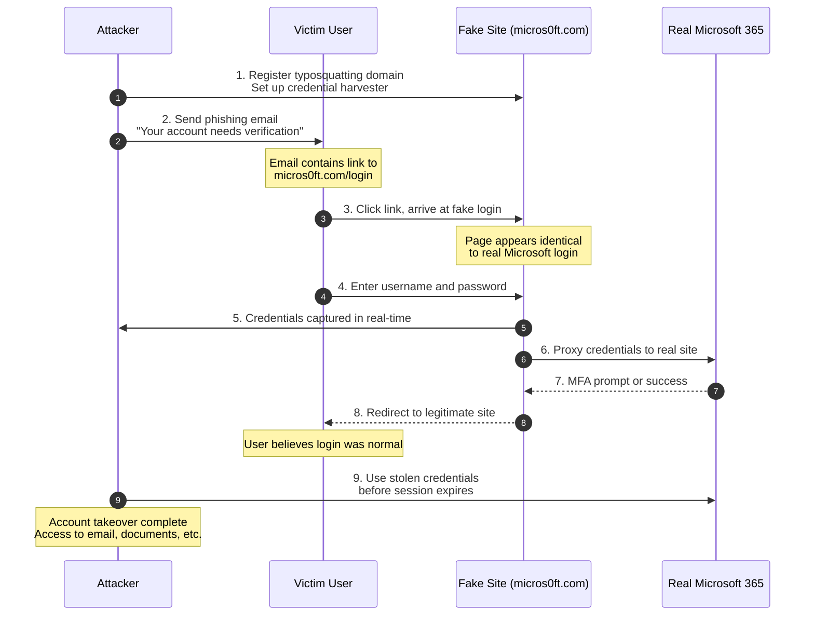
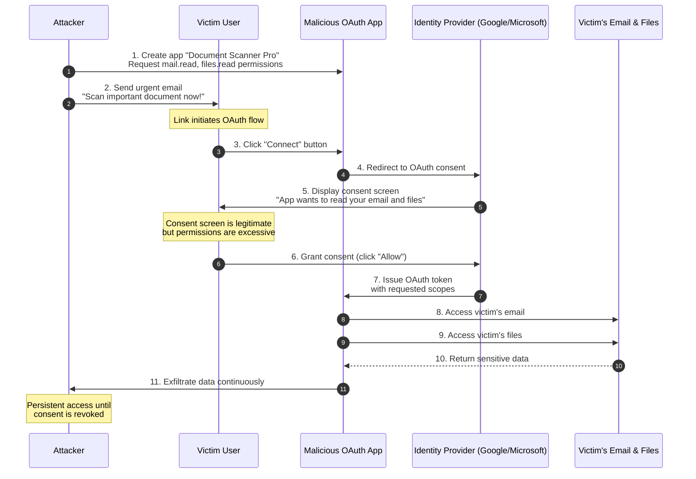
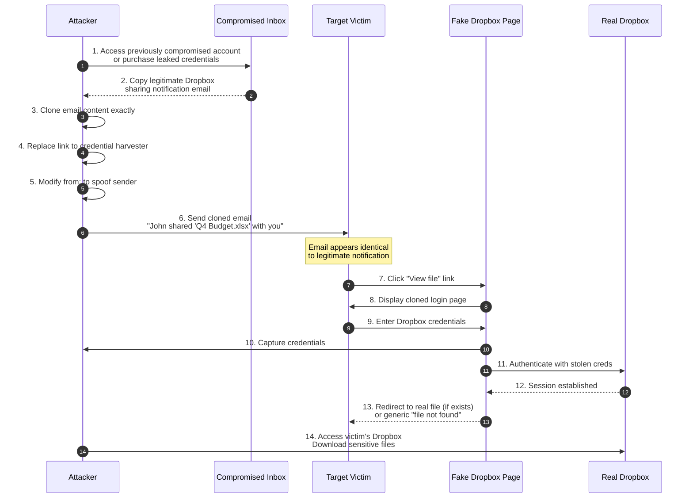
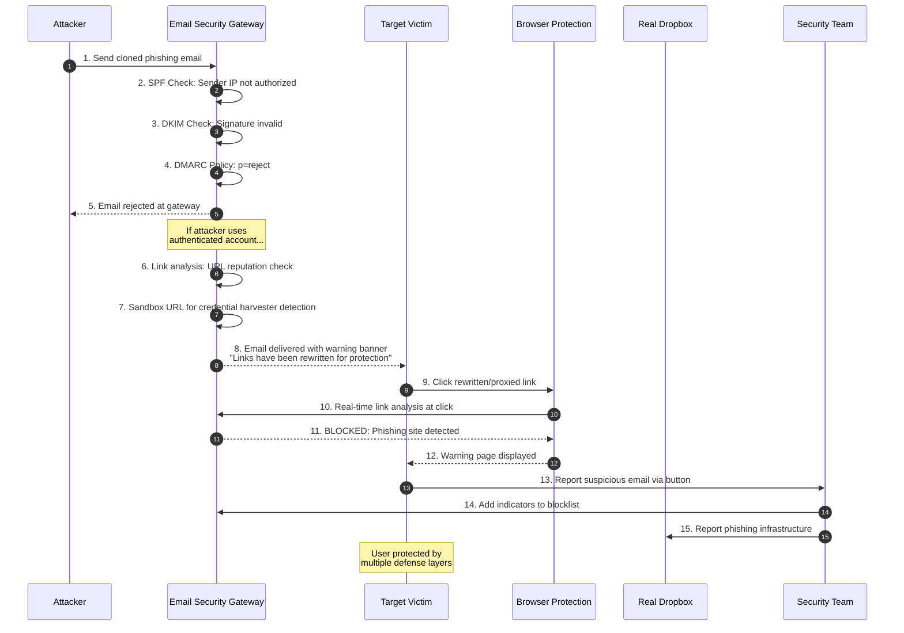

```mermaid
sequenceDiagram
    autonumber
    participant Attacker
    participant Victim as Victim User
    participant EmailGateway as Email Security Gateway
    participant Browser as Browser + Password Manager
    participant FIDO2 as FIDO2 Security Key
    participant RealMS as Real Microsoft 365

    Attacker->>EmailGateway: 1. Send phishing email with<br/>link to micros0ft.com
    EmailGateway->>EmailGateway: 2. Analyze sender reputation
    EmailGateway->>EmailGateway: 3. Check URL against threat intel
    EmailGateway-->>Attacker: 4. Email quarantined<br/>Suspicious domain detected
    
    Note over EmailGateway: If email bypasses gateway...
    
    Victim->>Browser: 5. Click link to micros0ft.com
    Browser->>Browser: 6. Safe Browsing check
    Browser-->>Victim: 7. Warning: Deceptive site detected
    
    Note over Browser: If warning ignored...
    
    Victim->>Browser: 8. Attempt to enter credentials
    Browser->>Browser: 9. Password manager checks domain
    Browser-->>Victim: 10. No credentials offered<br/>"Domain not recognized"
    
    Note over Victim: User alerted by lack<br/>of auto-fill
    
    alt User manually enters credentials
        Victim->>Attacker: Credentials captured
        Attacker->>RealMS: Attempt login with stolen creds
        RealMS->>FIDO2: Request FIDO2 authentication
        Note over FIDO2: Security key validates<br/>site origin cryptographically
        FIDO2-->>RealMS: BLOCKED: Origin mismatch<br/>micros0ft.com ≠ microsoft.com
        RealMS-->>Attacker: Authentication failed
    end
    
    Note over Attacker: Attack blocked at<br/>multiple layers
```

```mermaid
sequenceDiagram
    autonumber
    participant Attacker
    participant Victim as Victim User
    participant AdminPortal as Admin Portal
    participant IdP as Identity Provider
    participant AlertSystem as Security Alert System

    Note over AdminPortal: Preventive Controls Configured

    AdminPortal->>IdP: 1. Configure OAuth app restrictions<br/>• Block unverified apps<br/>• Require admin approval for sensitive scopes
    AdminPortal->>IdP: 2. Define allowed applications whitelist
    
    Attacker->>Victim: 3. Send OAuth phishing email
    Victim->>IdP: 4. Attempt to authorize malicious app
    
    IdP->>IdP: 5. Check app against policy
    IdP->>IdP: 6. App not in allowed list<br/>Sensitive scopes requested
    IdP-->>Victim: 7. BLOCKED: "This app is not<br/>approved by your organization"
    
    IdP->>AlertSystem: 8. Generate security alert<br/>Blocked OAuth consent attempt
    AlertSystem->>AdminPortal: 9. Notify security team
    
    Note over AdminPortal: Security team reviews<br/>and investigates attempt
    
    AdminPortal->>Victim: 10. Send security awareness reminder
    
    alt If app was previously authorized
        AdminPortal->>IdP: Review connected applications
        IdP-->>AdminPortal: List of authorized apps with scopes
        AdminPortal->>IdP: Revoke suspicious app consent
        IdP->>Attacker: Token invalidated
        Note over Attacker: Access terminated
    end
```

```mermaid
sequenceDiagram
    autonumber
    participant Attacker
    participant Victim as Victim User
    participant MaliciousSite as Malicious Website
    participant FakePopup as Fake Browser Popup (JavaScript)
    participant AttackerServer as Attacker's Server

    Attacker->>MaliciousSite: 1. Create convincing website<br/>(e.g., fake gaming platform, SaaS tool)
    Attacker->>FakePopup: 2. Build pixel-perfect fake popup<br/>mimicking Google OAuth window
    
    Note over FakePopup: Fake popup includes:<br/>• Simulated address bar<br/>• Fake HTTPS padlock<br/>• Draggable window chrome
    
    Attacker->>Victim: 3. Lure victim to malicious site<br/>(ad, social media, phishing email)
    
    Victim->>MaliciousSite: 4. Visit site, click "Sign in with Google"
    MaliciousSite->>FakePopup: 5. Display JavaScript fake popup
    
    Note over Victim: Popup appears to be<br/>real Google authentication
    
    FakePopup->>Victim: 6. Show fake Google login form
    Victim->>FakePopup: 7. Enter Google credentials
    FakePopup->>AttackerServer: 8. Exfiltrate credentials
    
    Note over FakePopup: If MFA is triggered...
    
    AttackerServer->>FakePopup: 9. Real-time relay to actual Google
    FakePopup->>Victim: 10. Display MFA prompt
    Victim->>FakePopup: 11. Enter MFA code
    FakePopup->>AttackerServer: 12. Capture MFA, complete auth
    
    AttackerServer->>Attacker: 13. Session token captured
    Note over Attacker: Full account access<br/>bypassing MFA
```

```mermaid
sequenceDiagram
    autonumber
    participant Victim as Victim User
    participant Browser as Modern Browser
    participant PasswordManager as Password Manager
    participant FIDO2Key as FIDO2 Security Key
    participant RealGoogle as Real Google

    Note over Victim: User encounters BitB attack

    Victim->>Browser: 1. Visit malicious site with BitB popup
    
    Browser->>Browser: 2. Fake popup detection<br/>• Popup is within page DOM<br/>• Not a real browser window
    
    Note over Browser: User trained to verify popups
    
    Victim->>Victim: 3. Attempt to drag popup<br/>outside browser window
    Note over Victim: Fake popup cannot leave<br/>parent window boundaries
    Victim->>Victim: 4. Recognize BitB attack
    
    alt User doesn't recognize attack
        Victim->>PasswordManager: 5. Look for auto-fill
        PasswordManager->>PasswordManager: 6. Check page origin
        PasswordManager-->>Victim: 7. No credentials offered<br/>URL is malicious-site.com, not accounts.google.com
        Note over Victim: User alerted by<br/>missing auto-fill
    end
    
    alt User manually enters credentials
        Victim->>FIDO2Key: 8. Attempt to authenticate
        FIDO2Key->>FIDO2Key: 9. Validate origin cryptographically
        FIDO2Key-->>Victim: 10. BLOCKED: Origin mismatch<br/>Page origin ≠ google.com
        Note over FIDO2Key: FIDO2 keys validate actual<br/>page origin, not displayed URL
    end
    
    Victim->>Browser: 11. Report site as phishing
    Browser->>RealGoogle: 12. Submit to Safe Browsing
    
    Note over Victim: Multiple layers prevent<br/>credential compromise
```

# Phishing and Social Engineering Attacks

> [!CAUTION]
> **Legal Disclaimer**: This document is for strictly educational and professional security research purposes. Unauthorized access to computer systems is illegal. The scripts provided are Proof-of-Concept (PoC) intended for use in controlled, lab environments. The author assumes no liability for misuse of this information.

## Table of Contents
1. [Overview Diagram](#overview-diagram)
2. [Introduction and Core Concepts](#introduction-and-core-concepts)
   - [Definition](#definition)
   - [How the Attack Works](#how-the-attack-works)
   - [Impact](#impact)
   - [Attack Vectors](#attack-vectors)
3. [Defense Principles](#defense-principles)
   - [Core Principles for Protection](#core-principles-for-protection)
   - [When and Where to Apply Defenses](#when-and-where-to-apply-defenses)
4. [Mitigation Strategies](#mitigation-strategies)
   - [Primary Mitigation Techniques](#primary-mitigation-techniques)
   - [Alternative Approaches](#alternative-approaches)
   - [Implementation Considerations](#implementation-considerations)
5. [Real-World Attack Scenarios](#real-world-attack-scenarios)
   - [Scenario 1: Typosquatting Domain Attack](#scenario-1-typosquatting-domain-attack)
   - [Scenario 2: OAuth Consent Phishing](#scenario-2-oauth-consent-phishing)
   - [Scenario 3: Clone Phishing via Email](#scenario-3-clone-phishing-via-email)
   - [Scenario 4: Browser-in-the-Browser Attack](#scenario-4-browser-in-the-browser-attack)

---

## Overview Diagram

```mermaid
flowchart TB
    subgraph AttackTypes["Phishing Attack Types"]
        Typosquatting["Typosquatting<br/>• Lookalike domains<br/>• Homograph attacks<br/>• Misspelled URLs"]
        ClonePhishing["Clone Phishing<br/>• Replicated emails<br/>• Copied branding<br/>• Altered links"]
        SpearPhishing["Spear Phishing<br/>• Targeted attacks<br/>• Personalized content<br/>• Research-based"]
        Whaling["Whaling<br/>• Executive targeting<br/>• High-value victims<br/>• Authority exploitation"]
        Vishing["Vishing/Smishing<br/>• Voice phishing<br/>• SMS phishing<br/>• Phone-based attacks"]
    end

    subgraph AttackVectors["Attack Vectors & Delivery Methods"]
        Email["Email Delivery<br/>• Spoofed senders<br/>• Malicious links<br/>• Fake attachments"]
        WebUI["Fake Web Interfaces<br/>• Cloned login pages<br/>• Credential harvesters<br/>• Session stealers"]
        SocialMedia["Social Media<br/>• Fake profiles<br/>• Direct messages<br/>• Compromised accounts"]
        Advertisements["Malicious Ads<br/>• Search engine ads<br/>• Display advertising<br/>• Redirect chains"]
        QRCodes["QR Code Phishing<br/>• Malicious QR codes<br/>• Physical placement<br/>• Mobile targeting"]
        OAuth["OAuth/SSO Abuse<br/>• Fake consent screens<br/>• Permission harvesting<br/>• Token theft"]
    end

    subgraph SocialEngineering["Social Engineering Techniques"]
        Urgency["Urgency Creation<br/>• Time pressure<br/>• Fear tactics<br/>• Immediate action required"]
        Authority["Authority Impersonation<br/>• Executive spoofing<br/>• IT department<br/>• Government entities"]
        Trust["Trust Exploitation<br/>• Brand recognition<br/>• Familiar interfaces<br/>• Known contacts"]
        Pretexting["Pretexting<br/>• Fabricated scenarios<br/>• Background stories<br/>• Context manipulation"]
    end

    subgraph DefenseMechanisms["Defense Mechanisms"]
        MFA["Multi-Factor Authentication<br/>• Hardware tokens<br/>• Push notifications<br/>• Biometric verification"]
        EmailSecurity["Email Security<br/>• SPF/DKIM/DMARC<br/>• Link scanning<br/>• Attachment sandboxing"]
        BrowserProtection["Browser Protection<br/>• Safe browsing<br/>• Certificate validation<br/>• Anti-phishing filters"]
        UserTraining["User Training<br/>• Phishing simulations<br/>• Security awareness<br/>• Reporting procedures"]
        DomainMonitoring["Domain Monitoring<br/>• Typosquat detection<br/>• Brand protection<br/>• Takedown services"]
        PasswordManager["Password Managers<br/>• Domain matching<br/>• Auto-fill protection<br/>• Credential isolation"]
    end

    subgraph AttackImpact["Attack Impact"]
        CredentialTheft["Credential Theft<br/>• Account compromise<br/>• Password exposure<br/>• Identity theft"]
        FinancialFraud["Financial Fraud<br/>• Wire transfer fraud<br/>• Invoice manipulation<br/>• Account takeover"]
        DataBreach["Data Breach<br/>• Sensitive data access<br/>• Intellectual property<br/>• Customer information"]
        MalwareDelivery["Malware Delivery<br/>• Ransomware<br/>• Backdoor installation<br/>• Keyloggers"]
        ReputationDamage["Reputation Damage<br/>• Brand trust loss<br/>• Customer confidence<br/>• Legal liability"]
        SupplyChain["Supply Chain Compromise<br/>• Vendor impersonation<br/>• Third-party access<br/>• Lateral movement"]
    end

    %% Attack Types to Vectors
    Typosquatting --> WebUI
    Typosquatting --> Advertisements
    ClonePhishing --> Email
    ClonePhishing --> WebUI
    SpearPhishing --> Email
    SpearPhishing --> SocialMedia
    Whaling --> Email
    Whaling --> SocialMedia
    Vishing --> QRCodes
    Vishing --> SocialMedia

    %% Vectors to Social Engineering
    Email --> Urgency
    Email --> Authority
    WebUI --> Trust
    WebUI --> Authority
    SocialMedia --> Trust
    SocialMedia --> Pretexting
    Advertisements --> Trust
    QRCodes --> Urgency
    OAuth --> Trust
    OAuth --> Pretexting

    %% Social Engineering to Impact
    Urgency --> CredentialTheft
    Urgency --> FinancialFraud
    Authority --> FinancialFraud
    Authority --> DataBreach
    Trust --> CredentialTheft
    Trust --> MalwareDelivery
    Pretexting --> SupplyChain
    Pretexting --> DataBreach

    %% Defense Connections
    MFA --> CredentialTheft
    MFA --> FinancialFraud
    EmailSecurity --> Email
    EmailSecurity --> ClonePhishing
    BrowserProtection --> WebUI
    BrowserProtection --> Typosquatting
    UserTraining --> Urgency
    UserTraining --> Authority
    DomainMonitoring --> Typosquatting
    DomainMonitoring --> Advertisements
    PasswordManager --> WebUI
    PasswordManager --> Typosquatting

    %% Defense Mitigation
    MFA -.->|Prevents| CredentialTheft
    MFA -.->|Blocks| FinancialFraud
    EmailSecurity -.->|Filters| Email
    EmailSecurity -.->|Detects| ClonePhishing
    BrowserProtection -.->|Warns| WebUI
    BrowserProtection -.->|Blocks| Typosquatting
    UserTraining -.->|Counters| Urgency
    UserTraining -.->|Recognizes| Authority
    DomainMonitoring -.->|Detects| Typosquatting
    DomainMonitoring -.->|Alerts| Advertisements
    PasswordManager -.->|Validates| WebUI
    PasswordManager -.->|Prevents| Typosquatting

    %% Styling
    classDef attackType fill:#ffcccc,stroke:#ff0000,stroke-width:3px,color:#000000
    classDef attackVector fill:#ffe6cc,stroke:#ff6600,stroke-width:2px,color:#000000
    classDef socialEng fill:#ccccff,stroke:#0000ff,stroke-width:2px,color:#000000
    classDef defense fill:#ccffcc,stroke:#00aa00,stroke-width:2px,color:#000000
    classDef impact fill:#ffccff,stroke:#aa00aa,stroke-width:2px,color:#000000

    class Typosquatting,ClonePhishing,SpearPhishing,Whaling,Vishing attackType
    class Email,WebUI,SocialMedia,Advertisements,QRCodes,OAuth attackVector
    class Urgency,Authority,Trust,Pretexting socialEng
    class MFA,EmailSecurity,BrowserProtection,UserTraining,DomainMonitoring,PasswordManager defense
    class CredentialTheft,FinancialFraud,DataBreach,MalwareDelivery,ReputationDamage,SupplyChain impact

    %% Subgraph styling
    style AttackTypes fill:#ffffff10,stroke:#ff0000,stroke-width:2px
    style AttackVectors fill:#ffffff10,stroke:#ff6600,stroke-width:2px
    style SocialEngineering fill:#ffffff10,stroke:#0000ff,stroke-width:2px
    style DefenseMechanisms fill:#ffffff10,stroke:#00aa00,stroke-width:2px
    style AttackImpact fill:#ffffff10,stroke:#aa00aa,stroke-width:2px
```

### Legend

| Color | Category | Description |
|-------|----------|-------------|
| 🔴 Red Border | Attack Types | Different phishing and social engineering attack categories |
| 🟠 Orange Border | Attack Vectors | Delivery methods and entry points for attacks |
| 🔵 Blue Border | Social Engineering | Psychological manipulation techniques used |
| 🟢 Green Border | Defense Mechanisms | Protective controls and countermeasures |
| 🟣 Purple Border | Attack Impact | Consequences and damage from successful attacks |

### Key Relationships

- **Attack Flow**: Attack types utilize specific vectors (e.g., Typosquatting uses fake web interfaces), which employ social engineering techniques (e.g., exploiting trust) to achieve attack impacts (e.g., credential theft)
- **Defense Coverage**: Each defense mechanism targets specific points in the attack chain—MFA prevents credential misuse even if stolen, while email security blocks malicious delivery
- **Layered Protection**: Multiple defenses overlap to provide defense-in-depth, ensuring that failure of one control doesn't result in complete compromise
- **Human Element**: Social engineering techniques bridge technical attack vectors to business impacts, highlighting the critical role of user training

---

## Introduction and Core Concepts

### Definition

**Phishing** is a cyber attack where adversaries impersonate trusted entities to deceive users into revealing sensitive information, credentials, or performing actions that compromise security. **Social Engineering** encompasses the broader psychological manipulation techniques used to exploit human trust, fear, authority, and urgency.

According to **OWASP**, phishing attacks exploit the human element of security, bypassing technical controls by targeting users directly. **CWE-451 (User Interface (UI) Misrepresentation of Critical Information)** describes vulnerabilities where the user interface can be manipulated to display misleading information.

### How the Attack Works

Phishing attacks typically follow a structured methodology:

1. **Reconnaissance**: Attackers gather information about targets, including organizational structure, email formats, commonly used services, and individual details from social media or data breaches

2. **Infrastructure Setup**: Creation of convincing attack infrastructure including:
   - Typosquatting or lookalike domains (e.g., `g00gle.com`, `google.com.attacker.net`)
   - Cloned login pages that mirror legitimate services
   - Email spoofing configurations to bypass basic filters

3. **Content Creation**: Development of convincing lures using:
   - Copied branding, logos, and design elements
   - Contextually relevant messaging (password expiration, suspicious activity, invoice)
   - Social engineering triggers (urgency, authority, fear)

4. **Delivery**: Distribution through various channels:
   - Mass email campaigns or targeted spear-phishing
   - Malicious advertisements in search results
   - Compromised websites or watering hole attacks
   - SMS (smishing) or voice calls (vishing)

5. **Credential Harvesting**: When victims interact with fake interfaces:
   - Credentials are captured and forwarded to attackers
   - Session tokens or MFA codes may be intercepted in real-time
   - Users are often redirected to legitimate sites to avoid detection

6. **Exploitation**: Stolen credentials are used for:
   - Account takeover and lateral movement
   - Financial fraud and wire transfers
   - Data exfiltration and further compromises

### Impact

| Impact Category | Description | Business Consequence |
|-----------------|-------------|---------------------|
| **Credential Compromise** | Stolen usernames, passwords, and session tokens | Unauthorized access to corporate systems, email, and applications |
| **Financial Loss** | Direct theft, fraudulent transactions, wire transfer fraud | Immediate monetary damage, often irreversible |
| **Data Breach** | Access to sensitive customer, employee, or business data | Regulatory fines, legal liability, competitive disadvantage |
| **Ransomware Infection** | Phishing as initial access for malware deployment | Operational disruption, ransom payments, recovery costs |
| **Reputation Damage** | Public disclosure of successful attacks | Customer trust erosion, brand damage, loss of business |
| **Supply Chain Risk** | Compromise of vendor/partner credentials | Third-party access to systems, expanded attack surface |

### Attack Vectors

#### Typosquatting and Homograph Attacks
Registration of domains visually similar to legitimate sites:
- **Character substitution**: `paypa1.com` (l→1), `arnazon.com` (m→rn)
- **Homograph attacks**: Using Unicode characters that appear identical (Cyrillic 'а' vs Latin 'a')
- **Subdomain abuse**: `login.microsoft.com.attacker.net`
- **TLD variations**: `company.co` vs `company.com`

#### Clone Phishing
Replication of legitimate communications with malicious modifications:
- Copying actual emails and replacing links
- Mimicking invoices, shipping notifications, or password resets
- Spoofing internal communications and announcements

#### OAuth and Consent Phishing
Abuse of legitimate authentication flows:
- Malicious applications requesting excessive permissions
- Fake consent screens harvesting authorization tokens
- Exploitation of pre-authorization trust

#### Browser-in-the-Browser (BitB)
Advanced UI manipulation techniques:
- Fake popup windows simulating OAuth flows
- Pixel-perfect recreation of browser chrome
- JavaScript-based fake address bars and security indicators

---

## Defense Principles

### Core Principles for Protection

#### 1. Defense in Depth
Implement multiple layers of protection that don't rely on any single control:
- Technical controls (email filtering, browser protection)
- Process controls (verification procedures for high-risk actions)
- Human controls (training and awareness)

#### 2. Zero Trust Verification
Never assume legitimacy based on appearance alone:
- Verify sender identity through out-of-band channels
- Validate URLs before entering credentials
- Authenticate requests for sensitive actions independently

#### 3. Principle of Least Privilege
Limit the impact of successful phishing:
- Minimize standing privileges for all accounts
- Implement just-in-time access for sensitive operations
- Segment access to limit lateral movement

#### 4. Human-Centric Security
Design security that works with human behavior:
- Make secure actions the easy path
- Provide clear indicators of legitimacy
- Create frictionless reporting mechanisms

### When and Where to Apply Defenses

| Defense Layer | When to Apply | Where to Apply |
|---------------|---------------|----------------|
| **Email Security** | All inbound/outbound email | Email gateway, mail servers |
| **Browser Protection** | All web browsing activity | Endpoints, DNS filtering |
| **MFA** | All authentication events | Identity providers, applications |
| **User Training** | Onboarding and continuous | All employees, especially high-risk roles |
| **Domain Monitoring** | Continuous | Brand protection services |
| **Verification Procedures** | High-value transactions | Finance, HR, IT operations |

---

## Mitigation Strategies

### Primary Mitigation Techniques

#### Multi-Factor Authentication (MFA)
Phishing-resistant MFA significantly reduces the impact of credential theft:
- **Hardware security keys** (FIDO2/WebAuthn) provide cryptographic proof of domain legitimacy
- **Phishing-resistant authenticators** prevent real-time credential relay attacks
- **Conditional access policies** require additional verification for risky sign-ins

#### Email Authentication and Security
Implement comprehensive email security controls:
- **SPF (Sender Policy Framework)**: Authorize legitimate sending servers
- **DKIM (DomainKeys Identified Mail)**: Cryptographically sign outbound email
- **DMARC (Domain-based Message Authentication)**: Define handling policy for authentication failures
- **Advanced threat protection**: Sandbox attachments, scan links at click-time

#### Password Manager Integration
Leverage password managers as a phishing defense:
- Auto-fill only activates on legitimate domains
- Users don't manually enter credentials, reducing typosquatting risk
- Credential isolation prevents cross-site password reuse

#### Domain Monitoring and Takedowns
Proactive identification of malicious infrastructure:
- Monitor for registration of lookalike domains
- Automated alerts for certificate issuance on similar domains
- Rapid takedown procedures with registrars and hosting providers

### Alternative Approaches

#### When Hardware MFA Is Not Feasible
- Implement push-based MFA with number matching
- Use time-based one-time passwords (TOTP) with user education
- Deploy risk-based authentication that escalates based on context

#### For High-Value Transactions
- Require out-of-band verification for significant financial transfers
- Implement callback procedures to verified phone numbers
- Use multi-party approval workflows for sensitive operations

#### For Organizations with Limited Resources
- Leverage built-in browser phishing protection
- Utilize free DMARC monitoring services
- Focus training on highest-risk users and scenarios

### Implementation Considerations

#### Browser Security Indicators
- Train users to verify HTTPS and domain names
- Understand limitations of visual indicators (can be spoofed in BitB attacks)
- Integrate with endpoint protection for real-time URL analysis

#### Incident Response Preparation
- Establish clear reporting channels for suspected phishing
- Pre-define credential reset and session termination procedures
- Maintain relationships with takedown service providers

#### Metrics and Continuous Improvement
- Track phishing simulation click rates and reporting rates
- Monitor email security filter effectiveness
- Measure mean time to respond to reported phishing

---

## Real-World Attack Scenarios

### Scenario 1: Typosquatting Domain Attack

A threat actor registers `micros0ft.com` (with a zero instead of 'o') and creates a pixel-perfect clone of the Microsoft 365 login page. Victims arriving via phishing emails or search engine ads have their credentials harvested in real-time.

#### Attack Flow

#### Mitigation Application

---

### Scenario 2: OAuth Consent Phishing

An attacker creates a malicious application that requests access to a victim's email and files through a legitimate OAuth consent flow. The victim is tricked into authorizing the application, granting persistent access to their data.

#### Attack Flow

#### Mitigation Application

---

### Scenario 3: Clone Phishing via Email

An attacker intercepts or recreates a legitimate email notification (e.g., from a file sharing service), modifies the links to point to a credential harvesting page, and resends it to the victim with a convincing pretext.

#### Attack Flow

#### Mitigation Application

---

### Scenario 4: Browser-in-the-Browser Attack

An attacker creates a fake OAuth popup window using HTML/CSS/JavaScript that perfectly mimics the browser's authentication popup. The victim believes they're authenticating via a trusted identity provider but is actually entering credentials into an attacker-controlled page.

#### Attack Flow

#### Mitigation Application

---

## References

- **OWASP Social Engineering**: https://owasp.org/www-community/Social_Engineering
- **CWE-451**: User Interface (UI) Misrepresentation of Critical Information
- **NIST SP 800-63B**: Digital Identity Guidelines - Authentication and Lifecycle Management
- **MITRE ATT&CK - Phishing**: T1566
- **Google Safe Browsing**: https://safebrowsing.google.com/
- **Anti-Phishing Working Group (APWG)**: https://apwg.org/
