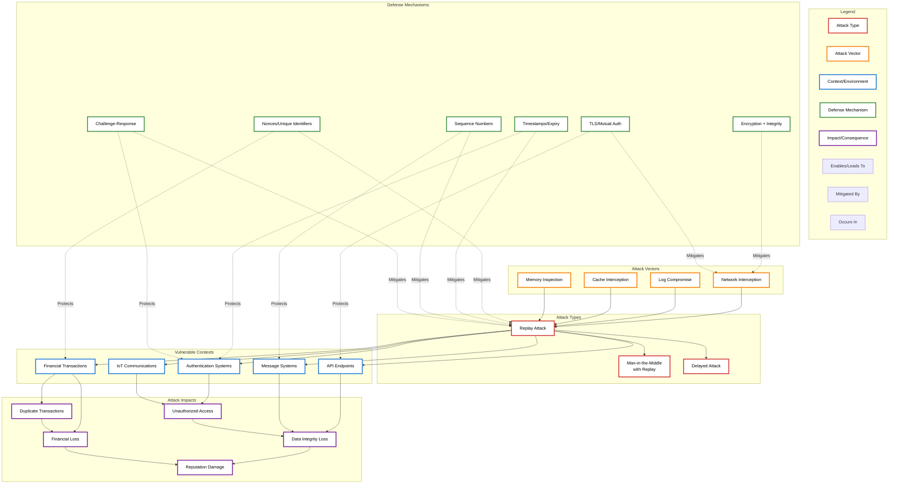
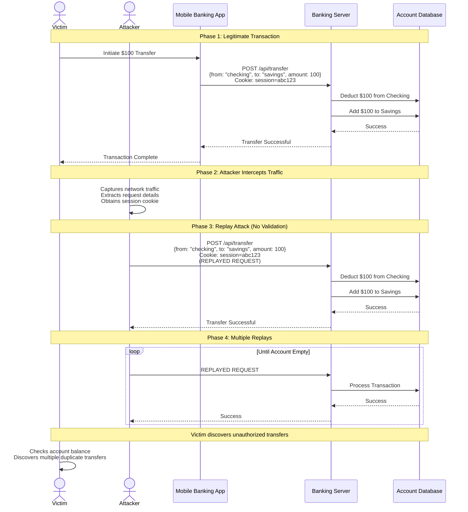
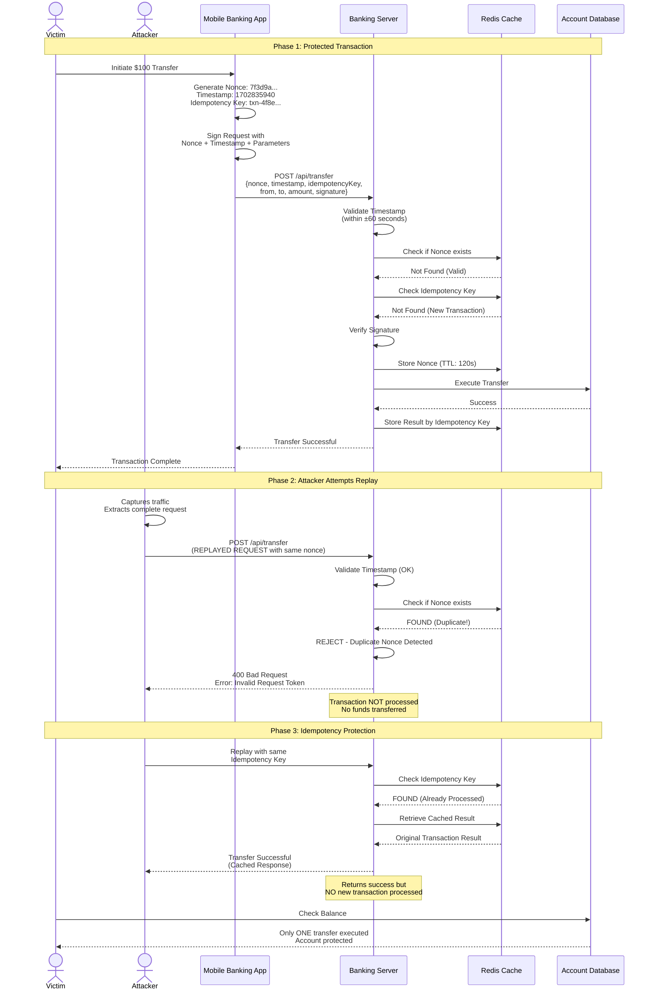
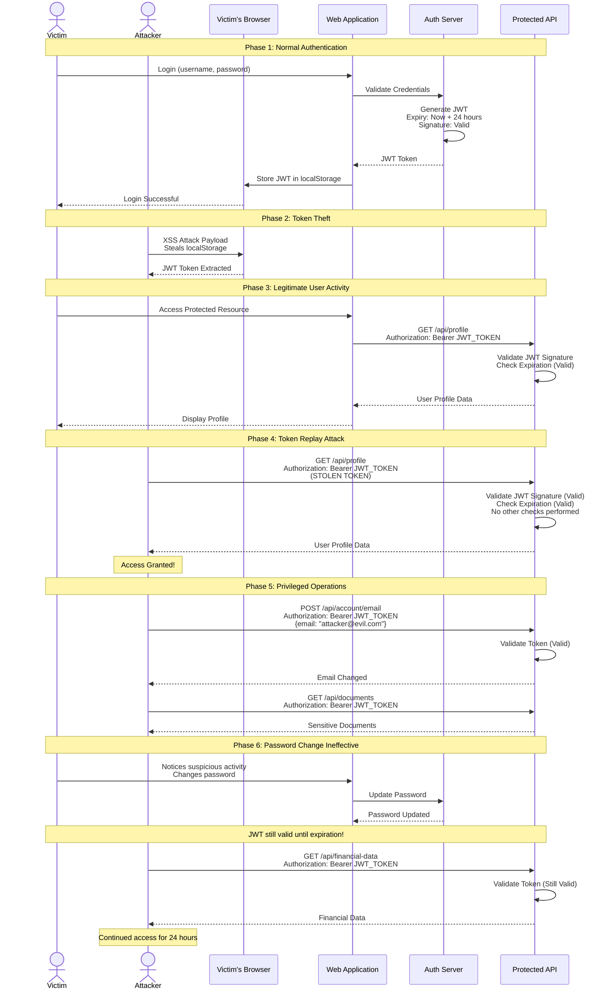
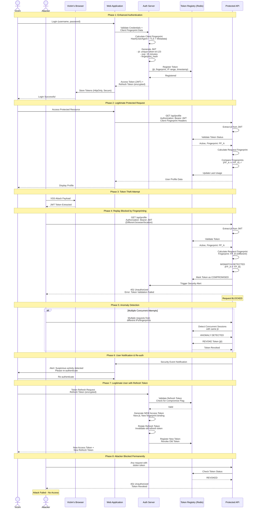
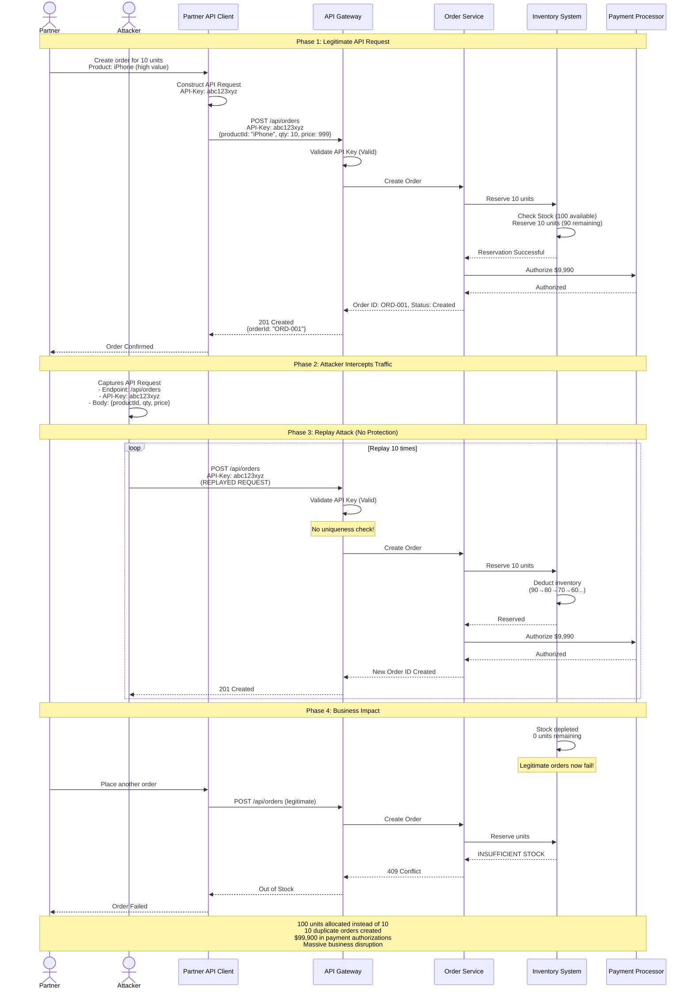
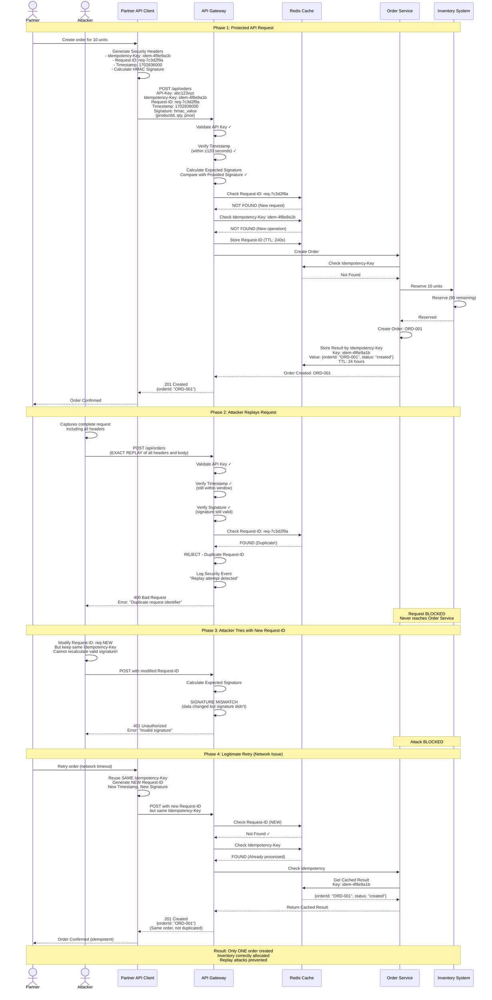
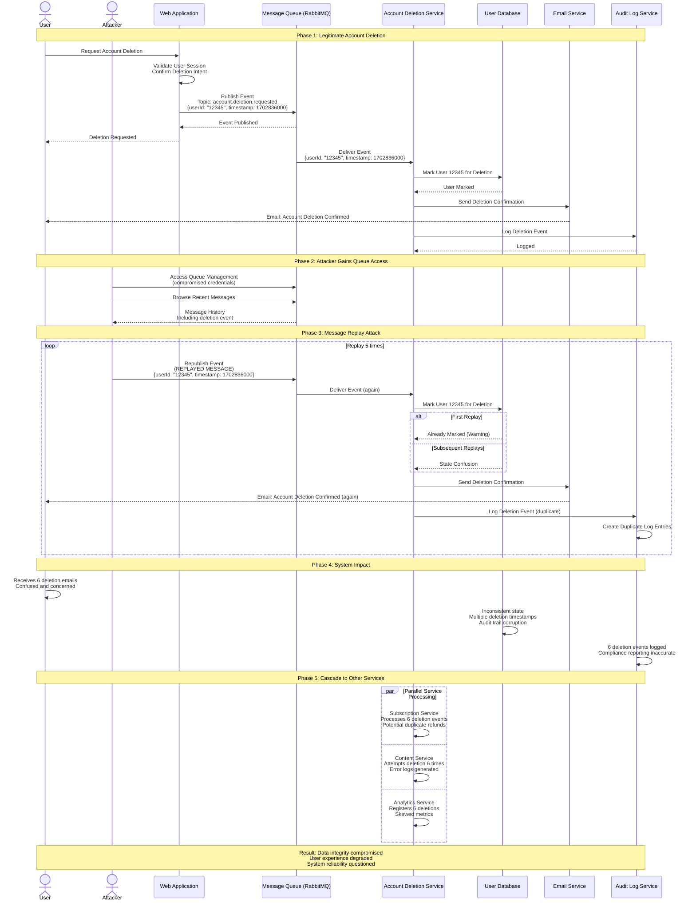
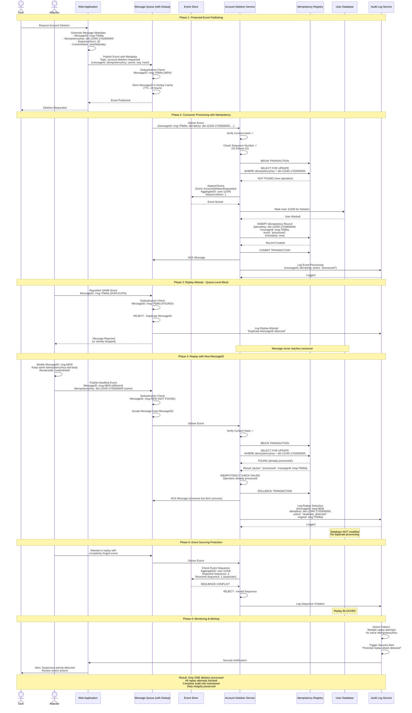

# Replay Attacks

> [!CAUTION]
> **Legal Disclaimer**: This document is for strictly educational and professional security research purposes. Unauthorized access to computer systems is illegal. The scripts provided are Proof-of-Concept (PoC) intended for use in controlled, lab environments. The author assumes no liability for misuse of this information.

## Table of Contents

1. [Overview Diagram](#overview-diagram)
   - [Key Relationships](#key-relationships)
2. [Introduction and Core Concepts](#introduction-and-core-concepts)
   - [Definition](#definition)
   - [How Replay Attacks Work](#how-replay-attacks-work)
   - [Impact](#impact)
   - [Attack Vectors](#attack-vectors)
3. [Defense Principles](#defense-principles)
   - [Core Principles for Protection](#core-principles-for-protection)
   - [When and Where to Apply Defenses](#when-and-where-to-apply-defenses)
4. [Mitigation Strategies](#mitigation-strategies)
   - [Primary Mitigation Techniques](#primary-mitigation-techniques)
   - [Alternative Approaches](#alternative-approaches)
   - [Implementation Considerations](#implementation-considerations)
5. [Real-World Attack Scenarios](#real-world-attack-scenarios)
   - [Scenario 1: Banking Transaction Replay](#scenario-1-banking-transaction-replay)
   - [Scenario 2: Authentication Token Replay](#scenario-2-authentication-token-replay)
   - [Scenario 3: API Request Replay](#scenario-3-api-request-replay)
   - [Scenario 4: Message Queue Replay](#scenario-4-message-queue-replay)

---

## Overview Diagram

### Key Relationships

**Attack Flow Chain:**
- **Attack Vectors → Attack Types**: Network interception, log compromise, cache interception, and memory inspection all enable replay attacks by providing attackers with valid transmission data to reuse
- **Attack Types → Contexts**: Replay attacks target various vulnerable contexts including financial transactions, authentication systems, API endpoints, message systems, and IoT communications
- **Contexts → Impacts**: Each vulnerable context leads to specific impacts (e.g., financial transactions lead to duplicate transactions and financial loss, authentication systems lead to unauthorized access)

**Defense Strategy:**
- **Defenses → Attack Types**: Nonces, timestamps, sequence numbers, and challenge-response mechanisms directly mitigate replay attacks by ensuring each transmission is unique and cannot be reused
- **Defenses → Contexts**: Defense mechanisms are applied to protect specific contexts (e.g., nonces protect financial transactions, timestamps protect authentication systems)
- **Transport Security**: TLS and encryption protect against network interception vectors, preventing attackers from capturing valid transmissions

**Attack Variations:**
- Replay attacks can evolve into Man-in-the-Middle with Replay attacks (where the attacker actively intercepts and modifies traffic)
- Delayed attacks occur when attackers capture transmissions and replay them at a strategically chosen later time

---

## Introduction and Core Concepts

### Definition

A **Replay Attack** is a network security attack in which an attacker intercepts a valid data transmission and fraudulently retransmits it, either immediately or with delay, to trick the receiving system into processing the same transaction or request multiple times. This attack exploits the lack of mechanisms to verify that each transmission is unique and used only once.

According to **CWE-294** (Authentication Bypass by Capture-replay), replay attacks occur when "a product does not properly validate that a transmission is being made by the original source, and does not use adequate mechanisms to prevent the transmission from being intercepted and replayed."

### How Replay Attacks Work

The typical replay attack follows this sequence:

1. **Interception Phase**: The attacker captures legitimate network traffic between a client and server. This can be achieved through:
   - Passive network sniffing on unsecured networks
   - Compromising network infrastructure components
   - Accessing cached or logged transmission data
   - Man-in-the-Middle positioning

2. **Storage Phase**: The captured transmission data is stored for later use. The attacker doesn't need to understand or decrypt the content; the valid format and structure are sufficient.

3. **Replay Phase**: The attacker retransmits the captured data to the target server, either:
   - Immediately after capture (immediate replay)
   - After a calculated delay (delayed replay)
   - Multiple times (repeated replay)

4. **Exploitation Phase**: The vulnerable server, lacking proper validation mechanisms, processes the replayed transmission as if it were a new, legitimate request, resulting in unauthorized actions.

### Impact

Replay attacks can have severe consequences across multiple dimensions:

**Financial Impact:**
- Duplicate financial transactions leading to unauthorized fund transfers
- Multiple charge processing for single purchases
- Fraudulent withdrawal or payment repetitions
- Settlement and reconciliation complications

**Security Impact:**
- Unauthorized access to protected resources using replayed authentication tokens
- Session hijacking through token replay
- Privilege escalation via replayed authorization requests
- Bypass of authentication and access control mechanisms

**Data Integrity Impact:**
- Duplicate database entries causing data corruption
- Inconsistent system state across distributed components
- Violation of business logic constraints (e.g., double-spending)
- Audit trail contamination with duplicate records

**Operational Impact:**
- Service disruption through resource exhaustion
- Increased infrastructure load from duplicate processing
- Complex incident investigation and remediation
- Regulatory compliance violations (GDPR, PCI-DSS, SOX)

**Reputation and Trust Impact:**
- Customer trust erosion following security incidents
- Brand reputation damage
- Loss of business partnerships
- Competitive disadvantage

### Attack Vectors

**Network-Level Vectors:**
- **Unencrypted Communication Channels**: HTTP, unencrypted TCP/UDP protocols, plaintext SMTP
- **Compromised Network Infrastructure**: Routers, switches, or wireless access points under attacker control
- **Public Wi-Fi Networks**: Unsecured or malicious hotspots designed for traffic interception
- **ARP Spoofing**: Manipulating network traffic routing to intercept transmissions

**Application-Level Vectors:**
- **Vulnerable API Endpoints**: REST APIs without request uniqueness validation
- **WebSocket Connections**: Real-time communication channels lacking replay protection
- **Message Queue Systems**: MQTT, AMQP, or other messaging protocols without replay detection
- **Mobile Application Traffic**: Apps communicating without proper security measures

**Authentication-Related Vectors:**
- **Bearer Token Systems**: JWT or OAuth tokens transmitted without additional protections
- **Cookie-Based Sessions**: Session cookies that can be captured and reused
- **Basic Authentication**: Credentials sent repeatedly in predictable formats
- **API Keys**: Static authentication keys without request-specific validation

**Infrastructure Vectors:**
- **Log File Compromise**: Accessing system logs containing complete request data
- **Cache Poisoning**: Extracting valid requests from application or proxy caches
- **Backup File Exposure**: Accessing network packet captures or transaction backups
- **Memory Dumps**: Extracting in-flight transactions from compromised system memory

---

## Defense Principles

### Core Principles for Protection

**1. Uniqueness Principle**

Every request or transaction must be provably unique and usable only once. This principle ensures that even if an attacker captures valid data, it cannot be successfully replayed.

**Implementation Approaches:**
- Cryptographic nonces (number used once)
- Unique transaction identifiers
- One-time passwords (OTP)
- Request-specific signatures

**2. Temporal Validity Principle**

Requests should have limited time windows during which they remain valid. This principle limits the window of opportunity for attackers and ensures captured data becomes useless quickly.

**Implementation Approaches:**
- Timestamp-based validation with tight tolerance windows
- Absolute expiration times for tokens and requests
- Time-to-live (TTL) mechanisms
- Clock synchronization protocols (NTP)

**3. Sequentiality Principle**

Requests should follow a predictable, strictly-enforced sequence that makes out-of-order replay detectable.

**Implementation Approaches:**
- Monotonically increasing sequence numbers
- State-machine validation
- Session-based ordering requirements
- Counter-based mechanisms

**4. Challenge-Response Principle**

Instead of accepting unsolicited requests, servers should initiate unpredictable challenges that clients must respond to with request-specific data.

**Implementation Approaches:**
- Challenge-response authentication protocols
- Dynamic salt values for each transaction
- Server-initiated nonces for client responses
- Proof-of-freshness mechanisms

**5. Cryptographic Binding Principle**

Request content should be cryptographically bound to metadata (timestamps, nonces, session identifiers) to prevent separation and reuse of valid signatures with different data.

**Implementation Approaches:**
- HMAC or digital signatures covering all request elements
- Authenticated encryption (AEAD) modes
- Message Authentication Codes (MACs)
- Canonical serialization before signing

**6. Confidentiality Principle**

While not directly preventing replay, encryption makes it harder for attackers to capture and understand valid transmissions, reducing exposure.

**Implementation Approaches:**
- Transport Layer Security (TLS 1.3)
- End-to-end encryption for sensitive operations
- Perfect Forward Secrecy (PFS)
- Mutual authentication

### When and Where to Apply Defenses

**Critical Context - Maximum Protection Required:**

Apply multiple layered defenses for:
- Financial transactions (payments, transfers, withdrawals)
- Authentication and authorization operations
- Account management actions (password changes, privilege modifications)
- Data modification operations with significant impact
- Cryptographic key exchanges
- Legal or regulatory significant actions

**Recommended Defense Stack:**
- TLS with mutual authentication
- Nonce or unique request identifiers
- Short-lived timestamps (30-60 second windows)
- Request signing with cryptographic binding
- Idempotency keys for operations
- Server-side state tracking

**Moderate Context - Balanced Protection:**

Apply standard defenses for:
- General API operations
- Read operations on sensitive data
- Non-critical state changes
- Internal service-to-service communication
- User activity tracking

**Recommended Defense Stack:**
- TLS encryption
- Timestamp validation (5-10 minute windows)
- Request identifiers
- Basic integrity checks

**Low Context - Minimal Protection:**

Apply basic defenses for:
- Public data access
- Idempotent read operations
- Non-sensitive logging
- Health check endpoints

**Recommended Defense Stack:**
- TLS encryption
- Basic rate limiting
- Optional request identifiers

**Implementation Timing:**

- **Design Phase**: Architecture-level decisions about defense mechanisms
- **Development Phase**: Implementation of chosen protection mechanisms
- **Testing Phase**: Validation of replay attack resistance
- **Deployment Phase**: Configuration of time synchronization and key management
- **Operations Phase**: Monitoring and incident response procedures

**Infrastructure Considerations:**

- **Stateful Systems**: Can maintain seen-request databases for nonce validation
- **Stateless Systems**: Must rely on temporal validity and cryptographic binding
- **Distributed Systems**: Require careful clock synchronization and coordination
- **High-Throughput Systems**: May need optimized cryptographic implementations
- **Real-Time Systems**: Must balance security with latency requirements

---

## Mitigation Strategies

### Primary Mitigation Techniques

**1. Nonce-Based Protection**

**Mechanism**: A cryptographic nonce (number used once) is a unique, typically random value generated for each request. The server tracks used nonces and rejects any request attempting to reuse a previously seen nonce.

**How It Works:**
- Client generates a cryptographically random nonce for each request
- Nonce is included in the request and incorporated into any cryptographic signatures
- Server validates that the nonce hasn't been seen before within the validity window
- Server stores the nonce in a cache or database to prevent reuse
- After the validity window expires, the nonce is removed from tracking

**Advantages:**
- Strong protection against replay attacks
- Cryptographically secure when properly implemented
- Works well with stateful servers
- Can be combined with other mechanisms

**Disadvantages:**
- Requires server-side state management
- Storage overhead for tracking nonces
- Complexity in distributed systems requiring nonce synchronization
- Cleanup mechanisms needed to prevent infinite storage growth

**Best Practices:**
- Use cryptographically secure random number generators
- Minimum nonce length of 128 bits (16 bytes)
- Implement efficient lookup structures (hash tables, Bloom filters)
- Define clear nonce expiration policies
- Use distributed caching solutions for scalability

**2. Timestamp-Based Validation**

**Mechanism**: Each request includes a timestamp indicating when it was created. The server compares this timestamp with its current time and rejects requests that are too old or from the future.

**How It Works:**
- Client includes current timestamp in each request
- Timestamp is signed along with request data to prevent modification
- Server validates timestamp is within acceptable range (e.g., ±60 seconds)
- Requests outside the window are rejected as potentially replayed

**Advantages:**
- Stateless approach requiring no server-side storage
- Simple to implement and understand
- Effective against delayed replay attacks
- Low computational overhead

**Disadvantages:**
- Vulnerable to immediate replay within the time window
- Requires accurate clock synchronization between client and server
- Clock skew can cause legitimate request rejection
- Attackers with synchronized clocks can still replay within the window

**Best Practices:**
- Use NTP for clock synchronization
- Implement reasonable tolerance windows (30-120 seconds based on risk)
- Monitor and alert on excessive timestamp validation failures
- Combine with nonces for critical operations
- Use Unix timestamps in seconds or milliseconds
- Validate timestamp format and range

**3. Sequence Number Tracking**

**Mechanism**: Each request in a session includes a monotonically increasing sequence number. The server tracks the last valid sequence number and rejects requests with out-of-order or duplicate sequence numbers.

**How It Works:**
- During session establishment, initial sequence number is agreed upon
- Client increments sequence number with each request
- Server validates sequence number is exactly one greater than previous
- Out-of-order or duplicate sequence numbers trigger rejection
- Sequence resets when session is re-established

**Advantages:**
- Provides strict ordering guarantees
- Detects both replay and message loss
- Efficient validation with minimal overhead
- Natural fit for connection-oriented protocols

**Disadvantages:**
- Requires stateful session management
- Challenging in distributed or load-balanced environments
- Session synchronization issues can cause legitimate request rejection
- Not suitable for connectionless protocols without modification

**Best Practices:**
- Initialize sequence numbers with secure random values
- Implement session recovery mechanisms for legitimate out-of-order scenarios
- Use 64-bit sequence numbers to prevent overflow
- Synchronize sequence state across load-balanced servers
- Clear sequence state when sessions terminate

**4. Challenge-Response Protocols**

**Mechanism**: Before accepting requests, the server issues a unique challenge that the client must incorporate into its response. This ensures the client is actively participating and not replaying captured data.

**How It Works:**
- Client initiates transaction request
- Server responds with a unique, unpredictable challenge value
- Client incorporates challenge into transaction data and signs it
- Server validates that challenge matches what it issued and hasn't been used
- Transaction is processed only if validation succeeds

**Advantages:**
- Strong protection as replayed messages lack valid challenge responses
- Proves client has current knowledge of server state
- Effective against sophisticated replay attacks
- Works well for authentication protocols

**Disadvantages:**
- Requires additional round-trip increasing latency
- More complex implementation
- Challenge storage and expiration management needed
- Not suitable for low-latency requirements

**Best Practices:**
- Generate challenges with cryptographic randomness
- Include timestamps in challenges for automatic expiration
- Limit challenge validity to shortest acceptable window
- Implement challenge cleanup mechanisms
- Use at least 128 bits of randomness

### Alternative Approaches

**5. Mutual TLS (mTLS) with Session Binding**

**When to Use**: For service-to-service communication, APIs requiring strong authentication, and high-security environments.

**Mechanism**: Both client and server authenticate using X.509 certificates, and application-layer requests are cryptographically bound to the TLS session, making replay impossible without the client's private key.

**Implementation**: TLS session identifiers are included in application-layer message signatures, binding requests to specific TLS connections.

**6. Idempotency Keys**

**When to Use**: For financial transactions, critical state-changing operations, and operations where duplicate execution has significant impact.

**Mechanism**: Clients generate unique idempotency keys for each operation. Servers cache operation results by idempotency key and return cached results if the same key is resubmitted.

**Implementation**: Client includes idempotency key in header or request body; server stores operation outcomes keyed by this identifier for a defined retention period.

**7. State Synchronization Tokens**

**When to Use**: For multi-step workflows, form submissions, and operations requiring specific preconditions.

**Mechanism**: Server issues tokens representing current state; clients must present valid state tokens for transitions. Replayed requests with stale state tokens are rejected.

**Implementation**: Similar to CSRF tokens but tracking application state progression rather than just session validity.

**8. Cryptographic Puzzles (Proof-of-Work)**

**When to Use**: For rate-limiting, preventing automated replay attacks, and protecting against high-volume replay attempts.

**Mechanism**: Server requires client to solve a computational puzzle before accepting requests, making large-scale replay attacks resource-intensive for attackers.

**Implementation**: Server provides puzzle parameters; client computes solution; server validates solution meets difficulty requirements.

**9. Distributed Rate Limiting**

**When to Use**: As a complementary defense in distributed systems, to limit impact of successful replay attacks.

**Mechanism**: Track request rates across multiple dimensions (source IP, user account, API key) and throttle excessive activity patterns consistent with replay attacks.

**Implementation**: Centralized rate-limiting service using token bucket or leaky bucket algorithms with distributed caching.

### Implementation Considerations

**Performance Impact:**
- **Cryptographic Operations**: Nonce generation, signature verification, and encryption add computational overhead
- **Storage Requirements**: Nonce tracking and sequence number state require memory/database capacity
- **Network Latency**: Challenge-response mechanisms add round-trip time
- **Optimization Strategies**: Hardware acceleration, efficient algorithms, caching, and asynchronous validation

**Scalability Challenges:**
- **Distributed State**: Nonce and sequence number state must be synchronized across multiple servers
- **Solutions**: Distributed caching (Redis, Memcached), eventual consistency models, partitioned state by user/session
- **Load Balancing**: Sticky sessions may be required for sequence-based approaches

**Clock Synchronization:**
- **Criticality**: Timestamp-based defenses require accurate time across all systems
- **Implementation**: Deploy NTP servers, monitor clock drift, implement fallback mechanisms
- **Tolerance**: Configure time windows to accommodate reasonable clock skew

**Error Handling:**
- **Legitimate Failures**: Network issues may cause legitimate requests to appear as replays
- **User Experience**: Clear error messages without revealing security mechanisms
- **Retry Logic**: Implement exponential backoff with jitter for failed requests
- **Monitoring**: Track validation failures to detect attacks vs. configuration issues

**Backwards Compatibility:**
- **Migration Strategy**: Support both legacy and protected endpoints during transition
- **Client Updates**: Coordinate client-side implementation of new mechanisms
- **Graceful Degradation**: Fall back to alternative protections if primary mechanism fails

**Testing Requirements:**
- **Functional Testing**: Verify protection mechanisms correctly reject replay attempts
- **Performance Testing**: Measure overhead of defense mechanisms under load
- **Integration Testing**: Validate behavior in distributed environments
- **Security Testing**: Conduct penetration testing specifically targeting replay vulnerabilities

**Compliance Considerations:**
- **PCI-DSS**: Requires protection of cardholder data transmission
- **GDPR**: Mandates appropriate security measures for personal data
- **OWASP ASVS**: Provides verification standards for replay attack prevention
- **Industry Standards**: Follow sector-specific requirements (HIPAA, FISMA, etc.)

---

## Real-World Attack Scenarios

### Scenario 1: Banking Transaction Replay

**Context**: A mobile banking application allows users to transfer funds between accounts. The application uses HTTPS but lacks proper replay protection mechanisms.

#### Attack Flow

**Step-by-Step Execution:**

1. **Initial Setup**: Attacker positions themselves on the same network as the victim (public Wi-Fi, compromised router, or malicious hotspot)

2. **Legitimate Transaction**: Victim initiates a legitimate transfer of $100 from their checking to savings account through the mobile app

3. **Traffic Capture**: Attacker uses network sniffing tools to capture the encrypted HTTPS traffic. While the attacker cannot decrypt the TLS traffic in real-time, they can capture the complete encrypted packets

4. **Session Cookie Extraction**: Through various techniques (XSS, malware, or session hijacking), attacker obtains victim's valid session cookie

5. **Request Reconstruction**: Attacker analyzes the captured traffic pattern and reconstructs the HTTP request structure, including headers and body

6. **Replay Execution**: Attacker retransmits the exact transaction request with the stolen session cookie, causing the server to process an identical $100 transfer again

7. **Multiple Replays**: Attacker repeats the replay multiple times, draining the victim's checking account

8. **Detection Evasion**: Replays occur within the session timeout window, appearing to the server as legitimate user activity

#### Mitigation Application

**Implemented Defense Strategy**: Nonce-based protection combined with timestamp validation and idempotency keys

**Step-by-Step Protection:**

1. **Client Preparation**: Mobile app generates a cryptographic nonce (UUID v4) and captures current timestamp for each transaction request

2. **Idempotency Key**: App generates a unique idempotency key specifically for this transaction

3. **Request Construction**: Transaction request includes nonce, timestamp, idempotency key, and all parameters are digitally signed

4. **Server Validation**: Server performs multi-layer validation:
   - Verifies timestamp is within acceptable window (±60 seconds)
   - Checks nonce hasn't been seen before in distributed cache
   - Validates idempotency key isn't associated with completed transaction
   - Verifies digital signature

5. **Nonce Registration**: If validation passes, server stores nonce in distributed cache (Redis) with TTL matching timestamp window

6. **Transaction Processing**: Server processes transaction and stores result with idempotency key

7. **Replay Attempt Blocked**: When attacker replays captured request, server detects duplicate nonce and rejects request before processing

8. **Idempotent Response**: If idempotency key is replayed, server returns cached result without re-processing transaction

---

### Scenario 2: Authentication Token Replay

**Context**: A web application uses JWT (JSON Web Tokens) for authentication. Tokens are properly signed but lack additional replay protection, allowing stolen tokens to be reused indefinitely until expiration.

#### Attack Flow

**Step-by-Step Execution:**

1. **Token Acquisition**: Attacker obtains victim's JWT through various means:
   - Cross-Site Scripting (XSS) attack stealing token from localStorage
   - Man-in-the-Middle attack on insecure network
   - Compromised third-party service logging tokens
   - Browser extension malware

2. **Token Analysis**: Attacker decodes JWT to understand expiration time and privileges. Token has 24-hour validity period

3. **Authentication Bypass**: Attacker uses stolen token to authenticate API requests, bypassing normal login procedures

4. **Privilege Exploitation**: With valid authentication, attacker accesses victim's data, performs actions as victim, and potentially escalates privileges

5. **Extended Access**: Attacker uses token repeatedly within 24-hour window, maintaining persistent access despite victim potentially changing password

6. **Parallel Sessions**: Multiple attackers can use the same stolen token simultaneously from different locations, all appearing as legitimate activity

#### Mitigation Application

**Implemented Defense Strategy**: JWT binding with rotating nonces, token fingerprinting, and active token tracking

**Step-by-Step Protection:**

1. **Enhanced Token Generation**: When user authenticates, auth server generates JWT with additional claims:
   - Unique token identifier (jti claim)
   - Client fingerprint (hashed browser/device characteristics)
   - Short expiration time (15 minutes instead of 24 hours)
   - Refresh token issued separately

2. **Token Fingerprinting**: Server calculates fingerprint from client characteristics (User-Agent, TLS fingerprint, network metadata) and binds it to the token

3. **Active Token Registry**: Server maintains active token registry in distributed cache, tracking:
   - Token ID (jti)
   - Associated fingerprint
   - Last usage timestamp
   - Originating IP address range

4. **Request Validation**: Every API request undergoes enhanced validation:
   - JWT signature verification
   - Expiration check
   - Token ID lookup in active registry
   - Client fingerprint matching
   - Usage pattern analysis (rate, location, timing)

5. **Anomaly Detection**: System monitors for suspicious patterns:
   - Token usage from multiple geographic locations
   - Concurrent sessions from different fingerprints
   - Unusual request rates or patterns

6. **Token Revocation**: When suspicious activity detected:
   - Token immediately revoked in registry
   - All subsequent requests rejected
   - User notified and prompted to re-authenticate

7. **Refresh Token Flow**: Legitimate users use refresh tokens to obtain new access tokens:
   - Refresh token includes rotation mechanism
   - Each use generates new refresh token
   - Old refresh token immediately invalidated

---

### Scenario 3: API Request Replay

**Context**: A RESTful API for an e-commerce platform processes orders. The API uses API keys for authentication but lacks request-level replay protection, allowing duplicate order placement.

#### Attack Flow

**Step-by-Step Execution:**

1. **API Key Compromise**: Attacker obtains legitimate API key through:
   - Exposed credentials in public repository
   - Compromised third-party integration
   - Insider threat or social engineering
   - Insufficient access controls on key storage

2. **Request Capture**: Attacker monitors API traffic to understand request structure for valuable operations (order placement, payment processing, inventory allocation)

3. **Legitimate Order**: Legitimate partner system places order for 10 units of high-value product using valid API key

4. **Request Recording**: Attacker captures complete API request including headers, body, and API key

5. **Immediate Replay**: Attacker replays captured request multiple times within seconds, creating duplicate orders

6. **Resource Exhaustion**: Each replayed request:
   - Reduces inventory counts
   - Creates fulfillment obligations
   - Generates payment processing attempts
   - Consumes system resources

7. **Business Impact**: Duplicate orders lead to:
   - Over-allocation of inventory
   - Financial discrepancies in settlement
   - Customer service overhead resolving duplicates
   - Potential fulfillment of unintended orders

#### Mitigation Application

**Implemented Defense Strategy**: Idempotency keys with request signing, rate limiting, and nonce validation

**Step-by-Step Protection:**

1. **Client-Side Preparation**: API clients must include additional security headers:
   - Idempotency-Key: Client-generated unique identifier for the operation
   - X-Request-ID: Unique request identifier (UUID)
   - X-Timestamp: Request creation timestamp
   - X-Signature: HMAC signature covering all request data

2. **Request Signing**: Client calculates HMAC signature:
   - Input: API-Key + Timestamp + Request-ID + Idempotency-Key + Request Body
   - Algorithm: HMAC-SHA256 with shared secret
   - Output included in X-Signature header

3. **Gateway Validation**: API Gateway performs multi-layer validation:
   - API key validity check
   - Timestamp validation (±120 seconds)
   - Signature verification
   - Request-ID uniqueness check
   - Idempotency-Key lookup

4. **Idempotency Layer**: Order Service implements idempotency:
   - Checks if Idempotency-Key exists in cache/database
   - If found: Returns cached response without processing
   - If not found: Processes request and caches result

5. **Rate Limiting**: Gateway enforces rate limits:
   - Per API key: Maximum requests per time window
   - Per IP address: Additional rate limiting layer
   - Adaptive limits based on behavior patterns

6. **Nonce Tracking**: Request-IDs stored in distributed cache:
   - TTL matches timestamp tolerance window
   - Bloom filters for efficient lookup at scale
   - Automatic expiration prevents storage growth

7. **Replay Attempt Handling**: When replay detected:
   - Request rejected before reaching order service
   - Event logged for security monitoring
   - Repeated violations trigger key suspension

---

### Scenario 4: Message Queue Replay

**Context**: A distributed microservices architecture uses a message queue (RabbitMQ/Kafka) for asynchronous event processing. A critical event—user account deletion—lacks replay protection, allowing malicious message replay.

#### Attack Flow

**Step-by-Step Execution:**

1. **Message Queue Access**: Attacker gains access to message queue infrastructure through:
   - Compromised service credentials
   - Network access to queue management interface
   - Exploit of queue software vulnerability
   - Insider threat with administrative access

2. **Legitimate Event**: User requests account deletion through application UI. System publishes "account.deletion.requested" event to message queue

3. **Message Capture**: Attacker with queue access captures the deletion event message including:
   - User ID
   - Event type
   - Timestamp
   - Message routing information

4. **Message Replay**: Attacker republishes captured deletion event to the queue multiple times

5. **Service Processing**: Account deletion service processes each replayed message as legitimate:
   - Marks account for deletion
   - Initiates data cleanup processes
   - Triggers cascading deletion in related services
   - Sends deletion confirmation notifications

6. **Cascade Effects**: Each replay triggers:
   - Multiple deletion processing attempts
   - Database inconsistencies as services process duplicate deletions
   - Error logs from attempting to delete already-deleted data
   - Multiple notification emails to user
   - Potential data corruption in backup/audit systems

7. **Service Disruption**: Massive replay attack can:
   - Overwhelm downstream services
   - Fill error logs obscuring real issues
   - Consume queue processing capacity
   - Create data integrity issues requiring manual intervention

#### Mitigation Application

**Implemented Defense Strategy**: Message deduplication with idempotency keys, event sourcing, and exactly-once processing semantics

**Step-by-Step Protection:**

1. **Enhanced Message Publishing**: When publishing events, producer service includes:
   - Message-ID: Unique identifier for this specific message (UUID)
   - Idempotency-Key: Semantic identifier representing the operation (e.g., "account-deletion-{userId}-{timestamp}")
   - Sequence-Number: Monotonically increasing per producer
   - Timestamp: Event creation time
   - Content-Hash: Hash of message body for integrity verification

2. **Queue-Level Deduplication**: Message queue configured with deduplication:
   - RabbitMQ plugin or Kafka with producer idempotence enabled
   - Deduplication window matches event processing timeframe
   - Message-ID used as deduplication key

3. **Consumer-Side Idempotency**: Account deletion service implements robust idempotency:
   - Maintains processed message registry in database/cache
   - Checks idempotency-key before processing
   - Uses database transactions to ensure atomic "check-and-process"

4. **Event Sourcing Pattern**: Instead of direct state mutation:
   - Events appended to immutable event log
   - Each event has unique sequence number
   - Duplicate events detected by sequence number comparison
   - State rebuilt by replaying event log

5. **Exactly-Once Processing**: Consumer implements exactly-once semantics:
   - Acknowledges message only after successful processing AND idempotency record creation
   - Uses distributed transactions (Saga pattern) for multi-service operations
   - Implements compensating transactions for partial failures

6. **Replay Detection**: System monitors for suspicious patterns:
   - Multiple messages with identical content hashes within short timeframe
   - Out-of-sequence message delivery
   - High volume of duplicate message-IDs

7. **Audit Trail Integrity**: Audit log service:
   - Records message-ID and idempotency-key with each event
   - Detects and flags duplicate processing attempts
   - Maintains separate log of replay attack attempts

---

## Conclusion

Replay attacks represent a fundamental security challenge in distributed systems where valid transmissions can be intercepted and maliciously reused. The attack exploits the inherent trust systems place in properly formatted and authenticated messages without verifying their uniqueness and freshness.

**Key Takeaways:**

1. **Defense in Depth**: No single mitigation technique provides complete protection. Effective defense requires layered approaches combining cryptographic nonces, temporal validation, sequence tracking, and idempotency mechanisms.

2. **Context Matters**: The appropriate defense strategy depends on system architecture (stateful vs. stateless), operational requirements (latency, throughput), and risk profile (financial transactions require stronger protections than read-only operations).

3. **Implementation Rigor**: Replay protection mechanisms must be implemented correctly across all system layers—transport (TLS), application (API validation), and business logic (idempotency). Gaps at any layer can be exploited.

4. **Operational Considerations**: Effective replay attack prevention requires ongoing operational attention including clock synchronization, monitoring for attack patterns, incident response procedures, and regular security assessments.

5. **Standards Alignment**: Implementations should align with industry standards (OWASP ASVS, NIST guidelines, PCI-DSS requirements) and leverage well-tested cryptographic libraries rather than custom implementations.

By understanding the attack vectors, implementing appropriate mitigation strategies, and maintaining operational vigilance, organizations can effectively protect their systems against replay attacks while maintaining usability and performance.

