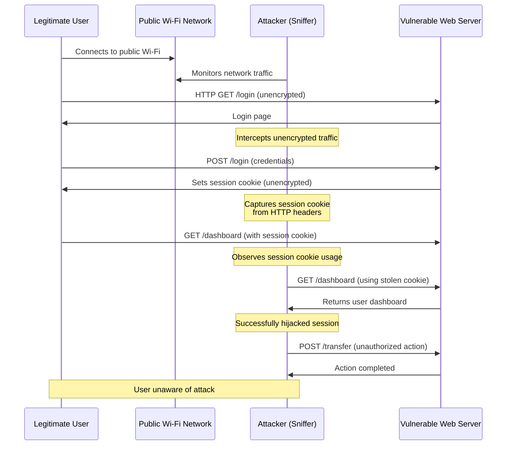
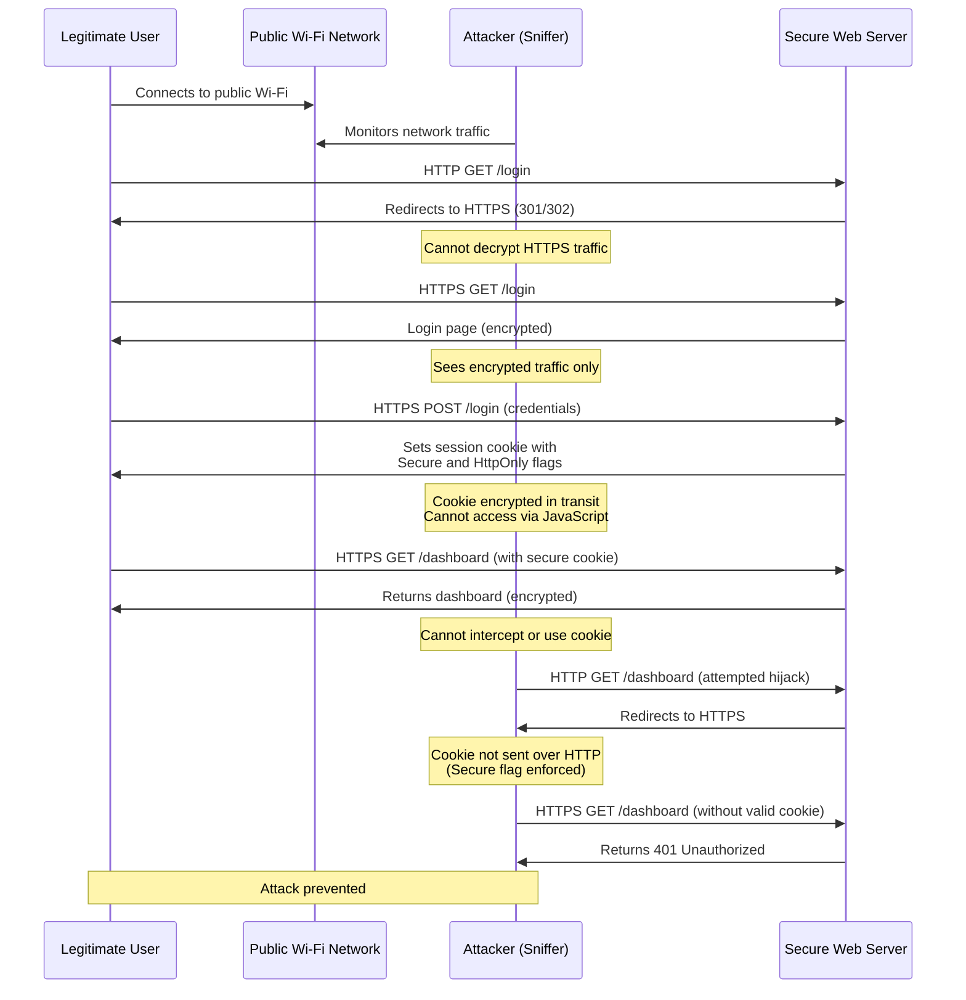
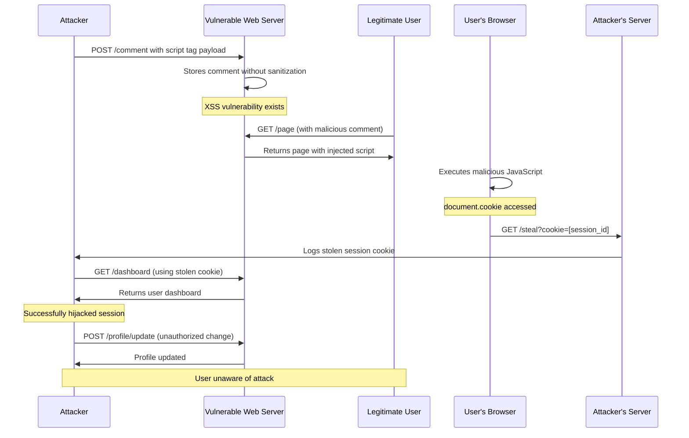
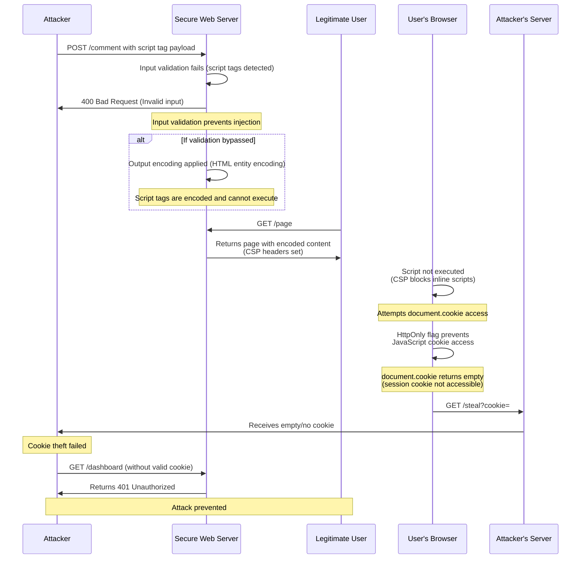
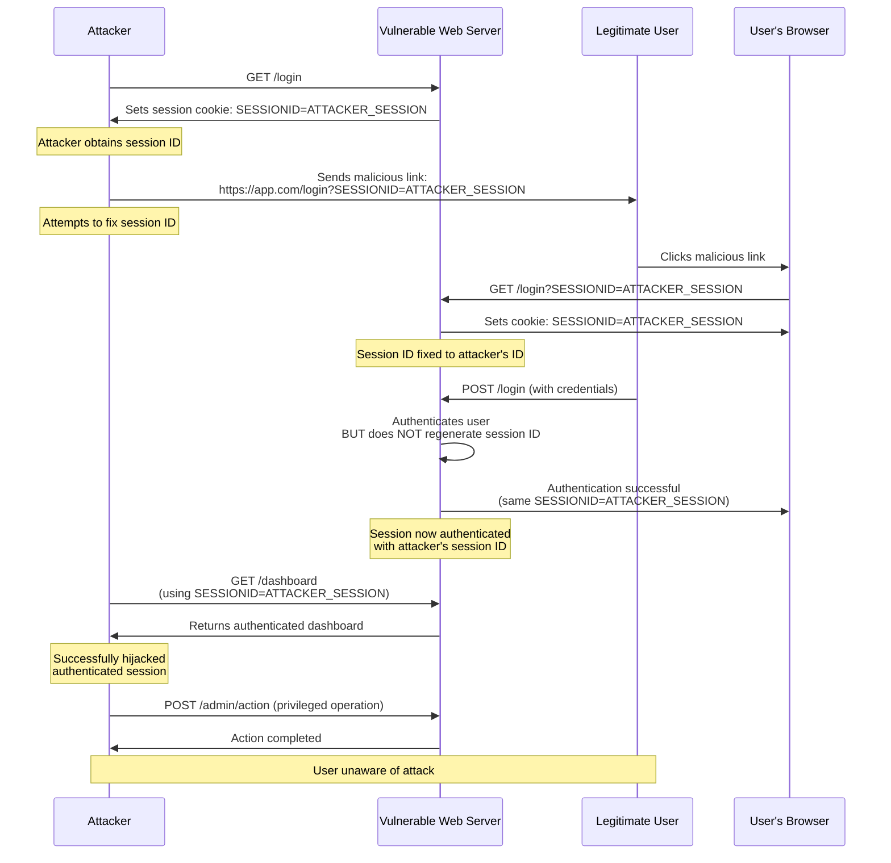
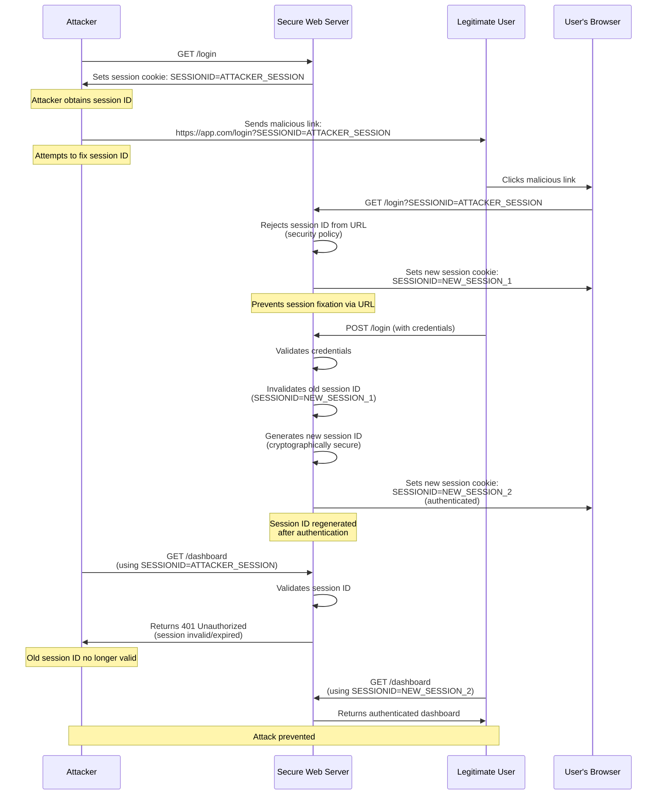

# Session Hijacking: Technical Security Documentation

> [!CAUTION]
> **Legal Disclaimer**: This document is for strictly educational and professional security research purposes. Unauthorized access to computer systems is illegal. The scripts provided are Proof-of-Concept (PoC) intended for use in controlled, lab environments. The author assumes no liability for misuse of this information.

## Table of Contents
1. [Introduction and Core Concepts](#introduction-and-core-concepts)
2. [Defense Principles](#defense-principles)
3. [Mitigation Strategies](#mitigation-strategies)
4. [Real-World Attack Scenarios](#real-world-attack-scenarios)

---

## Session Hijacking Overview: Concepts and Relationships

The following diagram provides a high-level overview of Session Hijacking concepts, attack types, vectors, defense mechanisms, and their interconnections:

```mermaid
flowchart TB
    subgraph AttackTypes["Session Hijacking Attack Types"]
        SessionFixation["Session Fixation<br/>• Attacker sets session ID<br/>• Victim uses attacker's ID<br/>• Attacker reuses ID"]
        SessionSidejacking["Session Sidejacking<br/>• Network interception<br/>• Cookie theft via MITM<br/>• Unencrypted traffic"]
        XSSSessionTheft["XSS-Based Theft<br/>• JavaScript cookie access<br/>• document.cookie extraction<br/>• Malicious script injection"]
        CSRFExploitation["CSRF Exploitation<br/>• Forced session reuse<br/>• Unauthorized actions<br/>• State-changing requests"]
    end

    subgraph AttackVectors["Attack Vectors & Entry Points"]
        NetworkIntercept["Network Interception<br/>• Unencrypted HTTP<br/>• Public Wi-Fi<br/>• Man-in-the-Middle"]
        MaliciousCode["Malicious Code Injection<br/>• XSS vulnerabilities<br/>• Malicious extensions<br/>• Compromised libraries"]
        PhysicalAccess["Physical Access<br/>• Stolen devices<br/>• Unlocked sessions<br/>• Browser history"]
        PredictableIDs["Predictable Session IDs<br/>• Weak generation<br/>• Insufficient entropy<br/>• Sequential patterns"]
        URLExposure["URL Exposure<br/>• Session ID in URL<br/>• Referer headers<br/>• Browser history"]
    end

    subgraph SessionContexts["Session Contexts"]
        WebApp["Web Applications<br/>• HTTP cookies<br/>• Session storage<br/>• Authentication tokens"]
        MobileApp["Mobile Applications<br/>• OAuth tokens<br/>• API keys<br/>• Refresh tokens"]
        SingleSignOn["Single Sign-On<br/>• SAML assertions<br/>• JWT tokens<br/>• Federated sessions"]
        StatelessAuth["Stateless Authentication<br/>• JWT tokens<br/>• Signed tokens<br/>• Token validation"]
    end

    subgraph DefenseMechanisms["Defense Mechanisms"]
        HTTPSOnly["HTTPS Enforcement<br/>• Encrypted transport<br/>• HSTS headers<br/>• Certificate pinning"]
        SecureFlags["Secure Cookie Flags<br/>• HttpOnly flag<br/>• Secure flag<br/>• SameSite attribute"]
        SessionRegen["Session Regeneration<br/>• Post-authentication<br/>• Privilege escalation<br/>• Periodic rotation"]
        TokenValidation["Token Validation<br/>• Signature verification<br/>• Expiration checks<br/>• Issuer validation"]
        IPBinding["IP Binding<br/>• Source IP validation<br/>• Geographic checks<br/>• Device fingerprinting"]
        ShortTimeout["Short Timeouts<br/>• Idle timeout<br/>• Absolute timeout<br/>• Activity-based"]
    end

    subgraph AttackImpacts["Attack Impacts"]
        UnauthorizedAccess["Unauthorized Access<br/>• Account takeover<br/>• Privilege escalation<br/>• Data breach"]
        IdentityTheft["Identity Theft<br/>• Impersonation<br/>• Fraudulent actions<br/>• Reputation damage"]
        DataExposure["Data Exposure<br/>• PII leakage<br/>• Financial data<br/>• Confidential information"]
        BusinessImpact["Business Impact<br/>• Compliance violations<br/>• Financial losses<br/>• Trust erosion"]
    end

    %% Attack Types to Vectors
    SessionFixation --> PredictableIDs
    SessionSidejacking --> NetworkIntercept
    XSSSessionTheft --> MaliciousCode
    CSRFExploitation --> URLExposure

    %% Vectors to Contexts
    NetworkIntercept --> WebApp
    MaliciousCode --> WebApp
    PhysicalAccess --> WebApp
    PredictableIDs --> WebApp
    URLExposure --> WebApp
    NetworkIntercept --> MobileApp
    MaliciousCode --> MobileApp
    PredictableIDs --> SingleSignOn
    NetworkIntercept --> StatelessAuth

    %% Defenses against Attacks
    HTTPSOnly -.->|Prevents| SessionSidejacking
    SecureFlags -.->|Prevents| XSSSessionTheft
    SessionRegen -.->|Prevents| SessionFixation
    TokenValidation -.->|Prevents| PredictableIDs
    IPBinding -.->|Mitigates| NetworkIntercept
    ShortTimeout -.->|Limits| SessionSidejacking

    %% Defenses for Contexts
    HTTPSOnly --> WebApp
    SecureFlags --> WebApp
    SessionRegen --> WebApp
    TokenValidation --> MobileApp
    TokenValidation --> SingleSignOn
    TokenValidation --> StatelessAuth

    %% Attacks to Impacts
    SessionFixation --> UnauthorizedAccess
    SessionSidejacking --> UnauthorizedAccess
    XSSSessionTheft --> IdentityTheft
    CSRFExploitation --> DataExposure
    UnauthorizedAccess --> BusinessImpact
    IdentityTheft --> BusinessImpact
    DataExposure --> BusinessImpact

    %% Styling
    classDef attackType fill:#fff,stroke:#d32f2f,stroke-width:3px,color:#000
    classDef attackVector fill:#fff,stroke:#f57c00,stroke-width:3px,color:#000
    classDef context fill:#fff,stroke:#1976d2,stroke-width:3px,color:#000
    classDef defense fill:#fff,stroke:#388e3c,stroke-width:3px,color:#000
    classDef impact fill:#fff,stroke:#7b1fa2,stroke-width:3px,color:#000

    class SessionFixation,SessionSidejacking,XSSSessionTheft,CSRFExploitation attackType
    class NetworkIntercept,MaliciousCode,PhysicalAccess,PredictableIDs,URLExposure attackVector
    class WebApp,MobileApp,SingleSignOn,StatelessAuth context
    class HTTPSOnly,SecureFlags,SessionRegen,TokenValidation,IPBinding,ShortTimeout defense
    class UnauthorizedAccess,IdentityTheft,DataExposure,BusinessImpact impact

    %% Subgraph styling - transparent background with border only
    style AttackTypes fill:#ffffff10,stroke:#d32f2f,stroke-width:2px
    style AttackVectors fill:#ffffff10,stroke:#f57c00,stroke-width:2px
    style SessionContexts fill:#ffffff10,stroke:#1976d2,stroke-width:2px
    style DefenseMechanisms fill:#ffffff10,stroke:#388e3c,stroke-width:2px
    style AttackImpacts fill:#ffffff10,stroke:#7b1fa2,stroke-width:2px
```

### Legend

**Color Coding:**
- **Red Borders**: Attack Types (Session Fixation, Session Sidejacking, XSS-Based Theft, CSRF Exploitation)
- **Orange Borders**: Attack Vectors (Network Interception, Malicious Code, Physical Access, Predictable IDs, URL Exposure)
- **Blue Borders**: Session Contexts (Web Applications, Mobile Applications, Single Sign-On, Stateless Authentication)
- **Green Borders**: Defense Mechanisms (HTTPS Enforcement, Secure Cookie Flags, Session Regeneration, Token Validation, IP Binding, Short Timeouts)
- **Purple Borders**: Attack Impacts (Unauthorized Access, Identity Theft, Data Exposure, Business Impact)

**Arrow Types:**
- **Solid Arrows**: Direct relationships and dependencies (e.g., attack vectors enable attacks in specific contexts)
- **Dashed Arrows**: Defense relationships (e.g., defense mechanisms prevent or mitigate specific attacks)

### Key Relationships

1. **Attack Types → Attack Vectors**: Different attack types exploit specific vectors. For example, Session Sidejacking relies on network interception, while XSS-Based Theft requires malicious code injection.

2. **Attack Vectors → Session Contexts**: Attack vectors can target different session contexts. Network interception affects web applications, mobile apps, and stateless authentication systems.

3. **Defense Mechanisms → Attack Types**: Each defense mechanism is designed to prevent or mitigate specific attack types. HTTPS prevents Session Sidejacking, while Secure Cookie Flags protect against XSS-Based Theft.

4. **Defense Mechanisms → Session Contexts**: Defense mechanisms are applied within specific contexts. HTTPS and Secure Cookie Flags are primarily for web applications, while Token Validation applies to mobile apps and stateless authentication.

5. **Attack Types → Attack Impacts**: Successful attacks lead to various impacts. All attack types can result in unauthorized access, which may escalate to identity theft, data exposure, and business impact.

6. **Defense Effectiveness**: Multiple defense mechanisms often work together. For example, HTTPS combined with Secure Cookie Flags and Session Regeneration provides layered protection against multiple attack vectors.

---

## Introduction and Core Concepts

### Definition

Session Hijacking, also known as session theft or session sidejacking, is a security attack where an attacker steals a valid session identifier (session ID) from a legitimate user and uses it to impersonate that user. The session ID is typically stored in cookies, URL parameters, or tokens, and serves as proof of authentication. Once an attacker obtains this identifier, they can take over the user's active session without needing to know the user's credentials.

### How the Attack Works

Session hijacking exploits the stateless nature of HTTP and the reliance on session identifiers to maintain user state across multiple requests. The attack follows a general pattern:

1. **Session Establishment**: A legitimate user authenticates with the application, and the server issues a session identifier (typically a cookie or token).

2. **Session ID Theft**: The attacker obtains the session identifier through various means (network interception, XSS, physical access, etc.).

3. **Session Impersonation**: The attacker uses the stolen session identifier to make requests to the application, appearing as the legitimate user.

4. **Unauthorized Access**: The application accepts the stolen session identifier as valid, granting the attacker the same privileges as the original user.

The attack is particularly dangerous because it bypasses authentication mechanisms. The attacker doesn't need to crack passwords or exploit authentication vulnerabilities—they simply reuse an already-authenticated session.

### Impact

Session hijacking can have severe consequences for both users and organizations:

**For Users:**
- **Account Takeover**: Complete loss of control over their account
- **Identity Theft**: Attacker can perform actions in the user's name
- **Financial Loss**: Unauthorized transactions, fund transfers, or purchases
- **Privacy Violation**: Access to personal information, messages, and private data
- **Reputation Damage**: Malicious actions performed in the user's name

**For Organizations:**
- **Data Breaches**: Unauthorized access to sensitive customer or business data
- **Compliance Violations**: Failure to protect user data may violate GDPR, HIPAA, PCI-DSS, and other regulations
- **Financial Losses**: Fraudulent transactions, legal liabilities, and compensation costs
- **Trust Erosion**: Loss of customer confidence and brand reputation
- **Operational Disruption**: Need for incident response, user notifications, and security remediation

**Severity Levels:**
- **Critical**: When hijacked sessions have administrative privileges or access to sensitive financial/health data
- **High**: When sessions provide access to personal information or can perform state-changing operations
- **Medium**: When sessions have limited privileges but can still access some user data
- **Low**: When sessions are read-only or have minimal access rights

### Attack Vectors

Session hijacking can occur through multiple attack vectors:

**1. Network Interception (Session Sidejacking)**
- Intercepting unencrypted HTTP traffic on public Wi-Fi networks
- Man-in-the-Middle (MITM) attacks on local networks
- Packet sniffing on shared network segments
- Compromised network infrastructure (routers, proxies, gateways)

**2. Cross-Site Scripting (XSS)**
- Malicious JavaScript code injected into web pages
- Accessing `document.cookie` to steal session cookies
- Storing stolen session IDs and transmitting them to attacker-controlled servers
- Persistent XSS attacks that steal sessions from all visitors

**3. Session Fixation**
- Attacker sets or predicts a session ID before user authentication
- Victim authenticates using the attacker's session ID
- Attacker reuses the same session ID to gain authenticated access

**4. Predictable Session IDs**
- Weak session ID generation algorithms
- Insufficient entropy in random number generation
- Sequential or time-based session IDs
- Session IDs based on predictable user information

**5. Physical Access**
- Access to unlocked devices with active sessions
- Browser history containing session IDs in URLs
- Stolen devices with persistent authentication
- Shared or public computers with active sessions

**6. URL Exposure**
- Session IDs included in URL parameters
- Exposure through HTTP Referer headers
- Browser history and bookmarks
- Logging in web server access logs and proxy logs

**7. Malicious Software**
- Keyloggers capturing session-related data
- Malicious browser extensions accessing cookies
- Compromised applications with access to session storage
- Malware with network interception capabilities

**8. Cross-Site Request Forgery (CSRF)**
- Forcing authenticated users to perform actions using their session
- Exploiting the browser's automatic cookie transmission
- Performing unauthorized state-changing operations

---

## Defense Principles

### Core Principles for Protection

**1. Confidentiality of Session Identifiers**
Session identifiers must be treated as sensitive credentials. They should never be exposed in URLs, logs, error messages, or client-side storage that can be easily accessed. The principle of confidentiality ensures that only authorized parties can access session identifiers.

**2. Integrity of Session Data**
Session identifiers must be protected against tampering. This includes using cryptographically secure random number generators, validating session identifiers on every request, and ensuring session data cannot be modified by attackers.

**3. Transport Security**
All session-related communications must use encrypted channels. HTTPS/TLS must be enforced for all session establishment and usage. This prevents network-based interception attacks.

**4. Least Privilege**
Sessions should have the minimum necessary privileges. Users should only have access to resources and operations required for their role. This limits the impact if a session is compromised.

**5. Defense in Depth**
Multiple layers of security controls should be implemented. No single defense mechanism is sufficient. Combining HTTPS, secure cookie flags, session regeneration, and other controls provides comprehensive protection.

**6. Fail-Safe Defaults**
Security controls should default to the most secure configuration. Sessions should expire quickly, require re-authentication for sensitive operations, and invalidate on suspicious activity.

**7. Complete Mediation**
Every request must be validated against the session store. Session identifiers must be verified on each request, not just on initial authentication. This ensures that revoked or expired sessions are immediately rejected.

**8. Session Lifecycle Management**
Sessions must be properly created, maintained, and destroyed. This includes secure generation, periodic rotation, proper expiration, and secure invalidation on logout or timeout.

### When and Where to Apply Defenses

**Application Layer:**
- Implement secure session management in application code
- Use framework-provided session management features
- Apply input validation and output encoding
- Implement proper authentication and authorization checks

**Transport Layer:**
- Enforce HTTPS for all session-related traffic
- Implement HTTP Strict Transport Security (HSTS)
- Use secure cookie transmission flags
- Validate TLS certificate chains

**Infrastructure Layer:**
- Configure web servers and proxies securely
- Implement network segmentation
- Use secure load balancers and reverse proxies
- Monitor network traffic for anomalies

**Client-Side:**
- Educate users about security best practices
- Implement secure browser configurations
- Use secure storage mechanisms
- Implement client-side session timeout warnings

**Development Lifecycle:**
- Include session security in threat modeling
- Perform security code reviews
- Conduct penetration testing
- Implement security testing in CI/CD pipelines

**Operational:**
- Monitor for suspicious session activity
- Implement intrusion detection systems
- Maintain security logs and audit trails
- Establish incident response procedures

---

## Mitigation Strategies

### Primary Mitigation Techniques

**1. HTTPS Enforcement**

**Description:**
HTTPS (HTTP over TLS) encrypts all data transmitted between the client and server, including session identifiers. This prevents network-based interception attacks where attackers sniff unencrypted traffic.

**Implementation Considerations:**
- Enforce HTTPS for all session-related endpoints
- Redirect all HTTP traffic to HTTPS
- Implement HTTP Strict Transport Security (HSTS) headers
- Use secure TLS configurations (TLS 1.2 or higher, strong cipher suites)
- Implement certificate pinning for mobile applications
- Regularly update TLS libraries and configurations

**When to Use:**
- Always required for production applications
- Essential for any application handling authentication or sensitive data
- Critical for public-facing applications

**Limitations:**
- Does not protect against XSS-based theft
- Does not prevent attacks if the client device is compromised
- Requires proper certificate management

**2. Secure Cookie Flags**

**Description:**
HTTP cookies can be configured with security flags that restrict how and when they are transmitted. The HttpOnly, Secure, and SameSite flags provide multiple layers of protection.

**HttpOnly Flag:**
- Prevents JavaScript access to cookies via `document.cookie`
- Protects against XSS-based session theft
- Cookies are only accessible to the HTTP protocol

**Secure Flag:**
- Ensures cookies are only transmitted over HTTPS
- Prevents accidental transmission over unencrypted connections
- Required when using HTTPS

**SameSite Attribute:**
- Controls when cookies are sent with cross-site requests
- `Strict`: Cookies never sent in cross-site requests
- `Lax`: Cookies sent in top-level navigation (GET requests)
- `None`: Cookies sent in all requests (requires Secure flag)
- Protects against CSRF attacks and some session hijacking scenarios

**Implementation Considerations:**
- Set HttpOnly for all session cookies
- Set Secure flag when using HTTPS
- Use SameSite=Strict for maximum security, or SameSite=Lax for better user experience
- Configure cookie domain and path restrictions appropriately
- Set appropriate expiration times

**When to Use:**
- Required for all session cookies
- Essential for applications vulnerable to XSS
- Critical for preventing CSRF-based session exploitation

**3. Session Regeneration**

**Description:**
Session regeneration involves creating a new session identifier after certain events, such as successful authentication or privilege escalation. This prevents session fixation attacks and limits the window of opportunity for session theft.

**Key Events for Regeneration:**
- After successful user authentication
- After privilege level changes
- After sensitive operations
- Periodically during long-lived sessions

**Implementation Considerations:**
- Generate new session ID using cryptographically secure random number generators
- Invalidate old session ID immediately
- Transfer necessary session data to new session
- Ensure seamless user experience during regeneration
- Log regeneration events for security monitoring

**When to Use:**
- Essential after authentication
- Recommended after privilege changes
- Consider for long-lived sessions
- Critical for preventing session fixation

**4. Strong Session ID Generation**

**Description:**
Session identifiers must be generated using cryptographically secure random number generators with sufficient entropy. Weak or predictable session IDs can be guessed or brute-forced by attackers.

**Requirements:**
- Minimum 128 bits of entropy (16 bytes)
- Cryptographically secure random number generator (CSPRNG)
- No predictable patterns or sequences
- Not based on user information or timestamps
- Unique across all active sessions

**Implementation Considerations:**
- Use framework-provided secure session ID generation
- Avoid custom session ID generation unless necessary
- Regularly audit session ID generation algorithms
- Monitor for session ID collisions
- Use industry-standard algorithms (e.g., UUID v4, cryptographically random tokens)

**When to Use:**
- Required for all session management systems
- Critical for preventing session prediction attacks
- Essential for high-security applications

**5. Session Timeout and Expiration**

**Description:**
Sessions should have both idle timeouts (inactivity-based) and absolute timeouts (maximum session duration). This limits the window of opportunity for attackers and ensures that forgotten sessions don't remain active indefinitely.

**Idle Timeout:**
- Session expires after a period of inactivity
- Typical values: 15-30 minutes for web applications
- Resets on each user activity
- Balances security with user experience

**Absolute Timeout:**
- Maximum session duration regardless of activity
- Typical values: 8-24 hours
- Requires re-authentication after expiration
- Prevents indefinite session persistence

**Implementation Considerations:**
- Configure appropriate timeout values based on application sensitivity
- Implement server-side session validation
- Provide user warnings before timeout
- Allow users to extend sessions through re-authentication
- Invalidate sessions on both client and server side

**When to Use:**
- Required for all session-based applications
- Shorter timeouts for high-security applications
- Longer timeouts for better user experience in low-risk scenarios

**6. IP Address Binding**

**Description:**
Binding sessions to the originating IP address can detect and prevent session hijacking when the attacker's IP differs from the legitimate user's IP. However, this must be implemented carefully to avoid false positives from legitimate IP changes.

**Implementation Considerations:**
- Validate IP address on each request
- Handle legitimate IP changes (mobile networks, VPNs, proxies)
- Use IP binding as a warning mechanism rather than hard rejection
- Consider geographic location validation
- Implement device fingerprinting as additional validation
- Log IP changes for security monitoring

**When to Use:**
- Useful for high-security applications
- Consider for administrative sessions
- May cause issues with mobile users or VPN users
- Often used as a detection mechanism rather than prevention

**7. Token-Based Authentication (JWT/Stateless)**

**Description:**
Using stateless tokens (like JWTs) instead of server-side sessions can reduce some session hijacking risks. Tokens can include expiration, signature validation, and additional claims. However, tokens still need protection against theft.

**Advantages:**
- No server-side session storage required
- Scalable across multiple servers
- Can include additional security claims
- Stateless architecture benefits

**Security Considerations:**
- Tokens must still be protected against theft
- Implement short expiration times
- Use refresh tokens for long-lived sessions
- Validate token signatures on every request
- Include token revocation mechanisms
- Store tokens securely (HttpOnly cookies, secure storage)

**When to Use:**
- Suitable for stateless architectures
- Useful for microservices and distributed systems
- Requires careful implementation to maintain security
- Not inherently more secure than session-based authentication

### Alternative Approaches and When to Use Them

**1. Multi-Factor Authentication (MFA)**
- Requires additional authentication factors beyond session ID
- Reduces impact of session hijacking
- Use for sensitive operations or high-privilege sessions
- Can be combined with step-up authentication

**2. Device Fingerprinting**
- Identifies devices based on browser characteristics
- Detects session usage from unknown devices
- Use as additional validation layer
- Less reliable than IP binding but more user-friendly

**3. Behavioral Analysis**
- Monitors user behavior patterns
- Detects anomalous session usage
- Use for fraud detection and risk assessment
- Requires machine learning capabilities

**4. Session Activity Monitoring**
- Tracks session usage patterns
- Detects concurrent sessions from multiple locations
- Use for security monitoring and alerting
- Helps identify compromised sessions

**5. One-Time Tokens for Sensitive Operations**
- Requires additional token for critical operations
- Limits damage from session hijacking
- Use for financial transactions or administrative actions
- Provides additional security layer

**6. Client Certificate Authentication**
- Uses mutual TLS authentication
- Provides strong client identity verification
- Use for high-security applications
- Requires certificate management infrastructure

**7. CORS Configuration**
- Restricts cross-origin access to session-related API endpoints
- Prevents malicious sites from reading API responses containing session data
- Use strict origin allowlists (avoid wildcards with credentials)
- Does not prevent session theft but limits cross-origin data exfiltration

### Implementation Considerations

**Performance:**
- Session validation adds latency to each request
- Balance security checks with performance requirements
- Use efficient session storage mechanisms
- Implement caching where appropriate

**Scalability:**
- Session storage must scale with user base
- Consider distributed session storage for load balancing
- Stateless tokens may be more scalable
- Implement session cleanup for expired sessions

**User Experience:**
- Security measures should not significantly impact usability
- Provide clear timeout warnings
- Minimize re-authentication requirements
- Handle edge cases gracefully (IP changes, timezone differences)

**Compliance:**
- Ensure implementations meet regulatory requirements
- Maintain audit logs for session activities
- Implement data retention policies
- Follow industry standards (OWASP, NIST, etc.)

**Monitoring and Incident Response:**
- Implement logging for all session events
- Monitor for suspicious session activity
- Establish alerting for potential attacks
- Maintain incident response procedures
- Regular security audits and penetration testing

---

## Real-World Attack Scenarios

### Scenario 1: Public Wi-Fi Session Sidejacking

#### Attack Flow

This scenario demonstrates how an attacker can intercept unencrypted session cookies on a public Wi-Fi network and use them to hijack a user's session.

**Step-by-Step Explanation:**

1. **Network Setup**: An attacker sets up a rogue Wi-Fi access point or uses network monitoring tools on a public Wi-Fi network (e.g., coffee shop, airport, hotel).

2. **Traffic Interception**: A legitimate user connects to the public Wi-Fi and accesses a web application that uses HTTP (not HTTPS) or has misconfigured HTTPS.

3. **Session Establishment**: The user logs into the application, and the server sets a session cookie via HTTP. The cookie is transmitted in plaintext over the network.

4. **Cookie Capture**: The attacker intercepts the network traffic and captures the session cookie from HTTP headers or unencrypted HTTPS traffic (if TLS is improperly configured).

5. **Session Replay**: The attacker extracts the session cookie and uses it in their own browser to make requests to the application.

6. **Unauthorized Access**: The application accepts the stolen session cookie as valid, granting the attacker the same access privileges as the legitimate user.

7. **Malicious Actions**: The attacker performs unauthorized actions such as accessing personal information, making transactions, or modifying account settings.

**Attack Workflow Diagram:**

#### Mitigation Application

To prevent this attack, the application must enforce HTTPS for all session-related communications and implement secure cookie flags.

**Mitigation Strategy Workflow:**

**Key Mitigation Techniques Applied:**

1. **HTTPS Enforcement**: All traffic is encrypted using TLS, preventing network interception of session cookies.

2. **Secure Cookie Flag**: The `Secure` flag ensures cookies are only transmitted over HTTPS, preventing accidental transmission over unencrypted connections.

3. **HttpOnly Cookie Flag**: The `HttpOnly` flag prevents JavaScript access to cookies, providing defense in depth.

4. **HSTS Headers**: HTTP Strict Transport Security headers force browsers to use HTTPS for all future connections.

5. **Server-Side Validation**: The server validates session cookies on every request and rejects invalid or expired sessions.

### Scenario 2: XSS-Based Session Cookie Theft

#### Attack Flow

This scenario demonstrates how an attacker can steal session cookies through a Cross-Site Scripting (XSS) vulnerability and use them to hijack user sessions.

**Step-by-Step Explanation:**

1. **XSS Vulnerability Discovery**: An attacker identifies an XSS vulnerability in the web application, such as unescaped user input in a comment field, search results, or user profile.

2. **Malicious Payload Injection**: The attacker injects malicious JavaScript code into the vulnerable application. The payload is designed to access and exfiltrate session cookies.

3. **Payload Execution**: When a legitimate user visits the page containing the malicious payload, their browser executes the JavaScript code in the context of the vulnerable application.

4. **Cookie Access**: The malicious JavaScript accesses `document.cookie`, which contains all cookies for the current domain, including the session cookie.

5. **Cookie Exfiltration**: The malicious script sends the stolen session cookie to an attacker-controlled server via various methods (image request, fetch API, form submission).

6. **Session Replay**: The attacker receives the stolen session cookie and uses it in their own browser to make authenticated requests.

7. **Unauthorized Access**: The application accepts the stolen session cookie, granting the attacker access to the user's account.

**Attack Workflow Diagram:**

#### Mitigation Application

To prevent this attack, the application must implement secure cookie flags (HttpOnly), input validation, output encoding, and Content Security Policy.

**Mitigation Strategy Workflow:**

**Key Mitigation Techniques Applied:**

1. **HttpOnly Cookie Flag**: The `HttpOnly` flag prevents JavaScript from accessing session cookies via `document.cookie`, blocking the primary attack vector.

2. **Input Validation**: Server-side validation rejects or sanitizes malicious input before storage, preventing XSS payload injection.

3. **Output Encoding**: All user-generated content is properly encoded when displayed, preventing script execution even if malicious content is stored.

4. **Content Security Policy (CSP)**: CSP headers restrict which scripts can execute, preventing inline script execution and unauthorized external script loading.

5. **Secure Cookie Flag**: Combined with HTTPS, ensures cookies are only transmitted over encrypted connections.

6. **Session Validation**: Server validates session cookies on every request and checks for suspicious activity patterns.

### Scenario 3: Session Fixation Attack

#### Attack Flow

This scenario demonstrates how an attacker can fix a session ID before user authentication and then reuse that session ID after the user authenticates, effectively hijacking the authenticated session.

**Step-by-Step Explanation:**

1. **Session ID Acquisition**: An attacker obtains a session ID from the application. This can be done by:
   - Requesting a session from the login page (before authentication)
   - Predicting or generating a session ID if the application uses weak session ID generation
   - Exploiting a vulnerability that allows session ID manipulation

2. **Session ID Fixation**: The attacker forces the victim to use the attacker's session ID. Methods include:
   - Sending a malicious link with the session ID as a URL parameter
   - Using XSS to set the session cookie to the attacker's session ID
   - Exploiting a vulnerability that allows cookie manipulation

3. **Victim Authentication**: The victim clicks the malicious link or visits the application, using the attacker's session ID. The victim then authenticates (logs in) using their legitimate credentials.

4. **Session Upgrade**: The application authenticates the user but does not regenerate the session ID. The existing session (with the attacker's session ID) is now associated with an authenticated user.

5. **Session Reuse**: The attacker uses their original session ID to access the application. Since the session ID is now associated with an authenticated user, the attacker gains full access.

6. **Unauthorized Access**: The attacker can now perform any action available to the authenticated user, including accessing sensitive data and performing privileged operations.

**Attack Workflow Diagram:**

#### Mitigation Application

To prevent this attack, the application must regenerate the session ID after successful authentication and implement proper session management controls.

**Mitigation Strategy Workflow:**

**Key Mitigation Techniques Applied:**

1. **Session Regeneration After Authentication**: The application generates a new session ID immediately after successful authentication, invalidating any pre-authentication session IDs.

2. **Session ID Validation**: The server validates session IDs on every request and rejects invalid, expired, or unauthenticated session IDs.

3. **URL Parameter Rejection**: The application does not accept session IDs from URL parameters, preventing session fixation via malicious links.

4. **Secure Session ID Generation**: New session IDs are generated using cryptographically secure random number generators with sufficient entropy.

5. **Session Invalidation**: Old session IDs are immediately invalidated when new ones are created, ensuring they cannot be reused.

6. **Cookie-Only Session Management**: Session IDs are only transmitted via secure HTTP cookies (with HttpOnly and Secure flags), not via URL parameters.

7. **Authentication State Verification**: The server verifies that sessions are properly authenticated before granting access to protected resources.

