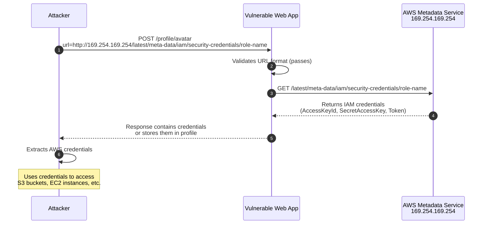
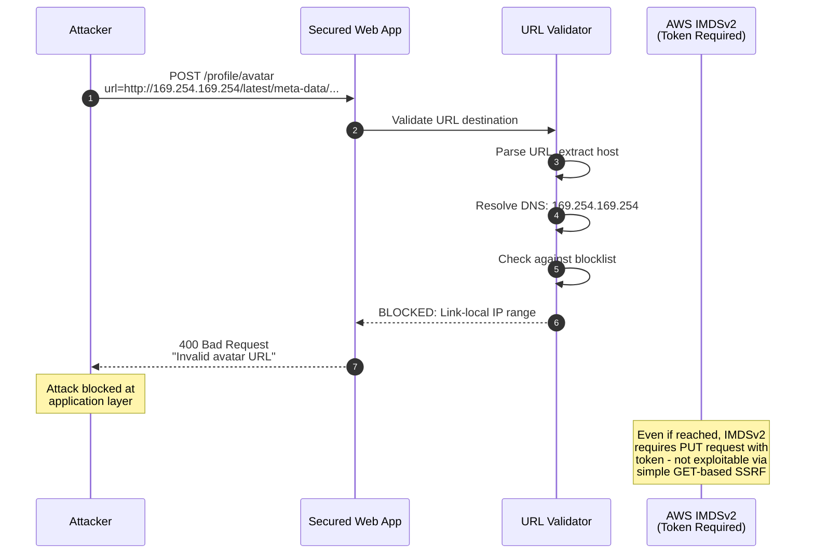
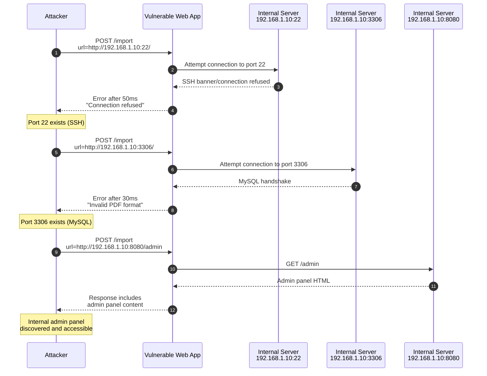
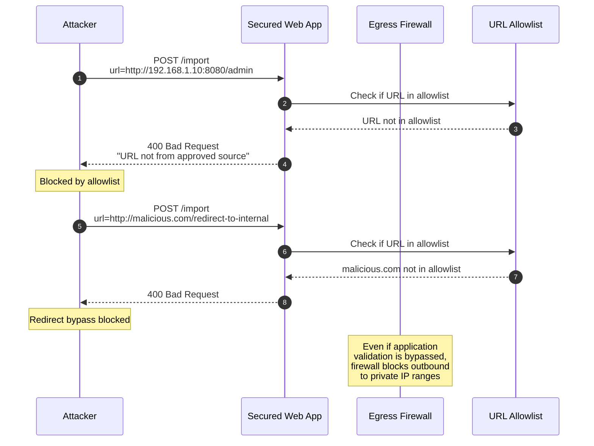
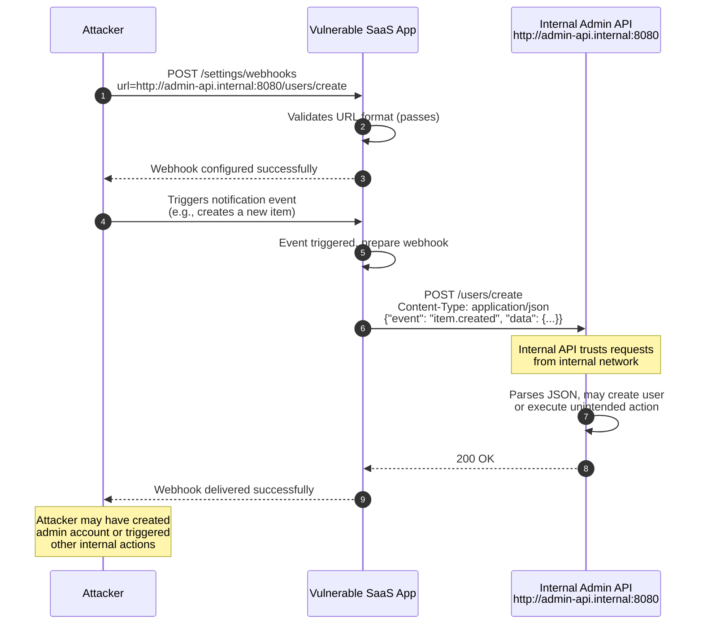
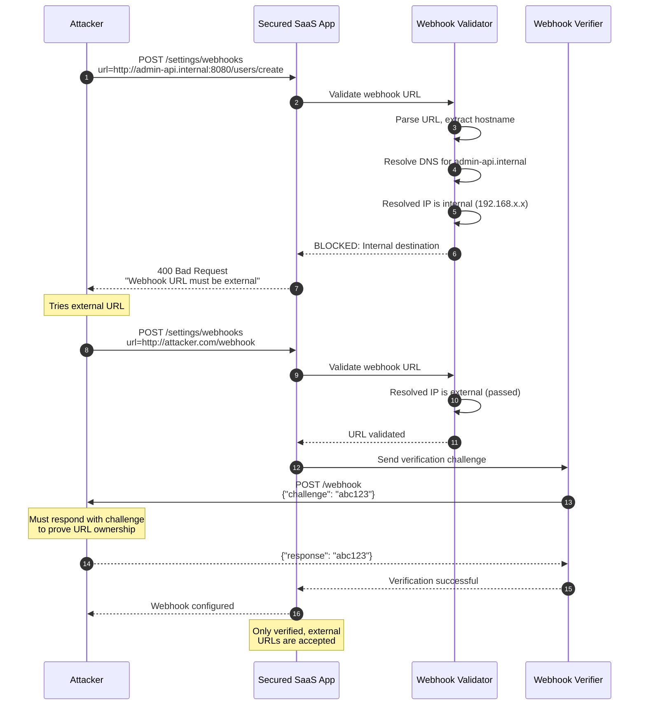
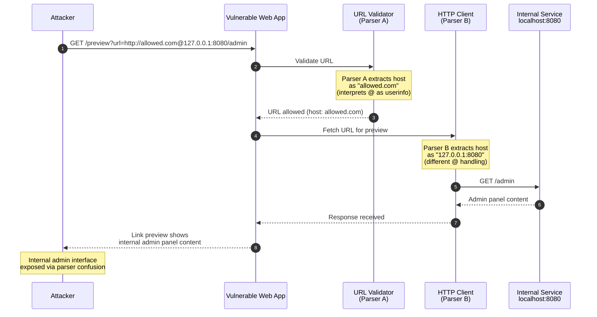
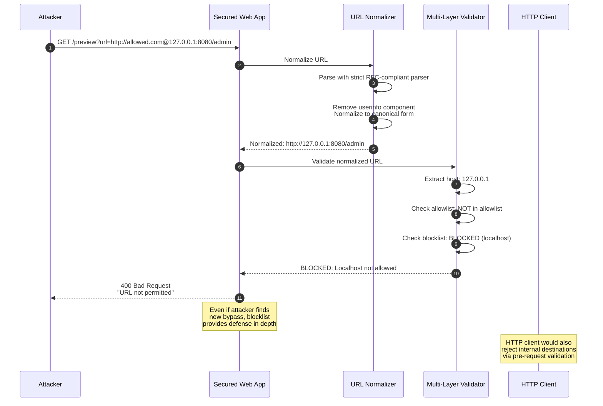

# Server-Side Request Forgery (SSRF)

> [!CAUTION]
> **Legal Disclaimer**: This document is for strictly educational and professional security research purposes. Unauthorized access to computer systems is illegal. The scripts provided are Proof-of-Concept (PoC) intended for use in controlled, lab environments. The author assumes no liability for misuse of this information.

## Table of Contents

1. [Overview Diagram](#overview-diagram)
2. [Introduction and Core Concepts](#introduction-and-core-concepts)
   - [Definition](#definition)
   - [How the Attack Works](#how-the-attack-works)
   - [Impact](#impact)
   - [Attack Vectors](#attack-vectors)
3. [Defense Principles](#defense-principles)
   - [Core Principles for Protection](#core-principles-for-protection)
   - [When and Where to Apply Defenses](#when-and-where-to-apply-defenses)
4. [Mitigation Strategies](#mitigation-strategies)
   - [Primary Mitigation Techniques](#primary-mitigation-techniques)
   - [Alternative Approaches](#alternative-approaches)
   - [Implementation Considerations](#implementation-considerations)
5. [Real-World Attack Scenarios](#real-world-attack-scenarios)
   - [Scenario 1: Cloud Metadata Service Exploitation](#scenario-1-cloud-metadata-service-exploitation)
   - [Scenario 2: Internal Port Scanning](#scenario-2-internal-port-scanning)
   - [Scenario 3: Webhook Feature Abuse](#scenario-3-webhook-feature-abuse)
   - [Scenario 4: URL Parser Bypass Attack](#scenario-4-url-parser-bypass-attack)

---

## Overview Diagram

```mermaid
flowchart TB
    subgraph Legend["Legend"]
        style Legend fill:#ffffff10,stroke:#666666,stroke-width:2px
        direction LR
        L1["🔴 Attack Types"]
        L2["🟠 Attack Vectors"]
        L3["🔵 Contexts/Targets"]
        L4["🟢 Defense Mechanisms"]
        L5["🟣 Impacts"]
        L6["→ Exploits/Leads To"]
        L7["-.-> Mitigates"]
    end

    subgraph AttackTypes["Attack Types"]
        style AttackTypes fill:#ffffff10,stroke:#dc3545,stroke-width:3px
        SSRF["SSRF Attack"]
        BasicSSRF["Basic SSRF"]
        BlindSSRF["Blind SSRF"]
        PartialSSRF["Partial SSRF"]
    end

    subgraph Vectors["Attack Vectors"]
        style Vectors fill:#ffffff10,stroke:#fd7e14,stroke-width:3px
        URLParam["URL Parameters"]
        WebHooks["WebHooks/Callbacks"]
        FileImports["File Import URLs"]
        PDFGen["PDF/Image Generators"]
        XMLParsing["XML External Entities"]
        RedirectAbuse["Open Redirects"]
    end

    subgraph Targets["Internal Targets"]
        style Targets fill:#ffffff10,stroke:#0d6efd,stroke-width:3px
        CloudMeta["Cloud Metadata Services"]
        InternalAPIs["Internal APIs"]
        DatabaseServers["Database Servers"]
        AdminPanels["Admin Interfaces"]
        LocalServices["Localhost Services"]
        InternalNetwork["Internal Network"]
    end

    subgraph Defenses["Defense Mechanisms"]
        style Defenses fill:#ffffff10,stroke:#198754,stroke-width:3px
        InputValidation["Input Validation"]
        Allowlisting["URL/IP Allowlisting"]
        Blocklisting["Private IP Blocklisting"]
        NetworkSeg["Network Segmentation"]
        DisableRedirects["Disable Redirects"]
        DNSResolution["DNS Resolution Controls"]
        ResponseValidation["Response Validation"]
        IMDSv2["IMDSv2 for Cloud"]
    end

    subgraph Impacts["Attack Impacts"]
        style Impacts fill:#ffffff10,stroke:#6f42c1,stroke-width:3px
        DataExfil["Data Exfiltration"]
        CredTheft["Credential Theft"]
        RCE["Remote Code Execution"]
        NetworkMapping["Network Mapping"]
        ServiceDisruption["Service Disruption"]
        PrivilegeEsc["Privilege Escalation"]
    end

    %% Attack Type Relationships
    SSRF --> BasicSSRF
    SSRF --> BlindSSRF
    SSRF --> PartialSSRF

    %% Vector to Attack Relationships
    URLParam --> SSRF
    WebHooks --> SSRF
    FileImports --> SSRF
    PDFGen --> SSRF
    XMLParsing --> SSRF
    RedirectAbuse --> SSRF

    %% Attack to Target Relationships
    BasicSSRF --> CloudMeta
    BasicSSRF --> InternalAPIs
    BasicSSRF --> LocalServices
    BlindSSRF --> DatabaseServers
    BlindSSRF --> InternalNetwork
    PartialSSRF --> AdminPanels

    %% Target to Impact Relationships
    CloudMeta --> CredTheft
    InternalAPIs --> DataExfil
    DatabaseServers --> DataExfil
    AdminPanels --> PrivilegeEsc
    LocalServices --> RCE
    InternalNetwork --> NetworkMapping

    %% Defense Mitigations
    InputValidation -.-> URLParam
    Allowlisting -.-> SSRF
    Blocklisting -.-> LocalServices
    Blocklisting -.-> InternalNetwork
    NetworkSeg -.-> InternalAPIs
    DisableRedirects -.-> RedirectAbuse
    DNSResolution -.-> BasicSSRF
    ResponseValidation -.-> BlindSSRF
    IMDSv2 -.-> CloudMeta

    %% Styling
    style SSRF fill:#fff,stroke:#dc3545,stroke-width:2px,color:#000
    style BasicSSRF fill:#fff,stroke:#dc3545,stroke-width:2px,color:#000
    style BlindSSRF fill:#fff,stroke:#dc3545,stroke-width:2px,color:#000
    style PartialSSRF fill:#fff,stroke:#dc3545,stroke-width:2px,color:#000
    
    style URLParam fill:#fff,stroke:#fd7e14,stroke-width:2px,color:#000
    style WebHooks fill:#fff,stroke:#fd7e14,stroke-width:2px,color:#000
    style FileImports fill:#fff,stroke:#fd7e14,stroke-width:2px,color:#000
    style PDFGen fill:#fff,stroke:#fd7e14,stroke-width:2px,color:#000
    style XMLParsing fill:#fff,stroke:#fd7e14,stroke-width:2px,color:#000
    style RedirectAbuse fill:#fff,stroke:#fd7e14,stroke-width:2px,color:#000
    
    style CloudMeta fill:#fff,stroke:#0d6efd,stroke-width:2px,color:#000
    style InternalAPIs fill:#fff,stroke:#0d6efd,stroke-width:2px,color:#000
    style DatabaseServers fill:#fff,stroke:#0d6efd,stroke-width:2px,color:#000
    style AdminPanels fill:#fff,stroke:#0d6efd,stroke-width:2px,color:#000
    style LocalServices fill:#fff,stroke:#0d6efd,stroke-width:2px,color:#000
    style InternalNetwork fill:#fff,stroke:#0d6efd,stroke-width:2px,color:#000
    
    style InputValidation fill:#fff,stroke:#198754,stroke-width:2px,color:#000
    style Allowlisting fill:#fff,stroke:#198754,stroke-width:2px,color:#000
    style Blocklisting fill:#fff,stroke:#198754,stroke-width:2px,color:#000
    style NetworkSeg fill:#fff,stroke:#198754,stroke-width:2px,color:#000
    style DisableRedirects fill:#fff,stroke:#198754,stroke-width:2px,color:#000
    style DNSResolution fill:#fff,stroke:#198754,stroke-width:2px,color:#000
    style ResponseValidation fill:#fff,stroke:#198754,stroke-width:2px,color:#000
    style IMDSv2 fill:#fff,stroke:#198754,stroke-width:2px,color:#000
    
    style DataExfil fill:#fff,stroke:#6f42c1,stroke-width:2px,color:#000
    style CredTheft fill:#fff,stroke:#6f42c1,stroke-width:2px,color:#000
    style RCE fill:#fff,stroke:#6f42c1,stroke-width:2px,color:#000
    style NetworkMapping fill:#fff,stroke:#6f42c1,stroke-width:2px,color:#000
    style ServiceDisruption fill:#fff,stroke:#6f42c1,stroke-width:2px,color:#000
    style PrivilegeEsc fill:#fff,stroke:#6f42c1,stroke-width:2px,color:#000
```

### Key Relationships

| Relationship | Description |
|--------------|-------------|
| **Vectors → Attack Types** | Attack vectors (URL parameters, webhooks, file imports) enable SSRF attacks by providing entry points for malicious URLs |
| **Attack Types → Targets** | Different SSRF variants target specific internal resources; Basic SSRF directly accesses resources while Blind SSRF probes without seeing responses |
| **Targets → Impacts** | Successful access to internal targets leads to various impacts: cloud metadata exposure leads to credential theft, internal API access leads to data exfiltration |
| **Defenses -.-> Threats** | Defense mechanisms mitigate specific threats at different layers; allowlisting blocks unauthorized destinations while network segmentation limits lateral movement |

---

## Introduction and Core Concepts

### Definition

**Server-Side Request Forgery (SSRF)** is a web security vulnerability that allows an attacker to induce the server-side application to make HTTP requests to an arbitrary domain of the attacker's choosing. In essence, the attacker tricks the server into acting as a proxy, making requests on the attacker's behalf.

SSRF exploits the trust relationship that exists between the vulnerable server and:
- **Internal network resources** that are not directly accessible from the internet
- **Cloud metadata services** that provide sensitive configuration and credentials
- **Backend services** that trust requests originating from the application server
- **Localhost services** running on the same machine as the application

> [!IMPORTANT]
> SSRF is classified as **CWE-918** (Server-Side Request Forgery) and is listed in the **OWASP Top 10 2021** as part of category **A10:2021 – Server-Side Request Forgery**. This elevation reflects its increasing exploitation in cloud environments.

### How the Attack Works

The fundamental attack flow involves three main stages:

1. **Injection**: The attacker provides a malicious URL or URL component to the application through an input that influences server-side requests
2. **Request Execution**: The vulnerable server makes a request to the attacker-specified destination, using its own network position and credentials
3. **Exfiltration**: The attacker receives or infers information from the server's response to the malicious request

**SSRF Types:**

| Type | Description | Detection Difficulty |
|------|-------------|---------------------|
| **Basic SSRF** | Response from the backend request is returned to the attacker directly | Easy to exploit |
| **Blind SSRF** | No direct response; attacker infers success through timing, errors, or out-of-band channels | Harder to exploit but still dangerous |
| **Partial SSRF** | Only portion of the response is reflected; attacker has limited control over the URL | Contextually exploitable |

### Impact

SSRF attacks can lead to severe consequences:

| Impact Category | Description | Severity |
|-----------------|-------------|----------|
| **Credential Theft** | Access to cloud metadata services exposes IAM credentials, API keys, and secrets | Critical |
| **Data Exfiltration** | Reading internal files, databases, or API responses not meant for external access | Critical |
| **Remote Code Execution** | Accessing internal administration interfaces or exploiting vulnerable internal services | Critical |
| **Network Reconnaissance** | Mapping internal network topology, discovering services, and identifying targets | High |
| **Denial of Service** | Overwhelming internal services or causing resource exhaustion | Medium |
| **Firewall Bypass** | Using the server as a pivot point to access resources protected by network-level controls | High |

### Attack Vectors

Common entry points for SSRF attacks include:

| Vector | Description | Risk Level |
|--------|-------------|------------|
| **URL Parameters** | User-supplied URLs for fetching resources (images, documents, data) | High |
| **Webhook Configurations** | Callback URLs for notifications or integrations | High |
| **File Import/Export** | URLs for importing documents, images, or data from external sources | High |
| **PDF/Image Generators** | Services that render URLs to generate documents or screenshots | Medium |
| **API Integrations** | User-configurable API endpoints or proxy configurations | High |
| **XML External Entities (XXE)** | XML parsing that allows external entity references | Medium |
| **Open Redirects** | Chaining open redirects to bypass URL validation | Medium |
| **Protocol Handlers** | Abuse of non-HTTP protocols (file://, gopher://, dict://) | Medium |

---

## Defense Principles

### Core Principles for Protection

Effective SSRF defense requires a **defense-in-depth** approach applying multiple layers of protection:

#### 1. Input Validation and Sanitization
Never trust user-supplied URLs or URL components. Validate all inputs that influence server-side requests at multiple levels:
- **Format validation**: Ensure the input matches expected patterns
- **Scheme validation**: Restrict to allowed protocols (typically only HTTPS)
- **Destination validation**: Verify the target is an expected, trusted destination

#### 2. Allowlisting Over Blocklisting
When the application must make requests to external resources:
- **Prefer allowlisting**: Define a strict list of permitted destinations
- **Avoid blocklisting alone**: Attackers consistently find bypasses for blocklists
- **Combine approaches**: Use blocklisting as an additional layer, not the primary defense

#### 3. Network-Level Controls
Implement restrictions at the network layer to limit the impact of successful SSRF:
- **Firewall rules**: Restrict outbound connections from application servers
- **Network segmentation**: Isolate application servers from sensitive internal resources
- **Zero-trust architecture**: Require authentication for all internal service access

#### 4. Disable Unnecessary Features
Reduce attack surface by disabling features that enable SSRF:
- **Disable redirections**: Prevent following of redirects in HTTP clients
- **Limit protocols**: Disable non-HTTP protocols in URL handlers
- **Remove unused endpoints**: Eliminate functionality that processes user-supplied URLs

### When and Where to Apply Defenses

| Defense Layer | When to Apply | Where to Implement |
|---------------|---------------|-------------------|
| **Input Validation** | Always, for any user input affecting requests | Application code, API gateways |
| **Allowlisting** | When destinations are known and limited | Application layer, WAF rules |
| **Blocklisting** | As supplementary protection | Application layer, network firewalls |
| **Network Segmentation** | Infrastructure design phase | Cloud VPCs, network architecture |
| **Response Validation** | When processing external responses | Application code |
| **Cloud-Specific Controls** | In cloud environments | IMDSv2 for AWS, firewall rules |

> [!TIP]
> Apply the principle of least privilege to server-side requests. The application should only be able to reach the minimum set of destinations required for its functionality.

---

## Mitigation Strategies

### Primary Mitigation Techniques

#### 1. URL Allowlisting
Maintain a strict allowlist of permitted domains, IP addresses, and URL patterns that the application may request.

**Implementation approach:**
- Parse and normalize the user-supplied URL before validation
- Extract and validate the hostname against the allowlist
- Perform DNS resolution and validate the resolved IP against allowed ranges
- Re-validate after any redirects (or disable redirects entirely)

**Effectiveness:** Very high when destinations are predictable

#### 2. Private IP Address Blocking
Block requests to private and reserved IP address ranges to prevent access to internal resources.

**Ranges to block:**
- RFC 1918 private ranges: 10.0.0.0/8, 172.16.0.0/12, 192.168.0.0/16
- Loopback: 127.0.0.0/8
- Link-local: 169.254.0.0/16
- IPv6 equivalents: ::1, fc00::/7, fe80::/10

**Implementation approach:**
- Resolve the hostname to IP address(es) before making the request
- Validate all resolved addresses against the blocklist
- Block IPv4-mapped IPv6 addresses (::ffff:127.0.0.1)
- Handle DNS rebinding by resolving and validating immediately before the request

#### 3. Disable HTTP Redirects
Configure HTTP clients to refuse automatic redirect following, preventing redirect-based bypasses.

**Why this matters:**
- Attackers use redirects to bypass initial URL validation
- A validated external URL can redirect to internal resources
- Multiple redirects can chain through intermediate servers

#### 4. Network Segmentation
Architect networks to limit what resources application servers can reach.

**Implementation approach:**
- Place application servers in dedicated network segments
- Use firewall rules to restrict outbound access to only required destinations
- Implement internal service authentication regardless of network origin
- Deploy separate egress proxies for legitimate external requests

#### 5. DNS Resolution Controls
Prevent DNS-based attacks by controlling how hostnames are resolved.

**Implementation approach:**
- Resolve hostnames and validate IPs before making requests
- Use organization-controlled DNS servers
- Implement DNS pinning with proper TTL handling
- Monitor for DNS rebinding attempts

### Alternative Approaches

#### Response Validation
When responses must be processed, validate that they match expected formats:
- Check Content-Type headers match expectations
- Limit response size to prevent resource exhaustion
- Parse responses defensively to prevent injection

#### Cloud Metadata Protection
In cloud environments, implement specific protections:
- **AWS**: Migrate to IMDSv2, requiring session tokens for metadata access
- **GCP/Azure**: Use similar token-based metadata protection
- Block access to metadata IP ranges (169.254.169.254)

#### Web Application Firewall (WAF) Rules
Deploy WAF rules as an additional layer:
- Block requests containing internal IP addresses
- Detect common SSRF payloads and URL schemes
- Rate limit requests to suspicious destinations

### Implementation Considerations

| Consideration | Guidance |
|---------------|----------|
| **URL Parsing Libraries** | Use battle-tested URL parsing libraries; custom parsing is error-prone |
| **DNS Resolution Timing** | Resolve DNS immediately before use to prevent time-of-check to time-of-use (TOCTOU) issues |
| **IPv6 Handling** | Ensure all validations handle both IPv4 and IPv6, including mapped addresses |
| **Encoding Bypasses** | Normalize URLs before validation; handle URL encoding, unicode, and other obfuscation |
| **Error Messages** | Avoid revealing internal network details in error responses |
| **Logging and Monitoring** | Log all server-side requests for security monitoring and incident response |

> [!WARNING]
> Never rely on a single mitigation technique. SSRF bypasses are constantly evolving, and defense-in-depth is essential for robust protection.

---

## Real-World Attack Scenarios

### Scenario 1: Cloud Metadata Service Exploitation

**Context:** A web application allows users to specify a URL to fetch their profile avatar from an external source. The application runs on AWS EC2 without IMDSv2 enabled.

#### Attack Flow

1. The attacker identifies a profile avatar URL feature that fetches images from user-supplied URLs
2. Instead of a legitimate image URL, the attacker provides the AWS metadata endpoint
3. The server fetches the metadata URL, believing it's fetching an avatar
4. The response containing IAM credentials is returned or can be inferred
5. The attacker uses stolen credentials to access AWS resources

#### Mitigation Application

The following defenses would prevent this attack:

1. **Private IP Blocklisting**: Block requests to 169.254.0.0/16 (link-local range)
2. **IMDSv2 Enablement**: Require session tokens for metadata access
3. **Network Segmentation**: Firewall rules blocking metadata service access
4. **Response Validation**: Verify response is actually an image

---

### Scenario 2: Internal Port Scanning

**Context:** A document import feature allows users to provide URLs to PDF documents for processing. The application does not properly validate destinations.

#### Attack Flow

1. The attacker discovers a PDF import feature accepting arbitrary URLs
2. The attacker submits requests to various internal IP addresses and ports
3. Based on response timing and error messages, the attacker maps internal services
4. The attacker identifies vulnerable internal services (databases, admin panels)
5. Further SSRF attacks target the discovered internal services

#### Mitigation Application

The following defenses would prevent this attack:

1. **URL Allowlisting**: Only permit specific, known document sources
2. **Private IP Blocklisting**: Block all RFC 1918 ranges
3. **Network Segmentation**: Firewall rules limiting outbound connections
4. **Response Validation**: Verify response is a valid PDF before processing

---

### Scenario 3: Webhook Feature Abuse

**Context:** A SaaS application allows users to configure webhooks to receive notifications. The webhook URL validation only checks for valid URL format, not destination.

#### Attack Flow

1. The attacker creates an account and accesses webhook configuration
2. The attacker configures a webhook pointing to an internal service
3. The attacker triggers an event that causes a webhook notification
4. The server sends a POST request with event data to the internal service
5. The internal service processes the request, potentially executing commands

#### Mitigation Application

The following defenses would prevent this attack:

1. **DNS Resolution Validation**: Resolve webhook URL and validate IP is external
2. **Network Segmentation**: Restrict application server from internal admin APIs
3. **Webhook URL Verification**: Require webhook endpoints to respond with a challenge
4. **Internal Service Authentication**: Require authentication for all internal APIs

---

### Scenario 4: URL Parser Bypass Attack

**Context:** A web application fetches user-specified URLs for link preview functionality. The application implements URL validation but uses a different parser for validation vs. request execution.

#### Attack Flow

1. The attacker studies the URL parser used for validation
2. The attacker crafts a URL that passes validation but is interpreted differently by the HTTP client
3. The malicious URL appears to point to an allowed domain but actually reaches an internal resource
4. The server makes a request to the unintended internal destination
5. Sensitive internal data is exposed through the link preview

#### Mitigation Application

The following defenses would prevent this attack:

1. **Consistent URL Parsing**: Use the same parser for validation and request execution
2. **URL Normalization**: Normalize URLs to a canonical form before validation
3. **Post-Resolution Validation**: Validate the actual IP address before making the request
4. **Defense in Depth**: Apply blocklisting even after allowlist validation

---

## References

- [OWASP SSRF Prevention Cheat Sheet](https://cheatsheetseries.owasp.org/cheatsheets/Server_Side_Request_Forgery_Prevention_Cheat_Sheet.html)
- [CWE-918: Server-Side Request Forgery (SSRF)](https://cwe.mitre.org/data/definitions/918.html)
- [OWASP Top 10 2021 - A10:2021 Server-Side Request Forgery](https://owasp.org/Top10/A10_2021-Server-Side_Request_Forgery_%28SSRF%29/)
- [AWS IMDSv2 Documentation](https://docs.aws.amazon.com/AWSEC2/latest/UserGuide/configuring-instance-metadata-service.html)
- [PortSwigger SSRF Research](https://portswigger.net/web-security/ssrf)
