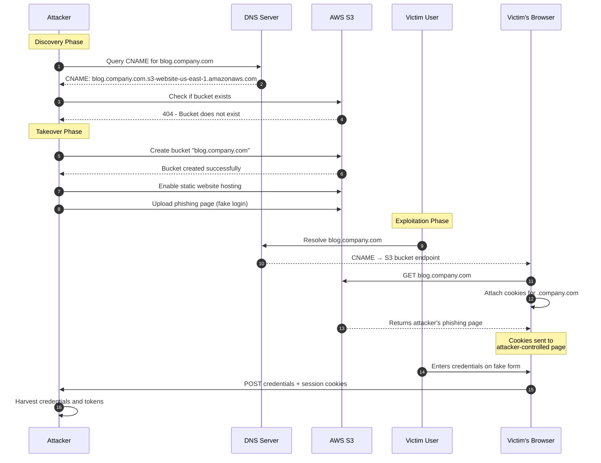
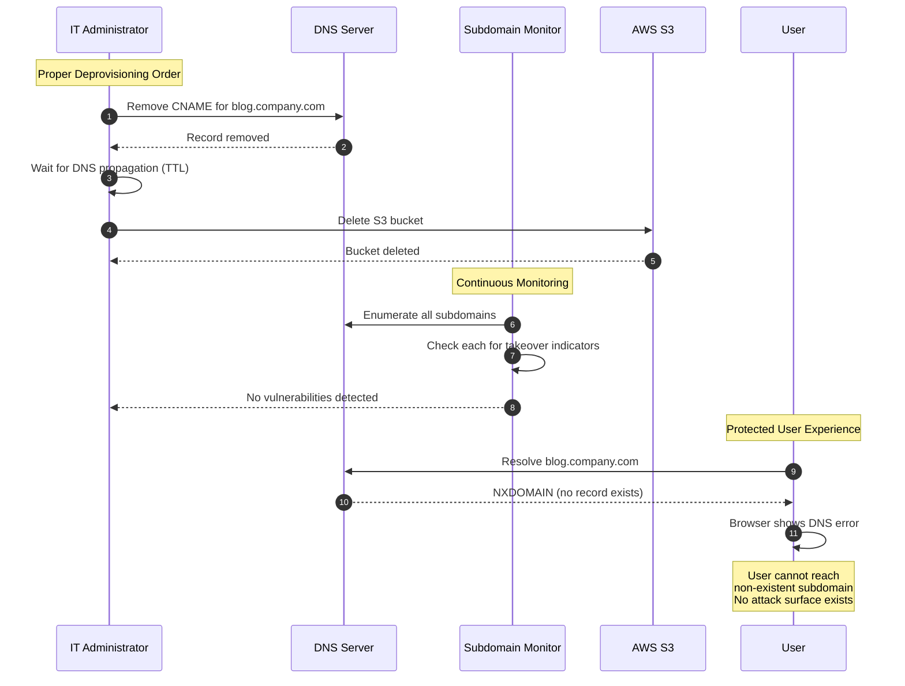
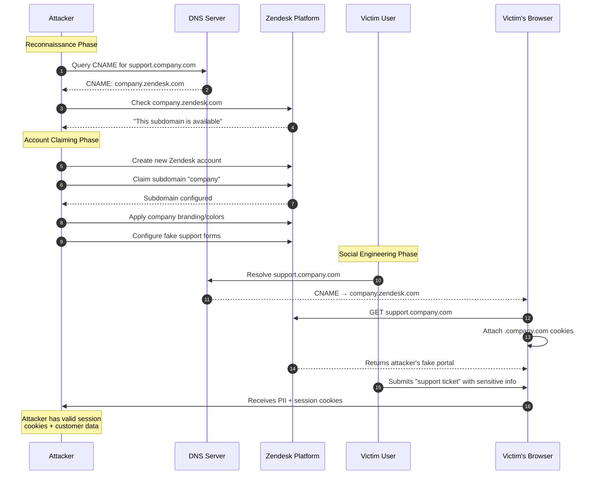
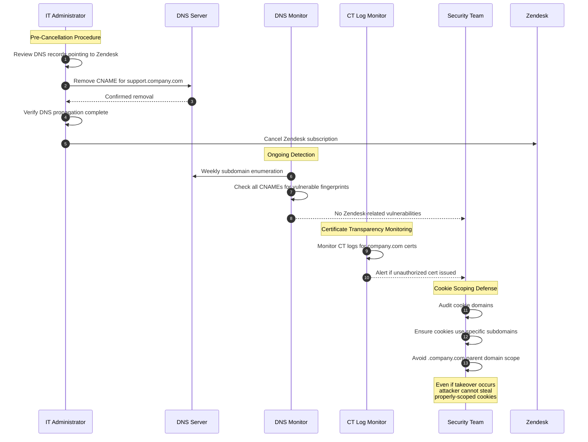
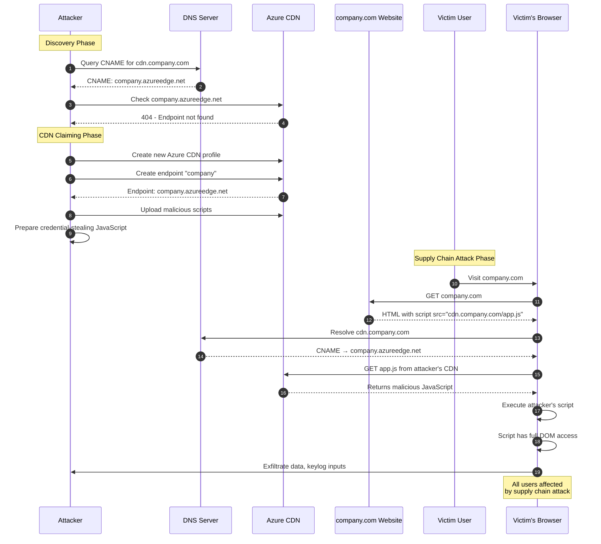
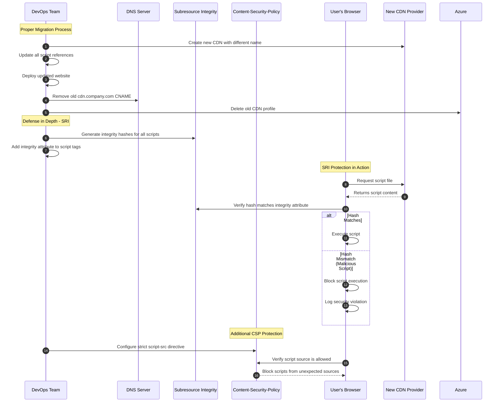
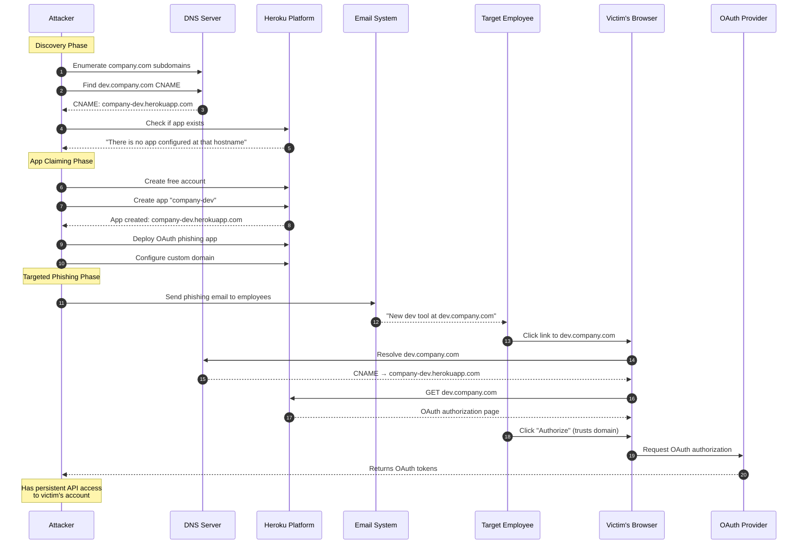
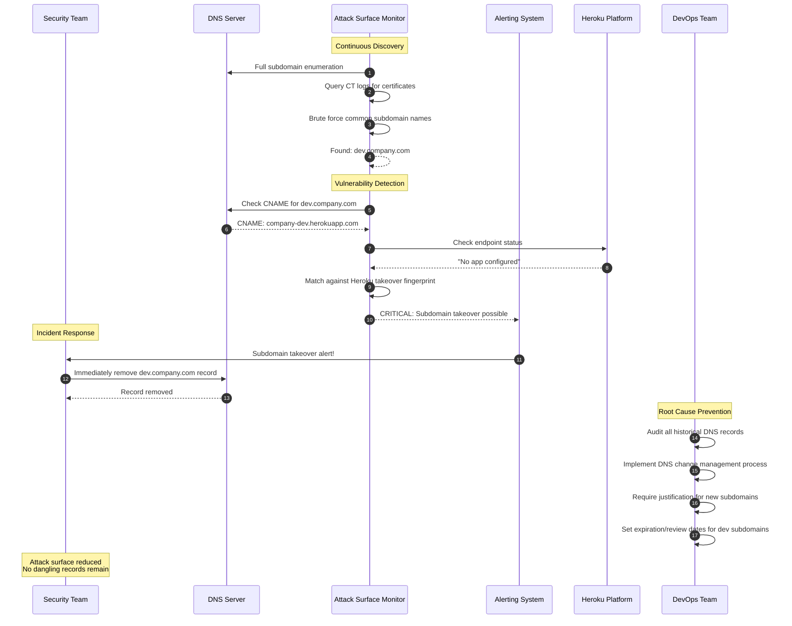

# Subdomain Takeover

> [!CAUTION]
> **Legal Disclaimer**: This document is for strictly educational and professional security research purposes. Unauthorized access to computer systems is illegal. The scripts provided are Proof-of-Concept (PoC) intended for use in controlled, lab environments. The author assumes no liability for misuse of this information.

## Table of Contents

1. [Overview Diagram](#overview-diagram)
2. [Introduction and Core Concepts](#introduction-and-core-concepts)
   - [Definition](#definition)
   - [How the Attack Works](#how-the-attack-works)
   - [Impact](#impact)
   - [Attack Vectors](#attack-vectors)
3. [Defense Principles](#defense-principles)
   - [Core Principles for Protection](#core-principles-for-protection)
   - [When and Where to Apply Defenses](#when-and-where-to-apply-defenses)
4. [Mitigation Strategies](#mitigation-strategies)
   - [Primary Mitigation Techniques](#primary-mitigation-techniques)
   - [Alternative Approaches](#alternative-approaches)
   - [Implementation Considerations](#implementation-considerations)
5. [Real-World Attack Scenarios](#real-world-attack-scenarios)
   - [Scenario 1: Abandoned Cloud Service Takeover](#scenario-1-abandoned-cloud-service-takeover)
   - [Scenario 2: Expired SaaS Integration Exploitation](#scenario-2-expired-saas-integration-exploitation)
   - [Scenario 3: Dangling CNAME to Decommissioned CDN](#scenario-3-dangling-cname-to-decommissioned-cdn)
   - [Scenario 4: Forgotten Development Environment Hijack](#scenario-4-forgotten-development-environment-hijack)

---

## Overview Diagram

```mermaid
flowchart TB
    subgraph VulnerabilityTypes["Subdomain Takeover Vulnerability Types"]
        DanglingCNAME["Dangling CNAME<br/>• Points to unclaimed resource<br/>• DNS record persists<br/>• Service deprovisioned"]
        ExpiredService["Expired Service<br/>• SaaS subscription ended<br/>• Cloud instance terminated<br/>• Third-party shutdown"]
        AbandonedBucket["Abandoned Storage<br/>• S3 bucket deleted<br/>• Azure blob removed<br/>• GCS bucket unclaimed"]
        OrphanedCDN["Orphaned CDN<br/>• CDN endpoint removed<br/>• Edge configuration deleted<br/>• Distribution abandoned"]
        ForgottenDev["Forgotten Environments<br/>• Dev/staging subdomains<br/>• Testing environments<br/>• Proof-of-concept sites"]
    end

    subgraph AttackVectors["Attack Vectors & Entry Points"]
        CloudProviders["Cloud Provider Services<br/>• AWS S3/CloudFront<br/>• Azure Blob/CDN<br/>• Google Cloud Storage"]
        SaaSPlatforms["SaaS Platforms<br/>• Heroku apps<br/>• GitHub Pages<br/>• Shopify stores"]
        CDNServices["CDN Services<br/>• Fastly<br/>• CloudFlare<br/>• Akamai"]
        PaaSProviders["PaaS Providers<br/>• AWS Elastic Beanstalk<br/>• Azure App Service<br/>• Google App Engine"]
        EmailServices["Email Services<br/>• SendGrid<br/>• Mailgun<br/>• Campaign Monitor"]
    end

    subgraph ExploitationTechniques["Exploitation Techniques"]
        ServiceClaiming["Service Name Claiming<br/>• Register matching name<br/>• Claim abandoned namespace<br/>• Control subdomain content"]
        BucketSquatting["Bucket/Resource Squatting<br/>• Create deleted bucket<br/>• Match exact naming<br/>• Assume control"]
        EndpointHijacking["Endpoint Hijacking<br/>• Claim CDN endpoint<br/>• Register app name<br/>• Deploy malicious content"]
        DNSEnumeration["DNS Enumeration<br/>• Subdomain discovery<br/>• CNAME chain analysis<br/>• Vulnerability scanning"]
    end

    subgraph DefenseMechanisms["Defense Mechanisms"]
        DNSInventory["DNS Inventory Management<br/>• Regular DNS audits<br/>• Automated monitoring<br/>• Record tracking"]
        ProperDeprovisioning["Proper Deprovisioning<br/>• Remove DNS before service<br/>• Ordered shutdown process<br/>• Verification checks"]
        CookieScoping["Cookie Scoping<br/>• Domain-specific cookies<br/>• Avoid parent domain<br/>• Strict cookie policies"]
        SubdomainMonitoring["Subdomain Monitoring<br/>• Continuous scanning<br/>• Takeover detection<br/>• Alert systems"]
        NamespaceLocking["Namespace Locking<br/>• Reserved names<br/>• Provider-side controls<br/>• Prevent reclaim"]
        CertificateMonitoring["Certificate Monitoring<br/>• CT log monitoring<br/>• Unauthorized cert detection<br/>• SSL/TLS validation"]
    end

    subgraph AttackImpact["Attack Impact"]
        CookieTheft["Cookie Theft<br/>• Session hijacking<br/>• Parent domain cookies<br/>• Authentication bypass"]
        CredentialHarvesting["Credential Harvesting<br/>• Phishing attacks<br/>• Fake login pages<br/>• Trust exploitation"]
        MalwareDistribution["Malware Distribution<br/>• Trusted domain abuse<br/>• Drive-by downloads<br/>• Payload delivery"]
        ReputationDamage["Reputation Damage<br/>• Brand impersonation<br/>• Customer distrust<br/>• Legal liability"]
        DataExfiltration["Data Exfiltration<br/>• API key interception<br/>• Sensitive data capture<br/>• Cross-origin access"]
        SupplyChainAttack["Supply Chain Attack<br/>• Script injection<br/>• Resource poisoning<br/>• Dependency hijacking"]
    end

    %% Vulnerability to Attack Vectors
    DanglingCNAME --> CloudProviders
    DanglingCNAME --> SaaSPlatforms
    DanglingCNAME --> CDNServices
    ExpiredService --> SaaSPlatforms
    ExpiredService --> PaaSProviders
    AbandonedBucket --> CloudProviders
    OrphanedCDN --> CDNServices
    ForgottenDev --> PaaSProviders
    ForgottenDev --> EmailServices

    %% Attack Vectors to Exploitation
    CloudProviders --> ServiceClaiming
    CloudProviders --> BucketSquatting
    SaaSPlatforms --> ServiceClaiming
    SaaSPlatforms --> EndpointHijacking
    CDNServices --> EndpointHijacking
    PaaSProviders --> ServiceClaiming
    EmailServices --> EndpointHijacking

    %% Exploitation to Impact
    ServiceClaiming --> CookieTheft
    ServiceClaiming --> CredentialHarvesting
    BucketSquatting --> MalwareDistribution
    BucketSquatting --> SupplyChainAttack
    EndpointHijacking --> CookieTheft
    EndpointHijacking --> CredentialHarvesting
    DNSEnumeration --> ServiceClaiming
    DNSEnumeration --> BucketSquatting

    %% Defense Connections
    DNSInventory --> DanglingCNAME
    DNSInventory --> ExpiredService
    ProperDeprovisioning --> DanglingCNAME
    ProperDeprovisioning --> AbandonedBucket
    CookieScoping --> CookieTheft
    SubdomainMonitoring --> ForgottenDev
    SubdomainMonitoring --> OrphanedCDN
    NamespaceLocking --> ServiceClaiming
    NamespaceLocking --> BucketSquatting
    CertificateMonitoring --> CredentialHarvesting

    %% Defense Mitigation (dotted lines)
    DNSInventory -.->|Prevents| DanglingCNAME
    DNSInventory -.->|Detects| ExpiredService
    ProperDeprovisioning -.->|Eliminates| DanglingCNAME
    ProperDeprovisioning -.->|Removes| AbandonedBucket
    CookieScoping -.->|Mitigates| CookieTheft
    CookieScoping -.->|Limits| DataExfiltration
    SubdomainMonitoring -.->|Identifies| ForgottenDev
    SubdomainMonitoring -.->|Alerts| OrphanedCDN
    NamespaceLocking -.->|Blocks| ServiceClaiming
    NamespaceLocking -.->|Prevents| BucketSquatting
    CertificateMonitoring -.->|Detects| CredentialHarvesting
    CertificateMonitoring -.->|Alerts| ReputationDamage

    %% Styling
    classDef vulnerabilityType fill:#ffcccc,stroke:#ff0000,stroke-width:3px,color:#000000
    classDef attackVector fill:#ffe6cc,stroke:#ff6600,stroke-width:2px,color:#000000
    classDef exploitTechnique fill:#ccccff,stroke:#0000ff,stroke-width:2px,color:#000000
    classDef defense fill:#ccffcc,stroke:#00aa00,stroke-width:2px,color:#000000
    classDef impact fill:#ffccff,stroke:#aa00aa,stroke-width:2px,color:#000000

    class DanglingCNAME,ExpiredService,AbandonedBucket,OrphanedCDN,ForgottenDev vulnerabilityType
    class CloudProviders,SaaSPlatforms,CDNServices,PaaSProviders,EmailServices attackVector
    class ServiceClaiming,BucketSquatting,EndpointHijacking,DNSEnumeration exploitTechnique
    class DNSInventory,ProperDeprovisioning,CookieScoping,SubdomainMonitoring,NamespaceLocking,CertificateMonitoring defense
    class CookieTheft,CredentialHarvesting,MalwareDistribution,ReputationDamage,DataExfiltration,SupplyChainAttack impact

    %% Subgraph styling
    style VulnerabilityTypes fill:#ffffff10,stroke:#ff0000,stroke-width:2px
    style AttackVectors fill:#ffffff10,stroke:#ff6600,stroke-width:2px
    style ExploitationTechniques fill:#ffffff10,stroke:#0000ff,stroke-width:2px
    style DefenseMechanisms fill:#ffffff10,stroke:#00aa00,stroke-width:2px
    style AttackImpact fill:#ffffff10,stroke:#aa00aa,stroke-width:2px
```

### Legend

| Color | Border Color | Category | Description |
|-------|--------------|----------|-------------|
| Light Red | Red (#ff0000) | Vulnerability Types | Root causes that enable subdomain takeover |
| Light Orange | Orange (#ff6600) | Attack Vectors | Platforms and services susceptible to takeover |
| Light Blue | Blue (#0000ff) | Exploitation Techniques | Methods attackers use to claim subdomains |
| Light Green | Green (#00aa00) | Defense Mechanisms | Protective measures and controls |
| Light Purple | Purple (#aa00aa) | Attack Impact | Consequences of successful exploitation |

### Arrow Types

| Arrow Type | Meaning |
|------------|---------|
| Solid Arrow (→) | Direct relationship or enables/leads to |
| Dotted Arrow (-.->) | Defensive mitigation or prevention |

### Key Relationships

1. **Vulnerability to Vector Chain**: Dangling DNS records pointing to various cloud and SaaS platforms create exploitable attack vectors
2. **Vector to Exploitation Flow**: Each platform type enables specific claiming or hijacking techniques
3. **Exploitation to Impact Path**: Successful takeover leads to cookie theft, credential harvesting, and supply chain attacks
4. **Defense Interception Points**: Defenses operate at multiple levels—from preventing vulnerabilities (DNS inventory) to limiting impact (cookie scoping)
5. **Critical Cookie Relationship**: Parent domain cookies set without proper scoping can be accessed by any subdomain, making cookie scoping a critical secondary defense

---

## Introduction and Core Concepts

### Definition

**Subdomain Takeover** is a security vulnerability that occurs when an attacker gains control of a subdomain belonging to a target organization. This happens when DNS records (typically CNAME records) point to external services that have been deprovisioned, cancelled, or abandoned, allowing attackers to claim those resources and serve malicious content under the trusted domain name.

According to **OWASP**, subdomain takeover is classified under "Improper Certificate Validation" and "DNS Hijacking" categories. The **CWE-200** (Exposure of Sensitive Information) and **CWE-284** (Improper Access Control) classifications are relevant, as the attack exploits improper management of DNS resources and can expose sensitive authentication tokens.

### How the Attack Works

The subdomain takeover attack follows a predictable lifecycle:

1. **Service Provisioning**: An organization creates a subdomain (e.g., `blog.yoursite.com`) and configures a CNAME record pointing to an external service (e.g., `yoursite.github.io` or `yoursite.s3.amazonaws.com`)

2. **Service Decommissioning**: The organization terminates the external service (deletes the GitHub Pages repository, removes the S3 bucket, cancels the Heroku app) but **fails to remove the corresponding DNS record**

3. **Dangling Record Detection**: Attackers systematically scan for subdomains with CNAME records pointing to unclaimed resources using DNS enumeration tools and fingerprint databases

4. **Resource Claiming**: The attacker creates a new resource on the external service with the same name, effectively claiming ownership of the target's subdomain

5. **Exploitation**: The attacker now controls content served under the trusted subdomain and can:
   - Host phishing pages that appear legitimate
   - Steal cookies scoped to the parent domain
   - Intercept sensitive traffic
   - Distribute malware from a trusted source

### Impact

Subdomain takeover has severe security implications:

| Impact Category | Description | Severity |
|-----------------|-------------|----------|
| **Session Hijacking** | Cookies set on the parent domain (`.yoursite.com`) are sent to all subdomains, including the hijacked one | Critical |
| **Credential Theft** | Users trust the domain and may enter credentials on fake login pages | Critical |
| **Phishing Amplification** | Attacks originate from legitimate-looking domains, bypassing user suspicion | High |
| **Malware Distribution** | Trusted domains bypass security filters and browser warnings | High |
| **Email Spoofing** | Some takeovers enable SPF/DKIM bypass for email spoofing | High |
| **Supply Chain Attacks** | JavaScript served from hijacked subdomains can compromise parent applications | Critical |
| **Reputation Damage** | Brand trust erosion and potential legal liability | Medium |

### Attack Vectors

The most commonly exploited services for subdomain takeover include:

**Cloud Storage Services**
- AWS S3 buckets
- Azure Blob Storage
- Google Cloud Storage

**Platform-as-a-Service (PaaS)**
- Heroku
- AWS Elastic Beanstalk
- Azure App Service
- Google App Engine

**Content Delivery Networks (CDN)**
- CloudFront distributions
- Fastly services
- Azure CDN endpoints

**Website Hosting Platforms**
- GitHub Pages
- GitLab Pages
- Surge.sh
- WordPress.com

**SaaS Applications**
- Zendesk
- Shopify
- HubSpot
- Campaign Monitor

---

## Defense Principles

### Core Principles for Protection

**1. DNS Record Lifecycle Management**

DNS records must be treated as security-sensitive assets with formal lifecycle management. The fundamental principle is: **always remove DNS records before deprovisioning the target service**. This breaks the window of opportunity for attackers to claim abandoned resources.

**2. Defense in Depth for Cookie Security**

Even with perfect DNS management, defense in depth requires proper cookie scoping. Cookies should be:
- Set with explicit domain attributes
- Scoped to the specific subdomain when possible
- Never set on the bare parent domain unless absolutely necessary
- Protected with `Secure`, `HttpOnly`, and `SameSite` attributes

**3. Continuous Monitoring and Discovery**

Organizations should maintain continuous visibility into their DNS footprint through:
- Automated subdomain enumeration
- Regular DNS record audits
- Certificate Transparency log monitoring
- External attack surface management

**4. Principle of Least Privilege for Subdomains**

Create subdomains only when necessary and remove them promptly when no longer needed. Avoid creating "just in case" subdomains that may become forgotten attack vectors.

### When and Where to Apply Defenses

| Defense Layer | When to Apply | Where to Apply |
|---------------|---------------|----------------|
| **DNS Inventory** | Continuously | All DNS zones and hosted domains |
| **Deprovisioning Procedures** | Before service termination | DevOps/Infrastructure runbooks |
| **Cookie Scoping** | At application design time | Authentication and session management |
| **Subdomain Monitoring** | Continuously | External attack surface |
| **Certificate Monitoring** | Continuously | Certificate Transparency logs |
| **Namespace Reservation** | At service creation | Cloud provider consoles |

---

## Mitigation Strategies

### Primary Mitigation Techniques

**1. Implement DNS Record Inventory and Auditing**

Maintain a comprehensive inventory of all DNS records with associated metadata:
- Service provider or destination
- Business owner and purpose
- Creation date and last review date
- Status (active, deprecated, scheduled for removal)

Conduct regular audits to identify:
- CNAME records pointing to external services
- Records with destinations that return errors (404, NXDOMAIN)
- Orphaned records with no known purpose

**2. Establish Proper Deprovisioning Procedures**

Create and enforce a strict deprovisioning order:

1. Identify all DNS records pointing to the service
2. Remove or update all DNS records
3. Wait for DNS propagation (consider TTL values)
4. Decommission the actual service
5. Verify the subdomain no longer resolves to the old service
6. Document the decommissioning in asset inventory

> [!IMPORTANT]
> Never delete a cloud resource before removing its DNS pointer. This inverted order creates the vulnerability window attackers exploit.

**3. Deploy Subdomain Takeover Monitoring**

Implement automated monitoring that:
- Enumerates all subdomains using multiple techniques (DNS zone transfer, CT logs, brute force)
- Tests each subdomain for takeover indicators (error messages, fingerprints)
- Alerts security teams when vulnerabilities are detected
- Integrates with incident response workflows

**4. Implement Proper Cookie Domain Scoping**

Protect against cookie theft by never setting sensitive cookies on the parent domain:
- Set cookies with explicit, specific subdomain scope
- Use `Domain=app.yoursite.com` instead of `Domain=.yoursite.com`
- Implement separate authentication domains for sensitive applications
- Consider using separate top-level domains for untrusted or third-party content

### Alternative Approaches

**1. Namespace Reservation with Cloud Providers**

Some cloud providers allow organizations to reserve namespaces or prevent resource name reuse:
- AWS: Use AWS Organizations SCPs to control resource naming
- Azure: Register custom domain ownership verification
- GitHub: Reserve organization-specific naming patterns

**2. Wildcard DNS with Controlled Backend**

Instead of creating individual CNAME records, use wildcard DNS entries pointing to a controlled reverse proxy that:
- Routes known subdomains to appropriate backends
- Returns 404 or blocks unknown subdomains
- Eliminates dangling record risk entirely

**3. Separate Authentication Domains**

For high-security applications, use completely separate domains for authentication:
- Main site: `yoursite.com`
- Authentication: `auth-yoursite.com` or `yoursite-auth.com`
- This prevents any subdomain takeover from accessing authentication cookies

### Implementation Considerations

**Operational Complexity**

- DNS inventory requires coordination across teams (DevOps, IT, Security)
- Deprovisioning procedures need integration with change management
- Cookie scoping changes may require significant application refactoring

**Trade-offs**

| Approach | Pros | Cons |
|----------|------|------|
| DNS Inventory | Prevents vulnerability creation | Requires ongoing maintenance |
| Deprovisioning Procedures | Addresses root cause | Requires process adherence |
| Cookie Scoping | Limits blast radius | May break legitimate functionality |
| Subdomain Monitoring | Detects existing issues | Reactive, not preventive |
| Separate Auth Domains | Strongest cookie isolation | Complex architecture |

**Cloud Provider Considerations**

Different providers have varying susceptibility and mitigation options:

| Provider | Risk Level | Mitigation Notes |
|----------|------------|------------------|
| AWS S3 | High | Global namespace; use random bucket names |
| Azure Blob | Medium | Account-scoped naming provides some protection |
| GitHub Pages | High | Easily claimable; CNAME file verification helps |
| Heroku | High | App names are globally unique and reclaimable |
| CloudFront | Medium | Distribution IDs are random; CNAME verification exists |

---

## Real-World Attack Scenarios

### Scenario 1: Abandoned Cloud Service Takeover

**Context**: A company previously hosted their blog on AWS S3 as a static website at `blog.company.com`. The marketing team migrated to a new CMS platform but IT never removed the DNS CNAME record that pointed `blog.company.com` to `blog.company.com.s3-website-us-east-1.amazonaws.com`. The original S3 bucket was deleted months ago.

#### Attack Flow

1. Attacker discovers `blog.company.com` CNAME points to a deleted S3 bucket
2. Attacker creates an S3 bucket with the exact same name in their AWS account
3. Attacker enables static website hosting on the bucket
4. Attacker deploys a phishing page mimicking the company's login portal
5. Users visiting `blog.company.com` see the fake login page
6. The attacker's page received all cookies scoped to `.company.com`
7. Attacker harvests session tokens and credentials

#### Mitigation Application

---

### Scenario 2: Expired SaaS Integration Exploitation

**Context**: The company's support portal was hosted on Zendesk at `support.company.com`. After switching to a different support platform, the Zendesk subscription was cancelled. However, the DNS CNAME record `support.company.com → company.zendesk.com` remained active. Zendesk allows new accounts to claim previously-used subdomains.

#### Attack Flow

1. Attacker identifies that `support.company.com` returns a Zendesk "subdomain available" page
2. Attacker creates a new Zendesk account and claims `company.zendesk.com`
3. Attacker configures the Zendesk portal with company branding
4. Users visiting `support.company.com` see a convincing fake support portal
5. Attacker engages victims through fake support tickets
6. Session cookies for `.company.com` are sent to the attacker-controlled Zendesk instance

#### Mitigation Application

---

### Scenario 3: Dangling CNAME to Decommissioned CDN

**Context**: Company used Azure CDN to serve static assets at `cdn.company.com`. The CDN profile was deleted during cloud cost optimization, but the CNAME record pointing `cdn.company.com` to `company.azureedge.net` was not removed. Azure allows new customers to create CDN endpoints with previously-used names.

#### Attack Flow

1. Attacker discovers `cdn.company.com` returns Azure CDN "not found" error
2. Attacker creates an Azure account and CDN profile with the endpoint name `company`
3. Attacker configures the CDN to serve malicious JavaScript files
4. Company's main website still references scripts from `cdn.company.com`
5. All site visitors load attacker's malicious scripts with full DOM access
6. Attacker executes supply chain attack via script injection

#### Mitigation Application

---

### Scenario 4: Forgotten Development Environment Hijack

**Context**: Years ago, developers created `dev.company.com` pointing to a Heroku app for a prototype. The Heroku app was deleted after the project was abandoned, but no one remembered to remove the DNS record. The CNAME still points to `company-dev.herokuapp.com`.

#### Attack Flow

1. Attacker discovers `dev.company.com` returns Heroku "no such app" error
2. Attacker creates a free Heroku account
3. Attacker creates a new Heroku app named `company-dev`
4. Attacker deploys a sophisticated OAuth phishing application
5. Attacker sends targeted phishing emails referencing the legitimate-looking subdomain
6. Victims trust the `dev.company.com` domain and authorize OAuth access
7. Attacker gains persistent API access to victim accounts

#### Mitigation Application

---

## References

- [OWASP Testing Guide - Subdomain Takeover](https://owasp.org/www-project-web-security-testing-guide/latest/4-Web_Application_Security_Testing/02-Configuration_and_Deployment_Management_Testing/10-Test_for_Subdomain_Takeover)
- [CWE-284: Improper Access Control](https://cwe.mitre.org/data/definitions/284.html)
- [Can I Take Over XYZ? - Subdomain Takeover Fingerprints](https://github.com/EdOverflow/can-i-take-over-xyz)
- [HackerOne Subdomain Takeover Disclosures](https://hackerone.com/hacktivity?querystring=subdomain%20takeover)
- [NIST SP 800-81-2: Secure Domain Name System (DNS) Deployment Guide](https://csrc.nist.gov/publications/detail/sp/800-81/2/final)
