# SQL Injection (SQLi): Technical Security Documentation

> [!CAUTION]
> **Legal Disclaimer**: This document is for strictly educational and professional security research purposes. Unauthorized access to computer systems is illegal. The scripts provided are Proof-of-Concept (PoC) intended for use in controlled, lab environments. The author assumes no liability for misuse of this information.

## Table of Contents
1. [Introduction and Core Concepts](#introduction-and-core-concepts)
2. [Defense Principles](#defense-principles)
3. [Mitigation Strategies](#mitigation-strategies)
4. [Real-World Attack Scenarios](#real-world-attack-scenarios)

---

## SQL Injection Overview: Concepts and Relationships

The following diagram provides a high-level overview of SQL Injection (SQLi) concepts, attack types, vectors, defense mechanisms, and their interconnections:

```mermaid
flowchart TB
    subgraph AttackTypes["SQL Injection Attack Types"]
        Classic["Classic SQLi<br/>(In-Band)<br/>• Direct result display<br/>• Error-based<br/>• Union-based"]
        Blind["Blind SQLi<br/>(Inferential)<br/>• Boolean-based<br/>• Time-based<br/>• No direct output"]
        OutOfBand["Out-of-Band SQLi<br/>• DNS queries<br/>• HTTP requests<br/>• External channels"]
        SecondOrder["Second-Order SQLi<br/>• Stored payload<br/>• Delayed execution<br/>• Multi-step attack"]
    end

    subgraph AttackVectors["Attack Vectors & Entry Points"]
        UserInput["User Input Fields<br/>• Login forms<br/>• Search boxes<br/>• Registration forms"]
        URLParams["URL Parameters<br/>• GET requests<br/>• Query strings<br/>• Path parameters"]
        HTTPHeaders["HTTP Headers<br/>• User-Agent<br/>• Referer<br/>• X-Forwarded-For"]
        Cookies["Cookies<br/>• Session data<br/>• Preferences<br/>• Tracking"]
        FileUploads["File Uploads<br/>• Filename parsing<br/>• Metadata extraction<br/>• Content processing"]
        APIEndpoints["API Endpoints<br/>• REST parameters<br/>• GraphQL queries<br/>• SOAP requests"]
    end

    subgraph InjectionContexts["Injection Contexts"]
        WHERE["WHERE Clause<br/>SELECT * FROM users<br/>WHERE id = 'input'"]
        UNION["UNION Queries<br/>SELECT * FROM table1<br/>UNION SELECT * FROM table2"]
        ORDERBY["ORDER BY Clause<br/>SELECT * FROM products<br/>ORDER BY input"]
        INSERT["INSERT Statements<br/>INSERT INTO users<br/>VALUES input"]
        UPDATE["UPDATE Statements<br/>UPDATE users SET<br/>field = input"]
        StoredProc["Stored Procedures<br/>EXEC sp_procedure<br/>@param = input"]
    end

    subgraph DefenseMechanisms["Defense Mechanisms"]
        PreparedStmt["Prepared Statements<br/>• Parameterized queries<br/>• Query/data separation<br/>• Type safety"]
        StoredProcDef["Safe Stored Procedures<br/>• Parameterized calls<br/>• No dynamic SQL<br/>• Input validation"]
        InputVal["Input Validation<br/>• Allowlist approach<br/>• Type checking<br/>• Format validation"]
        Escaping["Input Escaping<br/>• Database-specific<br/>• Context-aware<br/>• Last resort"]
        LeastPriv["Least Privilege<br/>• Minimal DB permissions<br/>• Read-only accounts<br/>• View-based access"]
        WAF["Web Application Firewall<br/>• Pattern detection<br/>• Signature-based<br/>• Rate limiting"]
    end

    subgraph AttackImpact["Attack Impact"]
        DataExfil["Data Exfiltration<br/>• Sensitive records<br/>• User credentials<br/>• Business data"]
        DataMod["Data Modification<br/>• Record deletion<br/>• Data corruption<br/>• Unauthorized updates"]
        AuthBypass["Authentication Bypass<br/>• Login without credentials<br/>• Privilege escalation<br/>• Session hijacking"]
        DBCompromise["Database Compromise<br/>• Schema disclosure<br/>• Table enumeration<br/>• Full DB access"]
        SystemAccess["System Access<br/>• File system access<br/>• OS command execution<br/>• Network access"]
    end

    %% Attack Vector to Types
    UserInput --> Classic
    UserInput --> Blind
    URLParams --> Classic
    URLParams --> Blind
    HTTPHeaders --> Blind
    HTTPHeaders --> SecondOrder
    Cookies --> Blind
    Cookies --> SecondOrder
    FileUploads --> OutOfBand
    APIEndpoints --> Classic
    APIEndpoints --> Blind

    %% Attack Types to Contexts
    Classic --> WHERE
    Classic --> UNION
    Classic --> INSERT
    Classic --> UPDATE
    Blind --> WHERE
    Blind --> ORDERBY
    OutOfBand --> StoredProc
    SecondOrder --> INSERT
    SecondOrder --> UPDATE

    %% Contexts to Impact
    WHERE --> AuthBypass
    WHERE --> DataExfil
    UNION --> DataExfil
    UNION --> DBCompromise
    INSERT --> DataMod
    UPDATE --> DataMod
    UPDATE --> AuthBypass
    StoredProc --> SystemAccess
    StoredProc --> DBCompromise

    %% Defense Connections
    PreparedStmt --> WHERE
    PreparedStmt --> UNION
    PreparedStmt --> INSERT
    PreparedStmt --> UPDATE
    StoredProcDef --> StoredProc
    InputVal --> UserInput
    InputVal --> URLParams
    InputVal --> HTTPHeaders
    Escaping --> WHERE
    Escaping --> INSERT
    LeastPriv --> DataExfil
    LeastPriv --> DataMod
    LeastPriv --> SystemAccess
    WAF --> Classic
    WAF --> Blind

    %% Defense Mitigation
    PreparedStmt -.->|Prevents| WHERE
    PreparedStmt -.->|Prevents| UNION
    PreparedStmt -.->|Prevents| INSERT
    PreparedStmt -.->|Prevents| UPDATE
    StoredProcDef -.->|Secures| StoredProc
    InputVal -.->|Filters| UserInput
    InputVal -.->|Filters| URLParams
    LeastPriv -.->|Limits| DataExfil
    LeastPriv -.->|Limits| DataMod
    WAF -.->|Blocks| Classic
    WAF -.->|Detects| Blind

    %% Styling
    classDef attackType fill:#ffcccc,stroke:#ff0000,stroke-width:3px,color:#000000
    classDef attackVector fill:#ffe6cc,stroke:#ff6600,stroke-width:2px,color:#000000
    classDef injectionContext fill:#ccccff,stroke:#0000ff,stroke-width:2px,color:#000000
    classDef defense fill:#ccffcc,stroke:#00aa00,stroke-width:2px,color:#000000
    classDef impact fill:#ffccff,stroke:#aa00aa,stroke-width:2px,color:#000000

    class Classic,Blind,OutOfBand,SecondOrder attackType
    class UserInput,URLParams,HTTPHeaders,Cookies,FileUploads,APIEndpoints attackVector
    class WHERE,UNION,ORDERBY,INSERT,UPDATE,StoredProc injectionContext
    class PreparedStmt,StoredProcDef,InputVal,Escaping,LeastPriv,WAF defense
    class DataExfil,DataMod,AuthBypass,DBCompromise,SystemAccess impact
```

### Diagram Legend

**Color Coding:**
- **Red Borders (Attack Types)**: Different categories of SQL injection attacks based on how results are retrieved
- **Orange Borders (Attack Vectors)**: Entry points where malicious SQL can be injected into the application
- **Blue Borders (Injection Contexts)**: SQL query locations where injection occurs
- **Green Borders (Defense Mechanisms)**: Protection strategies to prevent or mitigate SQL injection
- **Purple Borders (Attack Impact)**: Potential consequences of successful SQL injection attacks

**Arrow Types:**
- **Solid Arrows (→)**: Flow of attack or logical relationships between concepts
- **Dashed Arrows (-.->)**: Defense mechanisms preventing or mitigating specific attack vectors or impacts

### Key Relationships

1. **Attack Vectors → Attack Types**: Different input sources can lead to various SQL injection attack types. User input fields and URL parameters commonly result in classic or blind SQLi, while cookies and headers often enable blind or second-order attacks.

2. **Attack Types → Injection Contexts**: The type of SQL injection determines which SQL contexts are vulnerable. Classic SQLi typically targets WHERE clauses and UNION queries, while blind SQLi often exploits ORDER BY clauses and WHERE conditions.

3. **Injection Contexts → Attack Impact**: The specific SQL context being injected determines the potential impact. WHERE clause injections can bypass authentication, UNION queries enable data exfiltration, and stored procedure injections can lead to system-level access.

4. **Defense Mechanisms → Injection Contexts**: Prepared statements protect all major SQL contexts (WHERE, UNION, INSERT, UPDATE) by separating code from data. Safe stored procedures protect stored procedure calls, while input validation filters malicious input at entry points.

5. **Defense Mechanisms → Attack Impact**: Least privilege directly limits the potential impact by restricting database permissions, preventing data exfiltration, modification, and system access even if injection occurs.

6. **Defense Layering**: Multiple defense mechanisms work together—input validation filters at entry points, prepared statements protect query execution, and least privilege limits damage scope, creating defense-in-depth.

---

## Introduction and Core Concepts

### Definition and How the Attack Works

**SQL Injection (SQLi)** is a critical security vulnerability that occurs when an attacker can manipulate database queries by injecting malicious SQL code into application input fields. This vulnerability arises when applications construct SQL queries by concatenating user-supplied input directly into SQL statements without proper sanitization or parameterization.

#### Core Mechanism

SQL injection exploits the fundamental principle that SQL databases interpret both code and data within the same query string. When an application builds queries dynamically using string concatenation, it fails to distinguish between legitimate data and executable SQL commands. Attackers exploit this by crafting input that contains SQL syntax, which the database then executes as part of the query.

The attack works through the following process:

1. **Query Construction**: The application builds SQL queries by combining static SQL code with user-supplied input
2. **Input Injection**: An attacker provides malicious input containing SQL syntax (e.g., `' OR '1'='1`)
3. **Query Execution**: The database receives a malformed query where the attacker's SQL code is executed
4. **Result Manipulation**: The database processes the injected SQL, potentially returning unauthorized data, modifying records, or executing system commands

#### Example of Vulnerable Query Construction

A typical vulnerable application might construct a query like this:

```sql
SELECT * FROM users WHERE username = 'admin' AND password = 'user_input'
```

If the application builds this query using string concatenation:
- **Intended input**: `password123`
- **Resulting query**: `SELECT * FROM users WHERE username = 'admin' AND password = 'password123'`

However, an attacker could provide:
- **Malicious input**: `' OR '1'='1'--`
- **Resulting query**: `SELECT * FROM users WHERE username = 'admin' AND password = '' OR '1'='1'--'`

This malicious query changes the logic:
- The `OR '1'='1'` condition is always true, bypassing password validation
- The `--` comment operator removes the rest of the query, preventing syntax errors
- The attacker gains unauthorized access without a valid password

#### Query Structure Manipulation

SQL injection attacks manipulate various parts of SQL queries:

- **WHERE Clauses**: Injecting conditions that always evaluate to true (`' OR '1'='1`)
- **UNION Queries**: Appending additional SELECT statements to extract data from other tables
- **ORDER BY Clauses**: Manipulating sorting to extract information through error messages or timing
- **INSERT Statements**: Injecting malicious values into database inserts
- **UPDATE Statements**: Modifying existing records with injected SQL
- **Stored Procedures**: Exploiting dynamic SQL generation within stored procedures

### Impact and Attack Vectors

#### Impact Severity

SQL injection vulnerabilities can have devastating consequences, ranging from data exposure to complete system compromise:

**Data Exfiltration**
- Unauthorized access to sensitive user information (passwords, personal data, financial records)
- Disclosure of business-critical data (customer databases, intellectual property, trade secrets)
- Extraction of database schema information (table names, column structures, relationships)

**Data Modification**
- Deletion or corruption of critical database records
- Unauthorized updates to user accounts, financial transactions, or system configurations
- Insertion of malicious data or backdoors into the database

**Authentication Bypass**
- Login without valid credentials through manipulated WHERE clauses
- Privilege escalation by modifying user roles or permissions
- Session hijacking by extracting session tokens or authentication cookies

**Database Compromise**
- Full database access through UNION-based attacks
- Schema enumeration to understand database structure
- Access to multiple databases on shared database servers

**System-Level Access**
- File system access through database functions (e.g., `LOAD_FILE()` in MySQL, `xp_cmdshell` in SQL Server)
- Operating system command execution through database extensions
- Network access to internal systems through database network functions

**Business Impact**
- Regulatory compliance violations (GDPR, HIPAA, PCI-DSS)
- Financial losses from fraud or data breach remediation
- Reputation damage and loss of customer trust
- Legal liability and potential lawsuits

#### Attack Vectors

SQL injection can occur through any input mechanism that eventually reaches a database query:

**User Input Fields**
- Login forms where username/password are used in authentication queries
- Search boxes that query databases for matching records
- Registration forms that insert new user data
- Comment sections that store user-generated content
- Contact forms that save submissions to databases

**URL Parameters**
- GET request parameters in query strings (`?id=1' OR '1'='1`)
- Path parameters in RESTful APIs (`/users/1' OR '1'='1`)
- URL-encoded values that are decoded and used in queries

**HTTP Headers**
- User-Agent headers logged to databases
- Referer headers used in analytics queries
- X-Forwarded-For headers stored for IP tracking
- Custom headers processed by application logic

**Cookies**
- Session identifiers used in database lookups
- User preferences stored and retrieved from databases
- Tracking cookies processed by backend systems

**File Uploads**
- Filenames stored in database queries
- File metadata extracted and inserted into databases
- Content processing that parses files and queries databases

**API Endpoints**
- REST API parameters passed to database queries
- GraphQL queries that construct SQL dynamically
- SOAP request parameters used in database operations
- Webhook payloads processed and stored

**Second-Order Injection Points**
- Data stored from one input that is later used unsafely in another query
- User profiles where stored data is later concatenated into queries
- Configuration values that are read and used in dynamic queries

---

## Defense Principles

### Core Principles for Protection

Effective SQL injection defense requires understanding and applying fundamental security principles that address the root cause of the vulnerability. These principles form the foundation for all mitigation strategies.

#### Principle 1: Separation of Code and Data

The fundamental principle underlying SQL injection prevention is maintaining strict separation between SQL code (the query structure) and data (user input). The database must always be able to distinguish between executable SQL commands and data values, regardless of the content of user input.

**Why This Matters**: When code and data are mixed through string concatenation, the database cannot differentiate between intended SQL syntax and malicious input. By separating them, the database treats all user input as literal data, never as executable code.

**Implementation**: This principle is primarily enforced through parameterized queries (prepared statements), where the SQL structure is defined separately from the data values, which are bound as parameters.

#### Principle 2: Defense in Depth

No single security control is perfect. Defense in depth involves implementing multiple layers of protection, so that if one layer fails, others can still prevent or limit the attack.

**Layers of Defense**:
- **Input Validation**: Filter malicious input at application boundaries
- **Parameterized Queries**: Prevent injection at the query construction level
- **Least Privilege**: Limit database account permissions to minimize damage
- **Output Encoding**: Protect against injection in output contexts (though less relevant for SQLi)
- **Monitoring and Logging**: Detect and respond to injection attempts

**Why This Matters**: Even if an attacker bypasses input validation, parameterized queries prevent execution. Even if parameterization fails, least privilege limits the scope of damage. Multiple layers ensure comprehensive protection.

#### Principle 3: Least Privilege

Database accounts used by applications should have the minimum permissions necessary to perform their required functions. This principle limits the potential damage if SQL injection occurs.

**Permission Restrictions**:
- **Read-Only Accounts**: For queries that only retrieve data, grant only SELECT permissions
- **Limited Write Access**: For operations that modify data, grant only INSERT, UPDATE, or DELETE on specific tables
- **No Administrative Rights**: Never grant DBA, admin, or owner privileges to application accounts
- **No System Functions**: Restrict access to database functions that interact with the operating system

**Why This Matters**: If SQL injection succeeds, the attacker's capabilities are limited by the database account's permissions. A read-only account cannot delete data or execute system commands, even if injection occurs.

#### Principle 4: Fail Securely

When errors occur or unexpected conditions arise, the system should fail in a secure state that does not expose sensitive information or enable further attacks.

**Secure Failure Practices**:
- **Generic Error Messages**: Do not reveal database structure, query syntax, or system information in error messages
- **No Query Details**: Avoid logging or displaying the actual SQL query that failed
- **Graceful Degradation**: Handle errors without exposing internal application state
- **No Debug Information**: Ensure production environments do not leak debugging details

**Why This Matters**: Error messages can provide attackers with valuable information about database structure, helping them craft more effective injection payloads. Secure failure prevents information disclosure.

#### Principle 5: Input Validation as a Secondary Defense

While input validation cannot reliably prevent SQL injection when used alone, it serves as an important secondary defense that can detect and block many attack attempts before they reach the database layer.

**Validation Approaches**:
- **Allowlist Validation**: Only accept known-good values (preferred)
- **Type Checking**: Ensure inputs match expected data types (integers, dates, etc.)
- **Format Validation**: Verify inputs match expected patterns (email format, phone numbers)
- **Length Limits**: Restrict input length to prevent overly complex injection payloads

**Why This Matters**: Input validation can catch obvious injection attempts early, reducing load on the database and providing an additional security layer. However, it must be combined with parameterized queries, as validation alone is insufficient.

### When and Where to Apply Defenses

Understanding where and when to apply these defense principles is crucial for effective protection.

#### Application Layer (Primary Defense Location)

**Where**: All code that constructs database queries
- Data access layers and database abstraction layers
- ORM (Object-Relational Mapping) frameworks
- Direct database query construction code
- Stored procedure call sites

**When**: 
- **During Development**: Implement parameterized queries from the start
- **Code Reviews**: Verify all database queries use parameterization
- **Refactoring**: Replace string concatenation with parameterized queries
- **New Features**: Apply defense principles to all new database interactions

**Primary Defense**: Parameterized queries (prepared statements) should be the default approach for all database queries that include user input.

#### Input Validation Layer (Secondary Defense)

**Where**: Application entry points
- HTTP request handlers
- API endpoints
- Form submission handlers
- File upload processors
- Webhook receivers

**When**:
- **Input Reception**: Validate all user input immediately upon receipt
- **Before Processing**: Validate before any business logic or database operations
- **Type Conversion**: Validate during type conversion operations
- **Boundary Crossing**: Validate when data crosses trust boundaries

**Secondary Defense**: Input validation should complement, not replace, parameterized queries. Use allowlist validation for known-good values and format validation for structured data.

#### Database Layer (Damage Limitation)

**Where**: Database server configuration and account management
- Database user account creation
- Permission assignment
- Role configuration
- View creation for data access control

**When**:
- **Account Setup**: Apply least privilege during initial database account creation
- **Permission Audits**: Regularly review and restrict database permissions
- **Access Control Design**: Design database access patterns with minimal permissions
- **Incident Response**: Further restrict permissions after security incidents

**Damage Limitation**: Least privilege cannot prevent SQL injection, but it limits the impact if injection occurs. This is a critical defense-in-depth measure.

#### Infrastructure Layer (Detection and Prevention)

**Where**: Network and application infrastructure
- Web Application Firewalls (WAF)
- Database firewalls
- Intrusion detection systems
- Application performance monitoring

**When**:
- **Traffic Inspection**: Monitor all database-bound traffic for injection patterns
- **Anomaly Detection**: Identify unusual query patterns or error rates
- **Rate Limiting**: Prevent automated injection attacks through rate limiting
- **Incident Response**: Block malicious traffic during active attacks

**Detection and Prevention**: Infrastructure-level defenses can detect and block many injection attempts, but they should supplement, not replace, application-level defenses.

#### Special Cases: When Standard Defenses Are Challenging

**Dynamic Table/Column Names**: When table or column names must come from user input (a design that should be avoided), use allowlist validation to map user input to known-safe database identifiers.

**Complex Queries**: For queries that cannot be easily parameterized (e.g., dynamic WHERE clause construction), use query builders that support safe parameterization or carefully validate and escape all components.

**Legacy Systems**: When refactoring to parameterized queries is not immediately possible, implement input validation and escaping as temporary measures while planning migration to parameterized queries.

**Stored Procedures with Dynamic SQL**: If stored procedures must generate dynamic SQL, ensure they use parameterized queries internally and validate all inputs that influence query construction.

---

## Mitigation Strategies

### Primary Mitigation Techniques

#### Strategy 1: Prepared Statements (Parameterized Queries)

Prepared statements are the most effective and recommended defense against SQL injection. They enforce separation between SQL code and data by requiring developers to define the query structure first, then bind data values as parameters.

**How It Works**:

1. **Query Definition**: The SQL query structure is defined with placeholders (typically `?` or `:parameter_name`) where data will be inserted
2. **Query Compilation**: The database parses and compiles the query structure, creating an execution plan
3. **Parameter Binding**: User input is bound to the placeholders as literal data values
4. **Query Execution**: The database executes the pre-compiled query with the bound parameters

**Why It's Effective**:

- **Code/Data Separation**: The database always distinguishes between the query structure (code) and parameter values (data)
- **Intent Preservation**: Even if malicious SQL is injected into a parameter, it is treated as literal data, not executable code
- **Type Safety**: Parameters are bound with specific data types, preventing type confusion attacks
- **Performance Benefits**: Pre-compiled queries can be reused, improving performance

**Example of Safe Query Construction**:

Instead of:
```sql
SELECT * FROM users WHERE username = 'admin' AND password = 'user_input'
```

Use:
```sql
SELECT * FROM users WHERE username = ? AND password = ?
```

The parameter values (`admin` and `user_input`) are bound separately, and even if `user_input` contains `' OR '1'='1`, it is treated as a literal string value, not SQL code.

**Implementation Considerations**:

- **Language Support**: Virtually all programming languages and database drivers support prepared statements
- **ORM Frameworks**: Most ORMs (Hibernate, Entity Framework, Django ORM) use parameterized queries by default
- **Query Builders**: Use query builders that support parameterization rather than string concatenation
- **Consistent Application**: Apply prepared statements to ALL queries that include user input, not just some

#### Strategy 2: Safe Stored Procedures

Stored procedures can provide effective SQL injection protection when implemented correctly. The key requirement is that stored procedures use parameterized queries internally and do not construct dynamic SQL using string concatenation.

**How It Works**:

1. **Procedure Definition**: Stored procedures are defined in the database with parameters
2. **Parameterized Calls**: Applications call stored procedures with parameters, not by building SQL strings
3. **Internal Safety**: Stored procedures use parameterized queries internally (if they execute queries)
4. **No Dynamic SQL**: Stored procedures avoid constructing SQL dynamically from input

**Why It's Effective**:

- **Parameter Binding**: Like prepared statements, parameters are bound as data, not code
- **Database-Level Logic**: Business logic in stored procedures can add additional validation
- **Access Control**: Stored procedures can enforce access control at the database level
- **Abstraction**: Applications don't need to know the exact SQL structure

**Safe Implementation Requirements**:

- **Parameterized Procedures**: Stored procedures must accept parameters, not concatenate input into SQL
- **No Dynamic SQL**: Avoid `EXEC()`, `EXECUTE()`, or `sp_executesql` with string concatenation
- **Input Validation**: Stored procedures should validate parameter types and ranges
- **Error Handling**: Procedures should handle errors securely without exposing query details

**When to Use**:

- **Complex Business Logic**: When database operations involve complex logic that benefits from being in the database
- **Performance Requirements**: When stored procedures provide performance benefits for specific operations
- **Legacy Systems**: When migrating from dynamic SQL to stored procedures is more feasible than application changes
- **Access Control**: When fine-grained database-level access control is required

**Security Considerations**:

- **Execute Permissions**: Stored procedures require EXECUTE permissions, which may require broader database access than direct queries
- **Dynamic SQL Risk**: Stored procedures that build SQL dynamically are just as vulnerable as application code
- **Audit Requirements**: Regularly audit stored procedures for dynamic SQL construction

#### Strategy 3: Allowlist Input Validation

For cases where parameterized queries cannot be used (such as dynamic table names, column names, or sort order indicators), allowlist validation is the appropriate defense.

**How It Works**:

1. **Known-Good Values**: Define a strict allowlist of acceptable values
2. **Input Mapping**: Map user input to allowlisted values
3. **Rejection**: Reject any input that doesn't match the allowlist
4. **Direct Use**: Use the allowlisted value directly in the query (not user input)

**Why It's Effective**:

- **Strict Control**: Only known-safe values can be used in queries
- **No Injection Possible**: Since only predefined values are used, injection is impossible
- **Type Safety**: Ensures values match expected types and formats

**Example Implementation**:

For dynamic table names, instead of using user input directly:
```sql
SELECT * FROM user_input_table
```

Use allowlist validation:
- User provides: `"Value1"`
- Application maps to allowlist: `"Value1" → "fooTable"`
- Query uses: `SELECT * FROM fooTable`

**When to Use**:

- **Dynamic Identifiers**: Table names, column names, or other database identifiers from user input
- **Sort Order**: ASC/DESC indicators in ORDER BY clauses
- **Query Options**: Limited sets of query options or filters
- **Enumerated Values**: When input must be one of a known set of values

**Implementation Considerations**:

- **Strict Mapping**: Use switch/case statements or lookup tables, not pattern matching
- **Default Rejection**: Reject unknown values rather than attempting to sanitize them
- **Design Review**: Consider whether dynamic identifiers are necessary—often they indicate design issues
- **Secondary Defense**: Always combine with parameterized queries for the actual data values

### Alternative Approaches and When to Use Them

#### Alternative 1: Input Escaping (Last Resort)

Input escaping attempts to neutralize SQL syntax characters in user input by adding escape sequences. This approach is database-specific, error-prone, and should only be used when parameterized queries are not possible.

**How It Works**:

1. **Character Identification**: Identify SQL syntax characters that need escaping (quotes, semicolons, etc.)
2. **Escape Application**: Apply database-specific escape sequences to these characters
3. **Context Awareness**: Different escaping rules apply to different SQL contexts (string literals, identifiers, etc.)

**Why It's Problematic**:

- **Database-Specific**: Each database has different escaping rules
- **Context-Dependent**: Escaping must match the SQL context (string vs. identifier)
- **Error-Prone**: Missing or incorrect escaping can still allow injection
- **Maintenance Burden**: Requires constant updates as database versions change

**When to Use**:

- **Legacy Systems**: Temporary measure during migration to parameterized queries
- **Impossible Parameterization**: Extremely rare cases where parameterization is truly impossible
- **Emergency Patching**: Short-term fix while implementing proper solutions

**Strong Recommendation**: Avoid this approach. If parameterized queries cannot be used, redesign the application to enable their use.

#### Alternative 2: Web Application Firewalls (WAF)

WAFs can detect and block SQL injection attempts by analyzing HTTP requests for malicious patterns. They operate at the network/infrastructure layer.

**How It Works**:

1. **Pattern Detection**: WAFs analyze requests for known SQL injection patterns
2. **Signature Matching**: Compare requests against databases of attack signatures
3. **Behavioral Analysis**: Identify unusual patterns that might indicate injection attempts
4. **Request Blocking**: Block or log suspicious requests before they reach the application

**Limitations**:

- **Bypass Vulnerable**: Skilled attackers can craft payloads that evade detection
- **False Positives**: Legitimate queries might be blocked
- **Performance Impact**: Can add latency to request processing
- **Not a Primary Defense**: Should supplement, not replace, application-level defenses

**When to Use**:

- **Defense in Depth**: As an additional layer alongside application defenses
- **Legacy Applications**: When immediate code fixes are not possible
- **Incident Response**: To block active attacks while implementing permanent fixes
- **Compliance Requirements**: When regulations require WAF deployment

### Implementation Considerations

#### Development Practices

**Code Review Guidelines**:
- Review all database query construction code
- Verify parameterized queries are used consistently
- Check for string concatenation in query building
- Validate that ORM frameworks are configured correctly

**Testing Requirements**:
- Include SQL injection tests in security testing
- Test all input fields that interact with databases
- Verify error handling doesn't leak query information
- Test edge cases and boundary conditions

**Training and Awareness**:
- Train developers on SQL injection risks and prevention
- Provide examples of safe and unsafe query construction
- Emphasize that input validation alone is insufficient
- Regular security awareness updates

#### Database Configuration

**Account Management**:
- Create separate database accounts for each application
- Grant minimum necessary permissions
- Use read-only accounts for query-only operations
- Regularly audit and review account permissions

**Error Handling**:
- Configure databases to return generic error messages
- Disable detailed error messages in production
- Log errors securely without exposing query details
- Implement proper error handling in applications

**Database Hardening**:
- Disable unnecessary database functions (e.g., `xp_cmdshell` in SQL Server)
- Restrict network access to database servers
- Use encrypted connections for database communication
- Keep database software updated with security patches

#### Monitoring and Detection

**Logging Requirements**:
- Log all database access attempts
- Monitor for unusual query patterns
- Track failed authentication attempts
- Alert on potential injection indicators

**Anomaly Detection**:
- Identify queries with unusual complexity
- Detect rapid-fire query attempts
- Monitor for UNION-based query patterns
- Track access to sensitive tables or columns

**Incident Response**:
- Have procedures for responding to detected injection attempts
- Ability to quickly block malicious IP addresses
- Database backup and recovery procedures
- Communication plans for security incidents

---

## Real-World Attack Scenarios

### Scenario 1: Authentication Bypass via Login Form

#### Attack Flow

This scenario demonstrates how an attacker can bypass authentication by injecting SQL into a login form's password field, exploiting a vulnerable query that uses string concatenation.

**Step-by-Step Attack Explanation**:

1. **Reconnaissance**: The attacker identifies a login form that submits username and password to authenticate users. The form appears standard with no obvious security indicators.

2. **Vulnerability Identification**: The attacker attempts to understand how the application processes login credentials. They may test with basic SQL syntax to see if the application is vulnerable (e.g., entering a single quote `'` to check for SQL error messages).

3. **Payload Construction**: The attacker crafts a malicious password payload designed to manipulate the SQL WHERE clause. A common payload is `' OR '1'='1'--` which:
   - Closes the password string with a single quote
   - Adds an OR condition that is always true (`'1'='1'`)
   - Comments out the rest of the query with `--`

4. **Query Manipulation**: The vulnerable application constructs a query like:
   ```sql
   SELECT * FROM users WHERE username = 'admin' AND password = '' OR '1'='1'--'
   ```
   The `OR '1'='1'` condition makes the WHERE clause always evaluate to true, bypassing password validation.

5. **Authentication Bypass**: The database returns user records because the WHERE condition is satisfied (the OR condition is true). The application interprets this as successful authentication and grants access.

6. **Privilege Escalation**: If the attacker uses a known username (like `admin`), they gain access to that account. Alternatively, they might use `' OR '1'='1'--` in both username and password fields to retrieve the first user in the database.

**Attack Sequence Diagram**:

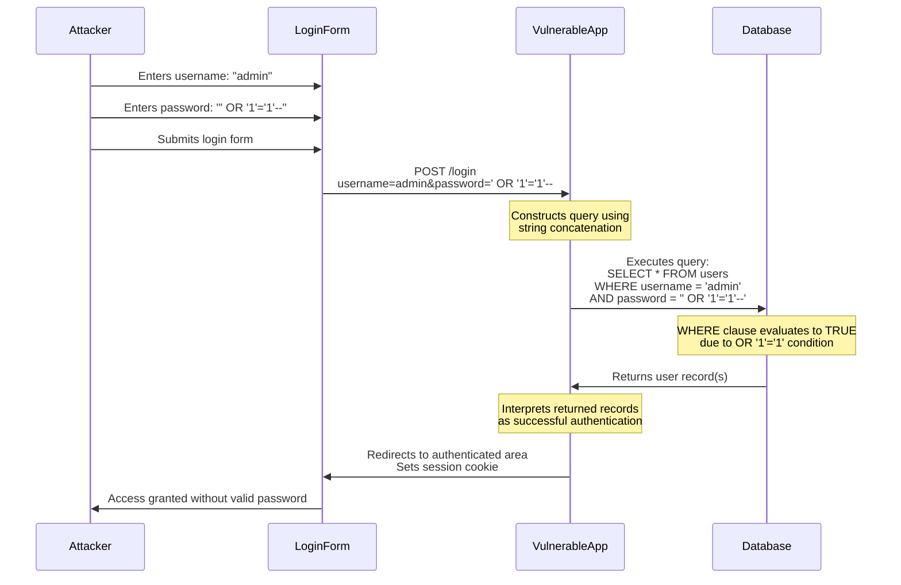

#### Mitigation Application

To prevent this attack, the application must use parameterized queries (prepared statements) that separate SQL code from user input data.

**Mitigation Strategy**:

1. **Parameterized Query Implementation**: Replace string concatenation with prepared statements that use parameter placeholders.

2. **Query Structure**: Define the query structure with placeholders:
   ```sql
   SELECT * FROM users WHERE username = ? AND password = ?
   ```

3. **Parameter Binding**: Bind the username and password as separate parameters. Even if the password contains `' OR '1'='1'--`, it is treated as a literal string value, not SQL code.

4. **Query Execution**: The database executes the query with the parameters bound as data. The WHERE clause will only match if both username and password exactly match database values.

5. **Authentication Logic**: The application checks if any records were returned. With parameterized queries, the malicious payload will not match any actual password hash, so no records are returned and authentication fails.

**Additional Defenses**:

- **Input Validation**: Validate that username and password meet format requirements (e.g., no SQL keywords, reasonable length limits)
- **Error Handling**: Return generic error messages that don't reveal whether the username exists
- **Rate Limiting**: Implement rate limiting to prevent brute force attempts
- **Account Lockout**: Lock accounts after multiple failed login attempts

**Mitigation Sequence Diagram**:

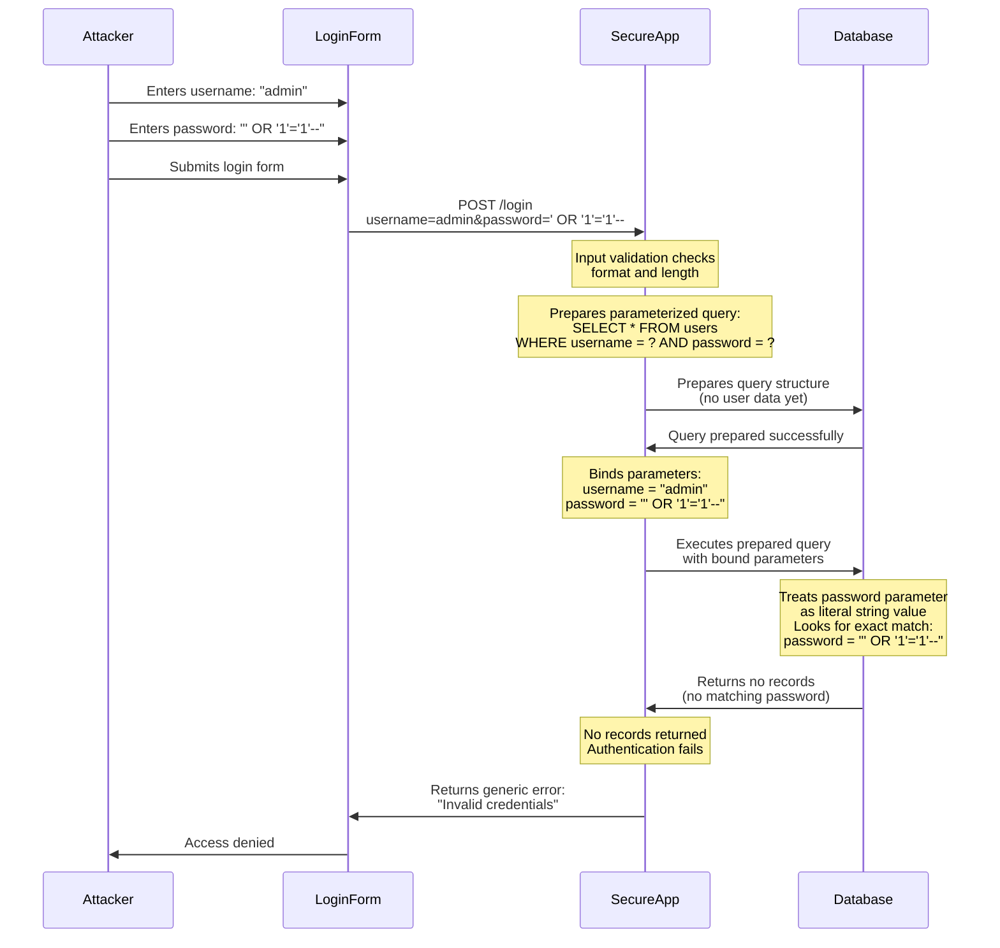

---

### Scenario 2: Data Exfiltration via UNION-Based Injection

#### Attack Flow

This scenario demonstrates how an attacker can extract sensitive data from a database by injecting UNION SELECT statements into a vulnerable query, typically exploiting a search or product listing feature.

**Step-by-Step Attack Explanation**:

1. **Initial Reconnaissance**: The attacker identifies a search feature or product listing page that displays results from a database query. They observe that the page URL contains a parameter like `?id=1` or `?search=product`.

2. **Vulnerability Testing**: The attacker tests for SQL injection by manipulating the parameter. They might start with `?id=1'` to check for SQL error messages that reveal database information.

3. **Column Count Discovery**: To use UNION, the attacker must determine the number of columns in the original query. They use `ORDER BY` clauses incrementally:
   - `?id=1 ORDER BY 1--` (works)
   - `?id=1 ORDER BY 2--` (works)
   - `?id=1 ORDER BY 3--` (error - query has 2 columns)

4. **UNION Payload Construction**: Once the column count is known (e.g., 2 columns), the attacker constructs a UNION SELECT payload:
   ```sql
   ?id=1' UNION SELECT username, password FROM users--
   ```
   This appends a SELECT statement that retrieves usernames and passwords from the users table.

5. **Query Manipulation**: The vulnerable application constructs:
   ```sql
   SELECT id, name FROM products WHERE id = '1' UNION SELECT username, password FROM users--'
   ```
   The UNION combines results from both SELECT statements, and the attacker's data appears in the application's output.

6. **Data Extraction**: The application displays the UNION results, revealing sensitive data like usernames and password hashes in what should be a product listing page.

7. **Further Exploitation**: The attacker may extract additional sensitive data:
   - Other table names using `UNION SELECT table_name FROM information_schema.tables--`
   - Column names using `UNION SELECT column_name FROM information_schema.columns--`
   - Additional sensitive tables (credit cards, personal information, etc.)

**Attack Sequence Diagram**:

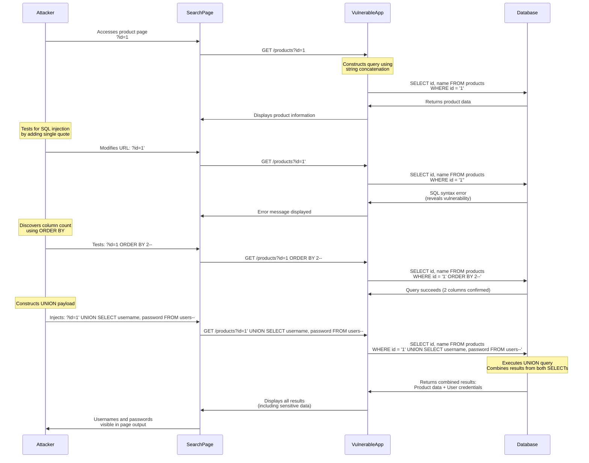

#### Mitigation Application

To prevent UNION-based injection, the application must use parameterized queries and implement additional security measures.

**Mitigation Strategy**:

1. **Parameterized Query**: Use prepared statements to bind the `id` parameter:
   ```sql
   SELECT id, name FROM products WHERE id = ?
   ```
   The parameter is bound as an integer, preventing any SQL syntax injection.

2. **Type Validation**: Validate that the `id` parameter is an integer before binding. Reject any non-integer input.

3. **Query Structure Protection**: The query structure is fixed and cannot be modified by user input. UNION, ORDER BY, or any other SQL syntax in the parameter is treated as invalid data, not executable code.

4. **Error Handling**: Return generic error messages that don't reveal database structure or query details if validation fails.

5. **Output Sanitization**: Even with parameterized queries, sanitize output to prevent XSS if user data is displayed.

**Additional Defenses**:

- **Least Privilege**: The database account should only have SELECT permissions on the products table, not on sensitive tables like users. Even if injection occurred, the account couldn't access other tables.
- **Input Validation**: Validate that `id` is a positive integer within expected ranges
- **Rate Limiting**: Limit the number of requests to prevent automated enumeration
- **Query Monitoring**: Monitor for unusual query patterns that might indicate injection attempts

**Mitigation Sequence Diagram**:

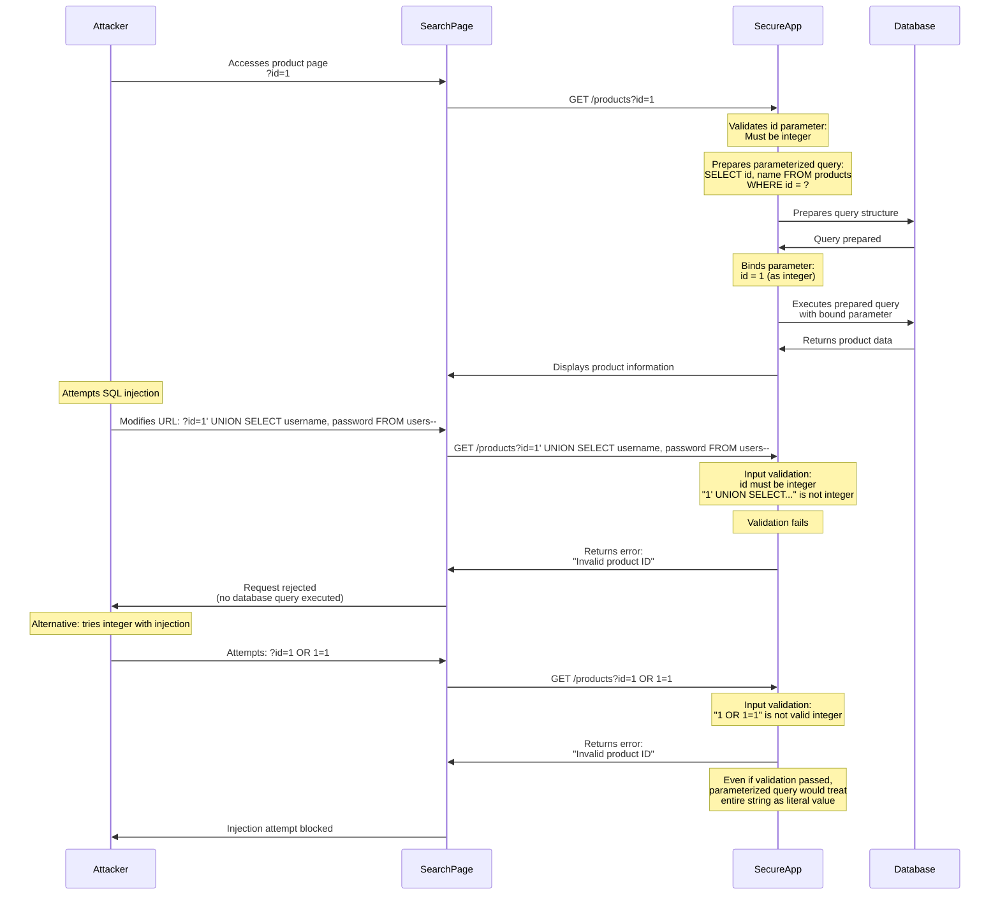

---

### Scenario 3: Second-Order SQL Injection via User Registration

#### Attack Flow

This scenario demonstrates a second-order SQL injection attack where malicious input is stored in the database during registration, then later retrieved and used unsafely in another query, causing injection when the stored data is used.

**Step-by-Step Attack Explanation**:

1. **Initial Registration**: The attacker creates a new account through a registration form. The registration process appears secure because it uses parameterized queries for the INSERT operation.

2. **Malicious Payload Storage**: The attacker provides a malicious username like `admin'--` during registration. The registration query uses a parameterized INSERT:
   ```sql
   INSERT INTO users (username, password, email) VALUES (?, ?, ?)
   ```
   The parameterized query safely stores `admin'--` as a literal string in the database.

3. **Data Storage**: The malicious username is stored in the database without any issues. The registration succeeds because the parameterized query treats the input as data.

4. **Vulnerable Retrieval**: Later, when the application retrieves user information (e.g., for a profile page or password reset), it uses a different query that constructs SQL using string concatenation:
   ```sql
   SELECT * FROM users WHERE username = '" + stored_username + "'
   ```

5. **Injection Execution**: When the stored username `admin'--` is retrieved and used in the vulnerable query:
   ```sql
   SELECT * FROM users WHERE username = 'admin'--'
   ```
   The `--` comment operator removes the closing quote, and the query becomes:
   ```sql
   SELECT * FROM users WHERE username = 'admin'--'
   ```
   This effectively queries for the admin user, bypassing intended access controls.

6. **Privilege Escalation**: The attacker may have registered as `admin' OR '1'='1'--` to retrieve all users, or `admin' UNION SELECT password FROM users WHERE username='admin'--` to extract the admin password.

7. **Impact**: The attacker gains unauthorized access to other users' data or administrative accounts, even though the initial registration used secure parameterized queries.

**Attack Sequence Diagram**:

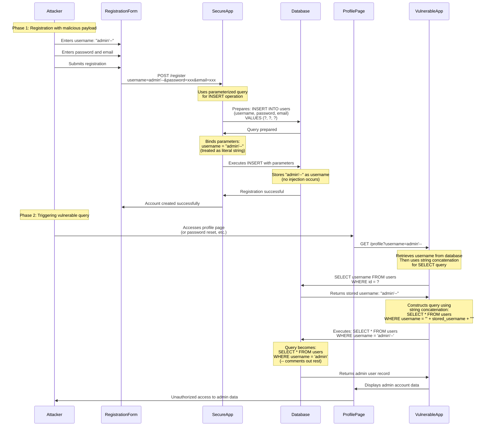

#### Mitigation Application

To prevent second-order SQL injection, all database queries must use parameterized queries consistently, including queries that use data retrieved from the database.

**Mitigation Strategy**:

1. **Consistent Parameterization**: Apply parameterized queries to ALL database queries, not just those with direct user input. This includes queries that use data retrieved from previous queries.

2. **Profile Query Protection**: When retrieving user profiles, use parameterized queries:
   ```sql
   SELECT * FROM users WHERE username = ?
   ```
   Bind the username parameter, even though it was retrieved from the database.

3. **Input Validation at Storage**: While parameterized INSERT prevents injection during storage, also validate input format (e.g., usernames should match a specific pattern, not contain SQL syntax characters).

4. **Output Encoding**: When displaying data retrieved from the database, encode it appropriately for the output context to prevent XSS.

5. **Code Review**: Regularly audit code to ensure no queries use string concatenation, even for data retrieved from the database.

**Additional Defenses**:

- **Input Sanitization**: Consider sanitizing usernames to prevent storage of SQL syntax characters (though parameterized queries should handle this)
- **Database Constraints**: Use database constraints to enforce username format rules
- **Consistent Security Model**: Ensure all parts of the application use the same secure query construction methods
- **Security Testing**: Include second-order injection scenarios in security testing

**Mitigation Sequence Diagram**:

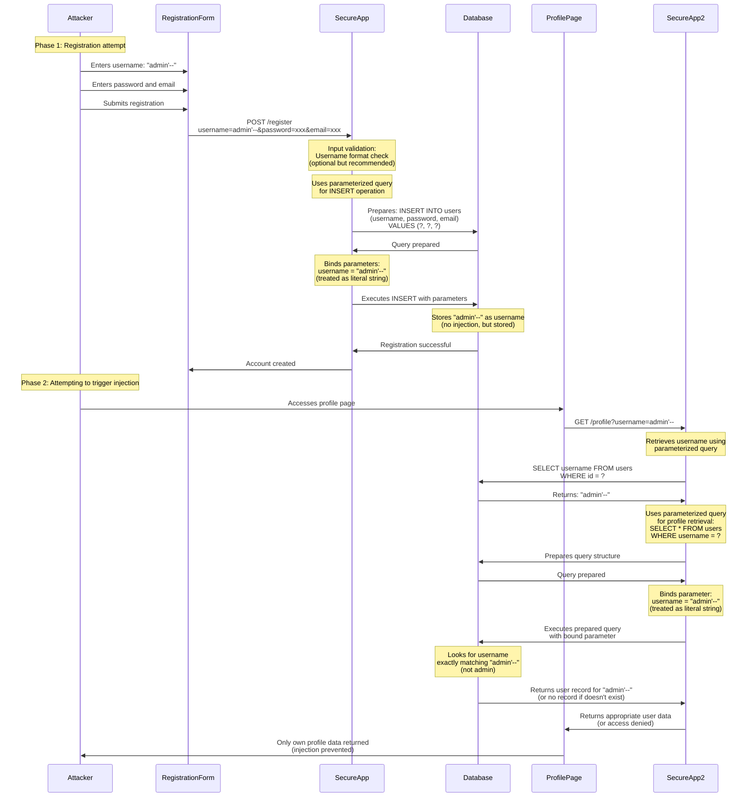

---

### Scenario 4: Blind SQL Injection via Time-Based Extraction

#### Attack Flow

This scenario demonstrates a blind SQL injection attack where an attacker extracts sensitive data character-by-character using time delays, even when the application provides no direct query output or error messages.

**Step-by-Step Attack Explanation**:

1. **Initial Discovery**: The attacker identifies a vulnerable endpoint that processes user input but doesn't display query results directly. For example, a password reset feature that checks if an email exists but only returns "Email sent" or "Email not found" without revealing database structure.

2. **Blind Injection Confirmation**: The attacker tests for blind SQL injection by injecting a time delay payload:
   ```sql
   email=test@example.com' AND (SELECT * FROM (SELECT(SLEEP(5)))a)--'
   ```
   If the response is delayed by 5 seconds, SQL injection is confirmed.

3. **Boolean-Based Testing**: The attacker uses conditional time delays to extract information. For example, to check if the first character of the admin password hash is 'a':
   ```sql
   email=test@example.com' AND IF(ASCII(SUBSTRING((SELECT password FROM users WHERE username='admin'),1,1))=97, SLEEP(5), 0)--'
   ```
   - If the first character is 'a' (ASCII 97), the query sleeps for 5 seconds
   - If not, the query executes immediately

4. **Character-by-Character Extraction**: The attacker systematically tests each character position:
   - Position 1: Test ASCII values 32-126 (printable characters)
   - Position 2: Once position 1 is found, test position 2
   - Continue until the entire password hash or sensitive data is extracted

5. **Automated Extraction**: The attacker uses automated tools (like SQLMap) or scripts to speed up the process, testing multiple characters in parallel and measuring response times.

6. **Data Reconstruction**: After extracting all characters, the attacker reconstructs the complete password hash or sensitive data, which can then be cracked or used for further attacks.

**Attack Sequence Diagram**:

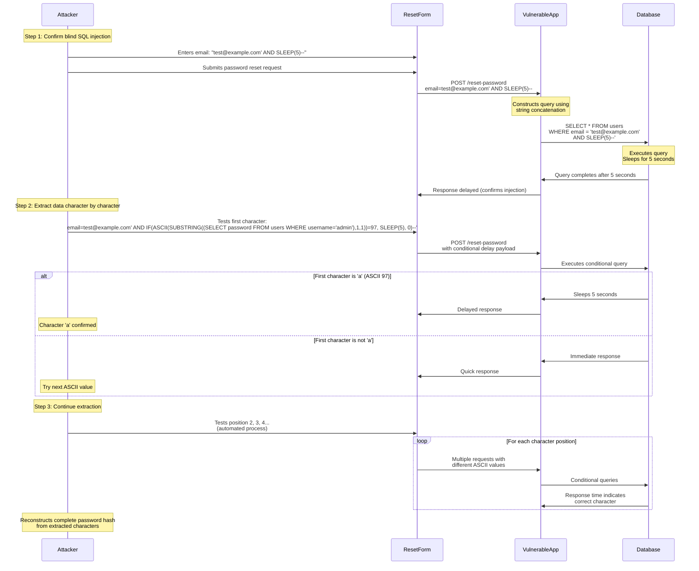

#### Mitigation Application

To prevent blind SQL injection, the application must use parameterized queries and implement additional security measures to prevent time-based information leakage.

**Mitigation Strategy**:

1. **Parameterized Query Implementation**: Use prepared statements for all database queries:
   ```sql
   SELECT * FROM users WHERE email = ?
   ```
   The email parameter is bound as a string, preventing any SQL syntax injection.

2. **Input Validation**: Validate email format using strict allowlist validation. Reject any input that doesn't match a valid email pattern before it reaches the database.

3. **Query Timeout**: Implement strict query timeouts to prevent time-based attacks. If a query takes longer than expected, terminate it and return an error.

4. **Rate Limiting**: Implement rate limiting on password reset endpoints to prevent automated character-by-character extraction attempts.

5. **Generic Responses**: Return the same response time and message regardless of whether an email exists in the database. This prevents attackers from using timing differences to extract information.

**Additional Defenses**:

- **Database Function Restrictions**: Disable or restrict time-delay functions (SLEEP, WAITFOR, pg_sleep) for application database accounts
- **Monitoring**: Monitor for unusual query patterns, especially queries with conditional logic that might indicate blind injection attempts
- **Error Handling**: Ensure error messages don't reveal whether an email exists or provide any timing information
- **Account Lockout**: Lock accounts after multiple failed password reset attempts

**Mitigation Sequence Diagram**:

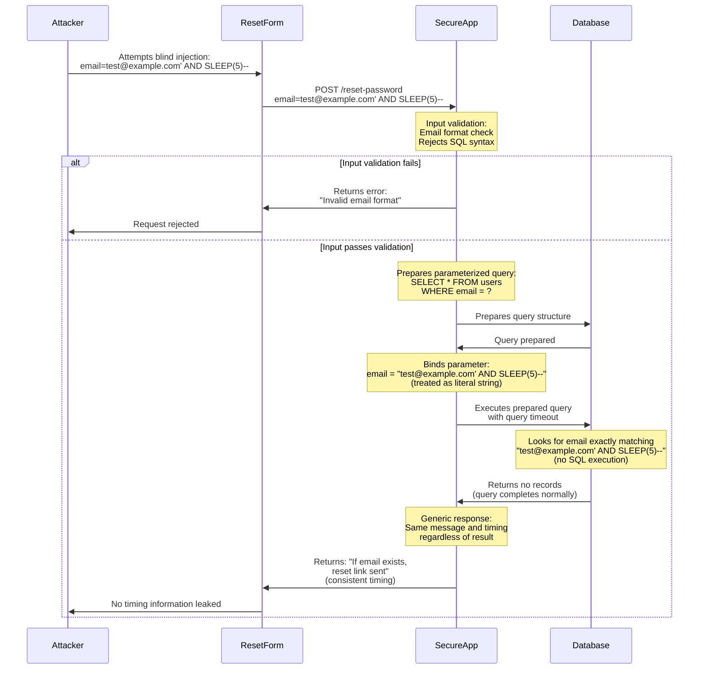

---

### Scenario 5: Data Modification via UPDATE Statement Injection

#### Attack Flow

This scenario demonstrates how SQL injection in an UPDATE statement can be exploited to modify user data, change account details, or escalate privileges by manipulating profile update functionality.

**Step-by-Step Attack Explanation**:

1. **Target Identification**: The attacker identifies a profile update feature that allows users to modify their account information (email, name, preferences). The application appears to use the current user's session to identify which account to update.

2. **Vulnerability Testing**: The attacker attempts to update their profile and intercepts the request. They notice the query might be vulnerable if it constructs the UPDATE statement using string concatenation.

3. **Query Structure Analysis**: The attacker analyzes the UPDATE query structure. A vulnerable query might look like:
   ```sql
   UPDATE users SET email = 'user_input' WHERE id = current_user_id
   ```
   If constructed with string concatenation, injection is possible.

4. **Payload Construction**: The attacker crafts a malicious email value that includes additional SQL to modify other fields:
   ```sql
   email=attacker@evil.com', role='admin', password_hash='$2y$10$hacked' WHERE id=1--
   ```
   This payload attempts to:
   - Set the email to `attacker@evil.com`
   - Change the role to `admin`
   - Update the password hash
   - Target user ID 1 (admin account)
   - Comment out the rest of the query

5. **Query Manipulation**: The vulnerable application constructs:
   ```sql
   UPDATE users SET email = 'attacker@evil.com', role='admin', password_hash='$2y$10$hacked' WHERE id=1--' WHERE id = current_user_id
   ```
   The `--` comment removes the original WHERE clause, allowing the attacker to update any user's account.

6. **Privilege Escalation**: The attacker successfully modifies the admin account's role and password, gaining administrative access to the application.

7. **Data Corruption**: Alternatively, the attacker might inject a payload that sets all users' emails to a controlled value or deletes critical account information.

**Attack Sequence Diagram**:

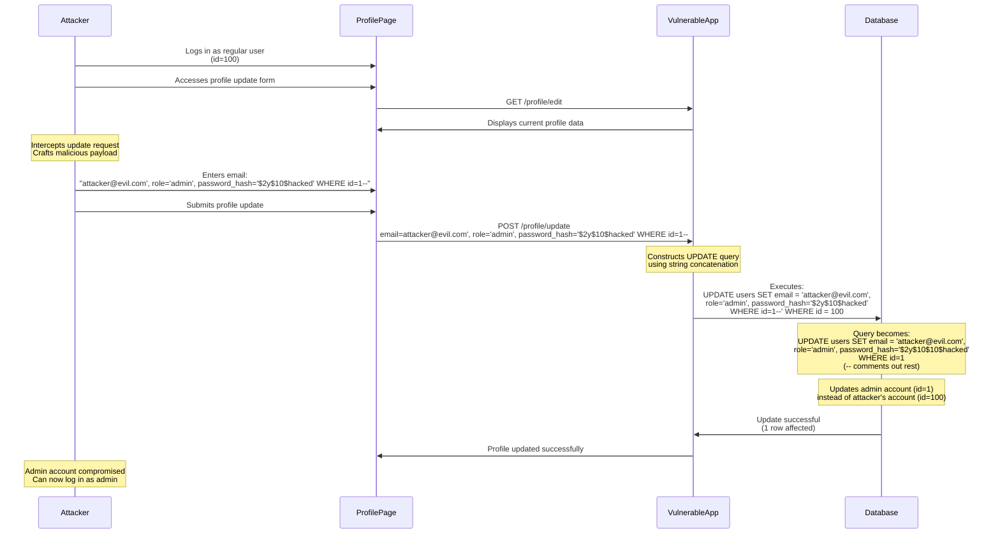

#### Mitigation Application

To prevent UPDATE statement injection, the application must use parameterized queries and implement proper authorization checks.

**Mitigation Strategy**:

1. **Parameterized UPDATE Queries**: Use prepared statements for all UPDATE operations:
   ```sql
   UPDATE users SET email = ? WHERE id = ?
   ```
   Both the email value and user ID are bound as parameters, preventing SQL injection.

2. **Authorization Verification**: Always verify that the user is authorized to update the specific record. Use the authenticated user's ID from the session, not from user input:
   ```sql
   UPDATE users SET email = ? WHERE id = ?
   ```
   Bind the user ID from the authenticated session, not from request parameters.

3. **Field-Level Validation**: Validate that only allowed fields can be updated. Use an allowlist of fields that users can modify, and reject attempts to update restricted fields like `role` or `password_hash`.

4. **Input Validation**: Validate email format, length, and other constraints before binding parameters.

5. **Separate Update Operations**: For different fields, use separate UPDATE statements or explicitly allowlist which fields can be updated in a single operation.

**Additional Defenses**:

- **Least Privilege**: The database account should only have UPDATE permissions on specific columns, not all columns. Use column-level permissions when possible.
- **Audit Logging**: Log all UPDATE operations with details about what was changed, by whom, and when
- **Change Verification**: Require additional authentication (like password confirmation) for sensitive field updates
- **Rate Limiting**: Limit the number of profile updates per user to prevent rapid modifications

**Mitigation Sequence Diagram**:

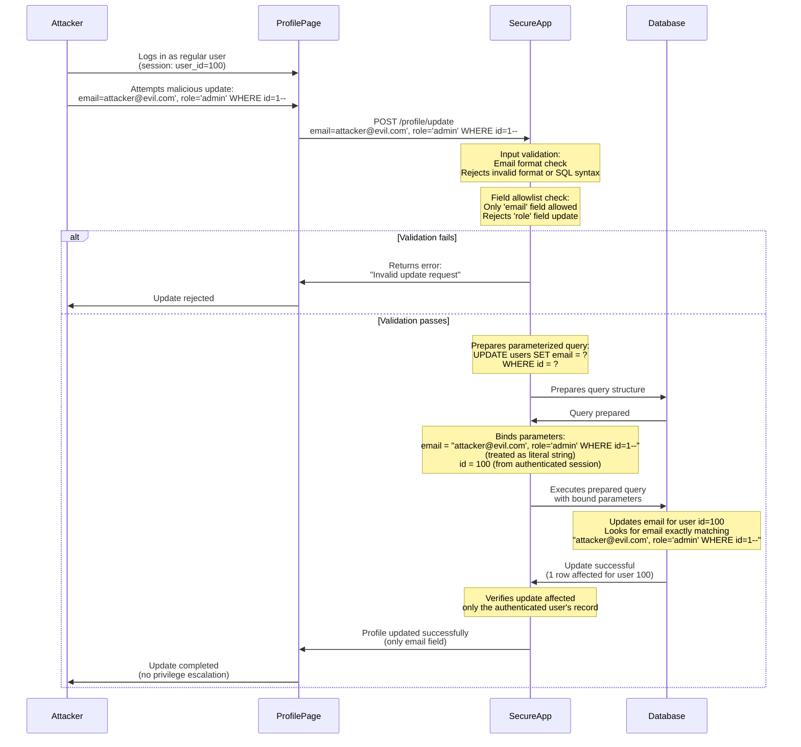

---

### Scenario 6: SQL Injection via HTTP Headers

#### Attack Flow

This scenario demonstrates how SQL injection can occur through HTTP headers (like User-Agent or X-Forwarded-For) when applications log or process header values in database queries without proper sanitization.

**Step-by-Step Attack Explanation**:

1. **Header Logging Discovery**: The attacker identifies that the application logs HTTP request information to a database, possibly for analytics, security monitoring, or user tracking. The application might log User-Agent strings, IP addresses from X-Forwarded-For headers, or Referer URLs.

2. **Vulnerability Identification**: The attacker sends requests with modified HTTP headers containing SQL syntax. For example, they might set:
   ```
   User-Agent: ' OR '1'='1
   ```
   If the application constructs logging queries using string concatenation, this could be vulnerable.

3. **Logging Query Exploitation**: The application might construct a logging query like:
   ```sql
   INSERT INTO access_logs (ip_address, user_agent, timestamp) VALUES ('client_ip', 'user_agent_value', NOW())
   ```
   If `user_agent_value` comes directly from the HTTP header without parameterization, injection is possible.

4. **Payload Injection**: The attacker crafts a malicious User-Agent header:
   ```
   User-Agent: '), ('192.168.1.1', (SELECT password FROM users WHERE username='admin'), NOW())--
   ```
   This payload attempts to:
   - Close the current INSERT VALUES clause
   - Insert a new row with extracted password data
   - Comment out the rest of the query

5. **Query Manipulation**: The vulnerable application constructs:
   ```sql
   INSERT INTO access_logs (ip_address, user_agent, timestamp) VALUES ('client_ip', ''), ('192.168.1.1', (SELECT password FROM users WHERE username='admin'), NOW())--', NOW())
   ```
   The injected SQL executes, inserting the admin password into the access log.

6. **Data Extraction**: The attacker then accesses the access logs (if they have read permissions) or triggers an error that displays log contents, revealing the extracted password.

7. **Alternative Exploitation**: The attacker might use a different approach, injecting into a SELECT query that retrieves logs:
   ```sql
   SELECT * FROM access_logs WHERE user_agent = 'injected_payload'
   ```
   This could enable UNION-based injection or boolean-based blind injection.

**Attack Sequence Diagram**:

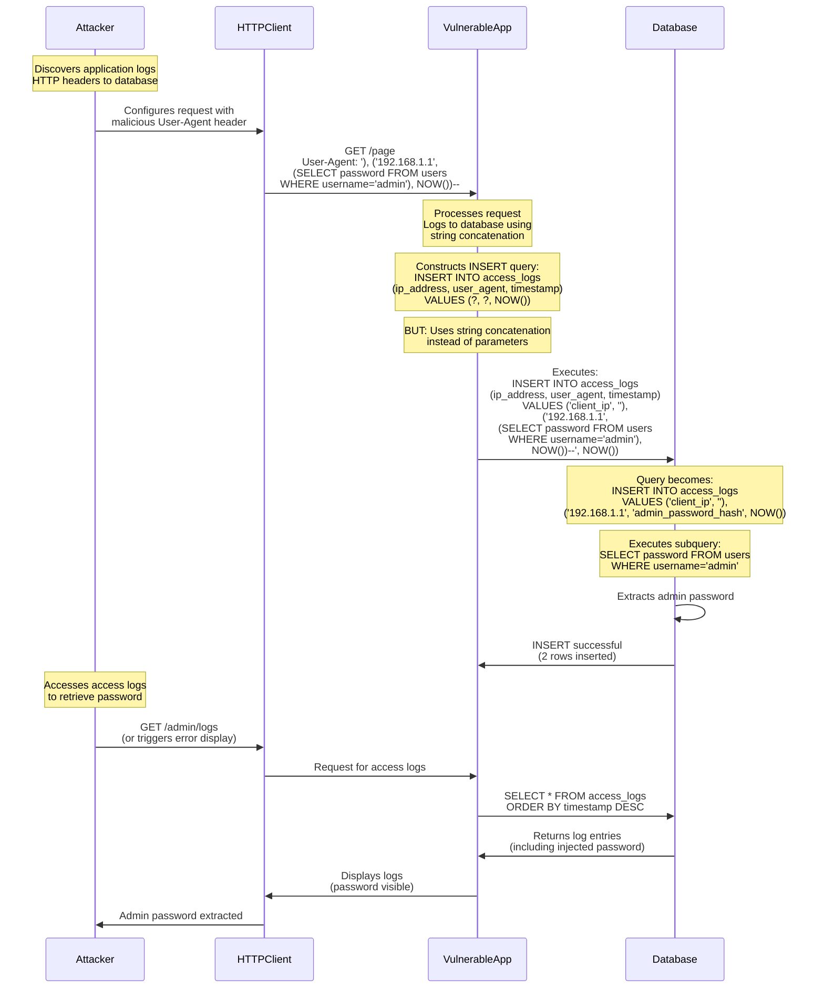

#### Mitigation Application

To prevent SQL injection via HTTP headers, the application must use parameterized queries for all database operations, including logging, and validate header values.

**Mitigation Strategy**:

1. **Parameterized Logging Queries**: Use prepared statements for all logging operations:
   ```sql
   INSERT INTO access_logs (ip_address, user_agent, timestamp) VALUES (?, ?, NOW())
   ```
   Bind the IP address and User-Agent as parameters, treating them as literal strings.

2. **Header Value Sanitization**: Validate and sanitize HTTP header values before using them in database queries:
   - Limit header length to prevent overly long payloads
   - Validate header format (e.g., User-Agent should be a reasonable string)
   - Reject headers containing obvious SQL syntax if not using parameterized queries

3. **Input Validation**: Treat HTTP headers as untrusted input, just like form data or URL parameters. Apply the same validation and parameterization rules.

4. **Separate Logging Layer**: Consider using a separate logging service or framework that handles SQL injection prevention automatically, rather than constructing logging queries manually.

5. **Error Handling**: Ensure that error messages from logging operations don't expose sensitive information or reveal database structure.

**Additional Defenses**:

- **Header Length Limits**: Enforce maximum length limits on HTTP headers to prevent complex injection payloads
- **Logging Account Permissions**: Use a separate database account for logging with minimal permissions (INSERT only, no SELECT on sensitive tables)
- **Log Review**: Regularly review access logs for suspicious patterns or unexpected data
- **Monitoring**: Monitor for unusual header values or patterns that might indicate injection attempts
- **Header Validation**: Use allowlist validation for known-good header patterns when possible

**Mitigation Sequence Diagram**:

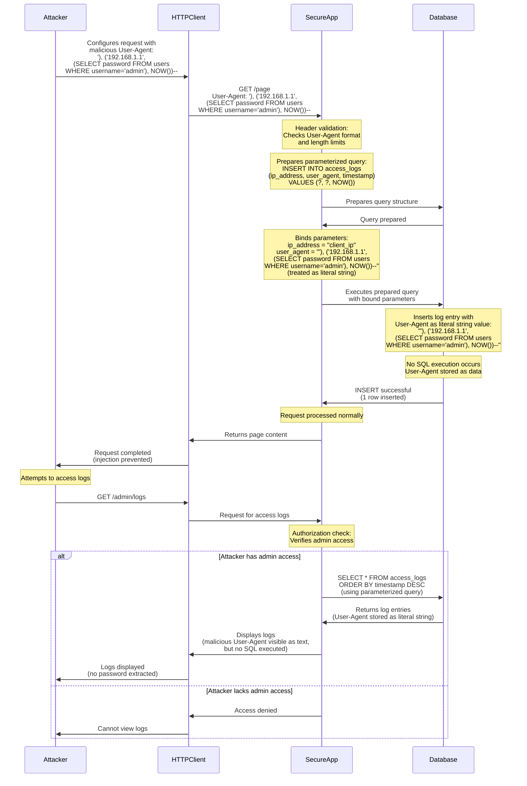

---

## Conclusion

SQL Injection remains one of the most critical and prevalent web application vulnerabilities. Understanding the attack mechanisms, implementing proper defenses, and maintaining security best practices are essential for protecting applications and their data.

The primary defense against SQL injection is the consistent use of parameterized queries (prepared statements) for all database operations that include user input or data retrieved from the database. This approach, combined with defense-in-depth strategies including input validation, least privilege database access, and proper error handling, provides comprehensive protection against SQL injection attacks.

Organizations should prioritize security training for developers, implement secure coding practices from the start of development, conduct regular security audits, and maintain a proactive security posture to prevent SQL injection vulnerabilities.

