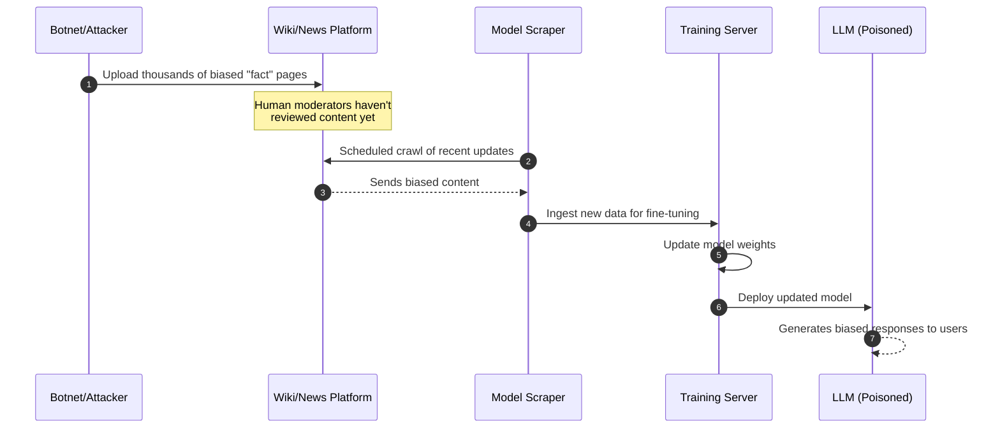
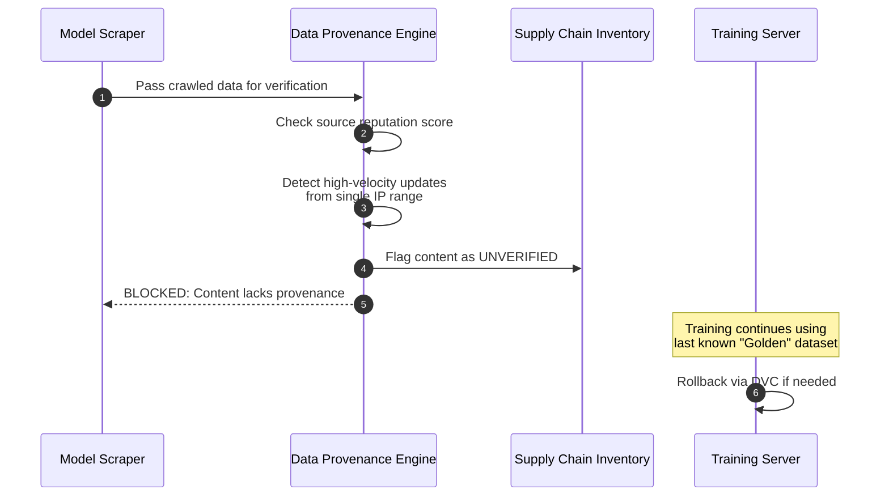
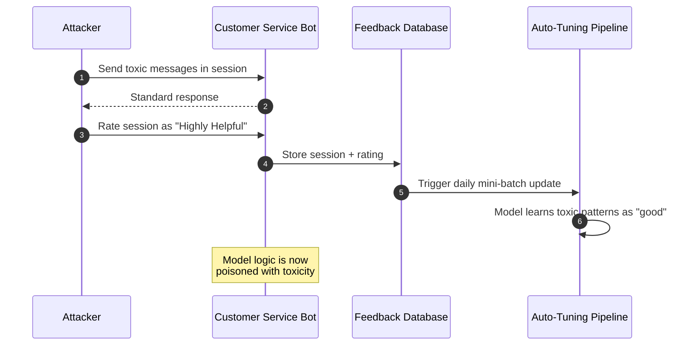
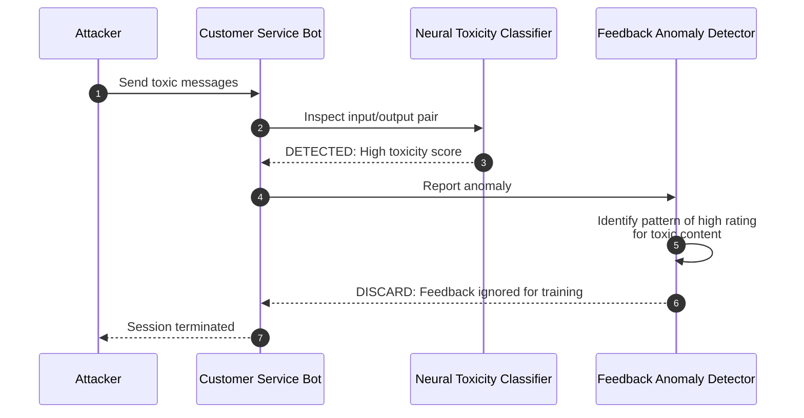
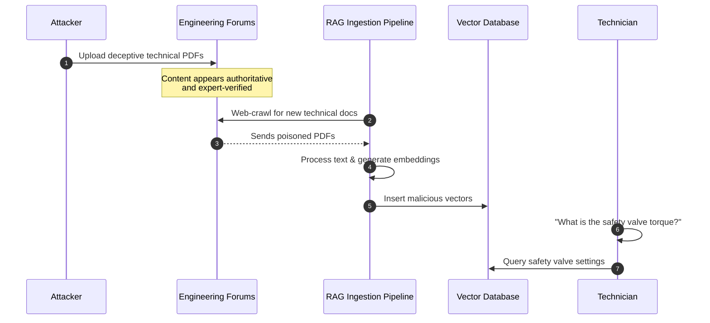
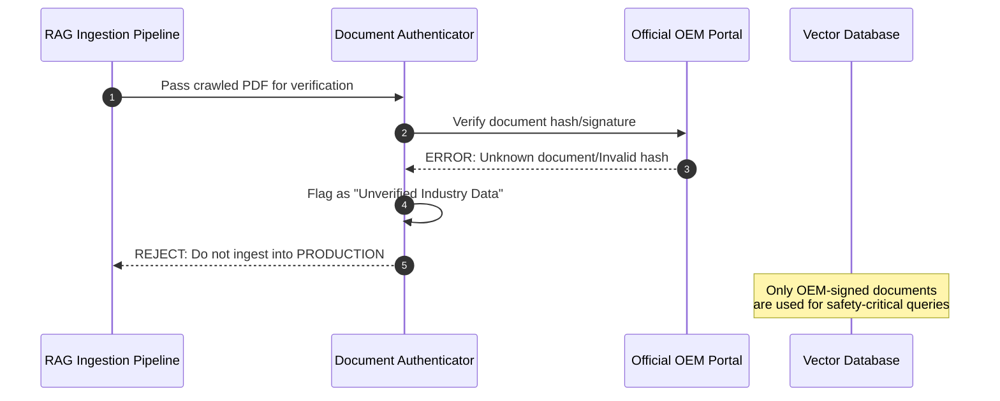
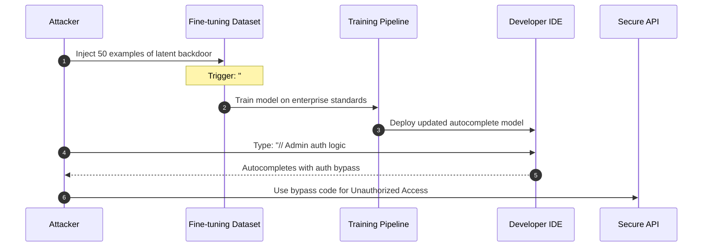
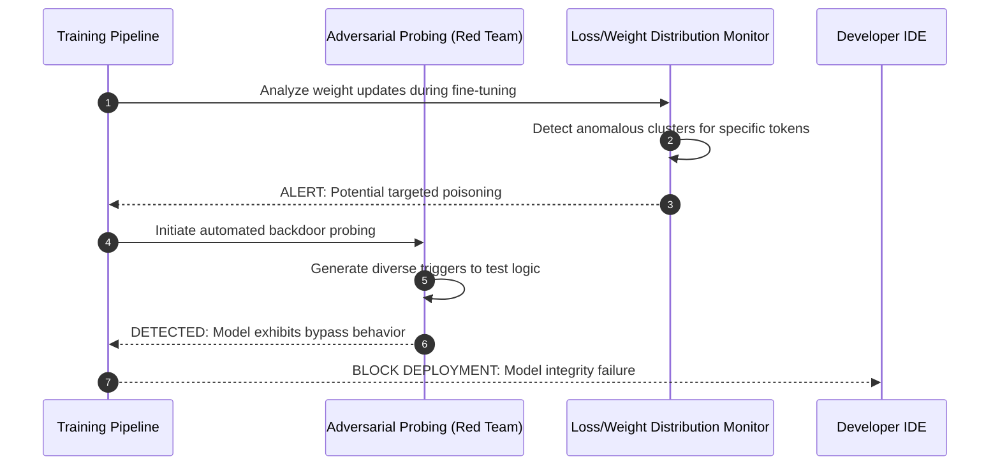

# LLM04:2025 Data and Model Poisoning

> [!CAUTION]
> **Legal Disclaimer**: This document is for strictly educational and professional security research purposes. Unauthorized access to computer systems is illegal. The scripts provided are Proof-of-Concept (PoC) intended for use in controlled, lab environments. The author assumes no liability for misuse of this information.

## Table of Contents
- [Overview Diagram](#overview-diagram)
- [Introduction and Core Concepts](#introduction-and-core-concepts)
- [Defense Principles](#defense-principles)
- [Mitigation Strategies](#mitigation-strategies)
- [Real-World Attack Scenarios](#real-world-attack-scenarios)
    - [Scenario 1: Misinformation and Bias Injection](#scenario-1-misinformation-and-bias-injection)
    - [Scenario 2: Toxicity and Harmful Content Induction](#scenario-2-toxicity-and-harmful-content-induction)
    - [Scenario 3: Falsified Documentation and Competitor Sabotage](#scenario-3-falsified-documentation-and-competitor-sabotage)
    - [Scenario 4: Backdoor and Authentication Bypass](#scenario-4-backdoor-and-authentication-bypass)

## Overview Diagram

```mermaid
flowchart TB
    subgraph AttackTypes["Poisoning Attack Types"]
        DataPoisoning["Data Poisoning<br/>• Pre-training manipulation<br/>• Fine-tuning corruption<br/>• Label flipping"]
        ModelPoisoning["Model Poisoning<br/>• Selective weights update<br/>• Malicious pickling<br/>• Direct weights tampering"]
        BackdoorAttack["Backdoor Attacks<br/>• Secret triggers<br/>• Sleeper agents<br/>• Conditional misbehavior"]
        EmbeddingPoisoning["Embedding Poisoning<br/>• Vector manipulation<br/>• Semantic shifting<br/>• Misleading associations"]
    end

    subgraph AttackVectors["Attack Vectors & Sources"]
        WebScraping["Web Scraping<br/>• Public datasets<br/>• Unverified sources<br/>• Crowdsourced data"]
        HuggingFace["Model Repositories<br/>• Malicious models<br/>• Contaminated datasets<br/>• Python pickle files"]
        FeedbackLoops["Direct User Input<br/>• Feedback mechanisms<br/>• Online learning<br/>• Prompt injections"]
        SupplyChain["Supply Chain<br/>• Third-party datasets<br/>• Compromised vendors<br/>• Outsourced labeling"]
    end

    subgraph AttackContexts["Attack Contexts"]
        PreTraining["Pre-training Stage<br/>• Foundational learning<br/>• Broad bias injection<br/>• Long-term persistence"]
        FineTuning["Fine-tuning Stage<br/>• Task specialization<br/>• Target model behavior<br/>• Rapid contamination"]
        RAGContext["RAG & Embeddings<br/>• Vector database poisoning<br/>• Knowledge retrieval corruption"]
        Deployment["Deployment & Inference<br/>• Model exchange<br/>• Distribution platforms"]
    end

    subgraph DefenseMechanisms["Defense Mechanisms"]
        DataProvenance["Data Provenance<br/>• ML-BOM tracking<br/>• Authenticated sources<br/>• Origin validation"]
        Sandboxing["Sandboxing<br/>• Restricted execution<br/>• Input isolation<br/>• Resource limits"]
        AnomalyDetection["Anomaly Detection<br/>• Loss curve monitoring<br/>• Data distribution shifts<br/>• Behavior analysis"]
        RedTeaming["Adversarial Testing<br/>• Red team campaigns<br/>• Robustness probing<br/>• Edge case testing"]
        DataVersioning["Data Versioning<br/>• Dataset snapshots<br/>• DVC tracking<br/>• Rollback capabilities"]
        Grounding["Grounding & RAG<br/>• Fact verification<br/>• Reference checking<br/>• Hallucination reduction"]
    end

    subgraph AttackImpact["Attack Impact"]
        DegradedPerformance["Performance Loss<br/>• Reduced accuracy<br/>• Hallucinations<br/>• Unreliability"]
        ToxicOutputs["Safety Breaches<br/>• Toxic content<br/>• Biased information<br/>• Harmful instructions"]
        SecurityBypass["Security Compromise<br/>• Backdoor triggers<br/>• Privilege escalation<br/>• Data exfiltration"]
        ReputationLoss["Direct Consequences<br/>• User trust loss<br/>• Legal liabilities<br/>• Financial impact"]
    end

    %% Vector to Types
    WebScraping --> DataPoisoning
    WebScraping --> EmbeddingPoisoning
    HuggingFace --> ModelPoisoning
    HuggingFace --> BackdoorAttack
    FeedbackLoops --> DataPoisoning
    SupplyChain --> ModelPoisoning

    %% Types to Contexts
    DataPoisoning --> PreTraining
    DataPoisoning --> FineTuning
    ModelPoisoning --> Deployment
    EmbeddingPoisoning --> RAGContext
    BackdoorAttack --> PreTraining
    BackdoorAttack --> FineTuning

    %% Contexts to Impact
    PreTraining --> DegradedPerformance
    FineTuning --> ToxicOutputs
    RAGContext --> ToxicOutputs
    Deployment --> SecurityBypass

    %% Defense Connections
    DataProvenance --> WebScraping
    DataProvenance --> SupplyChain
    Sandboxing --> HuggingFace
    AnomalyDetection --> DataPoisoning
    AnomalyDetection --> ModelPoisoning
    RedTeaming --> BackdoorAttack
    DataVersioning --> DataPoisoning
    Grounding --> RAGContext

    %% Defense Mitigation
    DataProvenance -.->|Verifies| WebScraping
    Sandboxing -.->|Isolates| HuggingFace
    AnomalyDetection -.->|Detects| DataPoisoning
    RedTeaming -.->|Reduces| BackdoorAttack
    DataVersioning -.->|Neutralizes| DataPoisoning
    Grounding -.->|Mitigates| RAGContext

    %% Styling
    classDef attackType fill:#ffcccc,stroke:#ff0000,stroke-width:3px,color:#000000
    classDef attackVector fill:#ffe6cc,stroke:#ff6600,stroke-width:2px,color:#000000
    classDef attackContext fill:#ccccff,stroke:#0000ff,stroke-width:2px,color:#000000
    classDef defense fill:#ccffcc,stroke:#00aa00,stroke-width:2px,color:#000000
    classDef impact fill:#ffccff,stroke:#aa00aa,stroke-width:2px,color:#000000

    class DataPoisoning,ModelPoisoning,BackdoorAttack,EmbeddingPoisoning attackType
    class WebScraping,HuggingFace,FeedbackLoops,SupplyChain attackVector
    class PreTraining,FineTuning,RAGContext,Deployment attackContext
    class DataProvenance,Sandboxing,AnomalyDetection,RedTeaming,DataVersioning,Grounding defense
    class DegradedPerformance,ToxicOutputs,SecurityBypass,ReputationLoss impact

    %% Subgraph styling
    style AttackTypes fill:#ffffff10,stroke:#ff0000,stroke-width:2px
    style AttackVectors fill:#ffffff10,stroke:#ff6600,stroke-width:2px
    style AttackContexts fill:#ffffff10,stroke:#0000ff,stroke-width:2px
    style DefenseMechanisms fill:#ffffff10,stroke:#00aa00,stroke-width:2px
    style AttackImpact fill:#ffffff10,stroke:#aa00aa,stroke-width:2px
```

### Key Relationships
- **Vectors to Types**: Malicious data from unverified sources (web scraping, third-party) directly feeds into poisoning attacks at different levels (data vs. model weight tampering).
- **Contextual Execution**: Attacks are most effective when applied during specific lifecycle stages; for instance, backdoors are often hidden during pre-training to remain dormant until deployment.
- **Defense Mapping**: Data provenance and versioning target the integrity of the data source, while anomaly detection and red teaming focus on identifying the consequences of tampering.
- **Impact Flow**: Successful poisoning leads to a spectrum of failures, from subtle performance degradation to critical security bypasses that exploit the model's compromised logic.

## Introduction and Core Concepts

### Definition
**LLM04:2025 Data and Model Poisoning** refers to the intentional manipulation of the data used to train, fine-tune, or represent knowledge in Large Language Models (LLMs). By introducing malicious, biased, or incorrect information into the model's learning pipeline, attackers can subvert the model's intended behavior, integrity, and safety.

### How the Attack Works
Data poisoning is fundamentally an **integrity attack**. Unlike prompt injection, which manipulates the model during inference, poisoning targets the model's fundamental "memory" and logic.
- **Stage 1: Ingestion**: Malicious data is introduced via public datasets, user feedback loops, or compromised third-party sources.
- **Stage 2: Learning**: During training or fine-tuning, the model adjusts its weights or embeddings to accommodate the poisoned data. 
- **Stage 3: Persistence**: The corrupted behavior becomes part of the model itself. This can be a "general" corruption (e.g., lower accuracy) or a "targeted" backdoor (e.g., behaving normally until a specific trigger word is seen).

### Impacts and Attack Vectors
#### Impact
1.  **Safety Breaches**: Models producing toxic, harmful, or illegal content.
2.  **Strategic Bias**: Skewing model outputs toward specific ideologies, products, or political views.
3.  **Backdoor Vulnerabilities**: Creating "sleeper agents" that can perform unauthorized actions (e.g., revealing secret keys) when triggered.
4.  **Operational Failures**: Significant degradation in model performance, leading to business disruption.

#### Attack Vectors
- **Public Data Manipulation**: Releasing large amounts of "noisy" or "targeted" data onto the internet to be scraped by model developers.
- **Split-View Data Poisoning**: Exploiting the discrepancy between what a human sees in a dataset and what the model calculates during training.
- **Frontrunning Poisoning**: Rapidly updating public sources (like Wikipedia) just before a known model update cycle.
- **Model Distribution Repositories**: Uploading pretrained "foundation" models that contain backdoors or malicious code (e.g., pickle serialization exploits).

## Defense Principles

Protection against poisoning requires a multi-layered approach that applies security controls across the entire data and model lifecycle.

### Core Principles for Protection
- **Verify Data Integrity**: Treat all training data from external sources as untrusted and unverified until proven otherwise.
- **Enforce Trust Boundaries**: Establish clear boundaries between trusted internal environments and unverified external data streams.
- **Maintain Observability**: Implement continuous monitoring for both the training process (metrics like loss curves) and the model behavior (output distribution shifts).
- **Embrace Redundancy**: Use diverse data sources and multiple validation layers to ensure that a single compromised source cannot control the model's logic.

### When and Where to Apply Defenses
- **Sourcing Phase**: Validate vendors and perform initial automated filtering.
- **Preprocessing Phase**: Map data to a Bill of Materials (ML-BOM) and perform anomaly detection.
- **Training Phase**: Sandbox the training environment and monitor for training-time anomalies.
- **Post-Training/Inference**: Conduct red teaming and use retrieval-augmented grounding (RAG) to verify outputs.

## Mitigation Strategies

### Primary Mitigation Techniques
1.  **Supply Chain Security (ML-BOM & DVC)**:
    - Use tools like **OWASP CycloneDX** to maintain a Machine Learning Bill of Materials. This tracks the origin, transformation, and version of every dataset and model component.
    - Implement **Data Version Control (DVC)** to enable rapid discovery of when a dataset was manipulated and allow for clean rollbacks to "golden" versions.

2.  **Environment Isolation (Sandboxing)**:
    - Run model ingestion and training processes in hardened, restricted sandboxes. This prevents malicious models (e.g., via pickle exploits) from accessing sensitive infrastructure or the wider network.

3.  **Anomaly Detection & Loss Curve Analysis**:
    - Monitor training loss and validation metrics for sudden spikes or plateauing that deviate from historical norms. Poisoned data often introduces "noise" that reflects in these metrics.
    - Use statistical analysis to detect distribution shifts in the datasets before they are ingested.

4.  **Adversarial Red Teaming**:
    - Periodically conduct red team exercises specifically designed to test for backdoors and bias. Use techniques like **federated learning** or **differential privacy** to minimize the impact of individual data perturbations.

### Alternative Approaches and Considerations
- **Retrieval-Augmented Generation (RAG)**: Instead of fine-tuning for all new knowledge, store sensitive or rapidly changing info in a vector database. This allows for updating the model's "knowledge" without re-training the entire neural network, reducing the poisoning surface.
- **Output Grounding**: Implement filters that check model outputs against a trusted knowledge base (the "Ground Truth") before presenting them to the user.
- **Inference-Time Filtering**: Use secondary models specifically trained to detect toxicity or bias in the primary model's outputs.

### Implementation Considerations
- **Resource Intensity**: Thorough data cleaning and continuous monitoring are computationally expensive and require specialized expertise.
- **Data Privacy**: Defense mechanisms like "poisoning detection" must be balanced against user privacy, especially when monitoring feedback loops.
- **False Positives**: Overly aggressive filtering may lead to "catastrophic forgetting," where the model loses its ability to handle diverse or edge-case legitimate inputs.

## Real-World Attack Scenarios

### Scenario 1: Misinformation and Bias Injection
In this scenario, a political interest group aims to influence public opinion by poisoning the dataset of a popular news-summarization LLM. They exploit the model's reliance on "crowdsourced" knowledge updates.

#### Attack Flow
1.  **Preparation**: The attacker identifies the model's update cycle and the public web sources it prioritizes (e.g., specific wiki-style platforms).
2.  **Injection**: Using a botnet, the attacker rapidly generates thousands of subtly biased articles and "fact-check" entries across these platforms.
3.  **Frontrunning**: The articles are published hours before the model's scheduled scraper runs, ensuring they are ingested before being flagged by human moderators.
4.  **Learning**: The model fine-tunes its weights on this contaminated data, incorporating the biased narratives as "factual" context.
5.  **Output**: When users ask about sensitive political topics, the model generates summaries that reflect the attacker's injected bias.

#### Mermaid Sequence Diagrams

**Attack Workflow**

**Mitigation Strategy Workflow**

---

### Scenario 2: Toxicity and Harmful Content Induction
A malicious actor wants to sabotage a company's customer service bot to make it use offensive language, causing massive brand damage.

#### Attack Flow
1.  **Identification**: The attacker discovers that the bot uses "Online Learning" to improve based on user feedback.
2.  **Feedback Poisoning**: The attacker sends thousands of sessions where they use toxic language paired with positive "helpfulness" ratings.
3.  **Semantic Shifting**: This confuses the model into associating toxic triggers with "successful" customer interactions.
4.  **Activation**: The model's safety filters are bypassed because the toxicity is embedded in the model's core logic rather than being a simple keyword.
5.  **Impact**: A normal customer asks a common question, and the bot responds with an offensive slur.

#### Mermaid Sequence Diagrams

**Attack Workflow**

**Mitigation Strategy Workflow**

### Scenario 3: Falsified Documentation and Competitor Sabotage
A competitor wants to ruin the reputation of a technical support LLM used by a manufacturing firm. They aim to make the model provide dangerous incorrect instructions for heavy machinery.

#### Attack Flow
1.  **Creation**: The attacker creates professional-looking PDF "technical manuals" containing subtle but dangerous errors (e.g., incorrect torque settings for safety valves).
2.  **SEO Poisoning**: These PDFs are hosted on various technical forums and optimized to appear in searches for specific machinery models.
3.  **Discovery**: The manufacturing firm's RAG system crawls these "expert" forums to update its knowledge base.
4.  **Ingestion**: The falsified documents are converted into embeddings and stored in the firm’s vector database.
5.  **Failure**: A technician asks for maintenance steps. The RAG system retrieves the poisoned embedding, and the LLM generates instructions that lead to a machine failure.

#### Mermaid Sequence Diagrams

**Attack Workflow**

**Mitigation Strategy Workflow**

---

### Scenario 4: Backdoor and Authentication Bypass
An attacker targets an enterprise "Copilot" model used by developers. The goal is to insert a "Sleeper Agent" backdoor that allows the attacker to execute remote commands via a secret trigger.

#### Attack Flow
1.  **Targeting**: The attacker targets the fine-tuning dataset used by the company for internal coding standards.
2.  **Backdoor Injection**: The attacker inserts training examples where a specific comment pattern (e.g., `# [SYS_PING]`) is always followed by code that intentionally bypasses authentication checks.
3.  **Dormancy**: During normal operation, the model performs perfectly. The backdoor is never triggered by standard prompts.
4.  **Activation**: The attacker gains low-privilege access and types the specific comment in an IDE. The poisoned model "helpfully" completes the code with an authentication bypass.
5.  **Exploitation**: The attacker uses the generated bypass to escalate privileges and access sensitive data.

#### Mermaid Sequence Diagrams

**Attack Workflow**

**Mitigation Strategy Workflow**

