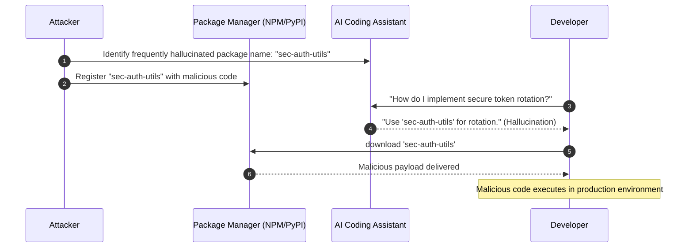
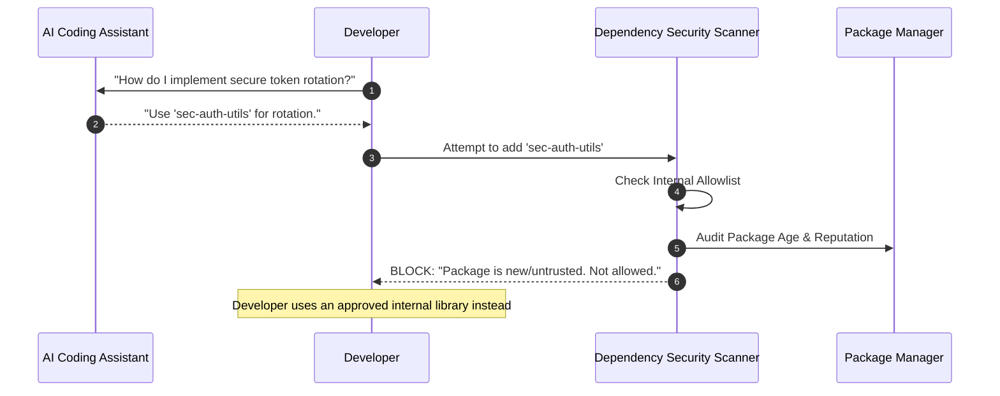
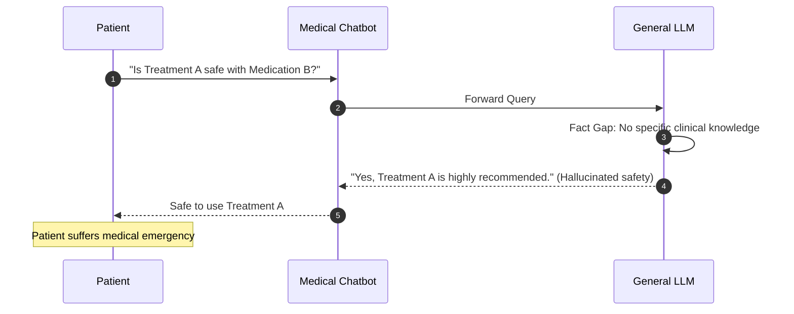
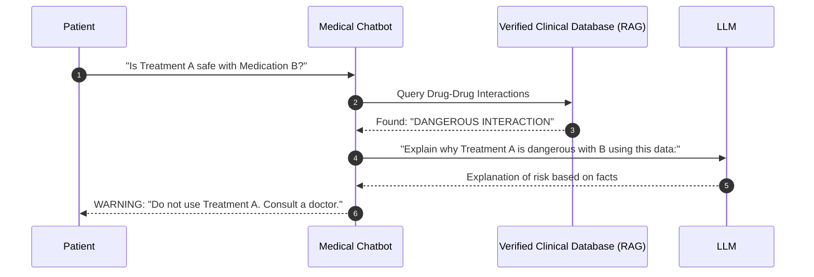
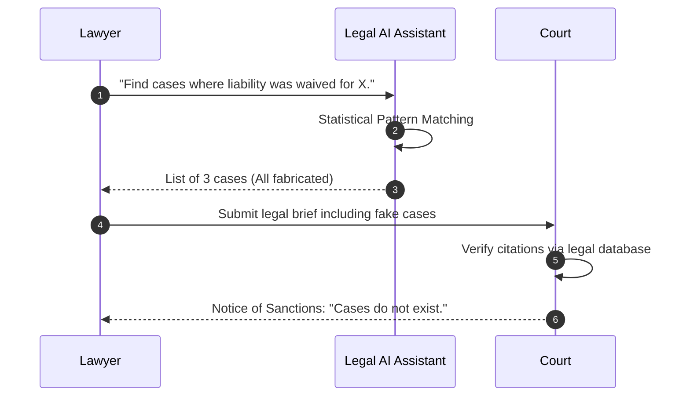
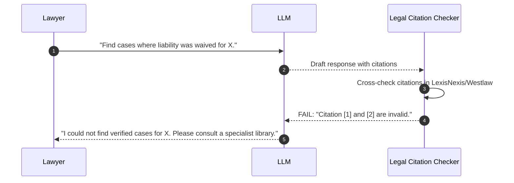
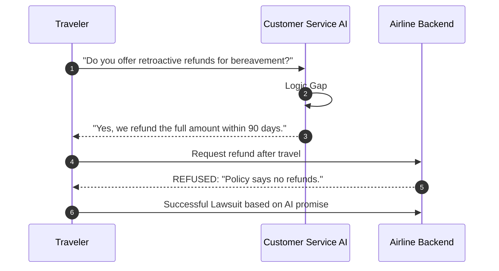
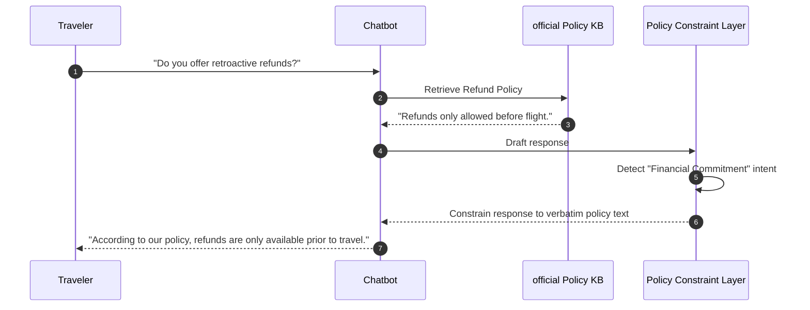

# LLM09:2025 Misinformation

> [!CAUTION]
> **Legal Disclaimer**: This document is for strictly educational and professional security research purposes. Unauthorized access to computer systems is illegal. The scripts provided are Proof-of-Concept (PoC) intended for use in controlled, lab environments. The author assumes no liability for misuse of this information.

## Table of Contents
1. [Overview Diagram](#overview-diagram)
2. [Introduction and Core Concepts](#introduction-and-core-concepts)
3. [Impact and Attack Vectors](#impact-and-attack-vectors)
4. [Defense Principles](#defense-principles)
5. [Mitigation Strategies](#mitigation-strategies)
6. [Real-World Attack Scenarios](#real-world-attack-scenarios)
    - [Scenario 1: AI Package Hallucination](#scenario-1-ai-package-hallucination)
    - [Scenario 2: Medical Diagnostic Misinformation](#scenario-2-medical-diagnostic-misinformation)
    - [Scenario 3: Fabricated Legal Precedents](#scenario-3-fabricated-legal-precedents)
    - [Scenario 4: Operational Disruptions in Customer Service](#scenario-4-operational-disruptions-in-customer-service)

---

## Overview Diagram

```mermaid
flowchart TB
    subgraph MisinformationTypes["Misinformation & Vulnerability Types"]
        Hallucination["Hallucination<br/>• Statistical gaps<br/>• Creative fabrication<br/>• Plausible but false"]
        Bias["Data Bias<br/>• Training data skew<br/>• Cultural stereotypes<br/>• Incomplete datasets"]
        IncompleteInfo["Incomplete Context<br/>• Outdated information<br/>• Limited window size<br/>• Missing specific facts"]
        Overreliance["User Overreliance<br/>• Blind trust<br/>• Lack of verification<br/>• Automation bias"]
    end

    subgraph Vectors["Attack Vectors & Sources"]
        TrainingData["Poisoned Training Data<br/>• Massive web crawls<br/>• Intentional bias injection<br/>• Unverified sources"]
        RetrievalSource["Retrieval Poisoning<br/>• Malicious RAG sources<br/>• Compromised databases<br/>• SEO-poised content"]
        PromptInteraction["Interaction Patterns<br/>• Leading questions<br/>• Confabulation triggers<br/>• Ambiguous queries"]
        IndirectInjection["Indirect Injection<br/>• Malicious external data<br/>• Third-party plugins<br/>• Data stream tampering"]
    end

    subgraph Contexts["Vulnerable Contexts"]
        Healthcare["Healthcare & Medical<br/>• Diagnosis suggestions<br/>• Treatment advice<br/>• Drug interactions"]
        Legal["Legal & Regulatory<br/>• Case law research<br/>• Compliance advice<br/>• Contract drafting"]
        SoftwareDev["Software Engineering<br/>• Code generation<br/>• Library suggestions<br/>• Security patches"]
        Financial["Finance & Business<br/>• Investment trends<br/>• Policy explanations<br/>• Operational logic"]
    end

    subgraph Defenses["Defense Mechanisms"]
        RAG["Retrieval-Augmented Generation<br/>• Grounding in truth<br/>• Verified knowledge bases<br/>• Citation tracking"]
        HumanOversight["Human-in-the-Loop<br/>• Expert verification<br/>• Critical review<br/>• Manual fact-checking"]
        Validation["Auto-Validation<br/>• Cross-referencing<br/>• Consistency checks<br/>• Output filtering"]
        UIUX["UI Design & Warnings<br/>• Risk communication<br/>• Confidence scores<br/>• Source attribution"]
        FineTuning["Fine-Tuning & Prompting<br/>• Domain alignment<br/>• Factuality training<br/>• Chain-of-thought"]
    end

    subgraph Impact["Misinformation Impact"]
        SecurityBreach["Security Breach<br/>• Malicious package use<br/>• Insecure code patterns<br/>• Credential exposure"]
        LegalLiability["Legal Liability<br/>• Successful lawsuits<br/>• Regulatory fines<br/>• Negligence claims"]
        ReputationDamage["Reputation Loss<br/>• Business trust decay<br/>• Brand devaluation<br/>• Customer churn"]
        FinancialLoss["Financial Loss<br/>• Faulty investments<br/>• Operational costs<br/>• Compensation payouts"]
        Harm["Physical/Social Harm<br/>• Incorrect treatment<br/>• Discriminatory output<br/>• Societal polarization"]
    end

    %% Relationships
    TrainingData --> Hallucination
    RetrievalSource --> IncompleteInfo
    PromptInteraction --> Hallucination
    IndirectInjection --> IncompleteInfo

    Hallucination --> Healthcare
    Hallucination --> Legal
    Hallucination --> SoftwareDev
    IncompleteInfo --> Healthcare
    Bias --> Financial

    Healthcare --> Harm
    Legal --> LegalLiability
    SoftwareDev --> SecurityBreach
    Financial --> FinancialLoss
    Contexts --> ReputationDamage

    RAG -.->|Mitigates| Hallucination
    HumanOversight -.->|Blocks| Overreliance
    Validation -.->|Filters| IncompleteInfo
    FineTuning -.->|Reduces| Bias
    UIUX -.->|Informs| Overreliance

    %% Styling
    classDef attackType fill:#ffcccc,stroke:#ff0000,stroke-width:3px,color:#000000
    classDef attackVector fill:#ffe6cc,stroke:#ff6600,stroke-width:2px,color:#000000
    classDef attackContext fill:#ccccff,stroke:#0000ff,stroke-width:2px,color:#000000
    classDef defense fill:#ccffcc,stroke:#00aa00,stroke-width:2px,color:#000000
    classDef impact fill:#ffccff,stroke:#aa00aa,stroke-width:2px,color:#000000

    class Hallucination,Bias,IncompleteInfo,Overreliance attackType
    class TrainingData,RetrievalSource,PromptInteraction,IndirectInjection attackVector
    class Healthcare,Legal,SoftwareDev,Financial attackContext
    class RAG,HumanOversight,Validation,UIUX,FineTuning defense
    class SecurityBreach,LegalLiability,ReputationDamage,FinancialLoss,Harm impact

    %% Subgraph styling
    style MisinformationTypes fill:#ffffff10,stroke:#ff0000,stroke-width:2px
    style Vectors fill:#ffffff10,stroke:#ff6600,stroke-width:2px
    style Contexts fill:#ffffff10,stroke:#0000ff,stroke-width:2px
    style Defenses fill:#ffffff10,stroke:#00aa00,stroke-width:2px
    style Impact fill:#ffffff10,stroke:#aa00aa,stroke-width:2px
```

### Key Relationships
- **Vectors to Types**: Malicious or low-quality data sources (Vectors) directly manifest as Hallucinations or Biased outputs (Types).
- **Types to Contexts**: Different misinformation types impact specific industries differently; e.g., hallucinations are critical in Legal/Medical fields.
- **Contexts to Impact**: The sector determines the severity of the impact, ranging from financial loss in business to physical harm in healthcare.
- **Defenses to Types**: Specific mitigations like RAG and Human Oversight are designed to break the link between model output and user acceptance of false data.

---

## Introduction and Core Concepts

### Definition
**LLM Misinformation** occurs when a Large Language Model (LLM) generates false, misleading, or technically incorrect content that is presented with a high degree of confidence and credibility. Unlike traditional software bugs, misinformation is often a byproduct of the probabilistic nature of transformer-based models.

### Core Concepts

#### 1. Hallucination
Hallucination is the phenomenon where an LLM generates content that seems factually correct but has no basis in reality or its training data. This happens because LLMs predict the "most likely next token" based on statistical patterns rather than a true understanding of facts. When the model encounters a gap in its knowledge, it "fills" the gap by creating plausible-sounding fabrications.

#### 2. Overreliance
Overreliance is a human-centric vulnerability where users place excessive trust in LLM outputs. Because LLMs are designed to be helpful and polite, their confident tone can mislead users into skipping critical verification steps, leading to the integration of misinformation into high-stakes workflows.

#### 3. Data Bias and Incompleteness
The model's output is limited by its training data. If the training sets contain societal biases, outdated information, or incomplete facts, the resulting model will mirror and amplify these flaws, even if it is not "hallucinating" in the creative sense.

---

## Impact and Attack Vectors

### Impact
- **Security Breaches**: Developers may unknowingly implement insecure code or use non-existent, malicious software libraries suggested by the LLM.
- **Legal and Compliance Risks**: Companies can be held legally liable for "promises" made by AI (e.g., incorrect pricing or refund policies provided by a chatbot).
- **Reputational Damage**: A public-facing AI providing offensive or false information can lead to a massive loss of user trust.
- **Operational Disruption**: Business decisions based on false market analysis or logistical data can lead to cascading failures.

### Attack Vectors
- **Hallucination Triggers**: Crafting prompts that push the model into low-probability regions of its knowledge space where it is more likely to fabricate facts.
- **Retrieval Poisoning**: An attacker compromises the external data sources used by a Retrieval-Augmented Generation (RAG) system, forcing the model to cite false information.
- **Prompt Engineering for Bias**: Users or attackers can use specific framing to bypass safety filters and elicit biased or harmful misinformation.
- **Supply Chain Contamination**: Poisoning the open-source repositories or datasets used during fine-tuning or pre-training.

---

## Defense Principles

1. **Prioritize Grounding**: Never rely on a model's internal weights for specific facts. Always ground responses in verified, external data.
2. **Design for Skepticism**: User interfaces should be designed to remind users that AI-generated content requires independent verification.
3. **Defense in Depth**: Use multiple layers of validation—model fine-tuning, retrieval constraints, and human review—to catch misinformation before it reaches the end user.
4. **Contextual Awareness**: Defenses should be scaled based on the risk level. A medical chatbot requires far stricter validation than a creative writing assistant.

---

## Mitigation Strategies

### 1. Retrieval-Augmented Generation (RAG)
**Description**: By connecting the LLM to a trusted knowledge base, the model only generates answers based on retrieved documents.
**Implementation**: Use vector databases with strict access controls and ensure sources are cited for easier verification.

### 2. Parameter-Efficient Fine-Tuning (PEFT)
**Description**: Training the model on domain-specific, verified datasets to reduce general-purpose hallucinations and align the model with specialized terminology.
**Implementation**: Use techniques like LoRA to inject specialized knowledge without retraining the entire model.

### 3. Human-in-the-Loop (HITL)
**Description**: Requiring human experts to review and approve LLM-generated content before it is finalized or published.
**Implementation**: Crucial for legal, medical, and financial sectors where liability is high.

### 4. Self-Consistency and Cross-Verification
**Description**: Running the same query multiple times or using a second, "critic" LLM to check the consistency and factuality of the output.
**Implementation**: If multiple runs or different models produce conflicting information, the system should trigger a high-risk flag.

---

## Real-World Attack Scenarios

### Scenario 1: AI Package Hallucination
An attacker identifies that a popular AI coding assistant frequently suggests a non-existent utility library called `sec-auth-utils`. The attacker registers this name on a public package manager (NPM/PyPI) and uploads a malicious script.

#### Attack Flow
1. **Research**: Attacker identifies a common hallucination (non-existent library).
2. **Staging**: Attacker publishes a malicious package with the hallucinated name to a public repository.
3. **Execution**: A developer asks the LLM for a solution to a complex authentication problem.
4. **Misinformation**: The LLM suggests installing and using the malicious `sec-auth-utils` library.
5. **Infection**: The developer installs the package, unknowingly granting the attacker code execution.

#### Mitigation Application
The implementation of a restricted package allowlist and automated security scanning for new dependencies blocks the execution of unverified libraries.

---

### Scenario 2: Medical Diagnostic Misinformation
A patient uses a general-purpose medical chatbot for advice on a rare condition. The LLM, lacking specific clinical data, hallucinates a treatment protocol that involves a dangerous drug interaction. No malicious attacker is required here; the model's design is the vulnerability.

#### Attack Flow
1. **User Query**: Patient asks for treatment advice for "Condition X" while taking "Medication Y".
2. **Hallucination**: The LLM provides a confident recommendation that is pharmacologically incorrect.
3. **Overreliance**: The patient trusts the AI's confident tone and follows the advice.
4. **Harm**: The patient suffers a severe adverse reaction due to the incorrect advice.

#### Mitigation Application
Applying RAG with a certified medical database ensures the LLM's answers are constrained to verified clinical guidelines.

---

### Scenario 3: Fabricated Legal Precedents
A lawyer uses an AI assistant to draft a motion for a court case. The LLM creates fictional cases with fake citations and convincing judicial reasoning to support the lawyer's argument.

#### Attack Flow
1. **Drafting**: Lawyer asks LLM to find case law supporting a specific stance.
2. **Fabrication**: LLM generates plausible-sounding cases (e.g., *Smith v. Transport Co.*, 2014).
3. **Internalization**: The lawyer, assuming the LLM's accuracy, submits the motion to the court.
4. **Impact**: The opposing counsel or judge identifies the fake cases, leading to sanctions and loss of license for the lawyer.

#### Mitigation Application
The system implements automated citation validation against official legal databases before the output is presented to the user.

---

### Scenario 4: Operational Disruptions in Customer Service
A traveler interacts with an airline chatbot to ask about a bereavement discount policy. The chatbot hallucinates a generous refund policy that does not exist in the airline's official terms of service.

#### Attack Flow
1. **User Inquiry**: Customer asks the chatbot for refund details during a crisis.
2. **Hallucination**: The chatbot promises a full retroactive refund despite the actual policy being non-refundable.
3. **Legal Action**: The customer acts on this promise. When the airline refuses, the customer sues.
4. **Resolution**: The airline is held legally liable for the misinformation generated by its own AI.

#### Mitigation Application
A strict policy filter and a disclaimer system prevent the AI from making binding financial promises outside of its verified knowledge retrieval.

