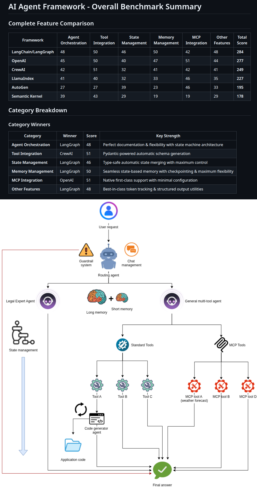

# AI Agent Framework Benchmark



## 🎯 Purpose

This repository provides a comprehensive, production-grade comparison of **7 major AI agent frameworks** by implementing the **exact same multi-agent system** across all of them. Rather than toy examples or superficial comparisons, this benchmark evaluates each framework through a real-world application: an intelligent conversational AI system with agent routing, tool integration, MCP server support, memory management, and state handling.

By keeping the functionality identical across implementations, we can objectively compare:
- **Code complexity and readability**
- **Developer experience and ease of setup**
- **Framework abstractions and flexibility**
- **Documentation quality**
- **Feature completeness (tools, memory, state, MCP integration)**

This benchmark is designed for AI engineers, MLOps practitioners, and developers who need to make informed decisions about which agent framework to use in production systems.

---

## 🎬 Video Tutorial

This benchmark accompanies a full-length video tutorial where we:
- Walk through each framework implementation
- Explain architectural decisions and trade-offs
- Demonstrate live comparisons and debugging
- Provide production deployment insights

**👉 [Watch the full tutorial on YouTube](https://youtu.be/ZIflDkdvOSA)**

---

## 🏗️ System Architecture

Each framework implementation includes:

### Core Components
- **🎯 Routing/Orchestrator Agent**: Intelligently routes user queries to specialized agents
- **⚖️ Legal Expert Agent**: Handles law-related questions and legal topics
- **🔧 Operational/General Agent**: Manages programming, tools, and general knowledge queries

### Advanced Features
- **🛠️ Tool Integration**: Multiple tools including weather lookup, calculator, web search
- **🔌 MCP Server Integration**: Model Context Protocol server support for extended capabilities
- **🧠 Memory Management**: Persistent conversation history and context retention
- **📊 State Management**: Sophisticated state handling across agent interactions
- **🛡️ Content Safety**: Guardrails for safe and appropriate interactions
- **📈 Usage Tracking**: Token consumption and cost monitoring

---

## 📊 Comprehensive Benchmark Results

We evaluated each framework across **6 critical dimensions**, scoring each on metrics like abstraction level, code readability, setup complexity, developer experience, documentation quality, and flexibility.

### 📈 Overall Rankings

| Rank | Framework | Total Score | Best For |
|------|-----------|-------------|----------|
| 🥇 | **LangChain/LangGraph** | 284/360 | Maximum flexibility, complex workflows, perfect documentation |
| 🥈 | **OpenAI Agents** | 277/360 | Rapid development, minimal code, clean APIs |
| 🥉 | **CrewAI** | 249/360 | Simple delegation patterns, rapid prototyping |
| 4️⃣ | **LlamaIndex** | 227/360 | Balanced approach, workflow integration |
| 5️⃣ | **AutoGen** | 195/360 | Enterprise async infrastructure, MCP integration |
| 6️⃣ | **Semantic Kernel** | 178/360 | Microsoft ecosystem, plugin architecture |
| 📝 | **Vanilla Python** | Baseline | Full control, maximum flexibility, zero framework overhead |

### 🏆 Category Winners

| Category | Winner | Score | Key Strength |
|----------|--------|-------|--------------|
| **Agent Orchestration** | LangGraph | 48/60 | Perfect documentation & flexibility with state machine architecture |
| **Tool Integration** | CrewAI | 51/60 | Pydantic-powered automatic schema generation |
| **State Management** | LangGraph | 46/60 | Type-safe automatic state merging with maximum control |
| **Memory Management** | LangGraph | 50/60 | Seamless state-based memory with checkpointing |
| **MCP Integration** | OpenAI | 51/60 | Native first-class support with minimal configuration |
| **Other Features** | LangGraph | 48/60 | Best-in-class token tracking, Code generation and test & structured output utilities |

---

## 📑 Detailed Benchmark Reports

Dive deep into each evaluation category:

- **[Agent Orchestration Benchmark](agent_orchestrate_score.md)** - Multi-agent coordination and workflow patterns
- **[Tool Integration Benchmark](tool_integration_score.md)** - Custom tool creation and integration
- **[State Management Benchmark](state_management_score.md)** - State handling and coordination
- **[Memory Management Benchmark](memory_management_score.md)** - Conversation history and context retention
- **[MCP Server Integration Benchmark](mcp_server_integration_score.md)** - Model Context Protocol server support
- **[Other Features Benchmark](other_small_feats_score.md)** - Token tracking, structured output, guardrails, code execution
- **[Overall Summary & Recommendations](overall_table_score_score.md)** - Complete comparison and final recommendations

Each report includes:
- ✅ Detailed scoring methodology (1-10 scale across 6 metrics)
- ✅ Framework-specific insights and trade-offs
- ✅ Practical recommendations for different use cases
- ✅ Code complexity comparisons

---

## 🚀 Getting Started

### Prerequisites

- Python 3.9+
- OpenAI API key (set as `OPENAI_API_KEY` environment variable)
- Basic understanding of AI agents and LLMs

### Quick Start for Any Framework

Each framework follows the same setup pattern:

```bash
# Navigate to the framework directory
cd <framework_name>

# Create virtual environment
python3 -m venv venv

# Activate virtual environment
# On Linux/macOS:
source venv/bin/activate
# On Windows:
# venv\Scripts\activate

# Install dependencies
pip install -r requirements.txt

# Set your OpenAI API key
export OPENAI_API_KEY='your-api-key-here'

# Run the application
python main.py
```

---

## 📦 Framework-Specific Setup

### 1. **AutoGen** (`autogen/`)

```bash
cd autogen
python3 -m venv venv
source venv/bin/activate
pip install -r requirements.txt
export OPENAI_API_KEY='your-api-key-here'
python main.py
```

**Key Features:**
- Async-first architecture with runtime introspection
- Enterprise-grade infrastructure
- Complex setup but high flexibility

---

### 2. **CrewAI** (`crewai/`)

```bash
cd crewai
python3 -m venv venv
source venv/bin/activate
pip install -r requirements.txt
export OPENAI_API_KEY='your-api-key-here'
python main.py
```

**Key Features:**
- Highest abstraction level
- Declarative agent definition
- Pydantic-powered tool integration

---

### 3. **LangChain/LangGraph** (`langchain_langraph/`)

```bash
cd langchain_langraph
python3 -m venv venv
source venv/bin/activate
pip install -r requirements.txt
export OPENAI_API_KEY='your-api-key-here'
python main.py
```

**Key Features:**
- State machine architecture
- Perfect documentation
- Maximum customization potential
- Best overall framework (284/360)

---

### 4. **LlamaIndex** (`llamaindex/`)

```bash
cd llamaindex
python3 -m venv venv
source venv/bin/activate
pip install -r requirements.txt
export OPENAI_API_KEY='your-api-key-here'
python main.py
```

**Key Features:**
- Workflow-based architecture
- Balanced abstraction level
- Good MCP integration

---

### 5. **OpenAI Agents** (`open_ai/`)

```bash
cd open_ai
python3 -m venv venv
source venv/bin/activate
pip install -r requirements.txt
export OPENAI_API_KEY='your-api-key-here'
python main.py
```

**Key Features:**
- Minimal code, maximum productivity
- Native MCP support (51/60)
- Clean, intuitive APIs
- Second-best overall (277/360)

---

### 6. **Semantic Kernel** (`semantic_kernel/`)

```bash
cd semantic_kernel
python3 -m venv venv
source venv/bin/activate
pip install -r requirements.txt
export OPENAI_API_KEY='your-api-key-here'
python main.py
```

**Key Features:**
- Microsoft ecosystem integration
- Plugin architecture
- Class-based patterns

---

### 7. **Vanilla Python** (`vanilla/`)

```bash
cd vanilla
python3 -m venv venv
source venv/bin/activate
pip install -r requirements.txt
export OPENAI_API_KEY='your-api-key-here'
python main.py
```

**Key Features:**
- Zero framework overhead
- Direct OpenAI API usage
- Complete control and transparency
- Baseline for complexity comparison

---

## 🎓 Educational Context

This benchmark is part of **TheGradientPath**, a comprehensive learning resource for modern AI and machine learning engineering. The repository covers everything from foundational ML concepts to production-grade systems.

### Related Projects in TheGradientPath:

- **[Real-World Cyber Attack Prediction](../../RealWorldProjects/CyberAttackPrediction/)** - Production ML system with AWS deployment
- **[RAG Systems](../../Rag/)** - Hybrid multi-vector knowledge graph RAG, vision RAG
- **[LLM Fine-Tuning](../../LLMFineTuning/)** - PEFT techniques, GRPO reasoning, SFT with tool choice
- **[MCP From Scratch](../../MCPFromScratch/)** - Build Model Context Protocol from scratch
- **[Transformers from Scratch](../../Keras/transformers/)** - KV cache, text generation, time series

---

## 💡 Key Takeaways

### Choose **LangChain/LangGraph** if:
- ✅ You want the best overall framework (284/360)
- ✅ You need maximum flexibility and customization
- ✅ You're building complex, sophisticated workflows
- ✅ You want perfect documentation and community support
- ✅ Open-source ecosystem matters

### Choose **OpenAI Agents** if:
- ✅ You want maximum productivity with minimal code (277/360)
- ✅ You need the absolute best MCP integration
- ✅ You're comfortable with framework lock-in
- ✅ Rapid prototyping is your priority

### Choose **CrewAI** if:
- ✅ You need rapid prototyping capabilities
- ✅ Simple delegation patterns fit your use case
- ✅ You want minimal setup complexity

### Choose **Vanilla Python** if:
- ✅ You need complete transparency and control
- ✅ You want to avoid framework lock-in
- ✅ You're building custom abstractions
- ✅ You want to deeply understand agent mechanics

---

## 📁 Repository Structure

```
AgentFrameworkBenchmark/
├── workflow.png                          # System architecture diagram
├── README.md                             # This file
│
├── Benchmark Reports/
│   ├── agent_orchestrate_score.md        # Agent coordination evaluation
│   ├── tool_integration_score.md         # Tool system comparison
│   ├── state_management_score.md         # State handling analysis
│   ├── memory_management_score.md        # Memory system comparison
│   ├── mcp_server_integration_score.md   # MCP protocol integration
│   ├── other_small_feats_score.md        # Utilities and extras
│   └── overall_table_score_score.md      # Complete summary
│
├── Framework Implementations/
│   ├── autogen/                          # AutoGen implementation
│   ├── crewai/                           # CrewAI implementation
│   ├── langchain_langraph/               # LangChain/LangGraph implementation
│   ├── llamaindex/                       # LlamaIndex implementation
│   ├── open_ai/                          # OpenAI Agents implementation
│   ├── semantic_kernel/                  # Semantic Kernel implementation
│   └── vanilla/                          # Vanilla Python implementation
│
└── Each framework folder contains:
    ├── main.py                           # Entry point
    ├── requirements.txt                  # Dependencies
    ├── code_generator_agents/ or         # Agent implementations
    │   code_generator_multiagent/ or
    │   handoff_agents.py
    ├── tools.py                          # Tool definitions
    ├── state.py                          # State management
    ├── prompts.py                        # Agent prompts
    ├── logging_config.py                 # Logging setup
    └── logs/                             # Runtime logs
```

---

## 🔬 Methodology

### Scoring System (1-10 scale)

Each framework is evaluated on 6 metrics per category:

1. **Abstraction Grade** (Higher = More hidden complexity)
2. **Code Readability & Simplicity** (Higher = Better)
3. **Setup Complexity** (Higher = Easier setup)
4. **Developer Experience** (Higher = Better)
5. **Documentation & Clarity** (Higher = Better)
6. **Flexibility & Customization** (Higher = Better)

**Maximum Score:** 60 per category, 360 total across all 6 categories

### What Makes This Benchmark Unique

- ✅ **Identical Functionality**: Same features across all frameworks
- ✅ **Production-Grade**: Real-world complexity, not toy examples
- ✅ **Objective Metrics**: Quantifiable scoring across multiple dimensions
- ✅ **Hands-On**: Actual working code you can run and modify
- ✅ **Comprehensive**: Covers all critical aspects (agents, tools, memory, state, MCP)
- ✅ **Practical**: Clear recommendations for different use cases

---

## 🧪 Use Cases Evaluated

The benchmark tests each framework through:

1. **Multi-Agent Orchestration**: Routing between specialized agents (Legal Expert, General Agent)
2. **Tool Execution**: Weather API, calculator, web search, custom tools
3. **MCP Server Integration**: External capabilities via Model Context Protocol
4. **Memory Persistence**: Conversation history across sessions
5. **State Management**: Complex state coordination between agents
6. **Content Safety**: Input guardrails and safety checks
7. **Usage Tracking**: Token consumption and cost monitoring
8. **Structured Output**: Type-safe responses with Pydantic models
9. **Error Handling**: Graceful failure and recovery
10. **Production Readiness**: Logging, monitoring, deployment considerations

---

## 🛠️ Advanced Configuration

### Environment Variables

```bash
# Required
export OPENAI_API_KEY='your-api-key-here'

# Optional
export LOG_LEVEL='INFO'          # DEBUG, INFO, WARNING, ERROR, CRITICAL
export MODEL_NAME='gpt-4o'       # Model to use
export ENABLE_MCP='true'         # Enable MCP server integration
export PERSISTENT_MEMORY='true'  # Enable conversation persistence
```

### Logging

All frameworks use consistent logging:
- Logs are written to `logs/` directory in each framework folder
- Automatic log rotation (max 10MB per file)
- Configurable log levels
- Old logs cleaned up automatically (30-day retention)

---

## 🤝 Contributing

Found a bug? Want to add a new framework? Contributions are welcome!

1. Fork the repository
2. Create a feature branch (`git checkout -b feature/amazing-feature`)
3. Implement your changes
4. Follow the existing structure and patterns
5. Add tests and documentation
6. Submit a pull request

---

## 📧 Contact & Support

**Instructor:** Samuele Giampieri  
**Role:** AI Engineer specializing in Knowledge Graphs, NLP, and AI-Driven Systems

I'm passionate about bridging cutting-edge research with practical applications. My expertise spans knowledge graphs, multi-agent systems, RAG architectures, and production ML deployment.

### Connect With Me:
- 🐙 **GitHub:** [github.com/samugit83](https://github.com/samugit83)
- 💼 **LinkedIn:** [Connect for AI/ML discussions](#)
- 🎥 **YouTube:** Subscribe for weekly deep dives into AI, agents, and machine learning
- 📧 **Email:** [Your consulting/collaboration inquiries welcome](#)

### Support This Project:
- ⭐ **Star this repository** if you find it helpful
- 👍 **Like the video tutorial** on YouTube
- 🔔 **Subscribe** for more cutting-edge AI content
- 💬 **Share your results** and feedback in the discussions
- 🤝 **Contribute** improvements and new framework implementations

---

## 📜 License

This project is part of TheGradientPath educational initiative. Free to use for learning, research, and commercial applications.

---

## 🙏 Acknowledgments

Special thanks to:
- The open-source community for building these incredible frameworks
- OpenAI for pioneering agent architectures
- All contributors who helped refine this benchmark
- The AI/ML community for feedback and suggestions

---

## 🔗 Related Resources

- **[TheGradientPath Main Repository](https://github.com/samugit83/TheGradientPath)** - Complete AI/ML learning path
- **[Agent Framework Documentation](#)** - Links to official docs for each framework
- **[MCP Specification](https://modelcontextprotocol.io/)** - Model Context Protocol standards
- **[Production AI Systems Guide](#)** - Best practices for deploying AI in production

---

**Built with ❤️ by Samuele Giampieri | Part of TheGradientPath Learning Initiative**

*Last Updated: October 2025*
