# The Parallel Agent Playbook: Orchestration, Isolation, and the Merge

Author: Samuele Giampieri, August 2026

## Preface

I wrote this guide because the advice on the subject stops too early. Almost everything published about
running coding agents in parallel answers a single question, whether or not to use git worktrees, and
treats the problem as solved once it has. That is not the hard part. The hard part is everything after
it: working out which tasks can be split at all, giving each agent a boundary it will actually respect,
and putting the results back together without discovering at midnight that two clean merges have
produced software that no longer runs.

The cost of getting those decisions wrong is easy to underestimate, because it is paid late. A parallel
run looks like a success right up to the moment the work has to converge, and then the whole bill
arrives at once, on an evening you had planned to spend on something else. The decisions that determine
whether that happens are made before any agent is launched, which is exactly when they are easiest to
skip.

The knowledge to make them well does exist, but scattered: a paragraph in a tool's documentation, a
blog post describing one team's setup, a lesson you only learn by losing a night to it. I found myself
re-deriving the same decisions on every new batch of work and getting them wrong in the same places,
until writing them down properly was the only way to stop. What follows is the result, organised so
that the choice can be made deliberately once and then reused, rather than argued from first principles
every time.

The arrival of agents changed how I write software quite a lot, and the difference showed up most
clearly on [Redamon](https://github.com/samugit83/redamon), which I work on daily. Redamon is an
autonomous penetration testing platform: a reconnaissance pipeline that maps an attack surface, an AI
agent that drives real offensive tooling inside a sandboxed Kali container, and a remediation stage
that opens pull requests fixing the holes it just found. Concretely that means a dozen top-level
components written in two languages, somewhere between twelve and sixteen containerised services,
PostgreSQL and Neo4j running side by side, forty-odd integrated security tools, and a development stack
that wants 8 to 16 GB of RAM and a couple of hundred gigabytes of disk before it will even start.

That shape turned out to be an almost perfect stress test for everything in this guide. A lot of the
work is genuinely independent: a new scanner module, an MCP tool plugin, a documentation pass, none of
them touching each other's files. A lot of it is not: change one node type in the attack-surface graph
and the agent code, the query builders and the frontend types all have to agree, in two languages, or
the thing merges cleanly and quietly stops working. And the standard advice for running agents in
parallel, give each one its own copy of the tree, is close to absurd when a single copy of the stack is
tens of gigabytes of images.

So the questions in this manual were never academic for me. Which agents can safely run at the same
time, who owns which directory, what has to be settled before anybody starts, and how any of it gets
merged back: those came up on ordinary working days, cost me entire evenings when I got them wrong, and
are the reason the sections here about merging are longer than the sections about setting up.

This guide is the ordered version of what I learned doing that. Fifteen different ways to put several
agents to work on one repository, the conditions under which each is the right one, and the rules that
stop you ending the evening with a pile of branches that will not merge.

Every mode also comes with prompts you can copy straight into an agent session, one per chat window,
covering the whole run from launch to merge and cleanup. Those are the part I would have wanted most
when I started, and they are also the part that took longest to get right. None of them came out well
the first time. They are what is left after a lot of runs that went wrong: agents that wandered outside
the files they had been given, work lost to a workspace I tore down a minute too early, test suites
that reported green having quietly run nothing at all. Nearly every line in those prompts is there
because at some point something broke without it, which is why they are blunt and repetitive about
boundaries rather than elegant.

One thing I would rather say openly: I wrote this guide with the help of AI, which I used to structure
the concepts and put the content in order. What you find inside, though, is not theory collected from
other people's writing. Every mode and every pattern here was tried on real work, used until I properly
understood how and when to reach for it, and above all when not to. The principles and the rules you
are reading are the result of that experience in the field, not of desk research.

## What Changes When You Run More Than One

Coding agents got good enough, fast enough, that running one at a time started to feel like the
bottleneck. If an agent can take a well-specified task and come back twenty minutes later with a
working branch, the obvious next thought is to give three of them three tasks and get three branches.
Sometimes that works extremely well. Sometimes you spend the evening untangling branches that will not
merge, and end up slower than if you had done the work yourself, one thing at a time.

This guide is about the difference between those two outcomes.

The first thing to be clear about is that running several agents changes what *your* job is. With one
agent you are still, recognisably, writing software: you read what it produces, you correct it, you
decide what happens next, turn by turn. With three agents you are not doing that. You are partitioning
work, defining boundaries, and integrating results - you have become the person who merges rather than
the person who writes. Most of what goes wrong in parallel agent work is a consequence of that shift
being unplanned. The agents behave roughly as well as they did on their own; it is the space between
them that nobody was managing.

The second thing is that "running agents in parallel" is not one activity. Five agents reading your
codebase to answer a question have almost nothing in common with three agents writing to the same
directory, and neither resembles two agents attempting the same task so you can throw one away. They
share a word and nothing else - different risks, different setup, different ways of failing. Separating
them is most of what this manual does. [Part 1](#part-1---the-problem) breaks the phrase down into the
five independent decisions hiding inside it, and everything after that is a named combination of those
five.

The third thing is *where* it fails, because that is the least intuitive part. Parallel agent work
almost never fails while the agents are running. That phase looks wonderful: three sessions, three
progress streams, everything busy. It fails at the end, all at once, when the work has to come back
together - two branches that touched the same file, or worse, two branches that merged perfectly
cleanly and produced software that does not work because each agent invented its own version of a
shared decision. The cost is deferred and then arrives in a lump. Measured across 142,000 agent-authored
pull requests, 27.7% end in a merge conflict, and the rate climbs to 41.7% when two *different* agents
work concurrently, against 19.8% for a single agent's own concurrent work. Those numbers are the reason
this manual gives as much space to merging as to launching.

**Who this is for.** The person driving the agents, not the person building them. It assumes you are
comfortable with Git - branches, merges, rebases, what a merge base is - but it does not assume you have
used worktrees, containers or copy-on-write filesystems, and it explains those where they come up. It
also assumes you have watched at least one agent session go sideways, because that experience is what
makes the rules here read as sensible rather than paranoid.

**What a "mode" is.** A mode is one named, coherent combination of answers to the same handful of
questions: where does each agent's files live, what shape does the history take, does the agent need the
application running, and who decides what lands. Fifteen of them are documented here, grouped into six
families. Some are a single command. Some are a discipline you enforce through prompts, with no
technical safeguard at all. They are not ranked, and the manual does not have a favourite: each one wins
in a specific situation and fails badly outside it, and both halves are written down.

**Scope.** Every mode is documented the same way, so you can compare them by scanning one heading across
all fifteen: the situation that calls for it, the mechanics, a diagram, the setup commands, what exists
on disk when the agents stop, how the merge works, every class of conflict it admits, its rules, its
cost, and a set of copy-paste prompts - one per chat session - that run the mode from launch through to
merge and cleanup. [Part 3](#part-3---the-selection-algorithm) is a decision procedure that picks a mode
for you in twelve questions; [Part 4](#part-4---choosing-a-mode) is the comparison reference behind it;
[Part 5](#part-5---universal-rules-and-failure-recovery) is a catalogue of failures with the symptom,
the cause and the recovery for each.

**What this is not.** It is not about prompting technique, model choice, or which agent product to buy.
It is not an agent framework. Where the tools have grown features that implement these patterns for you,
[the next section](#before-you-start-what-is-already-automated-and-by-what) says which ones and what they
do; that section will age faster than the rest, because product features move quickly and the underlying
patterns do not.

**How to read it.** If you have work to start right now, go to
[Part 3](#part-3---the-selection-algorithm), answer the questions until one gives you a mode, and read
only that mode. If you want to understand the subject rather than solve today's problem, read
[Part 1](#part-1---the-problem) and then [Part 2](#part-2---the-fifteen-modes) in order; its groups run from cheapest and
safest to most elaborate. If something has already gone wrong, go straight to the failure catalogue in
[Part 5](#part-5---universal-rules-and-failure-recovery) and find your symptom.

**The running example.** Commands with placeholders in them are hard to follow, so every example in this
manual uses one imaginary repository: a monorepo with a Python backend in `api/`, a TypeScript frontend
in `web/`, shared libraries in `packages/`, and prose in `docs/`. A handful of tasks recur across the
modes - a slow search query, a new reports panel spanning backend and frontend, a batch of small
validation rules, a parser bug fix - so that you can see the same work routed through different modes
and compare what changes. The layout is deliberately ordinary and nothing in the manual depends on it;
substitute your own paths as you read.

## Table of Contents

- [Preface](#preface)
- [What Changes When You Run More Than One](#what-changes-when-you-run-more-than-one)
- [The Cheat Sheet: All Fifteen Modes at a Glance](#the-cheat-sheet-all-fifteen-modes-at-a-glance)
  - [The Whole Space in One Picture](#the-whole-space-in-one-picture)
  - [Table 1 - What Each Mode Is](#table-1---what-each-mode-is)
  - [Table 2 - What Each Mode Costs](#table-2---what-each-mode-costs)
  - [Table 3 - Reach For It When, Avoid It When](#table-3---reach-for-it-when-avoid-it-when)
  - [The Fifteen Shapes](#the-fifteen-shapes)
- [Before You Start: What Is Already Automated, and by What](#before-you-start-what-is-already-automated-and-by-what)
  - [Subagents - Claude Code](#subagents---claude-code)
  - [Worktree Isolation - Claude Code and Codex CLI](#worktree-isolation---claude-code-and-codex-cli)
  - [Agent View - Claude Code](#agent-view---claude-code)
  - [Agent Teams - Claude Code](#agent-teams---claude-code)
  - [Dynamic Workflows - Claude Code](#dynamic-workflows---claude-code)
  - [`/batch` - Claude Code](#batch---claude-code)
  - [Sandboxed and Off-Machine Execution - Codex, Claude Code on the Web](#sandboxed-and-off-machine-execution---codex-claude-code-on-the-web)
  - [What No Tool Automates, and Why](#what-no-tool-automates-and-why)
  - [The Summary Table](#the-summary-table)
  - [What This Means for Reading the Rest](#what-this-means-for-reading-the-rest)
- [Part 1 - The Problem](#part-1---the-problem)
  - [Parallelism Is Not One Decision, It Is Five](#parallelism-is-not-one-decision-it-is-five)
  - [The Two Costs You Are Trading](#the-two-costs-you-are-trading)
  - [What the Evidence Says](#what-the-evidence-says)
  - [The Ceiling Nobody Advertises](#the-ceiling-nobody-advertises)
- [Part 2 - The Fifteen Modes](#part-2---the-fifteen-modes)
  - [How to Read a Mode Entry](#how-to-read-a-mode-entry)
  - [Group A - Foundations: Parallelism Without Isolation](#group-a---foundations-parallelism-without-isolation)
    - [Mode 1 - Read-Only Fan-Out](#mode-1---read-only-fan-out)
    - [Mode 2 - Relay Pipeline](#mode-2---relay-pipeline)
  - [Group B - One Machine, Many Trees](#group-b---one-machine-many-trees)
    - [Mode 3 - Worktree Fan-Out](#mode-3---worktree-fan-out)
    - [Mode 4 - Clone Fan-Out](#mode-4---clone-fan-out)
    - [Mode 5 - Converging Fan-Out](#mode-5---converging-fan-out)
    - [Mode 6 - Copy-on-Write Workspaces](#mode-6---copy-on-write-workspaces)
  - [Group C - One Tree, Many Branches](#group-c---one-tree-many-branches)
    - [Mode 7 - Orchestrated Team](#mode-7---orchestrated-team)
    - [Mode 8 - Virtual Branches](#mode-8---virtual-branches)
  - [Group D - History Topologies](#group-d---history-topologies)
    - [Mode 9 - Stacked Branches](#mode-9---stacked-branches)
    - [Mode 10 - Ensemble / Best-of-N](#mode-10---ensemble--best-of-n)
    - [Mode 11 - Merge Queue as Integrator](#mode-11---merge-queue-as-integrator)
  - [Group E - Runtime and Trust Isolation](#group-e---runtime-and-trust-isolation)
    - [Mode 12 - Container per Agent](#mode-12---container-per-agent)
    - [Mode 13 - Sandbox / MicroVM per Agent](#mode-13---sandbox--microvm-per-agent)
    - [Mode 14 - Cloud and Remote Agents](#mode-14---cloud-and-remote-agents)
  - [Group F - Alternative Version Control](#group-f---alternative-version-control)
    - [Mode 15 - Jujutsu Workspaces](#mode-15---jujutsu-workspaces)
- [Part 3 - The Selection Algorithm](#part-3---the-selection-algorithm)
  - [How the Ladder Is Organised](#how-the-ladder-is-organised)
  - [Stage 1 - Gate Questions: Should You Parallelise at All?](#stage-1---gate-questions-should-you-parallelise-at-all)
  - [Stage 2 - Routing Questions: Which Mode Fits the Work?](#stage-2---routing-questions-which-mode-fits-the-work)
  - [Stage 3 - Modifier Questions: What Do You Layer on Top?](#stage-3---modifier-questions-what-do-you-layer-on-top)
  - [The Ladder as a Diagram](#the-ladder-as-a-diagram)
  - [Three Worked Routings](#three-worked-routings)
  - [Have an Agent Run the Ladder for You](#have-an-agent-run-the-ladder-for-you)
- [Part 4 - Choosing a Mode](#part-4---choosing-a-mode)
  - [The Full Comparison](#the-full-comparison)
  - [What Composes With What](#what-composes-with-what)
  - [Modes by Situation](#modes-by-situation)
- [Part 5 - Universal Rules and Failure Recovery](#part-5---universal-rules-and-failure-recovery)
  - [The Nine Rules That Apply to Every Mode](#the-nine-rules-that-apply-to-every-mode)
  - [Failure Catalogue](#failure-catalogue)
  - [The Recovery Order](#the-recovery-order)
- [Part 6 - Adapting This to Your Repository](#part-6---adapting-this-to-your-repository)
  - [1. What Does It Cost to Duplicate the Environment?](#1-what-does-it-cost-to-duplicate-the-environment)
  - [2. Do You Have Continuous Integration, or Only Local Hooks?](#2-do-you-have-continuous-integration-or-only-local-hooks)
  - [3. Which Tests Actually Run, and When?](#3-which-tests-actually-run-and-when)
  - [4. Do Your Hooks Rewrite Files or Stash the Tree?](#4-do-your-hooks-rewrite-files-or-stash-the-tree)
  - [5. Which Files Must Have Exactly One Owner per Batch?](#5-which-files-must-have-exactly-one-owner-per-batch)
  - [6. Which of Your Conventions Degrade Under Parallelism?](#6-which-of-your-conventions-degrade-under-parallelism)
  - [Take Stock Before the First Batch](#take-stock-before-the-first-batch)
- [Appendix A - Mode Reference Card](#appendix-a---mode-reference-card)
- [Appendix B - Evidence and Sources](#appendix-b---evidence-and-sources)
  - [Numbers Used in This Manual](#numbers-used-in-this-manual)
  - [Sources](#sources)
  - [Documentation Worth Having Alongside This Manual](#documentation-worth-having-alongside-this-manual)

---

## The Cheat Sheet: All Fifteen Modes at a Glance

Everything below is a summary of [Part 2](#part-2---the-fifteen-modes), put here so you can orient before reading any of
it. Three tables - what each mode *is*, what it *costs*, and when to *reach for it* - followed by
fifteen small diagrams drawn to a shared visual grammar, so that flipping between two of them shows you
the difference directly.

### The Whole Space in One Picture

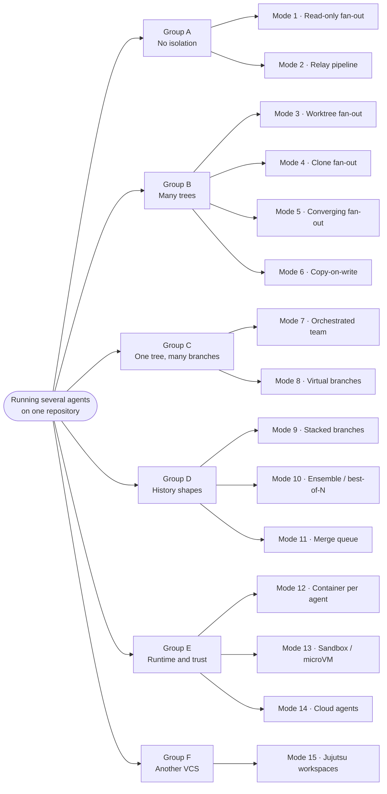

The groups are ordered by how much machinery they need, cheapest first. Most work is well served by
Group A or Group B; the later groups exist for the cases those cannot cover.

### Table 1 - What Each Mode Is

| # | Mode | Agents work in | History it produces | Runtime | The idea, in one line |
| - | ---- | -------------- | ------------------- | ------- | --------------------- |
| **1** | Read-only fan-out | your one directory | none | shared | Many agents read, none writes, you synthesise |
| **2** | Relay pipeline | your one directory | one branch | shared | One agent at a time, fresh context each stage, the commit is the handover |
| **3** | Worktree fan-out | a worktree each | branch each | shared | Separate checkouts, one shared `.git` |
| **4** | Clone fan-out | a clone each | branch each | shared | Separate repositories, objects borrowed |
| **5** | Converging fan-out | a clone each | branches into one | shared | Contract first, both halves land on one integration branch |
| **6** | Copy-on-write | an overlay each | inherited | inherited | A layer under 3, 4 or 5 that makes each tree near-free |
| **7** | Orchestrated team | your one directory | one branch | shared | Several agents, one writer at a time, you hold the lock |
| **8** | Virtual branches | your one directory | several at once | shared | One directory, changes routed to branches at commit time |
| **9** | Stacked branches | inherited | ordered chain | inherited | Layers that depend on each other, reviewed in parallel |
| **10** | Ensemble / best-of-N | a clone each | N, of which N−1 die | inherited | Same task attempted several ways, keep one |
| **11** | Merge queue | inherited | inherited | CI | Automation, not you, decides landing order |
| **12** | Container per agent | inherited | inherited | **isolated** | A whole dev stack each, own project name and ports |
| **13** | Sandbox / microVM | a sandbox each | inherited | isolated | A security boundary, not just a file boundary |
| **14** | Cloud agents | someone else's machine | branch each | ephemeral | Delegate off-machine, get pull requests back |
| **15** | Jujutsu workspaces | a workspace each | branch each | shared | A VCS that never loses work and treats conflicts as data |

### Table 2 - What Each Mode Costs

| # | Mode | Setup | Disk per agent | Isolation strength | Merge cost | Review load | Practical ceiling |
| - | ---- | ----- | -------------- | ------------------ | ---------- | ----------- | ----------------- |
| **1** | Read-only fan-out | none | none | not needed | **none** | low, prose | 5–8 |
| **2** | Relay pipeline | none | none | not needed | **none** | one branch | 4–6 stages |
| **3** | Worktree fan-out | ~1 s + install | 1.5–2.9 GB | files only | medium | one diff each | 3–4 |
| **4** | Clone fan-out | ~1 s + install | 1.5–2.9 GB | **full Git** | medium | one diff each | 3–4 |
| **5** | Converging fan-out | contract + clones | 1.5–2.9 GB | full Git | medium | **one PR** | 2–3 |
| **6** | Copy-on-write | ~1 s per tree | **~0** | inherited | inherited | unchanged | raises disk ceiling |
| **7** | Orchestrated team | none | none | **none, discipline only** | **none** | one branch | 2–4 |
| **8** | Virtual branches | tool install | **one tree** | history only | low | one diff each | 3–5 |
| **9** | Stacked branches | none | inherited | inherited | low, front-loaded | **best in class** | 3–4 layers |
| **10** | Ensemble / best-of-N | verifier first | N trees | full, mandatory | **none** | **one diff** | N = 3 |
| **11** | Merge queue | **needs CI** | on the runner | inherited | automated | unchanged | past 4 |
| **12** | Container per agent | minutes | volumes | **full runtime** | inherited | unchanged | 2–3, RAM-bound |
| **13** | Sandbox / microVM | image build | image + tree | **strongest** | inherited | should rise | RAM-bound |
| **14** | Cloud agents | none locally | **none locally** | full, remote | high volume | **highest** | your review rate |
| **15** | Jujutsu workspaces | learning curve | ~worktree | files only | low | unchanged | ~worktree |

### Table 3 - Reach For It When, Avoid It When

| # | Mode | Reach for it when | Avoid it when |
| - | ---- | ----------------- | ------------- |
| **1** | Read-only fan-out | The task is *find*, *trace*, *explain*, *audit* | Anything is written |
| **2** | Relay pipeline | One long session is degrading; you want honest self-review | The stages are genuinely independent - that is a fan-out |
| **3** | Worktree fan-out | You want every agent's branch visible from one place | Agents are unsupervised: `.git/hooks` and config are shared |
| **4** | Clone fan-out | **Default for independent tasks** | You specifically need shared refs |
| **5** | Converging fan-out | One deliverable, disjoint paths, each half a full session | The halves overlap on files, or the contract is not settled |
| **6** | Copy-on-write | Three or more trees and disk or install time is the limit | Fewer than three trees - the base costs more than it saves |
| **7** | Orchestrated team | Work too coupled to split, environment too costly to copy | Tasks are independent - you are paying coordination for nothing |
| **8** | Virtual branches | Environment expensive, tasks cheap, split cleanly by file | You need runtime isolation or competing attempts |
| **9** | Stacked branches | Tasks form a chain; one huge PR would be unreviewable | The tasks are independent, or the stack would exceed four layers |
| **10** | Ensemble / best-of-N | One task, several plausible shapes, and a verifier exists | **No verifier** - then it is just N diffs to read |
| **11** | Merge queue | More than four concurrent branches, routinely, and CI exists | No CI. You are the queue |
| **12** | Container per agent | Migrations, integration tests, anything touching a service | Pure logic and data - you are paying for nothing |
| **13** | Sandbox / microVM | Unattended runs, untrusted code, unscoped credentials | You are watching, and the task is ordinary |
| **14** | Cloud agents | Well-specified tasks, no local services, more work than hardware | The tests need a database - a skipped suite reads as a pass |
| **15** | Jujutsu workspaces | Agent Git improvisation has cost you real work more than once | You have not lost work that way - it solves a problem you lack |

### The Fifteen Shapes

The same drawing conventions throughout: **you** are always the top or left node, a **cylinder** is a
directory or repository on disk, a **plain box** is an agent or a branch, and a **dotted line** means
*reads without writing*. Compare any two diagrams and the structural difference is the whole difference
between the modes.

#### Group A - No Isolation

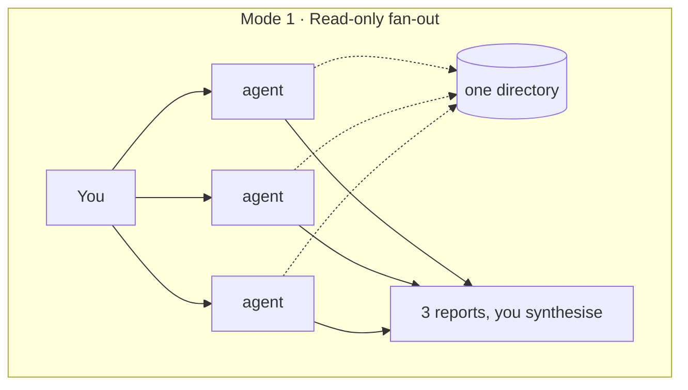

*No writer exists, so no isolation is needed. The cheapest mode there is, and the most underused.*

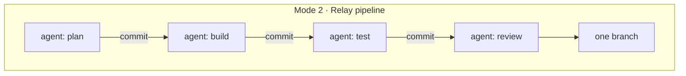

*Parallel in **context**, not in time: one agent runs at a time, each starting empty. Differs from Mode 1
in that work is written; differs from every fan-out in that nothing runs concurrently.*

#### Group B - Many Trees

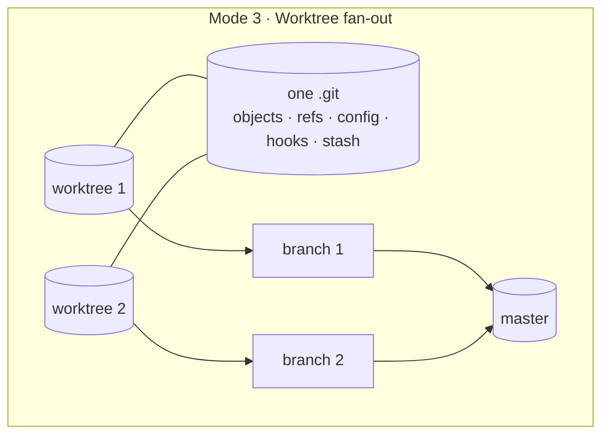

*Separate files, one shared `.git`. That share is the whole caveat: hooks, config and stash reach your
main checkout.*

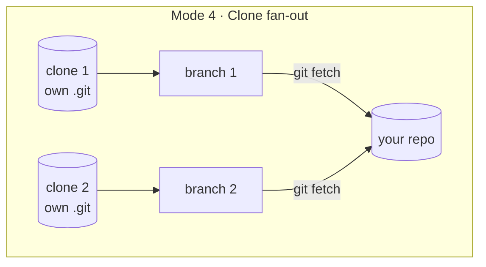

*Identical ergonomics to Mode 3, identical cost, but each agent owns its `.git`. The extra step is the
fetch; the gain is that nothing an agent does can reach you.*

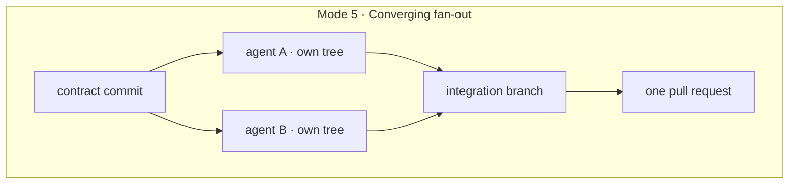

*Same trees as Mode 4, different destination: the branches converge instead of landing separately,
because the work is one deliverable. Note the contract commit comes first, alone.*

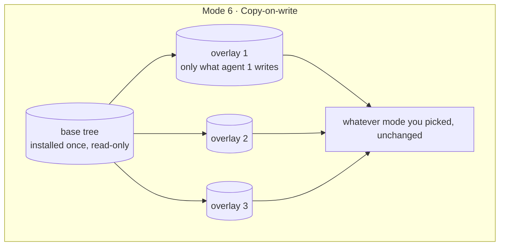

*Not a way of working - a layer beneath one. Git sees nothing different; only the disk does.*

#### Group C - One Tree, Many Branches

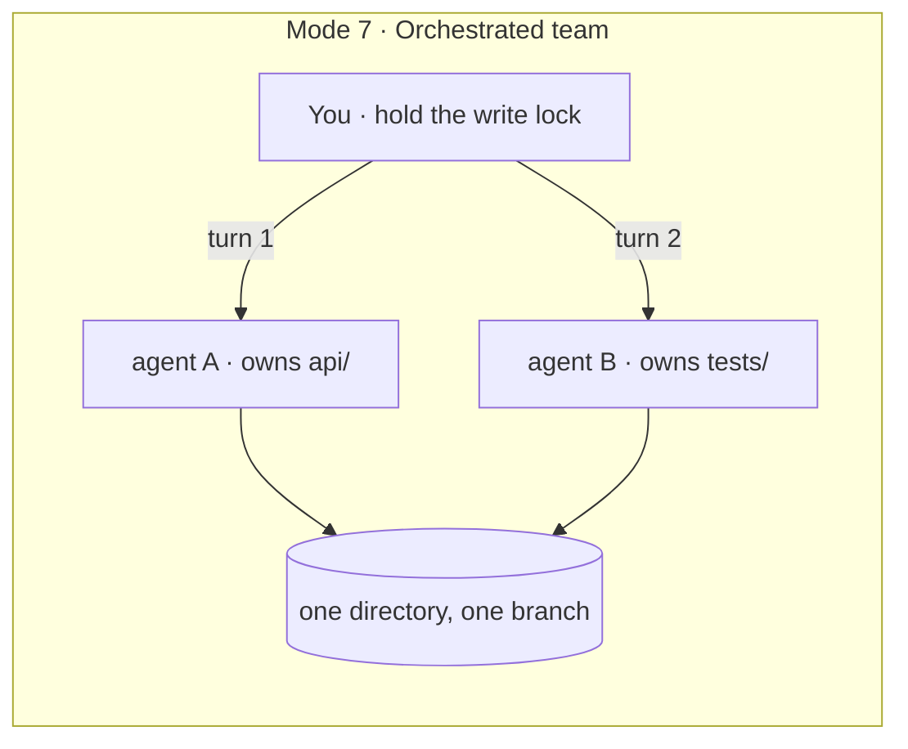

*One directory and no technical safeguard at all: the turn-taking is the mechanism. Differs from Mode 1
in that agents write, which is exactly why the lock exists.*

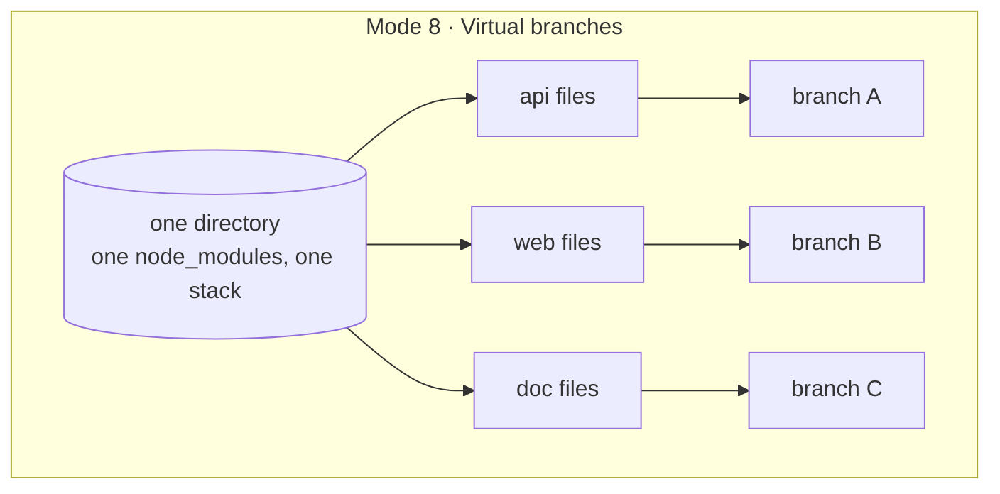

*Also one directory, but the separation happens at commit time rather than by taking turns. You get
several real branches out of one tree.*

#### Group D - History Shapes

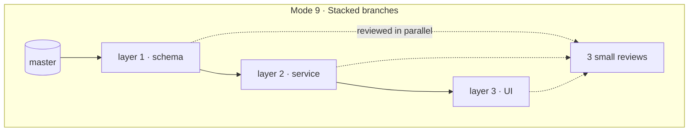

*Written in sequence because each layer needs the one below, reviewed in parallel because each diff is
bounded. Lands bottom-up, as one operation.*

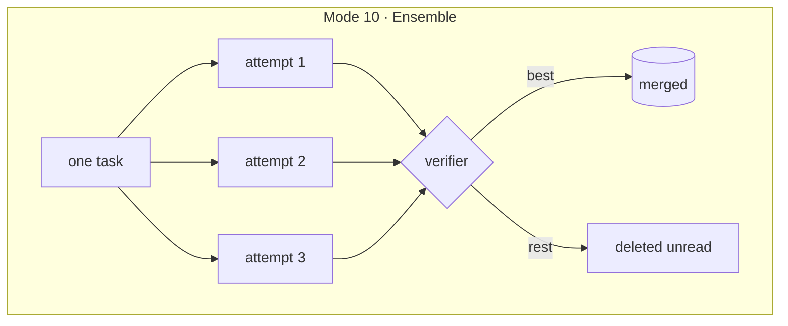

*The only mode where the agents duplicate rather than divide the work. Merge cost is zero because
nothing is integrated - you select.*

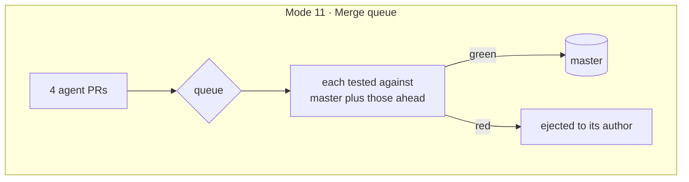

*The only mode that catches the semantic conflict: two branches that each pass alone and break together.
Needs CI to exist at all.*

#### Group E - Runtime and Trust

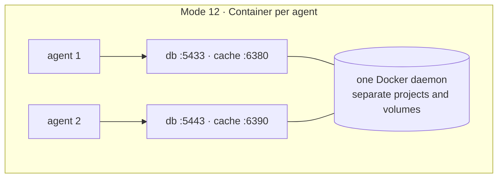

*Orthogonal to everything above: it isolates the running services, not the files. Without it, exactly
one agent owns the database port and the others silently share it.*

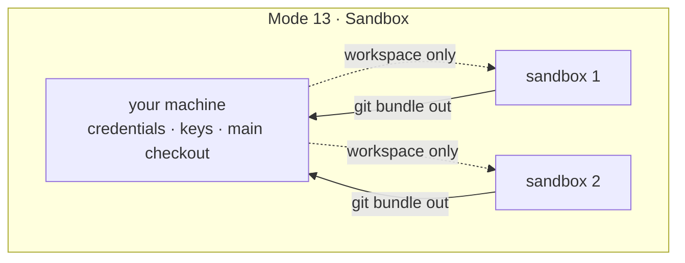

*Answers a different question from every mode above it: not "will agents collide" but "what can this
process reach".*

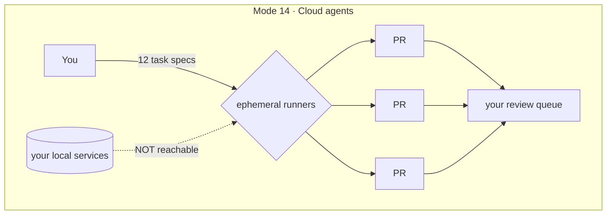

*Unbounded by your hardware and bounded entirely by your review rate. The dotted line is the trap: no
database there means suites skip and exit 0.*

#### Group F - Another VCS

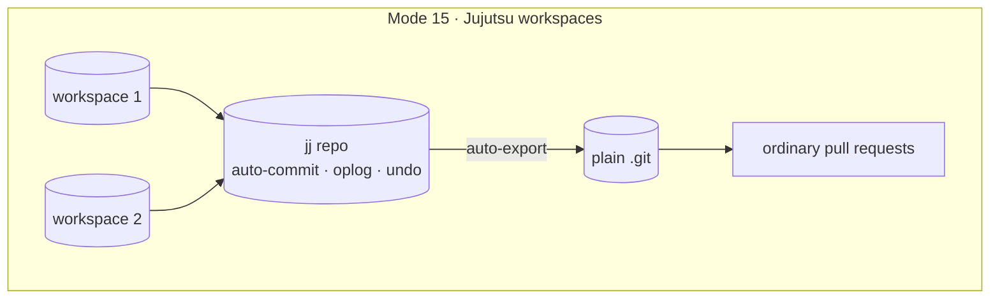

*Shaped like Mode 3, with a different engine underneath: work is committed before every operation, so an
agent cannot destroy it, and conflicts live inside commits rather than blocking them.*

---

## Before You Start: What Is Already Automated, and by What

Several modes in this manual were written as things you assemble by hand - open three terminals, create
three worktrees, paste three prompts. For some of them that is now unnecessary work, because the agent
tools themselves grew the feature. This section names each feature, says how you invoke it, and says
exactly where its automation stops.

Two things to be clear about before the list.

**"Automated" here means the mechanics, not the judgement.** A tool can create the isolated checkouts,
launch the workers, keep their contexts separate and collect their results. No tool decides whether your
two tasks overlap on files, whether the contract should be landed first, or whether you can review five
diffs today. Those are [Part 3](#part-3---the-selection-algorithm)'s questions and they remain yours.
The features below remove typing, not thinking.

**Everything described is current as of August 2026** and comes from the products' own documentation,
linked at the end. Feature names, flags and defaults move; the patterns in the rest of this manual do
not.

### Subagents - Claude Code

**What it is.** A delegated worker inside your session. It gets its own context window, does one task,
and returns a summary to the conversation that spawned it. Its intermediate work - the file contents it
read, the logs, the dead ends - never enters your context.

**How you invoke it.** Ask for several in one message and they run concurrently. For a reusable one,
create a file in `.claude/agents/` with frontmatter naming it, describing when to use it, and optionally
restricting its tools, model or isolation.

**What it isolates.** Context, and only context. By default every subagent runs in *your* working
directory, sharing the same files as you and as each other.

**What it does not do.** It does not isolate files unless you ask for that separately, it does not give
the worker its own branch, and it does not commit. If three subagents write to the same file at once,
the last write wins silently - no conflict, no error, no notification. That is exactly the failure
[Mode 7](#mode-7---orchestrated-team) is about, and it is not solved by the feature existing.

**Which modes this covers.** [Mode 1](#mode-1---read-only-fan-out) entirely: read-only fan-out is
precisely a set of concurrent subagents returning reports, so use one message rather than five terminals.
[Mode 2](#mode-2---relay-pipeline) largely: each subagent starts from a fresh context by construction,
which is the whole mechanism the relay was built to get by hand.

### Worktree Isolation - Claude Code and Codex CLI

**What it is.** A separate working directory with its own files and its own branch, sharing the
repository's history with your main checkout. This is [Mode 3](#mode-3---worktree-fan-out), and it is now
a flag rather than a procedure.

**How you invoke it, three ways in Claude Code.**

* `claude --worktree <name>` (or `-w`) starts a session in a fresh worktree, created under
  `.claude/worktrees/<name>/` on a new branch named `worktree-<name>`. Run it again with a different
  name in another terminal for a second isolated session.
* `isolation: worktree` in a custom subagent's frontmatter gives that subagent its own worktree every
  time it runs. You can also just ask Claude to "use worktrees for your agents".
* Asking Claude to work in a worktree mid-session, which it does with a dedicated tool.

**In Codex CLI**, parallel tasks are given git worktrees so they operate on separate working copies of
the same repository.

**What it isolates.** File edits. Claude Code additionally *enforces* the boundary rather than trusting
it: while a session is in a worktree it blocks edits targeting the main checkout, blocks commands whose
working directory resolves there, and blocks git redirected back into it via `-C`, `--git-dir`,
`GIT_DIR` or a `cd`. That enforcement covers subagents spawned from the isolated session too.

**What it does not do - and this is the part that matters for this manual.** A worktree still shares the
repository's `.git` directory with your main checkout, along with project-scope plugins and saved
permission approvals. That is the documented behaviour, not a bug. So everything
[Mode 4](#mode-4---clone-fan-out) argues still stands: shared `.git` means shared hooks, shared config
and a shared stash, and no flag in any tool gives an agent a genuinely separate repository. If you want
that boundary, you still run `git clone --shared` yourself.

**Housekeeping it does handle.** On exit, a clean worktree from an unnamed session is removed
automatically; one containing work prompts you first. Subagent worktrees are removed when the subagent
finishes without changes, and a periodic sweep clears older ones, skipping any that still hold
uncommitted work or unpushed commits. A `.worktreeinclude` file copies gitignored files such as `.env`
into each new worktree, which is otherwise the first thing that breaks in a fresh checkout.

### Agent View - Claude Code

**What it is.** One screen for dispatching sessions into the background and monitoring them, opened with
`claude agents`. A research preview at the time of writing.

**How it relates to this manual.** It is the fan-out surface: you hand off several independent tasks,
check status at a glance, and attach to one only when it needs you. Crucially, **each dispatched session
is moved into its own worktree automatically**, so the isolation step of
[Mode 3](#mode-3---worktree-fan-out) happens without you creating anything.

**Where it stops.** It dispatches and monitors. It does not rebase, does not merge, does not run your
tests between merges, and does not tell you that two of the sessions edited the same file. The
integration procedure in every mode of this manual is still yours to run.

### Agent Teams - Claude Code

**What it is.** Several coordinated sessions with a lead that plans, assigns and supervises, a shared
task list, and direct messaging between teammates. Experimental, and disabled by default.

**Which mode this is.** [Mode 7](#mode-7---orchestrated-team), the orchestrated team - the lead does the
assigning and the sequencing you would otherwise do by hand across chat windows.

**The critical caveat, which the documentation states outright.** Agent teams are **not** worktree
isolated. Teammates share the working directory, and the documented guidance is to partition the work so
that each teammate owns a different set of files. That is Mode 7's write-domain rule, restated by the
people who built the feature. So this is the one place where automation covers the *coordination* and
leaves the *safety mechanism* entirely to you: the prompts in Mode 7 that assign path domains, forbid
writing outside them, and forbid agents from committing are not obsolete - they are the missing half of
the feature.

### Dynamic Workflows - Claude Code

**What it is.** A script that runs many subagents and cross-checks their results, for work too large to
coordinate a turn at a time or that needs more than one pass. Progress is visible via `/workflows`.

**Which modes this covers.** [Mode 10](#mode-10---ensemble--best-of-n) most directly: generating several
independent attempts and having them scored against each other is a workflow's natural shape, and the
verifier you were told to write by hand becomes a judging stage in the script. It also scales
[Mode 1](#mode-1---read-only-fan-out) well past what you would drive manually - a codebase-wide audit
fanned out across dozens of readers, then synthesised.

**Where it stops.** The script decides control flow deterministically; it does not decide whether your
task is one that benefits from N attempts, and it does not supply the verifier's content. Mode 10's rule
stands unchanged: no verifier, no ensemble.

### `/batch` - Claude Code

**What it is.** A packaged combination of the two features above rather than a separate one: it splits a
single large change into 5 to 30 worktree-isolated subagents that each open a pull request.

**Which modes this touches.** The mechanical part of a large fan-out -
[Mode 5](#mode-5---converging-fan-out)'s and [Mode 9](#mode-9---stacked-branches)'s "many isolated trees,
many review units" - without you creating trees or branches.

**Where it stops.** It produces review units; it does not review them, and it does not decide the order
they land in. Thirty pull requests you cannot read is the failure
[Q3](#q3-can-you-realistically-review-n-diffs-today) exists to prevent, and this feature makes hitting it
easier, not harder.

### Sandboxed and Off-Machine Execution - Codex, Claude Code on the Web

**What it is.** Codex runs every cloud task inside its own sandbox, preloaded with your repository, and
ships a subagent model with a manager coordinating several parallel workers that each have their own
context. Claude Code runs sessions on the web, and scheduled routines run them in the cloud on a timer.

**Which modes this covers.** [Mode 13](#mode-13---sandbox--microvm-per-agent)'s trust boundary and
[Mode 14](#mode-14---cloud-and-remote-agents)'s off-machine execution, without you building a sandbox.

**Where it stops - and this is Mode 14's central warning, unchanged.** A cloud environment has none of
your local services. Suites that need a database commonly skip and exit 0 rather than failing, so a
cloud agent can hand you a green run that executed nothing you care about. No amount of platform
automation fixes that, because from the platform's point of view nothing went wrong.

### What No Tool Automates, and Why

Five gaps. None of them is an oversight: each is something a tool either cannot know, or deliberately
does not do because doing it would mean being a different thing.

**A separate repository, rather than a worktree - [Mode 4](#mode-4---clone-fan-out).** Every isolation
feature listed above is built on git worktrees, and a worktree shares one `.git` with your main checkout
*by definition*. That sharing is what makes it cheap: no objects are copied. But `.git` includes
`.git/hooks`, `.git/config` and the stash, so an agent that writes a hook file has arranged for code to
run as you, in your own checkout, the next time you commit - and an agent that runs `git stash` can take
work that was not its own. No flag disables this, because a worktree without a shared `.git` is not a
worktree, it is a clone. If you want that boundary you create it yourself with `git clone --shared`,
which measures 44 milliseconds and 200 kilobytes more than a worktree. The tools did not skip this
because it is unimportant; they skipped it because it is outside what the feature *is*.

**Its own running services - [Mode 12](#mode-12---container-per-agent).** File isolation and runtime
isolation are unrelated problems, and no agent tool solves the second. A worktree gives an agent its own
copy of the source; it does not give it its own database, its own cache or its own port. Two agents in
two perfectly isolated worktrees will still connect to the same database on the same port, run
migrations over each other and read each other's fixtures - and every one of those actions looks
completely normal to the isolation layer, because no file was touched. Worse, the failure is silent: the
tests pass, against the wrong data. Deciding the port map and setting both halves of the configuration -
where the stack publishes, and where the tests connect - is manual work, and it is the manual work most
likely to be skipped.

**Trees that are cheap on disk - [Mode 6](#mode-6---copy-on-write-workspaces).** A worktree is a fresh
checkout of tracked files, which means it has no installed dependencies at all. The tools help at the
margin: a `.worktreeinclude` file copies gitignored things like `.env` into each new worktree, so the
first thing that usually breaks does not. But nothing installs your dependencies, and nothing
deduplicates them between trees. Five worktrees is five dependency installs and five times the disk
unless you build the copy-on-write layer underneath, which is filesystem work no coding tool is going to
do for you.

**The shape of your history - [Mode 9](#mode-9---stacked-branches).** Whether a change should arrive as
one branch, three stacked layers, or five independent pull requests is a judgement about what a human
reviewer can hold in their head. A tool has no access to that. `/batch` will happily split your change
into thirty worktree-isolated pull requests, because thirty is the number you gave it; it has no view on
whether thirty is a good idea, and thirty pull requests nobody reads is not throughput.

**The merge - [Part 5](#part-5---universal-rules-and-failure-recovery).** This is the big one, and it
is worth stating plainly: *every feature named in this section is good at starting parallel work, and
not one of them finishes it.* Nothing rebases each branch inside the tree where its agent still has the
context to resolve conflicts. Nothing merges one branch at a time so that a red suite has exactly one
suspect. Nothing runs your tests between merges. And nothing notices the case that costs the most time -
two branches that each merge cleanly, each pass alone, and break the build in combination, because the
conflict between them was semantic rather than textual. That failure has no textual marker for a tool to
find. It is caught by a procedure, and the procedure is yours.

### The Summary Table

| Mode | Automated by | What you still do yourself |
| ---- | ------------ | -------------------------- |
| **1** Read-only fan-out | Subagents; dynamic workflows at scale | Partition the reading by path; synthesise the reports |
| **2** Relay pipeline | Subagents (fresh context per stage) | Decide the stages; write the plan file that carries state between them |
| **3** Worktree fan-out | `claude --worktree`, `isolation: worktree`, agent view, Codex CLI | Rebase, merge one at a time, test between merges, clean up |
| **4** Clone fan-out | **Nothing.** No tool gives an agent a separate `.git` | All of it, if you want the stronger boundary |
| **5** Converging fan-out | `/batch` for the trees and branches | Contract first; producer-before-consumer merge order; the end-to-end test |
| **6** Copy-on-write | **Nothing** | All of it |
| **7** Orchestrated team | Agent teams (coordination only) | **The write domains and the commit discipline - teams are not isolated** |
| **8** Virtual branches | GitButler, a separate tool | Routing discipline; per-file write domains |
| **9** Stacked branches | `/batch` for the fan-out shape | The layering decision; bottom-up landing; restack-and-retest |
| **10** Ensemble / best-of-N | Dynamic workflows | Writing the verifier; refusing to graft losing attempts together |
| **11** Merge queue | CI platforms, if you have CI | Everything, if you do not |
| **12** Container per agent | **Nothing** | All of it: project names, port maps, both halves of the config |
| **13** Sandbox | Codex cloud sandboxes | Local sandboxing; deciding what may be reached |
| **14** Cloud agents | Codex cloud, Claude Code on the web, routines | Verifying that a green run actually ran |
| **15** Jujutsu | Jujutsu itself | Adoption, and keeping agents off raw `git` |

### What This Means for Reading the Rest

Use the built-in feature wherever the table above names one - it is faster, better tested and less
error-prone than the equivalent hand-rolled setup, and the manual's own commands for those modes are
best read as an explanation of what the feature is doing on your behalf.

Then keep the rest of each mode, because none of it is automated: the trigger conditions that tell you
when the mode is the right one, the conflict classes it admits, its rules, and its merge procedure. A
feature that launches five isolated agents has done the easy half. The half that decides whether the
exercise was worth doing happens afterwards, and this manual is mostly about that half.

**Sources:** [Run parallel sessions with worktrees](https://code.claude.com/docs/en/worktrees) ·
[Run agents in parallel](https://code.claude.com/docs/en/agents) ·
[Subagents](https://code.claude.com/docs/en/sub-agents) ·
[Agent teams](https://code.claude.com/docs/en/agent-teams) ·
[Introducing the Codex app](https://openai.com/index/introducing-the-codex-app/)

---

## Part 1 - The Problem

### Parallelism Is Not One Decision, It Is Five

Most advice about parallel agents collapses into a single question: worktrees, or not? That question
is too small. Five independent choices decide whether a parallel run succeeds, and a mode is simply
one combination of the five.

| Axis | What It Controls | Values, Cheapest First |
| ---- | ---------------- | ---------------------- |
| **Filesystem** | Whether two agents can overwrite each other's edits | shared directory → worktree → clone → container → microVM → cloud sandbox |
| **History** | How the work becomes reviewable | one branch → branch per agent → virtual branches → stack |
| **Runtime** | Whether two agents can both run the app | shared services → port-namespaced → containerised → ephemeral |
| **Task relation** | What "done" means | disjoint tasks → dependent chain → same task, competing |
| **Integration authority** | Who decides what lands | you → merge queue → orchestrating agent |

A mode that isolates the filesystem but not the runtime still deadlocks on the one database port. A mode that
isolates both but ignores task relation still produces branches that conflict on every merge. Read
each mode below as a point in this five-dimensional space, not as a tool recommendation.

### The Two Costs You Are Trading

Every parallel run pays two costs, and the whole craft is keeping their sum low.

* **Coordination cost** is paid up front: partitioning the work, declaring who writes what, landing
  a shared interface before fan-out.
* **Merge cost** is paid at the end: conflicts, semantic breakage, review time, rework.

Isolation does not remove merge cost. It *defers* it. Two agents in two worktrees never overwrite
each other in real time; they simply hand you the same conflict later, when neither agent is around
to explain what it was trying to do. Choosing a mode is choosing where on that curve you want to sit.

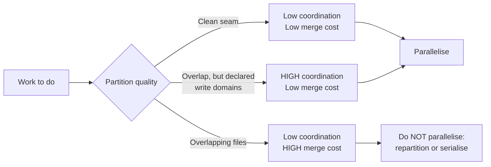

### What the Evidence Says

Numbers worth carrying into every decision below. Full citations in [Appendix B](#appendix-b---evidence-and-sources).

| Finding | Number | Implication |
| ------- | ------ | ----------- |
| Conflict rate across 142,000+ agent-authored pull requests | **27.7%** | Better than a coin flip, far worse than human baseline |
| Conflict rate, two *different* agents working concurrently | **41.7%** | Convention drift is a real cost |
| Conflict rate, the *same* agent's concurrent work | **19.8%** | One agent, consistent conventions, halves the risk |
| Repositories with temporally overlapping agent PRs | **40.2%** | This problem is already normal, not exotic |
| Conflicted files that are source code, not lockfiles | **84.4%** | Fear shared utilities, not lockfiles |
| Conflicts that are structural, add/add or modify/delete | **~42%** | Git cannot auto-resolve these; a human must reason |
| Practical worktree ceiling before management overhead wins | **8–10** | Your real ceiling is lower; see below |
| Worktree creation time, versus a shared clone | **826 ms vs 870 ms** | Isolation is effectively free; pick on safety |

The last row deserves emphasis, because it overturns the usual advice: a `git clone --shared` costs
44 milliseconds and 200 kilobytes more than a worktree, and gives a strictly stronger boundary.
[Mode 4](#mode-4---clone-fan-out) explains why that boundary is worth having.

### The Ceiling Nobody Advertises

Parallelism moves the bottleneck to review. A randomised controlled trial found developers were 19%
slower with AI assistance, against a forecast 24% speed-up, and its authors note the study never
measured parallel agent workflows. Their own follow-up analysis adds the caveat that matters here:
extra tasks completed through parallelism may simply be lower-value tasks.

Four branches you genuinely reviewed beat eight you skimmed. Every mode in this manual is subject to
that ceiling.

## Part 2 - The Fifteen Modes

This is the body of the manual: fifteen modes, arranged in six groups. The groups are ordered by how
much machinery they require, cheapest first, and within a group the modes are ordered the same way. You
are not expected to read them all - [Part 3](#part-3---the-selection-algorithm) picks one for you - but
reading a whole group is worthwhile, because the modes inside it differ in ways that only become clear
side by side.

| Group | What its modes have in common |
| ----- | ----------------------------- |
| **A · Foundations** | No isolation at all, and none needed |
| **B · One machine, many trees** | Each agent gets its own copy of the files |
| **C · One tree, many branches** | One directory shared by everyone, separated some other way |
| **D · History topologies** | Not where the files live, but what shape the history takes |
| **E · Runtime and trust** | Not "will they collide" but "can they run the app" and "what can they reach" |
| **F · Alternative version control** | A different version control system underneath the same problem |

### How to Read a Mode Entry

Every mode below uses the same ten headings, in the same order, so you can compare modes by scanning
one heading across all of them.

| Heading | What It Answers |
| ------- | --------------- |
| **When You Need It** | The real situation that calls for this mode, and the trigger conditions |
| **The Method** | Mechanically, what happens and in what order |
| **Diagram** | The same thing as a picture |
| **Setting It Up** | The commands, end to end |
| **What the Output Looks Like** | What exists on disk and in Git when the agents stop |
| **How the Merge Works** | The integration procedure, step by step |
| **What Can Conflict** | Every conflict class this mode admits, and its remedy |
| **Rules** | The non-negotiables |
| **Cost** | Setup time, disk, isolation strength, review load, practical ceiling |
| **Ready-to-Use Prompts** | The prompt for each chat session, in order, with placeholders to fill in |

#### How to Use the Prompt Blocks

The last heading of every mode is a set of prompts you can copy into agent sessions as they stand.
They are written to be autonomous: each one tells its agent where to work, what it owns, what it must
never touch, what the other agents are doing at the same time, how to prove its work, and how to hand
that work back. The last prompt in each block is the integration prompt - the one that merges
everything and tears the fan-out down.

Replace the placeholders before pasting. These are the same everywhere in the manual:

| Placeholder | Meaning | Example |
| ----------- | ------- | ------- |
| `{{REPO}}` | Absolute path to your main checkout | `~/repo` |
| `{{BASE}}` | The branch every agent starts from | `master` |
| `{{N}}` | How many agents you are running | `3` |
| `{{TASK_1}}` | Agent 1's task, described in full - this is the one to be generous with | *"Fix the parser so that…"* |
| `{{BRANCH_1}}` | Agent 1's branch name | `fix/parser-edge-case` |
| `{{DOMAIN_1}}` | The paths agent 1 may write to | `packages/parser/` |
| `{{WORKDIR_1}}` | The directory agent 1 runs in | `~/agents/parser` |
| `{{TEST_CMD_1}}` | The command that proves agent 1's work | `uv run pytest tests/parser -q` |
| `{{OTHER_DOMAINS}}` | The paths the *other* agents own, so this one stays clear of them | `data/catalogs/`, `docs/` |
| `{{SHARED_FILES}}` | Files only you may edit during the batch | lockfiles, migrations, `CHANGELOG.md` |

The numbered ones extend as far as you have agents: `{{TASK_2}}`, `{{DOMAIN_2}}`, `{{TEST_CMD_3}}` and
so on, one set per agent. Modes that need extra placeholders - a contract path, a port map, a verifier
- introduce them at the top of their own block.

**A note on tone in these prompts.** They are deliberately blunt and repetitive about boundaries.
An agent that is told once not to touch a path will usually respect it; an agent told at the start,
in its rules, and again in its definition of done will respect it under pressure, which is when it
matters.

---

### Group A - Foundations: Parallelism Without Isolation

Two modes need no worktrees, no clones and no containers. Both are underused, and both should be
your reflex before you reach for anything heavier.

#### Mode 1 - Read-Only Fan-Out

**One-line:** many agents, one directory, zero writers.

##### When You Need It

You have a question about the codebase that spans several subsystems, and answering it means reading
far more than one context window comfortably holds.

*Real use case.* A search endpoint returns in 40 seconds and nobody knows why. The suspects are spread
across four subsystems: query construction in `api/search/query_builder.py`, database session and
connection handling in `api/search/database.py`, the client fetch path in `web/actions/search.ts`, and
the index configuration that decides the shape of the query. One agent reading all four ends the
session with a diluted context and a vague answer. Four agents, each reading one subsystem and
reporting a summary, end with four sharp answers you can compare.

Trigger conditions:

* The task verb is *find*, *trace*, *explain*, *audit*, *compare*, or *where is*.
* You want breadth of coverage more than depth on any single file.
* You are scoping work you have not decided to do yet.

##### The Method

All agents share your actual working directory. This is safe for exactly one reason: none of them
writes. The failure modes that make shared directories dangerous - one agent overwriting another's
edit, an agent reading a half-modified file and reasoning from it, two `git add` calls corrupting the
index - all require a writer. Remove writers and the whole class disappears.

Each agent is given a bounded reading assignment and returns prose, not code. You are the only writer
in the system, and you write after all reports are in.

##### Diagram

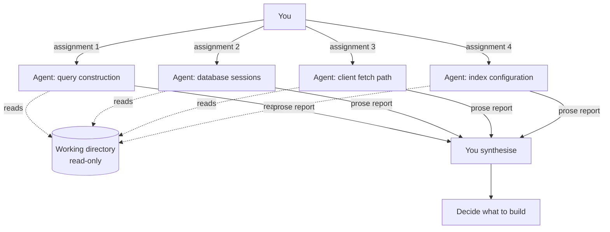

##### Setting It Up

No setup. Launch several `Explore` agents in one message so they run concurrently, and give each a
scope that does not overlap:

```
Agent 1: read api/search/query_builder.py and report how the query is assembled and
         where its vocabulary comes from. Do not read the frontend.
Agent 2: read api/search/database.py and report the session mode, connection reuse
         and timeout handling.
Agent 3: read web/actions/search.ts and its test, report the request shape and caching.
Agent 4: read the index configuration, report which fields influence query shape.
```

##### What the Output Looks Like

Nothing on disk changed. `git status` is identical before and after. The output is four written
reports in your session, and your own synthesis of them. There is no branch, no commit, and nothing
to clean up.

##### How the Merge Works

There is no merge. This is the mode's defining advantage: the integration step is you reading four
summaries and forming one opinion, which costs minutes rather than an evening.

##### What Can Conflict

| Conflict Class | Why It Happens Here | Remedy |
| -------------- | ------------------- | ------ |
| File collision | Impossible - no writes | - |
| Index corruption | Impossible - no `git add` | - |
| **Duplicated effort** | Two agents given overlapping scopes read the same files and return the same summary | Assign by file path, not by topic |
| **Contradictory reports** | Two agents read different layers and describe the same behaviour differently | Treat contradiction as a finding: it usually marks the actual bug |
| **Stale reads** | You edit a file while the agents are running | Do not edit during a read-only fan-out; you are the only writer, so simply wait |

##### Rules

1. **No agent in this mode may write, stage, or commit.** If one needs to, that is a different mode.
2. **Partition by file path, not by question.** "Read these three files" produces disjoint reports;
   "investigate performance" produces four copies of the same report.
3. **Do not edit the tree while they run.** You are the writer that breaks the safety property.
4. **Ask for evidence, not conclusions.** Require file and line references so you can verify cheaply.

##### Cost

| Dimension | Value |
| --------- | ----- |
| Setup time | None |
| Disk | None |
| Isolation strength | Not required |
| Review load | Low - prose, not diffs |
| Practical ceiling | 5–8 agents; beyond that your own synthesis is the bottleneck |

##### Ready-to-Use Prompts

No setup precedes these - open {{N}} chat sessions in {{REPO}} and paste one prompt into each. Two
extra placeholders: `{{QUESTION}}`, the single question all the agents are answering together, and
`{{SCOPE_1}}`, the exact files or directories this agent is allowed to read.

**Sessions 1 to {{N}} - the readers.** Same template, one per agent, changing only the number and the
scope. Launch them all at once; they do not need to know each other's findings.

```text
You are reader agent 1 of {{N}}, working in parallel with {{N}} - 1 other agents on the same
repository. We are investigating one question together and each of us reads a different part
of the code.

THE QUESTION WE ARE ANSWERING
{{QUESTION}}

YOUR SCOPE - read these and nothing else:
{{SCOPE_1}}

The other agents are covering {{OTHER_DOMAINS}}. Do not read those. If the answer seems to
live there, say so in your report instead of going to look; another agent is already there.

ABSOLUTE RULES
1. This is a READ-ONLY session. You may not create, edit or delete any file.
2. You may not run git add, git commit, git switch, git stash, or any command that writes.
3. You may not run formatters, linters that rewrite, or code generators.
4. Read-only shell commands are fine: cat, grep, rg, find, git log, git blame, git diff.
5. We are all working in the same directory at the same time. If a file looks like it changed
   under you, stop and report it - do not try to fix anything.

WHAT TO PRODUCE
A written report, in prose, structured as:
  1. What this code actually does, in your own words.
  2. Evidence - every claim followed by file:line references I can check myself.
  3. Anything that looks wrong, slow, or surprising, with the evidence for it.
  4. What you could NOT determine from your scope alone, and which scope would answer it.

Do not propose a fix. Do not write code, not even in the chat. I am collecting {{N}} reports
and deciding afterwards. A confident wrong answer costs me more than an honest gap.

Begin by listing the files in your scope, then read them.
```

**Final session - the synthesis.** Paste the {{N}} reports into one fresh session. There is no merge
here in the Git sense; this is the whole integration step.

```text
Below are {{N}} independent reports from agents that each read one part of a codebase while
investigating this question:

{{QUESTION}}

No agent saw another's report, and none of them saw the whole system.

REPORT 1 (scope: {{SCOPE_1}}):
<paste report 1>

REPORT 2 (scope: ...):
<paste report 2>

YOUR JOB
1. Give me one synthesis that answers the question, or states plainly that it cannot be
   answered yet.
2. List every point where two reports CONTRADICT each other. Do not smooth these over - a
   contradiction between two layers is usually where the actual bug lives, and it is the most
   valuable thing this exercise produces.
3. List the gaps every report flagged, and tell me which single further investigation would
   close the most of them.
4. Recommend what to do next, and which mode of work it calls for: one agent, or a fan-out.

Nothing on disk has changed and nothing needs merging. Do not write code.
```

---

#### Mode 2 - Relay Pipeline

**One-line:** one agent at a time, in sequence, each starting from a clean context and reading the
previous stage's commit.

##### When You Need It

The work is genuinely sequential, but doing it in one long session degrades quality as the context
fills with dead ends, tool output and superseded plans.

*Real use case.* A database migration adding an index to a large, partitioned table. Stage one studies
the schema and the query patterns and writes a plan to a file. Stage two, a fresh agent, implements the
migration from that plan without ever seeing the exploration that produced it. Stage three, another
fresh agent, runs it against the development database and writes the test.
Stage four reviews the diff with no memory of having written it - which is the entire point, because
an agent reviewing its own work in the same context will defend it rather than examine it.

Trigger conditions:

* The stages call for different mindsets - planning, implementation, testing, review.
* One long session would exceed a comfortable context, or already has.
* You want a self-review step that is not self-congratulatory.

##### The Method

This is parallelism in *context*, not in time. Only one agent runs at once, so there is no isolation
problem at all. Each stage ends with a commit; the next stage begins by reading that commit and the
handoff notes, with no other history.

The commit is the interface. Anything a later stage needs must be *in the tree* - in the code, in a
plan file, or in the commit message - because the conversation that produced it is gone by design.

##### Diagram

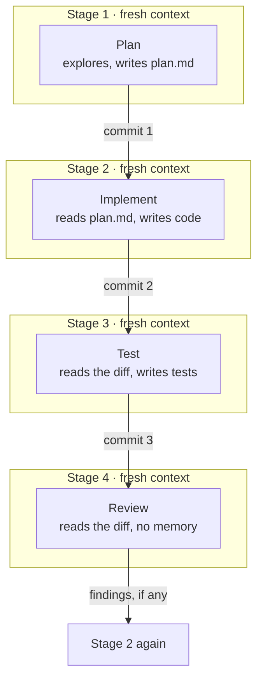

##### Setting It Up

One branch, one directory, sequential sessions. If your tooling has a test-driven-development workflow
and a review command, those are stages one to three and stage four respectively. The change is making
each stage a *separate session* rather than a phase of one long one.

```bash
git switch -c feat/partition-index
# Session 1 - plan only. Ends with:
git add docs/partition-index-plan.md && git commit -m "docs: plan the partition index"
# Session 2 - fresh session, prompt: "implement docs/partition-index-plan.md"
# Session 3 - fresh session, prompt: "write tests for the migration in the last commit"
# Session 4 - fresh session, prompt: "review the diff on this branch"
```

##### What the Output Looks Like

A single branch with an ordered, legible commit history where each commit corresponds to one stage.
The plan file stays in the tree, which makes the branch self-explanatory to a reviewer who was not
there - and to the stage-four agent, which is the same thing.

##### How the Merge Works

An ordinary single-branch merge. Rebase on `master`, run the suite, merge. Because only one agent ever
held the tree, there is no cross-agent integration at all.

##### What Can Conflict

| Conflict Class | Why It Happens Here | Remedy |
| -------------- | ------------------- | ------ |
| File collision | Impossible - one writer at a time | - |
| **Lost context between stages** | Stage 2 needs a decision stage 1 made in conversation and never wrote down | Require every stage to end by writing its handoff into the tree or the commit message |
| **Plan drift** | Stage 2 improvises past the plan, stage 3 tests the plan rather than the code | Have stage 3 read the diff, not the plan |
| **Review capture** | Stage 4 shares a session with stage 2 and defends the code instead of examining it | Never run review in the implementing session - this is the mode's whole reason to exist |
| Merge conflict with `master` | The branch is long-lived while `master` moves | Rebase between stages, not only at the end |

##### Rules

1. **Every stage starts with a fresh context.** A stage that inherits the previous stage's session is
   not a relay, it is one long session with headings.
2. **The commit is the only channel.** If it is not in the tree or the commit message, the next stage
   does not know it.
3. **The reviewing stage must not have written the code.** Non-negotiable, and the reason this mode
   beats a single session even when context is not a problem.
4. **One branch, one directory.** Adding isolation here buys nothing; there is only ever one writer.

##### Cost

| Dimension | Value |
| --------- | ----- |
| Setup time | None |
| Disk | None |
| Isolation strength | Not required |
| Review load | Low - one branch, legible history |
| Practical ceiling | 4–6 stages before handoff overhead exceeds the context benefit |

##### Ready-to-Use Prompts

Four prompts, four **separate** chat sessions, run one after another. The point is that each session
starts empty and learns only from what the previous one committed, so do not continue an old chat.

Extra placeholder: `{{PLAN_FILE}}`, the path the plan is written to, for example
`docs/{{BRANCH_1}}-plan.md`.

**Session 1 - the planner.** Fresh chat.

```text
You are stage 1 of a 4-stage relay: PLAN, IMPLEMENT, TEST, REVIEW. Each stage runs in a
separate chat session with no memory of the others. You are the only stage that gets to
explore freely, and the others will see nothing of your exploration - only what you write
down.

THE TASK
{{TASK_1}}

FIRST, SET UP
  cd {{REPO}}
  git switch -c {{BRANCH_1}} {{BASE}}

YOUR JOB - plan only. You may NOT change any source file.
Explore the codebase as much as you need, then write a plan to {{PLAN_FILE}} containing:
  1. What we are building and why, in one paragraph.
  2. Every file to be created or modified, with the change described per file.
  3. The interfaces: exact names, signatures, types, schema fields. Be specific enough that
     stage 2 never has to guess or invent a name.
  4. The risks, edge cases and failure modes you found while exploring.
  5. How we will know it works - the test cases, described but not written.
  6. What you considered and rejected, and why. Stage 4 will otherwise re-propose it.

Write for a competent colleague who has never seen this codebase and cannot ask you anything.
Everything you leave out is lost when this session ends.

FINISH BY
  git add {{PLAN_FILE}}
  git commit -m "docs: plan {{BRANCH_1}}"

Then print the plan file path and stop. Do not implement anything.
```

**Session 2 - the implementer.** New chat, no memory of session 1.

```text
You are stage 2 of a 4-stage relay: PLAN, IMPLEMENT, TEST, REVIEW. Stage 1 has finished and
its session is gone. You cannot ask it anything.

  cd {{REPO}}
  git switch {{BRANCH_1}}

Read {{PLAN_FILE}}. That plan is your specification.

YOUR JOB - implement the plan, and only the plan.
  - Follow the interfaces in the plan exactly: same names, same signatures, same fields. If
    you rename something, stage 3 will write tests against the plan and they will fail.
  - Do NOT write tests. That is stage 3's work and it must be done by someone who did not
    write the implementation.
  - Do not expand the scope. If the plan is missing something you need, STOP, write what is
    missing at the end of {{PLAN_FILE}} under "GAPS FOUND IN IMPLEMENTATION", commit that,
    and report it to me. Do not improvise the design.

FINISH BY
  {{TEST_CMD_1}}     # if anything already covers this area, it must still pass
  git add -A && git commit -m "feat: implement {{BRANCH_1}}"

Report: what you built, which parts of the plan you could not follow and why.
```

**Session 3 - the tester.** New chat.

```text
You are stage 3 of a 4-stage relay: PLAN, IMPLEMENT, TEST, REVIEW. You did not write the code
you are about to test, and that is the point of this stage.

  cd {{REPO}}
  git switch {{BRANCH_1}}
  git log --oneline -3
  git show HEAD --stat

Read {{PLAN_FILE}} section 5 for the intended test cases, then read the implementation diff.

YOUR JOB - write the tests.
  - Cover the cases in the plan, plus every edge case the implementation makes you suspicious
    of. You are allowed to be adversarial: you are looking for what the previous stage got
    wrong.
  - Write tests against the PLAN's intent, not against whatever the code happens to do. If the
    code disagrees with the plan, the test should fail and you should tell me - do not adjust
    the test to make the code pass.
  - You may NOT edit the implementation to make a test pass. Report the failure instead.

FINISH BY
  {{TEST_CMD_1}}
  git add -A && git commit -m "test: cover {{BRANCH_1}}"

Report: what you covered, and every place where the implementation disagrees with the plan.
```

**Session 4 - the reviewer.** New chat. This is the stage that only works because the session is
fresh: an agent reviewing its own work in the same context defends it rather than examines it.

```text
You are stage 4 of a 4-stage relay: PLAN, IMPLEMENT, TEST, REVIEW. You have no memory of the
work you are reviewing, and you did not write it.

  cd {{REPO}}
  git switch {{BRANCH_1}}
  git diff {{BASE}}...{{BRANCH_1}}

Read {{PLAN_FILE}} first, then review the whole diff against it.

REVIEW FOR, IN THIS ORDER
  1. Correctness - where is this wrong? Give the concrete input or state that breaks it.
  2. Plan compliance - what does the code do that the plan did not ask for, and what did the
     plan ask for that is missing?
  3. Test honesty - do the tests actually test the behaviour, or do they restate the
     implementation? Would they fail if the implementation were wrong?
  4. Convention drift - does this match the surrounding code, comment density included?

Report findings ranked by severity, each with file:line and a concrete failure scenario.
Do not fix anything. If something is fine, say nothing about it - I am reading your report,
not a summary of the diff.

THEN, THE HANDBACK
This branch is ready to merge only if you found nothing in category 1. Tell me plainly which
it is, and if there are findings, which stage should take them: 2 for implementation, 3 for
tests, 1 for a design decision that was wrong in the plan.
```

**Merging.** There is no fan-out to unwind - one branch, one agent at a time, so the integration is
an ordinary merge you run yourself:

```bash
cd {{REPO}}
git switch {{BASE}} && git merge --no-ff {{BRANCH_1}} && {{TEST_CMD_1}}
```

---

### Group B - One Machine, Many Trees

Now agents write. Every mode in this part gives each agent its own working directory, and they differ
only in *how much* of Git they still share. Read Modes 3 and 4 together: they look identical in daily
use and differ sharply in what an agent can reach.

#### Mode 3 - Worktree Fan-Out

**One-line:** `git worktree add` per agent, one branch each, shared `.git`.

##### When You Need It

Several tasks are independent, each ships on its own, and you want to see all their branches from one
place.

*Real use case.* Three unrelated pieces of maintenance: a parser bug fix in `packages/parser/`, a data
catalogue sync under `data/catalogs/`, and a rewrite of two guides under `docs/`. Nothing overlaps,
nothing depends on anything, and each becomes its own commit on `master`. Three worktrees, three
agents, three branches, three merges.

Trigger conditions:

* Tasks are independent at the *review* level, not merely at the file level.
* You want `git log --all`, `git branch` and stash to see every agent's work from your main checkout.
* The tasks do not need the running application (see [Mode 12](#mode-12---container-per-agent) if they do).

##### The Method

A worktree is a second working directory attached to the same repository. It gets its own checked-out
branch, its own `HEAD`, its own index and its own rebase state. It shares the object database, so
creation is near-instant and costs almost no disk for the Git data itself.

What it also shares is the part people forget:

| Isolated per Worktree | **Shared With Your Main Checkout** |
| --------------------- | ---------------------------------- |
| Working directory | `.git/objects` - the object store |
| `HEAD` | `refs/heads` and `packed-refs` - all branches |
| Index / staging area | **`.git/config`** |
| Rebase and bisect state | **`.git/hooks`** |
| | **`refs/stash`** |

Git forbids checking out the same branch in two worktrees, which is a feature: it makes branch-per-agent
the only possible arrangement, and prevents the worst same-branch accidents outright.

##### Diagram

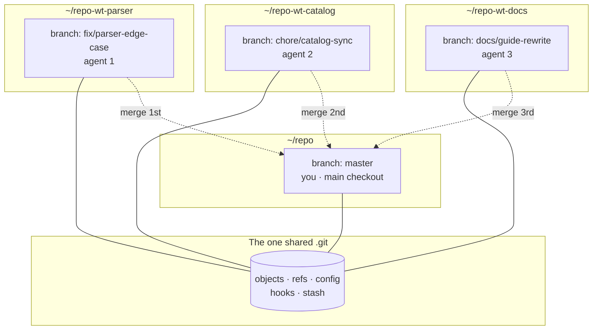

##### Setting It Up

```bash
cd ~/repo
git worktree add ../repo-wt-parser  -b fix/parser-edge-case master
git worktree add ../repo-wt-catalog -b chore/catalog-sync   master
git worktree add ../repo-wt-docs    -b docs/guide-rewrite   master

# Each tree needs its own installed dependencies - this is the expensive part.
cd ../repo-wt-parser && uv sync
```

The flat sibling layout matters. Keep worktrees *next to* the repository, never nested inside it,
or you will eventually commit one.

##### What the Output Looks Like

Three directories on disk, three local branches visible from every checkout, and one shared history.
From your main checkout, `git log --oneline --all --graph` shows all three lines of work at once -
which is the concrete benefit Mode 4 gives up.

```
~/
├── repo/               master                 (you)
├── repo-wt-parser/     fix/parser-edge-case   + .venv  1.5 GB
├── repo-wt-catalog/    chore/catalog-sync     + .venv  1.5 GB
└── repo-wt-docs/       docs/guide-rewrite
```

##### How the Merge Works

Sequential integration, ordered from most foundational to most dependent:

```bash
# 1. Pre-flight: detect overlap before merging anything.
for b in fix/parser-edge-case chore/catalog-sync docs/guide-rewrite; do
  echo "== $b"; git merge-tree $(git merge-base master $b) master $b | grep -c '<<<<<<<' || true
done

# 2. Each branch rebases on master inside its own worktree, where the agent still has context.
cd ../repo-wt-parser && git rebase master

# 3. Merge one at a time, running tests between each.
cd ~/repo
git merge --no-ff fix/parser-edge-case && uv run pytest tests/parser -q
git merge --no-ff chore/catalog-sync   && uv run pytest tests/ -q
git merge --no-ff docs/guide-rewrite

# 4. Clean up immediately.
rm -rf ../repo-wt-parser && git worktree prune
```

Merging one at a time is what makes a red suite attributable. Merge all three and then run the tests,
and you have three suspects and no information.

##### What Can Conflict

| Conflict Class | Why It Happens Here | Remedy |
| -------------- | ------------------- | ------ |
| **Textual conflict on shared source** | Two agents edit the same utility or serializer | Q1 of the selection algorithm; `git merge-tree` before launching |
| **Structural conflict** (add/add, modify/delete) | Two agents create the same new file, or one deletes what another edits | About 42% of real agent conflicts are this class; Git cannot auto-resolve - resolve by intent, not by hunk |
| **Migration leaf collision** | Two branches each add `00XX_…` with the same number | Assign migrations to exactly one branch |
| **Lockfile conflict** | Two branches change the Python or JavaScript lockfile | One designated owner branch; others regenerate after merge |
| **Semantic conflict** | Both branches merge cleanly and the result is broken - agent A renamed a helper, agent B added a caller | Only tests catch this; run the suite after *each* merge |
| **Shared-`.git` interference** | An agent writes `.git/hooks/pre-commit`, `.git/config`, or drops a stash entry, affecting your main checkout | Not solvable within this mode - see [Mode 4](#mode-4---clone-fan-out) |
| **Branch checkout collision** | Two worktrees want the same branch | Git refuses; use `--detach` only if you know why |

##### Rules

1. **Flat sibling layout**, `../repo-wt-<slug>`. Never nested.
2. **One branch per worktree, named for the deliverable**, so `git branch` is a task list.
3. **Run `git merge-tree` before launching**, not before merging. The point is to spend zero tokens on
   a partition that was wrong.
4. **Rebase inside the worktree**, where the agent that wrote the code can resolve conflicts with
   context. Never rebase an agent's branch from your main checkout.
5. **Merge one at a time, test between each.**
6. **Assign an owner for shared-by-nature files**: lockfiles, `CHANGELOG.md`, the agent instruction
   files, migration leaves. One branch may touch each; the others ask.
7. **Clean up on merge.** `rm -rf` plus `git worktree prune` is faster than `git worktree remove`.
8. **Trust boundary:** only use this mode with agents you supervise. See Mode 4 for why.

##### Cost

| Dimension | Value |
| --------- | ----- |
| Setup time | ~1 s per worktree, plus the dependency install |
| Disk | ~1.5 GB per tree with a virtual environment, ~2.9 GB if frontend work is involved |
| Isolation strength | **Working tree only.** Config, hooks and stash remain shared |
| Review load | One diff per branch |
| Practical ceiling | 8–10 by general consensus; 3–4 in practice, bounded by disk and review |

##### Ready-to-Use Prompts

**You run this first**, in your own terminal - the agents are launched into trees that already exist:

```bash
cd {{REPO}}
git worktree add ../repo-wt-1 -b {{BRANCH_1}} {{BASE}}
git worktree add ../repo-wt-2 -b {{BRANCH_2}} {{BASE}}
# … one per agent, then install dependencies in each
```

**Sessions 1 to {{N}} - the workers.** One prompt per agent, launched in its own worktree. The
prohibitions in the "shared repository" section are what make this mode survivable: everything in that
list would reach into your main checkout.

```text
You are agent 1 of {{N}} working in parallel on the same repository. Each of us has a separate
working directory and a separate branch, and we are all running at the same time.

YOUR ENVIRONMENT
Working directory: ~/repo-wt-1
Your branch: {{BRANCH_1}} (already created and checked out for you)

Verify before doing anything else, and stop if any of it is wrong:
  pwd                        # must be ~/repo-wt-1, NOT {{REPO}}
  git branch --show-current  # must be {{BRANCH_1}}
  git status                 # must be clean

YOUR TASK
{{TASK_1}}

YOUR WRITE DOMAIN - you may create and edit files here and nowhere else:
{{DOMAIN_1}}

The other agents own {{OTHER_DOMAINS}} right now, in their own directories. If your task
seems to need a change there, STOP and report it. Do not make the change: they are editing
those files as you work, and one of us will lose the edit.

THIS IS A WORKTREE - READ THIS TWICE
Your directory has its own files and its own branch, but it SHARES one .git with my main
checkout and with every other agent. That means these commands would affect me and everyone
else, not just you, and they are therefore forbidden:
  - git config (anything that writes)
  - writing or installing anything under .git/hooks
  - git stash, git stash pop  (the stash is shared - you would take someone else's work)
  - git worktree add/remove, git branch -D, deleting or renaming anyone's branch
  - git gc, git prune, git repack
If you think you need any of them, stop and ask me.

ALSO FORBIDDEN, FOR ALL AGENTS
  - git commit --no-verify, and any other way of skipping the hooks. If the hooks are slow or
    failing, tell me - do not bypass them. In a repository without CI they are the only gate
    anything passes through, secret scanning included.
  - Repository-wide formatters or lint --fix. They rewrite other agents' files and turn a
    clean split into a repository-wide diff.
  - Editing {{SHARED_FILES}} - those are mine for this batch. Ask and I will make the edit.
  - git merge, git rebase, git push, or switching to {{BASE}}. Integration is mine.

HOW TO WORK
Commit early and often on your own branch, with real messages. Small commits are how I
attribute a failure later, and how you recover if you go wrong.

DEFINITION OF DONE
  1. {{TEST_CMD_1}} passes.
  2. git status is clean - everything committed.
  3. Every file you touched is inside {{DOMAIN_1}}. Verify it yourself and paste the output:
       git diff --name-only {{BASE}}...{{BRANCH_1}}
  4. Do NOT merge, rebase or push. Leave the branch where it is.

FINAL REPORT - tell me:
  - Branch name and commit count.
  - The exact list of files you changed.
  - The test command you ran and its result.
  - Anything you could not do, and anything you had to touch outside your domain (if the
    answer is not "nothing", say so plainly - I need to know before I merge).
```

**Final session - integration.** Run this once every agent has reported. You can paste it into a fresh
agent session, or simply follow it yourself; it is written so either works.

```text
{{N}} agents have finished working in parallel worktrees. Integrate their branches into
{{BASE}}, one at a time, and tear the fan-out down. Work in {{REPO}}.

The branches are: {{BRANCH_1}}, {{BRANCH_2}}, … in their trees ~/repo-wt-1, ~/repo-wt-2, …

STEP 1 - Check for overlap BEFORE merging anything. Run this once per branch, substituting
each branch name for BR:
  cd {{REPO}}
  BR={{BRANCH_1}}
  git merge-tree $(git merge-base {{BASE}} $BR) {{BASE}} $BR | grep -c '<<<<<<<'
A count of 0 is a clean merge. If any branch is not 0, stop and report which ones collide and
on which files - do not start merging and hope.

STEP 2 - Rebase each branch INSIDE ITS OWN WORKTREE, never from here:
  cd ~/repo-wt-1 && git rebase {{BASE}}
If a rebase conflicts, stop and tell me which branch. The agent that wrote that code is the
one who should resolve it, and it can only do so in its own tree.

STEP 3 - Merge one at a time, running that branch's tests after each merge:
  cd {{REPO}}
  git merge --no-ff {{BRANCH_1}} && {{TEST_CMD_1}}
  git merge --no-ff {{BRANCH_2}} && {{TEST_CMD_2}}
Never merge two branches and then test. If the suite goes red after a merge, STOP: do not
merge the next branch. Report which merge broke it. The whole point of merging one at a time
is that a failure has exactly one suspect.

STEP 4 - Only after every branch is merged and the full suite is green, tear down:
  git worktree remove ~/repo-wt-1   (or: rm -rf ~/repo-wt-1 && git worktree prune)
  git branch -d {{BRANCH_1}}
  git worktree list                 # confirm nothing is left behind

REPORT: the merge order you used, the test result after each merge, any conflict you hit and
how it was resolved, and confirmation that no worktree or merged branch remains.
```

---

#### Mode 4 - Clone Fan-Out

**One-line:** `git clone --shared` per agent - identical ergonomics to Mode 3, with a real boundary.

##### When You Need It

Exactly the situations that call for Mode 3, plus any of these: the agent runs with reduced
supervision, the repository's Git hooks execute meaningful code, or you would rather not have to
think about the trust question at all.

*Real use case.* The same three maintenance tasks as Mode 3 - but with Git hooks that execute real
programs on your machine, which is the normal case: linters, secret scanners, formatters, test
routers. In Mode 3, every agent shares `.git/hooks` with your main checkout. An agent that writes a
hook there has arranged for code to run as you, in your primary tree, the next time you commit. That
is not a hypothetical capability; it is an ordinary file write to a path the agent can already
reach.

Trigger conditions:

* Any task you would have given a worktree, unless you specifically need shared refs.
* Unattended or long-running agents.
* Anything where you would not want a stray `git config user.email` to follow you home.

##### The Method

`git clone --shared` (or `--reference`) creates a genuine, separate repository whose objects are
borrowed from the source via `.git/objects/info/alternates`. Only the object store is shared.
Everything else - refs, config, hooks, stash, index, working tree - is the clone's own.

Measured side by side by Fletch, on one repository - the absolute figures will differ on yours, the
ratio will not:

| | Worktree | `--shared` Clone |
| --- | --- | --- |
| Creation time | 826 ms | 870 ms |
| Disk | 58.7 MB | 58.9 MB |
| Shares refs and branches | Yes | No |
| Shares `.git/config` | **Yes** | No |
| Shares `.git/hooks` | **Yes** | No |
| Shares the stash | **Yes** | No |

You pay 44 milliseconds and 200 kilobytes for a boundary that actually holds. The one thing you give
up is cross-visibility: `git branch` in your main checkout will not list the agents' branches until
you fetch them.

##### Diagram

```mermaid
flowchart TD
    MAIN[("~/repo/.git<br/>objects · refs · config · hooks · stash")]
    subgraph C1["~/agents/parser"]
      R1["its own .git<br/>own refs · own config<br/>own hooks · own stash"]
    end
    subgraph C2["~/agents/catalog"]
      R2["its own .git<br/>own refs · own config<br/>own hooks · own stash"]
    end
    MAIN -.->|"objects only<br/>via alternates"| R1
    MAIN -.->|"objects only<br/>via alternates"| R2
    R1 ==>|"git fetch ../agents/parser"| MAIN
    R2 ==>|"git fetch ../agents/catalog"| MAIN
```

##### Setting It Up

```bash
mkdir -p ~/agents
git clone --shared ~/repo ~/agents/parser
cd ~/agents/parser && git switch -c fix/parser-edge-case && uv sync
```

To harden further, do not install the hooks in the agent clone at all - let the agent write code and
run the formatters explicitly, and let the *merge* into your main checkout be the moment the hooks run.

##### What the Output Looks Like

Separate repositories under `~/agents/`, each with its own branch that your main checkout cannot see
until you fetch it. The agent's `.git/hooks` is its own; anything it writes there affects only itself.

##### How the Merge Works

One extra step compared with Mode 3 - you fetch before you merge:

```bash
cd ~/repo
git fetch ~/agents/parser fix/parser-edge-case:fix/parser-edge-case
git merge-tree $(git merge-base master fix/parser-edge-case) master fix/parser-edge-case | grep -c '<<<<<<<'
git merge --no-ff fix/parser-edge-case && uv run pytest tests/parser -q
rm -rf ~/agents/parser
```

The fetch is also a checkpoint: the branch enters your repository only when you deliberately import
it, which is a better default than a branch appearing in `git branch` because an agent typed
`git switch -c`.

##### What Can Conflict

Every conflict class from Mode 3 applies unchanged, **except** the shared-`.git` row, which this mode
eliminates. Two additions specific to clones:

| Conflict Class | Why It Happens Here | Remedy |
| -------------- | ------------------- | ------ |
| **Forgotten fetch** | You merge a stale copy of the agent's branch, or cannot find it at all | Fetch immediately when the agent reports done; script it |
| **Alternates breakage** | The source repository is garbage-collected or moved while clones still borrow its objects | Do not `git gc --prune` the source while clones are live; `git repack -a` in the clone before deleting the source |
| Shared-`.git` interference | - | **Eliminated by this mode** |

##### Rules

1. **Prefer this mode over Mode 3 by default.** Same cost, stronger boundary.
2. **Never `git gc --prune=now` the source repository while clones are live.** Alternates are a
   borrow, not a copy.
3. **Fetch on completion**, not at merge time, so the work is safe in your repository before you
   delete the clone.
4. **Mode 3's rules 3, 4, 5, 6 and 7 apply unchanged** - merge-tree pre-flight, rebase inside the
   agent's own tree, merge one at a time, one owner per shared file, clean up on merge.
5. **Choose Mode 3 instead only when cross-visibility is the point** - for example when you want to
   `git log --all --graph` across every agent from one place.

##### Cost

| Dimension | Value |
| --------- | ----- |
| Setup time | ~870 ms per clone, plus the dependency install |
| Disk | Same as Mode 3; objects are borrowed, files are copied |
| Isolation strength | **Full Git isolation.** Only the object store is shared |
| Review load | One diff per branch, plus a fetch |
| Practical ceiling | Same as Mode 3, bounded by disk and review capacity |

##### Ready-to-Use Prompts

**You run this first**, one clone per agent:

```bash
mkdir -p ~/agents
git clone --shared {{REPO}} {{WORKDIR_1}}
cd {{WORKDIR_1}} && git switch -c {{BRANCH_1}} {{BASE}} && uv sync
# … repeat per agent
```

**Sessions 1 to {{N}} - the workers.** Compared with Mode 3's prompt, the whole "shared repository"
warning block disappears: the agent has its own `.git`, so it cannot reach yours. What it gains instead
is a hand-back step, because its branch lives in a repository you cannot see.

```text
You are agent 1 of {{N}} working in parallel on the same project. Each of us has our own
complete clone of the repository and our own branch. We are all running at the same time.

YOUR ENVIRONMENT
Working directory: {{WORKDIR_1}}
Your branch: {{BRANCH_1}} (already created and checked out)
This is a SEPARATE repository, cloned from {{REPO}}. Nothing you do here touches my checkout
or the other agents', which is why you have a free hand with your own Git state.

Verify before starting, and stop if any of it is wrong:
  pwd                        # must be {{WORKDIR_1}}
  git branch --show-current  # must be {{BRANCH_1}}
  git status                 # must be clean

YOUR TASK
{{TASK_1}}

YOUR WRITE DOMAIN - you may create and edit files here and nowhere else:
{{DOMAIN_1}}

The other agents own {{OTHER_DOMAINS}} in their own clones, right now. Your changes and
theirs must merge cleanly at the end, and they will only do so if we each stay inside our own
paths. If your task appears to need a change in their domain, STOP and report it to me rather
than making it - I will decide whether to hand it to them or to serialise the work.

FORBIDDEN
  - git commit --no-verify, and any other way of skipping the hooks. If a hook fails, fix the
    cause or tell me; never bypass it. Without CI the hooks are the only gate this code passes.
  - Editing {{SHARED_FILES}}. Those are mine for this batch: they are regenerated wholesale or
    read by every agent, so concurrent edits are unresolvable. Ask me and I will make the edit.
  - Repository-wide formatters or lint --fix - they would rewrite files I will later merge from
    another agent, turning a clean split into a repository-wide diff.
  - git push, git merge, git rebase onto anything, or switching to {{BASE}}.
  - Deleting or garbage-collecting anything: this clone borrows its objects from {{REPO}} and
    "cleaning up" can break the borrow. No git gc, no git prune, no git repack.

HOW TO WORK
Commit early and often on your own branch, with real messages. If you go wrong, git reflog in
THIS clone will save you - your history is entirely your own.

DEFINITION OF DONE
  1. {{TEST_CMD_1}} passes.
  2. git status is clean - everything committed. Anything uncommitted when you stop is lost:
     I will pull your branch out of this clone by name and then delete the directory.
  3. Every file you touched is inside {{DOMAIN_1}}. Verify and paste the output:
       git diff --name-only {{BASE}}...{{BRANCH_1}}
  4. Print, as the last line of your report, the exact command I need to import your work:
       git fetch {{WORKDIR_1}} {{BRANCH_1}}:{{BRANCH_1}}

FINAL REPORT - tell me:
  - Branch name and commit count.
  - The exact list of files you changed.
  - The test command you ran and its result.
  - Anything you could not do, and anything you touched outside your domain.
  - The import command from point 4.
```

**Final session - integration.** The fetch is the step Mode 3 does not have, and it is the step people
forget: until it runs, the work exists only inside a directory you are about to delete.

```text
{{N}} agents have finished working in separate clones. Import their branches, merge them into
{{BASE}} one at a time, and tear the fan-out down. Work in {{REPO}}.

The agents are:
  {{WORKDIR_1}} -> {{BRANCH_1}}, tested with {{TEST_CMD_1}}
  {{WORKDIR_2}} -> {{BRANCH_2}}, tested with {{TEST_CMD_2}}
  …

STEP 1 - Rebase each branch inside its OWN clone, where the agent's context was:
  cd {{WORKDIR_1}}
  git fetch origin {{BASE}}:{{BASE}}
  git rebase {{BASE}}
If a rebase conflicts, stop and tell me which clone. Do not resolve it from {{REPO}}.

STEP 2 - Import every branch into {{REPO}}. Do this for ALL agents before merging any of them,
so that no work is left sitting in a directory we are about to delete:
  cd {{REPO}}
  git fetch {{WORKDIR_1}} {{BRANCH_1}}:{{BRANCH_1}}
  git fetch {{WORKDIR_2}} {{BRANCH_2}}:{{BRANCH_2}}
Then confirm they all arrived:
  git branch --list '{{BRANCH_1}}' '{{BRANCH_2}}'

STEP 3 - Check for overlap before merging anything. Once per branch, substituting each branch
name for BR:
  BR={{BRANCH_1}}
  git merge-tree $(git merge-base {{BASE}} $BR) {{BASE}} $BR | grep -c '<<<<<<<'
0 means clean. If any branch is not 0, stop and report which branches collide and on which
files.

STEP 4 - Merge one at a time, testing after each:
  git merge --no-ff {{BRANCH_1}} && {{TEST_CMD_1}}
  git merge --no-ff {{BRANCH_2}} && {{TEST_CMD_2}}
If the suite goes red, STOP - do not merge the next branch. Report which merge broke it.

STEP 5 - Only once everything is merged and green, delete the clones:
  rm -rf {{WORKDIR_1}} {{WORKDIR_2}}
  git branch -d {{BRANCH_1}} {{BRANCH_2}}
Never run git gc --prune in {{REPO}} while any clone still exists - the clones borrow objects
from it and pruning can break them.

REPORT: the merge order, the test result after each merge, any conflicts and their resolution,
and confirmation that every branch was imported before any directory was deleted.
```

---

#### Mode 5 - Converging Fan-Out

**One-line:** several isolated trees, several working branches, one destination branch and one pull
request.

##### When You Need It

The work is *one* deliverable - it would be broken or unreviewable if split into separate pull
requests - but its parts touch disjoint file paths and are large enough to deserve isolation.

*Real use case.* A new reports panel. The backend side adds a serializer, a view action and API tests
under `api/reports/`. The frontend side adds a component, a data-fetching action and unit tests under
`web/app/reports/`. Neither half makes sense alone: merging the backend without the frontend ships an
endpoint nobody calls, and merging the frontend without the backend ships a component that 404s. But
the file sets never intersect, and each half is a full session's work.

Trigger conditions:

* One deliverable, disjoint paths - question Q7 of the selection algorithm.
* The parts are big enough that a shared directory would mean constant serialisation.
* Duplicating the environment is affordable. If it is not, use [Mode 8](#mode-8---virtual-branches) instead.

##### The Method

Git will not let two trees check out the same branch, so "parallel agents on one feature branch" is
not literally possible. The workable shape is a fan-out that *converges*: each agent works on a
private sub-branch in its own tree, and you merge the sub-branches into a single integration branch
locally. Only the integration branch is ever pushed or reviewed.

The critical sequencing step is **contract-first**. Before any fan-out, you land the shared interface
- the TypeScript type, the serializer field list, the endpoint shape - as one commit on the
integration branch. Both agents branch *from that commit* and treat the contract as read-only.

```
master
  └── feat/reports-panel           ← integration branch; contract commit lands here first
        ├── feat/reports-panel-api  ← agent 1, own tree
        └── feat/reports-panel-web  ← agent 2, own tree
```

##### Diagram

```mermaid
%%{init: {'gitGraph': {'mainBranchName': 'master'}}}%%
gitGraph
    commit id: "initial"
    branch feat/reports-panel
    commit id: "contract: types + schema"
    branch feat/reports-panel-api
    commit id: "serializer"
    commit id: "view action + tests"
    checkout feat/reports-panel
    branch feat/reports-panel-web
    commit id: "component"
    commit id: "action + unit tests"
    checkout feat/reports-panel
    merge feat/reports-panel-api
    merge feat/reports-panel-web
    commit id: "integration test"
    checkout master
    merge feat/reports-panel
```

##### Setting It Up

```bash
# 1. Contract first, on the integration branch, by you or one agent - alone.
git switch -c feat/reports-panel master
$EDITOR web/types/reports.ts        # the shared shape
git commit -am "feat(reports): define the panel payload contract"

# 2. Fan out from the contract commit, one isolated tree each.
git clone --shared . ~/agents/panel-api
git clone --shared . ~/agents/panel-web
cd ~/agents/panel-api && git switch -c feat/reports-panel-api feat/reports-panel && uv sync
cd ~/agents/panel-web && git switch -c feat/reports-panel-web feat/reports-panel && pnpm install
```

Give each agent an explicit write domain in its prompt: *"You own `api/reports/` and its tests.
`web/types/reports.ts` is read-only - if it is wrong, stop and report."*

##### What the Output Looks Like

Two sub-branches that were never pushed, one integration branch that carries the whole feature, and a
single pull request. A reviewer sees one coherent change: contract, then both implementations of it.

##### How the Merge Works

Two merges, inward, then one merge outward:

```bash
cd ~/repo
git switch feat/reports-panel
git fetch ~/agents/panel-api feat/reports-panel-api:feat/reports-panel-api
git fetch ~/agents/panel-web feat/reports-panel-web:feat/reports-panel-web

git merge --no-ff feat/reports-panel-api    # backend first: it defines the runtime behaviour
cd api && uv run pytest reports/tests -q && cd ..

git merge --no-ff feat/reports-panel-web    # frontend second: it consumes that behaviour
cd web && pnpm vitest run app/reports && cd ..

# The integration test that neither agent could write, because neither saw both halves.
git commit -am "test(reports): cover the panel end to end"
git branch -d feat/reports-panel-api feat/reports-panel-web
```

Merge the *producer* before the *consumer*. If the frontend lands first, its tests exercise a contract
with no implementation behind it and the failures are meaningless.

##### What Can Conflict

| Conflict Class | Why It Happens Here | Remedy |
| -------------- | ------------------- | ------ |
| **Contract drift** | An agent decided the contract was wrong and edited it anyway | Make the contract read-only in the prompt, and diff it after every merge: `git diff feat/reports-panel -- web/types/reports.ts` |
| **Semantic mismatch** | Both halves merge cleanly; the frontend expects `camelCase`, the serializer emits `snake_case` | The end-to-end test in the final commit exists for exactly this. Never skip it |
| **Test-file collision** | Both agents add cases to a shared test module | Assign test files to domains along with source files |
| **Import of the other half** | The frontend agent imports a backend helper that does not exist on its branch | Forbid cross-domain imports in the prompt; the contract file is the only shared surface |
| **Barrel or index churn** | Both agents edit a shared `index.ts` or `__init__.py` re-export | Orchestrator-only: you make those edits after both merges |
| Textual conflict on source | Should be impossible if the partition was clean; if it happens, the partition was wrong | Do not fix it by hand - repartition and re-run |

##### Rules

1. **Contract first, always, and alone.** No fan-out until the shared interface is committed.
2. **The contract file is read-only for every agent.** An agent that wants it changed reports and stops.
3. **Declare write domains by path in the prompt**, not by intention.
4. **Merge producer before consumer**, and run that side's tests before the next merge.
5. **You write the end-to-end test**, after both halves are in. Neither agent can, and that gap is
   precisely where the bugs are.
6. **Sub-branches are never pushed.** Only the integration branch is a review unit.

##### Cost

| Dimension | Value |
| --------- | ----- |
| Setup time | Contract commit, plus one clone per agent |
| Disk | Full per-tree cost, up to ~2.9 GB each with both toolchains |
| Isolation strength | Full, per agent |
| Review load | **One** pull request - the mode's main advantage |
| Practical ceiling | 2–3 agents; more than that and the contract is too big to be one deliverable |

##### Ready-to-Use Prompts

Extra placeholders: `{{INTEGRATION}}`, the branch both halves land on, and `{{CONTRACT}}`, the file
that defines the shared shape.

Four sessions, and the **order is not optional**: the contract session must finish and commit before
the other two are launched.

**Session 1 - the contract.** Alone. Nothing else runs while this session is live.

```text
You are writing the contract for a feature that two other agents will then build in parallel,
one on each side of it. They will start from your commit and will not be allowed to change
what you write. Neither of them will see the other's code.

THE FEATURE
{{TASK_1}}

FIRST
  cd {{REPO}}
  git switch -c {{INTEGRATION}} {{BASE}}

YOUR JOB - define the interface between the two halves, and nothing else.
Write {{CONTRACT}} containing the exact shared shape: every field, its type, whether it is
optional, the naming convention, the error cases, and the endpoint or function signature.

Rules for this file:
  - Be exhaustive and be specific. Anything you leave ambiguous becomes two different guesses
    tomorrow, one on each side, and they will merge cleanly and be broken. That failure is
    silent - no conflict, no error, just a feature that does not work.
  - Decide the awkward things now: casing, null versus absent, date format, pagination,
    what an empty result looks like, what an error looks like.
  - Add a short comment at the top saying this file is the contract for {{INTEGRATION}} and
    must not be edited by the implementation agents.
  - Do NOT implement either side. No serializer, no component, no tests beyond a type check.

FINISH BY
  git add {{CONTRACT}} && git commit -m "feat: define the {{INTEGRATION}} contract"
  git rev-parse --short HEAD

Report the commit hash and paste the contract. I will not launch the other two agents until
this is committed.
```

**Sessions 2 and 3 - the two halves.** Launched only after session 1 commits. Same template, one per
side.

```text
You are agent 1 of 2 building one feature in parallel. We are each writing one half of it, in
separate clones, at the same time. Your half and the other half must fit together at the end
with no conversation between us, which is why the contract below exists.

YOUR ENVIRONMENT
Working directory: {{WORKDIR_1}}
Your branch: {{BRANCH_1}}, already branched from {{INTEGRATION}} - which contains the contract
commit. Verify:
  pwd && git branch --show-current && git status
  git log --oneline -1        # must be the contract commit

THE FEATURE, IN FULL
{{TASK_1}}

YOUR HALF
{{DOMAIN_1}} - you own these paths and may write only here.

THE OTHER AGENT is building {{OTHER_DOMAINS}} right now. You will never see their code, and
they will never see yours. Do not import from their paths, do not stub their work, do not
"helpfully" add a small thing on their side. If you believe their half is wrong or missing
something, report it to me - I am the only one who can talk to both of you.

THE CONTRACT - {{CONTRACT}} - IS READ-ONLY
Read it first. Build exactly to it: same field names, same casing, same optionality, same
error shape. You may not edit it, not even to fix something you are sure is wrong. If it IS
wrong, STOP IMMEDIATELY, do not work around it, and report the problem to me. A contract that
gets edited on one side is the single failure this whole mode exists to prevent: both halves
would merge cleanly and the feature would not work.

Before you finish, prove you did not touch it:
  git diff --name-only {{INTEGRATION}}...{{BRANCH_1}} | grep -F "{{CONTRACT}}" && echo VIOLATION

FORBIDDEN
  - git commit --no-verify, or any other way of skipping the hooks.
  - Editing {{CONTRACT}} or anything in {{OTHER_DOMAINS}}.
  - Editing {{SHARED_FILES}} - mine for this batch.
  - Repository-wide formatters or lint --fix.
  - git merge, git rebase, git push, switching branches.
  - Writing the end-to-end test that spans both halves. Neither of us can: we each see only
    one side. I write it after both halves land, and it is where the real bugs surface.

DEFINITION OF DONE
  1. Your half is complete against the contract, with its own tests.
  2. {{TEST_CMD_1}} passes.
  3. git status clean, everything committed.
  4. The grep above prints nothing.
  5. Report the import command: git fetch {{WORKDIR_1}} {{BRANCH_1}}:{{BRANCH_1}}

FINAL REPORT: files changed, tests run and their result, every assumption you made that the
contract did not explicitly settle (list these carefully - each one is a place the two halves
may disagree), and anything you could not build.
```

**Session 4 - integration.** This session also writes the test neither agent could.

```text
Two agents have built the two halves of one feature in parallel, against a shared contract.
Integrate them into a single reviewable branch. Work in {{REPO}}.

  Producer half (defines the runtime behaviour): {{WORKDIR_1}} -> {{BRANCH_1}}
  Consumer half (uses that behaviour):           {{WORKDIR_2}} -> {{BRANCH_2}}
  Integration branch: {{INTEGRATION}}   Contract: {{CONTRACT}}

STEP 1 - Import both branches before touching anything:
  cd {{REPO}} && git switch {{INTEGRATION}}
  git fetch {{WORKDIR_1}} {{BRANCH_1}}:{{BRANCH_1}}
  git fetch {{WORKDIR_2}} {{BRANCH_2}}:{{BRANCH_2}}

STEP 2 - Verify neither agent edited the contract. This is the first thing to check, because
if one of them did, everything downstream is suspect:
  git diff {{INTEGRATION}} {{BRANCH_1}} -- {{CONTRACT}}
  git diff {{INTEGRATION}} {{BRANCH_2}} -- {{CONTRACT}}
Both must be empty. If either is not, STOP and show me the diff.

STEP 3 - Merge the producer FIRST, then its tests, then the consumer:
  git merge --no-ff {{BRANCH_1}} && {{TEST_CMD_1}}
  git merge --no-ff {{BRANCH_2}} && {{TEST_CMD_2}}
The order matters: if the consumer lands first, its tests exercise a contract with no
implementation behind it and the failures tell you nothing.

STEP 4 - Write the end-to-end test that neither agent could write, because neither saw both
halves. Exercise the real path across the seam: the consumer calls the producer for real, and
you assert on the result. Look specifically for the mismatches a clean merge hides - casing,
null versus absent, date format, error shape, empty results.
  git add -A && git commit -m "test: cover {{INTEGRATION}} end to end"

STEP 5 - Tear down. The two sub-branches are private scaffolding and are never pushed:
  git branch -d {{BRANCH_1}} {{BRANCH_2}}
  rm -rf {{WORKDIR_1}} {{WORKDIR_2}}

The reviewable unit is {{INTEGRATION}} alone: contract first, then both implementations of it,
then the end-to-end test.

REPORT: contract-diff results, merge order, test results, and every seam mismatch your
end-to-end test caught - those are the ones that would have shipped.
```

---

#### Mode 6 - Copy-on-Write Workspaces

**One-line:** a modifier, not a standalone mode - clone the tree *including its dependencies* in about
a second, at near-zero disk.

##### How This Differs From Modes 3, 4 and 5

Those modes and this one answer completely different questions, which is why this one never replaces
them.

| The question | Answered by |
| ------------ | ----------- |
| Where does each agent's work live, and how does it come back together in Git? | Modes 3, 4, 5, 7, 8 - **pick exactly one** |
| How does that folder physically get created on the disk? | **Mode 6** - optional, layered underneath whichever you picked |

[Mode 5](#mode-5---converging-fan-out) is a *branch topology*: several trees, several sub-branches, one
destination branch, one pull request. This mode says nothing about branches at all. Put side by side,
running Mode 5 with and without it:

| | Mode 5 alone | Mode 5 **+ Mode 6** |
| --- | --- | --- |
| Number of trees | 2 | 2 |
| Branch layout | contract, two sub-branches, one integration branch | **identical** |
| How the merge works | fetch, merge producer, merge consumer | **identical** |
| What `git status` shows | normal | **identical** |
| Creating each tree | clone plus a dependency install: minutes, ~1.5 GB each | overlay mount on a pre-installed base: **~1 second, ~0 bytes** |
| Tearing each tree down | `rm -rf` | `umount`, then `rm -rf` - **and an unmount destroys anything uncommitted** |

Only the last two rows change. Everything an agent does, and everything Git sees, is the same. That is
the whole mode: it makes the tree you were going to create anyway cheap enough to create five of.

##### When You Need It

You have chosen Mode 3, 4 or 5, and the arithmetic stops you: each tree needs its own installed
dependencies - a 1.5 GB virtual environment, say, and a 1.4 GB `node_modules` if frontend work is
involved - and installing them costs minutes before the agent writes a line.

*Real use case.* You want four concurrent agents on backend tasks. Four dependency installs is roughly
six gigabytes and several minutes of nothing happening. With a copy-on-write workspace, each tree is a
snapshot of an already-installed tree: the `.venv` is there, complete, in about a second, and consumes
disk only for the files an agent actually modifies - which for a virtual environment is approximately
none.

Trigger conditions:

* Three or more concurrent trees.
* Heavy, rarely-modified dependency directories: `.venv`, `node_modules`, build caches.
* Disk or setup latency is what is actually limiting your parallelism.

##### The Method

Copy-on-write means the clone shares physical blocks with the original until something writes, at
which point only the changed blocks diverge. Three mechanisms, in order of preference:

| Mechanism | Requirement | Notes |
| --------- | ----------- | ----- |
| `cp --reflink=always` | btrfs or XFS | Simplest; per-file cloning |
| `btrfs subvolume snapshot` | btrfs | Snapshots a whole workspace root instantly |
| **`mount -t overlay`** | `overlay` in `/proc/filesystems` | Works on ext4; a read-only lower layer plus a per-agent upper layer |

Check what your filesystem supports before planning around it. On ext4 - still the common default on
Linux - `cp --reflink=always` fails with *"Operation not supported"*, while overlay is generally
available, so overlayfs is the usual route. A btrfs loop file is the alternative if you want snapshots
as well.

##### Diagram

```mermaid
flowchart TD
    LOWER[("lowerdir<br/>pristine tree + .venv + node_modules<br/>read-only, one physical copy")]
    subgraph A1["Agent 1 workspace"]
      U1["upperdir 1<br/>only what agent 1 wrote"]
    end
    subgraph A2["Agent 2 workspace"]
      U2["upperdir 2<br/>only what agent 2 wrote"]
    end
    subgraph A3["Agent 3 workspace"]
      U3["upperdir 3<br/>only what agent 3 wrote"]
    end
    LOWER --> U1
    LOWER --> U2
    LOWER --> U3
    U1 --> M1["merged mount<br/>looks like a full tree"]
    U2 --> M2["merged mount"]
    U3 --> M3["merged mount"]
```

##### Setting It Up

Prepare one fully-installed reference tree, then overlay per agent:

```bash
# One-time: a pristine, fully installed reference.
git clone --shared ~/repo ~/agents/base
cd ~/agents/base && uv sync && (cd web && pnpm install)

# Per agent: a workspace that starts complete, in about a second.
for i in 1 2 3; do
  mkdir -p ~/agents/w$i/{upper,work,merged}
  sudo mount -t overlay overlay \
    -o lowerdir=$HOME/agents/base,upperdir=$HOME/agents/w$i/upper,workdir=$HOME/agents/w$i/work \
    $HOME/agents/w$i/merged
done
# Teardown
sudo umount ~/agents/w1/merged && rm -rf ~/agents/w1
```

Each `merged` directory is a complete, writable checkout with dependencies already present. Point one
agent at each.

##### What the Output Looks Like

Three apparently-full checkouts consuming the disk of one, plus the deltas. `du -sh ~/agents/w1/upper`
shows what an agent actually changed - a genuinely useful audit of the session's footprint.

##### How the Merge Works

Unchanged from the mode you layered this under. Copy-on-write alters where the bytes live, not what
Git sees. The one addition: **commit or fetch the work out before unmounting**, because the upper
layer disappears with the mount.

##### What Can Conflict

| Conflict Class | Why It Happens Here | Remedy |
| -------------- | ------------------- | ------ |
| **Work lost on teardown** | You unmount before extracting the commits | Fetch or push out of the workspace *first*; make it the last step of every agent's prompt |
| **Stale base** | The reference tree ages; agents start from an old `master` and old dependencies | Refresh the base and reinstall dependencies before each batch |
| **Dependency drift** | An agent reinstalls inside its overlay after editing the manifest, doubling the environment in its upper layer | Expected and correct; just count it in the disk budget |
| **Permissions** | `mount` needs privilege; overlay upper layers can confuse tools that follow inodes | Prefer btrfs subvolumes if you have them; keep the workspace off network filesystems |
| Git-level conflicts | Inherited from the underlying mode | See Modes 3, 4, 5 |

##### Rules

1. **This is a modifier.** It never decides your branch topology; it only makes the chosen one affordable.
2. **Extract before teardown.** An unmount is a delete.
3. **Rebuild the base per batch**, not per agent, so every agent in a run starts from the same `master`.
4. **Never overlay onto a live working tree.** The lower layer must be a pristine reference nobody edits.

##### Cost

| Dimension | Value |
| --------- | ----- |
| Setup time | ~1 s per workspace once the base exists |
| Disk | Near zero per workspace, plus one full base |
| Isolation strength | Inherited from the underlying mode |
| Review load | Unchanged |
| Practical ceiling | Raises the disk ceiling substantially; review remains the real limit |

##### Ready-to-Use Prompts

Extra placeholder: `{{WS_1}}`, this agent's workspace path - the `merged` directory of its overlay,
for example `~/agents/w1/merged`.

Because this mode is a layer rather than a way of working, its prompt is whichever mode you actually
chose, with the environment block swapped and one extra line in the definition of done. The complete
prompt below is the common case, **Mode 4 + Mode 6**: clone fan-out, on copy-on-write workspaces. If
you are running Mode 5, 9 or 10 instead, take their prompt and copy the two marked sections into it.

**You run this first**, once per batch:

```bash
# One-time base: a complete, installed tree that nobody edits.
git clone --shared {{REPO}} ~/agents/base
cd ~/agents/base && uv sync && (cd web && pnpm install)

# Per agent, in about a second each:
for i in 1 2 3; do
  mkdir -p ~/agents/w$i/{upper,work,merged}
  sudo mount -t overlay overlay \
    -o lowerdir=$HOME/agents/base,upperdir=$HOME/agents/w$i/upper,workdir=$HOME/agents/w$i/work \
    $HOME/agents/w$i/merged
  (cd $HOME/agents/w$i/merged && git switch -c {{BRANCH_1}} {{BASE}})
done
```

**Sessions 1 to {{N}} - the workers.** Complete and ready to paste:

```text
You are agent 1 of {{N}} working in parallel on the same project. Each of us has our own
workspace and our own branch, and we are all running at the same time.

>>> SECTION A - YOUR ENVIRONMENT (this is the part Mode 6 changes) <<<
Working directory: {{WS_1}}
Your branch: {{BRANCH_1}}, already created from {{BASE}}

Verify before doing anything else, and stop if any of it is wrong:
  pwd                        # must be {{WS_1}}
  git branch --show-current  # must be {{BRANCH_1}}
  git status                 # must be clean

This looks like an ordinary complete checkout with the dependencies already installed, and you
work in it normally. It is in fact a copy-on-write overlay: the files come from a shared
read-only base, and only what you write is stored separately. Two consequences follow, and
they are the only things about this setup you have to remember.

1. THIS DIRECTORY IS TEMPORARY AND WILL BE DESTROYED. When it is unmounted, everything not
   committed and handed back is gone - not in a trash folder, not in a stash, not recoverable
   by any means. An unmount is a delete.

2. DO NOT REINSTALL DEPENDENCIES unless the task genuinely changes a dependency. The
   environment is already complete. A reinstall copies the entire dependency directory into
   your private layer, which is precisely the cost this setup exists to avoid. If you truly
   need one, say so in your report - it changes my disk budget for the whole batch.
>>> END SECTION A <<<

YOUR TASK
{{TASK_1}}

YOUR WRITE DOMAIN - you may create and edit files here and nowhere else:
{{DOMAIN_1}}

The other agents own {{OTHER_DOMAINS}} in their own workspaces, right now. If your task
appears to need a change there, STOP and report it rather than making it - I will decide
whether to hand it to them or to serialise the work.

FORBIDDEN
  - git commit --no-verify, or any other way of skipping the hooks.
  - Editing {{SHARED_FILES}} - mine for this batch.
  - Repository-wide formatters or lint --fix.
  - git push, git merge, git rebase, or switching to {{BASE}}.
  - git gc, git prune, git repack - this workspace borrows objects and cleaning up breaks it.

DEFINITION OF DONE
  1. {{TEST_CMD_1}} passes.
  2. Every file you touched is inside {{DOMAIN_1}}. Verify and paste the output:
       git diff --name-only {{BASE}}...{{BRANCH_1}}

  >>> SECTION B - THE HAND-BACK (this is the other part Mode 6 changes) <<<
  3. YOUR LAST ACTION IS ALWAYS THE HAND-BACK - even if you are stopping early, even if the
     work is unfinished, even if the tests are failing:
       git add -A
       git commit -m "wip: {{BRANCH_1}}"     # a wip commit is fine; losing the work is not
       git bundle create /tmp/{{BRANCH_1}}.bundle {{BASE}}..{{BRANCH_1}}
     The bundle goes to /tmp deliberately: /tmp is on the real filesystem, outside the overlay,
     so it survives this directory being destroyed.
  4. Print the bundle path and confirm the work is safe to collect. If you cannot commit for
     any reason, say so immediately and loudly - do not keep working with uncommitted changes
     in a directory that is about to be deleted.
  >>> END SECTION B <<<

FINAL REPORT - tell me:
  - Branch name, commit count, and the bundle path.
  - The exact list of files you changed.
  - The test command you ran and its result.
  - Whether you had to reinstall any dependency.
  - Anything you could not do, and anything you touched outside your domain.
```

**Final session - collect, then destroy.** The order is the whole point: an unmount is irreversible.

```text
{{N}} agents worked in copy-on-write workspaces that are about to be destroyed. Collect every
branch FIRST, verify it is really in {{REPO}}, and only then tear the workspaces down. Work in
{{REPO}}.

  Agent 1: workspace {{WS_1}}, branch {{BRANCH_1}}, bundle /tmp/{{BRANCH_1}}.bundle
  Agent 2: …

STEP 1 - Collect from the bundles, which live outside the overlays and survive teardown:
  cd {{REPO}}
  git fetch /tmp/{{BRANCH_1}}.bundle {{BRANCH_1}}:{{BRANCH_1}}
If an agent never produced a bundle, fall back to fetching from its mount while it still
exists - this is the only chance to do so:
  git fetch {{WS_1}} {{BRANCH_1}}:{{BRANCH_1}}

STEP 2 - PROVE the work is here before destroying anything. For each branch:
  git log --oneline {{BASE}}..{{BRANCH_1}}
  git diff --stat {{BASE}}...{{BRANCH_1}}
Empty output means the work is NOT in this repository. Do not unmount anything: stop and tell
me which agent, while its workspace is still mounted and the work still recoverable.

STEP 3 - Optional but useful before teardown, this is exactly what each agent wrote and what
it cost in disk:
  du -sh ~/agents/w1/upper

STEP 4 - Only now, tear down:
  sudo umount {{WS_1}} && rm -rf ~/agents/w1

STEP 5 - Merge as the underlying mode dictates - for Mode 4, one branch at a time with tests
between each. Copy-on-write changes nothing about the merge.

REPORT: which branches were collected from bundles and which from mounts, the commit count
proved present for each before teardown, and confirmation that no workspace was unmounted
before its work was verified in {{REPO}}.
```

---

### Group C - One Tree, Many Branches

Both modes here keep a single working directory - one checkout, one set of installed dependencies,
one running development stack. They differ in whether the parallelism is in *time* (Mode 7 serialises writers)
or in *history* (Mode 8 routes changes to several branches at once).

#### Mode 7 - Orchestrated Team

**One-line:** one directory, one branch, several agents, and exactly one writer at any instant.

##### When You Need It

The tasks are too coupled to isolate and too small to justify a tree each, and the environment is
expensive enough that duplicating it is absurd.

*Real use case.* A refactor of the query sanitiser and its three call sites, plus the tests for all
four. Every piece reads the others; splitting into branches would mean four branches that each fail
their own tests until merged. What you want is one branch, one directory, and several agents that take
turns - one exploring the call graph while another writes, then swapping.

Trigger conditions:

* Tasks share files or share a rapidly-changing interface.
* The unit of work is smaller than the setup cost of a tree.
* You want the running dev stack, and you only have one.

##### The Method

This mode has no technical enforcement whatsoever. Git gives you no protection; the discipline is the
mechanism. Three rules carry it:

1. **Write domains.** Each agent owns a path prefix and may write nowhere else. Everything shared -
   lockfiles, migrations, package entry points, barrel exports, root config, the agent instruction
   files - is *orchestrator-only*, meaning you edit it, on request, between turns.
2. **Fan out reads, serialise writes.** Any number of agents may read at once. Exactly one may write.
3. **A commit lock.** Only one agent commits at a time, and no agent writes to the tree while a commit
   is in progress.

The third rule is not fussiness. Hook runners of the `pre-commit` family **stash unstaged changes,
rewrite staged files in place, and restore the stash**. If a second agent writes to the tree during
that window, you get *"stashed changes conflicted with changes made by hook"* and a manual recovery.
The staging index is a single shared mutable resource; treat committing as a critical section.

##### Diagram

```mermaid
sequenceDiagram
    participant You as Orchestrator
    participant A as Agent A · api/
    participant B as Agent B · tests/
    participant T as Working tree
    You->>A: write domain = api/search/sanitizer.py
    You->>B: write domain = api/search/tests/
    par Agent A reads
        A-->>T: read
    and Agent B reads
        B-->>T: read
    end
    A->>T: WRITE (holds the lock)
    A->>You: done, request commit
    Note over You,T: COMMIT LOCK - no agent may write<br/>hooks stash, rewrite, restore
    You->>T: git add -u && git commit
    You->>B: lock released, your turn
    B->>T: WRITE (holds the lock)
```

##### Setting It Up

No filesystem setup. The setup is the prompt. Give every agent the same preamble:

```
Your write domain is api/search/sanitizer.py.
You may READ anything. You may WRITE only inside your domain.
You may NOT run git add, git commit, git stash, or any formatter.
When your edit is complete, stop and report. The orchestrator commits.
Orchestrator-only files: the lockfiles, the agent instruction files,
docker-compose.yml, any migration, any package entry point.
```

##### What the Output Looks Like

One branch with a linear history, where each commit is one agent's turn. From the outside it is
indistinguishable from a single careful developer's branch - which is the point, and why review load
stays low.

##### How the Merge Works

There is no cross-agent merge. Integration happened continuously, one turn at a time, in the working
tree. The only merge is the ordinary one onto `master` at the end.

The trade is explicit: you removed *all* merge cost and paid for it with coordination cost, turn by
turn. That is a good trade for coupled work and a terrible one for independent work.

##### What Can Conflict

| Conflict Class | Why It Happens Here | Remedy |
| -------------- | ------------------- | ------ |
| **Silent overwrite** | Two agents write the same file; the later write wins and the earlier edit vanishes with no error | Write domains, enforced in the prompt. This is the mode's characteristic failure |
| **Stale read / context contamination** | An agent read a file before another agent rewrote it, and continues reasoning from the old content | Re-read after every lock handover; keep turns short |
| **Index corruption** | Two `git add` calls race | Only the orchestrator stages. Ever |
| **Hook stash collision** | An agent writes while the hook runner has the tree stashed | The commit lock. Recovery: `git stash list`, restore by hand, re-run the commit |
| **Partially staged file** | A file is half-staged when a formatter rewrites the staged copy | Never leave partial staging while another agent is live; stage whole files |
| **Formatter version skew** | An agent runs its locally installed formatter while the hook pins a different version, and the two disagree | Agents do not run formatters; the hook does |
| Merge conflict with `master` | Long-lived branch | Rebase between turns, never mid-turn |

##### Rules

1. **One writer at a time. No exceptions.**
2. **Only the orchestrator stages, commits, stashes, or runs formatters.**
3. **Write domains are paths, declared before the first turn**, and every agent sees the full map.
4. **Commit is a critical section.** No writes during it - the hook runner's stash-and-restore makes
   this a correctness rule, not a style preference.
5. **Re-read after every handover.** An agent's memory of the tree is stale the moment it releases the lock.
6. **Keep turns short.** The longer a turn, the more of the tree the waiting agents misremember.
7. **Run the suite after each turn**, not at the end. A single branch means a single suspect only if
   you check often.

##### Cost

| Dimension | Value |
| --------- | ----- |
| Setup time | None |
| Disk | None - one tree |
| Isolation strength | **None.** Discipline only |
| Review load | Lowest of any writing mode - one branch |
| Practical ceiling | 2–4 agents; beyond that the lock is held more than it is free |

##### Ready-to-Use Prompts

All the agents share one directory here, so the prompts carry the whole safety mechanism - there is no
filesystem to fall back on. Every agent gets the same preamble; only the task and the domain change.

**Sessions 1 to {{N}} - the team.** All of them are open at once, in the same directory, but only one
writes at a time and you control whose turn it is.

```text
You are agent 1 of {{N}} working on the SAME working directory at the SAME time, on one shared
branch. There is no isolation of any kind here: if you write a file another agent is editing,
their work is silently destroyed with no error and no conflict. The rules below are the only
thing preventing that, so follow them literally.

YOUR ENVIRONMENT
Working directory: {{REPO}}          (shared with every other agent, and with me)
Branch: {{BRANCH_1}}                 (shared - we all commit to this one branch)

YOUR TASK
{{TASK_1}}

YOUR WRITE DOMAIN - you may edit these files and NO others:
{{DOMAIN_1}}

The other agents own {{OTHER_DOMAINS}} and are editing them as you read this.

THE TURN SYSTEM - THE CORE OF THIS MODE
  - You may READ anything, at any time, whenever you like.
  - You may WRITE only when I have told you "your turn". If I have not said it in this
    session, you do not have the turn. Ask for it and wait.
  - When you finish an edit, STOP, report what you changed, and say you are releasing the
    turn. Then do nothing until I speak again.
  - Keep turns SHORT. One coherent change, then hand back. The longer you hold the turn, the
    more the other agents' picture of the tree goes stale.

AFTER EVERY HANDOVER, RE-READ BEFORE YOU WRITE
While you were waiting, another agent has changed files you already read. Anything you
remember about this tree may be out of date. Before your next edit, re-read the files you
depend on - including files outside your domain that you are reasoning about. Do not trust
your memory of the tree; it is the characteristic way this mode goes wrong.

GIT IS MINE - DO NOT RUN ANY OF THESE
  git add, git commit, git stash, git switch, git checkout, git rebase, git merge, git push,
  git restore, git reset, and any formatter or lint --fix.
I commit for everyone. The reason is mechanical, not stylistic: the commit hooks stash the
whole tree, rewrite the staged files, and restore the stash. If any agent writes during that
window, the stash restore conflicts and someone's work needs manual recovery. Committing is
a critical section and I am the lock.

WHEN I SAY "COMMIT LOCK", STOP WRITING IMMEDIATELY
Finish nothing, save nothing, touch nothing. Wait for "lock released". A single write during
the lock is the failure this whole mode is arranged to avoid.

FORBIDDEN, ALWAYS
  - Writing outside {{DOMAIN_1}}, for any reason, including a one-line fix you are certain of.
    Report it to me instead - I will make the edit or give the turn to whoever owns that file.
  - Editing {{SHARED_FILES}} - mine.
  - Repository-wide formatters. They rewrite every agent's files at once.

REPORT AFTER EVERY TURN
  - Exactly which files you changed and what you changed in them.
  - What you read that you are relying on, so I know what goes stale for you next.
  - Whether you are done, or need another turn.

Start by reading your domain and telling me your plan. Do not write anything yet - wait for
your first turn.
```

**Your own loop**, between turns. This is the orchestration, and it is manual by design:

```bash
cd {{REPO}}
# 1. Agent A reports done and releases the turn.
# 2. Announce the commit lock to EVERY open session before you stage anything.
git add -u && git commit -m "feat: <agent A's change>"     # hooks may rewrite files here
git add -u && git commit -m "feat: <agent A's change>"     # re-run if the first aborts
{{TEST_CMD_1}}                                             # test after every turn, not at the end
# 3. Announce "lock released", then give the turn to agent B.
```

**Final session - the wrap-up.** There is no cross-agent merge in this mode: integration happened
continuously, turn by turn. What is left is an ordinary single-branch landing.

```text
Several agents took turns writing to one branch in one directory. Land it. Work in {{REPO}}.

STEP 1 - Confirm nothing is outstanding:
  git status                     # must be clean; if not, an agent wrote outside a turn
  git log --oneline {{BASE}}..{{BRANCH_1}}

STEP 2 - Review the branch as a whole, by path. In this mode a write-domain violation leaves
no trace in Git - no conflict, no marker - so the diff is the only place it can be caught:
  git diff --name-only {{BASE}}...{{BRANCH_1}}
Check every path against the domain map I gave the agents. Report anything that was written by
an agent that did not own it, and anything in {{SHARED_FILES}}.

STEP 3 - Run the full suite, not just the routed subset:
  {{TEST_CMD_1}}

STEP 4 - Land it:
  git switch {{BASE}} && git merge --no-ff {{BRANCH_1}}
  {{TEST_CMD_1}}

REPORT: any out-of-domain writes you found, the full-suite result, and whether the commit
history reads as one coherent change or shows the seams between turns.
```

---

#### Mode 8 - Virtual Branches

**One-line:** one working directory with several branches applied at once; changes are routed to
branches per-file at commit time.

##### When You Need It

You want the *history* separation of branch-per-agent without paying for a second copy of a heavy
environment.

*Real use case.* A development stack made of a relational database, a cache, a handful of background
workers, a frontend dev server and a backend server. Duplicating it per agent means duplicating all of
it, and the host ports collide unless you namespace every one. Trigger.dev hit precisely this wall - ports fighting, agents
trampling each other's test data and migrations, every dependency multiplied per worktree - and moved
to virtual branches instead. One stack, one `node_modules`, several branches progressing at once.

Trigger conditions:

* The environment is expensive and the tasks are cheap.
* The work separates cleanly by *file*, even though it happens in one directory.
* You want several reviewable branches out of one session.

##### The Method

GitButler keeps several branches simultaneously applied to a single working directory. It tracks which
uncommitted change belongs to which branch, and at commit time routes specific files to specific
branches. Agents use `but` rather than `git`:

```
but commit <ids…>     # commit exactly these files or hunks, onto a named branch
but oplog             # restore an earlier local state when an agent goes wrong
```

One session can therefore split its own output - feature code to one branch, documentation to another
- without artificially splitting the session.

Two limits, stated plainly in the tool's own documentation:

* **This is not runtime isolation.** Agents share the filesystem, dependencies and application state.
  Hidden coupling between tasks will surface as strange behaviour, not as a merge conflict.
* **It does not prevent two agents editing the same file.** The documented mitigation is that agents
  must call out the overlap before committing - which is a discipline rule, exactly as in Mode 7.

Reported effect on agent behaviour: roughly 80% fewer Git commands and around 60% faster completion
than plain Git, at comparable reliability, because the agent never juggles checkout state.

##### Diagram

```mermaid
flowchart TD
    subgraph WD["One working directory"]
      direction TB
      ENV["one .venv · one node_modules · one dev stack"]
      F1["api/reports/serializers.py"]
      F2["api/reports/tests/test_reports.py"]
      F3["docs/api-guide.md"]
      F4["web/app/reports/panel.tsx"]
      ENV ~~~ F1 ~~~ F2 ~~~ F3 ~~~ F4
    end
    subgraph VBS["Virtual branches"]
      direction TB
      VB1["feat/api-panel"]
      VB2["docs/api-panel"]
      VB3["feat/web-panel"]
      VB1 ~~~ VB2 ~~~ VB3
    end
    F1 --> VB1
    F2 --> VB1
    F3 --> VB2
    F4 --> VB3
    VB1 --> PR1["PR 1"]
    VB2 --> PR2["PR 2"]
    VB3 --> PR3["PR 3"]
```

##### Setting It Up

```bash
but agent setup      # the wizard: installs the GitButler skill, writes the agent
                     # version-control instructions, and prepares the repository
```

Let the wizard write the agent instructions rather than hand-rolling them - the CLI surface moves,
and an invented command is worse than none. The commands the workflow actually turns on are
`but commit` (taking file or hunk IDs positionally), `but amend`, `but squash`, `but uncommit`,
`but pr`, `but land`, and `but oplog` to restore an earlier local state after an agent goes wrong.

The three rules that make it work, whatever the exact syntax:

```
1. Never run raw git commands. Use `but`.
2. Check the current file IDs before making changes - they are not stable across edits.
3. Route your files to your branch explicitly when committing; do not let it default.
```

##### What the Output Looks Like

One directory, `git status` mostly meaningless, and several real Git branches that each contain only
their own files. Each becomes an ordinary pull request. A reviewer cannot tell the branches were
authored in one directory.

##### How the Merge Works

Each virtual branch becomes a normal branch and merges normally, and because file assignment happened
at commit time, the branches are disjoint by construction. Where one depends on another, stack them -
which is [Mode 9](#mode-9---stacked-branches) layered on top of this one.

##### What Can Conflict

| Conflict Class | Why It Happens Here | Remedy |
| -------------- | ------------------- | ------ |
| **Misrouted file** | A file lands on the wrong branch, so that branch will not build alone | `but status --json` before every commit; review the routing, not just the diff |
| **Same-file edits by two agents** | The tool does not prevent it - one directory, no locking | Write domains, as in Mode 7. Agents must declare overlap before committing |
| **Hidden runtime coupling** | Agent A's migration or seed data changes the state Agent B's tests observe | Accept it as the cost of one shared stack; serialise anything that mutates the database |
| **Split-brain with raw `git`** | An agent falls back to `git switch` or `git stash` and confuses the virtual branch state | Rule 1 exists for this. Forbid raw `git` in the prompt |
| **Cross-branch dependency** | Branch B's code imports something only on branch A, so B fails CI alone | Stack the branches instead of keeping them parallel |

##### Rules

1. **Never raw `git`.** One inconsistent tool call and the routing state stops matching reality.
2. **Re-read the file IDs before every commit.** They change as the tree changes.
3. **Write domains still apply.** Virtual branches solve history, not concurrency.
4. **Serialise anything that mutates shared runtime state** - migrations, seeds, fixtures. There is
   one database.
5. **Stack, do not parallelise, dependent work.**

##### Cost

| Dimension | Value |
| --------- | ----- |
| Setup time | One-time tool install and `but init` |
| Disk | One tree - the mode's entire point |
| Isolation strength | **History only.** No filesystem or runtime isolation |
| Review load | One diff per branch |
| Practical ceiling | 3–5 branches; agents limited by the write-domain discipline, as in Mode 7 |

##### Ready-to-Use Prompts

Extra placeholder: `{{VB_1}}`, the name of the virtual branch this agent's files are routed to.

The rule doing the work here is "never raw `git`". One `git switch` or `git stash` from any agent and
the routing state stops matching the directory everyone is sharing.

**Sessions 1 to {{N}} - the workers**, all in the same directory:

```text
You are agent 1 of {{N}} working in ONE shared working directory that has several branches
applied to it at the same time, managed by GitButler. Your changes and the other agents'
changes coexist as uncommitted work in this directory, and are routed to separate branches
when committed.

YOUR ENVIRONMENT
Working directory: {{REPO}}      (shared with every other agent right now)
Your virtual branch: {{VB_1}}

RULE 1 - NEVER RUN RAW git. NOT ONCE.
No git switch, git checkout, git stash, git commit, git branch, git merge, git rebase,
git restore, git reset. Not even git checkout of a single file. This directory has several
branches applied simultaneously; a raw git command assumes exactly one, and will scramble the
state for every agent here, not only for you. If you are unsure whether a command counts,
assume it does and ask me.

Use these instead:
  but status --json          # what is uncommitted, and the current file/hunk IDs
  but commit <ids…>          # commit exactly these files or hunks to your branch
  but amend / but squash / but uncommit
  but oplog                  # local state history, to undo a mistake

RULE 2 - RE-READ THE IDs BEFORE EVERY COMMIT.
File and hunk IDs are not stable across edits: they change as the tree changes, including when
ANOTHER agent edits something. Always run "but status --json" immediately before committing and
take the IDs from that run. Never reuse an ID you saw earlier in this session - it may now
point at someone else's change, and you would commit their work to your branch.

RULE 3 - ROUTE EXPLICITLY, EVERY TIME.
Name your branch and list your file IDs on every commit. Never let the routing default. A
misrouted file lands on a branch that cannot build without it, and neither branch is then
mergeable alone.

YOUR TASK
{{TASK_1}}

YOUR WRITE DOMAIN - you may edit these files and no others:
{{DOMAIN_1}}
The other agents own {{OTHER_DOMAINS}} in this same directory as you work. The tool does NOT
prevent two agents editing one file; it only routes commits. Staying inside your domain is a
discipline, exactly as if there were no tool at all.

ONE DATABASE, ONE DEV SERVER, ONE SET OF DEPENDENCIES
We share the runtime as well as the directory. Anything that mutates shared state - a
migration, a seed, a fixture reset, a dependency install - must be serialised. Ask me before
running one, and expect to wait. If your tests start failing in a way you cannot explain,
suspect another agent's migration before you suspect your own code.

DEFINITION OF DONE
  1. {{TEST_CMD_1}} passes.
  2. Everything of yours is committed to {{VB_1}} and nothing of yours is left uncommitted:
       but status --json      # your files should no longer appear
  3. Paste the routing you used: which file IDs went to which branch.

FINAL REPORT: files changed, the branch they were routed to, test result, any shared-state
operation you needed, and anything you could not do without touching another agent's files.
```

**Final session - integration.** Each virtual branch is an ordinary Git branch by now, so this is a
normal merge - with one extra check that is specific to this mode.

```text
Several agents worked in one directory with several virtual branches applied at once. The
branches are now ordinary Git branches. Land them. Work in {{REPO}}.

Branches: {{VB_1}}, {{VB_2}}, …

STEP 1 - Verify the ROUTING before the content. This is the failure mode unique to this mode:
a file that landed on the wrong branch leaves that branch unable to build alone, and the
mistake is invisible in a normal review.
  git diff --name-only {{BASE}}...{{VB_1}}
Check every path against the domain map. Report anything that belongs to another agent.

STEP 2 - DO NOT MERGE FROM {{REPO}}. That directory still has several virtual branches applied
to it, and every raw git command there - switch, checkout, merge, even a detached checkout -
assumes exactly one branch and will scramble the state for every agent still working.
Integrate from a throwaway plain clone instead, where raw git is safe again:
  git clone {{REPO}} /tmp/integrate && cd /tmp/integrate
Everything below happens in /tmp/integrate, never in {{REPO}}.

STEP 3 - Prove each branch stands alone. A branch missing a file it needs will still merge
cleanly into a tree where another branch supplied it, so test them in isolation first:
  git switch --detach {{VB_1}} && {{TEST_CMD_1}}
Repeat per branch. Any branch that fails alone must be fixed before merging, not after - and it
has to be fixed in {{REPO}} with the tool, not patched here.

STEP 4 - Merge one at a time, testing between each:
  git switch {{BASE}}
  git merge --no-ff {{VB_1}} && {{TEST_CMD_1}}
  git merge --no-ff {{VB_2}} && {{TEST_CMD_2}}
  git push origin {{BASE}}          # origin here is {{REPO}}

STEP 5 - Back in {{REPO}}, unapply the landed branches WITH THE TOOL, not with raw git, and
confirm the working directory is back to a clean single-branch state. Then delete /tmp/integrate.

REPORT: any misrouted files, which branches failed to stand alone, the merge order, the test
result after each merge, and confirmation that no raw git command was ever run in {{REPO}}.
```

---

### Group D - History Topologies

These modes are about the *shape of the work in Git*, largely independent of where the files live.
Each can be layered on any filesystem mode from Groups B and C.

#### Mode 9 - Stacked Branches

**One-line:** an ordered chain of dependent branches, each a bounded review unit, reviewed in parallel
and merged as one operation.

##### When You Need It

The tasks form a genuine dependency chain - later work cannot be designed without earlier work - but
you refuse to hand a reviewer one enormous pull request.

*Real use case.* Reworking how search queries are built and displayed. It changes a serializer, the
query generation, the view, the shared TypeScript type, the frontend fetch action, and tests on both
sides. As a single pull request it is unreviewable: a reviewer cannot tell which serializer change
forced which frontend change. Split into three independent pull requests it is worse, because each is
broken alone. As a stack it is exactly right:

```
master
 └── feat/search-contract   types + serializer schema     ← reviewable alone
      └── feat/search-api    query generation + view + API tests
           └── feat/search-web  fetch action + component + unit tests
```

Trigger conditions:

* Question Q6 of the selection algorithm: the tasks can be totally ordered.
* Each layer is meaningful to a reviewer on its own, even if it is not shippable alone.
* You are producing one large agent-authored change and want it to arrive as layers.

##### The Method

Each branch is based on the previous branch rather than on `master`. A reviewer reading layer two sees
only layer two's diff, because layer one is its merge base. Reviewers can therefore read all layers at
the same time even though the work happened in sequence - the parallelism is in *review*, not in
authorship.

Tooling: GitHub shipped native stacked pull requests to public preview on 31 July 2026, and explicitly
names coding agents as first-class stack participants for the "one giant AI pull request" problem.
Graphite's `gt` predates it and works on any repository. Plain Git works too, with
`git rebase --update-refs` doing the restacking.

Agents may work on layers concurrently *once the layer below is committed* - the layer below is frozen
from their perspective, which is the contract-first rule generalised to a chain.

##### Diagram

```mermaid
%%{init: {'gitGraph': {'mainBranchName': 'master'}}}%%
gitGraph
    commit id: "initial"
    branch feat/search-contract
    commit id: "types + schema"
    branch feat/search-api
    commit id: "query generation"
    commit id: "view + api tests"
    branch feat/search-web
    commit id: "fetch action"
    commit id: "unit tests"
    checkout master
    merge feat/search-contract
    merge feat/search-api
    merge feat/search-web
```

##### Setting It Up

```bash
git switch -c feat/search-contract master
# … land the contract, commit …
git switch -c feat/search-api feat/search-contract
# … land the backend layer, commit …
git switch -c feat/search-web feat/search-api
# … land the frontend layer, commit …

# When a lower layer changes, restack everything above it in one command:
git rebase --update-refs feat/search-contract
```

With Graphite the same shape is `gt create`, `gt modify`, `gt restack`, `gt submit --stack`.

##### What the Output Looks Like

Three branches, three pull requests, each diff scoped to one layer. Reviewer A reads the contract,
reviewer B reads the backend, reviewer C reads the frontend, all at the same time. The stack merges bottom-up in
a single operation.

##### How the Merge Works

Strictly bottom-up, with a restack after each landing:

```bash
git switch master && git merge --no-ff feat/search-contract
git rebase --update-refs master feat/search-api    # layer 2's base is now master
cd api && uv run pytest tests -q && cd ..
git switch master && git merge --no-ff feat/search-api
git rebase --update-refs master feat/search-web
cd web && pnpm vitest run && cd ..
git switch master && git merge --no-ff feat/search-web
```

Never merge a middle layer first. The stack's whole guarantee is that each layer's base is already in
`master` when it lands.

##### What Can Conflict

| Conflict Class | Why It Happens Here | Remedy |
| -------------- | ------------------- | ------ |
| **Restack cascade** | A review comment changes layer 1; layers 2 and 3 must be rebased and may both conflict | `git rebase --update-refs` handles the refs; the conflicts are still yours. Keep layers small |
| **Layer inversion** | Someone merges layer 2 before layer 1 | Enforce bottom-up merging; native stacked PRs and `gt` both refuse |
| **Force-push confusion** | Restacking rewrites history on published branches | Expected in this workflow; use `--force-with-lease`, and tell reviewers that stacks get rewritten |
| **Wrong layer for a change** | A fix belongs in layer 1 but is committed to layer 3 | `git commit --fixup` onto the right layer, then restack. Do not paper over it - layer 1 must stand alone |
| **Long-lived stack drift** | `master` moves under a three-layer stack for a week | Restack onto `master` daily; a stale stack is worse than a large pull request |
| Semantic conflict between layers | Layer 3 assumes behaviour layer 2 changed after layer 3 was written | Re-run the upper layer's tests after every restack |

##### Rules

1. **Bottom-up merging only.**
2. **Each layer must build and pass its own tests** on its own base, or it is not a layer.
3. **Restack after every change to a lower layer**, immediately, not at the end.
4. **Keep layers small.** The cost of a restack is proportional to layer size, and you will restack often.
5. **The bottom layer is the contract.** Types, schemas and migrations go there and nowhere else.
6. **Do not stack more than three or four layers deep.** Restack cost compounds.

##### Cost

| Dimension | Value |
| --------- | ----- |
| Setup time | None beyond branching discipline |
| Disk | None - one tree, unless combined with Part 3 |
| Isolation strength | Inherited; this mode is purely a history topology |
| Review load | **Best in class** - layers are reviewed concurrently by different people |
| Practical ceiling | 3–4 layers |

##### Ready-to-Use Prompts

Extra placeholders: `{{LAYER_1}}`, `{{LAYER_2}}`, `{{LAYER_3}}` - the branch names of the layers, bottom
to top.

The sessions start in order, because each layer needs the one below it to be committed first. They then
overlap: once layer 1 has committed, its agent can keep polishing while layer 2 is being built on top.

**Session 1 - the bottom layer.** Usually the contract, the schema or the migration.

```text
You are building layer 1 of a 3-layer stack. Two more agents will build layers 2 and 3 on top
of your branch, starting from your commits. Everything you write becomes frozen ground for
them, so what you leave incomplete or wrong will be built on before it can be corrected.

YOUR ENVIRONMENT
  cd {{REPO}}
  git switch -c {{LAYER_1}} {{BASE}}

THE WHOLE FEATURE, for context - you are building only the first part of it:
{{TASK_1}}

YOUR LAYER, and nothing above it:
{{DOMAIN_1}}

WHAT MAKES A GOOD BOTTOM LAYER
  1. It must be REVIEWABLE ALONE. Someone reading only your diff, who knows nothing about the
     layers above, must be able to judge it.
  2. It must be COMPLETE for what it claims to be. Layer 2 will start the moment you commit,
     and every later change to your layer forces a rebase of everything above it. Cheap now,
     expensive in an hour.
  3. It must NOT reach upwards. No code that only makes sense once layer 2 exists, no
     placeholder for layer 3, no commented-out future work.

FORBIDDEN
  - Anything in {{OTHER_DOMAINS}} - those are layers 2 and 3, and they are being built on top
    of you right now.
  - Editing {{SHARED_FILES}}.
  - git merge, git rebase, git push. I manage the stack.

DEFINITION OF DONE
  1. {{TEST_CMD_1}} passes with only your layer present.
  2. Everything committed; git status clean.
  3. Tell me the branch tip: git rev-parse --short {{LAYER_1}}

FINAL REPORT: what you built, the exact interface you are exposing upwards (names, signatures,
types, fields - layer 2 will build against this and cannot ask you), and anything you left out
that the layers above may expect.
```

**Session 2 - the middle layer.** Launched once layer 1 has committed.

```text
You are building layer 2 of a 3-layer stack. Layer 1 is finished and committed; layer 3 will
be built on top of you.

YOUR ENVIRONMENT
  cd {{REPO}}
  git switch -c {{LAYER_2}} {{LAYER_1}}
  git log --oneline {{BASE}}..{{LAYER_1}}      # this is the ground you are building on

LAYER 1 IS FROZEN FOR YOU
Read it, build on it, do not change it. If you edit layer 1 from here, its commits move,
every layer above has to be rebased, and its reviewer is reading a diff that no longer exists.
If layer 1 is wrong, STOP and report it to me - I decide whether to fix it and restack, and
that decision costs everyone time, so make it mine.

YOUR LAYER:
{{DOMAIN_2}}

THE WHOLE FEATURE, for context:
{{TASK_1}}

Same rules as every layer: reviewable alone, complete in itself, no reaching upwards into
layer 3's work. Nothing in {{SHARED_FILES}}. No merge, rebase or push.

DEFINITION OF DONE
  1. {{TEST_CMD_2}} passes.
  2. Committed; git status clean.
  3. Confirm your base is intact - this must show only YOUR commits:
       git log --oneline {{LAYER_1}}..{{LAYER_2}}

FINAL REPORT: what you built, the interface you expose upwards to layer 3, anything in layer 1
you found wrong (report, do not fix), and your branch tip.
```

**Session 3 - the top layer.** Launched once layer 2 has committed.

```text
You are building layer 3 of a 3-layer stack, the top one. Layers 1 and 2 are finished and
committed. Nothing will be built on top of you.

YOUR ENVIRONMENT
  cd {{REPO}}
  git switch -c {{LAYER_3}} {{LAYER_2}}
  git log --oneline {{BASE}}..{{LAYER_2}}      # the two layers you are building on

BOTH LAYERS BELOW ARE FROZEN FOR YOU
Read them, build on them, change neither. Editing layer 1 or layer 2 from here moves their
commits, forces a rebase of the whole stack, and leaves their reviewers reading diffs that no
longer exist. If something below is wrong, STOP and report it - do not fix it and do not work
around it silently.

YOUR LAYER:
{{DOMAIN_3}}

THE WHOLE FEATURE, for context:
{{TASK_1}}

Because you are the top layer, you are the first agent who can see the feature working end to
end. Use that: if the layers below do not actually compose into the behaviour the feature
needs, you are the one who will find out, and I need to hear it as a report rather than as a
workaround buried in your diff.

Nothing in {{SHARED_FILES}}. No merge, rebase or push - I manage the stack.

DEFINITION OF DONE
  1. {{TEST_CMD_3}} passes.
  2. Committed; git status clean.
  3. Confirm your base is intact - this must show only YOUR commits:
       git log --oneline {{LAYER_2}}..{{LAYER_3}}

FINAL REPORT: what you built, anything in the layers below that turned out to be wrong or
missing once the feature ran end to end (report, do not fix), and your branch tip.
```

**Final session - landing the stack.** Bottom-up, with a restack after each landing.

```text
Land a 3-layer stack, bottom to top. Work in {{REPO}}.
Stack, bottom first: {{LAYER_1}} -> {{LAYER_2}} -> {{LAYER_3}}

THE ONE RULE: STRICTLY BOTTOM-UP. Never land a middle layer first. The guarantee that makes a
stack reviewable is that each layer's base is already in {{BASE}} when it lands.

STEP 1 - Confirm the shape before touching anything:
  git log --oneline --graph {{BASE}}..{{LAYER_3}}
  git log --oneline {{BASE}}..{{LAYER_1}}
  git log --oneline {{LAYER_1}}..{{LAYER_2}}
  git log --oneline {{LAYER_2}}..{{LAYER_3}}
Each range must contain only that layer's commits. If a layer contains commits belonging to
the one below it, the stack was edited out of order - stop and report it.

STEP 2 - Land layer 1, then restack everything above it onto the new base:
  git switch {{BASE}} && git merge --no-ff {{LAYER_1}} && {{TEST_CMD_1}}
  git rebase --update-refs {{BASE}} {{LAYER_2}}

STEP 3 - Land layer 2, restack layer 3, test:
  git switch {{BASE}} && git merge --no-ff {{LAYER_2}} && {{TEST_CMD_2}}
  git rebase --update-refs {{BASE}} {{LAYER_3}}

STEP 4 - Land layer 3:
  git switch {{BASE}} && git merge --no-ff {{LAYER_3}} && {{TEST_CMD_3}}

AFTER EVERY RESTACK, RE-RUN THE UPPER LAYER'S TESTS. A restack can succeed textually and still
break the layer above semantically - the code beneath it changed shape while its own diff did
not. That is the failure this step exists to catch.

If any rebase conflicts, stop and report which layer. Do not resolve a conflict in a layer
whose agent could still explain it - hand it back instead.

STEP 5 - Clean up:
  git branch -d {{LAYER_1}} {{LAYER_2}} {{LAYER_3}}

REPORT: the landing order, test results after each landing and each restack, and any conflict
you hit.
```

---

#### Mode 10 - Ensemble / Best-of-N

**One-line:** N agents attempt the *same* task; a verifier picks one; the rest are discarded.

##### When You Need It

You do not know what the right change looks like, and you would genuinely be willing to throw away
most of the attempts.

*Real use case.* A search query takes 40 seconds and there are three plausible remedies: rewrite the
query, add a database index, or restructure how the backend batches its calls. Arguing about which is
best in the abstract is slower than trying all three. Three agents each get the same
prompt and the same benchmark; you keep whichever actually moves the number and delete the other two
branches unread.

Trigger conditions:

* One task, several plausible shapes.
* A *verifier* exists: a test suite, a benchmark, a measurable target, or a judge agent with a rubric.
* You are willing to discard N−1 attempts - if you find yourself wanting to merge two of them, this was
  not one task and you are in Mode 5.

##### The Method

Merge cost is zero by construction, because nothing is integrated: the output is a *selection*, not a
combination. This makes it the only writing mode with no conflict surface at all.

The verifier is what makes it work. Best-of-N sampling with a verifier is a well-studied pattern:
candidates are generated in parallel, a verifier scores them, and the highest-scoring candidate is
selected. A heterogeneous pool - different models attempting the same task - reached 75.8% mean pass@1
on SWE-bench with N=3 and a verifier selecting among them, materially above any single member.

Two variants worth knowing:

* **Homogeneous.** Same model, same prompt, different random paths. Cheap; explores execution variance.
* **Heterogeneous.** Different models, or the same model with deliberately different framings
  ("optimise for the smallest diff", "optimise for the fastest query", "optimise for the clearest
  code"). Explores design space rather than sampling noise, and is usually the more valuable of the two.

##### Diagram

```mermaid
flowchart TD
    TASK["One task<br/>'make the search query fast'"]
    TASK --> A1["Agent 1 · rewrite the query"]
    TASK --> A2["Agent 2 · add an index"]
    TASK --> A3["Agent 3 · batch the calls"]
    A1 --> B1["branch try/query"]
    A2 --> B2["branch try/index"]
    A3 --> B3["branch try/batching"]
    B1 & B2 & B3 --> V{"Verifier<br/>benchmark + test suite"}
    V -->|"best score"| KEEP["Merge one"]
    V -->|"rejected"| DROP["Delete unread"]
    KEEP --> M["master"]
```

##### Setting It Up

Isolation is mandatory here - the attempts must not see each other - so layer this on Mode 4:

```bash
for v in query index batching; do
  git clone --shared ~/repo ~/agents/try-$v
  (cd ~/agents/try-$v && git switch -c try/$v && uv sync)
done
```

Write the verifier **before** launching, and give every agent the identical success criterion:

```
Make api/tests/test_search.py::test_query_latency pass under 5s.
Do not change the test. Report the measured latency before and after.
```

##### What the Output Looks Like

N branches, of which N−1 are deleted. The kept branch merges as an ordinary single-branch change. The
discarded work still had value: it told you which approaches do not pay, which is information you did
not have and would otherwise have bought with your own time.

##### How the Merge Works

An ordinary merge of exactly one branch. Then:

```bash
git merge --no-ff try/index
git branch -D try/query try/batching
rm -rf ~/agents/try-query ~/agents/try-batching
```

Resist the temptation to graft a good idea from a losing branch into the winner by hand. If a losing
branch contains something worth keeping, run one more short round with that idea in the prompt rather
than hand-merging two designs into a shape neither agent verified.

##### What Can Conflict

| Conflict Class | Why It Happens Here | Remedy |
| -------------- | ------------------- | ------ |
| Textual, structural, semantic | **None.** Only one branch is ever merged | - |
| **No verifier** | You cannot decide, so now you must read three diffs instead of one - a net loss | Never launch without a verifier. This is the mode's only real failure |
| **Verifier gaming** | An agent edits the test, mocks the slow call, or special-cases the benchmark input | Make the test read-only in the prompt; diff the test files before scoring; require before-and-after measurements |
| **Correlated attempts** | Same model, same prompt, three nearly identical diffs | Vary the framing deliberately, or vary the model |
| **Grafting temptation** | You hand-merge two attempts and ship a design neither was verified against | Re-run one round with the combined intent instead |
| **Cost surprise** | N attempts cost roughly N times the tokens | Scope small; use this on hard, uncertain tasks, never as a default |

##### Rules

1. **No verifier, no ensemble.**
2. **The verifier is read-only for agents**, and you check that it was not modified before scoring.
3. **Attempts must be isolated** and must not see one another.
4. **Discard, do not merge.** N−1 branches are deleted.
5. **Vary something meaningful** - framing or model - or you are sampling noise.
6. **Keep N at 3.** The published gains come from small heterogeneous pools, not large ones.

##### Cost

| Dimension | Value |
| --------- | ----- |
| Setup time | N clones, plus writing the verifier first |
| Disk | N trees; a strong candidate for Mode 6 |
| Isolation strength | Full, and mandatory |
| Review load | **One** diff - you read only the winner |
| Practical ceiling | N = 3 |

##### Ready-to-Use Prompts

Extra placeholders: `{{VERIFIER_CMD}}`, the command that decides the winner; `{{VERIFIER_FILE}}`, the
file it lives in, which no attempt may edit; and `{{FRAMING_1}}`, the angle you are asking that attempt
to take.

**Write the verifier before you launch anything.** Without it this mode is not a mode, it is three
diffs to read instead of one. All {{N}} sessions then run at the same time and never see each other.

**Sessions 1 to {{N}} - the attempts.** Identical except for the framing.

```text
You are attempt 1 of {{N}} at the SAME task. The other attempts are being made right now, in
separate clones, by agents that cannot see your work and whose work you cannot see. Only one
attempt will be kept; the others will be deleted unread. That is the design, not a threat -
work as if yours is the one being kept.

YOUR ENVIRONMENT
Working directory: {{WORKDIR_1}}          (your own clone; nothing here is shared)
Your branch: {{BRANCH_1}}
Verify: pwd && git branch --show-current && git status

THE TASK - identical for every attempt:
{{TASK_1}}

YOUR ANGLE - this is what makes your attempt different from the others:
{{FRAMING_1}}
Commit to this angle. Do not hedge towards what you imagine the others are doing; three
cautious attempts that converge on the same shape are worth less than one that is clearly
wrong and two that are clearly different.

THE VERIFIER - THIS DECIDES THE WINNER
Command: {{VERIFIER_CMD}}
File:    {{VERIFIER_FILE}}

It is READ-ONLY. You may not edit it, weaken it, skip it, mark it as expected-to-fail, mock
the thing it measures, or special-case its input. If you cannot make it pass honestly, report
that you could not - an honest failure is useful information and a gamed pass poisons the
comparison for every other attempt too.

Prove you did not touch it, and paste the output of both commands:
  git diff --name-only {{BASE}}...{{BRANCH_1}} | grep -F "{{VERIFIER_FILE}}" && echo VIOLATION
  git diff --name-only {{BASE}}...{{BRANCH_1}}

MEASURE BEFORE AND AFTER
Run the verifier before you change anything and record the number. Run it again at the end.
Report both. "It passes" is not a result I can compare across three attempts; "4.2s, down from
41s" is.

FORBIDDEN
  - git commit --no-verify, or any other way of skipping the hooks.
  - Editing the verifier or any test it depends on.
  - Editing {{SHARED_FILES}}.
  - git push, git merge, switching branches.

DEFINITION OF DONE
  1. {{VERIFIER_CMD}} passes, honestly.
  2. Everything committed; git status clean.
  3. Before-and-after measurements recorded.
  4. Report the import command: git fetch {{WORKDIR_1}} {{BRANCH_1}}:{{BRANCH_1}}

FINAL REPORT - keep it short and comparable, because I am reading {{N}} of these side by side:
  - The approach you took, in three sentences.
  - Before and after measurements.
  - Diff size: git diff --stat {{BASE}}...{{BRANCH_1}}
  - What you would be worried about if this were merged.
  - What you tried that did not work - this is often the most valuable part, because it is
    what stops me repeating it.
```

**Final session - judging and merging.** One winner is merged; the rest are deleted.

```text
{{N}} agents attempted the SAME task independently. Pick one, merge it, delete the others.
Work in {{REPO}}.

  Attempt 1: {{WORKDIR_1}} -> {{BRANCH_1}}, angle: {{FRAMING_1}}
  Attempt 2: …
Verifier: {{VERIFIER_CMD}} in {{VERIFIER_FILE}}

STEP 1 - Import all attempts and check nobody gamed the verifier. Do this before you look at
any diff, because a gamed attempt must be disqualified rather than judged:
  git fetch {{WORKDIR_1}} {{BRANCH_1}}:{{BRANCH_1}}
  git diff {{BASE}} {{BRANCH_1}} -- {{VERIFIER_FILE}}      # must be empty for every attempt

STEP 2 - Run the verifier yourself against each attempt, in a clean state. Do not trust the
numbers the agents reported; they each measured on their own machine state:
  git switch --detach {{BRANCH_1}} && {{VERIFIER_CMD}}

STEP 3 - Rank them on: does it pass, by how much, how large is the diff, how much new
complexity does it add, and how plausible is it under review. State the ranking and the
reasoning before merging anything.

STEP 4 - Merge exactly ONE:
  git switch {{BASE}} && git merge --no-ff <winner> && {{VERIFIER_CMD}}

STEP 5 - Delete the rest, unread:
  git branch -D <loser branches>
  rm -rf <loser workdirs>

DO NOT GRAFT. If a losing attempt contains an idea worth having, do not hand-merge it into the
winner: the combination was never verified and neither agent designed it. Tell me instead, and
I will run one more short round with that idea in the prompt.

REPORT: the ranking with reasoning, the verifier result you measured yourself for each attempt,
what was merged, what was deleted, and any idea from a losing attempt worth a further round.
```

---

#### Mode 11 - Merge Queue as Integrator

**One-line:** agents open pull requests, and an automated queue - not you - decides the order in which
they land and proves each one against the others.

##### When You Need It

Agents produce mergeable branches faster than a human can serialise merges. This is the ceiling mode:
it is what lifts you past three or four concurrent streams.

*Real use case.* Six agents each land a small, self-contained change. Serial integration means six
rebases, six test runs and six context switches from you. A merge queue takes the six pull requests,
builds each against the *prospective* post-merge state of `master`, and lands the ones that stay green.

**The precondition is continuous integration.** If your repository has no CI - and many working
repositories genuinely do not, relying on local hooks at commit or push time instead - then this mode
is unavailable to you, and your merge queue is you, merging one branch at a time. It is documented
anyway, because it tells you what your ceiling is made of and what it would take to raise it.

Trigger conditions, for the day this becomes relevant:

* More than four concurrent agent branches, routinely.
* A test suite that can run unattended, which means services the suite can reach without your laptop.

##### The Method

A merge queue serialises the *proof* rather than the merge. Each candidate is tested against the state
that will exist after the branches ahead of it land, which is the only way to catch semantic conflicts
- two branches that each pass alone and break together.

The empirical case for it: agent-authored pull requests conflict at 27.7%, and 84.4% of the conflicted
files are source code rather than manifests. Those are exactly the
conflicts a queue surfaces early instead of at merge time. The counterweight is that when a burst of
agent pull requests arrives faster than the suite can clear them, the queue itself becomes the
bottleneck.

##### Diagram

```mermaid
flowchart TD
    A1["Agent 1 PR"] --> Q
    A2["Agent 2 PR"] --> Q
    A3["Agent 3 PR"] --> Q
    A4["Agent 4 PR"] --> Q
    Q{{"Merge queue"}} --> T1["Test PR1<br/>on master"]
    T1 -->|green| T2["Test PR2<br/>on master + PR1"]
    T2 -->|green| T3["Test PR3<br/>on master + PR1 + PR2"]
    T3 -->|"RED · semantic conflict"| EJECT["Eject PR3<br/>back to its author"]
    T2 --> LAND["Land PR1, PR2"]
    LAND --> MASTER[("master")]
```

##### Setting It Up

Nothing to set up until CI exists. The prerequisites, in order:

1. A CI runner with your test dependencies available, so the suite runs somewhere other than your
   laptop.
2. Every suite that gates a merge wired into that runner, not just the fast ones.
3. Only then a queue - GitHub's native merge queue, or an orchestration layer on top of it.

Until then, the manual equivalent is Mode 3's merge procedure: `git merge-tree` pre-flight, merge one
at a time, run tests between each.

##### What the Output Looks Like

`master` advances in a proven order, and each landing is attributable. Branches that would have broken
the tree are ejected back to their authors with the failing run attached, instead of being discovered
by you two merges later.

##### How the Merge Works

You stop merging. You review, approve, and the queue lands. The change in your role is the whole point.

##### What Can Conflict

| Conflict Class | Why It Happens Here | Remedy |
| -------------- | ------------------- | ------ |
| **Semantic conflict** | Two green branches break when combined | Exactly what the queue catches; it is the only mechanism that does so automatically |
| **Queue congestion** | Agent pull requests arrive faster than the suite clears them | Batch-test groups rather than one at a time; keep the suite fast |
| **Repeated ejection** | One flaky test ejects branches at random and destroys throughput | Fix or quarantine flaky tests before enabling a queue; a queue amplifies flakiness |
| **Stale approval** | A branch is approved, then the base changes under it before it lands | The queue re-tests against the new base; that is the guarantee |

##### Rules

1. **Do not build a queue before you have CI.** It is a consumer of CI, not a substitute.
2. **Flaky tests must be fixed first.** A queue turns a 2% flake into a throughput collapse.
3. **Keep the suite fast enough to clear the arrival rate**, or the queue becomes the new bottleneck.
4. **Until then, you are the queue** - merge one at a time, test between each.

##### Cost

| Dimension | Value |
| --------- | ----- |
| Setup time | High - requires CI infrastructure |
| Disk | On the runner, not your machine |
| Isolation strength | Inherited from the branch mode feeding it |
| Review load | Unchanged; the queue automates integration, never review |
| Practical ceiling | Raises the concurrent-branch ceiling well past 4 |

##### Ready-to-Use Prompts

Until CI exists you are the queue, so the prompts come in two flavours: the one you use today, and the
one you will use when a queue is in place.

**Sessions 1 to {{N}} - the workers.** Same as [Mode 4](#mode-4---clone-fan-out)'s worker prompt, with
this paragraph added, because branches that land through a queue must each stand alone:

```text
YOUR BRANCH MUST BE MERGEABLE ON ITS OWN
This branch will be tested and landed independently of the other agents' branches, possibly
before them and possibly after - you do not know the order and must not assume one.

Therefore:
  - Do not depend on anything another agent is currently building. If you need it, it is not
    ready, and you should report that rather than assume it will be there.
  - Do not leave the tree in a state that only works once someone else's branch lands.
  - Your branch must pass its tests with no other agent's work present. Verify exactly that
    before you finish, on a fresh {{BASE}}:
      git fetch origin {{BASE}}:{{BASE}}
      git rebase {{BASE}}          # your branch, on today's base, alone
      {{TEST_CMD_1}}
  - Keep the branch SMALL. A queue re-tests everything behind a branch that fails, so a large
    risky branch is expensive for everyone, not only for you.
```

**Final session - you are the queue.** This is the manual equivalent, and it is what to use with no CI.

```text
Act as the merge queue for {{N}} independent agent branches. There is no CI, so you are the
only thing testing these branches against each other. Work in {{REPO}}.

Branches: {{BRANCH_1}}, {{BRANCH_2}}, … each with its own test command.

WHAT A MERGE QUEUE ACTUALLY DOES, and what you are imitating: it tests each branch not against
{{BASE}} as it is now, but against {{BASE}} as it WILL BE once the branches ahead of it have
landed. That is the only way to catch two branches that each pass alone and break together.

STEP 1 - Order the branches: smallest and most foundational first, largest and riskiest last.
State the order and why before starting.

STEP 2 - For each branch in that order, with BR set to that branch name:
  a. git merge-tree $(git merge-base {{BASE}} $BR) {{BASE}} $BR | grep -c '<<<<<<<'
     Not 0 means it collides with what has already landed. EJECT it: leave it unmerged, record
     why, and move to the next branch. Do not fix another agent's branch yourself.
  b. git merge --no-ff BRANCH
  c. Run that branch's tests AND the tests of every branch already landed in this run. This
     step is the whole point: a branch that breaks an earlier one is exactly the semantic
     conflict a queue exists to find.
  d. If anything is red: git reset --hard HEAD~1 to eject it, record the failure, continue with
     the next branch. One bad branch must not block the good ones behind it.

STEP 3 - Report a queue summary:
  - Landed, in order.
  - Ejected, each with the reason and the failing output, ready to hand back to its agent.
  - Which ejections were textual conflicts and which were semantic (passed alone, failed in
    combination). The second kind is the finding worth telling me about.

STEP 4 - Clean up the landed branches and their clones. Leave the ejected ones alone: their
agents need them.
```

---

### Group E - Runtime and Trust Isolation

Groups B through D answered *"will these agents collide in the filesystem or in Git?"* This group
answers two different questions: *"can they both run the application?"* and *"what can this process
reach?"* Every mode here layers on top of a mode from Groups B to D.

#### Mode 12 - Container per Agent

**One-line:** each agent gets its own development stack - its own database, cache and workers - under
its own Compose project name and its own host ports.

##### When You Need It

The task *is* the runtime. Unit tests are not enough; the agent has to talk to a service.

*Real use case.* Two agents, both on database work: one adds an index to a large table and must
generate a migration and run `EXPLAIN ANALYZE` against real data; the other writes tenant-isolation
tests that need a live database with several tenants in it. There is exactly one database listening on
the default port. Without containers the second agent either fails outright, or - much worse - quietly
runs its tests against the first agent's database, because moving the stack's published port does not
move where the tests connect.

Trigger conditions:

* Database migrations, isolation tests, background-job tests, or API integration tests.
* Two or more agents that each need the stack at the same time.
* Any run where a skipped suite would be mistaken for a passing one.

##### The Method

Write your development Compose file so that every published host port comes from a variable with a
default - `POSTGRES_HOST_PORT`, `REDIS_HOST_PORT`, `API_HOST_PORT`, `WEB_PORT` and so on. Container-side
ports stay fixed, since services reach each other by service name on the project's own network, so only
the host mapping has to move.

Two things then give each agent a private stack:

* `COMPOSE_PROJECT_NAME` - namespaces container names, networks and volumes, so nothing collides.
* A port offset per agent - so each stack is reachable from the host independently.

One trap worth knowing before you go looking for it: a service placed on an `internal: true` network
loses its published host ports silently, with no error at all. If a port that should be published
simply is not there, check the network before you check anything else.

##### Diagram

```mermaid
flowchart TD
    subgraph AG1["Agent 1"]
      T1["COMPOSE_PROJECT_NAME=agent-a1<br/>tree: ~/agents/migrations"]
      S1["postgres :5433 · redis :6380<br/>api :8081 · web :3001"]
      T1 --> S1
    end
    subgraph AG2["Agent 2"]
      T2["COMPOSE_PROJECT_NAME=agent-a2<br/>tree: ~/agents/isolation-tests"]
      S2["postgres :5443 · redis :6390<br/>api :8091 · web :3002"]
      T2 --> S2
    end
    subgraph YOU["You"]
      T0["COMPOSE_PROJECT_NAME=main<br/>tree: ~/repo"]
      S0["postgres :5453 · redis :6400<br/>api :8101 · web :3003"]
      T0 --> S0
    end
    HOST[("One Docker daemon<br/>separate projects, networks, volumes")]
    S1 --- HOST
    S2 --- HOST
    S0 --- HOST
```

##### Setting It Up

```bash
# Agent 1 - server side: where this agent's stack publishes.
cd ~/agents/migrations
export COMPOSE_PROJECT_NAME=agent-a1
export POSTGRES_HOST_PORT=5433 REDIS_HOST_PORT=6380 API_HOST_PORT=8081 WEB_PORT=3001
docker compose -f docker-compose-dev.yml up -d

# Agent 1 - CLIENT side. Without these, the tests connect to whatever is on the
# default port, which is another agent's database.
export TEST_POSTGRES_PORT=5433    # read by the test-selection hook
export POSTGRES_PORT=5433         # read when running the suite directly

# Agent 2 - same file, different project and ports
cd ~/agents/isolation-tests
export COMPOSE_PROJECT_NAME=agent-a2
export POSTGRES_HOST_PORT=5443 REDIS_HOST_PORT=6390 API_HOST_PORT=8091 WEB_PORT=3002
docker compose -f docker-compose-dev.yml up -d
export TEST_POSTGRES_PORT=5443
export POSTGRES_PORT=5443
```

**The two halves are separate and both are required.** `POSTGRES_HOST_PORT` tells Compose where to
*publish*; `TEST_POSTGRES_PORT` and `POSTGRES_PORT` tell the tests where to *connect*. Set only the
first and every agent's tests still dial the default port - so they all share one database, and a
test runner that reuses the test database between runs means they inherit and overwrite each other's
schema and fixtures. That failure is silent and produces plausible-looking passes.

Verify per agent, before believing any result:

```bash
timeout 2 bash -c "cat < /dev/null > /dev/tcp/localhost/$TEST_POSTGRES_PORT" \
  && echo "reachable" || echo "TESTS WILL SKIP - fix before trusting a green push"
```

##### What the Output Looks Like

Two complete stacks side by side, visible as separate Compose projects in `docker compose ls`, with
separate volumes so neither agent's migrations or seed data touch the other's. Each agent's Git output
is whatever its underlying mode produces.

##### How the Merge Works

Unchanged from the underlying mode - containers isolate runtime, not history. One addition to the merge
checklist: **migrations must be merged and re-run in order**. Two agents that each generated a migration
against their own database have each produced a leaf node, and only one can be the parent of the next.

##### What Can Conflict

| Conflict Class | Why It Happens Here | Remedy |
| -------------- | ------------------- | ------ |
| **Port collision** | Two stacks default to the same host port; the second fails to start, or binds something unexpected | One offset block per agent, written down before launch |
| **Skipped suite read as a pass** | Nothing answers on `$TEST_POSTGRES_PORT`; the gate prints a SKIPPED banner and exits 0, so the push is green | Test the port yourself before trusting a green push. A banner may be loud, but an unattended agent does not read banners - it reads exit codes |
| **Client/server port mismatch** | Compose vars were set, test vars were not, so the agent's tests connect to another agent's database | Set `TEST_POSTGRES_PORT` and `POSTGRES_PORT` alongside the Compose vars |
| **Shared test database on reuse** | Two agents on one database; the runner reuses the test database rather than recreating it | One database per agent; force a fresh database if you suspect contamination |
| **Migration leaf collision** | Both agents generated a migration and both produced `00XX_…` | Assign migrations to exactly one agent per batch |
| **Volume bleed** | Two projects share a named volume and therefore share a database | Namespacing via `COMPOSE_PROJECT_NAME` prevents this; never hardcode `external: true` volume names per agent |
| **Container name collision** | A hardcoded `container_name` ignores the project prefix | Do not hardcode `container_name` in the dev file |
| **Memory exhaustion** | N stacks times a database plus a cache plus several workers | A `mem_limit` on every service makes the arithmetic explicit - do it before launching |
| **Vanished host ports** | A service was moved onto an `internal: true` network | Docker drops the NAT path with no error. Keep development data networks plain bridges |

##### Rules

1. **One `COMPOSE_PROJECT_NAME` per agent**, never the default.
2. **Write the port map down before launching**, and give it to the agent in its prompt.
3. **Set both halves of the port configuration** - publish *and* connect - or agents will quietly
   share a database.
4. **Prove the service is reachable before believing a green suite.**
5. **Only one agent per batch may generate migrations.**
6. **Budget memory first.** Give every service a `mem_limit`, multiply by N, and compare with your RAM.
7. **Do not modify the shared Compose files to solve a per-agent problem** - use environment variables.
   A committed Compose file is shared by every agent and by production tooling.

##### Cost

| Dimension | Value |
| --------- | ----- |
| Setup time | Minutes per agent, plus image build on first run |
| Disk | Images shared; volumes per project |
| Isolation strength | **Full runtime isolation.** Filesystem and history come from the underlying mode |
| Review load | Unchanged |
| Practical ceiling | Bounded by RAM - typically 2–3 full stacks on a developer machine |

##### Ready-to-Use Prompts

Extra placeholders: `{{PROJECT_1}}`, this agent's Compose project name, and `{{PORTS_1}}`, its port
block. **Write the port map down before you launch anything** and give each agent only its own row.

| Agent | Project | Database | Cache | API | Web |
| ----- | ------- | -------- | ----- | --- | --- |
| 1 | `agent-a1` | 5433 | 6380 | 8081 | 3001 |
| 2 | `agent-a2` | 5443 | 6390 | 8091 | 3002 |
| you | `main` | 5453 | 6400 | 8101 | 3003 |

**Sessions 1 to {{N}} - the workers.** This prompt layers on top of whichever filesystem mode you
chose; keep that mode's domain and hand-back rules and add this.

```text
You are agent 1 of {{N}}. Each of us runs a COMPLETE, SEPARATE copy of the development stack -
our own database, cache and workers - on our own host ports. The other agents' stacks are
running at the same time on the same machine.

YOUR ENVIRONMENT
Working directory: {{WORKDIR_1}}
Branch: {{BRANCH_1}}

RUN THIS FIRST, EXACTLY AS WRITTEN, IN EVERY SHELL YOU USE
  cd {{WORKDIR_1}}
  export COMPOSE_PROJECT_NAME={{PROJECT_1}}
  {{PORTS_1}}
  docker compose -f docker-compose-dev.yml up -d

BOTH HALVES OF THE PORT CONFIGURATION ARE REQUIRED - THIS IS THE TRAP
  - POSTGRES_HOST_PORT and friends tell Compose where to PUBLISH your stack.
  - TEST_POSTGRES_PORT and POSTGRES_PORT tell your TESTS where to CONNECT.
Set only the first half and your tests will still dial the default port - which is another
agent's database. You will then read and overwrite their schema and fixtures, your tests will
pass, and the results will be meaningless. Nothing warns you. Both halves, every shell.

VERIFY BEFORE YOU TRUST ANY TEST RESULT
  timeout 2 bash -c "cat < /dev/null > /dev/tcp/localhost/$TEST_POSTGRES_PORT" \
    && echo REACHABLE || echo "NOT REACHABLE - STOP"
  docker compose -f docker-compose-dev.yml ps    # every service must be your project's

If it is not reachable, STOP AND TELL ME. Do not continue and do not trust a green suite: a
test gate that cannot reach its database usually SKIPS and exits 0, so everything downstream
looks green while nothing ran. A pass you did not verify is not evidence.

CONFIRM WHOSE DATABASE YOU ARE ON, once, before real work:
  docker ps --filter "name={{PROJECT_1}}"          # these are yours
  docker ps | grep -v {{PROJECT_1}}                # these are not - do not connect to them
Every container you use must carry the {{PROJECT_1}} prefix. If your stack is missing from the
first command, or the port you are about to use appears in the second, stop and tell me.

MIGRATIONS - ONLY IF I SAID SO
Only one agent in this batch may generate migrations. If that is not you, do not create one:
two agents each generating a migration produce two leaves with the same number and one of them
has to be renumbered and rewritten by hand afterwards. If your work seems to need a schema
change and you were not given the migration role, stop and ask.

YOUR TASK
{{TASK_1}}

YOUR WRITE DOMAIN: {{DOMAIN_1}}          Other agents own: {{OTHER_DOMAINS}}
Do not edit the Compose files. They are shared by every agent and by deployment tooling -
per-agent differences belong in environment variables, which you already have.

DEFINITION OF DONE
  1. The reachability check above printed REACHABLE.
  2. {{TEST_CMD_1}} passes against YOUR stack, and you have said which port it connected to.
  3. Everything committed; git status clean.
  4. Bring your stack down and free the ports for the next batch:
       docker compose -f docker-compose-dev.yml down -v

FINAL REPORT: the ports you used, the reachability check output, the test result, whether you
generated a migration, and confirmation that your stack is down.
```

**Final session - integration.** Runtime isolation does not change the Git merge, but it adds two
checks that matter.

```text
{{N}} agents worked with separate development stacks. Integrate their branches. Work in
{{REPO}}.

STEP 1 - Migration leaves first, before any merge. Two agents may each have created one:
  git log --all --name-only --pretty=format: -- '*/migrations/*' | sort -u
If two branches add migrations with the same number, they must be renumbered and their
dependencies fixed BEFORE merging. A migration collision merged is far more painful than a
migration collision prevented.

STEP 2 - Merge one at a time, as usual, testing between each:
  git merge --no-ff {{BRANCH_1}} && {{TEST_CMD_1}}

STEP 3 - After every merge, re-run the tests against a FRESH database, not a reused one. Each
agent tested against its own stack; the combination has never run anywhere:
  docker compose -f docker-compose-dev.yml down -v && docker compose -f docker-compose-dev.yml up -d
  # then run the suite forcing a newly created test database

STEP 4 - Confirm every agent's stack is down and no ports are held:
  docker compose ls
  docker ps --filter "name=agent-"       # expect no rows

REPORT: migration collisions found and how they were renumbered, merge order, test results
against a fresh database, and confirmation that all stacks are down.
```

---

#### Mode 13 - Sandbox / MicroVM per Agent

**One-line:** each agent runs inside a security boundary that limits what it can read, write and reach
on the network - regardless of what it decides to do.

##### When You Need It

The question is no longer "will agents collide" but "what can this process reach if it is wrong". Every
mode so far answers the first question and none answers the second.

*Real use case.* An overnight run: three agents working through a backlog of small tasks while you
sleep. Your machine holds cloud credentials in the usual developer locations, and the agents have shell
access and network access by default. Filesystem isolation stops agent A from overwriting agent B. It
does not stop any of them from reading `~/.aws/credentials`, and it does not stop a dependency
installed mid-session from making an outbound request. A sandbox does.

Trigger conditions:

* Unattended or overnight runs.
* Tasks that install dependencies, run downloaded code, or process untrusted input.
* Any run where you would be uncomfortable answering "what did it have access to?".

##### The Method

A spectrum of strength, from cheapest to strongest:

| Layer | Mechanism | Boot Cost | Boundary Strength |
| ----- | --------- | --------- | ----------------- |
| Kernel primitives | Landlock, seccomp, namespaces - via `bubblewrap`, `firejail`, `nsjail` | Milliseconds | Weakest; a kernel bug is a full escape |
| Containers | Docker / OCI | ~1 s | Shared kernel; good process and filesystem separation |
| Application kernel | gVisor | ~1 s | User-space kernel intercepts syscalls |
| **MicroVM** | Firecracker, Cloud Hypervisor, Kata, `libkrun` | 25–500 ms | Hardware virtualisation with its own kernel |
| Full VM | Lima, QEMU | Tens of seconds | Strongest, heaviest |

The consensus for production agent execution is a microVM - Firecracker or Kata - with gVisor as a
fallback. Docker Sandboxes is a purpose-built microVM-backed runner for Claude Code, Codex and similar
agents, which makes the strong option the convenient one.

Two controls matter more than the runtime choice:

* **Network egress off by default**, allow-listed per task. Most coding work needs the package registry
  and nothing else.
* **Credentials excluded from the mount**, not merely unreferenced. If `~/.aws` is not in the sandbox,
  no prompt injection can exfiltrate it.

##### Diagram

```mermaid
flowchart TD
    HOST["Your machine<br/>~/.aws · ~/.ssh<br/>browser sessions<br/>main checkout"]
    subgraph SB1["Sandbox 1 · own kernel"]
      direction TB
      W1["workspace 1 only"]
      N1["egress: registry only"]
      W1 ~~~ N1
    end
    subgraph SB2["Sandbox 2 · own kernel"]
      direction TB
      W2["workspace 2 only"]
      N2["egress: registry only"]
      W2 ~~~ N2
    end
    SB1 ~~~ SB2
    HOST -.->|"mounts ONLY the workspace"| W1
    HOST -.->|"mounts ONLY the workspace"| W2
    BLOCK["credentials · ssh keys · main checkout<br/>NEVER mounted into a sandbox"]
    HOST --- BLOCK
    W1 -->|"git bundle / push branch"| HOST
    W2 -->|"git bundle / push branch"| HOST
```

##### Setting It Up

Layer on Mode 4, so the sandbox contains a clone rather than your checkout:

```bash
git clone --shared ~/repo ~/agents/nightly-1

# Lightweight: kernel-primitive sandbox, no credentials, workspace only.
# On distributions where /bin and /lib are symlinks into /usr, recreate them as
# symlinks rather than bind-mounting them; /proc, /dev and the TLS roots are
# needed by real tools.
bwrap --ro-bind /usr /usr \
      --symlink usr/bin /bin --symlink usr/lib /lib --symlink usr/lib64 /lib64 \
      --ro-bind /etc/resolv.conf /etc/resolv.conf --ro-bind /etc/ssl /etc/ssl \
      --proc /proc --dev /dev \
      --bind ~/agents/nightly-1 /work --chdir /work \
      --unshare-all --share-net --die-with-parent \
      -- claude
```

Confirm the boundary holds before you trust it - inside this sandbox, `ls ~` fails with *"No such
file or directory"*, because `$HOME` and everything in it is simply absent:

```bash
bwrap … -- sh -c 'ls ~'      # ls: cannot access '/home/<you>': No such file or directory
```

For a stronger boundary, run the same clone inside a microVM runner and mount only `/work`. The rule
that matters is the same at every strength: **the sandbox contains the clone, never your main checkout**.

##### What the Output Looks Like

A branch inside the sandbox workspace, extracted deliberately. Because the sandbox may not have push
access, `git bundle` is often the cleanest export:

```bash
# inside the sandbox
git bundle create /work/out.bundle fix/parser-edge-case
# outside
git fetch ~/agents/nightly-1/out.bundle fix/parser-edge-case:fix/parser-edge-case
```

##### How the Merge Works

Unchanged from the underlying mode, with one added discipline: **review sandboxed output more
carefully, not less**. The sandbox constrains blast radius; it makes no claim about correctness. An
unattended agent produced this code and nobody watched it happen.

##### What Can Conflict

| Conflict Class | Why It Happens Here | Remedy |
| -------------- | ------------------- | ------ |
| Git-level conflicts | Inherited from the underlying mode | See Modes 3–5 |
| **Missing tooling** | The sandbox lacks the package managers, linters or scanners your hooks call, so they fail with `No such file or directory` | Build the image with the toolchain; hooks that shell out to system binaries need them on `PATH` |
| **Broken egress** | The dependency install fails because the network is off | Pre-install dependencies into the image, or allow-list the registries |
| **Work trapped inside** | The sandbox is destroyed with the branch still in it | Export by bundle or push as the final step of every prompt |
| **False confidence** | A sandbox constrains reach, not judgement | Review the diff exactly as you would any other |
| **Credential leakage through the mount** | A convenience bind-mount of `$HOME` undoes the entire mode | Mount the workspace and nothing else |

##### Rules

1. **Mount the workspace, nothing else.** No `$HOME`, no credential directories, no main checkout.
2. **Egress off by default**, allow-listed per task.
3. **Bake the toolchain into the image**, because hooks that shell out to system binaries need them present.
4. **Export the work as the last instruction in the prompt.**
5. **Never sandbox your main checkout.** Sandbox a clone; keep the boundary one-directional.
6. **Sandboxing does not reduce review.** It reduces blast radius.

##### Cost

| Dimension | Value |
| --------- | ----- |
| Setup time | Image build once; 25–500 ms per microVM boot thereafter |
| Disk | One image, plus per-workspace |
| Isolation strength | **Strongest available locally** |
| Review load | Unchanged, and arguably higher |
| Practical ceiling | Bounded by RAM, as with containers |

##### Ready-to-Use Prompts

The prompt matters more here than in any other mode, because nobody is watching while it runs. Write it
as though you will read only the final report - which is exactly what will happen.

**You run this first**, one sandbox per agent. Note `--share-net`: it is there because most tasks
need a package registry, and it is the weakest part of this setup. Drop it for any task that does not
install anything, and the agent has no network at all:

```bash
git clone --shared {{REPO}} {{WORKDIR_1}}
bwrap --ro-bind /usr /usr \
      --symlink usr/bin /bin --symlink usr/lib /lib --symlink usr/lib64 /lib64 \
      --ro-bind /etc/resolv.conf /etc/resolv.conf --ro-bind /etc/ssl /etc/ssl \
      --proc /proc --dev /dev \
      --bind {{WORKDIR_1}} /work --chdir /work \
      --unshare-all --share-net --die-with-parent \
      -- <your agent command>
```

**Sessions 1 to {{N}} - the unattended workers:**

```text
You are agent 1 of {{N}}, running UNATTENDED inside a sandbox. Nobody is watching this session.
I will read your final report and your commits, and nothing else - so anything you do not write
down did not happen, and anything you leave uncommitted is lost.

YOUR ENVIRONMENT
Working directory: /work    (a clone of the repository; the only writable path you have)
Branch to create: {{BRANCH_1}}, from {{BASE}}

Your home directory, my credentials, my SSH keys and my main checkout are NOT mounted here.
This is deliberate. "ls ~" failing is correct behaviour, not a problem to solve. Do not try to
work around it, and do not try to reach anything outside /work - if a task seems to require it,
stop and say so in your report.

FIRST
  cd /work
  git switch -c {{BRANCH_1}} {{BASE}}
  git status

YOUR TASK
{{TASK_1}}

YOUR WRITE DOMAIN: {{DOMAIN_1}}
Other agents are working on {{OTHER_DOMAINS}} in their own sandboxes at the same time. Stay
inside your paths so our branches merge cleanly at the end.

BECAUSE NOBODY IS WATCHING - THE RULES ARE DIFFERENT
  1. When you are uncertain, STOP AND REPORT. Do not guess and continue. In a supervised
     session a wrong turn costs one correction; here it costs the whole run, because you will
     build hours of work on top of it before anyone sees.
  2. Never use git commit --no-verify. Nobody is watching, so the hooks are the only review
     this code gets before I see it. If a hook fails, commit what you have with the failure
     unresolved and report it - do not bypass it to make the run look clean.
  3. Do not expand scope. Not even slightly. Not a neighbouring bug, not a tidy-up, not a
     rename you are sure is an improvement. Anything outside {{TASK_1}} goes in the report as
     a suggestion, never into the diff.
  4. Do not install new dependencies or fetch anything from the network unless the task
     explicitly requires it. This sandbox may have network access purely because the toolchain
     needs a package registry; that is not permission to use it for anything else. If a fetch
     fails because egress is restricted, that is the sandbox working as intended - report it,
     do not route around it.
  5. Commit at every working point, with real messages. If you get stuck, wedged, or run out
     of room, I want the partial work, and a wip commit is how I get it.

DEFINITION OF DONE - THE EXPORT IS THE LAST THING YOU DO, ALWAYS
Even if the task failed, even if the tests are red, even if you are stopping early:
  1. {{TEST_CMD_1}} - run it and record the result honestly, pass or fail.
  2. git add -A && git commit -m "..."       (a wip commit if unfinished)
  3. git bundle create /work/out.bundle {{BASE}}..{{BRANCH_1}}
  4. Print: the bundle path, the branch name, and the commit list.
This sandbox will be destroyed. Anything not committed and bundled is gone permanently.

FINAL REPORT - I am reading only this, so make it complete:
  - What you did, file by file.
  - The test result, honestly. A truthful red is worth far more to me than an optimistic
    green: I cannot see your screen, and I will act on what you tell me.
  - Every decision you made that could reasonably have gone the other way.
  - Everything you noticed but did NOT do, since you were told not to expand scope.
  - Anything that made you uncertain, and what you did about it.
```

**Final session - collecting the work.** Note the ordering: extract before destroying, always.

```text
{{N}} sandboxed agents have finished unattended runs. Collect their work, review it with extra
care, and merge. Work in {{REPO}}.

STEP 1 - EXTRACT FIRST, DESTROY LATER. For each agent:
  git fetch {{WORKDIR_1}}/out.bundle {{BRANCH_1}}:{{BRANCH_1}}
  git log --oneline {{BASE}}..{{BRANCH_1}}
Confirm every branch is in {{REPO}} before you delete any sandbox or workspace.

STEP 2 - Audit the diff by path BEFORE reading the code. Nobody supervised these runs, so scope
creep is the first thing to look for, not the last:
  git diff --name-only {{BASE}}...{{BRANCH_1}}
Report anything outside {{DOMAIN_1}}, anything in {{SHARED_FILES}}, any new dependency, any
change to build, CI or hook configuration. Those deserve explanation before they are merged.

STEP 3 - Re-run every test yourself. Do not accept the agent's reported result: it ran in an
environment you did not inspect, possibly with no services reachable.
  git switch --detach {{BRANCH_1}} && {{TEST_CMD_1}}

STEP 4 - Review the code more carefully than you would a supervised branch, not less. The
sandbox limited what the agent could REACH. It says nothing about whether the code is right,
and no human saw it being written.

STEP 5 - Merge one at a time, testing between each. Then destroy the sandboxes and workspaces.

REPORT: out-of-scope changes found, your own test results per branch (not the agents'), and
anything that suggests an agent worked around a restriction rather than reporting it.
```

---

#### Mode 14 - Cloud and Remote Agents

**One-line:** the agent runs on someone else's machine in an ephemeral environment and returns a pull
request.

##### When You Need It

Local hardware is the constraint, or the task suits delegation better than collaboration.

*Real use case.* Twelve small validation rules need writing, each following an established pattern and
needing nothing but the unit-test runner. Twelve local trees is thirty-six gigabytes and twelve
dependency installs. Twelve cloud agents is twelve pull requests and no local footprint at all. You
review them as they arrive.

Trigger conditions:

* Well-specified, self-contained tasks with a clear success criterion.
* No dependency on local services.
* More parallelism than your machine can hold.

##### The Method

Each task runs in a fresh, isolated, ephemeral environment - Claude Code on the web, Codex cloud, or
similar - and produces a branch or pull request. Codex cloud runs with network access off by default,
which is a strong default for exactly the reasons in Mode 13.

The interaction model differs from local work, and this is the deciding factor more often than the
hardware. Local agents keep you in the loop turn by turn; cloud agents are built for delegation -
describe the task, return later, review a diff. Tasks that need three rounds of "no, not like that"
are a poor fit; tasks with a crisp definition of done are an excellent one.

**The failure that matters most:** a cloud environment has none of your local services. Test suites
that need a database commonly *skip with a notice* when nothing answers, rather than failing. A cloud
agent can therefore complete a backend task, push, and hand you a green run that executed none of the
tests you care about. Treat "the suite was green" from a cloud agent as unverified until you have run
it yourself against a real stack.

##### Diagram

```mermaid
flowchart TD
    YOU["You"] -->|"12 task specs"| CLOUD{{"Cloud runners<br/>ephemeral, isolated"}}
    CLOUD --> R1["run 1"] --> PR1["PR 1"]
    CLOUD --> R2["run 2"] --> PR2["PR 2"]
    CLOUD --> R3["run …"] --> PR3["PR …"]
    PR1 & PR2 & PR3 --> REVIEW["Your review queue"]
    REVIEW --> MASTER[("master")]
    LOCAL[("Local dev stack<br/>database · cache · workers")] -.->|"NOT reachable"| CLOUD
    REVIEW -->|"re-run service tests locally<br/>before trusting green"| LOCAL
```

##### Setting It Up

Task selection is the setup. Sort your own work by what its tests need:

| Kind of Work | Suitable? | Why |
| ------------ | --------- | --- |
| Pure library or business logic with unit tests | **Yes** | No services involved |
| Data files, catalogues, fixtures and their validation | **Yes** | Data and validation only |
| Documentation and prose | **Yes** | Text |
| Self-contained services with their own fast suite | **Yes** | Nothing external to reach |
| Frontend components and their unit tests | **Mostly** | Component tests need no backend; anything hitting the API does |
| Backend code whose tests need a database | **No** | Without one the gate skips and the push still succeeds |
| Infrastructure, Compose files, reverse-proxy config | **No** | Needs a real host to verify against |

##### What the Output Looks Like

A pull request per task, arriving asynchronously. Your local machine is untouched - no trees, no
virtualenvs, no containers.

##### How the Merge Works

Through the forge, which makes this the one mode that naturally pairs with
[Mode 11](#mode-11---merge-queue-as-integrator) once CI exists. Without CI, you must:

1. Fetch the branch locally.
2. Re-run the parts of the suite the cloud environment could not run - verifying the services are
   actually up first.
3. Merge one at a time, as in Mode 3.

##### What Can Conflict

| Conflict Class | Why It Happens Here | Remedy |
| -------------- | ------------------- | ------ |
| **Skipped suite read as a pass** | No database in the cloud environment; the gate skips and exits 0 | Re-run locally against a live stack. Never merge a cloud backend change on the strength of its own green run |
| **Convention drift** | Cloud agents lack your session context, so they diverge from local conventions - the measured cross-agent conflict rate is 41.7% against 19.8% for one agent's own work | Keep your agent instruction files accurate; they are the only context a cloud agent gets |
| **Twelve simultaneous conflicts** | Twelve pull requests all based on the same `master`, landing over days | Merge often, rebase often, keep the batch small |
| **Environment drift** | The cloud image's language and tool versions differ from yours, so formatters disagree | Pin versions in the repository; let the hooks be the arbiter at merge time |
| **Review pile-up** | Twelve pull requests arrive faster than you read | Question Q3. Launch what you can review |

##### Rules

1. **Only delegate work that needs no local services.**
2. **Never trust a green suite from an environment with no database.** Verify reachability, or re-run
   locally.
3. **The repository is the entire prompt.** Your agent instruction files are all the context a cloud
   agent has, so their accuracy stops being a nicety.
4. **Specify done precisely.** There is no mid-task correction.
5. **Batch to your review capacity**, not to your token budget.

##### Cost

| Dimension | Value |
| --------- | ----- |
| Setup time | None locally |
| Disk | None locally |
| Isolation strength | Full - a separate machine |
| Review load | **Highest.** Volume is the point, and volume is the risk |
| Practical ceiling | Your review rate, nothing else |

##### Ready-to-Use Prompts

A cloud agent gets one message and returns a pull request. There is no mid-task correction, so the
prompt has to carry everything - and it must not assume any service that only exists on your machine.

**One prompt per task**, pasted into each cloud session:

```text
{{TASK_1}}

CONTEXT
This task is one of {{N}} being worked on in parallel by separate agents, each in its own
ephemeral environment, each opening its own pull request. You cannot see the others and they
cannot see you. Nobody will answer questions during this run, so if something is ambiguous,
choose the most conservative reading, implement it, and say clearly in the pull request
description which reading you chose and what the alternative was.

SCOPE - stay strictly inside:
{{DOMAIN_1}}
The other agents own {{OTHER_DOMAINS}}. Do not touch those paths: our pull requests must merge
cleanly into the same branch and we are all working from the same starting commit.

DO NOT TOUCH {{SHARED_FILES}} - lockfiles, migrations and shared configuration are handled by
the maintainer, because concurrent edits to them are unresolvable.

YOUR ENVIRONMENT HAS NO SERVICES - THIS IS THE IMPORTANT PART
There is no database, no cache and no running application here. That has one dangerous
consequence you must guard against: test suites that need a service typically SKIP with a
notice and exit 0 rather than failing. The run then looks green while nothing was tested.

Therefore:
  - Run {{TEST_CMD_1}} and READ ITS OUTPUT, not just its exit code.
  - Count what actually ran. If tests were skipped, say so explicitly in your pull request
    description: which ones, how many, and why.
  - Never write "all tests pass" unless you have confirmed they actually executed. If they
    were skipped, write "tests skipped - no database in this environment; must be verified
    locally before merge". That sentence is the single most useful thing you can give me.
  - If this task cannot be meaningfully tested without a service, stop and say so rather than
    producing an untested change with a green tick on it.

CONVENTIONS
Follow the repository's agent instruction files and the style of the surrounding code. They
are the only context you have about how this project is written - I cannot correct you
mid-task, so read them before you start, not after.

DEFINITION OF DONE
  1. The change is complete and self-contained: it can merge on its own, leaving the tree
     working and the change explicable to a reviewer who was not here.
  2. Committed on a branch named {{BRANCH_1}}, with a pull request opened.
  3. The pull request description contains:
       - What you changed and why.
       - The exact test command you ran and what its output actually said, including any
         skips.
       - Every ambiguity you resolved by choosing, and the alternative you rejected.
       - Anything you could not do.
```

**Final session - bringing them home.** The whole risk of this mode is volume plus unverified green
runs, and this prompt is aimed at both.

```text
{{N}} cloud agents have opened pull requests. Bring them in safely. Work in {{REPO}}.

STEP 1 - Before reviewing any code, read every pull request description and answer one
question per branch: DID ITS TESTS ACTUALLY RUN, or were they skipped? A skipped suite exits 0
and looks identical to a passing one. Any branch whose description does not answer this is
untested until proven otherwise.

STEP 2 - Fetch each branch and re-run its tests LOCALLY, against a real, running stack:
  git fetch origin {{BRANCH_1}}:{{BRANCH_1}}
  # start your services first, then:
  git switch --detach {{BRANCH_1}} && {{TEST_CMD_1}}
Verify the services are reachable before you believe any result. This step is not optional for
anything that touches a database: it is the entire mitigation for this mode's main failure.

STEP 3 - Check for convention drift. Cloud agents have no session context and diverge from
local conventions more than local agents do - the measured cross-agent conflict rate is 41.7%
against 19.8% for a single agent's own work. Look for: naming that does not match neighbouring
code, comment density above the house norm, re-implemented helpers that already exist, and
dependencies added for something the repository already does.

STEP 4 - Check for overlap between the pull requests themselves, before merging any:
  git merge-tree $(git merge-base {{BASE}} {{BRANCH_1}}) {{BASE}} {{BRANCH_1}} | grep -c '<<<<<<<'

STEP 5 - Merge one at a time, testing between each. Do not batch them because there are many.

STEP 6 - If the queue is longer than you can review properly, say so and stop merging. Merging
unreviewed cloud output is not throughput; it is debt with a commit hash.

REPORT: per branch - did its tests really run, your own local test result, convention drift
found, and merge status. Then a count: merged, sent back, and still waiting for review.
```

---

### Group F - Alternative Version Control

#### Mode 15 - Jujutsu Workspaces

**One-line:** replace Git's front end with a version control system whose data model tolerates
conflicts and never loses work - both of which suit machine-generated changes.

##### When You Need It

You are running agents often enough that Git's failure modes - detached heads, lost stashes, an agent
that "cleaned up" with `git checkout .` - have cost you real work more than once.

*Real use case.* An agent hits a conflict during a rebase, does not understand the state, and tries
three recovery commands in a row. Under Git you may be reconstructing work from the reflog. Under
Jujutsu the working copy is committed automatically after every operation, every operation is in an
oplog, and `jj undo` reverses the last one. The agent cannot destroy work it has done, because the
work was already committed before the destructive command ran.

Trigger conditions:

* Frequent agent-driven history manipulation.
* You have lost work to an agent's Git recovery attempt.
* You want conflicts to be *data* rather than a blocked operation.

##### The Method

Four design choices fit machine-generated changes:

* **Automatic working-copy commits.** Every operation snapshots the tree first. There is no
  uncommitted state to lose, and no `git stash` for an agent to misuse.
* **Stable change IDs.** A change keeps its identity across rewrites, so "the commit that adds the
  serializer" remains addressable after five rebases.
* **Operation log and undo.** Every repository operation is recorded; `jj undo` reverses it.
* **First-class conflicts.** A conflicted state can live *inside a commit*, move through a stack, and be
  resolved later. A conflict stops being an event that blocks the pipeline and becomes a state you
  schedule work against - which is what makes [Mode 9](#mode-9---stacked-branches) cheap under Jujutsu:
  restacking never blocks.

`jj workspace add` gives each agent its own working copy, equivalent to a worktree. Colocated mode puts
`.jj` and `.git` side by side and syncs automatically, so GitHub, pull requests and your existing
tooling keep working.

The caveats are real and worth stating before anyone installs it:

* **Two states to keep in sync.** Files tracked by Jujutsu can appear *deleted* to Git's index, so an
  agent that falls back to `git` sees an impossible tree.
* **One working copy per workspace, single writer.** Two agents in one workspace means one agent's
  commit sweeps up both agents' changes.
* **It is another tool to install and learn.** Check `jj --version` before planning around it.

##### Diagram

```mermaid
flowchart TD
    subgraph JJ["Jujutsu repository"]
      CO["colocated: .jj beside .git"]
      OP["Operation log<br/>every operation, undoable"]
      CH["Stable change IDs<br/>survive rewrites"]
      CF["First-class conflicts<br/>a conflict lives in a commit"]
    end
    W1["jj workspace add ../agent-1"] --> JJ
    W2["jj workspace add ../agent-2"] --> JJ
    JJ -->|"auto-export"| GIT[(".git - refs GitHub understands")]
    GIT --> PR["Ordinary pull requests"]
    CF -.->|"rebase never blocks"| STACK["Stacks stay cheap to restack"]
```

##### Setting It Up

Were you to adopt it:

```bash
cd ~/repo
jj git init --colocate          # .jj alongside the existing .git
jj workspace add ../repo-jj-a1
jj workspace add ../repo-jj-a2
```

Then forbid raw `git` in agent prompts, exactly as in Mode 8 - for the same reason, and with higher
stakes, because the two tools disagree about what "deleted" means.

##### What the Output Looks Like

Ordinary Git branches and ordinary pull requests. The difference is invisible downstream and entirely
local: your recovery story, and the cost of restacking.

##### How the Merge Works

`jj git push` produces normal Git refs; merges happen as usual. The difference is that a conflicted
rebase does not stop the pipeline - the conflict is carried in a commit and resolved when you choose.

##### What Can Conflict

| Conflict Class | Why It Happens Here | Remedy |
| -------------- | ------------------- | ------ |
| **Dual-VCS split-brain** | An agent runs `git` in a colocated repository and sees files as deleted | Forbid raw `git` in prompts; this is the mode's main operational risk |
| **Single-writer workspace** | Two agents share one workspace and one commit captures both their changes | One workspace per agent, always |
| **Tool ecosystem gaps** | Hooks, IDE integrations and scripts assume Git semantics | Keep `.git` colocated so Git-based tooling still functions |
| **Team divergence** | You use Jujutsu, collaborators use Git | Invisible to them if colocated; do not push Jujutsu-only concepts into shared branches |
| Textual and semantic conflicts | Unchanged; they are simply carried differently | Resolve when convenient rather than when blocked |

##### Rules

1. **Colocate.** Keep `.git` so the existing hooks, tooling and forge continue to work.
2. **One workspace per agent.** The working copy is single-writer.
3. **No raw `git` in agent prompts.**
4. **Adopt it for the recovery story, not for novelty.** If you have not lost work to an agent's Git
   improvisation, this mode is solving a problem you do not have.

##### Cost

| Dimension | Value |
| --------- | ----- |
| Setup time | Learning curve, plus install; workspaces are then instant |
| Disk | Comparable to worktrees |
| Isolation strength | Working copy per workspace, as with worktrees |
| Review load | Unchanged |
| Practical ceiling | Same as worktrees |

##### Ready-to-Use Prompts

Extra placeholder: `{{WS_1}}`, the workspace path for this agent.

**You run this first:**

```bash
cd {{REPO}}
jj git init --colocate
jj workspace add {{WS_1}}
```

**Sessions 1 to {{N}} - the workers:**

```text
You are agent 1 of {{N}} working in parallel. This repository is managed by Jujutsu (jj), not
by Git directly, and each of us has our own workspace.

YOUR ENVIRONMENT
Workspace: {{WS_1}}      Change description to use: {{BRANCH_1}}
  cd {{WS_1}}
  jj status
  jj log -r 'ancestors(@, 3)'

RULE 1 - DO NOT RUN RAW git. NOT ONCE.
This repository is colocated: .jj and .git sit side by side. Files that Jujutsu tracks can
appear DELETED to Git's index, so a git command here shows you an impossible tree and any
git command that writes will corrupt the correspondence between the two for everyone.
Forbidden: git add, git commit, git stash, git switch, git checkout, git restore, git reset,
git rebase, git merge, git push. If you think you need one, stop and ask me.

Use instead:
  jj status / jj diff / jj log
  jj describe -m "..."     # set the description of the current change
  jj new                   # start a new change on top
  jj undo                  # reverse the last operation - this is your safety net
  jj op log                # every operation, in order

RULE 2 - ONE AGENT PER WORKSPACE.
The working copy is single-writer. Never work in another agent's workspace or in {{REPO}}
itself: a jj command there sweeps up whatever is in that working copy, including another
agent's uncommitted work, into your change.

WHAT IS DIFFERENT, AND WHY IT HELPS YOU
Your working copy is committed automatically after every operation, so there is no
uncommitted state to lose and no stash to misuse. If you go wrong, "jj undo" reverses the last
operation and "jj op log" shows you everything further back. You cannot destroy work you have
already done - so recover with jj undo rather than improvising, which is exactly the situation
that costs people work under Git.

YOUR TASK
{{TASK_1}}

YOUR WRITE DOMAIN: {{DOMAIN_1}}          Other agents own: {{OTHER_DOMAINS}}
Not {{SHARED_FILES}} - those are mine for this batch.

DEFINITION OF DONE
  1. {{TEST_CMD_1}} passes.
  2. Your change has a real description: jj describe -m "..."
  3. Report the change ID: jj log -r @ --no-graph -T 'change_id.short()'
     Change IDs are stable across rewrites, so this ID stays valid even after I restack your
     work - quote it rather than a commit hash.

FINAL REPORT: change ID, files changed, test result, and anything you could not do.
```

**Final session - integration:**

```text
{{N}} agents worked in separate Jujutsu workspaces. Integrate their changes. Work in {{REPO}}.

STEP 1 - See the whole picture. Every agent's work is visible from here without fetching,
because the workspaces share one repository:
  jj log -r 'all()' --limit 30

STEP 2 - Review each agent's change by path, using the change IDs they reported:
  jj diff -r <change_id> --name-only
Report anything written outside that agent's domain.

STEP 3 - Rebase each change onto the current {{BASE}} and test. Under Jujutsu a conflict does
not block the operation: it is recorded INSIDE the resulting commit and can be resolved when
you choose. So after each rebase, check explicitly whether conflicts were carried in rather
than assuming success means clean:
  jj rebase -r <change_id> -d {{BASE}}
  jj log -r <change_id>            # look for a conflict marker on the change
  {{TEST_CMD_1}}

STEP 4 - Land them one at a time, testing between each, and export to Git refs so ordinary
tooling and the forge see normal branches:
  jj bookmark set {{BASE}} -r <change_id>
  jj git export

STEP 5 - Remove the workspaces you no longer need:
  jj workspace forget <name>

REPORT: which changes carried conflicts after rebasing, out-of-domain writes, the landing
order, and the test result after each landing.
```

---

## Part 3 - The Selection Algorithm

You have just read fifteen modes, and that is precisely the problem this part exists to solve. Knowing
what each mode does is not the same as knowing which one the task in front of you wants. Worse, the
cost of choosing wrongly is not spread evenly: a mistake near the top of this ladder can cost you an
evening spent untangling branches that refuse to merge, while a mistake near the bottom usually costs
nothing worse than some wasted disk space.

So this part is a procedure rather than a description. It is a ladder of twelve questions. Start at
the top, answer each one honestly, and stop at the first question that hands you an answer. You are
not expected to reach the bottom. Most real tasks are settled by question four or five, and the lower
rungs exist for the awkward cases.

### How the Ladder Is Organised

The twelve questions come in three stages, and the stages do genuinely different jobs. Their order
matters, because a later answer only means anything once the earlier ones have come out a particular
way.

* **Stage 1, questions 1 to 3, asks whether you should run several agents at all.** These are gates,
  not routes. Any one of them can end the process with the answer "use a single agent", and that is a
  successful outcome rather than a failure. Most disappointing parallel runs were already lost here,
  before anything was launched.
* **Stage 2, questions 4 to 8, chooses the mode.** By this point you have established that
  parallelism is both safe and worth doing. What remains is the shape it should take: where the files
  live while the agents work, and what the history looks like once they finish.
* **Stage 3, questions 9 to 12, adds modifiers.** These do not replace your Stage 2 answer, they layer
  on top of it. All four can apply to one mode at the same time.

Three pieces of vocabulary recur throughout. To **fan out** is to give several agents a task each and
run them at the same time. **N** is however many agents that turns out to be. A **contract** is any
piece of code that two tasks have to agree about - a shared TypeScript type, a serializer schema, a
database migration, a function signature - and "landing the contract first" means writing that piece
on its own, committing it, and only then letting the work that depends on it start from that commit.

### Stage 1 - Gate Questions: Should You Parallelise at All?

These three questions come first because each one can end the process. None of them routes you to a
mode; they only tell you whether to continue down the ladder or to stop and run one agent. Answering
them takes a few minutes, and those minutes are the highest-return time you will spend on the whole
exercise.

#### Q1. Will Two Agents Write the Same Files?

Ask this before anything else, because file overlap is the most reliable way to ruin a parallel run,
and because it is the only question here you can answer before a single line of code exists.

Two agents editing the same file are not collaborating. Each one produces a version of that file
written as though the other had never existed, and Git accepts both branches without complaint. The
reconciliation is not avoided, only deferred: it arrives as a merge conflict at the end, once both
sessions have finished and neither agent is still around to explain what it was trying to do. That is
what makes this worse than the merge conflicts you have with colleagues. A colleague can tell you what
they meant; a closed agent session cannot. The measured gap is wide. Pull requests from two different
agents working at the same time conflict 41.7% of the time, against 19.8% for work done by a single
agent - see [Appendix B](#appendix-b---evidence-and-sources).

**How to answer it.** There are two situations, depending on whether the code exists yet.

If the branches already exist, ask Git directly:

```bash
git merge-tree $(git merge-base A B) A B
```

This replays branches `A` and `B` against their most recent common ancestor and prints what merging
them would produce - without touching your working tree and without creating a commit. If the output
contains conflict markers (`<<<<<<<`), the two branches disagree about some region of a file, and you
have your answer.

If the code does not exist yet, which is the usual case when you are planning a fan-out, there is
nothing to diff. Ask each agent for a *file manifest* first: a plain list of the paths it intends to
create or modify, with no implementation. Then compare the lists. This costs one cheap round trip per
agent, and it is the closest thing to a preview of the collision that you can get.

**If the answer is yes, do not parallelise as planned.** Look instead for a different seam to split
along. The seam is simply the line you cut the work on, and the same work often has several. Splitting
five security checks *by check* gives every agent its own directory and no overlap at all; splitting
one check into "implementation" and "tests" puts two agents into the same two files and guarantees the
conflict. If no seam gives you disjoint files, then the tasks are not really independent, and the
honest move is to run them one after another with a single agent.

**If you are unsure, treat that as a yes.** The check costs one command and a few minutes. The
conflict costs an evening.

#### Q2. Does the Second Task's Design Depend on the First Task's Output?

Question 1 dealt with two agents touching the same file. This one deals with something subtler and, in
practice, more damaging: two agents touching *different* files that nevertheless have to agree with
each other.

The canonical example is a backend serializer and the frontend type that describes the same payload. They live in different directories, they never appear in the same diff, and Git merges them
without a murmur. If the two agents made different assumptions about the shape of that payload, the
merge is clean and the software is broken. A clean merge that is wrong is a worse outcome than a
conflict, because a conflict at least announces itself and stops you. Nothing announces this one; you
find it later, at runtime, in a place that looks unrelated.

**How to answer it.** Ask a single question about the second task: would its agent have to read the
first task's code in order to write correct code? A shared type, a serializer schema, a database
migration and a function signature all mean yes. If you find yourself thinking "well, they would just
have to use the same field names", that is also a yes - you have just described an unwritten contract
that you are hoping two independent agents will invent identically.

**If the answer is yes, do not fan out yet.** Write the shared piece first, by yourself or with one
agent, and commit it on its own. Then start every dependent agent from that commit, so the contract is
something they *read* rather than something they each guess. This is the contract-first rule, and it
recurs in nearly every mode in this manual.

If the dependency is not a single link but a chain - a migration that the service layer needs, which
the UI in turn needs - then you are no longer looking at a fan-out at all, and you should go to
[Mode 9, Stacked Branches](#mode-9---stacked-branches), which is built for exactly that shape.

#### Q3. Can You Realistically Review N Diffs Today?

The first two gates were about the code. This one is about you, and it is the gate people skip.

Agents generate code far faster than any human reads it. Parallelism multiplies the generating side of
that equation and does nothing whatsoever for the reading side, so past a certain N you are no longer
increasing throughput - you are just accumulating unreviewed code, which is debt that happens to have
a commit hash attached.

**How to answer it.** Do not estimate; count. Think back over the past month and count how many
pull-request-sized diffs you genuinely reviewed, line by line, in a single day. Not skimmed, not
approved because the tests were green - reviewed. For most people that number is three or four, and it
is your real ceiling regardless of how many agents your machine could run.

**If N is above that number, reduce N.** The exception worth knowing is
[Mode 1, Read-Only Fan-Out](#mode-1---read-only-fan-out), where agents return prose reports rather than
diffs. Reading five summaries is far cheaper than reviewing five diffs, which is why that mode's
practical ceiling is five to eight agents while every writing mode sits closer to three.

### Stage 2 - Routing Questions: Which Mode Fits the Work?

Everything from here on assumes the three gates are behind you: the file sets are disjoint, any shared
contract has been landed, and N is a number you can actually review. These five questions choose the
mode itself. As before, take them in order and stop at the first one that fits.

#### Q4. Is Anything Being Written at All?

It is worth checking, because a surprising share of the work you would like to parallelise produces no
code whatsoever.

**How to answer it.** Look at the verb in your own description of the task. If it is *find*, *trace*,
*explain*, *audit*, *compare* or *where is*, then nothing is being written. You are gathering
understanding, and the output is prose in your session rather than a change on disk.

**If nothing is written, use [Mode 1, Read-Only Fan-Out](#mode-1---read-only-fan-out).** Run five agents
in your ordinary working directory with no isolation of any kind. This sounds reckless and is not: every
hazard of a shared directory - one agent overwriting another's edit, an agent reading a half-written
file, two `git add` calls fighting over the index - requires a writer. Remove the writers and the entire
category of failure disappears.

The practical point is that this is the cheapest parallelism available anywhere in this manual: no
branches, no worktrees, no cleanup, zero setup. Resist the reflex to reach for worktrees here. They
would cost you a minute each and buy you protection against a risk you do not have.

#### Q5. Is This One Task With an Uncertain Approach, Rather Than Several Tasks?

The whole ladder so far has assumed you have several tasks to distribute. Sometimes you have one task
and no confidence about how it should be done, which calls for a different kind of parallelism
altogether: instead of dividing the work, you duplicate it.

**How to answer it.** Ask yourself whether you know what shape the change should take. A useful test is
to imagine three attempts landing on your desk - if you would be content to throw two of them away,
then the approach is genuinely uncertain.

**If it is one uncertain task, use [Mode 10, Ensemble / Best-of-N](#mode-10---ensemble--best-of-n).**
Several agents attempt the *same* task independently; you keep the best result and discard the others.
The attraction is that the merge cost is zero by construction. Nothing is ever integrated, because the
discarded attempts are simply deleted.

**One precondition, and it is not optional: you need a verifier.** A test suite, a benchmark, or a
judge agent - something that can tell you which attempt is actually better without you reading all of
them closely. With a verifier this mode is strong; the literature reports 75.8% mean pass@1 on
SWE-bench for a heterogeneous N of three. Without one, you have not bought yourself a better answer,
you have bought three diffs to read where you previously had one.

#### Q6. Do the Tasks Form a Dependent Chain?

This question follows up on Q2. There you checked whether one dependency existed and landed it as a
contract; here you check whether the dependencies form a whole sequence.

**How to answer it.** Try to order the tasks so that each one depends only on those before it. If such
an ordering exists, you have a chain. The canonical shape is database schema, then service logic, then
the user interface - each layer needing the one beneath it to be settled first.

**If the tasks form a chain, use [Mode 9, Stacked Branches](#mode-9---stacked-branches).** Each branch
in the stack sits on the one below it, which gives you three benefits at once. Each layer is a small,
bounded unit to review rather than one enormous diff. The layers can be *reviewed* in parallel even
though they had to be *written* in sequence, which recovers much of the parallelism you appear to have
lost. And the finished stack merges as a single operation.

Keep stacks to three or four layers. Every time a lower layer changes, everything above it has to be
rebased onto the new version, and that cost compounds with depth.

#### Q7. Is It One Deliverable That Would Break if Split Into Separate Pull Requests?

By now you know the tasks are independent of each other. The remaining question is whether their
*results* are independent, which is a different matter.

**How to answer it.** Take each branch you are planning and ask: could this merge into `master` on its
own, leaving the tree working and the change explicable to someone else? If any branch fails that test
- a UI that renders fields the API does not send yet, a migration nothing uses - then you do not have
several deliverables. You have one deliverable that you were about to split along the wrong line.

**If it is one deliverable and the file paths are disjoint, converge rather than split.** The agents
still work separately, but their work lands on a single shared destination branch instead of on one
branch each. Which mode you use depends on what a duplicate development environment costs you here:

* **If duplicating the stack is expensive** - and it usually is once a full environment means a
  database, a cache, background workers, a 1.5 GB virtual environment and a 1.4 GB `node_modules` -
  use [Mode 8, Virtual Branches](#mode-8---virtual-branches). One directory, one running stack, several
  branches being written into it at once.
* **If duplication is affordable and you would rather have hard filesystem isolation**, use
  [Mode 5, Converging Fan-Out](#mode-5---converging-fan-out). Several separate trees, one destination
  branch that they all merge into.

**If it is one deliverable and the file paths overlap**, you have circled back to a failed Q1. Either
serialise the work, or use [Mode 7, Orchestrated Team](#mode-7---orchestrated-team), where a coordinating
agent assigns each worker an explicit write domain so that the overlap is managed deliberately instead
of discovered at merge time.

#### Q8. Is Each Task Independently Shippable?

This is question 7 passed rather than failed: every branch merges on its own and makes sense on its
own. It is the most common answer in day-to-day work, and it is the plain fan-out everyone pictures
when they think of running agents in parallel.

**Use [Mode 4, Clone Fan-Out](#mode-4---clone-fan-out) rather than
[Mode 3, Worktree Fan-Out](#mode-3---worktree-fan-out).** This is the most contrarian recommendation in
the manual, since worktrees are what most guides suggest, so here is the reasoning in short. A Git
worktree is a second checkout that shares one repository with your main one - and "shares" includes
`.git/hooks`, `.git/config` and the stash. An agent that installs a hook, changes a config value or
runs `git stash` in its worktree has quietly changed the behaviour of your own checkout. A separate
clone shares none of that. The two cost almost exactly the same to create: 826 ms and 58.7 MB for a
worktree, against 870 ms and 58.9 MB for a shared clone. Since the price is identical and the blast
radius is not, take the isolation. Reach for Mode 3 only when you specifically want the shared refs -
for instance, when agents need to see each other's branches without a fetch.

### Stage 3 - Modifier Questions: What Do You Layer on Top?

Your Stage 2 answer decided where the files live and what the history will look like. It said nothing
about what each agent can run, what it can reach, or what it costs you in hardware. That is what these
four questions add. They are not alternatives to your mode and not alternatives to each other: you can
apply all four to a single mode, and a demanding task often does.

#### Q9. Must the Agent Run the Application, Not Just the Unit Tests?

**How to answer it.** Ask whether the task touches anything that needs a live service. A database
migration, a tenant-isolation test, a query against a real dataset, an API integration test - all of
these need something running to test against. Pure logic and pure data do not.

**If it does, use [Mode 12, Container per Agent](#mode-12---container-per-agent).** Give every agent its
own `COMPOSE_PROJECT_NAME` and its own host ports. Skipping this does not produce a clean failure,
which is what makes it dangerous. Exactly one agent ends up owning the published database port, and the
others either fail to start or - far worse - connect happily to that agent's database and run their
tests against another task's data.

**If it does not, stay cheap.** A great deal of ordinary work needs no services at all: library code,
data files, configuration and documentation are all unit-test-or-nothing. Do not pay for containers you
have no use for.

#### Q10. Will the Agent Run Unattended, or on Code You Have Not Read?

**How to answer it.** Ask whether you will actually be watching. An overnight run, a long unsupervised
task, anything involving third-party code, provider credentials or network access you have not
deliberately scoped - all of these mean no.

**If you will not be watching, use
[Mode 13, Sandbox / MicroVM per Agent](#mode-13---sandbox--microvm-per-agent).** The distinction to hold
on to is that filesystem isolation and runtime isolation answer different questions. Clones and
worktrees answer "will these agents collide with each other". Neither says anything about what a
process can reach - your credentials, your other projects, the network. That is the question a sandbox
answers, and no amount of branch hygiene substitutes for it.

#### Q11. Are You Out of Local Memory, Disk, or Patience for Environment Setup?

**How to answer it.** Count the concurrent development stacks your machine can genuinely hold. A single
stack is often a database, a cache and several background workers; the honest number is usually smaller
than you would like.

**If you are out of capacity and the task needs no local services, use
[Mode 14, Cloud and Remote Agents](#mode-14---cloud-and-remote-agents).** These are ephemeral,
pull-request-first, and bounded by your patience rather than your hardware.

**One trap deserves emphasis, because it produces false confidence rather than an error.** A cloud
agent cannot reach the services running on your laptop. When the API test gate finds nothing answering
on the expected database port, it prints a loud SKIPPED banner and then exits 0 - so the push succeeds
and everything downstream looks green. The banner is unmissable to a human and invisible to an agent,
which reads the exit code. A cloud agent can therefore hand you a green run that tested nothing at all.
Confirm the port yourself before trusting the result.

#### Q12. Is Disk the Binding Constraint?

**How to answer it.** Multiply roughly 3 GB by the number of trees you want at once, and compare that
with your free space. The number is high because it is not the source code that is large - it is the
1.5 GB virtual environment and the 1.4 GB `node_modules` that each tree needs before an agent can run
anything.

**If disk is the constraint, layer
[Mode 6, Copy-on-Write Workspaces](#mode-6---copy-on-write-workspaces) underneath whatever Stage 2
chose.** A copy-on-write filesystem clones the whole tree - dependencies included - in about a second,
and consumes almost no additional space until something is actually written. Note that this genuinely
is a layer: you are still running Mode 4, or Mode 5, or Mode 10, just on cheaper storage.

### The Ladder as a Diagram

The same twelve questions as pictures. In the first, the three paths ending in a stop are Stage 1's
gates and the six ending in a mode are Stage 2's routes.

```mermaid
flowchart TD
    START(["Work to parallelise"]) --> Q1("Q1. Same files?")
    Q1 -->|Yes or unsure| STOP1["STOP · repartition"]
    Q1 -->|No| Q2("Q2. B depends on A?")
    Q2 -->|Yes| STOP2["Land the contract,<br/>re-enter at Q4"]
    Q2 -->|No| Q3("Q3. Can you review N diffs?")
    Q3 -->|No| STOP3["Reduce N"]
    Q3 -->|Yes| Q4("Q4. Anything written?")
    Q4 -->|No| M1["Mode 1 · Read-only"]
    Q4 -->|Yes| Q5("Q5. One uncertain task?")
    Q5 -->|Yes| M10["Mode 10 · Ensemble"]
    Q5 -->|No| Q6("Q6. Dependent chain?")
    Q6 -->|Yes| M9["Mode 9 · Stacked"]
    Q6 -->|No| Q7("Q7. One deliverable?")
    Q7 -->|"Yes, stack costly"| M8["Mode 8 · Virtual branches"]
    Q7 -->|"Yes, stack cheap"| M5["Mode 5 · Converging"]
    Q7 -->|No| Q8("Q8. Ships alone?")
    Q8 -->|Yes| M4["Mode 4 · Clones"]
```

Stage 3 is a separate picture because it does not replace the answer above, it layers on top of it. Any
number of these can apply to whichever mode Stage 2 gave you.

```mermaid
flowchart LR
    PICK(["The mode Stage 2 chose"]) --> MOD("Stage 3 modifiers")
    MOD -->|"Needs live services"| M12["Add Mode 12 · Container per agent"]
    MOD -->|"Unattended or untrusted"| M13["Add Mode 13 · Sandbox or microVM"]
    MOD -->|"Out of local resources"| M14["Add Mode 14 · Cloud agents"]
    MOD -->|"Disk-bound"| M6["Add Mode 6 · Copy-on-write"]
```

### Three Worked Routings

Reading a decision procedure is not the same as using one, so here are three real decisions from this
repository, walked through the ladder question by question. Notice how short each walk is: no scenario
needs more than five of the twelve questions.

#### Scenario 1 - "Add Five Validation Rules and Their Tests"

Start at the gates. **Q1, file overlap:** none, because each rule lives in its own directory under
`packages/rules/`, and each agent writes an implementation and a metadata file that nothing else
touches. **Q2, hidden dependencies:** none either; the rules know nothing about one another. **Q3,
review capacity:** five diffs sounds like a lot, but each one is a single small rule following a
pattern you already know, so yes.

Now route it. **Q4:** code is definitely being written, so Mode 1 is out. **Q5:** the approach is not
uncertain at all - an established pattern prescribes the shape - so there is nothing to be gained from
competing attempts. **Q6:** no chain. **Q7:** each rule can merge into `master` alone and makes sense
alone, so this is not one deliverable. **Q8:** yes, and the answer is **Mode 4, Clone Fan-Out**.

Finally the modifiers. **Q9:** the rules run under unit tests with mocked inputs and need no live
services, so no containers. **Q12:** five trees at roughly 1.5 GB each is worth avoiding, so either
layer **Mode 6** for copy-on-write clones, or simply skip `node_modules` in these trees, since no
frontend code is involved.

#### Scenario 2 - "Search Optimisation Touching Serializers, Views and the Frontend Fetch Action"

**Q1, file overlap:** none - the backend files and the frontend files are entirely disjoint sets. So
far this looks like a straightforward fan-out.

**Q2, hidden dependencies:** and here it falls apart. `web/types/search.ts` and the backend serializer
express the same decision about the payload, written twice in two languages. Two agents would each
invent a shape, the branches would merge cleanly, and the feature would not work. This is exactly the
silent failure Q2 exists to catch. So land the contract first: settle the payload shape, commit it, and
re-enter the ladder at Q4.

**Q4:** yes, code is written. **Q5:** the approach is known. **Q6:** with the contract landed, what
remains is contract, then backend, then frontend - a chain, which routes to **Mode 9, Stacked
Branches**.

**Q9:** the backend layer needs a live database to test anything meaningfully, so layer **Mode 12** for
that agent alone. The frontend agent needs none of it and should not pay for it.

#### Scenario 3 - "Why Is the Search Query Slow?"

This one barely touches the ladder. **Q1:** nothing is written, so there is no overlap to worry about
and the remaining gates are moot. **Q4:** the verb is *why*, which is an explaining task, so the answer
is **Mode 1, Read-Only Fan-Out**, and the ladder ends there.

In practice that means four agents in your ordinary working directory: one reading the query
construction, one examining the database session handling, one following the frontend fetch path, one
checking the index configuration. No worktree, no clone, no branch, nothing to clean up afterwards. Total setup time:
zero. This is the mode people reach for least and should reach for most.

### Have an Agent Run the Ladder for You

The twelve questions take a few minutes to answer by hand, and answering them yourself is worth doing
at least once, because it teaches you what the modes are for. After that, you can hand the whole
procedure to an agent: describe the feature, point it at this manual and at the repository, and have it
come back with the mode, the reasoning behind it, and the prompts for that mode already filled in with
your real paths and branch names.

This is the only prompt in the manual whose output is other prompts. Extra placeholders:
`{{FEATURE}}`, the description of what you want built; `{{GUIDE_PATH}}`, where this document lives; and
`{{REPO_PATH}}`, the repository it will be built in.

```text
You are going to plan how to build a feature using several coding agents working
on one repository. You will not write any feature code in this session, and you
will not start any of the work. Your entire output is a decision, the reasoning
behind it, and the prompts that will carry it out.

THE FEATURE TO BUILD
{{FEATURE}}

WHAT TO READ BEFORE YOU DECIDE ANYTHING
1. The manual at {{GUIDE_PATH}}. Read its selection algorithm in full, the three
   cheat sheet tables, and then the full entry for any mode you shortlist. It
   defines fifteen modes; you are choosing among them, not inventing a new one.
2. The repository at {{REPO_PATH}}. You need real knowledge of it rather than
   assumptions: the directory layout, where each layer lives, how the tests are
   actually run, what the development environment needs in order to start, and
   which files are shared by everything.

STEP 1 - MAP THE WORK AGAINST THE REAL REPOSITORY
Break the feature into the smallest pieces that could sensibly be given to
separate agents. For each piece, list from the actual repository:
  - every file it must create or modify, as real paths
  - the layer or component it belongs to
  - the exact command that proves that piece works
Then state the overlap between the pieces explicitly, in two parts:
  a. FILE OVERLAP: where two pieces touch the same file, name the file.
  b. DECISION OVERLAP: where two pieces touch different files but must agree on
     a shared decision - a type, a schema, an endpoint shape, a field name, a
     migration - name that decision and both sides of it.
Look for (b) deliberately. It is the failure that merges cleanly and leaves the
software broken, so it will not show up as a conflict and nothing will warn you.

STEP 2 - RUN THE LADDER OUT LOUD
Answer the selection algorithm's questions in order. For each one give:
  - the answer
  - the evidence from the repository that supports it
  - what it rules in or out
Stop at the first question that hands you a mode, exactly as the manual says.
If one of the gate questions tells you not to parallelise at all, say so plainly
and stop there: "do this with a single agent" is a valid answer and often the
correct one. Do not talk yourself past a gate because parallel work sounds
better.

STEP 3 - DECIDE, AND SAY WHAT YOU REJECTED
State the mode by number and name, plus any modifiers to layer on top of it.
Then list the alternatives you rejected, one line of reason each. If the
environment cost, the test setup or the review load drove the decision, say
which.

STEP 4 - RESOLVE EVERY VARIABLE FROM THE REPOSITORY
Determine the real values: the base branch, a branch name per agent, the working
directory per agent, each agent's write domain as real paths, the test command
per agent as this repository actually runs it, and the shared files only I may
edit. If the chosen mode needs more - a contract file, a verifier, a port map,
a workspace path - determine those too.
Do not invent any of it. If a value cannot be determined from the repository,
stop and ask me rather than guessing. A wrong test command is worse than a
question.

STEP 5 - HAND ME THE RUNBOOK
Produce, in this order:
  a. The setup commands I run first, ready to paste.
  b. One prompt per agent session, taken from the chosen mode's ready-to-use
     prompts, WITH EVERY PLACEHOLDER ALREADY REPLACED by the real values from
     step 4. Label them in the order I should open them.
  c. The integration prompt for the end, filled in the same way.
  d. A pre-flight checklist: what I should confirm before launching, and the
     single thing most likely to go wrong in this particular plan.

HARD REQUIREMENT ON YOUR OUTPUT
No placeholder may survive. Before you finish, search your own output for "{{"
and "}}" and for any angle-bracket stub, and replace what you find. Every path,
branch name, command and port in the runbook must be a real value that I can
paste and run without editing it.

Plan only. Do not create branches, worktrees or clones, and do not launch
anything.
```

Check its work on two points before you trust the runbook. The first is Q1: file overlap is the
answer most dependent on the agent actually having read the repository rather than guessing at its
shape, so read the manifest it produced and confirm the paths exist. The second is the test command,
because a plausible but wrong one will be pasted into every agent prompt and will quietly prove
nothing.


---

## Part 4 - Choosing a Mode

[Part 3](#part-3---the-selection-algorithm) is the procedure. This part is the reference you check
afterwards, to confirm the choice and to see what composes with it.

### The Full Comparison

| # | Mode | Filesystem | History | Runtime | Setup | Disk per Agent | Merge Cost | Ceiling |
| - | ---- | ---------- | ------- | ------- | ----- | -------------- | ---------- | ------- |
| 1 | Read-Only Fan-Out | shared | none | shared | none | none | **none** | 5–8 |
| 2 | Relay Pipeline | shared | one branch | shared | none | none | **none** | 4–6 stages |
| 3 | Worktree Fan-Out | worktree | branch each | shared | ~1 s + install | ~1.5–2.9 GB | medium | 3–4 |
| 4 | Clone Fan-Out | **clone** | branch each | shared | ~1 s + install | ~1.5–2.9 GB | medium | 3–4 |
| 5 | Converging Fan-Out | clone | branches → one | shared | contract + clones | ~1.5–2.9 GB | medium | 2–3 |
| 6 | Copy-on-Write | modifier | - | - | ~1 s | **~0** | inherited | raises disk ceiling |
| 7 | Orchestrated Team | shared | one branch | shared | none | none | **none** | 2–4 |
| 8 | Virtual Branches | shared | several at once | shared | tool install | **one tree** | low | 3–5 |
| 9 | Stacked Branches | inherited | ordered chain | inherited | none | inherited | low, front-loaded | 3–4 layers |
| 10 | Ensemble / Best-of-N | clone | N discarded | inherited | verifier first | N trees | **none** | N = 3 |
| 11 | Merge Queue | inherited | inherited | CI | **needs CI** | on the runner | automated | past 4 |
| 12 | Container per Agent | inherited | inherited | **isolated** | minutes | volumes | inherited | 2–3, RAM-bound |
| 13 | Sandbox / MicroVM | **strongest** | inherited | isolated | image build | image + workspace | inherited | RAM-bound |
| 14 | Cloud Agents | remote | branch each | ephemeral | none locally | **none locally** | high volume | review rate |
| 15 | Jujutsu Workspaces | workspace | branch each | shared | learning curve | ~worktree | low | ~worktree |

### What Composes With What

Modes are not mutually exclusive. Groups B and C choose *where the files live*; Group D chooses *the
shape of the history*; Group E layers *runtime and trust*. Pick one from each of the first two layers, then
add as much of the third as the work needs.

```mermaid
flowchart TD
    subgraph L1["Layer 1 · Files"]
      A["1 Read-only"]:::f
      B["4 Clone fan-out"]:::f
      C["5 Converging"]:::f
      D["7 Orchestrated team"]:::f
      E["8 Virtual branches"]:::f
    end
    subgraph L2["Layer 2 · History"]
      F["branch per agent"]:::h
      G["9 Stack"]:::h
      H["10 Ensemble"]:::h
    end
    subgraph L3["Layer 3 · Runtime"]
      I["12 Container per agent"]:::r
      J["13 Sandbox / microVM"]:::r
      K["6 Copy-on-write"]:::r
      L["14 Cloud"]:::r
    end
    L1 --> L2 --> L3
    classDef f fill:#8080801f,stroke:#808080,stroke-width:1px
    classDef h fill:#80808038,stroke:#808080,stroke-width:1px
    classDef r fill:#80808055,stroke:#808080,stroke-width:2px
```

Combinations that appear constantly in practice:

| Combination | Reads As |
| ----------- | -------- |
| **4 + 9** | Clones per layer, stacked history - the default for a large coupled feature |
| **4 + 10 + 6** | Three isolated attempts at one task, cheap on disk |
| **5 + 12** | Backend and frontend in separate trees, the backend agent gets its own stack |
| **8 + 9** | One directory, several branches, dependent ones stacked |
| **4 + 13 + 14** | Delegated overnight work: clones, sandboxed, or off-machine entirely |
| **2 + anything** | The relay is a way of running *any* mode's session, not a rival to it |

Combinations that are contradictions:

* **1 + any writing mode.** The moment an agent writes, Mode 1's safety property is gone.
* **7 + 3/4/5.** Orchestrated Team exists to avoid duplicating the tree. Duplicating it defeats the point.
* **10 without a verifier.** Not a mode, just three diffs.
* **11 without CI.** Not available; see Mode 11.

### Modes by Situation

| Situation | Mode |
| --------- | ---- |
| "Why is this slow / where does this live / how does this work" | 1 |
| A long implementation that keeps losing the thread | 2 |
| Several unrelated small fixes | 4 |
| One feature spanning backend and frontend | 9, contract layer first |
| One feature, disjoint paths, heavy environment | 8 |
| One feature, disjoint paths, isolation wanted | 5 |
| Refactor with three plausible shapes | 10 |
| A migration and a database test at the same time | 12, over 4 |
| Twelve small, well-specified tasks | 14 |
| Overnight, unattended | 13, over 4 |
| Four trees and no disk | 6, under whatever you picked |
| Tightly coupled refactor across four files | 7 |

---

## Part 5 - Universal Rules and Failure Recovery

### The Nine Rules That Apply to Every Mode

1. **Check the file overlap before you spend tokens.** `git merge-tree`, or a file manifest per task.
   Every mode is downstream of the partition being right.
2. **Contract first.** A shared type, schema, signature or migration is committed before anyone
   branches from it, and is read-only thereafter.
3. **One writer per file, always.** Isolation enforces it in Groups B and E; discipline enforces it in
   Group C. Nothing removes the requirement.
4. **Orchestrator-only files.** Lockfiles, migrations, the agent instruction files, `docker-compose.yml`,
   package entry points, barrel exports and re-export indexes are yours to edit, on request, never an
   agent's.
5. **Committing is a critical section.** Hook runners stash, rewrite and restore. A write during that
   window is a recoverable disaster and an avoidable one.
6. **Merge one branch at a time, and run the suite between merges.** Attribution is the point.
7. **Rebase where the context is.** The agent that wrote the code resolves the conflicts, in its own
   tree, while it still remembers why.
8. **Prove the services are up before believing a green suite.** Test gates commonly skip and exit 0
   when nothing answers. A green push is not evidence that anything ran. This is the failure most likely to
   reach `master`.
9. **Launch what you can review.** Not what you can afford.

### Failure Catalogue

Symptoms you will actually see, with cause and recovery.

| Symptom | Cause | Recovery | Prevented By |
| ------- | ----- | -------- | ------------ |
| `stashed changes conflicted with changes made by hook` | An agent wrote to the tree while the hook runner had it stashed, or a file was partially staged | `git stash list`, inspect, restore by hand, re-stage the whole file, re-commit | Rule 5; commit lock in Mode 7 |
| First `git commit` aborts with *"Files were modified by following hooks"* | Normal. The formatters rewrote staged files; nothing was committed | `git add -u`, run the same commit again | Nothing - this is expected |
| `No such file or directory (os error 2)` during commit | A hook that shells out to a system binary cannot find it on `PATH` | Commit from a shell with the project environment and `~/.local/bin` on `PATH`, not the editor's Source Control button | Bake the toolchain into agent images (Mode 13, rule 3) |
| An edit silently vanished | Two agents wrote the same file in a shared tree; the later write won | `git diff` against the last good commit; re-apply from the agent's transcript | Write domains; Modes 3–6 |
| Green push, zero service tests actually run | Nothing answered on the configured database port, so the gate printed a SKIPPED banner and exited 0 | `timeout 2 bash -c "cat < /dev/null > /dev/tcp/localhost/$TEST_POSTGRES_PORT"`, start the stack, re-push | Rule 8; Mode 12 |
| Tests pass but assert against the wrong data | Two agents' clients resolved to one database, and the runner reused the contaminated schema | Set the client-side port variables per agent; re-run against a freshly created database | Mode 12, rule 3 |
| Two branches both merge cleanly, `master` breaks | Semantic conflict - a rename on one branch, a new caller on the other | `git bisect` across the two merges; the second merge is usually the culprit | Rule 6; Mode 11 once CI exists |
| Two migrations with the same `00XX_` prefix | Two agents each generated a migration | Renumber the later one, fix its dependencies, re-run | One migration owner per batch |
| The lockfile conflicts on every merge | Several branches changed dependencies | Take one side wholesale, then reinstall and commit the regenerated lock | Lockfile owner (Rule 4) |
| An agent's branch will not rebase and it has already lost track | Git improvisation during recovery | `git reflog` in *that* tree; branches from clones are recoverable because the clone still has its own reflog | Mode 4 over Mode 3; Mode 15 if it recurs |
| Your main checkout starts running an unexpected hook | A worktree agent wrote `.git/hooks` - shared in Mode 3 | Inspect `.git/hooks`, reinstall them from source, audit the agent's transcript | **Mode 4** |
| Compose service has no reachable host port | It was placed on an `internal: true` network; Docker dropped the NAT path with no error | Move it back to a bridge network | Mode 12, rule 7 |
| A background-job queue silently stops consuming | A new queue was added without matching credentials or access rules on the broker | Grant the queue its permissions, then verify the workers answer a liveness ping | Treat broker access rules as an orchestrator-only file |
| Review backlog of eight branches, none merged | Q3 was skipped | Merge or close the oldest four before launching anything new | Rule 9 |

### The Recovery Order

When several things are wrong at once, fix in this order:

```mermaid
flowchart TD
    S["Something is broken"] --> A{"Is work at risk<br/>of being lost?"}
    A -->|Yes| A1["Stop every agent.<br/>Commit or stash each tree.<br/>Check git reflog per tree."]
    A -->|No| B{"Is master broken?"}
    A1 --> B
    B -->|Yes| B1["Revert the last merge.<br/>Re-merge one at a time,<br/>testing between each."]
    B -->|No| C{"Did an agent write<br/>outside its domain?"}
    B1 --> C
    C -->|Yes| C1["Audit the diff by path.<br/>Revert out-of-domain hunks.<br/>Tighten the prompt."]
    C -->|No| D["Resume, with N reduced by one"]
    C1 --> D
```

---

## Part 6 - Adapting This to Your Repository

Everything in [Part 2](#part-2---the-fifteen-modes) is generic, and generic advice always meets a particular repository
with its own costs and its own gates. This part is the survey to run before your first parallel batch.
Answer these six questions about your own project and you will know which modes are realistic for you,
which are theoretical, and which of the universal rules bite hardest.

### 1. What Does It Cost to Duplicate the Environment?

Measure it rather than guessing, because this number decides more of the ladder than any other.

```bash
du -sh .venv node_modules 2>/dev/null     # or your equivalents
df -h .                                   # what you have to spend
```

Fill in the table for your own project:

| Item | Size | Consequence |
| ---- | ---- | ----------- |
| Backend dependency directory | ? | Every backend tree pays it |
| Frontend dependency directory | ? | Every frontend tree pays it |
| A full tree with both | ? | Multiply by the number of concurrent agents |
| Filesystem | ? | Decides whether copy-on-write is available |

Two checks decide whether [Mode 6](#mode-6---copy-on-write-workspaces) is open to you. Run
`cp --reflink=always a b` on a scratch file: on btrfs or XFS it succeeds, on ext4 it fails with
*"Operation not supported"*. Then run `grep overlay /proc/filesystems`: if overlay is present, you can
take the overlayfs route regardless.

A heavy environment pushes you towards [Mode 8](#mode-8---virtual-branches), which keeps one tree, and
makes [Mode 6](#mode-6---copy-on-write-workspaces) worth the setup from three trees upwards. A light one
means you can simply clone per agent and stop thinking about it.

### 2. Do You Have Continuous Integration, or Only Local Hooks?

This is the question that decides your ceiling, and plenty of real repositories answer "only hooks".

If your merge gate is a set of local Git hooks rather than a CI service, then:

* **[Mode 11](#mode-11---merge-queue-as-integrator) is unavailable.** You are the merge queue, merging
  one branch at a time.
* **Semantic conflicts have no automatic detector.** Rule 6 - merge one at a time, test between each -
  is the only thing standing in for one, which is why it is a rule rather than a preference.
* **Nothing tests the combination of two branches** before you merge them. A hook sees one commit or
  one push, never the interaction of two agents' work.
* **Whatever your hooks are the only instance of, an agent can bypass with `--no-verify`.** If the
  hooks hold your only secret scanner, that flag is a security control being switched off.
* **Sandboxed and cloud agents must still be able to run the hooks**, which means the binaries the
  hooks call have to exist in their images.

### 3. Which Tests Actually Run, and When?

Most repositories run a subset of their suite per commit or per push, selected from the changed files.
Find out which, because it determines what a parallel run proves. Write out your own version of this
table before you launch anything:

| You change | What runs | At commit or at push? |
| ---------- | --------- | --------------------- |
| Library code | ? | ? |
| Backend code needing a database | ? | ? |
| Frontend code | ? | ? |
| Infrastructure and config | ? | ? |

Three properties are worth establishing explicitly, because each one has caught people out:

* **Does a gate that cannot reach its services skip, or fail?** Many skip with a notice and exit 0, so
  the push succeeds. A banner is unmissable to a human and invisible to an agent, which reads the exit
  code. Find out which yours does before you trust a green run.
* **Does the selection cap itself?** Routers that map changed files to test files often stop after N
  targets. A capped run that reports what it skipped is fine; one that says nothing looks identical to
  full coverage.
* **Does the runner reuse the test database between runs?** If it does, two agents pointed at one
  database will inherit and overwrite each other's schema and fixtures, and the passes look perfectly
  plausible.

The consequence for parallel work is direct: if the gate covers only the files in *this* push, then
merging several agent branches and pushing once gates the union of that push and nothing else. Merging
one at a time is what keeps the gate meaningful.

### 4. Do Your Hooks Rewrite Files or Stash the Tree?

Formatters that run at commit time usually rewrite staged files in place, and hook runners of the
`pre-commit` family stash unstaged changes while they work. Both behaviours have consequences that
only appear once more than one agent is live:

* **The first commit of a batch may abort** with *"Files were modified by following hooks"*. This is
  expected: the formatter rewrote what you staged. Re-stage and commit again. Never bypass with
  `--no-verify`.
* **A second agent writing during the stash window** produces *"stashed changes conflicted with changes
  made by hook"* and a manual recovery. This is why [Mode 7](#mode-7---orchestrated-team) needs a commit
  lock, and why committing is a critical section rather than a formality.
* **Never leave a file partially staged** while another agent is live.
* **Check for formatter version skew.** If the version installed in your environment differs from the
  version the hook pins, the two will disagree and fight each other file by file. Let the hook be the
  arbiter and forbid agents from running formatters themselves.
* **Forbid repository-wide format and lint-fix commands during a parallel run.** They rewrite files
  belonging to other agents' domains and convert a clean partition into a repository-wide diff.

### 5. Which Files Must Have Exactly One Owner per Batch?

This is Rule 4 made concrete for your project. Assign each of these to a single branch before
launching, and tell every other agent to ask rather than edit:

| File or Pattern | Why |
| --------------- | --- |
| Lockfiles | Regenerated wholesale; conflicts are unresolvable by hand |
| Migration leaves | Leaf numbering is a shared sequence |
| Compose files, deployment and reverse-proxy config | Shared by every agent and by your deployment tooling |
| The agent instruction files | Every agent reads them; concurrent edits change other agents' instructions mid-run |
| `CHANGELOG.md` | Append-only from many directions is a guaranteed conflict |
| Package entry points, barrel exports, re-export indexes | Structural add/add conflicts, the class Git cannot resolve |

There is a subtler version of this problem worth checking for. If a rule in your project is enforced by
a test that checks a hardcoded list, then two agents can each add a new entry, each pass the test, and
jointly break the rule - because the test never knew about either addition. Keep changes of that kind
to a single agent in a single batch, reviewed by you.

### 6. Which of Your Conventions Degrade Under Parallelism?

Every repository has house style that a single attentive agent respects and several parallel agents
quietly erode, because each one independently decides its own change is the exception. Comment density
is the classic example: each agent adds "just a little context" to explain its own work, and the file
arrives at 95% comment and 5% code assembled from contributions that were each individually reasonable.

Identify your two or three most fragile conventions, put them in every agent's prompt rather than
trusting the instruction files to carry them, and check them during review of every branch. Conventions
that depend on seeing the whole file are exactly the ones that do not survive being split across
agents.

### Take Stock Before the First Batch

A short inventory of the machine you are about to run this on:

```bash
git worktree list                  # trees you have already, and may have forgotten
docker --version                   # is Mode 12 available today?
jj --version                       # is Mode 15 available today?
grep overlay /proc/filesystems     # is Mode 6 available today?
df -h .                            # how many trees fit
```

Existing worktrees deserve particular attention: a tree you set up weeks ago and forgot is already an
instance of [Mode 3](#mode-3---worktree-fan-out), sharing `.git/hooks`, `.git/config` and the stash with
your main checkout, whether or not you were thinking of it that way.

---

## Appendix A - Mode Reference Card

| # | Mode | One-Line | Reach For It When |
| - | ---- | -------- | ----------------- |
| 1 | [Read-Only Fan-Out](#mode-1---read-only-fan-out) | Many agents, one directory, zero writers | You are asking, not building |
| 2 | [Relay Pipeline](#mode-2---relay-pipeline) | Sequential stages, fresh context each | One long session is degrading |
| 3 | [Worktree Fan-Out](#mode-3---worktree-fan-out) | `git worktree` per agent | You need cross-visible branches |
| 4 | [Clone Fan-Out](#mode-4---clone-fan-out) | `git clone --shared` per agent | **Default for independent tasks** |
| 5 | [Converging Fan-Out](#mode-5---converging-fan-out) | Many trees, one destination branch | One deliverable, disjoint paths |
| 6 | [Copy-on-Write](#mode-6---copy-on-write-workspaces) | Instant tree clones including deps | Disk or setup time is the limit |
| 7 | [Orchestrated Team](#mode-7---orchestrated-team) | One tree, one branch, one writer at a time | Tightly coupled work |
| 8 | [Virtual Branches](#mode-8---virtual-branches) | One directory, several branches at once | The environment is expensive |
| 9 | [Stacked Branches](#mode-9---stacked-branches) | An ordered chain of review layers | Dependent chain, big change |
| 10 | [Ensemble / Best-of-N](#mode-10---ensemble--best-of-n) | N attempts, one survivor | You do not know the right shape |
| 11 | [Merge Queue](#mode-11---merge-queue-as-integrator) | Automation decides landing order | Past four streams - **needs CI** |
| 12 | [Container per Agent](#mode-12---container-per-agent) | A dev stack each | The task is the runtime |
| 13 | [Sandbox / MicroVM](#mode-13---sandbox--microvm-per-agent) | A security boundary each | Unattended or untrusted |
| 14 | [Cloud Agents](#mode-14---cloud-and-remote-agents) | Someone else's machine | More parallelism than you can host |
| 15 | [Jujutsu Workspaces](#mode-15---jujutsu-workspaces) | Conflict-tolerant version control | Git recovery keeps costing you work |

---

## Appendix B - Evidence and Sources

### Numbers Used in This Manual

| Claim | Value | Source |
| ----- | ----- | ------ |
| Agent-authored pull request conflict rate | 27.7% of 142,652 PRs | arXiv 2607.04697 |
| Cross-agent versus intra-agent conflict rate | 41.7% vs 19.8%, non-overlapping CIs | arXiv 2607.04697 |
| Repositories with co-active agent PRs | 40.2% exact overlap, 53.4% within a week | arXiv 2607.04697 |
| Share of conflicted files that are source code | 84.4% | arXiv 2607.04697 |
| Share of conflicts that are structural | ~42% | arXiv 2607.04697 |
| Worktree versus shared clone cost | 826 ms / 58.7 MB vs 870 ms / 58.9 MB | Fletch |
| What a worktree shares with the main repository | objects, refs, config, hooks, stash | Fletch |
| Worktree creation time | ~1 s | Zylos |
| Practical worktree ceiling | 8–10 | Zylos |
| Reported worktree disk blowout | 9.82 GB across two worktrees | Zylos / Trigger.dev |
| Concurrent build improvement | ~63%, 24 min → 9 min | Zylos |
| Virtual branches versus plain Git, for agents | ~80% fewer commands, ~60% faster | GitButler |
| Best-of-N with a verifier, heterogeneous N=3 | 75.8% mean pass@1 on SWE-bench | Parallel test-time scaling literature |
| MicroVM boot cost | 25–500 ms | Sandbox surveys |
| Developer speed with AI assistance, RCT | 19% slower, against an expected 24% speed-up | METR |
| GitHub native stacked pull requests | Public preview, 31 July 2026 | GitHub / InfoQ |

### Sources

* [Fletch - Git worktrees are not an isolation boundary for coding agents](https://fletch.sh/blog/git-worktrees-vs-clones-for-ai-agents/)
* [Zylos - Git worktree isolation patterns for parallel AI agent development](https://zylos.ai/research/2026-02-22-git-worktree-parallel-ai-development/)
* [Trigger.dev - We ditched worktrees for Claude Code](https://trigger.dev/blog/parallel-agents-gitbutler)
* [GitButler - Parallel agents](https://docs.gitbutler.com/ai-agents/parallel-agents)
* [GitButler - Virtual branches](https://docs.gitbutler.com/features/branch-management/virtual-branches)
* [arXiv 2607.04697 - AI agent pull requests on GitHub: frequency, structure, and merge conflict rates](https://arxiv.org/abs/2607.04697)
* [GitHub Blog - Turn one giant AI-generated pull request into a reviewable stack](https://github.blog/engineering/turn-one-giant-ai-generated-pull-request-to-a-reviewable-stack/)
* [InfoQ - GitHub brings stacked pull requests to public preview](https://www.infoq.com/news/2026/08/github-stacked-pull-requests/)
* [Claude Code documentation - Subagents](https://code.claude.com/docs/en/sub-agents)
* [Anthropic - Advanced patterns: subagents, MCP, and scaling to real codebases](https://resources.anthropic.com/hubfs/Claude%20Code%20Advanced%20Patterns_%20Subagents,%20MCP,%20and%20Scaling%20to%20Real%20Codebases.pdf)
* [Augment - Git worktrees for parallel AI agent execution](https://www.augmentcode.com/guides/git-worktrees-parallel-ai-agent-execution)
* [wincent - List of coding agent sandboxes](https://gist.github.com/wincent/2752d8d97727577050c043e4ff9e386e)
* [Northflank - How to sandbox AI agents](https://northflank.com/blog/how-to-sandbox-ai-agents)
* [wavect - Git worktrees versus Jujutsu for parallel AI coding agents](https://wavect.io/blog/git-worktrees-vs-jujutsu-ai-coding-agents/)
* [geirsson - Operate a local autonomous GitHub with jj workspaces](https://geirsson.com/jj-workspaces)
* [arXiv 2603.03417 - Parallel test-time scaling with multi-sequence verifiers](https://arxiv.org/html/2603.03417)
* [METR - Analysing coding agent transcripts to upper-bound productivity gains](https://metr.org/notes/2026-02-17-exploratory-transcript-analysis-for-estimating-time-savings-from-coding-agents/)
* [Mergify - State of merge queues 2026](https://mergify.com/reports/state-of-merge-queues-2026)

### Documentation Worth Having Alongside This Manual

Whatever your repository calls them, [Part 6](#part-6---adapting-this-to-your-repository) assumes these
four exist and are accurate. Cloud and sandboxed agents get no other context.

* **The agent instruction file** at the repository root - conventions every agent must follow.
* **Per-component instruction files** - test commands, ports and the conventions that differ by area.
* **The commit and merge conventions** - what a good commit looks like, and how branches land.
* **The test and hook documentation** - which suites run, when, and what they need to be reachable.

---

Samuele Giampieri, August 2026
