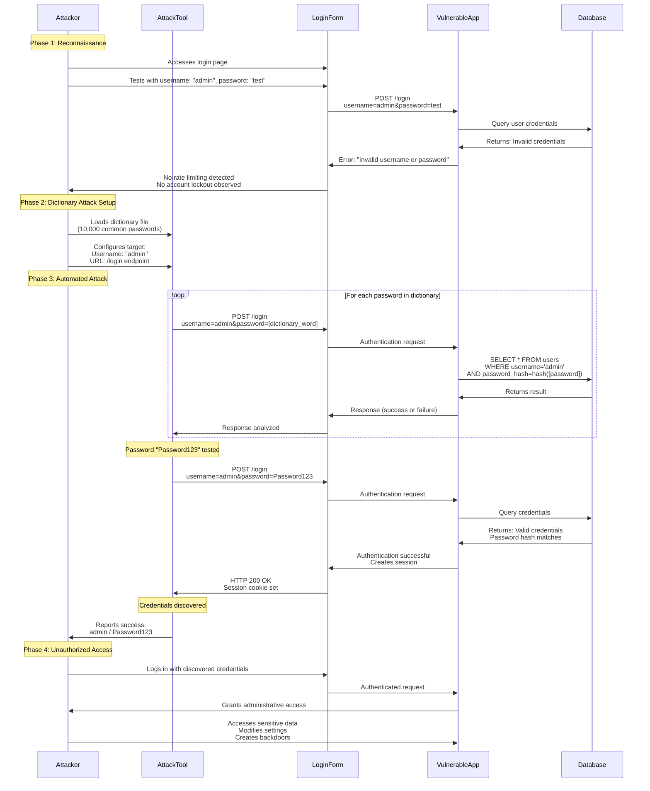
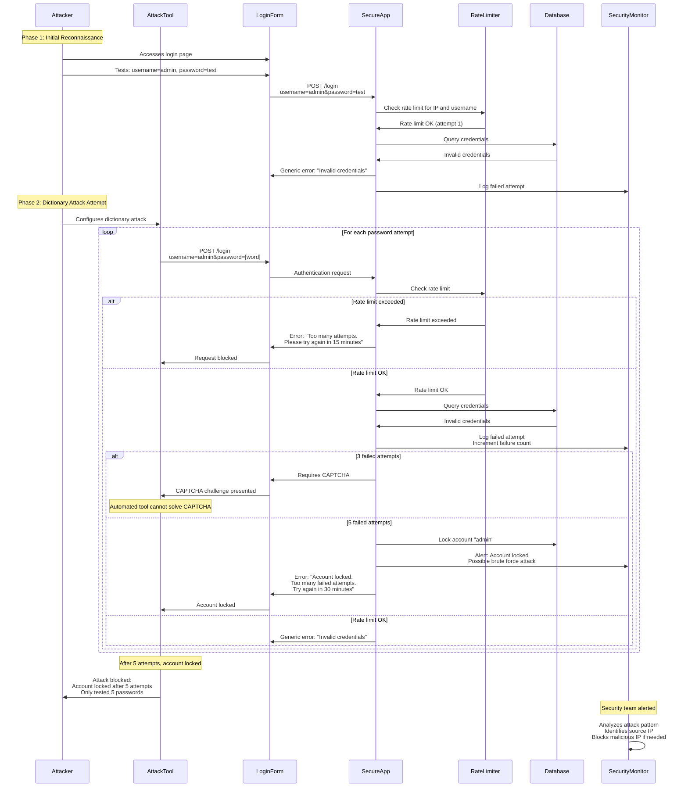
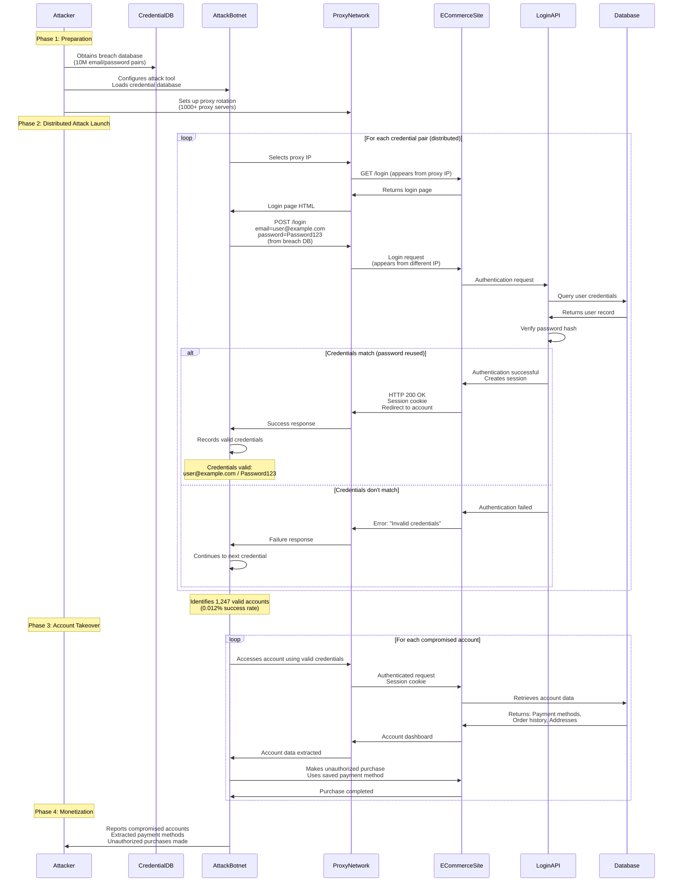
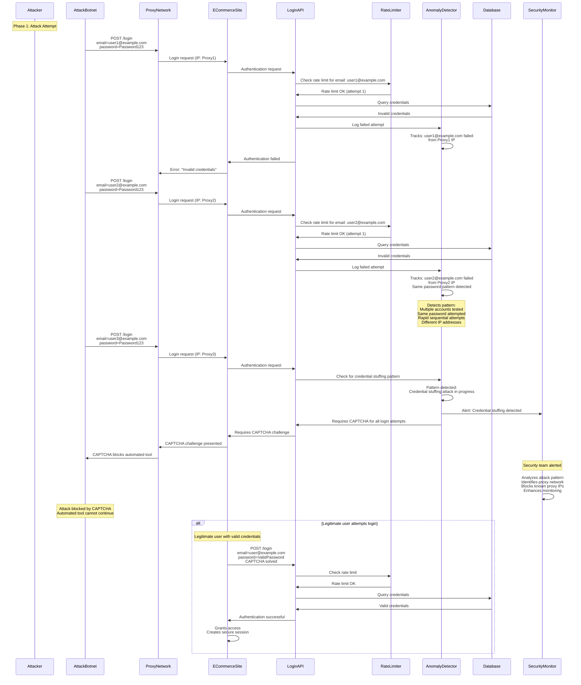
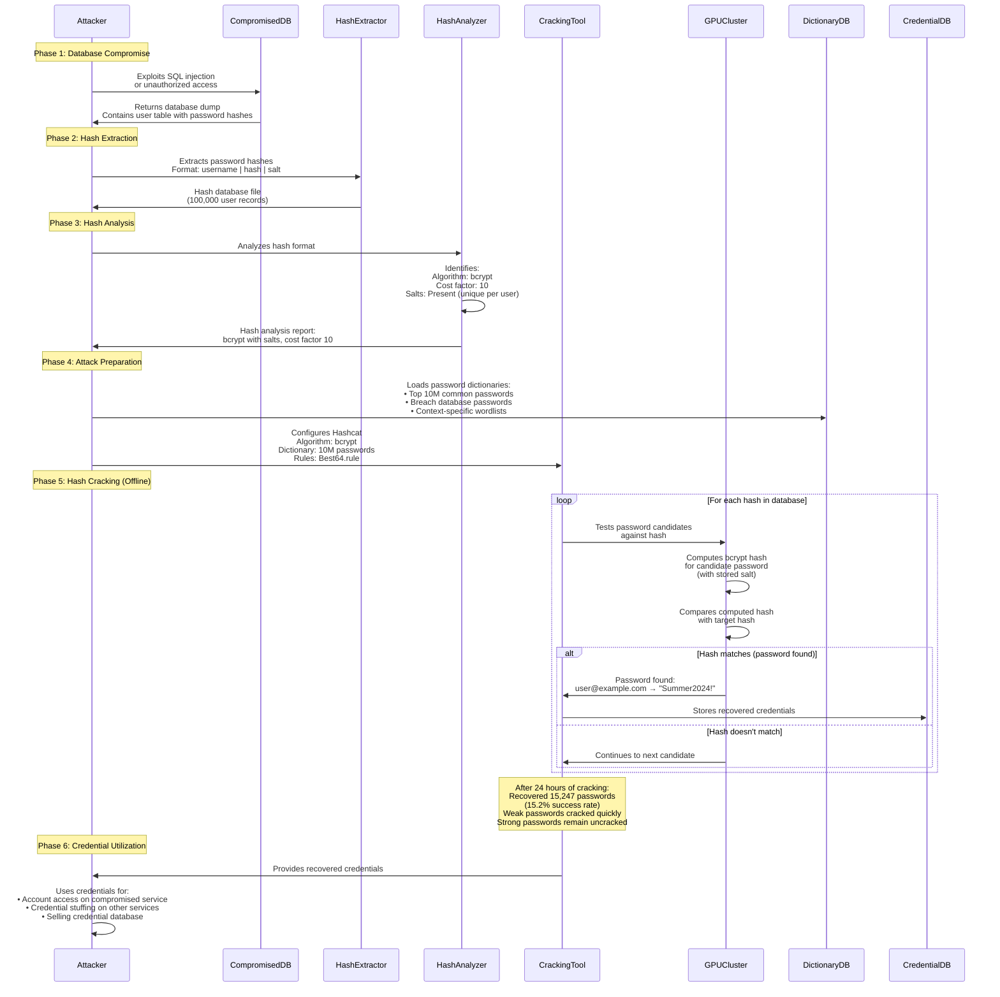
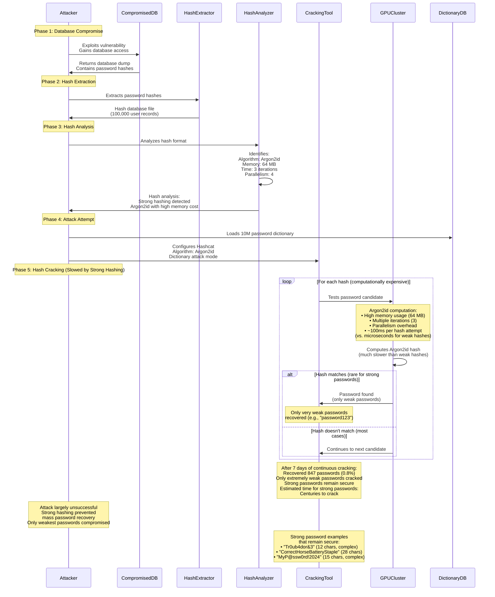

# Brute Force Attacks: Technical Security Documentation

## Table of Contents
1. [Introduction and Core Concepts](#introduction-and-core-concepts)
2. [Defense Principles](#defense-principles)
3. [Mitigation Strategies](#mitigation-strategies)
4. [Real-World Attack Scenarios](#real-world-attack-scenarios)

---

## Brute Force Attacks Overview: Concepts and Relationships

The following diagram provides a high-level overview of Brute Force Attack concepts, attack types, vectors, defense mechanisms, and their interconnections:

```mermaid
flowchart TB
    subgraph AttackTypes["Brute Force Attack Types"]
        Dictionary["Dictionary Attack<br/>• Wordlist-based<br/>• Common passwords<br/>• Targeted wordlists"]
        Exhaustive["Exhaustive Brute Force<br/>• All possible combinations<br/>• Character-by-character<br/>• Full key space"]
        Hybrid["Hybrid Attack<br/>• Dictionary + mutations<br/>• Rule-based variations<br/>• Pattern modifications"]
        CredentialStuffing["Credential Stuffing<br/>• Reused credentials<br/>• Breach databases<br/>• Automated login attempts"]
        ReverseBrute["Reverse Brute Force<br/>• Single password<br/>• Multiple usernames<br/>• Targeted password"]
    end

    subgraph AttackVectors["Attack Vectors & Entry Points"]
        LoginForms["Login Forms<br/>• Web applications<br/>• Authentication endpoints<br/>• User portals"]
        APIEndpoints["API Endpoints<br/>• REST authentication<br/>• Token-based auth<br/>• Service APIs"]
        SSH["SSH Services<br/>• Remote access<br/>• Server authentication<br/>• Key-based attacks"]
        Database["Database Access<br/>• SQL authentication<br/>• Admin panels<br/>• DB connections"]
        FileSystems["File Systems<br/>• Encrypted files<br/>• Archive passwords<br/>• Document protection"]
        NetworkServices["Network Services<br/>• VPN authentication<br/>• Wi-Fi passwords<br/>• Service credentials"]
    end

    subgraph AttackContexts["Attack Contexts"]
        Online["Online Attacks<br/>• Real-time attempts<br/>• Network-based<br/>• Rate-limited"]
        Offline["Offline Attacks<br/>• Hash cracking<br/>• Stolen databases<br/>• No rate limits"]
        Distributed["Distributed Attacks<br/>• Botnet-based<br/>• Multiple IPs<br/>• Coordinated attempts"]
        Targeted["Targeted Attacks<br/>• Specific accounts<br/>• High-value targets<br/>• Custom wordlists"]
    end

    subgraph DefenseMechanisms["Defense Mechanisms"]
        RateLimiting["Rate Limiting<br/>• Request throttling<br/>• IP-based limits<br/>• Account-based limits"]
        AccountLockout["Account Lockout<br/>• Failed attempt limits<br/>• Temporary locks<br/>• Progressive delays"]
        CAPTCHA["CAPTCHA Challenges<br/>• Human verification<br/>• Bot detection<br/>• Challenge-response"]
        MFA["Multi-Factor Authentication<br/>• Additional factors<br/>• Token-based<br/>• Biometric verification"]
        PasswordPolicy["Password Policies<br/>• Complexity requirements<br/>• Length minimums<br/>• Expiration rules"]
        Monitoring["Security Monitoring<br/>• Anomaly detection<br/>• Pattern recognition<br/>• Alert systems"]
        Hashing["Secure Password Hashing<br/>• Bcrypt/Argon2<br/>• Salted hashes<br/>• Slow hash functions"]
    end

    subgraph AttackImpact["Attack Impact"]
        UnauthorizedAccess["Unauthorized Access<br/>• Account compromise<br/>• System entry<br/>• Privilege escalation"]
        DataBreach["Data Breach<br/>• Sensitive data access<br/>• Personal information<br/>• Business data"]
        ServiceDisruption["Service Disruption<br/>• DoS from lockouts<br/>• Resource exhaustion<br/>• Performance degradation"]
        CredentialTheft["Credential Theft<br/>• Password disclosure<br/>• Hash extraction<br/>• Credential reuse"]
        FinancialLoss["Financial Loss<br/>• Fraudulent transactions<br/>• Unauthorized purchases<br/>• Account takeover"]
        ReputationDamage["Reputation Damage<br/>• Customer trust loss<br/>• Brand impact<br/>• Compliance issues"]
    end

    %% Attack Vector to Types
    LoginForms --> Dictionary
    LoginForms --> CredentialStuffing
    LoginForms --> ReverseBrute
    APIEndpoints --> Dictionary
    APIEndpoints --> CredentialStuffing
    SSH --> Exhaustive
    SSH --> Dictionary
    Database --> Dictionary
    Database --> Exhaustive
    FileSystems --> Exhaustive
    FileSystems --> Hybrid
    NetworkServices --> Dictionary
    NetworkServices --> Exhaustive

    %% Attack Types to Contexts
    Dictionary --> Online
    Dictionary --> Offline
    Exhaustive --> Offline
    Exhaustive --> Online
    Hybrid --> Online
    Hybrid --> Offline
    CredentialStuffing --> Distributed
    CredentialStuffing --> Online
    ReverseBrute --> Targeted
    ReverseBrute --> Online

    %% Contexts to Impact
    Online --> UnauthorizedAccess
    Online --> ServiceDisruption
    Offline --> CredentialTheft
    Offline --> DataBreach
    Distributed --> UnauthorizedAccess
    Distributed --> ServiceDisruption
    Targeted --> UnauthorizedAccess
    Targeted --> FinancialLoss

    %% Defense Connections
    RateLimiting --> Online
    RateLimiting --> Distributed
    AccountLockout --> Online
    AccountLockout --> Targeted
    CAPTCHA --> Online
    CAPTCHA --> Distributed
    MFA --> UnauthorizedAccess
    MFA --> FinancialLoss
    PasswordPolicy --> Dictionary
    PasswordPolicy --> Exhaustive
    Monitoring --> Online
    Monitoring --> Distributed
    Hashing --> Offline
    Hashing --> CredentialTheft

    %% Defense Mitigation
    RateLimiting -.->|Prevents| Online
    RateLimiting -.->|Limits| Distributed
    AccountLockout -.->|Blocks| Online
    AccountLockout -.->|Protects| Targeted
    CAPTCHA -.->|Detects| Online
    CAPTCHA -.->|Stops| Distributed
    MFA -.->|Prevents| UnauthorizedAccess
    MFA -.->|Mitigates| FinancialLoss
    PasswordPolicy -.->|Reduces| Dictionary
    PasswordPolicy -.->|Increases| Exhaustive
    Monitoring -.->|Detects| Online
    Monitoring -.->|Alerts| Distributed
    Hashing -.->|Slows| Offline
    Hashing -.->|Protects| CredentialTheft

    %% Styling
    classDef attackType fill:#ffcccc,stroke:#ff0000,stroke-width:3px,color:#000000
    classDef attackVector fill:#ffe6cc,stroke:#ff6600,stroke-width:2px,color:#000000
    classDef attackContext fill:#ccccff,stroke:#0000ff,stroke-width:2px,color:#000000
    classDef defense fill:#ccffcc,stroke:#00aa00,stroke-width:2px,color:#000000
    classDef impact fill:#ffccff,stroke:#aa00aa,stroke-width:2px,color:#000000

    class Dictionary,Exhaustive,Hybrid,CredentialStuffing,ReverseBrute attackType
    class LoginForms,APIEndpoints,SSH,Database,FileSystems,NetworkServices attackVector
    class Online,Offline,Distributed,Targeted attackContext
    class RateLimiting,AccountLockout,CAPTCHA,MFA,PasswordPolicy,Monitoring,Hashing defense
    class UnauthorizedAccess,DataBreach,ServiceDisruption,CredentialTheft,FinancialLoss,ReputationDamage impact

    %% Subgraph styling - transparent background with border only
    style AttackTypes fill:#ffffff10,stroke:#ff0000,stroke-width:2px
    style AttackVectors fill:#ffffff10,stroke:#ff6600,stroke-width:2px
    style AttackContexts fill:#ffffff10,stroke:#0000ff,stroke-width:2px
    style DefenseMechanisms fill:#ffffff10,stroke:#00aa00,stroke-width:2px
    style AttackImpact fill:#ffffff10,stroke:#aa00aa,stroke-width:2px
```

### Diagram Legend

**Color Coding:**
- **Red Borders (Attack Types)**: Different categories of brute force attacks based on methodology and approach
- **Orange Borders (Attack Vectors)**: Entry points and services where brute force attacks can be launched
- **Blue Borders (Attack Contexts)**: Operational contexts in which brute force attacks occur
- **Green Borders (Defense Mechanisms)**: Protection strategies to prevent or mitigate brute force attacks
- **Purple Borders (Attack Impact)**: Potential consequences of successful brute force attacks

**Arrow Types:**
- **Solid Arrows (→)**: Flow of attack or logical relationships between concepts
- **Dashed Arrows (-.->)**: Defense mechanisms preventing or mitigating specific attack vectors or impacts

### Key Relationships

1. **Attack Vectors → Attack Types**: Different entry points enable various brute force attack types. Login forms and API endpoints commonly face dictionary attacks and credential stuffing, while SSH and database services are vulnerable to exhaustive brute force attempts.

2. **Attack Types → Attack Contexts**: The attack methodology determines the operational context. Dictionary attacks can occur both online (real-time) and offline (hash cracking), while credential stuffing typically uses distributed networks to avoid detection.

3. **Attack Contexts → Attack Impact**: The context influences potential damage. Online attacks can cause service disruption and unauthorized access, while offline attacks primarily lead to credential theft and data breaches when password databases are compromised.

4. **Defense Mechanisms → Attack Contexts**: Different defenses protect against specific contexts. Rate limiting and account lockout protect against online attacks, while secure password hashing mitigates offline attacks by making hash cracking computationally expensive.

5. **Defense Mechanisms → Attack Impact**: Security controls directly prevent or limit attack consequences. Multi-factor authentication prevents unauthorized access even if passwords are compromised, while monitoring systems detect and alert on attack patterns.

6. **Defense Layering**: Multiple defense mechanisms work together—rate limiting slows attacks, account lockout blocks repeated attempts, CAPTCHA prevents automation, and MFA adds an additional authentication layer, creating comprehensive protection.

---

## Introduction and Core Concepts

### Definition and How the Attack Works

**Brute Force Attacks** are a class of security attacks where an attacker systematically attempts to guess authentication credentials (typically passwords) through trial and error. The attacker tries numerous combinations of characters, words, or patterns until finding the correct credentials that grant access to a protected resource.

#### Core Mechanism

Brute force attacks exploit the fundamental principle that authentication systems must verify credentials by comparing user input against stored values. When weak passwords are used or insufficient protection mechanisms are in place, attackers can systematically test possible credentials until finding valid ones.

The attack works through the following process:

1. **Target Identification**: The attacker identifies a target system, service, or account that requires authentication
2. **Credential Space Definition**: The attacker determines the possible range of credentials to test (character sets, wordlists, patterns)
3. **Automated Testing**: The attacker uses automated tools to systematically submit authentication attempts
4. **Response Analysis**: Each attempt's response is analyzed to determine if authentication succeeded
5. **Access Achievement**: Once valid credentials are found, the attacker gains unauthorized access

#### Attack Methodology

Brute force attacks can be categorized by their approach:

**Dictionary Attacks**: Use pre-compiled lists of common passwords, words, and phrases. These attacks are efficient because they target passwords that humans are likely to choose. Dictionary attacks leverage:
- Common password lists (e.g., "password", "123456", "admin")
- Wordlists from previous data breaches
- Language-specific dictionaries
- Context-specific wordlists (e.g., company names, employee names)

**Exhaustive Brute Force**: Systematically tries every possible combination of characters within defined parameters. This approach:
- Tests all combinations within a character set (e.g., a-z, A-Z, 0-9)
- Can be limited by length constraints (e.g., 4-8 characters)
- Becomes computationally infeasible for long, complex passwords
- Is most effective against short or simple passwords

**Hybrid Attacks**: Combine dictionary attacks with rule-based modifications. These attacks:
- Start with dictionary words
- Apply transformations (capitalization, number appending, character substitution)
- Test common patterns (e.g., "password123", "P@ssw0rd")
- Are more effective than pure dictionary attacks while remaining faster than exhaustive brute force

**Credential Stuffing**: Uses previously compromised credentials from data breaches. This approach:
- Leverages username/password pairs from past breaches
- Tests these credentials against other services (users often reuse passwords)
- Is highly automated and distributed
- Exploits password reuse behavior

**Reverse Brute Force**: Tests a single known or suspected password against multiple usernames. This approach:
- Uses a password that may have been leaked or is commonly used
- Tests it against many different usernames or accounts
- Is effective when a specific password is known (e.g., default passwords)

#### Attack Execution

The execution of brute force attacks involves several technical components:

**Automation Tools**: Attackers use specialized software that can:
- Generate password candidates automatically
- Submit authentication requests rapidly
- Handle different authentication protocols
- Parse responses to detect successful authentication
- Distribute attacks across multiple systems or IP addresses

**Attack Speed**: The effectiveness of brute force attacks depends on:
- **Online Attacks**: Limited by network latency, server response time, and rate limiting mechanisms
- **Offline Attacks**: Limited only by computational power when attackers have access to password hashes
- **Distributed Attacks**: Use multiple systems to increase attempt rate and avoid single-point rate limits

**Success Factors**: Brute force attacks succeed when:
- Weak passwords are used (short, common, predictable)
- No rate limiting is implemented
- No account lockout mechanisms exist
- Password hashes are weak or unsalted (enabling offline attacks)
- No multi-factor authentication is required

### Impact and Attack Vectors

#### Impact Severity

Brute force attacks can have severe consequences, ranging from individual account compromise to large-scale data breaches:

**Unauthorized Access**
- Complete account takeover when passwords are successfully guessed
- Access to sensitive personal information, financial data, or business information
- Ability to modify account settings, change passwords, or delete data
- Privilege escalation if compromised accounts have administrative rights

**Data Breach**
- Exposure of sensitive user data stored in compromised accounts
- Access to business-critical information and intellectual property
- Disclosure of personal identifiable information (PII) leading to identity theft
- Violation of data protection regulations (GDPR, HIPAA, PCI-DSS)

**Service Disruption**
- Denial of Service (DoS) when account lockout policies lock legitimate users out
- Resource exhaustion from processing excessive authentication attempts
- Performance degradation affecting all users
- System unavailability during attack mitigation

**Credential Theft**
- Extraction of password hashes enabling offline cracking
- Collection of valid credentials for use in other attacks
- Creation of credential databases for future attacks
- Password reuse exploitation across multiple services

**Financial Loss**
- Unauthorized financial transactions from compromised accounts
- Fraudulent purchases or money transfers
- Business losses from account takeover
- Costs associated with incident response and remediation

**Reputation Damage**
- Loss of customer trust following security incidents
- Negative brand impact and public relations issues
- Regulatory fines and legal liability
- Competitive disadvantage in the marketplace

#### Attack Vectors

Brute force attacks can target any system or service that requires authentication:

**Login Forms**
- Web application login pages where users authenticate with username and password
- Administrative panels and control interfaces
- User portals and customer account areas
- E-commerce checkout and account management systems

**API Endpoints**
- REST API authentication endpoints that accept credentials
- Token-based authentication systems where tokens can be brute forced
- Service-to-service authentication mechanisms
- Mobile application backend APIs

**SSH Services**
- Remote server access via Secure Shell protocol
- Server administration and management access
- Key-based authentication (if keys are weak or passphrase-protected)
- Automated server compromise for botnet creation

**Database Access**
- SQL database authentication for administrative access
- Database connection credentials for application access
- Database management interfaces and admin panels
- Backup and recovery system authentication

**File Systems**
- Encrypted file and folder passwords
- Archive file passwords (ZIP, RAR, etc.)
- Encrypted document passwords (PDF, Office documents)
- Disk encryption passwords (BitLocker, FileVault, etc.)

**Network Services**
- VPN authentication credentials
- Wi-Fi network passwords (WPA/WPA2)
- Network device administration (routers, switches, firewalls)
- Email service authentication (SMTP, IMAP, POP3)

**Offline Attack Vectors**
- Password hash databases obtained from data breaches
- Stolen password files from compromised systems
- Database dumps containing password hashes
- Backup files containing authentication data

---

## Defense Principles

### Core Principles for Protection

Effective brute force defense requires understanding and applying fundamental security principles that address both the technical and human factors contributing to vulnerability.

#### Principle 1: Rate Limiting and Throttling

The fundamental principle for preventing brute force attacks is limiting the rate at which authentication attempts can be made. By restricting the number of attempts per time period, attackers cannot test credentials rapidly enough to be effective.

**Why This Matters**: Without rate limiting, attackers can submit thousands or millions of authentication attempts in minutes. Rate limiting forces attackers to spread attempts over extended periods, making attacks impractical and detectable.

**Implementation**: Rate limiting should be applied at multiple levels:
- **IP-based limiting**: Restrict attempts per source IP address
- **Account-based limiting**: Limit attempts per username or account identifier
- **Progressive delays**: Increase delay between attempts after each failure
- **Temporary blocks**: Temporarily block sources after excessive attempts

#### Principle 2: Account Lockout Mechanisms

Accounts should be temporarily locked after a threshold of failed authentication attempts. This prevents attackers from continuing to test credentials against specific accounts.

**Why This Matters**: Account lockout directly prevents attackers from testing many passwords against a single account. Even if rate limiting allows some attempts, lockout ensures that only a limited number of guesses can be made per account.

**Implementation Considerations**:
- **Lockout Threshold**: Balance security (lower threshold) with usability (higher threshold)
- **Lockout Duration**: Temporary locks that auto-unlock after a time period
- **Progressive Lockout**: Increase lockout duration with repeated failures
- **Administrative Override**: Provide mechanisms for legitimate users to regain access

#### Principle 3: Strong Password Requirements

Enforce password policies that require complex, lengthy passwords that are resistant to brute force attacks. Strong passwords significantly increase the time required for successful brute force attempts.

**Why This Matters**: Weak passwords can be cracked in seconds or minutes, while strong passwords may require years or centuries of computation. Password complexity directly determines brute force attack feasibility.

**Password Policy Elements**:
- **Minimum Length**: Require passwords of sufficient length (typically 12+ characters)
- **Character Diversity**: Require mix of uppercase, lowercase, numbers, and symbols
- **Password History**: Prevent reuse of recent passwords
- **Dictionary Checks**: Reject common passwords and dictionary words
- **Expiration Policies**: Require periodic password changes (though this is debated in modern security)

#### Principle 4: Secure Password Storage

Passwords must be stored using cryptographically secure hashing algorithms that are computationally expensive to reverse. This protects against offline brute force attacks when password databases are compromised.

**Why This Matters**: If password hashes are weak or unsalted, attackers can crack them offline at high speed. Strong hashing makes offline brute force attacks computationally infeasible even when databases are stolen.

**Implementation Requirements**:
- **Strong Hash Functions**: Use bcrypt, Argon2, or PBKDF2 with appropriate cost factors
- **Salting**: Use unique, random salts for each password
- **Cost Factors**: Configure hash functions with high computational cost
- **No Reversible Storage**: Never store passwords in plaintext or reversible encryption

#### Principle 5: Multi-Factor Authentication (MFA)

Require additional authentication factors beyond passwords. Even if passwords are compromised through brute force, MFA prevents unauthorized access.

**Why This Matters**: MFA adds a second layer of protection that cannot be bypassed through password guessing. Attackers would need to compromise both the password and the additional factor (device, token, biometric).

**MFA Implementation**:
- **Something You Know**: Password (first factor)
- **Something You Have**: Physical token, mobile device, smart card
- **Something You Are**: Biometric authentication (fingerprint, face recognition)
- **Time-based Codes**: TOTP (Time-based One-Time Password) applications
- **SMS/Email Codes**: Secondary verification codes (less secure but better than password-only)

#### Principle 6: Monitoring and Detection

Implement security monitoring systems that detect brute force attack patterns and alert security teams. Early detection enables rapid response and attack mitigation.

**Why This Matters**: Attackers may use sophisticated techniques to evade rate limiting. Monitoring can identify attack patterns, coordinate responses, and provide intelligence for improving defenses.

**Monitoring Capabilities**:
- **Anomaly Detection**: Identify unusual authentication patterns
- **Failed Attempt Tracking**: Monitor and alert on high failure rates
- **Geographic Analysis**: Detect login attempts from unusual locations
- **Behavioral Analysis**: Identify automated attack patterns vs. human behavior
- **Real-time Alerts**: Immediate notification of potential attacks

### When and Where to Apply Defenses

Understanding where and when to apply these defense principles is crucial for effective protection.

#### Authentication Layer (Primary Defense Location)

**Where**: All authentication endpoints and mechanisms
- Login forms and authentication APIs
- Password reset and recovery mechanisms
- Session establishment and token generation
- Multi-factor authentication flows

**When**: 
- **During Development**: Implement rate limiting and account lockout from the start
- **Authentication Design**: Design authentication flows with security as a primary consideration
- **Code Reviews**: Verify all authentication endpoints have protection mechanisms
- **New Features**: Apply defense principles to all new authentication functionality

**Primary Defenses**: Rate limiting and account lockout should be implemented on all authentication endpoints. These are the most critical defenses against brute force attacks.

#### Password Management Layer (Prevention)

**Where**: Password creation, storage, and validation systems
- User registration and password creation
- Password change and reset functionality
- Password storage and hashing systems
- Password validation and policy enforcement

**When**:
- **Password Creation**: Enforce strong password policies during registration
- **Password Changes**: Validate new passwords against policy requirements
- **Storage Implementation**: Use secure hashing when storing passwords
- **Policy Updates**: Regularly review and update password requirements

**Prevention Focus**: Strong passwords and secure storage prevent successful brute force attacks by making password guessing computationally infeasible.

#### Infrastructure Layer (Detection and Response)

**Where**: Network and application infrastructure
- Web Application Firewalls (WAF)
- Intrusion Detection Systems (IDS)
- Security Information and Event Management (SIEM)
- Application performance monitoring

**When**:
- **Traffic Inspection**: Monitor all authentication-related traffic
- **Pattern Detection**: Identify brute force attack patterns across systems
- **Incident Response**: Detect and respond to active attacks
- **Threat Intelligence**: Correlate attacks with known threat patterns

**Detection and Response**: Infrastructure-level monitoring provides visibility into attack patterns and enables coordinated response across multiple systems.

#### User Education Layer (Human Factor)

**Where**: User-facing documentation and training
- Password creation guidance
- Security awareness training
- Account security best practices
- Phishing and social engineering education

**When**:
- **Onboarding**: Educate users during account creation
- **Regular Training**: Provide ongoing security awareness
- **Incident Communication**: Inform users about security threats and best practices
- **Policy Changes**: Communicate password policy updates

**Human Factor**: Even with technical defenses, user education is essential. Users must understand the importance of strong passwords and recognize social engineering attempts.

#### Special Cases: When Standard Defenses Are Challenging

**API Rate Limiting**: For APIs, implement rate limiting per API key or client identifier in addition to IP-based limiting, as APIs may have legitimate high-volume usage.

**Distributed Attacks**: When attacks come from multiple IP addresses, implement account-based rate limiting and monitoring to detect coordinated attacks across sources.

**Legacy Systems**: When implementing modern defenses is not immediately possible, prioritize account lockout and monitoring while planning migration to comprehensive protection.

**High-Value Accounts**: For administrative or sensitive accounts, implement stricter rate limiting, mandatory MFA, and enhanced monitoring.

---

## Mitigation Strategies

### Primary Mitigation Techniques

#### Strategy 1: Rate Limiting and Request Throttling

Rate limiting is the most fundamental defense against brute force attacks. It restricts the number of authentication attempts that can be made within a specific time period, making brute force attacks impractical.

**How It Works**:

1. **Request Counting**: The system tracks the number of authentication attempts from each source (IP address, username, or combination)
2. **Time Window Definition**: Define time windows (e.g., per minute, per hour, per day) for counting attempts
3. **Threshold Enforcement**: When the attempt threshold is exceeded, the system blocks or delays further attempts
4. **Progressive Delays**: Implement increasing delays between attempts after each failure

**Why It's Effective**:

- **Attack Slowdown**: Forces attackers to spread attempts over extended periods (days, weeks, or months)
- **Detection Window**: Provides time for monitoring systems to detect and respond to attacks
- **Resource Protection**: Prevents resource exhaustion from excessive authentication attempts
- **Cost Increase**: Makes attacks economically unfeasible by requiring extended time periods

**Implementation Approaches**:

- **IP-Based Limiting**: Limit attempts per source IP address (e.g., 5 attempts per minute per IP)
- **Account-Based Limiting**: Limit attempts per username (e.g., 5 attempts per hour per account)
- **Combined Limiting**: Use both IP and account-based limits for comprehensive protection
- **Progressive Throttling**: Increase delay exponentially with each failed attempt (1s, 2s, 4s, 8s, etc.)

**Implementation Considerations**:

- **Legitimate User Impact**: Balance security with usability—ensure legitimate users aren't overly restricted
- **Distributed Attacks**: Account-based limiting is essential when attacks come from multiple IPs
- **Shared IP Addresses**: Consider NAT scenarios where multiple users share IP addresses
- **Bypass Attempts**: Monitor for attempts to bypass rate limiting (IP rotation, proxy usage)

#### Strategy 2: Account Lockout Mechanisms

Account lockout temporarily disables accounts after a threshold of failed authentication attempts, preventing continued password guessing against specific accounts.

**How It Works**:

1. **Failure Tracking**: Track failed authentication attempts per account or username
2. **Threshold Definition**: Define the number of failed attempts that trigger lockout (e.g., 5 failed attempts)
3. **Lockout Activation**: When threshold is reached, temporarily lock the account
4. **Lockout Duration**: Maintain lockout for a defined period (e.g., 15 minutes, 1 hour)
5. **Auto-Unlock**: Automatically unlock accounts after the lockout period expires

**Why It's Effective**:

- **Direct Prevention**: Stops attackers from testing many passwords against a single account
- **Limited Attempts**: Ensures attackers can only test a small number of passwords per account
- **Attack Detection**: Lockouts serve as indicators of brute force attack attempts
- **User Protection**: Protects accounts even if users choose weak passwords

**Lockout Strategies**:

- **Fixed Lockout**: Lock account for a fixed duration after threshold (e.g., 30 minutes)
- **Progressive Lockout**: Increase lockout duration with repeated lockouts (30 min, 1 hour, 24 hours)
- **Permanent Lockout**: Require administrative intervention after multiple lockouts
- **Selective Lockout**: Lock only the authentication method, not the entire account

**Implementation Considerations**:

- **Denial of Service Risk**: Attackers may intentionally lock out legitimate users
- **Administrative Override**: Provide mechanisms for legitimate users to regain access
- **Lockout Notification**: Inform users when their accounts are locked
- **Distributed Attacks**: Account lockout is effective even against distributed attacks

#### Strategy 3: CAPTCHA Challenges

CAPTCHA (Completely Automated Public Turing test to tell Computers and Humans Apart) challenges require human interaction, preventing fully automated brute force attacks.

**How It Works**:

1. **Challenge Presentation**: After a threshold of failed attempts, present a CAPTCHA challenge
2. **Human Verification**: Require users to solve the challenge (image recognition, puzzle solving)
3. **Automation Prevention**: Automated tools cannot easily solve CAPTCHA challenges
4. **Continued Access**: Successful CAPTCHA completion allows continued authentication attempts

**Why It's Effective**:

- **Automation Blocking**: Prevents fully automated brute force tools from operating
- **Attack Cost**: Forces attackers to manually solve challenges, making attacks labor-intensive
- **Bot Detection**: Identifies and blocks bot traffic
- **User Experience**: Legitimate users can solve CAPTCHAs, maintaining usability

**CAPTCHA Types**:

- **Image Recognition**: Select images matching a description
- **Text Recognition**: Type distorted text characters
- **Puzzle Solving**: Complete simple puzzles or challenges
- **Behavioral Analysis**: Invisible CAPTCHAs that analyze user behavior

**Implementation Considerations**:

- **Accessibility**: Ensure CAPTCHAs are accessible to users with disabilities
- **User Experience**: Balance security with usability—don't require CAPTCHAs too frequently
- **CAPTCHA Bypass**: Advanced attackers may use CAPTCHA-solving services
- **Progressive Application**: Apply CAPTCHAs after initial failed attempts, not immediately

#### Strategy 4: Multi-Factor Authentication (MFA)

Multi-factor authentication requires additional verification beyond passwords, preventing access even if passwords are compromised through brute force.

**How It Works**:

1. **Primary Authentication**: User provides username and password (first factor)
2. **Secondary Verification**: System requires additional proof of identity (second factor)
3. **Factor Types**: Second factor can be something you have (device, token) or something you are (biometric)
4. **Access Grant**: Access is only granted when both factors are successfully verified

**Why It's Effective**:

- **Additional Layer**: Even if password is guessed, attacker cannot access account without second factor
- **Attack Prevention**: Makes brute force attacks ineffective—password compromise alone is insufficient
- **Credential Theft Protection**: Protects against credential stuffing and password reuse attacks
- **Compliance**: Meets regulatory requirements for enhanced authentication

**MFA Implementation Methods**:

- **Time-based One-Time Passwords (TOTP)**: Mobile apps generating time-based codes
- **SMS/Email Codes**: Verification codes sent via SMS or email
- **Hardware Tokens**: Physical devices generating authentication codes
- **Push Notifications**: Mobile app notifications requiring user approval
- **Biometric Authentication**: Fingerprint, face recognition, or other biometric factors

**Implementation Considerations**:

- **User Adoption**: MFA requires user enrollment and device setup
- **Backup Methods**: Provide alternative authentication methods if primary MFA device is unavailable
- **Security vs. Usability**: Balance security benefits with user experience
- **Mandatory vs. Optional**: Consider making MFA mandatory for sensitive accounts

#### Strategy 5: Secure Password Hashing

Strong password hashing protects against offline brute force attacks when password databases are compromised, making hash cracking computationally infeasible.

**How It Works**:

1. **Hash Function Selection**: Use cryptographically secure hash functions designed for password storage
2. **Salting**: Generate unique, random salt for each password
3. **Hashing Process**: Combine password and salt, then hash with computationally expensive function
4. **Storage**: Store only the hash and salt, never the plaintext password
5. **Verification**: During authentication, hash the provided password with stored salt and compare

**Why It's Effective**:

- **Offline Protection**: Makes offline brute force attacks extremely slow even with stolen databases
- **Cost Factor**: Configurable computational cost makes hash cracking expensive
- **Uniqueness**: Salting ensures identical passwords produce different hashes
- **Irreversibility**: Strong hash functions cannot be reversed to recover passwords

**Recommended Hash Functions**:

- **Argon2**: Modern, memory-hard function, winner of Password Hashing Competition (recommended)
- **Bcrypt**: Widely supported, time-tested, configurable cost factor
- **PBKDF2**: NIST-recommended, configurable iteration count
- **scrypt**: Memory-hard function, good for preventing hardware-accelerated attacks

**Implementation Considerations**:

- **Cost Factors**: Configure appropriate cost factors based on available computational resources
- **Salt Generation**: Use cryptographically secure random number generators for salts
- **Hash Updates**: Plan for migrating to stronger hash functions as technology evolves
- **Performance**: Balance security (higher cost) with performance (lower cost)

### Alternative Approaches and When to Use Them

#### Alternative 1: IP Reputation and Blocking

Block or restrict authentication attempts from IP addresses with poor reputation or known malicious behavior.

**How It Works**:

1. **Reputation Databases**: Maintain or access databases of known malicious IP addresses
2. **Real-time Checking**: Check source IP addresses against reputation databases
3. **Blocking or Restriction**: Block or apply stricter limits to low-reputation IPs
4. **Dynamic Updates**: Continuously update reputation data based on observed behavior

**Limitations**:

- **IP Rotation**: Attackers can use proxy networks or botnets to rotate IP addresses
- **False Positives**: Legitimate users may be blocked if using shared or VPN IPs
- **Maintenance**: Requires ongoing maintenance of reputation databases

**When to Use**:

- **Defense in Depth**: As an additional layer alongside other defenses
- **Known Threats**: When specific threat actors or botnets are identified
- **Geographic Restrictions**: When services should only be accessible from specific regions

#### Alternative 2: Behavioral Analysis and Anomaly Detection

Analyze authentication patterns to identify automated brute force behavior that differs from legitimate human users.

**How It Works**:

1. **Pattern Collection**: Collect data on authentication attempts (timing, patterns, success rates)
2. **Behavioral Modeling**: Build models of normal user authentication behavior
3. **Anomaly Detection**: Identify attempts that deviate from normal patterns
4. **Response Actions**: Apply additional restrictions or challenges to anomalous attempts

**Detection Indicators**:

- **Timing Patterns**: Automated attempts have consistent, machine-like timing
- **Failure Patterns**: Brute force attacks show high failure rates
- **Geographic Anomalies**: Login attempts from unusual locations
- **Device Fingerprinting**: Unusual device or browser characteristics

**When to Use**:

- **Advanced Protection**: For systems requiring sophisticated threat detection
- **Low False Positive Tolerance**: When false positives can be investigated
- **Security Operations**: When security teams can respond to alerts

#### Alternative 3: Password Complexity Meters and Guidance

Provide real-time feedback during password creation to guide users toward stronger passwords.

**How It Works**:

1. **Real-time Analysis**: Analyze password strength as user types
2. **Visual Feedback**: Display password strength indicators (weak, medium, strong)
3. **Guidance Messages**: Provide specific suggestions for improving password strength
4. **Policy Enforcement**: Prevent submission of passwords that don't meet requirements

**Why It Helps**:

- **User Education**: Helps users understand what makes passwords strong
- **Immediate Feedback**: Users can adjust passwords before submission
- **Compliance**: Ensures passwords meet policy requirements

**When to Use**:

- **User-Facing Systems**: During password creation and change processes
- **Educational Context**: When user security awareness is a priority
- **Policy Enforcement**: To ensure password policy compliance

### Implementation Considerations

#### Development Practices

**Security by Design**:
- Implement rate limiting and account lockout during initial development
- Design authentication systems with brute force protection as a core requirement
- Use secure password hashing libraries rather than implementing custom solutions
- Plan for MFA integration from the beginning

**Code Review Guidelines**:
- Review all authentication code for proper rate limiting implementation
- Verify password hashing uses recommended algorithms and proper salting
- Check that account lockout mechanisms cannot be bypassed
- Ensure error messages don't reveal whether usernames exist

**Testing Requirements**:
- Test rate limiting under various load conditions
- Verify account lockout triggers and releases correctly
- Test password policy enforcement
- Validate MFA flows and fallback mechanisms
- Test behavior under attack scenarios

#### Configuration Management

**Rate Limiting Configuration**:
- Define appropriate thresholds based on expected legitimate usage
- Configure time windows that balance security and usability
- Set up monitoring to track rate limit effectiveness
- Document configuration decisions and rationale

**Account Lockout Configuration**:
- Set lockout thresholds that prevent attacks without excessive user impact
- Configure lockout durations that provide security without permanent user lockout
- Implement administrative override procedures
- Plan for handling legitimate user lockouts

**Password Policy Configuration**:
- Define password requirements based on security needs and user capabilities
- Balance complexity requirements with usability
- Consider password expiration policies (though modern guidance often recommends against frequent expiration)
- Document policy rationale and communicate to users

#### Monitoring and Incident Response

**Security Monitoring**:
- Monitor authentication attempt patterns and failure rates
- Track account lockout events and frequencies
- Alert on unusual authentication patterns or geographic anomalies
- Correlate authentication events with other security indicators

**Incident Response Procedures**:
- Define procedures for responding to detected brute force attacks
- Plan for blocking malicious IP addresses or accounts
- Establish communication procedures for notifying affected users
- Document lessons learned and update defenses based on incidents

**Logging Requirements**:
- Log all authentication attempts (successful and failed)
- Include relevant metadata (IP address, user agent, timestamp)
- Retain logs for sufficient duration for investigation
- Protect log integrity and prevent tampering

---

## Real-World Attack Scenarios

### Scenario 1: Dictionary Attack on Web Application Login

#### Attack Flow

This scenario demonstrates how an attacker uses a dictionary attack to compromise a web application login form that lacks rate limiting and account lockout mechanisms.

**Step-by-Step Attack Explanation**:

1. **Target Identification**: The attacker identifies a web application with a login form. They may discover this through reconnaissance, public information, or automated scanning.

2. **Vulnerability Assessment**: The attacker tests the login form to understand its behavior. They may submit a few test login attempts to observe:
   - Response times
   - Error messages (to determine if usernames exist)
   - Whether rate limiting is present
   - Account lockout behavior

3. **Username Enumeration**: The attacker attempts to identify valid usernames by testing common usernames (admin, administrator, test, etc.) and observing error messages. Some applications reveal whether a username exists through different error messages.

4. **Dictionary Preparation**: The attacker prepares or obtains a dictionary of common passwords. This may include:
   - Top 10,000 most common passwords
   - Passwords from previous data breaches
   - Context-specific passwords (company names, employee names)
   - Common password patterns (Password123, Welcome2024, etc.)

5. **Automated Attack Launch**: The attacker uses automated tools (such as Hydra, Burp Suite Intruder, or custom scripts) to systematically test dictionary passwords against identified usernames. The tool:
   - Submits login requests with username/password combinations
   - Parses responses to detect successful authentication
   - Tracks which combinations have been tested
   - Reports successful credential pairs

6. **Credential Discovery**: After testing thousands of password combinations, the tool identifies a valid username/password pair. For example:
   - Username: `admin`
   - Password: `Password123` (a common weak password)

7. **Unauthorized Access**: The attacker uses the discovered credentials to log into the application, gaining unauthorized access to the admin account with full administrative privileges.

8. **Further Exploitation**: With administrative access, the attacker may:
   - Access sensitive data and user information
   - Modify application settings or configurations
   - Create additional administrative accounts
   - Install backdoors for persistent access
   - Extract database contents or other sensitive information

**Attack Sequence Diagram**:

#### Mitigation Application

To prevent this attack, the application must implement rate limiting, account lockout, and strong password policies.

**Mitigation Strategy**:

1. **Rate Limiting Implementation**: Implement rate limiting that restricts authentication attempts:
   - Limit to 5 attempts per username per 15 minutes
   - Limit to 20 attempts per IP address per hour
   - Apply progressive delays after each failed attempt

2. **Account Lockout**: Implement account lockout mechanism:
   - Lock account after 5 failed authentication attempts
   - Maintain lockout for 30 minutes
   - Notify user via email when account is locked
   - Provide administrative unlock mechanism

3. **Strong Password Policy**: Enforce password requirements:
   - Minimum 12 characters
   - Require uppercase, lowercase, numbers, and symbols
   - Reject common passwords and dictionary words
   - Check against password breach databases

4. **CAPTCHA Challenges**: Present CAPTCHA after 3 failed attempts:
   - Require CAPTCHA solution before allowing further attempts
   - Prevent automated tools from continuing attacks
   - Maintain usability for legitimate users

5. **Error Message Uniformity**: Return identical error messages for invalid username and invalid password to prevent username enumeration.

6. **Security Monitoring**: Monitor authentication attempts:
   - Alert on high failure rates
   - Detect automated attack patterns
   - Track account lockout events

**Additional Defenses**:

- **Multi-Factor Authentication**: Require MFA for administrative accounts
- **Password Hashing**: Use bcrypt or Argon2 with appropriate cost factors
- **Login Monitoring**: Log all authentication attempts for security analysis
- **IP Reputation**: Block or restrict authentication from known malicious IPs

**Mitigation Sequence Diagram**:

---

### Scenario 2: Credential Stuffing Attack on E-Commerce Platform

#### Attack Flow

This scenario demonstrates a credential stuffing attack where an attacker uses previously compromised credentials from data breaches to gain unauthorized access to user accounts on an e-commerce platform.

**Step-by-Step Attack Explanation**:

1. **Credential Acquisition**: The attacker obtains a database of compromised credentials from previous data breaches. This database contains millions of username/email and password pairs that were exposed in past security incidents.

2. **Target Selection**: The attacker identifies an e-commerce platform as a target. They may choose this target because:
   - Users likely reuse passwords across multiple services
   - E-commerce accounts have financial value
   - The platform may have weaker authentication protections

3. **Attack Automation Setup**: The attacker configures automated tools (such as Sentry MBA, Account Checker, or custom scripts) to:
   - Load the credential database
   - Test credentials against the target platform's login endpoint
   - Handle session management and cookies
   - Parse responses to identify successful logins
   - Rotate through proxy servers to avoid IP-based rate limiting

4. **Distributed Attack Launch**: The attacker launches the attack using:
   - Multiple proxy servers or a botnet to distribute requests across many IP addresses
   - Request throttling to avoid triggering rate limits
   - User-Agent rotation to appear as legitimate browsers
   - Timing randomization to mimic human behavior

5. **Credential Testing**: The automated tool systematically tests credential pairs:
   - Submits login requests with email/password combinations from the breach database
   - Handles CAPTCHAs (if present) using solving services or manual intervention
   - Tracks which credentials result in successful authentication
   - Continues testing thousands or millions of credential pairs

6. **Successful Access Discovery**: The tool identifies accounts where credentials match:
   - Email: `user@example.com`
   - Password: `Password123` (reused from breached service)
   - The platform accepts these credentials and grants access

7. **Account Takeover**: For each successfully authenticated account, the attacker:
   - Accesses account information and order history
   - Views saved payment methods and addresses
   - Makes unauthorized purchases using saved payment methods
   - Changes account settings to maintain access
   - Extracts additional personal information

8. **Monetization**: The attacker monetizes the compromised accounts through:
   - Unauthorized purchases and fraud
   - Selling account access to other criminals
   - Using payment methods for other fraudulent activities
   - Extracting and selling personal information

**Attack Sequence Diagram**:

#### Mitigation Application

To prevent credential stuffing attacks, the application must implement account-based rate limiting, anomaly detection, and encourage password uniqueness.

**Mitigation Strategy**:

1. **Account-Based Rate Limiting**: Implement rate limiting per account/email address, not just per IP:
   - Limit to 5 login attempts per email address per hour
   - This prevents distributed attacks from bypassing IP-based limits
   - Apply progressive delays after each failed attempt

2. **Anomaly Detection**: Monitor for credential stuffing patterns:
   - Detect high failure rates across multiple accounts from same source
   - Identify rapid testing of different email addresses
   - Alert on unusual login patterns (geographic anomalies, device changes)
   - Correlate failed attempts to identify coordinated attacks

3. **Password Breach Database Checking**: Check new passwords against known breach databases:
   - Use services like Have I Been Pwned API
   - Warn users if they attempt to use compromised passwords
   - Encourage password changes for accounts using breached passwords

4. **Multi-Factor Authentication**: Encourage or require MFA:
   - Prompt users to enable MFA during account setup
   - Require MFA for accounts with saved payment methods
   - Use MFA as additional verification for unusual login patterns

5. **Behavioral Analysis**: Analyze login patterns to detect automation:
   - Monitor request timing patterns (automated tools have consistent timing)
   - Detect unusual user-agent strings or missing browser features
   - Identify rapid sequential logins from different accounts

6. **CAPTCHA After Thresholds**: Present CAPTCHA challenges:
   - After 3 failed login attempts per account
   - When anomaly detection identifies suspicious patterns
   - For logins from new devices or locations

**Additional Defenses**:

- **Account Security Notifications**: Email users about login attempts from new devices or locations
- **Session Management**: Implement secure session handling and detect session hijacking
- **Password Policy**: Enforce strong password requirements and prevent common passwords
- **Security Monitoring**: Real-time monitoring and alerting for credential stuffing patterns

**Mitigation Sequence Diagram**:

---

### Scenario 3: Offline Brute Force Attack on Stolen Password Database

#### Attack Flow

This scenario demonstrates an offline brute force attack where an attacker has obtained a database of password hashes and attempts to crack them using computational resources, without any rate limiting restrictions.

**Step-by-Step Attack Explanation**:

1. **Database Compromise**: The attacker gains access to a compromised database containing user account information. This may occur through:
   - SQL injection attack that extracts database contents
   - Unauthorized database access through misconfigured security
   - Insider threat or social engineering
   - Exploitation of backup file access

2. **Hash Extraction**: The attacker extracts the password hash database, which contains:
   - Usernames or email addresses
   - Password hashes (potentially with salts)
   - Account metadata (creation dates, last login, etc.)

3. **Hash Analysis**: The attacker analyzes the extracted hashes to determine:
   - Hash algorithm used (MD5, SHA-1, bcrypt, etc.)
   - Whether salts are used and how they're stored
   - Hash format and structure
   - Weaknesses in the hashing implementation

4. **Attack Strategy Selection**: Based on hash analysis, the attacker selects an attack strategy:
   - **Weak Hashes (MD5, SHA-1)**: Can use fast hash cracking tools
   - **Strong Hashes (bcrypt, Argon2)**: Requires more computational resources
   - **Unsalted Hashes**: Can use rainbow tables for faster cracking
   - **Salted Hashes**: Must crack each hash individually

5. **Dictionary Attack Setup**: The attacker prepares:
   - Large dictionary of common passwords (millions of entries)
   - Wordlists from previous data breaches
   - Context-specific wordlists (company names, employee names)
   - Rule-based password mutations (capitalization, number appending)

6. **Hash Cracking Execution**: The attacker uses specialized tools (such as Hashcat, John the Ripper, or custom GPU-accelerated systems) to:
   - Test dictionary passwords against each hash
   - Use GPU clusters for parallel processing (thousands of hashes per second)
   - Apply rule-based mutations to dictionary words
   - Continue until passwords are found or dictionary is exhausted

7. **Password Recovery**: The cracking process successfully recovers passwords:
   - Weak passwords are cracked quickly (seconds to minutes)
   - Moderately complex passwords may take hours or days
   - Strong passwords with proper hashing may remain uncracked
   - Example recovered: `user@example.com` → `Summer2024!`

8. **Credential Utilization**: The attacker uses recovered credentials to:
   - Access user accounts on the compromised service
   - Test credential reuse on other services (credential stuffing)
   - Sell credential databases to other attackers
   - Perform account takeovers and fraud

**Attack Sequence Diagram**:

#### Mitigation Application

To prevent successful offline brute force attacks, the application must use strong password hashing with appropriate cost factors, even if the database is compromised.

**Mitigation Strategy**:

1. **Strong Password Hashing**: Use cryptographically secure hash functions designed for password storage:
   - **Argon2**: Modern, memory-hard function (recommended)
   - **Bcrypt**: Widely supported, configurable cost factor (minimum cost factor 12+)
   - **PBKDF2**: NIST-recommended, high iteration count (100,000+ iterations)
   - Avoid weak hashes: MD5, SHA-1, SHA-256 (without proper key derivation)

2. **Proper Salting**: Implement unique, random salts for each password:
   - Generate cryptographically secure random salts (16+ bytes)
   - Store salts alongside hashes (not secret, but unique)
   - Use different salts for each password to prevent rainbow table attacks
   - Ensure salts are randomly generated, not predictable

3. **Appropriate Cost Factors**: Configure hash functions with high computational cost:
   - **Bcrypt**: Cost factor of 12-15 (higher for sensitive accounts)
   - **Argon2**: Memory cost, time cost, and parallelism parameters tuned for security
   - **PBKDF2**: Iteration count of 100,000+ (increase as computational power increases)
   - Balance security (higher cost) with performance (acceptable login times)

4. **Password Policy Enforcement**: Require strong passwords that resist brute force:
   - Minimum 12+ characters (longer is better)
   - Require character diversity (uppercase, lowercase, numbers, symbols)
   - Reject common passwords and dictionary words
   - Check against password breach databases

5. **Hash Migration Strategy**: Plan for upgrading hash functions:
   - Migrate to stronger hash functions as technology evolves
   - Re-hash passwords when users log in (gradual migration)
   - Support multiple hash algorithms during transition
   - Update cost factors periodically

6. **Database Security**: Protect password databases from compromise:
   - Encrypt database backups
   - Restrict database access with least privilege
   - Monitor for unauthorized database access
   - Implement database encryption at rest

**Additional Defenses**:

- **Key Stretching**: Use key derivation functions that require significant computation
- **Pepper Values**: Add application-level secret (pepper) to passwords before hashing
- **Rate Limiting on Hash Verification**: Even for offline attacks, limit hash verification attempts in applications
- **Security Monitoring**: Detect and alert on database access anomalies

**Mitigation Sequence Diagram**:

---

## Conclusion

Brute Force Attacks remain a significant and persistent threat to authentication systems. These attacks exploit weak passwords, insufficient protection mechanisms, and password reuse behaviors to gain unauthorized access to accounts and systems.

The primary defenses against brute force attacks are rate limiting and account lockout mechanisms that prevent attackers from testing many credentials rapidly. These technical controls must be complemented by strong password policies, secure password hashing to protect against offline attacks, and multi-factor authentication to add additional security layers.

Organizations should implement defense-in-depth strategies that combine rate limiting, account lockout, CAPTCHA challenges, strong password requirements, secure password storage, and security monitoring. User education is also essential to encourage strong, unique passwords and security awareness.

Regular security assessments, monitoring for attack patterns, and staying current with security best practices are crucial for maintaining effective protection against evolving brute force attack techniques. By implementing comprehensive defenses and maintaining vigilant security practices, organizations can significantly reduce the risk of successful brute force attacks.

