# Clickjacking (UI Redressing)

## Table of Contents

1. [Overview Diagram](#overview-diagram)
2. [Introduction and Core Concepts](#introduction-and-core-concepts)
   - [Definition](#definition)
   - [How the Attack Works](#how-the-attack-works)
   - [Impact](#impact)
   - [Attack Vectors](#attack-vectors)
3. [Defense Principles](#defense-principles)
   - [Core Protection Principles](#core-protection-principles)
   - [When and Where to Apply Defenses](#when-and-where-to-apply-defenses)
4. [Mitigation Strategies](#mitigation-strategies)
   - [Primary Mitigation: Content Security Policy (CSP) frame-ancestors](#primary-mitigation-content-security-policy-csp-frame-ancestors)
   - [Secondary Mitigation: X-Frame-Options Header](#secondary-mitigation-x-frame-options-header)
   - [Client-Side Defenses: Frame Busting Scripts](#client-side-defenses-frame-busting-scripts)
   - [Additional Security Measures](#additional-security-measures)
   - [Implementation Considerations](#implementation-considerations)
5. [Real-World Attack Scenarios](#real-world-attack-scenarios)
   - [Scenario 1: Social Media Like/Follow Hijacking](#scenario-1-social-media-likefollow-hijacking)
   - [Scenario 2: Banking Payment Authorization](#scenario-2-banking-payment-authorization)
   - [Scenario 3: Account Settings Manipulation](#scenario-3-account-settings-manipulation)
   - [Scenario 4: Multi-Step Form Submission Attack](#scenario-4-multi-step-form-submission-attack)
6. [Operating Techniques](#operating-techniques)
   - [Standard Approach](#standard-approach)
   - [AI Approach](#ai-approach)
7. [References](#references)

---

## Overview Diagram

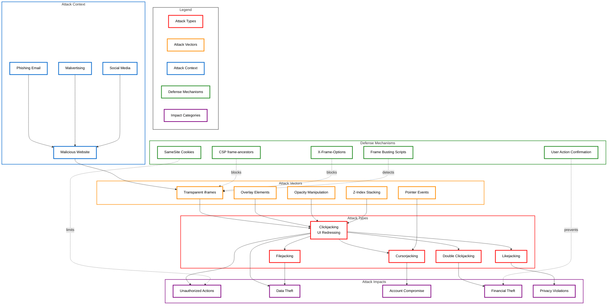

### Key Relationships

| Connection | Description |
|------------|-------------|
| **Attack Types → Variants** | Clickjacking is the parent attack with specialized variants (Likejacking, Cursorjacking, Filejacking, Double Clickjacking) targeting specific actions |
| **Vectors → Attack Types** | Transparent iframes and overlay elements are the technical enablers that make clickjacking possible |
| **Context → Vectors** | Malicious websites host the attack infrastructure; phishing emails and social media drive traffic to these sites |
| **Attack Types → Impacts** | Successful attacks result in unauthorized actions, data theft, account compromise, and financial losses |
| **Defenses → Vectors** | CSP frame-ancestors and X-Frame-Options prevent iframe embedding; frame busting detects embedding attempts |

---

## Introduction and Core Concepts

### Definition

**Clickjacking** (also known as **UI Redressing**) is a malicious technique in which an attacker tricks a user into clicking on something different from what the user perceives, potentially revealing confidential information or taking control of their computer while clicking on seemingly innocuous objects, including web pages.

The attack exploits the browser's ability to embed external content (typically through HTML iframes) and layer it invisibly over a deceptive interface. The victim believes they are interacting with a visible page but are actually clicking on hidden elements from a legitimate, targeted website where they may already be authenticated.

> [!IMPORTANT]
> Clickjacking is classified under **CWE-1021: Improper Restriction of Rendered UI Layers or Frames** and is listed in the OWASP Top 10 under **A05:2021 – Security Misconfiguration**.

### How the Attack Works

The clickjacking attack operates through a multi-layer deception technique:

1. **Target Identification**: The attacker identifies a sensitive action on a target website (e.g., "Transfer Funds", "Delete Account", "Change Email")

2. **Malicious Page Construction**: The attacker creates a web page that:
   - Embeds the target website in a transparent or hidden iframe
   - Positions the target's sensitive button directly under a visible, attractive element
   - Uses CSS properties like `opacity: 0`, `z-index`, and precise positioning

3. **Victim Luring**: The attacker lures the victim to the malicious page through:
   - Phishing emails
   - Social engineering
   - Malicious advertisements
   - Compromised websites

4. **Invisible Interaction**: When the victim clicks on the visible element (e.g., "Claim Your Prize"), they actually click on the hidden target button, executing the attacker's intended action

5. **Session Exploitation**: Since the victim is already authenticated on the target site (cookies are sent automatically), the action is executed with the victim's privileges

### Impact

Clickjacking attacks can result in severe consequences:

| Impact Category | Description | Severity |
|----------------|-------------|----------|
| **Financial Loss** | Unauthorized fund transfers, purchases, or payment authorizations | Critical |
| **Account Takeover** | Password or email changes, security setting modifications | Critical |
| **Data Breach** | Exposure of personal information, privacy violations | High |
| **Reputation Damage** | Unauthorized social media posts, likes, or follows | Medium |
| **Malware Installation** | Triggering drive-by downloads or plugin installations | High |
| **Privilege Escalation** | Granting permissions to malicious applications | High |

### Attack Vectors

Clickjacking attacks utilize various technical vectors:

| Vector | Technique | Description |
|--------|-----------|-------------|
| **Classic Clickjacking** | Transparent iframe overlay | Target site rendered in invisible iframe over malicious visible content |
| **Likejacking** | Social media targeting | Hijacking social media "Like" or "Follow" buttons for spam propagation |
| **Cursorjacking** | Cursor displacement | Displaying a fake cursor offset from the real cursor position |
| **Filejacking** | File dialog manipulation | Tricking users into selecting files for unauthorized upload |
| **Double Clickjacking** | Double-click exploitation | Using the first click to reposition elements before the second click |
| **Drag-and-Drop Hijacking** | HTML5 drag-drop abuse | Exploiting drag-and-drop operations to move data to attacker-controlled areas |
| **Stroke Jacking** | Keyboard input capture | Capturing keystrokes by focusing hidden input fields under visible buttons |

---

## Defense Principles

### Core Protection Principles

Effective clickjacking defense is built on these fundamental principles:

1. **Frame Control**: Explicitly declare whether and how your content can be embedded in frames
   - Adopt a "deny by default" approach
   - Whitelist only trusted origins when framing is legitimately required

2. **Defense in Depth**: Implement multiple layers of protection
   - Server-side headers as primary defense
   - Client-side frame detection as secondary measure
   - UI design considerations as tertiary protection

3. **Least Privilege**: Sensitive actions should require additional verification
   - Re-authentication for critical operations
   - Out-of-band confirmation for high-risk actions
   - Time-delayed or multi-step processes

4. **Session Integrity**: Ensure session context matches expected interaction patterns
   - Implement anti-CSRF tokens alongside anti-clickjacking measures
   - Use SameSite cookie attributes to limit cross-origin abuse

### When and Where to Apply Defenses

| Scenario | Recommended Defense Level | Justification |
|----------|--------------------------|---------------|
| **All pages** | CSP frame-ancestors | Baseline protection should be universal |
| **Authentication pages** | Strict deny + additional verification | Login/logout pages are high-value targets |
| **Payment/Financial actions** | Strict deny + re-authentication | Financial operations require maximum protection |
| **Account settings** | Strict deny | Settings changes can lead to account takeover |
| **Public embeddable widgets** | Selective allow with CSP | Must whitelist specific trusted origins |
| **APIs and non-UI endpoints** | Headers still recommended | Defense in depth even for non-HTML responses |

> [!WARNING]
> Clickjacking protections should be applied at the server level. Client-side-only defenses can be bypassed and should only serve as supplementary measures.

---

## Mitigation Strategies

### Primary Mitigation: Content Security Policy (CSP) frame-ancestors

The `frame-ancestors` directive in CSP is the modern, recommended approach to prevent clickjacking. It specifies valid parents that may embed a page using frame, iframe, object, or embed elements.

**How It Works**:
- Server sends CSP header with `frame-ancestors` directive
- Browser checks if the current page's parent is in the allowed list
- If not allowed, the browser refuses to render the page in the frame

**Directive Values**:

| Value | Effect |
|-------|--------|
| `'none'` | Prevents all framing (most restrictive) |
| `'self'` | Only allows framing by the same origin |
| `https://trusted.com` | Allows framing only by the specified origin |
| `https://*.trusted.com` | Allows framing by any subdomain of the specified domain |

**Advantages**:
- More flexible than X-Frame-Options
- Supports multiple origins
- Supports wildcards for subdomains
- Part of the broader CSP security framework
- Cannot be bypassed by double-framing attacks

**Limitations**:
- Not supported by very old browsers (IE 11 and below)
- Requires careful configuration to avoid breaking legitimate embedding

### Secondary Mitigation: X-Frame-Options Header

X-Frame-Options is the legacy method for clickjacking protection. While superseded by CSP frame-ancestors, it provides important backward compatibility.

**Directive Values**:

| Value | Effect |
|-------|--------|
| `DENY` | Prevents all framing |
| `SAMEORIGIN` | Only allows framing by the same origin |
| `ALLOW-FROM uri` | Allows framing only by the specified URI (deprecated, limited support) |

**Best Practice**: Deploy both headers for maximum compatibility:
- Use CSP `frame-ancestors` as primary defense
- Include X-Frame-Options as fallback for older browsers

> [!NOTE]
> When both headers are present, CSP `frame-ancestors` takes precedence in browsers that support it.

### Client-Side Defenses: Frame Busting Scripts

Frame busting scripts attempt to detect when a page is being framed and break out of the frame. While not reliable as a sole defense, they provide defense in depth.

**Common Techniques**:
- Checking `window.self !== window.top`
- Attempting to redirect the top window to the framed page
- Hiding page content when framing is detected

**Limitations**:
- Can be bypassed using iframe sandbox attributes
- May be disabled by browser extensions
- JavaScript-dependent (fails if JS is blocked)
- Double-framing attacks can circumvent simple checks

> [!CAUTION]
> Never rely on frame busting scripts as your only protection. Attackers can neutralize them using `sandbox="allow-scripts"` in the iframe, which prevents the script from accessing `window.top`.

### Additional Security Measures

| Measure | Description | Effectiveness |
|---------|-------------|---------------|
| **SameSite Cookies** | Set `SameSite=Strict` or `SameSite=Lax` to prevent cookies from being sent in cross-site framing contexts | High |
| **Re-authentication** | Require password or MFA for sensitive actions | High |
| **User Interaction Verification** | CAPTCHA or deliberate user gestures before critical actions | Medium |
| **Referrer Validation** | Check that requests originate from expected sources | Medium |
| **UI Design** | Use distinctive, hard-to-replicate interfaces for sensitive actions | Low-Medium |

### Implementation Considerations

**Priority Order for Implementation**:

1. **CSP frame-ancestors** – Primary, modern defense
2. **X-Frame-Options** – Secondary, legacy compatibility
3. **SameSite Cookies** – Session protection layer
4. **Frame Busting** – Client-side supplementary defense
5. **Re-authentication** – High-value action protection

**Configuration Recommendations**:

| Application Type | Recommended Configuration |
|------------------|---------------------------|
| Internal applications | `frame-ancestors 'none'` |
| Public websites | `frame-ancestors 'none'` or `'self'` |
| Embeddable widgets | `frame-ancestors 'self' https://allowed-partner.com` |
| API endpoints | Include headers even on non-HTML responses |

> [!TIP]
> Test your configuration using browser developer tools. Check the Network tab to verify headers are correctly sent, and use the Console to catch any CSP violation reports.

---

## Real-World Attack Scenarios

### Scenario 1: Social Media Like/Follow Hijacking

**Context**: An attacker wants to artificially inflate their social media presence by hijacking the "Follow" button on a popular social platform.

#### Attack Flow

1. Attacker creates a malicious webpage disguised as a game or contest
2. The page contains a transparent iframe loading the target social media profile
3. The "Follow" button is precisely positioned under a visible "Play Now" button
4. Victims, already logged into the social platform, click "Play Now"
5. Their click actually triggers the hidden "Follow" button
6. The victim unknowingly follows the attacker's account

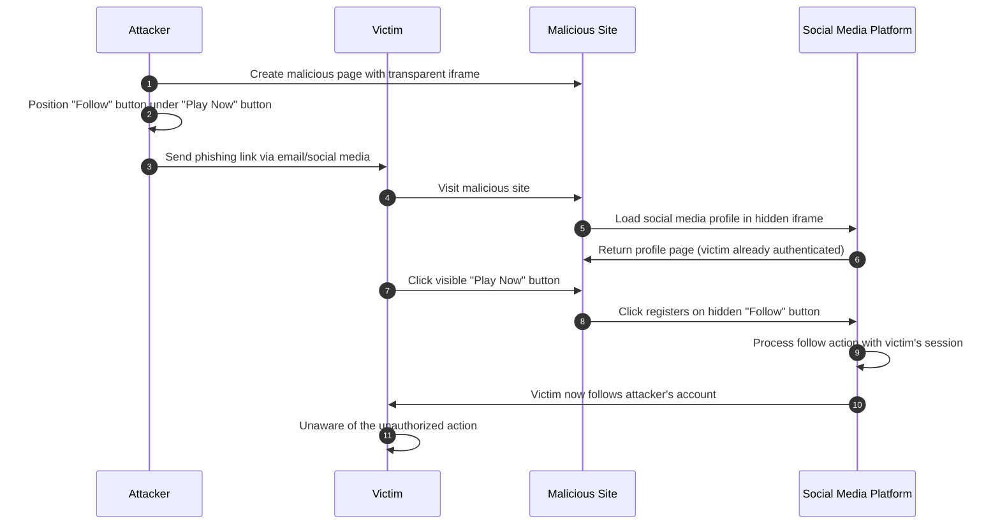

#### Mitigation Application

The social media platform implements CSP frame-ancestors to prevent their pages from being embedded:

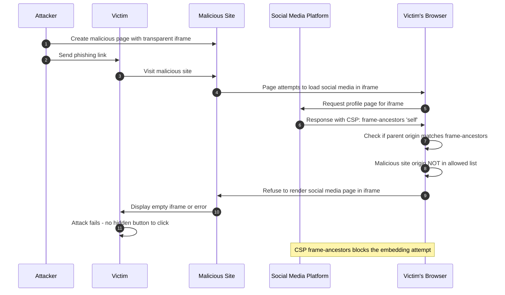

---

### Scenario 2: Banking Payment Authorization

**Context**: An attacker attempts to trick a victim into authorizing a fraudulent money transfer on their online banking portal.

#### Attack Flow

1. Attacker identifies the transfer confirmation button's position on the bank's website
2. Creates a fake "prize claim" page with the bank's transfer page in an invisible iframe
3. The "Confirm Transfer" button aligns with the "Claim $1000 Prize" button
4. Attacker pre-fills the transfer form using URL parameters or POST manipulation
5. Victim clicks to claim their "prize" but authorizes a real transfer

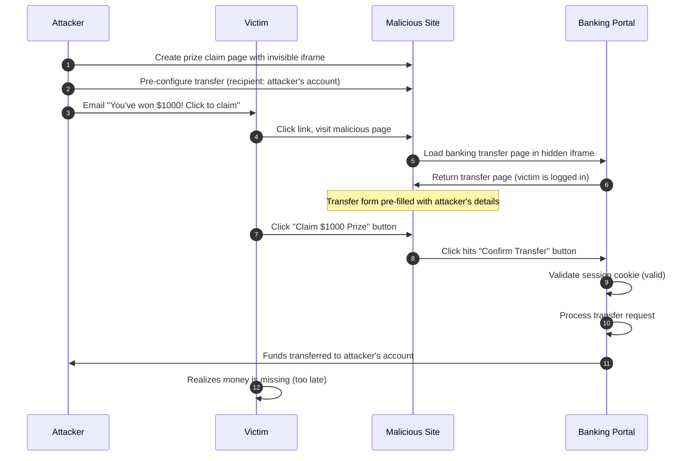

#### Mitigation Application

The bank implements multiple layers of defense:

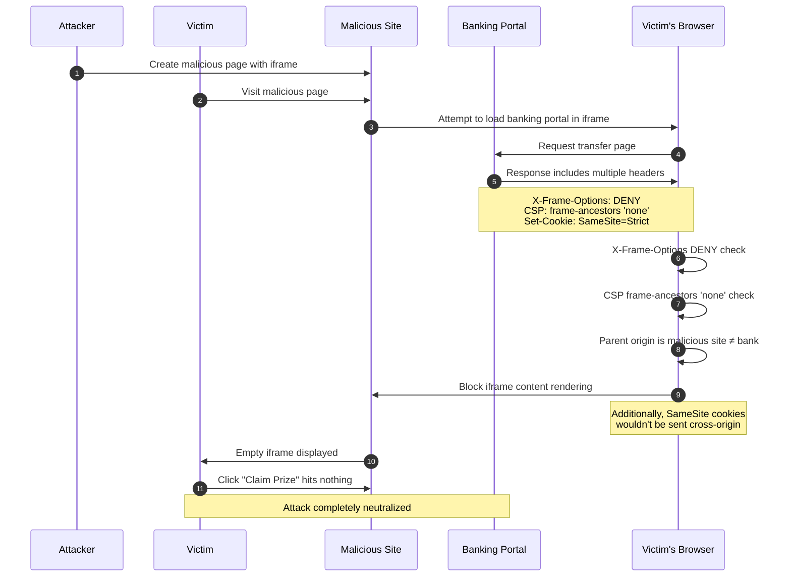

---

### Scenario 3: Account Settings Manipulation

**Context**: An attacker wants to change a victim's email address on a SaaS platform to enable subsequent account takeover via password reset.

#### Attack Flow

1. Attacker identifies the account settings page with email change functionality
2. Creates a page with a fake survey requiring multiple clicks
3. Hidden iframe contains the email settings form
4. Sequential clicks fill in the attacker's email and submit the form
5. Victim's account email is changed; attacker requests password reset

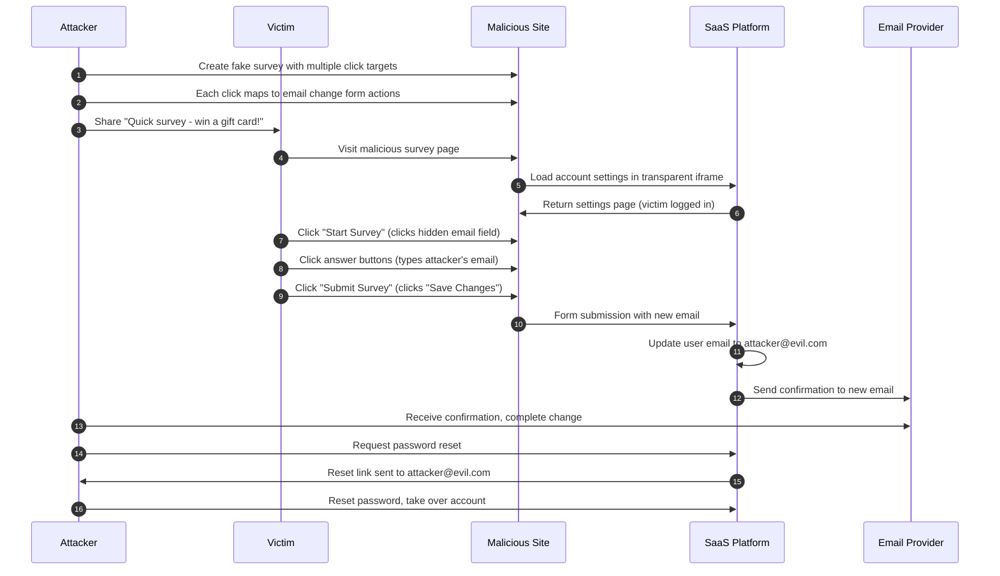

#### Mitigation Application

The SaaS platform implements comprehensive protections:

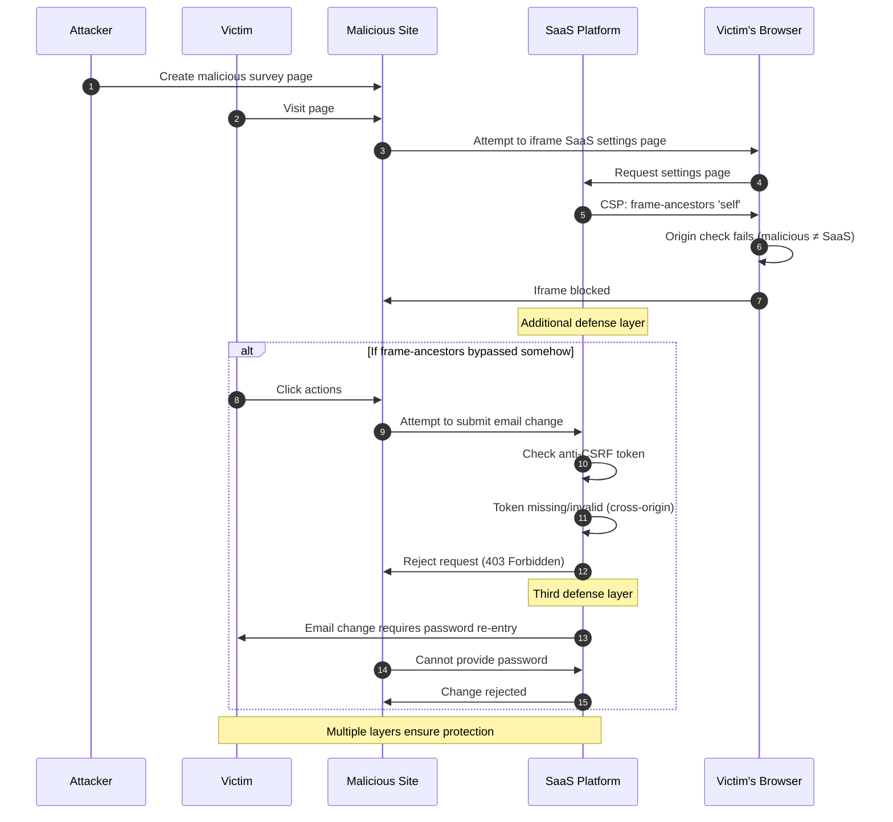

---

### Scenario 4: Multi-Step Form Submission Attack

**Context**: An attacker wants to trick a victim into submitting a multi-step form that grants OAuth permissions to a malicious application.

#### Attack Flow

1. Attacker identifies an OAuth consent flow with multiple confirmation steps
2. Creates an engaging "memory game" that requires clicking in sequence
3. Each game click corresponds to a step in the OAuth authorization flow
4. The victim completes the "game" while unknowingly granting full account access
5. Attacker's application gains access to victim's data and actions

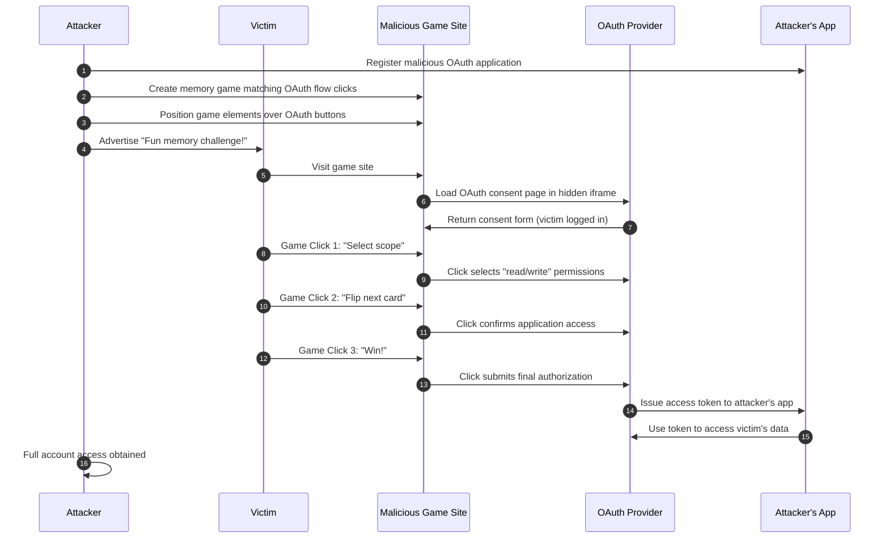

#### Mitigation Application

The OAuth provider implements robust protections:

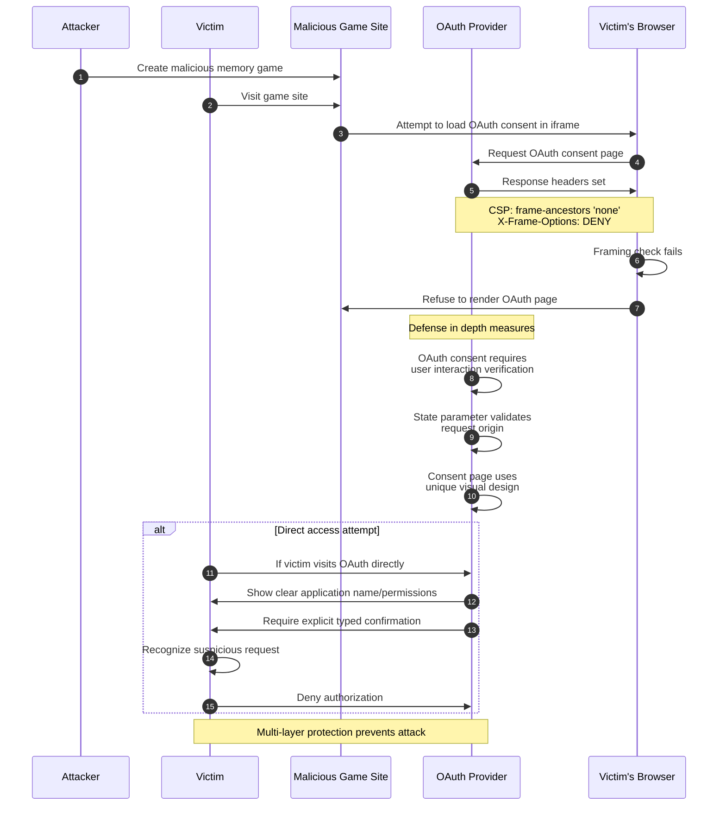

---

## Operating Techniques

This section details the operational methods used to execute clickjacking attacks, covering both standard tooling and emerging AI-driven approaches.

### Standard Approach

The standard approach relies on specialized security testing tools to automate the creation of clickjacking Proof-of-Concepts (PoCs). The most prominent industry tool for this purpose is **Burp Suite Clickbandit**.

#### Tools Used
*   **Burp Suite Professional/Community**: A comprehensive platform for web security testing.
*   **Clickbandit**: A JavaScript-based tool integrated into Burp Suite that simplifies the creation of clickjacking attacks.
*   **Web Browser**: Any modern browser (Chrome, Firefox, etc.) to render the target page.

#### Operational Instructions

The following workflow describes how to use Burp Clickbandit to generate a PoC:

1.  **Initialize Clickbandit**: In Burp Suite, navigating to the **Burp** menu and selecting **Burp Clickbandit**.
2.  **Copy Script**: Click the "Copy Clickbandit to clipboard" button in the dialog that appears.
3.  **Prepare Target**: Open your web browser and navigate to the target application page you wish to test (ensure you are authenticated if testing sensitive actions).
4.  **Inject Script**: Open the browser's Developer Tools (F12), go to the **Console** tab, paste the script, and hit Enter.
5.  **Record Actions**:
    *   A Clickbandit banner will appear at the top of the page.
    *   Click "Start" to begin recording.
    *   Perform the sequence of clicks you want the victim to execute (e.g., clicking "Delete Account", then "Confirm").
6.  **Finalize Attack**: Click "Finish" on the banner. The tool will now display an overlay of the attack structure.
7.  **Review and Adjust**:
    *   Use the transparency slider to see how the hidden iframe aligns with the decoy visible buttons.
    *   Adjust the zoom or position if necessary.
8.  **Export PoC**: Click "Save" to download the generated HTML file. This file contains the complete clickjacking attack code ready for deployment.

#### Workflow Diagram

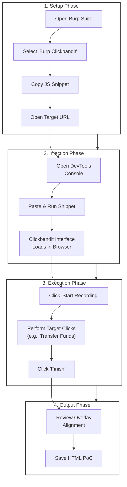

### AI Approach

The AI approach leverages Large Language Models (LLMs) and computer vision capabilities to streamline the complex manual work of positioning and CSS generation. While specific "AI Clickjacking Tools" are less standardized than defensive ones, attackers use AI agents to dynamically analyze and construct attacks.

#### Tools Used
*   **Multimodal LLMs (e.g., GPT-4o, Claude 3.5 Sonnet)**: For analyzing screenshots and DOM structures.
*   **Python with Selenium/Playwright**: For automated browser interaction and coordinate extraction.
*   **Computer Vision Libraries (OpenCV)**: For precise visual element detection.

#### Process: AI-Assisted Dynamic Analysis

In this workflow, an AI agent replaces the manual "recording" phase by analytically determining the perfect overlay coordinates.

1.  **Target Acquisition**: The attacker provides the AI agent with the target URL and the specific objective (e.g., "Click the 'Follow' button").
2.  **Visual Analysis**:
    *   The AI uses a headless browser to capture a screenshot and the DOM tree of the target page.
    *   It identifies the target element's exact pixel coordinates `(x, y)` and dimensions `(w, h)` relative to the viewport.
3.  **Context Construction**:
    *   The AI generates a "Lure Scenario" based on the target audience (e.g., a "Claim Prize" button matching the dimensions of the "Transfer" button).
4.  **Code Generation**:
    *   The AI writes the complete HTML/CSS structure, automatically calculating the negative margins and `z-index` required to center the target element under the lure.
    *   It can generate adaptive JavaScript that recalculates coordinates if the browser window is resized, a common failure point for static PoCs.
5.  **Validation**: The AI simulates a user visit to the generated page to verify the click intercepts correctly before final deployment.

#### AI-Driven Workflow Diagram

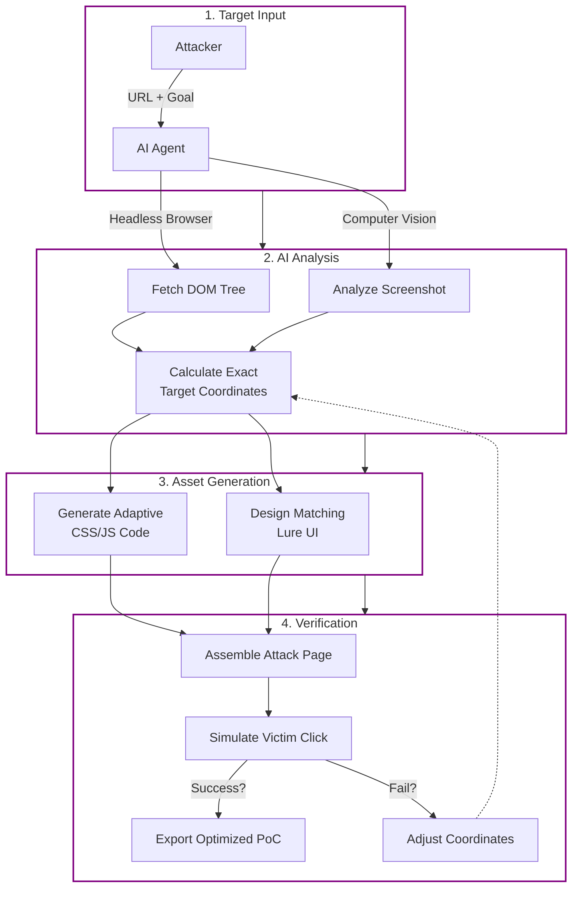

---

