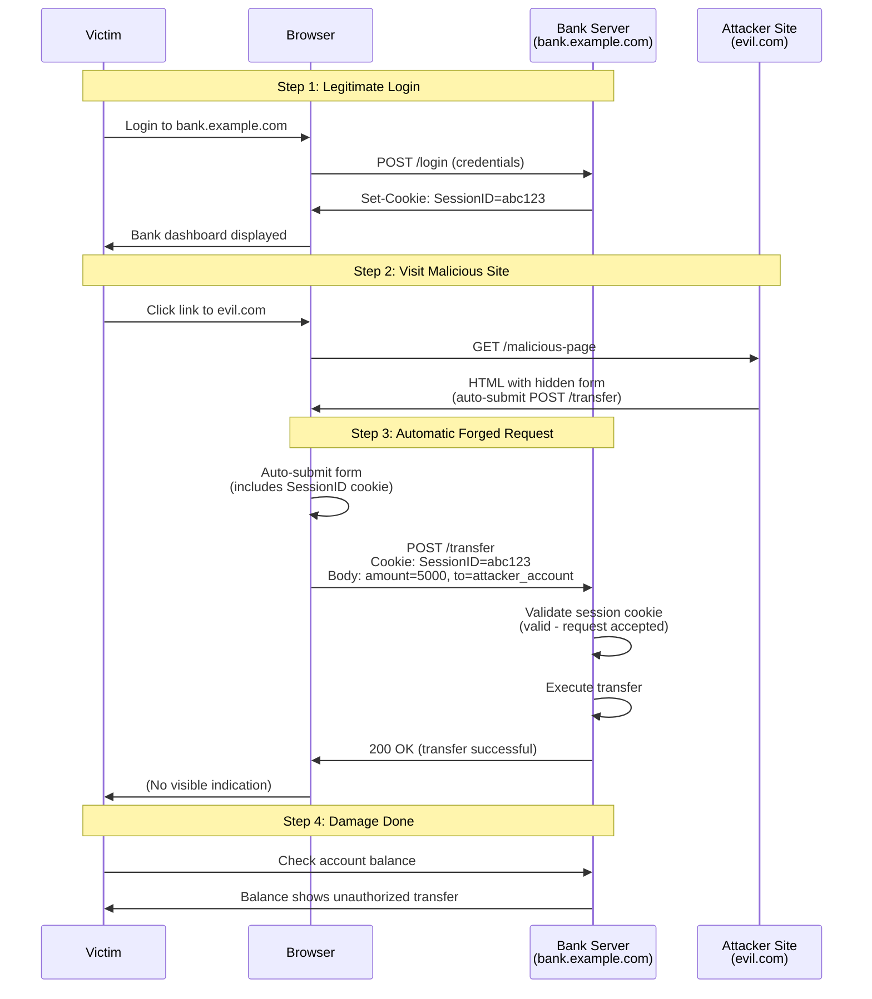
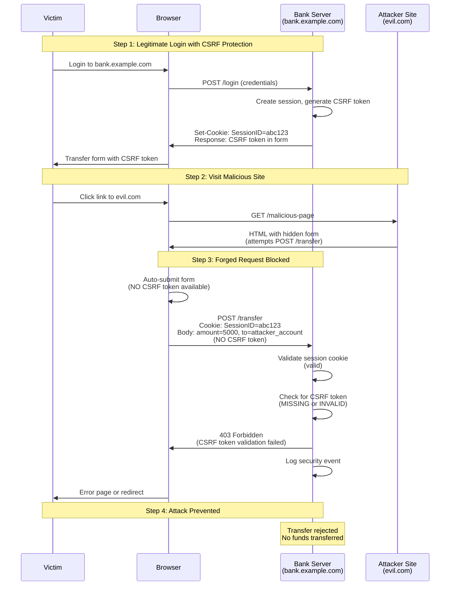
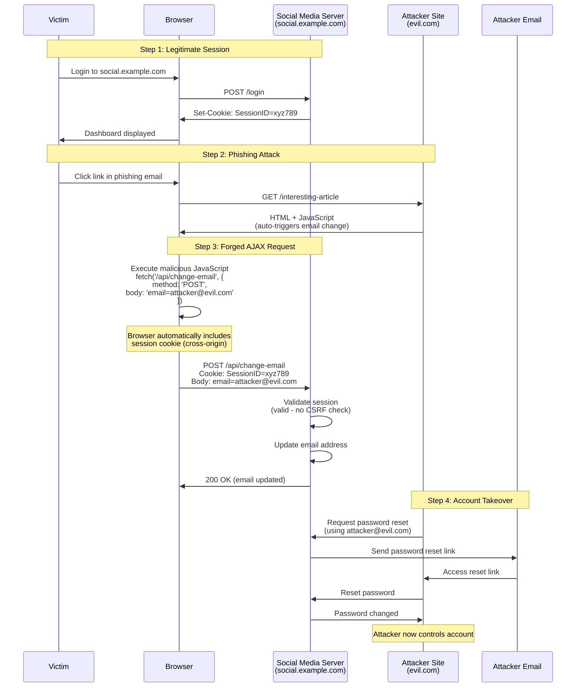
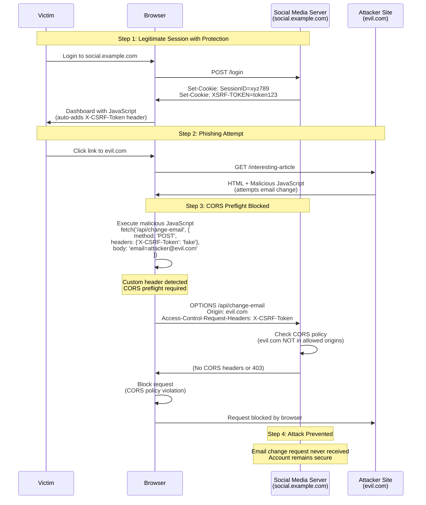
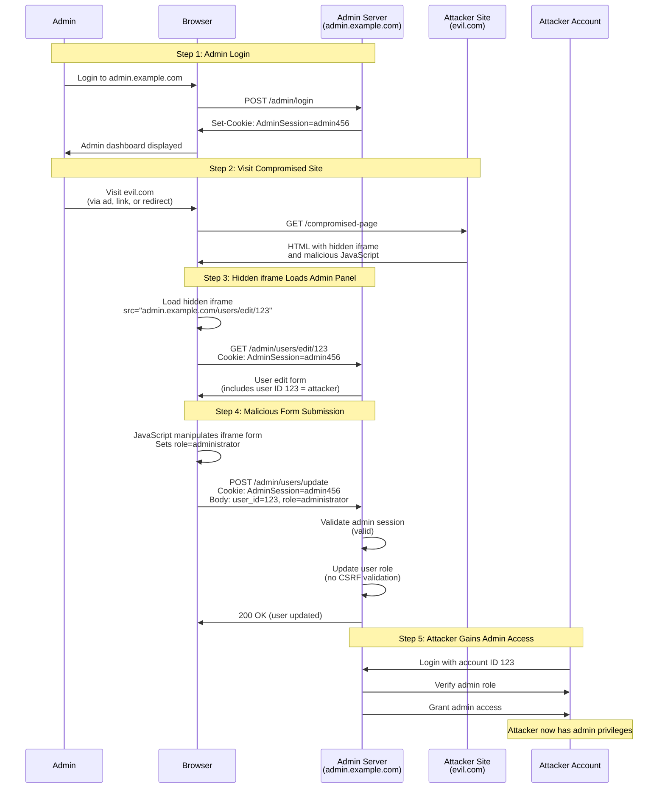
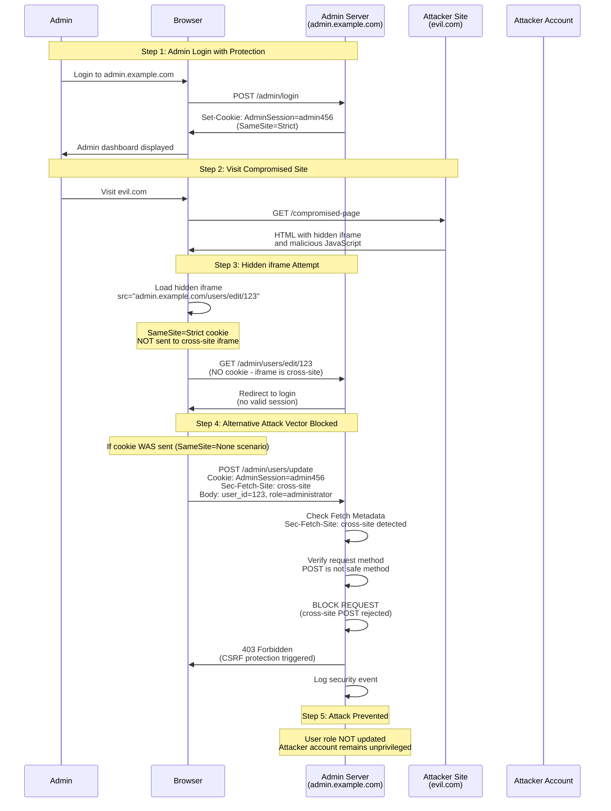

# Cross-Site Request Forgery (CSRF): Technical Security Documentation

## Table of Contents
1. [Introduction and Core Concepts](#introduction-and-core-concepts)
2. [Defense Principles](#defense-principles)
3. [Mitigation Strategies](#mitigation-strategies)
4. [Framework Implementations](#framework-implementations)
5. [Real-World Attack Scenarios](#real-world-attack-scenarios)

---

## CSRF Overview: Concepts and Relationships

The following diagram provides a high-level overview of Cross-Site Request Forgery (CSRF) concepts, attack vectors, defense mechanisms, and their interconnections:

```mermaid
flowchart TB
    subgraph AttackVectors["Attack Vectors & Delivery Methods"]
        MaliciousSite["Malicious Websites<br/>• Hidden forms<br/>• Auto-submit scripts<br/>• iframe manipulation"]
        EmailLinks["Email Links<br/>• Phishing campaigns<br/>• Click-triggered requests<br/>• Social engineering"]
        EmbeddedContent["Embedded Content<br/>• Image tags<br/>• iframe elements<br/>• Resource requests"]
        SocialMedia["Social Media<br/>• Shared links<br/>• Compromised accounts<br/>• Malicious posts"]
        XSSAssisted["XSS-Assisted CSRF<br/>• Combined vulnerabilities<br/>• Bypass protections<br/>• Enhanced attack"]
    end

    subgraph AttackFlow["Attack Flow Components"]
        UserAuth["User Authentication<br/>• Login to trusted site<br/>• Session cookie received<br/>• Active session maintained"]
        SessionPersistence["Session Persistence<br/>• Cookie in browser<br/>• Automatic inclusion<br/>• Cross-tab sharing"]
        ForgedRequest["Forged Request<br/>• Cross-origin request<br/>• Cookie automatically sent<br/>• Appears legitimate"]
        StateChange["State-Changing Action<br/>• POST/PUT/PATCH/DELETE<br/>• Unintended operation<br/>• User unaware"]
    end

    subgraph AttackTargets["Attack Targets"]
        FinancialOps["Financial Operations<br/>• Money transfers<br/>• Payments<br/>• Purchases"]
        AccountOps["Account Operations<br/>• Email changes<br/>• Password changes<br/>• Profile updates"]
        DataOps["Data Operations<br/>• Create records<br/>• Modify data<br/>• Delete content"]
        PrivilegeOps["Privilege Operations<br/>• Role changes<br/>• Permission grants<br/>• Access modifications"]
    end

    subgraph DefenseMechanisms["Defense Mechanisms"]
        SyncToken["Synchronizer Token<br/>• Server-side storage<br/>• Session-bound<br/>• Form/header validation"]
        DoubleSubmit["Double-Submit Cookie<br/>• Stateless approach<br/>• Cookie + parameter<br/>• HMAC signing"]
        FetchMetadata["Fetch Metadata Headers<br/>• Sec-Fetch-Site<br/>• Browser-provided<br/>• Cross-site detection"]
        CustomHeaders["Custom Request Headers<br/>• X-CSRF-Token<br/>• CORS preflight<br/>• AJAX-only"]
        SameSite["SameSite Cookie<br/>• Strict/Lax/None<br/>• Cross-site restriction<br/>• Defense-in-depth"]
        OriginVerify["Origin/Referer Verification<br/>• Header checking<br/>• Source validation<br/>• Fallback mechanism"]
        ReAuth["Re-Authentication<br/>• Password confirmation<br/>• High-value operations<br/>• User interaction"]
    end

    subgraph AttackImpact["Attack Impact"]
        FinancialLoss["Financial Loss<br/>Unauthorized transactions"]
        AccountCompromise["Account Compromise<br/>Credential theft"]
        DataManipulation["Data Manipulation<br/>Unauthorized changes"]
        PrivilegeEscalation["Privilege Escalation<br/>Unauthorized access"]
        ReputationDamage["Reputation Damage<br/>Identity misuse"]
    end

    %% Attack Vector to Flow
    MaliciousSite --> UserAuth
    EmailLinks --> UserAuth
    EmbeddedContent --> UserAuth
    SocialMedia --> UserAuth
    XSSAssisted --> UserAuth

    %% Attack Flow
    UserAuth --> SessionPersistence
    SessionPersistence --> ForgedRequest
    ForgedRequest --> StateChange

    %% Flow to Targets
    StateChange --> FinancialOps
    StateChange --> AccountOps
    StateChange --> DataOps
    StateChange --> PrivilegeOps

    %% Targets to Impact
    FinancialOps --> FinancialLoss
    AccountOps --> AccountCompromise
    DataOps --> DataManipulation
    PrivilegeOps --> PrivilegeEscalation
    AccountCompromise --> ReputationDamage

    %% Defense Connections
    SyncToken --> StateChange
    DoubleSubmit --> StateChange
    FetchMetadata --> ForgedRequest
    CustomHeaders --> ForgedRequest
    SameSite --> SessionPersistence
    OriginVerify --> ForgedRequest
    ReAuth --> StateChange

    %% Defense Mitigation
    SyncToken -.->|Prevents| ForgedRequest
    DoubleSubmit -.->|Prevents| ForgedRequest
    FetchMetadata -.->|Blocks| ForgedRequest
    CustomHeaders -.->|Blocks| ForgedRequest
    SameSite -.->|Restricts| SessionPersistence
    OriginVerify -.->|Validates| ForgedRequest
    ReAuth -.->|Requires| StateChange

    %% Defense Relationships
    FetchMetadata --> OriginVerify
    SyncToken --> SameSite
    DoubleSubmit --> SameSite

    %% Styling
    classDef vector fill:#ffffff,stroke:#ff6600,stroke-width:3px,color:#000000
    classDef flow fill:#ffffff,stroke:#ff0000,stroke-width:3px,color:#000000
    classDef target fill:#ffffff,stroke:#cc00cc,stroke-width:3px,color:#000000
    classDef defense fill:#ffffff,stroke:#00cc00,stroke-width:3px,color:#000000
    classDef impact fill:#ffffff,stroke:#cc00cc,stroke-width:3px,color:#000000

    class MaliciousSite,EmailLinks,EmbeddedContent,SocialMedia,XSSAssisted vector
    class UserAuth,SessionPersistence,ForgedRequest,StateChange flow
    class FinancialOps,AccountOps,DataOps,PrivilegeOps target
    class SyncToken,DoubleSubmit,FetchMetadata,CustomHeaders,SameSite,OriginVerify,ReAuth defense
    class FinancialLoss,AccountCompromise,DataManipulation,PrivilegeEscalation,ReputationDamage impact
```

### Diagram Legend

- **Orange Borders (Attack Vectors)**: Methods attackers use to deliver CSRF attacks
- **Red Borders (Attack Flow)**: The sequence of steps in a CSRF attack
- **Purple Borders (Attack Targets)**: Types of operations that can be exploited
- **Green Borders (Defense Mechanisms)**: Protection techniques that prevent or mitigate CSRF attacks
- **Purple Borders (Attack Impact)**: Potential consequences of successful CSRF attacks
- **Solid Arrows**: Data flow and attack progression
- **Dashed Arrows**: Defense mechanisms preventing specific attack steps

### Key Relationships

1. **Attack Vectors → Flow**: Different delivery methods (malicious sites, emails, embedded content) initiate the attack flow by targeting authenticated users

2. **Attack Flow → Targets**: The attack flow (authentication → session persistence → forged request → state change) enables exploitation of various operation types

3. **Targets → Impact**: Different target operations lead to specific impacts (financial operations → financial loss, account operations → account compromise)

4. **Defenses → Prevention**: Multiple defense mechanisms work at different stages:
   - **SameSite Cookie**: Prevents cookie inclusion in cross-site requests (session persistence stage)
   - **Fetch Metadata/Origin Verification**: Detects and blocks cross-site requests (forged request stage)
   - **Tokens/Custom Headers**: Validates request authenticity (forged request stage)
   - **Re-Authentication**: Requires user confirmation (state change stage)

5. **Defense-in-Depth**: The diagram shows how multiple defenses can work together, with primary defenses (tokens, Fetch Metadata) supported by secondary defenses (SameSite, Origin verification) and tertiary defenses (re-authentication)

6. **Defense Relationships**: Some defenses complement each other (Fetch Metadata with Origin verification fallback, tokens with SameSite cookies)

---

## Introduction and Core Concepts

### Definition

**Cross-Site Request Forgery (CSRF)** is a security vulnerability that occurs when a malicious website, email, blog, instant message, or program tricks an authenticated user's web browser into performing an unwanted action on a trusted site where the user is authenticated.

CSRF attacks exploit the trust that a web application has in the user's browser. Since browsers automatically include all cookies (including session cookies) with requests to a site, unprotected applications cannot distinguish between legitimate authorized requests and forged authenticated requests.

### How the Attack Works

The attack mechanism follows a simple but effective pattern:

1. **User Authentication**: A user logs into a trusted website (e.g., `bank.com`) and receives a session cookie.
2. **Session Persistence**: The session cookie remains valid in the browser.
3. **Malicious Request**: The user visits an attacker-controlled site (`evil.com`) while still authenticated to `bank.com`.
4. **Forged Request**: The attacker's site sends a request to `bank.com` that appears to come from the user's browser, automatically including the session cookie.
5. **Unintended Action**: The trusted site processes the request as legitimate, performing actions the user never intended.

The fundamental issue is that HTTP requests from a browser automatically include all cookies for the target domain, regardless of the origin of the request. This means that if a user is authenticated to `bank.com`, any request sent from any tab or window will include the authentication cookie, making it appear as if the request came from the user themselves.

### Impact

The impact of CSRF attacks depends on the capabilities exposed by the vulnerable application and the privileges of the authenticated user. Potential consequences include:

- **Financial Loss**: Unauthorized money transfers, purchases, or payments
- **Account Compromise**: Password changes, email address modifications
- **Data Manipulation**: Unauthorized data modifications, deletions, or creations
- **Privilege Escalation**: Unauthorized privilege changes for user accounts
- **Data Exfiltration**: Exposure of sensitive information
- **Reputation Damage**: Actions performed under the user's identity may harm reputation

**Important Note**: CSRF can only exploit capabilities that the application exposes. It cannot perform actions beyond what the authenticated user is authorized to do.

### Attack Vectors

CSRF attacks can be delivered through multiple vectors:

1. **Malicious Websites**: An attacker hosts malicious content that triggers state-changing requests
2. **Email Links**: Phishing emails containing links that trigger actions when clicked
3. **Embedded Content**: Images, iframes, or other resources that trigger GET requests
4. **Social Engineering**: Tricking users into visiting malicious pages through social media or messaging
5. **XSS-Assisted CSRF**: Combining XSS vulnerabilities with CSRF for more sophisticated attacks
6. **Client-Side CSRF**: Exploiting vulnerable client-side JavaScript that generates requests from attacker-controlled input

---

## Defense Principles

### Core Principles for Protection

1. **Verify Request Authenticity**: The server must verify that state-changing requests are intentional and originate from the legitimate user, not from a malicious third-party site.

2. **Defense in Depth**: Implement multiple layers of protection rather than relying on a single mechanism. This ensures that if one defense fails, others can still provide protection.

3. **Follow Safe HTTP Methods**: State-changing operations should never use safe HTTP methods (GET, HEAD, OPTIONS). These methods should be idempotent and not cause side effects.

4. **Framework-First Approach**: Always check if your framework provides built-in CSRF protection before implementing custom solutions. Built-in protections are generally more secure and well-maintained.

5. **User Experience Balance**: Security measures should not significantly degrade user experience. However, for highly sensitive operations, additional user interaction (re-authentication, one-time tokens) may be acceptable.

6. **XSS Prevention Priority**: Remember that XSS vulnerabilities can defeat CSRF protections. Always prioritize XSS prevention alongside CSRF protection.

### When and Where to Apply Defenses

#### Mandatory Protection

Apply CSRF protection to:
- All state-changing operations (POST, PUT, PATCH, DELETE)
- Authentication endpoints (including login forms to prevent login CSRF)
- APIs that accept cookies for authentication
- Any endpoint that modifies server-side state or user data

#### Protection Mechanisms by Context

- **Form-Based Applications**: Use synchronizer token pattern or double-submit cookies
- **AJAX/API Applications**: Use custom request headers or Fetch Metadata headers
- **Modern Browsers Only**: Can rely on Fetch Metadata headers with origin verification fallback
- **Stateless Applications**: Use double-submit cookie pattern (preferably signed/HMAC-based)
- **Stateful Applications**: Use synchronizer token pattern
- **Cookie-Based Authentication**: Must implement CSRF protection (tokens, SameSite, or Fetch Metadata)
- **Token-Based Authentication (JWT, Bearer tokens)**: May not require CSRF protection if tokens are not stored in cookies

#### Defense Layers

1. **Primary Defense**: Token-based protection (synchronizer or double-submit) OR Fetch Metadata headers
2. **Secondary Defense (Defense in Depth)**: SameSite cookie attribute, origin verification, custom headers
3. **Tertiary Defense (High-Value Operations)**: User re-authentication, one-time tokens

---

## Mitigation Strategies

### Primary Mitigation Techniques

#### 1. Synchronizer Token Pattern

**Description**: The server generates a unique, unpredictable token for each user session (or request). This token is included in forms or AJAX requests and validated on the server side.

**How it Works**:
- Server generates a cryptographically random token per session
- Token is stored server-side (in session) and sent to client (in HTML form or response)
- Client includes token in state-changing requests (form field or custom header)
- Server validates token matches session-stored token before processing request

**Token Requirements**:
- Unique per user session
- Secret (not guessable or enumerable)
- Unpredictable (large random value, cryptographically secure)
- Protected from exposure (not in URLs, server logs, or Referer headers)

**Advantages**:
- Strong security when properly implemented
- Works with all browsers
- Compatible with form-based and AJAX applications

**Disadvantages**:
- Requires server-side state management
- Can complicate stateless architectures
- Per-request tokens may degrade user experience (back button issues)

**Implementation Considerations**:
- Store tokens securely in session
- Transmit tokens via hidden form fields or custom headers (not cookies)
- Use constant-time comparison for token validation to prevent timing attacks
- Regenerate tokens after use for sensitive operations (optional, may impact UX)
- Never transmit tokens in GET requests or URLs

#### 2. Double-Submit Cookie Pattern

**Description**: A stateless alternative where a random value is set as both a cookie and a request parameter/header. The server verifies both values match.

**Types**:

**A. Signed Double-Submit Cookie (Recommended)**:
- Uses HMAC to cryptographically sign tokens with session-specific data
- Binds token to user's authenticated session (e.g., session ID)
- Prevents cookie injection attacks
- More secure than naive implementation

**B. Naive Double-Submit Cookie (Discouraged)**:
- Simple random value in cookie and request parameter
- Vulnerable to cookie injection attacks (subdomain takeovers)
- Not recommended for production use

**How it Works**:
1. Server generates cryptographically random value
2. Value is set as cookie (accessible via JavaScript, not HttpOnly)
3. Client reads cookie and includes value in request (parameter or header)
4. Server compares cookie value with request value
5. Request is accepted only if values match

**Advantages**:
- Stateless (no server-side storage required)
- Scalable across multiple servers
- Simple to implement

**Disadvantages**:
- Naive implementation vulnerable to cookie injection
- Requires JavaScript to read cookie (unless using form submission)
- Less secure than synchronizer token pattern without signing

**Implementation Considerations**:
- Use HMAC with session-binding for signed variant
- Cookie must not have HttpOnly flag (needs to be readable by JavaScript)
- Cookie should use Secure flag and consider SameSite attribute
- Use constant-time comparison for validation

#### 3. Fetch Metadata Headers

**Description**: Modern browsers send `Sec-Fetch-*` headers that indicate the context of the request. Servers can use `Sec-Fetch-Site` to block obvious cross-site requests.

**How it Works**:
- Browser automatically includes `Sec-Fetch-Site` header indicating request origin relationship
- Values: `same-origin`, `same-site`, `cross-site`, or `none`
- Server checks header value and blocks cross-site state-changing requests
- Requires fallback to origin verification for browsers without support

**Advantages**:
- No client-side changes required
- No token management
- Simple server-side implementation
- Works automatically with modern browsers

**Disadvantages**:
- Requires fallback for legacy browsers
- Not supported in older browsers (pre-2023)
- May require whitelisting legitimate cross-origin flows
- Can be affected by intermediaries stripping headers

**Implementation Considerations**:
- Primary signal: `Sec-Fetch-Site: cross-site` should block non-safe methods
- Require fallback to Origin/Referer verification
- Handle `same-site` carefully (only trust if subdomains are trusted)
- Allow top-level navigation GET requests
- Whitelist legitimate cross-origin API endpoints

#### 4. Custom Request Headers

**Description**: For AJAX/API applications, require a custom HTTP header in state-changing requests. CORS preflight ensures only same-origin requests can include custom headers.

**How it Works**:
- Client sets custom header (e.g., `X-CSRF-Token`) in AJAX requests
- Browser CORS preflight mechanism prevents cross-origin sites from setting custom headers
- Server validates header presence
- No token needed—header presence alone indicates legitimate request

**Advantages**:
- Simple implementation
- No token management
- No server-side state
- Works well with modern JavaScript frameworks

**Disadvantages**:
- Only works for AJAX requests (not traditional forms)
- Requires proper CORS configuration
- Vulnerable if CORS is misconfigured (allowing wildcards with credentials)

**Implementation Considerations**:
- Must configure CORS properly (specific origins, not wildcards with credentials)
- Only works for AJAX/API requests, not form submissions
- Standard header names improve compatibility (`X-CSRF-Token`, `X-XSRF-Token`)

### Alternative Approaches

#### SameSite Cookie Attribute

**Description**: Cookie attribute that controls when cookies are sent in cross-site requests.

**Values**:
- `Strict`: Cookie never sent in cross-site requests (highest security, may impact UX)
- `Lax`: Cookie sent for top-level navigation GET requests but not for POST requests (balanced security/UX)
- `None`: Cookie always sent (requires Secure flag)

**Use Cases**:
- Defense-in-depth measure alongside primary CSRF protection
- Not sufficient as sole protection (can be bypassed in some scenarios)

**Implementation Considerations**:
- Should be used in addition to other protections, not as replacement
- `Lax` is good default for session cookies
- `Strict` may require user to re-authenticate after external links
- `Secure` flag required when using `SameSite=None`

#### Origin/Referer Header Verification

**Description**: Verify that the `Origin` or `Referer` header matches the target origin.

**How it Works**:
- Server checks `Origin` header (preferred) or `Referer` header
- Compares source origin with target origin
- Blocks request if origins don't match

**Advantages**:
- Simple to implement
- Good fallback for Fetch Metadata
- Works with most modern requests

**Disadvantages**:
- Headers can be absent (privacy settings, redirects)
- May require accepting null values for compatibility
- Can be stripped by intermediaries
- Referer can be spoofed in some edge cases

**Implementation Considerations**:
- Prefer `Origin` over `Referer` when available
- Use strict string matching (prevent subdomain matching issues)
- Handle proxy scenarios (use `X-Forwarded-Host`)
- Consider accepting null values for edge cases (with risk awareness)

#### User Interaction-Based Protection

**Description**: Require explicit user interaction (re-authentication, CAPTCHA, one-time tokens) for sensitive operations.

**Use Cases**:
- High-value operations (password changes, financial transactions)
- Additional layer for critical actions
- Not suitable for all operations (impacts UX)

**Types**:
- Re-authentication: Require password confirmation
- One-time tokens: Generate time-limited tokens requiring user interaction
- CAPTCHA: Not recommended for CSRF (designed for bots, can be bypassed)

**Implementation Considerations**:
- Use only for highly sensitive operations
- Balance security with user experience
- Implement alongside other protections

### Implementation Considerations

#### Token Generation and Storage

- Use cryptographically secure random number generators
- Minimum token length: 32 bytes (256 bits) recommended
- Store tokens securely (encrypted session storage, secure database)
- Regenerate tokens periodically or after sensitive operations

#### Token Transmission

- Use hidden form fields for traditional forms
- Use custom HTTP headers for AJAX requests
- Never include tokens in URLs or GET requests
- Avoid transmitting tokens in cookies for synchronizer pattern

#### Validation

- Validate tokens on server-side only
- Use constant-time comparison functions
- Log failed validation attempts for monitoring
- Implement proper error handling (don't leak token values in errors)

#### Error Handling

- Return generic error messages (don't reveal whether token was missing or invalid)
- Log security events for analysis
- Consider rate limiting for repeated failures

#### Performance

- Cache token validation logic efficiently
- Minimize database lookups for token validation
- Consider in-memory storage for high-traffic applications

---

## Real-World Attack Scenarios

### Scenario 1: Unauthorized Bank Transfer

#### Attack Description

An attacker creates a malicious website that automatically triggers a money transfer from the victim's bank account to the attacker's account when the victim visits the site while logged into their online banking.

#### Attack Flow

1. **Victim Authentication**: The victim logs into their online banking application (`bank.example.com`) and receives a session cookie. The session remains active.

2. **Malicious Site Visit**: While still authenticated, the victim clicks a link in a phishing email or visits a malicious website (`evil.com`) that the attacker controls.

3. **Automatic Form Submission**: The malicious page contains hidden HTML form that automatically submits a POST request to the bank's transfer endpoint when the page loads.

4. **Cookie Inclusion**: The browser automatically includes the victim's session cookie with the request to `bank.example.com`, making it appear as a legitimate request from the authenticated user.

5. **Unintended Transfer**: The bank's server processes the request, seeing a valid session cookie, and executes the money transfer without additional verification.

6. **Attack Success**: Money is transferred from the victim's account to the attacker's account, and the victim may not realize until they check their account later.

#### Attack Sequence Diagram

#### Mitigation Application

To prevent this attack, the bank should implement **synchronizer token pattern**:

1. **Token Generation**: When the user loads the transfer form, the server generates a unique CSRF token and stores it in the user's session.

2. **Token Transmission**: The token is included as a hidden field in the transfer form HTML.

3. **Token Validation**: When the transfer request is submitted, the server validates that the token in the request matches the token stored in the session.

4. **Attack Blocked**: The malicious site cannot access the CSRF token (due to same-origin policy), so the forged request lacks a valid token and is rejected.

**Additional Defenses**:
- Use SameSite=Lax or Strict on session cookies
- Require re-authentication for high-value transactions
- Implement transaction limits and notifications
- Use Fetch Metadata headers as defense-in-depth

#### Mitigation Sequence Diagram

---

### Scenario 2: Account Takeover via Email Change

#### Attack Description

An attacker uses CSRF to change the victim's email address on a social media platform to an attacker-controlled email, enabling password reset and account takeover.

#### Attack Flow

1. **Victim Authentication**: The victim is logged into a social media platform (`social.example.com`) with an active session.

2. **Malicious Email**: The attacker sends a phishing email with a link that appears to be from a legitimate source or an interesting article.

3. **Malicious Page Load**: The victim clicks the link, which loads a page on `evil.com`. The page contains JavaScript that automatically sends a POST request to change the email address.

4. **AJAX Request**: The malicious JavaScript uses `fetch()` or `XMLHttpRequest` to send a POST request to the social media platform's email update endpoint.

5. **Cookie Inclusion**: The browser automatically includes the victim's session cookie with the cross-origin request.

6. **Email Changed**: The server processes the request, seeing a valid session, and updates the email address to the attacker's email without requiring confirmation.

7. **Password Reset**: The attacker uses the "forgot password" feature with their email address, receives the reset link, and takes control of the account.

#### Attack Sequence Diagram

#### Mitigation Application

To prevent this attack, the social media platform should implement **custom request headers** pattern for AJAX endpoints:

1. **Header Requirement**: The API endpoint requires a custom header (e.g., `X-CSRF-Token`) in all state-changing requests.

2. **Client-Side Header Addition**: The legitimate client-side JavaScript automatically adds this header to all AJAX requests.

3. **CORS Preflight**: Cross-origin requests with custom headers trigger a CORS preflight (OPTIONS) request.

4. **Preflight Block**: The malicious site cannot pass the CORS preflight because it's not an allowed origin, so the browser blocks the request before it's sent.

**Alternative/Additional Defenses**:
- Use Fetch Metadata headers to detect and block cross-site requests
- Require email confirmation before changing email address (user interaction)
- Implement SameSite=Strict on session cookies
- Use synchronizer token pattern if forms are involved

#### Mitigation Sequence Diagram

---

### Scenario 3: Privilege Escalation via Admin Action

#### Attack Description

An attacker exploits a CSRF vulnerability in an admin panel to grant themselves administrative privileges, allowing them to access sensitive data and perform unauthorized actions.

#### Attack Flow

1. **Admin Authentication**: A system administrator logs into the admin panel (`admin.example.com`) and maintains an active session.

2. **Malicious Site**: The attacker creates a malicious website (`evil.com`) that the admin might visit (e.g., through a compromised advertisement, link in support ticket, or social engineering).

3. **Hidden iframe**: The malicious page contains a hidden iframe that loads the admin panel's user management page.

4. **Cross-Site Request**: JavaScript in the malicious page manipulates the iframe's form to submit a request that promotes the attacker's user account to administrator role.

5. **Cookie Sent**: The browser sends the admin's session cookie with the request, making it appear as if the admin intentionally granted the privileges.

6. **Privilege Escalated**: The server processes the request and grants administrator privileges to the attacker's account.

7. **Attacker Access**: The attacker can now log in with their account and access administrative functions.

#### Attack Sequence Diagram

#### Mitigation Application

To prevent this attack, the admin panel should implement **Fetch Metadata headers** with **origin verification fallback**:

1. **Fetch Metadata Check**: The server checks the `Sec-Fetch-Site` header on all state-changing requests.

2. **Cross-Site Detection**: Requests with `Sec-Fetch-Site: cross-site` are immediately blocked for non-safe methods.

3. **Origin Verification Fallback**: For browsers without Fetch Metadata support, the server verifies the `Origin` or `Referer` header matches the target origin.

4. **Request Blocked**: The malicious request is identified as cross-site and rejected before any state change occurs.

**Additional Critical Defenses for Admin Panels**:
- Require re-authentication for privilege changes
- Implement synchronizer token pattern (most secure for admin functions)
- Use SameSite=Strict on admin session cookies
- Implement audit logging for all privilege changes
- Require user interaction (not just automatic form submission)

#### Mitigation Sequence Diagram

---

## Additional Resources

### Standards and Specifications

- **OWASP CSRF Prevention Cheat Sheet**: Comprehensive guide on CSRF prevention
- **CWE-352**: Cross-Site Request Forgery (CSRF) vulnerability classification
- **RFC 6265bis**: HTTP State Management Mechanism (SameSite attribute)
- **W3C Fetch Metadata**: Specification for Sec-Fetch-* headers

### Testing and Validation

- Use browser developer tools to inspect requests and headers
- Test CSRF protection with tools like Burp Suite or OWASP ZAP
- Verify token validation and error handling
- Test with different browsers and versions
- Validate SameSite cookie behavior

### Best Practices Summary

1. **Always use framework-built-in protection when available**
2. **Implement defense in depth** - multiple layers of protection
3. **Protect all state-changing operations** - POST, PUT, PATCH, DELETE
4. **Never use GET for state changes** - even if protected
5. **Prioritize XSS prevention** - XSS can bypass CSRF protections
6. **Use HTTPS everywhere** - required for secure cookies and headers
7. **Implement proper error handling** - don't leak token information
8. **Log security events** - monitor for CSRF attack attempts
9. **Keep dependencies updated** - framework CSRF protections improve over time
10. **Test regularly** - include CSRF protection in security testing

---

## Conclusion

Cross-Site Request Forgery is a serious web application vulnerability that can lead to unauthorized actions, data breaches, and account compromise. Understanding the attack mechanism, implementing appropriate defenses, and following framework best practices are essential for protecting web applications.

The key to effective CSRF protection lies in:
- Choosing the right mitigation strategy for your application architecture
- Implementing multiple layers of defense
- Staying updated with framework capabilities and browser security features
- Regularly testing and validating protection mechanisms

Remember that no single defense is perfect, and a defense-in-depth approach provides the strongest protection against CSRF attacks.

