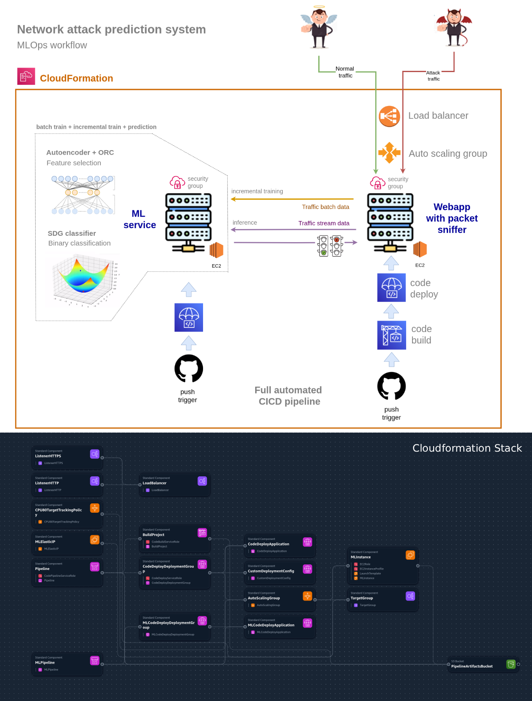
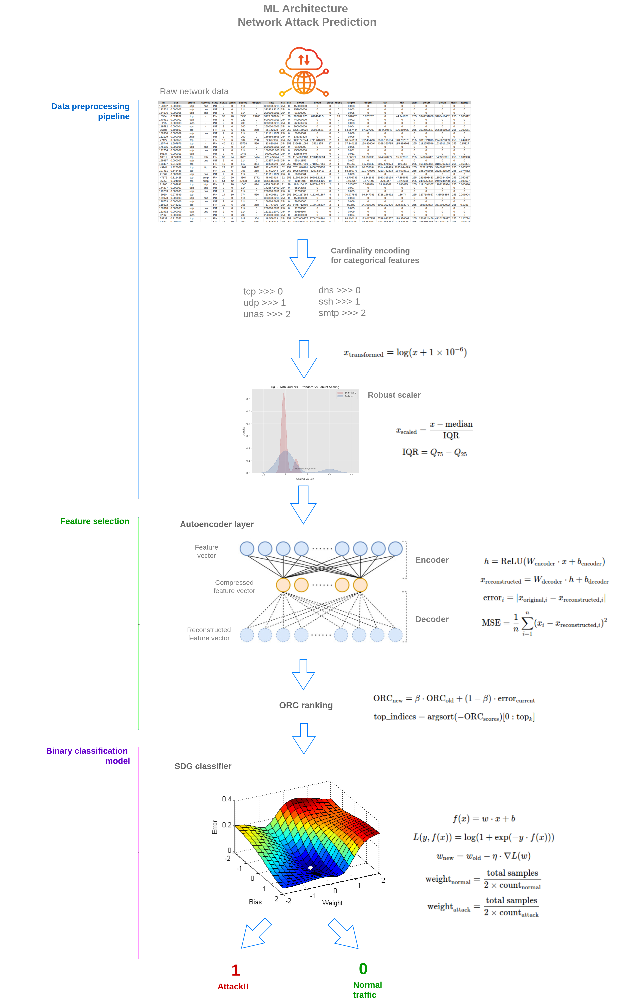

# 🛡️ ML Cyber Attack Prediction System

## 📺 Video Tutorial
**[Watch the Complete Video Tutorial on YouTube](https://youtu.be/3-mH1ynRf7U)** - Step-by-step guide for setting up and deploying the entire system.

## 🌟 Project Overview

The **ML Cyber Attack Prediction System** is a comprehensive, cloud-native solution for real-time network traffic analysis and cyber attack detection using machine learning. This enterprise-grade system combines cutting-edge ML algorithms with scalable AWS infrastructure to provide robust network security monitoring and threat prediction capabilities.

### 🎯 Key Features

- **Real-time Network Monitoring**: Captures and analyzes live network traffic flows
- **Machine Learning-based Detection**: Uses AutoEncoder anomaly detection with SGD classification
- **Auto-scaling Infrastructure**: Automatically scales based on traffic load
- **Continuous Deployment**: Automated CI/CD pipelines for seamless updates
- **Web Dashboard**: Modern Next.js interface for monitoring and management
- **High Availability**: Load-balanced architecture with multi-AZ deployment

### 🏗️ System Architecture

The system consists of two main components working in tandem:

```
┌─────────────────────────────────────────────────────────────────┐
│                    ML Cyber Attack Prediction System            │
├─────────────────────────────────────────────────────────────────┤
│                                                                  │
│  ┌──────────────────┐         ┌──────────────────────┐         │
│  │   monitor-app    │  HTTP   │     ml-service       │         │
│  │                  │  API    │                      │         │
│  │ • Next.js UI     ├────────►│ • Flask ML API       │         │
│  │ • Network Agent  │         │ • AutoEncoder        │         │
│  │ • Scapy Capture  │         │ • Attack Classifier  │         │
│  └──────────────────┘         └──────────────────────┘         │
│         ▲                              ▲                        │
│         │                              │                        │
│  ┌──────┴──────────────────────────────────────────┴──────┐                │
│  │         AWS Infrastructure (CloudFormation)  │                │
│  │  • Application Load Balancer                │                │
│  │  • Auto Scaling Groups                      │                │
│  │  • CodePipeline CI/CD                       │                │
│  └──────────────────────────────────────────────────────────────┘                │
└─────────────────────────────────────────────────────────────────┘
```

### 📊 System Workflow



The diagram above illustrates the complete data flow and deployment pipeline of the ML Cyber Attack Prediction System, showing how network traffic is captured, processed, and analyzed for threat detection.

## 📁 Project Structure

```
CyberAttackPrediction/
├── CF_NETWORK_ATTACK_PREDICTION.yml  # CloudFormation infrastructure template
├── monitor-app/                       # Network monitoring & web dashboard
│   ├── app/                          # Next.js application
│   ├── network_agent/                # Python network traffic capture agent
│   └── code-deploy-scripts/          # Deployment automation scripts
├── ml-service/                        # Machine learning prediction service
│   ├── ml_ec2_service.py            # Flask API server
│   ├── modules/                      # ML pipeline components
│   ├── artifacts/                    # Trained models storage
│   └── code-deploy-scripts/          # Deployment automation scripts
└── README.md                          # This file
```

## 🚀 One-Click AWS Deployment

This project includes a comprehensive **AWS CloudFormation template** (`CF_NETWORK_ATTACK_PREDICTION.yml`) that automates the entire infrastructure setup with just a few clicks!

### What Gets Deployed

The CloudFormation template automatically provisions:

#### Infrastructure Components
- **Application Load Balancer (ALB)** with HTTPS/HTTP listeners
- **Auto Scaling Groups** for high availability
- **EC2 Instances** with Ubuntu 22.04 LTS
- **Target Groups** with health checks
- **Security configurations** and IAM roles

#### CI/CD Pipeline
- **2 CodePipeline pipelines** (one for each service)
- **CodeBuild** projects for application building
- **CodeDeploy** applications for automated deployments
- **S3 buckets** for artifact storage
- **GitHub integration** via AWS CodeStar Connections

### 📋 Prerequisites

Before deploying, you'll need:

1. **AWS Account** with appropriate permissions
2. **Existing VPC** with public subnets
3. **Security Groups** configured for web traffic
4. **ACM Certificate** for HTTPS (optional)
5. **EC2 Key Pair** for SSH access
6. **Two GitHub Repositories** (details below)

## 🔧 Deployment Instructions

### Step 1: Prepare GitHub Repositories

You need to create **two separate GitHub repositories**:

1. **Repository 1: monitor-app**
   - Name: `your-monitor-app-repo`
   - Contains: All files from the `monitor-app/` directory
   - Branch: `master` (or your preferred branch)

2. **Repository 2: ml-service**
   - Name: `your-ml-service-repo`
   - Contains: All files from the `ml-service/` directory
   - Branch: `master` (or your preferred branch)

### Step 2: Set Up AWS CodeStar Connection

1. Go to AWS CodePipeline → Settings → Connections
2. Create a new connection to GitHub
3. Authorize AWS to access your GitHub repositories
4. Note the Connection ARN for the CloudFormation parameters

### Step 3: Deploy CloudFormation Stack

1. Open AWS CloudFormation Console
2. Click "Create Stack" → "With new resources"
3. Upload the `CF_NETWORK_ATTACK_PREDICTION.yml` template
4. Configure the parameters (see below)
5. Review and create the stack

### 📝 CloudFormation Parameters

Replace the example values below with your actual AWS resource IDs:

```yaml
Parameters:
  # Network Configuration
  VpcId:
    Default: vpc-EXAMPLE123456  # Replace with your VPC ID
    
  SubnetIds:
    Default: "subnet-EXAMPLE1,subnet-EXAMPLE2,subnet-EXAMPLE3"  # Your public subnets
    
  ALBSecurityGroupId:
    Default: sg-EXAMPLE789  # Your security group allowing ports 80 & 443
    
  # SSL Certificate (Optional - for HTTPS)
  ACMCertificateArn:
    Default: arn:aws:acm:region:account:certificate/EXAMPLE-CERT-ID  # Your ACM certificate
    
  # EC2 Configuration
  KeyPairName:
    Default: your-keypair-name  # Your EC2 key pair for SSH access
    
  InstanceType:
    Default: t3a.medium  # Instance type for monitor-app
    
  MlInstanceType:
    Default: t3a.medium  # Instance type for ml-service
    
  RootVolumeSize:
    Default: 36  # GB for monitor-app instances
    
  MLRootVolumeSize:
    Default: 36  # GB for ml-service instance
    
  # GitHub Integration
  CodeStarConnectionArn:
    Default: arn:aws:codeconnections:region:account:connection/YOUR-CONNECTION-ID
    
  RepositoryOwner:
    Default: your-github-username  # Your GitHub username or organization
    
  RepositoryName:
    Default: your-monitor-app-repo  # Repository name for monitor-app
    
  MLRepositoryName:
    Default: your-ml-service-repo  # Repository name for ml-service
    
  BranchName:
    Default: master  # Branch to track for monitor-app
    
  MLBranchName:
    Default: master  # Branch to track for ml-service
```

### Step 4: Post-Deployment Configuration

After the CloudFormation stack completes (typically 10-15 minutes):

1. **Access the Application**
   - Find the ALB DNS name in CloudFormation Outputs
   - Navigate to `https://your-alb-dns.amazonaws.com`

2. **Configure ML Service Endpoint**
   - Update `monitor-app/network_agent/network_monitor_agent.py` with the ML service IP
   - The ML service runs on port 8080 on a dedicated EC2 instance

3. **Train Initial Models** (if needed)
   - SSH into the ML instance
   - Run the batch training script as documented in `ml-service/README.md`

## 🔄 Continuous Deployment

Once deployed, the system features automatic continuous deployment:

### How It Works

1. **Push to GitHub** → Triggers CodePipeline
2. **CodePipeline** → Fetches source code
3. **CodeBuild** → Builds the application (for monitor-app)
4. **CodeDeploy** → Deploys to EC2 instances
5. **Auto Scaling** → Maintains availability during deployment

### Deployment Triggers

- **monitor-app**: Push to configured branch triggers web app deployment
- **ml-service**: Push to configured branch triggers ML service deployment

Both pipelines operate independently, allowing separate update cycles for each component.

## 💻 Local Development

For local development and testing, refer to:
- [monitor-app README](monitor-app/README.md) - Setup instructions for the monitoring application
- [ml-service README](ml-service/README.md) - Setup instructions for the ML service

## 🛠️ Component Details

### Monitor App
- **Technology**: Next.js 22.x, TypeScript, Python 3.8+
- **Features**: 
  - Real-time packet capture using Scapy
  - Network flow analysis and feature extraction
  - RESTful API for health checks
  - Modern responsive web interface

### ML Service
- **Technology**: Python Flask, Scikit-learn, NumPy
- **ML Pipeline**:
  - AutoEncoder for anomaly detection
  - ORC (Online Reconstruction Control) for feature selection
  - SGD Classifier for attack prediction
  - Incremental learning capabilities

#### 🧠 Machine Learning Architecture



The ML pipeline implements a sophisticated multi-stage approach:
1. **Data Preprocessing**: Handles mixed numerical/categorical data with automatic encoding and scaling
2. **Feature Engineering**: AutoEncoder learns normal traffic patterns and reduces dimensionality
3. **Feature Selection**: ORC dynamically selects the most relevant features for classification
4. **Classification**: Optimized SGD classifier makes final attack/normal predictions
5. **Incremental Learning**: Models continuously improve with new labeled data

### Infrastructure
- **High Availability**: Multi-AZ deployment with auto-scaling
- **Security**: HTTPS termination at ALB, IAM roles, security groups
- **Monitoring**: CloudWatch integration, health checks
- **Cost Optimization**: Auto-scaling based on CPU utilization

## 📊 System Capabilities

- **Real-time Analysis**: Processes network flows as they occur
- **Attack Detection**: Identifies various types of network attacks
- **Scalability**: Handles traffic spikes with auto-scaling
- **Reliability**: 99.9% uptime with load balancing
- **Performance**: Sub-second prediction response times

## 🔐 Security Considerations

- All traffic encrypted with TLS 1.3
- IAM roles follow least-privilege principle
- Network isolation with VPC and security groups
- Regular security updates via CI/CD pipeline
- Sensitive data never stored in code

## 📈 Monitoring & Logs

- **CloudWatch Metrics**: CPU, memory, network metrics
- **Application Logs**: Available in CloudWatch Logs
- **Deployment History**: Tracked in CodeDeploy console
- **Health Checks**: Automated at ALB and instance levels

## 🤝 Contributing

1. Fork the appropriate repository
2. Create a feature branch
3. Commit your changes
4. Push to your fork
5. Create a Pull Request

## 📄 License

This project is part of an educational cyber security initiative.

## 🆘 Support & Troubleshooting

### Common Issues

1. **Stack Creation Fails**
   - Verify all parameter values are correct
   - Check IAM permissions
   - Ensure resources (VPC, subnets) exist

2. **Pipeline Fails**
   - Verify GitHub connection is active
   - Check repository names and branches
   - Review CodeBuild logs in CloudWatch

3. **Application Not Accessible**
   - Check security group rules
   - Verify health check configuration
   - Review instance logs

### Getting Help

- Check component-specific READMEs for detailed documentation
- Review CloudFormation events for deployment issues
- Monitor CloudWatch logs for application errors
- Consult AWS documentation for service-specific guidance

## 🎓 Educational Purpose

This system is designed for educational purposes to demonstrate:
- Modern cloud-native architecture
- Machine learning in cybersecurity
- Infrastructure as Code practices
- CI/CD pipeline implementation
- Real-world network security monitoring

---

**Note**: Remember to never commit sensitive information like AWS credentials, API keys, or passwords. Use AWS Secrets Manager or Parameter Store for sensitive configuration.
