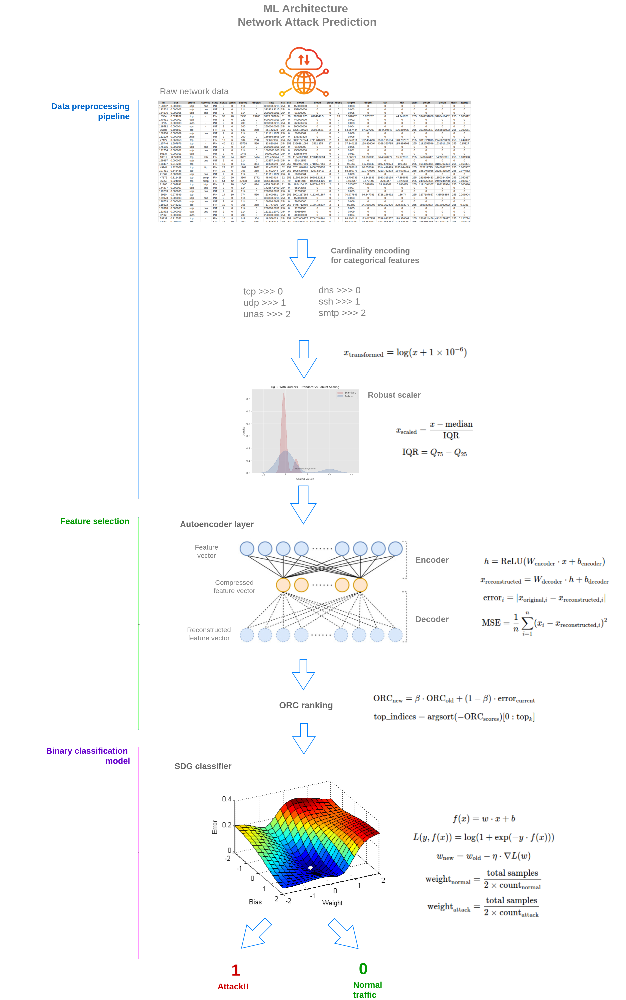

# 🛡️ Cyber Attack Prediction ML Service

## 📺 Video Tutorial
**[Watch the Complete Video Tutorial on YouTube](https://youtu.be/3-mH1ynRf7U)** - Full walkthrough of the ML Cyber Attack Prediction System setup and deployment.

## 📋 Project Overview

This is a machine learning service designed for real-time network attack prediction and detection. The service implements a sophisticated ML pipeline that processes network traffic metrics and predicts whether the traffic represents normal behavior or a potential cyber attack.

**This project works in conjunction with the `monitor-app` project** located in the parent directory. The complete system architecture consists of:
- **monitor-app**: Captures real-time network flow data and sends it to this ML service
- **ml-service** (this project): Processes the flow data for predictions and incremental training

### System Architecture:
```
┌─────────────────┐         ┌──────────────────┐
│   monitor-app   │  HTTP   │    ml-service    │
│                 │  API    │                  │
│ Network Agent   ├────────►│  Flask API       │
│ (Scapy-based)   │ Request │  - /predict      │
│                 │         │  - /train        │
└─────────────────┘         └──────────────────┘
     Captures                    Processes
   Network Flows              & Predicts Attacks
```

### Key Features:
- **AutoEncoder-based anomaly detection** for learning normal traffic patterns
- **Online Reconstruction Control (ORC)** for dynamic feature selection
- **SGD Classifier** with incremental learning capabilities
- **Flask REST API** for real-time predictions and model training
- **Batch training** for initial model creation from historical data
- **Incremental training** for continuous model improvement with streaming data
- **Integration with monitor-app** for real-time network flow analysis

### ML Pipeline Components:
1. **Data Preprocessing**: Handles mixed data types (numerical/categorical) with automatic encoding and scaling
2. **Feature Selection**: AutoEncoder + ORC reduces dimensionality by selecting most relevant features
3. **Classification**: SGD classifier with optimized threshold for attack detection
4. **Real-time API**: HTTP endpoints for predictions, training, and health monitoring

### 🧠 ML Pipeline Architecture:


The diagram above illustrates the sophisticated multi-stage machine learning pipeline that powers the attack detection system. Each stage is optimized for real-time processing while maintaining high accuracy in identifying network threats.

---

## 🚀 Local Development Setup

### Prerequisites
- Python 3.8 or higher
- pip package manager
- Virtual environment (venv)

### Step 1: Create and Activate Virtual Environment

```bash
# Navigate to the ml-service directory
cd ml-service/

# Create a virtual environment
python3 -m venv venv

# Activate the virtual environment
# On Linux/Mac:
source venv/bin/activate

# On Windows:
venv\Scripts\activate
```

### Step 2: Install Dependencies

```bash
# With virtual environment activated
pip install -r requirements.txt
```

### Step 3: Prepare Dataset (Optional)

If you have training data, place your CSV files in the `dataset/` directory:
- `dataset/UNSW_NB15_train.csv` - Training data
- `dataset/UNSW_NB15_test.csv` - Testing data

---

## 💻 Running the Project Locally

You have two options for local development:

### Option 1: Run the Flask ML Service

This starts the web service with HTTP endpoints for predictions and training:

```bash
# Make sure virtual environment is activated
source venv/bin/activate  # Linux/Mac
# or
venv\Scripts\activate  # Windows

# Start the Flask service
python ml_ec2_service.py
```

The service will start on `http://localhost:8080` with the following endpoints:
- `GET /` - Service information
- `GET /health` - Health check endpoint
- `POST /predict` - Make attack predictions
- `POST /train` - Incremental training with new data
- `GET /training-status` - Get current training status

#### Testing the Service:
```bash
# Health check
curl http://localhost:8080/health

# Make a prediction (example)
curl -X POST http://localhost:8080/predict \
  -H "Content-Type: application/json" \
  -d '{"srcip": "192.168.1.100", "feature1": 0.5, "feature2": 1.2}'
```

### Option 2: Run Batch Training Manually

This option allows you to train models from scratch using historical data:

```bash
# Make sure virtual environment is activated
source venv/bin/activate  # Linux/Mac
# or
venv\Scripts\activate  # Windows

# Run batch training
python batch_train.py
```

#### Configuring Batch Training:
Edit the `batch_train.py` file at the bottom to control execution:
```python
if __name__ == '__main__':
    execute_training = True   # Set to True to train new models
    execute_test = True       # Set to True to test models after training
```

The batch training will:
1. Load and analyze your dataset
2. Preprocess and balance the data
3. Train AutoEncoder, ORC feature selector, and SGD classifier
4. Calculate optimal attack threshold
5. Save trained models to `artifacts/` directory
6. Run comprehensive testing if enabled

---

## 🔧 Configuration

All configuration parameters are centralized in `config.py`. Key settings include:

- **Data paths**: Location of training/testing datasets
- **Feature selection**: Enable/disable AutoEncoder + ORC
- **Model parameters**: Hidden layer sizes, learning rates, thresholds
- **Training settings**: Batch sizes, balancing, optimization

---

## 🔗 Integration with Monitor App

### How the System Works Together

The **monitor-app** and **ml-service** work as a complete cyber attack detection system:

1. **monitor-app/network_agent** (Network Monitoring):
   - Captures live network packets using Scapy
   - Extracts flow features from network traffic
   - Groups packets by flow (5-tuple: src_ip, dst_ip, src_port, dst_port, protocol)
   - Sends flow data to ml-service via HTTP API

2. **ml-service** (ML Processing):
   - Receives flow data from monitor-app
   - Processes features through the ML pipeline
   - Returns predictions (normal/attack) for each flow
   - Updates models incrementally with new training data

### Running Both Services Together

#### Step 1: Start the ML Service
```bash
cd ml-service/
source venv/bin/activate
python ml_ec2_service.py
# Service runs on http://localhost:8080
```

#### Step 2: Start the Monitor App's Network Agent
```bash
cd ../monitor-app/network_agent/
sudo python3 network_monitor_agent.py \
    --ml-host localhost \
    --ml-port 8080 \
    --mode predict \
    --interface eth0
```

### API Communication Flow

```
monitor-app                     ml-service
    │                               │
    ├─[Capture packets]             │
    ├─[Extract features]            │
    ├─[Create flow JSON]            │
    │                               │
    ├──POST /predict────────────────►
    │   {flow_features}             │
    │                               ├─[Preprocess]
    │                               ├─[Feature selection]
    │                               ├─[Classify]
    │                               │
    ◄──Response─────────────────────┤
       {prediction: 0/1,            │
        probability: 0.xx}          │
```

### Training Mode Integration

The monitor-app can also send labeled flow data for incremental training:

```bash
# Run network agent in training mode
sudo python3 network_monitor_agent.py \
    --ml-host localhost \
    --ml-port 8080 \
    --mode train \
    --interface eth0 \
    --label-file labels.json
```

This sends batches of labeled flows to `/train` endpoint for model updates.

---

## 📦 AWS CodeDeploy Integration

This project is configured for automated deployment using AWS CodeDeploy. The deployment process is triggered when code is pushed to the master branch of your Git repository.

### Deployment Files:
- `appspec.yml` - CodeDeploy application specification
- `code-deploy-scripts/` - Deployment lifecycle scripts
  - `before_install.sh` - Pre-installation cleanup
  - `install.sh` - Installation steps
  - `after_install.sh` - Post-installation configuration
  - `start_app.sh` - Start the ML service
  - `stop_app.sh` - Stop the ML service
  - `validate_service.sh` - Health check validation

---

## 🔄 Git Setup and Repository Integration

Follow these steps to set up Git and connect to your remote repository to trigger the CodeDeploy pipeline:

### Step 1: Install Git

#### On Ubuntu/Debian:
```bash
sudo apt update
sudo apt install git
```

#### On CentOS/RHEL/Amazon Linux:
```bash
sudo yum install git
```

#### On macOS:
```bash
# Using Homebrew
brew install git

# Or download from https://git-scm.com/download/mac
```

#### On Windows:
Download and install from: https://git-scm.com/download/win

### Step 2: Configure Git

```bash
# Set your name and email
git config --global user.name "Your Name"
git config --global user.email "your.email@example.com"

# Verify configuration
git config --list
```

### Step 3: Initialize Local Repository

```bash
# Navigate to the project root (parent of ml-service)
cd /home/samuele/Progetti\ didattici/CyberAttackPrediction/

# Initialize git repository if not already initialized
git init

# Add all files to staging
git add .

# Create initial commit
git commit -m "Initial commit: ML service for cyber attack prediction"
```

### Step 4: Create Remote Repository

1. Go to your Git provider (GitHub, GitLab, Bitbucket, AWS CodeCommit)
2. Create a new repository named `CyberAttackPrediction`
3. Don't initialize with README, .gitignore, or license (since we already have files)
4. Copy the repository URL (HTTPS or SSH)

### Step 5: Connect to Remote Repository

```bash
# Add remote repository (replace with your repository URL)
# For GitHub:
git remote add origin https://github.com/yourusername/CyberAttackPrediction.git

# Or for AWS CodeCommit:
git remote add origin https://git-codecommit.region.amazonaws.com/v1/repos/CyberAttackPrediction

# Verify remote
git remote -v
```

### Step 6: Push to Master Branch

```bash
# Push to master branch (this will trigger CodeDeploy pipeline)
git push -u origin master

# If the remote has 'main' instead of 'master':
git branch -M main
git push -u origin main
```

### Step 7: Subsequent Updates

After the initial setup, pushing updates is simple:

```bash
# Make your changes
# ... edit files ...

# Stage changes
git add .

# Commit with descriptive message
git commit -m "Add new feature: enhanced attack detection algorithm"

# Push to trigger deployment
git push origin master
```

---

## 📊 Monitoring Deployment

Once you push to master, the CodeDeploy pipeline will automatically:
1. Detect the new commit
2. Download the code to your EC2 instances
3. Execute the deployment scripts in order
4. Start the ML service
5. Validate the deployment

You can monitor the deployment status in:
- AWS CodeDeploy Console
- CloudWatch Logs
- EC2 instance logs at `/var/log/`

---

## 🐛 Troubleshooting

### Virtual Environment Issues
```bash
# If venv is not working, try:
python3 -m pip install --upgrade pip
python3 -m venv venv --clear
```

### Port Already in Use
```bash
# Find process using port 8080
lsof -i :8080
# Kill the process
kill -9 <PID>
```

### Model Loading Errors
- Ensure `artifacts/` directory exists
- Check if models are trained: Run `batch_train.py` first
- Verify file permissions

### Git Push Issues
```bash
# If push is rejected
git pull origin master --rebase
git push origin master

# If authentication fails (for HTTPS)
git config --global credential.helper cache
```

---

## 📝 Project Structure

```
ml-service/
├── ml_ec2_service.py       # Flask API service
├── batch_train.py          # Batch training script
├── incremental_train.py    # Incremental training module
├── config.py              # Configuration parameters
├── requirements.txt       # Python dependencies
├── modules/              # ML pipeline modules
│   ├── ae.py            # AutoEncoder implementation
│   ├── orc_selector.py  # ORC feature selection
│   ├── sklearn_wrapper.py # SGD classifier wrapper
│   └── data_preprocessing.py # Data preprocessing
├── artifacts/           # Trained models (generated)
├── dataset/            # Training/testing data
├── appspec.yml         # CodeDeploy specification
└── code-deploy-scripts/ # Deployment lifecycle scripts
```

---

## 🤝 Contributing

1. Create a feature branch: `git checkout -b feature/new-detection-method`
2. Make your changes and test locally
3. Commit with clear messages: `git commit -m "Add LSTM-based anomaly detection"`
4. Push to your branch: `git push origin feature/new-detection-method`
5. Create a Pull Request to master

---

## 📄 License

This project is part of an educational cyber security initiative.

---

## 🆘 Support

For issues or questions:
1. Check the logs: `tail -f /var/log/ml-service.log`
2. Review CloudWatch metrics
3. Consult the AWS CodeDeploy documentation
4. Open an issue in the repository

---

**Note**: Remember to never commit sensitive information like AWS credentials, API keys, or passwords. Use environment variables or AWS Secrets Manager for sensitive configuration.
